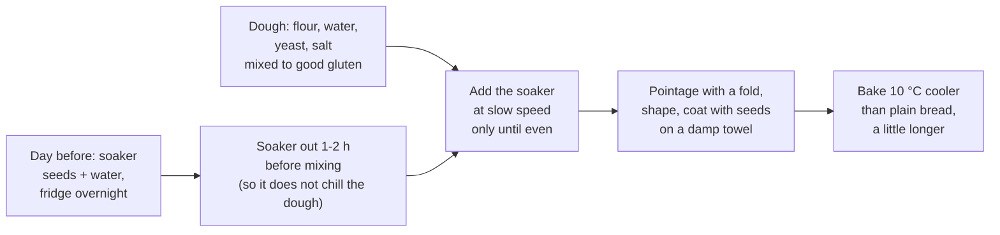

# 10.7 · Seeded and Special Breads

Seeds, grains, nuts, rye or spelt turn the day's dough into "special breads" (pains spéciaux): seeded loaves, cereal breads, walnut or raisin breads. Each addition brings flavour and sales, and each one changes the water, the gluten, the baking and the allergen list. This lesson delivers the seeded loaf with a soaker promised in lesson [02.9](../module-02/lesson-09.md), explains how inclusions and premixes are handled, and you bake a seeded tin loaf and a seed-coated bâtard.

## Why it matters

Special breads are where a bakery shows its range, and where most label and allergen mistakes happen: sesame is one of the 14 regulated allergens and travels on hands, benches and trays. The référentiel asks you to know the additives and adjuvants used in bread (S2.4), and seeded breads are where they appear most: added wheat gluten to carry the seeds, malt for colour, ready-made multigrain premixes with their own ingredient list. Technically, seeds added dry steal water from the dough and give a dry crumb that stales fast; seeds on the crust burn in a baguette oven. A soaker, the right moment to add it and a slightly cooler bake solve all three.

## Key terms

| French | Say it | English meaning |
|---|---|---|
| pain spécial | *pan spay-SYAL* | special bread: bread with added ingredients or other flours (seeds, cereals, nuts, rye, spelt) |
| pain aux graines / aux céréales | *pan oh GREN / oh say-ray-AL* | seeded bread / cereal (multigrain) bread |
| trempage | *trahm-PAHZH* | soaker: seeds or grains soaked in water before mixing |
| inclusions / garnitures | *an-klü-ZYOHN* | additions folded into a dough (seeds, nuts, dried fruit, chocolate) |
| prémix (mix céréales) | *pray-MEEKS* | ready-made blend of flours, seeds and often improvers, used for cereal breads |
| graines de lin / tournesol / sésame / courge | *GREN duh LAN / toor-nuh-SOL / say-ZAM / KOORZH* | flax / sunflower / sesame / pumpkin seeds |
| pain d'épeautre | *pan day-POH-truh* | spelt bread |
| pain aux noix | *pan oh NWAH* | walnut bread |

## How it works

### Why soak seeds

Dry seeds behave like a sponge in the dough: they take water from it during fermentation and baking, so the crumb ends up dry and stales quickly, and their hard edges cut the gluten films (lesson [02.9](../module-02/lesson-09.md)). A **soaker** gives the seeds their water in advance:

- Seeds and water (about equal weights; more water when there is a lot of flax, which forms a gel: here 125 % of the seed weight) left at least 4 hours, or overnight in the fridge.
- Toasting sunflower and sesame seeds before soaking adds a nutty flavour; seeds that go **on the crust** stay raw, because they toast in the oven (King Arthur Baking).
- The soaker water counts in the bread's total water, but the seeds hold most of it: the dough itself keeps its own hydration (King Arthur's professional seed bread counts its flax soaker water in a 73 % total).

> [!IMPORTANT]
> A soaker is a wet, nutrient-rich mixture. If it stands more than a few hours, keep it covered in the fridge, and use it within a day.

### The SE-01 sheet

| Ingredient | % | Note |
|---|---|---|
| Flour T65 | 100 | |
| Water | 66 | the dough's own hydration |
| Salt | 1.8 | checked against 1.3 g per 100 g below |
| Fresh yeast | 1.5 | direct method |
| **Soaker:** seeds (sunflower 8, flax 6, sesame 6) | 20 | 10-20 % is usual (lesson [02.9](../module-02/lesson-09.md)); 20 % is a generous seeded loaf |
| **Soaker:** water | 25 | 125 % of the seeds because of the flax |
| **Total** | **214.3** | TPV 24 °C |

**Salt check.** A seeded or cereal bread falls under the **1.3 g per 100 g** limit of the salt agreement. The seeds and soaker water dilute the salt: 1.8 ÷ 214.3 = 0.840 % of the dough. A 500 g tin loaf losing 17 %: 4.20 g in 415 g = **1.01 g per 100 g**. The same 1.8 % that is close to the limit in a baguette is comfortable here.

### Mixing with inclusions

1. **Gluten first.** Mix the dough to a good development before any seeds go in: seeds added at the start cut the gluten as it forms.
2. **Soaker at the end, slow speed,** only until evenly spread (1-2 minutes in a mixer, a few folds by hand). The dough slackens for a moment as the soaker's free water spreads, then comes back.
3. **Temperature.** A soaker straight from the fridge at 5 °C chills the dough by several degrees; take it out an hour or two before, or aim the dough 1-2 °C warmer before adding it.
4. **Fermentation** as for the base dough, with one fold to rebuild strength; seeded doughs rise less, so judge by the dough.
5. **Coating** (King Arthur Baking): roll the shaped loaf on a wet, wrung-out towel, then in a tray of raw seeds; press gently so they stick.
6. **Baking.** High-fat seeds such as sunflower and pumpkin scorch: bake about 10 °C cooler than the plain version and a little longer, until the loaf is deep brown and the core reads at least 93 °C.

### Other special breads in brief

| Bread | What changes | Process point |
|---|---|---|
| Cereal bread from a **premix** | the premix brings flours, seeds and often improvers | follow the supplier's sheet for water and mixing; read the label (below) |
| **Spelt** (épeautre) bread | spelt is a wheat with weaker, more extensible gluten (lesson [02.9](../module-02/lesson-09.md)) | mix less, ferment gently, support in a tin; spelt contains gluten |
| **Rye** breads | rye forms no gluten network and is sticky (lesson [10.3](lesson-03.md)) | more acidity (levain), wet hands, tins or bannetons; names by rye share are in [lesson 09.1](../module-09/lesson-01.md) |
| **Walnut or raisin** bread | nuts and fruit are heavy and take or release water | walnuts lightly toasted, raisins briefly soaked and drained; fold in at the end at slow speed; walnut skins colour the crumb grey-violet, which is normal |
| **Bran** bread (pain au son) | bran absorbs water and weakens gluten (lesson [10.4](lesson-04.md)) | more water, a rest, gentle mixing |

### Reading a premix label (S2.4)

A typical "mix multicéréales" label lists: wheat flour, seeds, rye flour, **wheat gluten**, malted wheat flour, emulsifier E472e, flour treatment agent **E300 (ascorbic acid)**, enzymes. From lesson [02.9](../module-02/lesson-09.md): gluten is an adjuvant that strengthens the dough so it can carry the seeds; malt flour brings amylase for fermentation and colour; E300 is an additive that strengthens the gluten; enzymes are processing aids. All of these are fine in a pain courant-type cereal bread and must be declared; none of the additives is allowed in pain de tradition française.

### Allergens and order of work

Sesame, nuts, mustard, lupin, soy, milk and all gluten cereals (wheat including spelt, rye, barley, oats) are among the 14 allergens of [Regulation (EU) No 1169/2011, Annex II](https://www.legislation.gov.uk/eur/2011/1169/annex/II) (lesson [02.11](../module-02/lesson-11.md)). Seeds jump: they stick to hands, scrapers, couches and trays. Mix and shape plain doughs **before** seeded ones, keep seeds in closed, labelled containers, clean the mixer, bench and tools after a seeded batch, and declare every allergen on the label or the shop's allergen information. Lesson [17.6](../module-17/lesson-06.md) develops the cleaning plan.

## Worked example

Tuesday: an organic shop orders **20 pains aux graines moulés of 500 g**. Sheet SE-01 (total 214.3 %), process losses 2 %, flour rounded up to the next 100 g. The bakery also makes plain pain courant and a tradition that morning.

1. **Dough.** 20 × 500 = 10,000 g; with 2 %: 10,200 g.
2. **Flour.** 10,200 ÷ 2.143 = 4,760 g → **4,800 g**. Water 3,168 g; salt 86.4 g; fresh yeast 72 g. Total 4,800 × 2.143 = 10,286.4 g ≥ 10,200 g.
3. **Soaker, Monday 15:00.** Seeds 20 % = 960 g (sunflower 384 g toasted, flax 288 g, sesame 288 g toasted) + water 25 % = **1,200 g**; covered, into the cold room. Plus 400 g of raw seeds for the tops.
4. **Order of work, Tuesday.** Tradition and pain courant mixed first; SE-01 last at 5:30, then the mixer is washed. Soaker out of the cold room at 4:00.
5. **Mixing.** Dough 4 minutes first speed, 5 minutes second speed to good development; soaker added at first speed for 2 minutes. **24.5 °C** (the soaker at 14 °C pulled it down by about 1 °C from 25.4 °C).
6. **Pointage** 50 minutes with one fold. Divide 20 × 500 g; shape cylinders; damp tops rolled in raw seeds; into greased tins.
7. **Bake** at 220 °C instead of 230 °C for the plain tin loaves, 42 minutes; turned out for the last 3 minutes; core 95 °C.
8. **Checks.** Cooled loaf 414 g (loss 17.2 %): 500 × 0.840 % = 4.20 g → **1.01 g of salt per 100 g**, under 1.3 g. Label: wheat (gluten), sesame. The bench and couches used for the seeded loaves are brushed and the couches set aside for seeded products only.

## Practice

The evening before, you make a soaker; the next day you mix SE-01 on 500 g of flour and bake one seeded tin loaf and one seed-coated bâtard of 520 g each, comparing with your pain complet of lesson [10.4](lesson-04.md) if you made it.

> [!WARNING]
> The oven is at 220-230 °C. Use dry oven gloves and long sleeves; steam only into a metal tray preheated on the lowest shelf (never water into a hot glass or ceramic dish), pour 100-150 mL of hot water, close the door and step back. If you toast seeds in a dry pan, stay with it and keep children away: sesame and sunflower seeds go from golden to burnt in seconds and the pan is very hot. Score with the blade moving away from your fingers.

> [!CAUTION]
> This bread contains sesame and gluten. Do not serve it to anyone allergic to sesame, seeds or gluten, and clean your bench, bowl and trays well before your next plain bake.

### You need

- Minimum: scale (1 g) and a 0.1 g pocket scale, probe thermometer, large bowl, lidded container for the soaker, dry frying pan (optional, for toasting), scraper, metal loaf tin of about 1.3-1.5 L, a clean tea towel to wet, a tray for the coating seeds, baking paper, baking tray, metal steam tray, oven gloves, lame, wire rack, [bake log](../../templates/bake-log.md).
- Professional equivalent: soaker tubs in the cold room, spiral mixer (slow speed for inclusions), seed bins with lids, tins, deck or rack oven.

### Ingredients

**Soaker** (the evening before):

| Ingredient | Baker's % | Home | Professional (worked example) |
|---|---|---|---|
| Sunflower seeds (toasted, optional) | 8 | 40 g | 384 g |
| Flax seeds | 6 | 30 g | 288 g |
| Sesame seeds (toasted, optional) | 6 | 30 g | 288 g |
| Water | 25 | 125 g | 1,200 g |

**Dough:**

| Ingredient | Baker's % | Home | Professional (worked example) |
|---|---|---|---|
| Flour T65 | 100 | 500 g | 4,800 g |
| Water at the calculated temperature | 66 | 330 g | 3,168 g |
| Fine salt | 1.8 | 9 g | 86.4 g |
| Fresh yeast (or 2.5 g instant dry) | 1.5 | 7.5 g | 72 g |
| Soaker (all of it) | 45 | 225 g | 2,160 g |
| **Total** | **214.3** | **1,071.5 g** | **10,286.4 g** |

Plus about 40 g of raw mixed seeds for coating. Divide 2 × 520 g = 1,040 g.

### In Israel

- **Flour:** for T65 use half white (קמח לבן) and half 80 % wheat flour (קמח חיטה 80%), as in [Flour in Israel](../../references/flour-in-israel.md); with the blend start at the 66 % of the sheet and add 2-3 points by bassinage if the dough is firm before the soaker goes in.
- **Seeds:** sunflower (גרעיני חמנייה, *garinei khamaniya*), flax (זרעי פשתן, *zar'ei pishtan*), sesame (שומשום, *shumshum*) and pumpkin seeds (גרעיני דלעת) are sold raw in bulk at spice and nut shops and packed in supermarkets. Buy **raw, unsalted** seeds: the roasted, salted sunflower and pumpkin seeds sold as snacks add salt and can push the bread over 1.3 g per 100 g. Store opened seeds in the fridge in summer: their oil turns rancid in the heat (checked 2026-10-08).
- **Soaker in a hot kitchen:** soak in the fridge only; at 28-30 °C a soaker starts to ferment within hours.
- **Spelt variant:** 100 % whole spelt flour (קמח כוסמין מלא) is sold in Israeli supermarkets, for example Stybel 14 (ingredients: whole spelt flour only; contains gluten). Spelt is a wheat with weaker gluten: replace up to half the flour with it, mix less and use a tin.
- **Water in summer:** three factors, TPV 24 °C (the soaker at room temperature does not change it much), hand friction factor 6: flour 29 °C, kitchen 30 °C: 72 − 29 − 30 − 6 = **7 °C**: fridge water.

### Steps

1. **Evening:** (optional) toast the sunflower and sesame seeds in a dry pan, stirring, 3-4 minutes until lightly golden; cool. Mix all the soaker seeds with 125 g of water in the lidded container; cover; fridge overnight (at least 4 hours).
2. **Next day:** take the soaker out 1-2 hours before mixing. Weigh it: it should still weigh about 225 g with no free water left.
3. **Water temperature:** 72 − flour − room − 6. Weigh 330 g.
4. **Mix** flour, water and yeast; add the salt; knead 10-12 minutes to a smooth dough that stretches into a film.
5. **Add the soaker:** spread it over the dough and fold and squeeze until the seeds are evenly spread (2-3 minutes); the dough loosens, then firms again. **Measure:** 24 °C ± 1 °C.
6. **Pointage** about 60-75 minutes with one fold at 30 minutes; judge by the dough.
7. **Divide** 2 × 520 g; pre-shape; détente 15 minutes.
8. **Shape** one cylinder for the greased tin and one bâtard. Wet the towel and wring it out; roll the top of the tin loaf and the whole bâtard on it, then in the tray of raw seeds. Tin loaf seam down in the tin; bâtard seam down on paper. Cover.
9. **Apprêt** about 45-60 minutes (poke test; the tin loaf to about 1 cm above the rim). Preheat to 230 °C with the baking tray on the middle shelf and the steam tray on the lowest.
10. **Bake the bâtard** with steam: one long cut through the seeds (press, do not drag), slide onto the tray, 100-150 mL of hot water, close, step back; vent at 10 minutes and lower to 220 °C; about 35 minutes.
11. **Bake the tin** at 220 °C, no steam, about 40 minutes; turn it out for the last 5 minutes if the sides are pale. Core at least 93 °C for both.
12. **Cool** 1-2 hours; weigh; calculate the loss and the salt per 100 g (pâton × 0.840 % ÷ cooled weight × 100). Clean the bench and tray; brush the seeds off the towel.

### Targets

- Soaker with no free water after soaking; seeds evenly spread through the crumb.
- Dough 24 °C ± 1 °C after the soaker; pâtons 520 g ± 2 g.
- Crust deep brown, seeds golden, not black; core at least 93 °C.
- Salt at or below 1.3 g per 100 g (expected about 1.0 g).

### How you know it worked

The crumb is moist, with seeds spread evenly and no dry pockets, and it is still soft the next day: the soaker kept the water in the bread. The seed coat sticks to the crust and is toasted golden. If you baked the dry-seed rolls of lesson [02.9](../module-02/lesson-09.md), compare: the soaker loaf is moister and keeps longer.

### Self-check

- [ ] I soaked the seeds in advance, in the fridge, and let the soaker warm up before mixing.
- [ ] I developed the gluten before adding the soaker, at a gentle speed.
- [ ] I coated with raw seeds and baked about 10 °C cooler than a plain loaf.
- [ ] My salt per 100 g is at or below the 1.3 g of cereal breads.
- [ ] I can name the allergens on my label and I cleaned up so the next bake is seed-free.

## What goes wrong

| Symptom | Likely cause | Fix now | Prevent next time |
|---|---|---|---|
| Dry crumb that stales in a day | Seeds added dry; soaker too short | — | Soak at least 4 hours (overnight in the fridge), enough water for the flax |
| Low volume, tight crumb | Soaker added at the start of mixing (gluten cut); under-developed dough | — | Develop the gluten first; soaker at the end at slow speed |
| Dough suddenly sticky and slack | Free water in the soaker; too much soaker water | Fold in pointage; shape with wet hands; use a tin | Drain or weigh the soaker; 100-125 % water on the seeds |
| Dough came out 2-4 °C too cold | Soaker straight from the fridge | Ferment somewhere warmer; allow about 7 % more time per °C | Soaker out 1-2 hours before; aim the dough a little warmer |
| Seeds on the crust burnt or bitter | Oven too hot; toasted seeds used on the outside | Lower the oven, cover with foil | Raw seeds outside; about 10 °C cooler, a little longer |
| Coating falls off | Surface not wet; seeds not pressed on | — | Damp towel, then press the loaf into the seeds |
| Sesame found in the next plain batch | Seeded batch made first; tools not cleaned | Withdraw or label the batch | Seeded doughs last; clean mixer, bench, couches; closed seed bins |
| Salt over 1.3 g per 100 g | Salted snack seeds used; small, long-baked pieces | — | Raw, unsalted seeds; check with measured losses |

## Review

- Seeds added dry steal water and cut the gluten: soak them in advance (about equal weights of water, more with flax), keep the soaker cold, add it at the end of mixing at slow speed.
- SE-01: T65 100, water 66, salt 1.8, yeast 1.5, soaker 20 % seeds + 25 % water; seeded and cereal breads must stay at or below 1.3 g of salt per 100 g, which the soaker's dilution makes easy.
- Coat with raw seeds on a damp surface and bake about 10 °C cooler and a little longer, to a core of at least 93 °C.
- Premixes and seeded breads often carry adjuvants and additives (gluten, malt, E300, enzymes): read and declare them; none of the additives is allowed in tradition.
- Plan seeded doughs last, clean after them and declare sesame, nuts and gluten cereals; allergens and labelling are also EP1 topics: see [The CAP Boulanger Exam](../../references/cap-exam.md).
