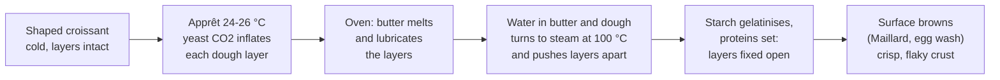

# 11.1 · How Laminated Dough Works

A croissant is a yeast dough and a sheet of butter folded together until there are dozens of thin, separate layers of each. This lesson explains how that structure is built, what holds it together in the proof and what lifts it in the oven, and why the number of turns and the temperature decide everything. You count layers with a paper model and map the temperatures of your own kitchen to find when you can laminate.

## Why it matters

Pâte levée feuilletée (laminated yeast dough: croissant, pain au chocolat, pain aux raisins) is one of the four dough families of the référentiel's viennoiserie savoir (S3.4), and croissants are among the products of the production test: see [The CAP Boulanger Exam](../../references/cap-exam.md). It is also the dough where a beginner fails most often without knowing why. A croissant that is bready, greasy or flat usually looks fine as raw dough; the fault was made an hour earlier, when the butter was too warm, too cold or rolled too many times. If you understand what the layers are and what destroys them, every rule in the next six lessons (cool détrempe, butter at about 13 °C, rests in the cold, a proof below about 27 °C) stops being a rule to memorise and becomes a consequence.

> [!NOTE]
> This is the first lesson of a practical module, so the usual reminder: watching someone laminate dough does not make you able to laminate it. Do the practice with your own hands, batch after batch. The Academy cannot grade photos, so you compare your croissants with the targets and the [quality rubric](../../templates/quality-rubric.md) yourself, and that self-assessment does not replace the official practical exam.

## Key terms

| French | Say it | English meaning |
|---|---|---|
| pâte levée feuilletée | *paht luh-VAY fuh-yuh-TAY* | laminated yeast dough: yeast dough with butter folded in layers (croissant, pain au chocolat) |
| feuilletage | *fuh-yuh-TAHZH* | lamination; also puff pastry, the same layering without yeast |
| détrempe | *day-TRAHMP* | the dough before the butter goes in (lesson [11.2](lesson-02.md)) |
| beurrage | *buh-RAHZH* | putting the butter into the détrempe and locking it in (lesson [11.3](lesson-03.md)) |
| tourage | *too-RAHZH* | giving the turns: rolling out and folding to multiply the layers (lesson [11.4](lesson-04.md)) |
| tour simple | *toor SAN-pluh* | single turn: the sheet folded in three, layers × 3 |
| tour double | *toor DOO-bluh* | double turn: the sheet folded in four (like a book), layers × 4 |
| abaisse | *ah-BESS* | the rolled-out sheet of dough; the final abaisse is the one you cut |
| laminoir | *lah-mee-NWAR* | sheeter: the bakery machine that rolls dough between two rollers |
| alvéolage en nid d'abeille | *al-vay-oh-LAHZH ahn nee dah-BAY* | honeycomb crumb: the open, layered inside of a good croissant |

## How it works

### Two materials that must behave as one

A laminated dough is made of two materials with very different natures:

- the **détrempe**: flour, water, milk, sugar, salt, yeast and a little butter, mixed into a firm, cool dough (lesson [11.2](lesson-02.md));
- the **beurre de tourage**: a flat plaque of butter, at least 82 % fat and about 16 % water (École des métiers), kept cold but bendable (lesson [11.3](lesson-03.md)).

The butter is locked inside the détrempe (the lock-in, **enfermage**), then the block is rolled out and folded several times. Each rolling stretches both materials together into thinner sheets; each fold stacks the sheets on top of one another. The result, for this course's sheet CR-01, is 27 sheets of butter separated by 28 sheets of dough.

This only works if the two materials **stretch the same way under the rolling pin**. Butter at about 13 °C (King Arthur Baking: 55 °F at the start of lamination) is plastic: it bends without breaking and spreads under pressure like modelling clay, much as the cool détrempe does. Colder, it is brittle and breaks into plates that tear through the dough; warmer, it turns soft and greasy and smears into the dough, so the layers merge. That is why every lesson in this module measures temperature (lesson [05.4](../module-05/lesson-04.md) gave the limits; this module applies them).

### How turns multiply the layers

The lock-in gives one butter layer between two dough layers. A **tour simple** (fold in three, like a letter) multiplies the butter layers by 3; a **tour double** (fold both ends to the middle, then close like a book) multiplies them by 4. Two dough sheets that come to lie against each other in a fold fuse into one, so there is always one more dough layer than butter layers.

| Sequence | Butter layers | Comment |
|---|---|---|
| 3 tours simples (CR-01) | 1 × 3 × 3 × 3 = **27** | fine, regular honeycomb; the course standard |
| 1 tour double + 1 tour simple | 1 × 4 × 3 = **12** | bolder, more open honeycomb; only two rolling sessions, useful in a warm kitchen |
| 2 tours doubles | 1 × 4 × 4 = 16 | also used |
| 4 tours simples | 81 | too many for croissant: the films break (see below) |

King Arthur Baking's home method counts "81 layers" after three folds: that count adds dough and butter sheets before the neighbouring dough sheets fuse (3 × 27). In the bakery, the number that matters is the butter layers.

### Why more layers is not better

The total amount of butter is fixed by the formula, so more layers means thinner layers. In a croissant sheet rolled to 4 mm, about a quarter of the volume is butter, roughly 1 mm in all:

- 12 layers → each butter film about 0.09 mm;
- 27 layers → about 0.04 mm;
- 81 layers → about 0.013 mm.

Below a certain thickness the butter film cannot stay continuous while it is rolled: it breaks into patches, the dough layers touch through the gaps and weld together, and the croissant bakes with a tight, bready crumb, much like a brioche. Too few layers (one single turn: 3 layers of about 0.3 mm) gives a few thick, heavy, uneven sheets that separate badly and leak. Croissant sequences sit between those extremes: 12 to 27 butter layers.

### What happens in the proof and in the oven

1. **Apprêt (proof).** The yeast in each thin dough layer produces carbon dioxide (lesson [04.1](../module-04/lesson-01.md)), so every layer swells a little: the croissant grows by about two times and turns light and wobbly. The butter must stay **solid** all this time; that is why viennoiserie proofs at about 24-26 °C, well below bread's warmer cabinet, and never above about 27 °C, the temperature King Arthur Baking gives as the limit before the butter melts and leaks.
2. **Oven, first minutes.** The butter melts. As long as the dough layers are intact, the melted fat stays trapped between them and keeps them apart.
3. **Steam lift.** The water in the butter (about 16 % of it) and in the dough reaches 100 °C and turns to steam. Steam takes far more room than water, so it pushes the dough layers apart: this is the lift that yeast alone cannot give, and it is why a croissant is flaky and a brioche is not.
4. **Setting.** The starch in each dough layer gelatinises and the proteins (gluten, milk, egg) coagulate, so the layers are fixed in their open position: the honeycomb (S4.1).
5. **Colour.** Sugar, milk and the egg wash brown the outside (Maillard reaction and caramelisation, lesson [10.6](../module-10/lesson-06.md)), giving the shiny, deep-golden, crisp crust.

If the butter had already melted into the dough before the oven, there is nothing to make steam *between* the layers, and the fat runs out onto the tray instead: the classic flat, greasy croissant sitting in a pool of butter.

### The manufacturing stages

| Stage | French | Lesson | Temperature that matters |
|---|---|---|---|
| Mix the détrempe; rest it in the cold | détrempe, pointage retardé | [11.2](lesson-02.md) | dough 18-22 °C after mixing, then 2-4 °C |
| Make the butter plaque; lock it in | beurrage, enfermage | [11.3](lesson-03.md) | butter about 13 °C |
| Roll and fold, with rests in the cold | tourage | [11.4](lesson-04.md) | dough and butter of similar firmness |
| Roll the final sheet; cut; roll up | abaisse, détaillage, façonnage | [11.5](lesson-05.md) | sheet cold and relaxed |
| Proof; egg-wash; bake | apprêt, dorure, cuisson | [11.6](lesson-06.md) | proof 24-26 °C, never above about 27 °C |
| Evaluate; report faults | contrôle | [11.7](lesson-07.md) | — |

## Worked example

Boulangerie du Marché makes croissants with 3 tours simples. A new employee says that at his last job they gave "four turns for more layers, so they rise higher" and proposes it for Saturday. The head baker asks you to predict the result on paper before anyone wastes 5 kg of butter.

1. **Layers now:** lock-in 1 × 3 × 3 × 3 = **27** butter layers.
2. **Layers proposed:** 27 × 3 = **81** butter layers.
3. **Film thickness.** The final sheet is rolled to about 3.5 mm on the sheeter. The formula has 50 % butter on the flour and the détrempe is 177 % (sheet CR-01, lesson [11.2](lesson-02.md)), so butter is 50 ÷ 227 = 22 % of the dough's weight; butter is lighter than dough, so it is about a quarter of the volume: 3.5 × 0.25 ≈ 0.9 mm of butter in total.
   - 27 layers: 0.9 ÷ 27 ≈ **0.033 mm** each.
   - 81 layers: 0.9 ÷ 81 ≈ **0.011 mm** each, three times thinner, rolled once more.
4. **Prediction.** At 81 layers the films break during the extra rolling; dough layers weld together; the croissants come out denser, with a finer, bread-like crumb and less flaky crust, not higher.
5. **What the employee may have meant.** "Four turns" in some bakeries means 2 tours doubles (4 × 4 = 16 layers), counted as two folds of four, not four single turns. Ask before changing a sheet: "tour" without "simple" or "double" is ambiguous.
6. **Decision recorded on the sheet:** "CR-01: 3 tours simples (27 couches de beurre). Ne pas ajouter de tour."

## Practice

Two short exercises: a paper model of the layers, and a two-day temperature survey of your kitchen to choose when you will laminate in lessons [11.2](lesson-02.md)-11.6. No baking yet.

### You need

- Minimum: three sheets of A4 paper, two white and one coloured (or one white sheet with a broad stripe coloured in with a marker), a ruler, a pencil, a probe thermometer, a fridge thermometer (or your probe in a glass of water in the fridge), a notebook or the [temperature log](../../templates/temperature-log.md).
- Professional equivalent: in a bakery, the laminating bench is in the coolest part of the fournil, often air-conditioned, with a reach-in fridge beside the sheeter; the cold room and freezer have displayed temperatures recorded on a log.

### Ingredients

None for this lesson. The paper stands in for dough (white) and butter (coloured).

### Steps

**Paper model (about 20 minutes).**

1. Stack white, coloured, white. This is the lock-in: 1 "butter" layer between 2 "dough" layers. Write: turns 0, butter layers 1.
2. **Tour simple:** fold the stack in three like a letter. Look at the open edge and count the coloured sheets: 3. Measure the stack thickness with the ruler (or count the sheets: 9 sheets of about 0.1 mm).
3. In dough, the rolling pin would now bring the stack back to its first thickness. Paper cannot be rolled thinner, so continue on paper and in your head: fold in three again. Count the coloured layers at the edge (9) and the sheets in the stack (27).
4. Try to fold a third time. You cannot fold 27 sheets of paper neatly: this is why the dough must be **rolled back out** between turns, and why it must rest so the gluten lets you.
5. Fill in the table below by calculation, for sequence A (3 simples), sequence B (1 double + 1 simple) and sequence C (4 simples), then the butter film thickness for a 4 mm sheet with 1 mm of butter in total.

| Sequence | Butter layers | Dough layers | Film thickness in a 4 mm sheet |
|---|---|---|---|
| A: 3 simples | | | |
| B: 1 double + 1 simple | | | |
| C: 4 simples | | | |

Answers

A: 27 butter, 28 dough, 1 ÷ 27 ≈ 0.037 mm. B: 12 butter, 13 dough, 1 ÷ 12 ≈ 0.083 mm. C: 81 butter, 82 dough, 1 ÷ 81 ≈ 0.012 mm (too thin: films break, crumb turns bready).

**Kitchen temperature survey (2 days, 2 minutes per reading).**

6. Put the probe in a glass of water on your work surface (it reads the room more steadily than air). Read and write the temperature at about 6:00, 10:00, 14:00, 18:00 and 22:00, with the air conditioning as you normally use it.
7. Read the fridge (glass of water on the middle shelf) and, if you can, the freezer once each day.
8. Mark the windows when the room is **at or below about 24 °C**: those are your lamination times. Note how long your fridge needs to firm a 2 cm slab (you will check it in lesson [11.2](lesson-02.md)).

### In Israel

Checked 2026-10-08.

- **Summer kitchens.** In a 26-32 °C summer kitchen, butter at 13 °C warms quickly on the bench and the détrempe ferments as you work. Your survey will usually show the best windows early in the morning (before about 8:00) or late at night, or in a room with the air conditioning set to about 22-24 °C. Plan to roll for no more than 10 minutes at a time, then back in the fridge.
- **Cold surfaces.** A marble or granite board, or a metal baking tray kept in the freezer and laid under the dough between rollings, keeps the bench cool. Plan freezer space for a tray of about 30 × 40 cm.
- **Fridge.** Keep it at 5 °C or below (lesson [05.4](../module-05/lesson-04.md)); a fridge that is opened often in summer may run warmer at the door: rest the dough on a middle shelf.

### Targets

- Table completed: 27 / 12 / 81 butter layers and the three film thicknesses.
- At least 10 room readings over two days, plus fridge readings, with at least one window at or below about 24 °C identified.

### How you know it worked

You can explain, without notes, why three single turns give 27 butter layers, why a fourth single turn makes croissants bready rather than higher, and what the steam does in the oven. Your survey gives you a concrete plan: "I laminate at 6:30 in the kitchen with the AC on; the fridge is at 4 °C."

### Self-check

- [ ] I can calculate the butter layers for any sequence of single and double turns.
- [ ] I can explain why butter must be plastic, about 13 °C, during lamination.
- [ ] I can describe in order what happens to yeast gas, butter, water, starch and proteins from proof to oven.
- [ ] I know the times of day when my kitchen is at or below about 24 °C.

## What goes wrong

| Symptom | Likely cause | Fix now | Prevent next time |
|---|---|---|---|
| Bready, tight crumb, little flakiness | Too many turns (films broke) or butter melted into the dough | — | Keep to the sheet's turns (27 or 12 layers); keep butter about 13 °C |
| Few thick, uneven layers; butter leaks | Too few turns, or the butter broke into plates | — | Full sequence of turns; butter plastic, not brittle |
| Croissants flat in a pool of butter | Butter melted before the oven (warm proof above about 27 °C, warm kitchen during tourage) | — | Proof at 24-26 °C; cold rests between turns |
| Baker unsure how many turns were given | Turns not marked | Count from the record or the finger marks | Mark each turn on the dough with fingertips (1, 2, 3) and on the sheet |

## Review

- Pâte levée feuilletée = détrempe + beurre de tourage, locked in and folded: a tour simple multiplies the butter layers by 3, a tour double by 4.
- CR-01 uses 3 tours simples: 27 butter layers between 28 dough layers. 1 double + 1 simple (12) is the other common sequence.
- More turns means thinner films; too many and they break, giving a bready crumb.
- Yeast lifts each layer in the proof; steam from the water in butter and dough separates the layers in the oven; starch and proteins set them.
- Butter stays solid until the oven: about 13 °C at lamination, proof below about 27 °C. Croissants in the production test: see [The CAP Boulanger Exam](../../references/cap-exam.md).
