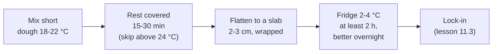

# 11.2 · The Détrempe

The détrempe is the croissant dough before the butter goes in: firm, cool, only briefly mixed, then rested flat in the cold. This lesson introduces the course's croissant sheet CR-01, explains what each ingredient does and why the détrempe is mixed short and cold, and shows the batch and water-temperature calculations. You mix a 500 g-flour détrempe by hand and chill it for the lamination in lessons 11.3 and 11.4.

## Why it matters

Half of all lamination faults start in the détrempe. A détrempe mixed too long or too warm is elastic: it shrinks back after every rolling, so you press harder, the butter warms and the layers tear. A détrempe that is too soft cannot hold the butter; one that ferments during lamination swells with gas and tears too. The référentiel asks you to name the raw materials of each viennoiserie dough and its manufacturing stages (S3.4) and the role of sugar and milk in a viennoiserie dough (S2.1); the production test makes croissants from one batch of pâte levée feuilletée (see [The CAP Boulanger Exam](../../references/cap-exam.md)). The calculation of the batch and its water is a production calculation (C1.3) of the same kind as for bread (lessons [05.2](../module-05/lesson-02.md) and [06.2](../module-06/lesson-02.md)).

## Key terms

| French | Say it | English meaning |
|---|---|---|
| détrempe | *day-TRAHMP* | the dough of a laminated product before the butter is folded in |
| farine de gruau | *fah-REEN duh grü-OH* | strong white flour (sold as T45), used for viennoiserie |
| lait entier | *leh ahn-TYAY* | whole milk |
| sucre semoule | *SOO-kruh suh-MOOL* | caster sugar |
| levure fraîche | *luh-VÜR FRESH* | fresh compressed yeast |
| pétrissage court | *pay-tree-SAHZH KOOR* | short mixing: the dough is brought together and smoothed, not fully developed |
| pointage retardé | *pwan-TAHZH ruh-tar-DAY* | retarded bulk fermentation: the dough rests in the cold (lesson 04.6) |
| abaisser | *ah-bess-SAY* | to roll out or flatten dough |

## How it works

### The course croissant sheet: CR-01

Every croissant in this course, and the croissant lamination reused for pains au chocolat in the next module, uses one sheet. It sits inside the croissant column of the [base formulas](../../references/formulas.md).

| CR-01 — Croissant (pâte levée feuilletée) | Baker's % | Role |
|---|---|---|
| Flour T45 (gruau, or T45 with part gruau) | 100 | strong enough to hold thin layers and stretch without tearing |
| Water, cold | 26 | hydration; part of the liquid |
| Whole milk, cold | 26 | softer, finer crumb, golden crust (lactose is not fermented), flavour |
| Caster sugar | 11 | flavour, colour; feeds the yeast; slightly tenderises |
| Salt | 2.0 | flavour, tightens gluten, controls the yeast |
| Fresh yeast (instant dry: one third) | 4.0 | enough gas despite a cold dough and long cold rests |
| Butter in the dough (soft) | 8 | makes the détrempe extensible and the crumb tender |
| **Détrempe total** | **177.0** | |
| Beurre de tourage (lesson 11.3) | 50 | the layers |
| **Laminated dough total** | **227.0** | |

Process targets: détrempe **18-22 °C** after mixing (aim for 20 °C); short mixing; flattened to a slab about 2-3 cm thick and chilled at 2-4 °C for at least 2 hours, better overnight (8-16 hours); lock-in with butter at about 13 °C; **3 tours simples** with 20-45 minutes in the fridge between them (lesson 11.4); final sheet about 3.5 mm; triangles 11 × 30 cm, about **60 g** ± 3 g, the thickness adjusted to hit the weight (lesson 11.5); proof at 24-26 °C, never above about 27 °C, until almost doubled; two thin coats of egg wash; bake 190-200 °C (fan 175-180 °C), 16-20 minutes, no steam (lesson 11.6).

Why these numbers, briefly:

- **Liquid 52 % (half water, half milk).** A firm dough (lesson [02.4](../module-02/lesson-04.md): viennoiserie détrempe 50-60 %), so it rolls without sticking and has a firmness close to cold butter. Milk is about 88 % water, so the real hydration is lower than 52 %: firm on purpose.
- **Yeast 4 %, more than twice pain courant's.** The dough spends hours at 2-4 °C and is proofed cooler than bread, so it needs more yeast to rise in a working time. Sugar at 11 % also slows yeast slightly (lesson [02.6](../module-02/lesson-06.md)).
- **Salt 2.0 %.** The bread salt limits of lesson [02.5](../module-02/lesson-05.md) apply to bread categories, not to viennoiserie; the formulas page uses 2.0 % for all viennoiserie doughs.
- **Butter 8 % in the dough.** A little fat coats the gluten (lesson [02.8](../module-02/lesson-08.md)): the détrempe stretches more easily and the baked layers are tender rather than tough.

### Mix short, keep cool

A bread dough is mixed until its gluten is fully developed (lesson [03.3](../module-03/lesson-03.md)). A détrempe is **not**: it is mixed only until it is homogeneous and fairly smooth, because the turns will roll and stretch it many more times, and every rolling develops the gluten further. King Arthur Baking's croissant class stops kneading when the dough is "cohesive and slightly springy, but not smooth", warning that too much gluten now makes the dough hard to roll later. An over-developed détrempe is elastic: it springs back after each rolling, so you press harder, and pressure plus time warms the butter.

The détrempe is kept **cool, 18-22 °C at the end of mixing**, for two reasons (lesson [05.4](../module-05/lesson-04.md)): its firmness must match cold butter, and it must not ferment much during the hours of lamination. A warm détrempe swells with gas during the turns; gas bubbles tear the thin layers and the dough becomes soft and sticky.

### Water temperature: the liquid is water plus cold milk

The water is calculated with the base-temperature method of lesson [05.2](../module-05/lesson-02.md), three factors (no pre-ferment):

$$\text{liquid temperature} = 3 \times \text{TPV} - \text{flour} - \text{room} - \text{friction factor}$$

In CR-01 the "water" of the formula is the whole liquid: water and milk in equal weights. The milk comes from the fridge at about 4 °C. Since the two weights are equal, the liquid's temperature is roughly their average, so:

$$\text{water} = 2 \times \text{liquid temperature} - \text{milk temperature}$$

If the result is below what your tap or fridge water can give, use ice counted inside the water weight: ice = water × (tap − wanted) ÷ (tap + 80) (lesson [05.3](../module-05/lesson-03.md)). The friction factor is small because the mixing is short: about 6 for a short hand knead (about 2 °C of heating), about 9-15 for a short mix on a spiral (lesson 05.3).

### After mixing: rest, flatten, chill

- **A short rest** at room temperature lets the gluten relax and fermentation start. In a warm kitchen, skip it.
- **Flatten** the dough into a square slab about 2-3 cm thick before chilling: a slab cools right through in about an hour, a ball takes several. It will also need less rolling at the lock-in.
- **Chill** wrapped in film or a bag (no skin) at 2-4 °C. This is a pointage retardé (lesson [04.6](../module-04/lesson-06.md)): the cold slows the yeast, the gluten relaxes, the flavour develops, and the dough firms to the butter's firmness. Bakeries usually mix the détrempe the day before. King Arthur Baking asks for at least 5 hours or overnight at home, and notes that a détrempe can also be frozen and used later.

## Worked example

Friday, Boulangerie du Marché. Saturday's order: **120 croissants of 60 g** (raw dough). The sheet is CR-01 (227 %). Trims when cutting triangles from the sheet: plan for 10 % of the laminated dough (lesson 11.5); process losses 2 %; flour rounded up to the next 100 g. Readings: flour 21 °C, fournil 23 °C, milk from the cold room 3 °C, tap water 18 °C. Short mixing on the spiral: friction factor 12 (three factors), TPV 20 °C.

1. **Dough in the pieces:** 120 × 60 = 7,200 g.
2. **Laminated dough before cutting:** the pieces are 90 % of the sheet, so 7,200 ÷ 0.90 = 8,000 g. (Multiplying by 1.10 would give 7,920 g, a little short: lesson [06.3](../module-06/lesson-03.md).)
3. **With process losses:** 8,000 × 1.02 = 8,160 g.
4. **Flour:** 8,160 ÷ 2.27 = 3,595 g → **3,600 g**.
5. **Every ingredient:** water 936 g, milk 936 g, sugar 396 g, salt 72 g, fresh yeast 144 g, butter in dough 288 g → détrempe 6,372 g; beurre de tourage 1,800 g; total 8,172 g ≥ 8,160 g.
6. **Liquid temperature:** 3 × 20 − 21 − 23 − 12 = **4 °C**.
7. **Water temperature:** 2 × 4 − 3 = **5 °C**: colder than the tap.
8. **Ice:** 936 × (18 − 5) ÷ (18 + 80) = 124 g of ice and 812 g of tap water (or 936 g from the water cooler set at 5 °C).
9. **Mixing:** 4 minutes first speed, 3 minutes second; check: smooth but not elastic; 20.5 °C. Divided into two slabs of about 3.2 kg (one per lamination on the sheeter), flattened, wrapped, cold room 3 °C until 4:00 on Saturday.

## Practice

You mix CR-01 on 500 g of flour by hand, reach 18-22 °C, flatten the détrempe and chill it overnight. You will lock in the butter in lesson 11.3 and give the turns in lesson 11.4, so plan the next morning (use your kitchen survey from lesson 11.1).

> [!CAUTION]
> This dough contains wheat (gluten) and milk, two of the 14 regulated allergens. Keep it and its tools away from anyone allergic, and wash surfaces after. If you use a stand mixer, keep hands and scrapers out of the bowl while the hook turns; stop the machine before scraping down.

### You need

- Minimum: scale (1 g) and 0.1 g pocket scale for salt and yeast, probe thermometer, large bowl, dough scraper, rolling pin, cling film or a large freezer bag, ruler, the [temperature log](../../templates/temperature-log.md) and a [production sheet](../../templates/production-sheet.md).
- Professional equivalent: spiral mixer on short mixing, water cooler or ice, cold room or reach-in fridge at 2-4 °C, détrempe slabs on floured trays covered with film.

### Ingredients

| Ingredient | Baker's % | Home batch | Bakery batch |
|---|---|---|---|
| Flour T45 (gruau) | 100 | 500 g | 1,000 g |
| Water, at the calculated temperature | 26 | 130 g | 260 g |
| Whole milk, from the fridge | 26 | 130 g | 260 g |
| Caster sugar | 11 | 55 g | 110 g |
| Fine salt | 2.0 | 10 g | 20 g |
| Fresh yeast (or instant dry 7 g / 13 g) | 4.0 | 20 g | 40 g |
| Butter, soft (about 16-18 °C) | 8 | 40 g | 80 g |
| **Détrempe** | **177.0** | **885 g** | **1,770 g** |
| Beurre de tourage (lesson 11.3) | 50 | 250 g | 500 g |
| **Laminated dough** | **227.0** | **1,135 g** | **2,270 g** |

The home batch gives 16 croissants of about 60 g (lesson 11.5): 12 for evaluation and 4 for tests.

### In Israel

Checked 2026-10-08.

- **Flour.** White flour (קמח לבן, *kemakh lavan*) stands in for T45 ([Flour in Israel](../../references/flour-in-israel.md)). Take the plain white flour with about 11-12 g of protein per 100 g on the label. A "bread flour" with ascorbic acid in the ingredients (חומצה אסקורבית / E300) is legal in viennoiserie, but it makes the détrempe more elastic: give longer rests if you use it. Never self-raising flour (קמח תופח).
- **Milk.** Fresh milk (חלב, *khalav*): read the fat percentage on the label and take the highest on the shelf.
- **Yeast.** Fresh yeast (שמרים טריים, *shmarim triyim*) from the chilled section, or instant dry yeast (שמרים יבשים, *shmarim yeveshim*) at one third of the weight, 7 g, mixed into the flour, never into the cold liquid.
- **Water in a summer kitchen.** Example with the AC off: flour 29 °C, kitchen 30 °C, friction factor 6: liquid = 60 − 29 − 30 − 6 = −5 °C, impossible. Put the flour in the fridge the evening before (it reaches about 6-8 °C) or mix in the air-conditioned room: flour 8 °C, room 25 °C → liquid = 60 − 8 − 25 − 6 = 21 °C; water = 2 × 21 − 4 = 38 °C. Check that: warm water on cold flour works, but never above about 40 °C on fresh yeast. A middle path: flour from the fridge for 2-3 hours (about 15 °C), room 25 °C: liquid 14 °C, water 24 °C.
- **Butter in the dough.** Unsalted butter (חמאה, *khem'a*), not a spread (ממרח): see lesson 11.3 for the label.
- **Dairy dough.** In a kosher-keeping household this dough is dairy (חלבי, *khalavi*).

### Steps

1. **Measure** the flour and the room. Calculate the liquid temperature with friction factor 6, then the water (milk at its fridge temperature). Write it on the temperature log.
2. **Dry mix.** In the bowl: flour, sugar, salt on one side; fresh yeast crumbled on the other (or instant yeast stirred into the flour). Rub the soft butter into the flour with your fingertips until no lumps remain.
3. **Add the liquid** (water and milk together) and mix with the scraper to a shaggy mass, then turn it out.
4. **Knead about 4-5 minutes**: fold the far edge towards you, push away with the heel of the hand, quarter turn, repeat, gently at first. Stop when the dough is cohesive, fairly smooth and only slightly springy. Do not knead to a windowpane.
5. **Measure** the dough: target 18-22 °C. Write it.
6. **Rest** covered 15-20 minutes (skip if the kitchen is above about 24 °C).
7. **Flatten** with your hands and the rolling pin into a square about 18 × 18 cm (about 2.5 cm thick). Wrap tightly.
8. **Chill** on a flat shelf at 2-4 °C, at least 2 hours, better overnight. Check after 1 hour: the centre should be below 10 °C, and the dough firm but still bendable. Write the time.

### Targets

- Détrempe 885 g ± 5 g at 18-22 °C after mixing.
- Kneading 4-5 minutes; dough cohesive and fairly smooth, not elastic.
- Slab about 18 × 18 × 2.5 cm, wrapped, in the fridge within 30 minutes of mixing.

### How you know it worked

The next morning the slab is cold (about 4 °C), firm, slightly puffy but not ballooned, and when you press it with the rolling pin it spreads and stays where you put it instead of springing back. The cut edge (if you trim a corner) shows a few small bubbles, not large gas pockets. If it fought the rolling pin, it was mixed too long or too warm: note it for the next batch.

### Self-check

- [ ] I calculated the liquid and water temperature with cold milk as part of the liquid.
- [ ] My détrempe came out between 18 and 22 °C.
- [ ] I stopped kneading at "cohesive and slightly springy", not at full development.
- [ ] I flattened and wrapped the détrempe before chilling and wrote the times on the log.
- [ ] I can give the role of each ingredient of CR-01.

## What goes wrong

| Symptom | Likely cause | Fix now | Prevent next time |
|---|---|---|---|
| Détrempe springs back, shrinks after rolling | Over-mixed; too warm; strong flour with ascorbic acid | Longer rest in the fridge (30-60 min more) before the lock-in | Short mixing; colder liquid; plain flour; deactivated yeast is an option in bakeries (lesson [02.9](../module-02/lesson-09.md)) |
| Détrempe ballooned with gas in the fridge | Dough too warm; slab too thick to cool; fridge too warm | Press out the gas, flatten thinner, chill again | 18-22 °C; flat slab; fridge at 2-4 °C |
| Dough sticky, too soft to roll | Too much liquid; warm; milk measured by volume | Chill it longer; dust lightly | Weigh the liquid; colder dough |
| Dough dry, tearing at the edges | Liquid too low; flour very absorbent | Rest it covered longer | Add 1-2 % liquid next batch and note it on the sheet |
| Dough above 22 °C after mixing | Water not calculated; warm flour; long kneading | Flatten thin and chill at once, 30 min extra | Measure inputs; fridge flour in summer |

## Review

- CR-01: T45 100, water 26, milk 26, sugar 11, salt 2.0, fresh yeast 4.0, butter 8 (détrempe 177 %); beurre de tourage 50; laminated dough 227 %.
- The détrempe is mixed short (cohesive, slightly springy) because the turns develop the gluten further.
- Target 18-22 °C after mixing; the liquid is water plus cold milk: water = 2 × liquid temperature − milk temperature.
- Flatten to a slab and chill at 2-4 °C, at least 2 hours, better overnight (a retarded pointage).
- Batch: pieces ÷ usable share of the sheet (0.90), × 1.02, ÷ 2.27. Viennoiserie in the exam: [The CAP Boulanger Exam](../../references/cap-exam.md).
