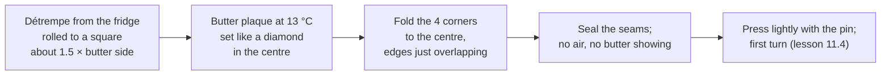

# 11.3 · Butter and Beurrage

The butter makes the layers, so its kind, its shape and above all its temperature decide the croissant. This lesson compares the fats a bakery can laminate with, explains plasticity and the 13 °C target, and shows how to make a butter plaque and lock it into the détrempe. You test butter at three temperatures, make a 250 g plaque and lock it into the détrempe you chilled in lesson 11.2.

## Why it matters

A croissant pur beurre is sold on its butter: the customer pays for it, and only butter may be used for that name (lesson [02.8](../module-02/lesson-08.md)). In the fournil, the butter is also the most temperature-sensitive ingredient you will handle. A plaque that is uneven gives thick and thin layers; a plaque that is too cold shatters in the first turn; one that is too warm is already smearing into the dough before you start. The référentiel asks you to know the types of butter and margarine by use, fat content and regulation, and the role of fats in a dough (S2.2), and to make laminated dough (C2.3). In the production test, the beurrage is part of the work the examiners watch (see [The CAP Boulanger Exam](../../references/cap-exam.md) for what is done with the rolling pin and what on the sheeter).

## Key terms

| French | Say it | English meaning |
|---|---|---|
| beurrage | *buh-RAHZH* | putting the butter into the détrempe |
| beurre de tourage / beurre sec | *buhr duh too-RAHZH / buhr SEK* | laminating butter: firmer, slightly higher in fat (about 84 %), plastic over a wider range |
| plaque de beurre | *PLAHK duh BUHR* | flat square or rectangle of butter, ready to lock in |
| plasticité | *plas-tee-see-TAY* | plasticity: the ability to bend and spread under pressure without breaking or melting |
| enfermage | *ahn-fair-MAHZH* | the lock-in: closing the détrempe around the butter |
| en enveloppe | *ahn ahn-VLOP* | envelope lock-in: butter set like a diamond, the four corners of dough folded over it |
| margarine de tourage | *mar-gah-REEN duh too-RAHZH* | laminating margarine, vegetable fat; never for a "pur beurre" product |
| croissant pur beurre | *krwah-SAHN pür BUHR* | croissant whose only fat is butter |

## How it works

### Which fat?

| Fat | Fat / water | For lamination? |
|---|---|---|
| Butter (beurre doux) | at least 82 % fat, about 16 % water | yes: the reference for pur beurre; plastic over a narrower range, so temperature control is strict |
| Beurre de tourage / beurre sec | about 84 % fat (Elle & Vire's extra-dry butter), less water | the bakery choice: firmer, plastic over a wider range, sold in flat plaques |
| Beurre concentré / cuisinier | 96-99.8 % fat, almost no water | no: too little water for steam, and brittle cold; for frying and pastry |
| Margarine de tourage | vegetable fats and water, made to be plastic | technically easy, but the product cannot be called pur beurre |
| Reduced-fat butters and spreads | 20-65 % fat, stabilisers added | no: too much water, no plasticity; they tear and leak |

Fat figures from the École des métiers butter sheet and Elle & Vire's professional formula. Butter is a mixture of fats with different melting points: at fridge temperature many of them are crystallised and the block is hard and brittle; as it warms, more crystals melt and it softens, until it is greasy well before it is fully liquid. **Plasticity** sits in between: enough solid crystals to keep a sheet, enough liquid fat to let the sheet bend and slide. For ordinary butter this window is narrow, around 12-15 °C; laminating butters are made to keep it over a few more degrees.

### The 13 °C target and the bend test

King Arthur Baking puts the butter at 55 °F (about 13 °C) at the start of lamination and gives the test every baker uses: the plaque **bends without breaking** when you fold a corner over. Lesson [05.1](../module-05/lesson-01.md) placed it on the temperature ladder: colder, it breaks into pieces; warmer, it smears into the dough.

| Butter | Bend test | Under the rolling pin |
|---|---|---|
| 4 °C, straight from the fridge | snaps | breaks into plates that cut through the dough |
| about 13 °C | bends, stays in one piece, cool and waxy | spreads with the dough in an even sheet |
| 20 °C or more | droops, sticks to the fingers | smears into the dough; layers lost |

What matters in the end is that butter and détrempe have the **same firmness**: press both with a finger; they should resist about the same. A cold détrempe at 4 °C with butter at 13 °C works because the dough is firm but not brittle. If the détrempe is softer than the butter, the butter tears it; if the butter is softer, it squeezes out at the edges.

### Making the plaque

1. Cut the cold butter into slices about 1 cm thick and lay them side by side on baking paper.
2. Fold the paper into a square envelope of the size you want (15 × 15 cm for 250 g), with the butter inside.
3. Beat it with the rolling pin to soften it evenly (King Arthur Baking: "the consistency of modelling clay"), then roll it to fill the envelope right into the corners, with an even thickness (about 1.2 cm for 250 g).
4. Chill or temper it until the centre reads about 13 °C and it passes the bend test.

Beating makes cold butter plastic without warming it much: the pressure breaks the crystal network mechanically. Bakeries buy beurre de tourage already in flat plaques (often 1-2 kg) and only temper it; Elle & Vire's formula rolls its laminating butter to a 6 mm sheet for a large batch.

### Locking in: the envelope

- Roll the cold détrempe to a square about 1.5 times the side of the butter square (22-23 cm for a 15 cm plaque), so the corners of the dough just meet over the centre. Keep it slightly thicker in the middle than at the corners, so the four folded flaps do not make a thick lump.
- Set the butter **like a diamond** (rotated 45°): its points face the middle of each dough side.
- Fold each corner of dough over the butter to the centre; overlap the edges only a few millimetres and pinch the seams closed. Trapped air becomes a bubble that bursts in the turns; exposed butter sticks and tears.
- Another lock-in, common with sheeters: the butter sheet covers one half of a rectangle of détrempe and the other half is folded over it. Both give **one** butter layer, so the layer counts of lesson 11.1 do not change.

The block now holds one layer of butter between two of dough, ready for the first turn.

## Worked example

Saturday, 4:00, Boulangerie du Marché. Two détrempe slabs of about 3.2 kg each (lesson 11.2) are in the cold room at 3 °C. Each needs 900 g of beurre de tourage. The store has two products: "Beurre doux 82 % MG, 10 × 250 g" and "Beurre de tourage 84 % MG, plaques de 2 kg". The fournil is at 23 °C. The croissants are sold as croissants pur beurre.

1. **Choice of fat.** Both are butter, so both allow "pur beurre". The beurre de tourage is firmer and plastic over a wider range, and comes as a flat plaque: less work, less warming of the butter, more forgiving in a 23 °C fournil. Choose it. (A laminating margarine would be cheaper but would forbid the "pur beurre" name.)
2. **Dividing.** 900 g are cut from a 2 kg plaque with a long knife (the 200 g left are wrapped, labelled and returned to the cold room).
3. **Size of the plaque.** Butter density is about 0.91 g/cm³: 900 ÷ 0.91 ≈ 990 cm³. For a sheet about 1.2 cm thick: 990 ÷ 1.2 ≈ 825 cm² → a square of about **29 × 29 cm** (29 × 29 = 841). The détrempe square for an envelope lock-in: 1.5 × 29 ≈ **43 × 43 cm**.
4. **Temperature.** The plaques read 4 °C from the cold room. Beaten between two sheets of paper and rolled to 29 × 29 cm, they rise to about 9 °C; 10 minutes on the bench at 23 °C bring them to 12-13 °C. The bend test passes: corner folds over without cracking.
5. **Check before lock-in.** Détrempe at 4 °C, firm, does not spring back; butter at 13 °C. Finger test: similar resistance. Lock-in at 4:20; first turn at once (lesson 11.4).
6. **Record.** On the production sheet: "Beurre de tourage 84 %, lot n° …, 2 × 900 g, 13 °C à l'enfermage, 4:20." The lot number keeps traceability if a customer complains (Module 17).

## Practice

Three steps: a plasticity test at three temperatures, a 250 g plaque, and the lock-in of your 11.2 détrempe. Give the first turn straight after (lesson 11.4), or wrap the block and keep it in the fridge for up to 30 minutes.

> [!CAUTION]
> Butter and the détrempe contain milk; the détrempe also contains wheat (gluten). Keep both away from anyone allergic and wash the board, pin and paper area after. Beat the butter on a stable board, not on a glass surface, with your fingers clear of the pin.

### You need

- Minimum: scale (1 g), probe thermometer, rolling pin, baking paper, ruler, a sharp knife, a cutting board, cling film, the [temperature log](../../templates/temperature-log.md).
- Professional equivalent: beurre de tourage in flat plaques, a cool laminating bench (marble or stainless steel), a reach-in fridge beside it, a sheeter for the lock-in of large blocks ([Module 13](../module-13/lesson-02.md)).

### Ingredients

| Ingredient | Baker's % | Home batch | Bakery batch |
|---|---|---|---|
| Beurre de tourage or unsalted butter (at least 82 % fat), cold | 50 | 250 g | 500 g |
| Extra butter for the bend test (use it later for cooking) | — | 3 × 20 g | — |
| Détrempe CR-01 from lesson 11.2, chilled | 177 | 885 g | 1,770 g |

### In Israel

Checked 2026-10-08.

- **Which butter.** Buy a product called butter (חמאה, *khem'a*), unsalted (ללא מלח, *lelo melakh*). On the label: ingredients cream only (שמנת, *shamenet*), and in the nutrition table (ערכים תזונתיים) fat (שומנים, *shumanim*) of about 80-83 g per 100 g. Reject a spread (ממרח, *mimrakh*), "reduced fat" (מופחת שומן), or a blend with vegetable oil (שמן צמחי): too much water, no plasticity. Imported European butters labelled 82 % or more, sold in some supermarkets and delicatessens, are a good choice; the label decides, not the brand.
- **Margarine and parve.** Margarine (מרגרינה) and products labelled parve (פרווה, *parve*: no milk) contain no butter. Laminating with margarine is a legitimate technique, but the result is not a croissant pur beurre.
- **Professional supply.** Baking-supply wholesalers sell butter and margarine for lamination in plaques; ask for the product sheet and check the fat percentage before buying.
- **Summer timing.** In a 30 °C kitchen, a 1.2 cm plaque warms from 4 °C to 13 °C in only a few minutes on the bench and keeps going. Beat it straight from the fridge, measure, and if it passes 15 °C put it back for 5-10 minutes. Work on the marble or the frozen tray from lesson 11.1, early in the morning or with the AC on.

### Steps

**Bend test (10 minutes).**

1. Cut three 20 g pieces of butter, about 5 mm thick. Leave one in the fridge (about 4 °C), let one warm to about 13 °C (probe it), leave one on the bench until about 20 °C or more.
2. Bend each one over your finger. Write: snaps / bends / droops. Then press each between two sheets of paper with the rolling pin: write how it spreads.

**Plaque (15 minutes).**

3. Fold a sheet of baking paper into a 15 × 15 cm square envelope (fold, crease, unfold to place the butter).
4. Slice 250 g of cold butter about 1 cm thick, lay the slices in the centre, close the paper, beat with the pin for about a minute, then roll to fill the envelope to the corners, about 1.2 cm thick and even.
5. Probe the centre. Fridge (or bench) until it reads **12-15 °C, ideally 13 °C**, and passes the bend test.

**Lock-in (15 minutes).**

6. Take the détrempe from the fridge (it should read 2-6 °C). On a lightly floured bench roll it to a square of about **22 × 22 cm**, slightly thicker in the centre.
7. Finger test: press the détrempe and the butter (still in its paper). Similar firmness? If the butter is much harder, wait 2-3 minutes; if softer, chill it 5 minutes.
8. Unwrap the butter and set it like a diamond on the dough. Fold the four corners to the centre, overlap a few millimetres, pinch all seams closed. Check: no air pockets, no butter visible.
9. Press the block gently all over with the rolling pin (light ridges) to bond butter and dough. Write the times and temperatures. Go straight on to lesson 11.4, or wrap and fridge for up to 30 minutes.

### Targets

- Plaque 250 g, 15 × 15 cm ± 1 cm, even thickness (about 1.2 cm).
- Butter 12-15 °C (13 °C ideal) at the lock-in; détrempe 2-6 °C.
- Block about 15-16 cm square, fully sealed, no butter exposed.

### How you know it worked

Your bend test showed three clearly different behaviours, and you can feel the "cool, waxy, bends" state that you want. The plaque is flat and square, without thin corners. The locked-in block is a neat square cushion: when you press it with the pin, the butter moves with the dough and nothing squeezes out at the seams.

### Self-check

- [ ] I can name five fats and say which are suitable for lamination and which allow "pur beurre".
- [ ] I measured the butter at 12-15 °C and it passed the bend test.
- [ ] My plaque was square and even before the lock-in.
- [ ] The lock-in had no air pockets and no exposed butter.
- [ ] I wrote the times and temperatures on the log.

## What goes wrong

| Symptom | Likely cause | Fix now | Prevent next time |
|---|---|---|---|
| Butter cracks when bent; breaks in the first rolling | Butter too cold (below about 10 °C) | Rest the block 5 minutes on the bench, then roll gently | Temper to 13 °C; beat cold butter with the pin first |
| Butter oozes out at the seams; greasy hands | Butter too warm or softer than the dough | Wrap and chill 15-20 minutes | Measure the butter; work in the coolest window |
| Thick butter in the centre, none in the corners | Plaque uneven; corners thin | Roll the block more at the thick part in the first turn | Paper envelope; roll butter into the corners |
| Air bubble under the dough | Air trapped at the lock-in | Prick the bubble with a pin, press flat | Fold corners close to the butter; press out air before sealing |
| Dough cracks at the lock-in folds | Détrempe too cold and stiff | Wait 3-5 minutes | Take the détrempe out a few minutes before rolling |
| Layers tear, croissants watery and flat | Spread or reduced-fat butter used | — | Read the label: butter, about 80-83 g fat per 100 g |

## Review

- Butter has at least 82 % fat and about 16 % water; beurre de tourage (about 84 %) is firmer and plastic over a wider range; concentrated butter and spreads are unsuitable.
- Only butter may be used for a croissant pur beurre; laminating margarine is a technique, not a pur beurre product.
- Butter at about 13 °C bends without breaking; what matters is that butter and détrempe have the same firmness.
- Make an even, square plaque (beaten then rolled in a paper envelope) and lock it in like an envelope: diamond, four corners, sealed, no air.
- The beurrage in the production test: see [The CAP Boulanger Exam](../../references/cap-exam.md).
