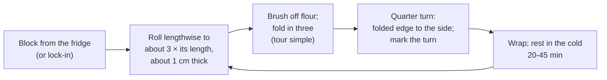

# 11.4 · Tourage: Turns, Rest and Temperature

Tourage turns one layer of butter into 27: you roll the block out, fold it in three, rest it in the cold, and repeat. This lesson explains how to roll so the butter stays a continuous sheet, how long to rest and how to tell when the dough is ready again, and how the bakery's sheeter does the same job. You give your locked-in block three tours simples with a rolling pin.

## Why it matters

The turns are where the croissant is won or lost, and they are invisible afterwards: a torn butter layer or a smeared corner shows only when you cut the baked croissant. A regular tourage gives a regular honeycomb in every piece; an uneven one gives croissants that differ from one end of the sheet to the other. Bakeries laminate on a sheeter (laminoir), one of the viennoiserie machines the référentiel names (S3.4), but the production test has a specific rule about which steps are done by rolling pin: read it in [The CAP Boulanger Exam](../../references/cap-exam.md). Either way you must be able to give clean turns by hand and judge the dough between them.

## Key terms

| French | Say it | English meaning |
|---|---|---|
| tourage | *too-RAHZH* | giving the turns: roll out, fold, rest, repeat |
| tour simple (pli en trois) | *toor SAN-pluh (plee ahn TRWAH)* | single turn: fold in three like a letter; butter layers × 3 |
| tour double (pli en quatre, en portefeuille) | *toor DOO-bluh (plee ahn KAT-ruh, ahn port-FUH-yuh)* | double turn: both ends to the middle, then closed like a book; layers × 4 |
| donner un tour | *do-NAY uhn TOOR* | to give a turn |
| repos au froid | *ruh-POH oh FRWAH* | rest in the cold between turns |
| fleurer / brosser | *fluh-RAY / bross-SAY* | to dust with flour / to brush the excess flour off |
| laminoir | *lah-mee-NWAR* | sheeter: two rollers with an adjustable gap and a belt on each side |
| marquer les tours | *mar-KAY lay TOOR* | to mark the turns given with fingertip impressions |

## How it works

### One turn, step by step

1. **Roll in one direction.** Start in the middle and roll towards each end, lifting the pin before the edge so the end does not thin out. Keep the width: roll lengthwise only, nudging the sides straight with the pin or your palms. Roll to about **three times the length** of the folded block (for the home block, about 20 × 50 cm, about 1 cm thick).
2. **Dust lightly, brush off.** A little flour stops sticking; any flour left on the surface is folded in between the layers, where it stays raw and dry and stops the layers bonding. Brush it off before every fold.
3. **Fold in three.** Bottom third up, top third down over it, edges aligned, corners square. A misaligned fold leaves a strip with two layers instead of three: an uneven zone in every croissant cut from it.
4. **Quarter turn.** Turn the block 90° so the folded edge is on your left, like a closed book: the next rolling stretches the dough in the other direction, which balances the gluten tension and keeps the block square.
5. **Mark the turn.** Press one fingertip into the block after the first turn, two after the second, three after the third, and write it on the sheet. In a busy fournil nobody remembers.
6. **Rest in the cold**, wrapped (lesson 11.1 survey: in the fridge at 2-5 °C).

A **tour double** follows the same rules: roll to about four times the length, fold one end to about a quarter from the other end and the other end to meet it, then close the two halves like a book.

### How long to rest, and why

Every rolling warms the block (the bench, your hands, the room) and stretches the gluten, which then pulls back. The rest does two things: the cold firms the butter and the dough again, and the gluten relaxes so the next rolling is easy.

- King Arthur Baking's home method chills about 45 minutes between folds and warns that longer makes the butter too hard; its croissant class uses 20 minutes, then 45. Elle & Vire's professional formula rests a large block one hour in the fridge after each turn. For the home block, **20-45 minutes in the fridge** is the working range.
- **Ready again** when: the block is cold and firm but bends without cracking when you lift a corner; pressing with the pin leaves a dent that stays; the dough does not spring back.
- **Too cold** (very long rest, or freezer): the butter breaks under the pin into plates, visible as streaks or patches through the dough. Leave the block on the bench 5 minutes and roll gently.
- **Too warm**: the dough feels soft and greasy, butter shows at the edges or sticks to the pin. Stop, wrap, chill 15-20 minutes more.
- **Too elastic** (springs back): the gluten needs more rest, not more force. Wrap and rest 15 minutes.

After the last turn the block rests longer: at least 30-60 minutes, or overnight in the fridge (King Arthur Baking: at least 5 hours or overnight), before the final rolling (lesson 11.5). A long cold rest also lets the dough relax so the triangles do not shrink after cutting. A block can also be frozen at this stage.

### Temperature budget in a warm room

Each rolling session should be short: about 5-10 minutes for a home block. In a 24 °C room the block warms only a little in that time; in a 30 °C room it can warm several degrees, and the thin edges first. That is why a warm kitchen needs shorter sessions, a frozen tray or marble under the dough, and sometimes 10 minutes in the freezer in place of part of the fridge rest (never long enough for the butter to go brittle). Sequence B of lesson 11.1 (1 tour double + 1 tour simple, 12 layers) needs only two rolling sessions instead of three: a sound choice when the room is warm.

### The sheeter

In the bakery, a laminoir does the rolling: the block goes on a belt and passes between two rollers whose gap is reduced in steps, back and forth, until the sheet is the thickness wanted. It gives a perfectly even thickness in seconds, so the dough spends less time warming. The rules of the hand method still apply: reduce the gap **gradually** (a big step crushes and tears the layers), dust lightly, fold and rest the same way. Module 13 covers the machine itself.

> [!CAUTION]
> A sheeter's rollers can draw in and crush fingers. Use one only after you have been trained on that machine: guards closed, hands never near the rollers or under the protective grid while the belts run, stop the machine before reaching in to straighten the dough, and clean it only switched off and unplugged as its instructions say.

## Worked example

Saturday, Boulangerie du Marché. Two blocks of CR-01 (each about 4.1 kg: 3.2 kg détrempe + 900 g beurre de tourage) are locked in at 4:20. The laminating bench is in a fournil at 24 °C; the deck ovens heat it a little more every hour. The head baker wants the croissant sheets ready to cut by 6:15.

1. **Plan on paper** (rest 30 minutes in the reach-in at 3 °C between turns, about 5 minutes per turn on the sheeter):
   - 4:20 lock-in block 1 → 4:25 tour 1 → rest → 5:00 tour 2 → rest → 5:35 tour 3 → rest 35 minutes → 6:15 final sheet.
   - Block 2 follows 10 minutes behind, so the sheeter is never needed for both at once.
2. **5:00, block 1, tour 2.** At the second pass the operator sees pale streaks of butter through the dough and the edges crack. Diagnosis: butter too cold, broken into plates (the reach-in had been set to 1 °C). Decision: block back on the bench for 5 minutes, then roll with small gap steps; the reach-in is reset to 3 °C. Recorded on the sheet.
3. **5:35, block 2, tour 3.** The dough is soft and sticks to the belt; the room now reads 26 °C. Decision: stop after folding, 10 minutes in the freezer then 20 minutes in the reach-in; the final sheet moves to 6:25. The ten minutes are recorded and the shop is told the first tray will be ten minutes late.
4. **Marks and record.** Each block carries three fingertip marks; the sheet lists the times, temperatures and the two incidents for the end-of-day report (C4.4, lesson 11.7).
5. **Lesson for next week:** start the lamination 20 minutes earlier, before the ovens heat the fournil, and check the reach-in temperature at the start of the shift.

## Practice

You give three tours simples to the block from lesson 11.3, rest it between turns, and finish with a long cold rest. Plan this in a cool window from your lesson 11.1 survey.

> [!CAUTION]
> The dough contains wheat and milk: keep it away from anyone allergic and clean the bench after. Roll on a stable board that does not slide (a damp cloth underneath holds it). Keep your fingers off the ends of the rolling pin's path when you press hard.

### You need

- Minimum: rolling pin (a heavy, straight one is easier), ruler, pastry brush (dry), a little flour for dusting, cling film or a large bag, a tray to carry the block flat, probe thermometer, the [temperature log](../../templates/temperature-log.md).
- Professional equivalent: sheeter (laminoir) with flour duster, reach-in fridge or cold room beside the laminating bench, marble or stainless-steel bench.

### Ingredients

| Ingredient | Baker's % | Home batch | Bakery batch |
|---|---|---|---|
| Locked-in block (détrempe + beurre de tourage, lesson 11.3) | 227 | 1,135 g | 2,270 g |
| Flour for dusting (brushed off) | — | about 20 g | — |

### In Israel

Checked 2026-10-08.

- **Room.** Laminate in the window your survey found at or below about 24 °C: early morning, late evening, or with the AC on. In a 28-32 °C kitchen without AC, roll for 5 minutes at most at a time and rest longer.
- **Cold surface.** Lay the frozen metal tray (or a marble board chilled in the fridge) on the bench and roll on top of it; wipe condensation dry first, or the dough sticks.
- **Freezer in summer.** Replace the first 10 minutes of each rest by 10 minutes in the freezer, then finish in the fridge. Set a timer: 20 minutes in the freezer makes the butter brittle.
- **Fewer rollings.** If your kitchen is warm, use sequence B: 1 tour double, rest, 1 tour simple (12 layers). Write it on your sheet so the evaluation in lesson 11.7 compares like with like.
- **Rolling pin.** A heavy straight rolling pin (מערוך, *ma'arokh*) without handles, sold in kitchen-supply shops, gives more even pressure than a light one (checked 2026-10-08).

### Steps

1. **Tour 1.** Roll the sealed block (about 15-16 cm square) lengthwise to about **20 × 50 cm**, about 1 cm thick, with square corners. Brush off the flour. Fold in three (about 20 × 17 cm). Quarter turn. One fingertip mark. Wrap. Write the time and the room temperature.
2. **Rest** 30 minutes in the fridge (in summer, 10 in the freezer + 20 in the fridge).
3. **Check readiness**: cold, bends without cracking, dent stays. If it cracks, wait 5 minutes; if greasy, 15 more minutes in the fridge.
4. **Tour 2.** Folded edge on your left. Roll to about 20 × 50 cm again, brush, fold in three, quarter turn, two marks, wrap. Rest 30 minutes.
5. **Tour 3.** Same; three marks. Wrap tightly.
6. **Final rest** at least 1 hour in the fridge, or overnight (shape the croissants the next morning, lesson 11.5). For an overnight rest, put the block on a tray with a light weight (a chopping board) on top so it does not swell.
7. **Look at a cut edge** (optional): trim 1 cm from one short end with a sharp knife. You should see fine, regular lines of butter, not patches.

### Targets

- Three turns given, each rolled to about 20 × 50 cm, folds aligned within about 1 cm.
- Each rolling session 10 minutes or less; rests 20-45 minutes; times and room temperature recorded.
- No butter breaking through the surface; no smearing at the edges; corners square.

### How you know it worked

The block after the third turn is a neat rectangle with square corners and three fingertip marks. It rolled easily each time without springing back, and you never saw butter patches through the dough or butter oozing at the edges. A trimmed edge shows thin, regular, parallel lines. If one turn went wrong (cracking butter, greasy edges), you corrected it with a short bench rest or extra chilling and wrote it down.

### Self-check

- [ ] I rolled in one direction, from the middle outwards, and kept the width and corners square.
- [ ] I brushed the flour off before every fold.
- [ ] I turned the block 90° and marked each turn.
- [ ] I judged readiness by the dough (bend, dent, spring-back), not only by the clock.
- [ ] I recorded the times, temperatures and any correction.

## What goes wrong

| Symptom | Likely cause | Fix now | Prevent next time |
|---|---|---|---|
| Pale streaks or patches of butter through the dough; edges crack | Butter too cold, broken into plates (rest too long, freezer too long) | 5 minutes on the bench, then roll gently | Rest 20-45 minutes in the fridge; time the freezer |
| Butter oozes at the edges, dough greasy and sticky | Block too warm; room warm; session too long | Wrap and chill 15-20 minutes | Short sessions; cool window; cold surface |
| Block springs back, will not lengthen | Gluten tight (détrempe over-mixed, rest too short) | Rest 15 minutes more | Short mixing (lesson 11.2); full rests |
| Block becomes a rounded oval, corners thin | Rolled in all directions; edges rolled over | Square the sides with the pin before folding | Roll lengthwise only; lift the pin before the edge |
| White, dry streaks in the baked layers | Flour folded in between the layers | — | Brush every fold |
| Unsure whether 2 or 3 turns were given | Turns not marked | Check the log; if unknown, judge by cutting a corner | Fingertip marks and the sheet |
| Layers torn on the sheeter | Gap reduced in too big steps | Fold, rest, continue gently | Small steps; dough not too cold |

## Review

- One tour simple: roll lengthwise to about three times the length, brush off the flour, fold in three, quarter turn, mark, rest in the cold.
- Rest 20-45 minutes in the fridge; judge readiness by the dough: cold, bends without cracking, dent stays, no spring-back.
- Too cold, the butter breaks (rest on the bench a few minutes); too warm, it smears (chill); too elastic, rest longer.
- Keep sessions short in a warm room; 1 double + 1 simple saves a rolling session.
- The sheeter rolls evenly in steps; never put hands near the rollers. The exam's rolling-pin and sheeter rule: [The CAP Boulanger Exam](../../references/cap-exam.md).
