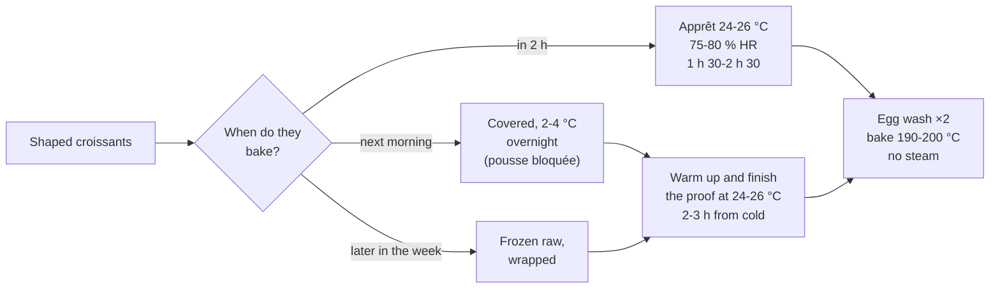

# 11.6 · Proofing, Egg Wash and Baking

A shaped croissant is still a small, tight roll; the proof makes it light, the egg wash makes it shine and the oven separates the layers and sets them. This lesson explains how to proof laminated dough without melting the butter, how to tell when the proof is finished, how to egg-wash and bake, and how bakeries use the cold to have croissants out of the oven at opening time. You proof and bake your 16 croissants and bake one test piece early to see what under-proof looks like.

## Why it matters

Most croissants that leak butter, spread or stay dense were well laminated and badly proofed. The proof is the step where bread habits do the most damage: a warm, humid cabinet that suits baguettes melts the butter in a croissant. In the shop, croissants must be on the shelf when the doors open, which means the proof is usually planned the day before with the cold (lesson [04.6](../module-04/lesson-06.md)). The référentiel names the proofing cabinet (armoire de fermentation) among the viennoiserie equipment (S3.4); egg wash is raw egg, a food-safety and allergen point (C2.6, lesson [10.6](../module-10/lesson-06.md)). Proof and bake are part of what the production test looks at: see [The CAP Boulanger Exam](../../references/cap-exam.md).

## Key terms

| French | Say it | English meaning |
|---|---|---|
| apprêt | *ah-PREH* | final proof of the shaped pieces |
| étuve / chambre de pousse | *ay-TOOV / SHAHM-bruh duh POOSS* | proofing cabinet, warm and humid |
| pousse contrôlée | *POOSS kohn-troh-LAY* | controlled proof: a cabinet that holds the pieces cold, then warms them on a timer |
| dorure | *do-ROOR* | egg wash |
| doré | *do-RAY* | gilded: the deep, even golden colour of a well-baked croissant |
| sous-apprêté / sur-apprêté | *soo-zah-preh-TAY / sür-ah-preh-TAY* | under-proofed / over-proofed |
| défournement | *day-foor-nuh-MAHN* | taking the products out of the oven |
| ressuage | *ruh-sü-AHZH* | cooling on racks after baking |

## How it works

### Proof: warm enough for the yeast, cool enough for the butter

The yeast needs warmth to make gas; the butter must stay solid until the oven (lesson [11.1](lesson-01.md)). The two meet in a narrow band:

- **24-26 °C**, humid (about 75-80 % relative humidity, or covered so the surface does not dry), for about **1 h 30 to 2 h 30** from room-temperature pieces. Elle & Vire's professional formula proofs about 2 h 30 at 25 °C.
- **Never above about 27 °C** (King Arthur Baking: below 80 °F, or the butter melts and leaks). A bread cabinet at 28-30 °C is too warm.
- Cooler is safe but slower: at 22 °C the proof may take 3 hours or more (about 7 % per °C, lesson [04.2](../module-04/lesson-02.md)).

**When is it ready?** Not by the clock (lesson [04.4](../module-04/lesson-04.md)):

| Sign | Under-proofed | Ready | Over-proofed |
|---|---|---|---|
| Volume | less than 1.5 times | almost doubled | more than double, spreading |
| Shake the tray | firm, does not move | wobbles like a set jelly | sags, wrinkles |
| Touch (side, gently) | springs back fast | soft, "spongy and marshmallow-like" (King Arthur Baking) | dent stays, may collapse |
| Layers on the side | tight, close together | visibly separated, the turns stand out | blurred, the shape is losing its ridges |
| In the oven | tight, dense, butter leaks out of the creases | rises, opens, honeycomb inside | flat, spread, may collapse and leak |

An under-proofed croissant leaks butter too: its dough layers are still tight, so in the oven the melting butter has no room and runs out before the layers are set. That is why "it leaked" can mean either "proofed too warm" or "proofed too short": the proof temperature on the log tells you which.

### The cold as a tool

- **Overnight in the cold.** Shaped croissants, covered, in the fridge or cold room at 2-4 °C, then out the next morning to finish proofing at 24-26 °C (King Arthur Baking's class does exactly this). From cold, the proof takes longer: count about 2-3 hours.
- **Controlled proof (pousse contrôlée).** In a bakery, a proofer-retarder holds the trays cold, then warms them gradually on a programme so they are ready at a set time: the croissants shaped in the afternoon are ready at 5:30 the next morning without anyone touching them.
- **Freezing.** Shaped croissants can be frozen raw and proofed later (King Arthur Baking: up to about a month); the next module comes back to freezing and storing viennoiserie in detail.

### Egg wash

- **Make:** 1 whole egg, a pinch of salt (it thins the egg so it brushes evenly), optionally a spoonful of water or milk (King Arthur Baking adds a little water). Mix well, strain if stringy.
- **Brush twice, thin.** After the proof, a first thin coat; about 10-20 minutes later (it has dried a little), a second thin coat just before baking. Elle & Vire does the same. Two thin coats shine more than one thick one and do not drip.
- **Brush gently along the top**, with a soft brush, not into the cut edges of the layers: egg wash glues the layers at the edges and they cannot open. Do not let it pool on the tray: it burns.

### Baking

- **No steam.** The egg wash gives the shine, and steam on egg wash leaves it streaky and dull (lesson [10.6](../module-10/lesson-06.md)).
- **Temperature.** Deck oven about 190-200 °C, about 15-17 minutes (Elle & Vire); home oven conventional about 190-200 °C, 16-20 minutes (King Arthur Baking: 400 °F, about 205 °C, 15-20 minutes); fan oven about 175-180 °C. A 60 g croissant needs heat fast enough to turn the butter's water to steam before the butter runs out, and moderate enough that the sugar and egg do not burn before the inside is baked.
- **Done when** evenly **deep golden-brown, including the creases between the turns and the underside.** A croissant golden on top but pale in its creases is under-baked: its layers are not set and it collapses as it cools. Turn the tray halfway if your oven browns unevenly.
- **Cool on a rack** (ressuage) 20-30 minutes before tasting or cutting; steam is still escaping and the crust crisps as it cools. A croissant loses part of its weight in the oven, mostly water: about 12-15 % is a reasonable planning figure (60 g raw → about 51-53 g), but measure your own (lesson [06.3](../module-06/lesson-03.md)).

## Worked example

Boulangerie du Marché wants croissants on the shelf at **6:45** on Saturday. The croissants are shaped on Friday at 15:00 (lessons [11.4](lesson-04.md)-[11.5](lesson-05.md) done on Friday afternoon) and the trays go into the proofer-retarder.

1. **Programme.** Hold at 3 °C from 15:30; start warming at 2:30 to 25 °C and 78 % HR; the croissants come from 3 °C, so count about 3 hours: ready at about 5:30.
2. **5:30, check.** Almost doubled, they wobble, layers visibly open on the sides: ready. First egg wash.
3. **5:45.** Second egg wash. Deck at 195 °C, no steam. Load.
4. **6:02.** Even deep gold, creases coloured too: out at 17 minutes. On racks.
5. **6:45.** On the shelf, cooled and crisp. Control: 3 croissants weighed: 52, 51, 53 g, from 60 g raw: loss about 13 %.
6. **Incident the next week.** The display of the proofer reads 30 °C at 5:00: someone changed the programme. The croissants are puffy, shiny with butter on the surface, a little butter on the paper. Decision: set the cabinet back to 25 °C; they are already fully proofed, so egg-wash once, gently, and bake at once; expect flatter, greasier croissants. The non-conformity is written up (cause: programme changed; action: programme locked, check of the display at the start of the shift), and the shop is told the morning's croissants are below standard (lesson [11.7](lesson-07.md), C4.4).

## Practice

You proof your 16 croissants, egg-wash and bake them, and bake one test croissant early to see under-proof. If you shaped them yesterday and kept them in the fridge overnight, start at step 2 and count about 2-3 hours of proof.

> [!WARNING]
> The oven is at 190-200 °C and melted butter on the tray can spit and smoke: use dry oven gloves, take the tray out level, and set it on a heat-proof surface. Do not open the oven in the first 10 minutes (the croissants need the heat), and keep children away from the oven door.

> [!CAUTION]
> Egg wash is raw egg: crack the egg into a separate bowl, keep the egg wash in the fridge between coats, wash your hands after handling shells, discard what is left, and wash the brush hot and dry it. Croissants contain wheat (gluten), milk and egg: do not serve them to anyone allergic, and say so if you share them.

### You need

- Minimum: a place at 24-26 °C (checked with the probe in a glass of water), a large plastic box or a loose plastic cover, soft pastry brush, small bowl, fork, two baking trays with baking paper, oven thermometer, oven gloves, wire rack, scale, timer, the [bake log](../../templates/bake-log.md).
- Professional equivalent: proofer-retarder (pousse contrôlée) or proofing cabinet set at 24-26 °C and 75-80 % HR, pasteurised liquid egg kept at +4 °C maximum, deck or rack oven, racks for ressuage.

### Ingredients

| Ingredient | Home batch | Bakery batch |
|---|---|---|
| Shaped croissants CR-01, about 60 g | 16 (12 for evaluation + 4 for tests) | about 32 |
| Egg wash: whole egg + pinch of salt (+ 1 tablespoon water) | 1 egg | 2-3 eggs or pasteurised liquid egg |

### In Israel

Checked 2026-10-08.

- **Where to proof in summer.** A 28-32 °C kitchen is too warm for laminated dough: proof in an air-conditioned room set to about 24-25 °C, with the croissants under a large upturned plastic box (it keeps the humidity in). Check the spot with the probe in a glass of water. Never in a closed car, on a balcony or on a sunny windowsill.
- **In winter.** A switched-off oven with only the light on can reach 30 °C or more: check it with the probe before you use it. A bowl of warm water beside the trays inside a box usually holds 24-26 °C.
- **Eggs.** Buy eggs stamped on the shell with the marketer's name, size and two dates (last date of sale and last date of use), which is how approved eggs are marked in Israel (Ministry of Agriculture); keep them in the fridge and do not use cracked or unstamped eggs.
- **Ovens.** Check your oven with an oven thermometer (lesson [05.1](../module-05/lesson-01.md)). For the fan mode, use about 175-180 °C; most home ovens bake evenly enough with one tray at a time on the middle shelf.

### Steps

1. **Proof** the croissants covered at 24-26 °C. Write the start time and the temperature of the spot.
2. **Test croissant (under-proof).** After about 45-60 minutes, when the croissants have grown only about 1.5 times, take one test croissant, egg-wash it and bake it alone (steps 5-7). Label it "under-proofed" on its rack.
3. **Watch the batch** from about 1 h 30: almost doubled, wobbles when you shake the tray, soft and springy, the turns clearly separated on the sides. Write the time.
4. **Egg wash.** Preheat the oven to 190-200 °C (fan 175-180 °C) in time. First thin coat on the top surfaces, not into the cut edges. Leave uncovered 10-15 minutes, then a second thin coat.
5. **Bake** one tray at a time on the middle shelf, no steam: about 16-20 minutes, turning the tray after 10-12 minutes if your oven browns unevenly. Bake the trims (twists) with the last tray: they take less time.
6. **Check** the creases and the underside: deep golden-brown everywhere. If the creases are pale, give 2-3 minutes more.
7. **Cool** on the rack 30 minutes. Weigh 3 croissants and calculate the baking loss. Discard the leftover egg wash.
8. **Compare** the under-proofed test croissant with a batch croissant: size, shape, butter on the paper. Keep 12 for lesson [11.7](lesson-07.md) (cut-section analysis today, while they are fresh).

### Targets

- Proof at 24-26 °C (never above 27 °C) until almost doubled; time recorded (expected about 1 h 30-2 h 30, or 2-3 h from the fridge).
- Two thin coats of egg wash, no drips.
- Bake 16-20 minutes at 190-200 °C (fan 175-180 °C), no steam; even deep gold including the creases.
- Baking loss measured (expected about 12-15 %).

### How you know it worked

The batch croissants have roughly doubled again in the oven, stand tall with clearly separated turns, are evenly deep gold and glossy, and sit on clean or almost clean paper. They are light in the hand: a 60 g raw croissant now weighs about 51-53 g but looks twice the size of the dough. The under-proofed test croissant is smaller, tighter, perhaps split along a turn, with more butter on its paper: you have seen the difference with your own batch.

### Self-check

- [ ] I proofed at 24-26 °C and checked the place with the probe.
- [ ] I judged the end of proof by volume, wobble, touch and layers, and wrote the time.
- [ ] I egg-washed twice, thinly, without brushing the cut edges.
- [ ] I baked without steam until the creases were coloured.
- [ ] I handled the egg wash safely and discarded the rest.
- [ ] I compared my under-proofed test croissant with the batch.

## What goes wrong

| Symptom | Likely cause | Fix now | Prevent next time |
|---|---|---|---|
| Pool of butter on the tray, flat greasy croissants | Proof above about 27 °C (butter melted) | Bake at once | Proof at 24-26 °C; check the place with a probe |
| Butter leaks, croissants small and tight, split along a turn | Under-proofed | — | Wait for almost double, wobble and visible layers |
| Croissants spread, lose their ridges, collapse | Over-proofed | Bake at once, egg-wash very gently | Check earlier; colder place or shorter proof |
| Dry, cracked skin before baking; pale patches | Not covered in the proof; low humidity | Egg-wash gently | Cover with a box; humidity 75-80 % |
| Streaky, dull crust | Steam used; egg wash thick or uneven | — | No steam; two thin coats |
| Layers stuck at the edges, uneven rise | Egg wash brushed into the cut edges | — | Brush the top surfaces only |
| Dark top, pale creases, collapse on cooling | Oven too hot; baked too short | Lower 10 °C, bake 2-3 minutes more | Oven thermometer; colour the creases |
| Burnt bottoms | Tray on the low shelf; butter leaked and fried | Double the tray | Middle shelf; correct proof |

## Review

- Proof laminated dough at 24-26 °C, about 75-80 % HR, never above about 27 °C; about 1 h 30-2 h 30, or 2-3 h from the cold.
- Ready = almost doubled, wobbles, soft, layers visibly apart. Under-proofed croissants also leak butter.
- The cold lets the bakery choose the baking time: overnight at 2-4 °C, a programmed proofer-retarder, or frozen raw.
- Two thin coats of egg wash, top surfaces only; bake 190-200 °C (fan 175-180 °C), 15-20 minutes, no steam, until the creases are deep gold.
- Egg wash is raw egg and an allergen: keep cold, discard, declare wheat, milk and egg. Proof and bake in the production test: [The CAP Boulanger Exam](../../references/cap-exam.md).
