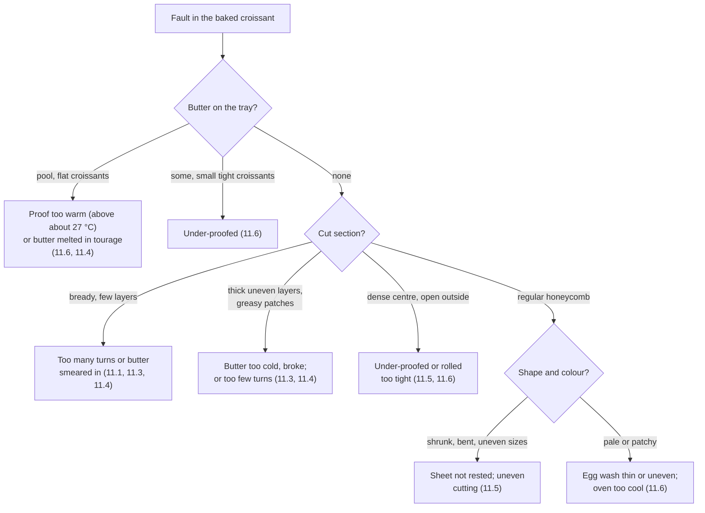

# 11.7 · Evaluating Croissants and Fixing Lamination Faults

A croissant tells its whole history when you cut it lengthwise: how cold the butter was, how many turns it had, how it was rolled, proofed and baked. This lesson gives a method to evaluate a batch, a fault table that links what you see to the stage that caused it, and the way to report it so the next batch is better. You cut and score your own batch from lesson 11.6 and write one non-conformity report.

## Why it matters

The production test judges viennoiserie on its appearance and its taste as well as the work itself (see [The CAP Boulanger Exam](../../references/cap-exam.md)), and a bakery judges a croissant every morning by what the customer sees: regular, golden, light, flaky, not greasy. Checking weights, quantities and appearance is a competency in its own right (C3.2), and so is reporting what went wrong during production so it can be corrected (C4.4). For a home learner, evaluation is the only teacher available: nobody will tell you why your croissants are bready. If you can read the cut section and match it to your logs, every batch teaches you something.

## Key terms

| French | Say it | English meaning |
|---|---|---|
| coupe longitudinale | *KOOP lohn-zhee-tü-dee-NAL* | lengthwise cut through the middle of the croissant |
| alvéolage en nid d'abeille | *al-vay-oh-LAHZH ahn nee dah-BAY* | honeycomb: large, regular, open cells separated by thin walls |
| feuilletage régulier | *fuh-yuh-TAHZH ray-gü-LYAY* | regular layering: even, distinct layers |
| mie pâteuse | *mee pah-TUHZ* | doughy, under-baked crumb |
| croûte feuilletée | *KROOT fuh-yuh-TAY* | flaky crust that shatters into thin flakes |
| fuite de beurre | *FWEET duh BUHR* | butter leaking out during proof or baking |
| fiche de non-conformité | *FEESH duh nohn kohn-for-mee-TAY* | non-conformity report |
| écart | *ay-KAR* | deviation: the difference between target and actual |

## How it works

### Evaluate in a fixed order

Evaluate after 30-60 minutes of cooling, the same day. Work from the outside in, so you do not forget a criterion:

1. **Count and weight.** Is the count right? Weigh 3-5 croissants: compare with the raw weight and calculate the baking loss (lesson [06.3](../module-06/lesson-03.md)). All alike within a few grams?
2. **Shape and regularity.** Same length (ruler: within about 1 cm), same shape (all straight or all crescents), same number of visible turns, tips underneath, symmetrical.
3. **Volume and lift.** Light in the hand, tall, turns standing out clearly. A croissant should look much bigger than its weight suggests.
4. **Colour and crust.** Even deep gold, glossy from the egg wash, creases coloured; underside golden, not black. Crust crisp: it shatters into flakes when pressed.
5. **Butter.** Clean paper, or only a little butter. A pool of butter is a fault.
6. **Cut section.** With a serrated knife, saw gently through the middle from tip to tip, lengthwise. Look at it straight on.
7. **Texture and taste.** Crisp outside, tender and flaky inside, not chewy, not greasy on the fingers; butter flavour, light sweetness, salt present, no yeasty or sour taste.

Score with the viennoiserie table of the [quality rubric](../../templates/quality-rubric.md). For plain croissants, leave out the "filling" line and score out of 18.

### Reading the cut section

| What you see in the cut | What it means |
|---|---|
| Large, open cells in a regular spiral, thin shiny walls, distinct layers to the centre | Good honeycomb: butter intact, correct turns, full proof, full bake |
| Fine, even, bread-like crumb; few layers; heavy | Layers fused: butter melted into the dough, or too many turns |
| A few very thick layers, big gaps, uneven; greasy patches | Too few turns, or butter broke into plates during tourage |
| Layers on one side, dense on the other | Sheet uneven; lock-in off-centre; butter plaque uneven |
| Tight, dense centre around a small spiral; outer layers fine | Under-proofed, or rolled too tight and pressed |
| Doughy, damp grey streak in the centre | Under-baked (pale creases), or rolled too tight |
| White, dry streaks between layers | Flour folded in during tourage |
| Big hollow under the crust, layers collapsed | Over-proofed; or layers not set (under-baked) and collapsed on cooling |

### Faults and their stage

The faults that matter for croissants are always caused at a stage you can name. The [troubleshooting reference](../../references/troubleshooting.md) has the general viennoiserie table; this one adds the stage and the lesson.

| Fault | Most likely stage and cause | Evidence in your records | Correction next batch |
|---|---|---|---|
| Butter breaks (patches in the sheet; thick, uneven layers) | Tourage: butter much colder and harder than the détrempe | Butter or block temperature low; long rest or freezer | Butter about 13 °C at lock-in; rests 20-45 min; a few minutes on the bench if it cracks |
| Butter melts into the dough (bready, no layers) | Lock-in or tourage too warm; long sessions | Butter above about 15 °C; room above 24 °C; greasy dough noted | Cool window; short sessions; chill when greasy |
| Uneven layers | Uneven plaque, lock-in off-centre, rolling in all directions, folds misaligned | Plaque size not checked; corners not square | Paper envelope plaque; roll lengthwise; align folds |
| Leaking butter | Proof too warm, or under-proofed; torn layers | Proof temperature and time on the log | 24-26 °C until almost doubled |
| Poor lift, dense interior | Too many turns, under-proof, over-developed détrempe, oven too cool | Turn marks; proof time; détrempe temperature | Keep to 3 simples; full proof; oven checked |
| Distorted shape (shrunk, bent, unrolled) | Sheet cut while tense; crooked triangles; tip not underneath | Sheet not rested noted; triangle sizes | Rest the sheet; template; tip under |
| Pale or patchy colour | Egg wash missing or uneven; oven too cool; steam | Oven reading; egg wash noted | Two thin coats; oven thermometer; no steam |

### Change one thing at a time

If a batch shows two faults, correct the earlier stage first: a melted lamination cannot be rescued by a better proof. Write the one change on your [bake log](../../templates/bake-log.md) and on the production sheet, and compare the next batch with the same rubric.

### Reporting

In a bakery the baker who finds a fault does not just remake the batch: they report it, with facts, the action taken and a proposed correction, using a [non-conformity report](../../templates/non-conformity-report.md) (C4.4). A good report is short and measurable: "Croissants du 14/06, fournée de 6:00: 40 pièces, beurre sur plaque, volume faible. Apprêt relevé à 30 °C (programme modifié). Action: cuites aussitôt à 195 °C; vente décidée par le chef. Correction: programme verrouillé, contrôle de l'étuve en début de poste."

## Worked example

Monday, Boulangerie du Marché. You evaluate Saturday's two croissant blocks from the samples kept back (5 croissants per block) with the production sheet beside you.

| Check | Block 1 | Block 2 |
|---|---|---|
| Raw weight | 61 g (12 cm triangles, sheet too thin) | 60 g |
| Baked weight (5 pieces) | 52, 54, 53, 53, 52 g | 52, 51, 52, 53, 52 g |
| Shape | regular, straight, even ridges | regular, straight |
| Colour | even gold, creases coloured | even gold |
| Butter on paper | none | none |
| Cut section | regular honeycomb, but some thick, uneven layers and a few greasy patches near one end | regular, open honeycomb to the centre |
| Score (out of 18) | 13 | 17 |

1. **Weights.** Block 1: average 52.8 g from 61 g → loss 13.4 %. Block 2: 52.0 g from 60 g → 13.3 %. Both within the planning range; regular within 2 g.
2. **The difference is the cut section of block 1.** Thick, uneven layers and greasy patches mean the butter broke into plates. The production sheet shows the incident at tour 2: "beurre cassant, chambre froide à 1 °C" (lesson 11.4). The patches near one end match the part of the block that was rolled first, while still too cold.
3. **Cause:** reach-in fridge set to 1 °C; the block rested 30 minutes at 1 °C and the butter went brittle. Stage: tourage.
4. **Report (C4.4):** facts (block 1 of 14/06, layers uneven, score 13/18 against 17/18 for block 2; reach-in found at 1 °C at 5:00), action taken (block rested on the bench 5 minutes, rolled with small steps; reach-in reset to 3 °C; croissants sold), correction proposed (check the reach-in temperature at the start of the shift and record it; rests timed). The cutting incident (sheet too thin, 112 instead of 120 croissants, lesson 11.5) goes in a second report: two causes, two corrections.
5. **One change for next Saturday:** the reach-in temperature is written on the temperature log at 4:00 before the lamination starts.

## Practice

You evaluate the 12 croissants from lesson 11.6 with the method above, cut three lengthwise, diagnose any fault from your logs, and write one non-conformity report and one change for the next batch.

> [!WARNING]
> Cut with a serrated knife on a board, the croissant held flat with your fingers on top, away from the blade's path; saw gently instead of pressing. The croissants contain wheat, milk and egg: say so if you share them.

### You need

- Minimum: the 12 croissants (cooled 30-60 minutes), the under-proofed test croissant, serrated knife, board, scale, ruler, the [quality rubric](../../templates/quality-rubric.md), the [non-conformity report](../../templates/non-conformity-report.md), your [bake log](../../templates/bake-log.md) and temperature logs from lessons 11.2-11.6.
- Professional equivalent: daily quality check of a sample from each batch, weighed and cut, recorded on the production sheet; non-conformities reported to the head baker.

### Ingredients

None: you evaluate what you baked.

### In Israel

Checked 2026-10-08.

- **Humid summer air.** Croissants absorb moisture and lose their crispness within hours in humid coastal air. Evaluate them the same day, within a few hours of baking.
- **Keeping the rest.** King Arthur Baking keeps baked croissants 1-2 days airtight and freezes them for longer. In a hot kitchen, freeze what you will not eat the same day; refresh in the oven at about 170-180 °C for a few minutes from thawed.
- **Sharing.** If you share them, say they contain wheat, milk and egg, and that they are dairy (חלבי, *khalavi*) for anyone keeping kosher.

### Steps

1. **Count and weigh** 5 croissants; calculate the average and the baking loss from your raw weight (lesson 11.5).
2. **Measure** the length of all 12 with the ruler; write the shortest and the longest.
3. **Look and feel**: colour, creases, underside, gloss, butter on the paper, crispness.
4. **Cut three** lengthwise through the middle: one from the first tray, one from the last, one you think is the best. Cut the under-proofed test croissant too.
5. **Read each section** with the table above. Write what you see in one line each.
6. **Taste** one: crust, inside, butter, sweetness, salt.
7. **Score** with the viennoiserie rubric, out of 18 (no filling).
8. **Diagnose** your main fault, if any, with the flowchart and the fault table, and find the evidence in your logs (temperatures, times, turn marks, proof temperature).
9. **Write a non-conformity report** for that fault: facts, action, probable cause, correction. If you have no fault, write it for the under-proofed test croissant.
10. **Write one change** for your next croissant batch (the project of this module).

### Targets

- Weights of 5 croissants, average and baking loss calculated (expected about 12-15 %).
- Lengths of 12 within about 1 cm of each other, or the difference explained.
- Three cut sections described, rubric score out of 18, one non-conformity report, one change for the next batch.

### How you know it worked

You can point at your cut section and say which stage made it look that way, and show the line in your log that proves it. Your report reads like the worked example: measured facts, not impressions. Your change for the next batch is one specific action ("rest 30 minutes, not 60, between turns"), not "be more careful".

### Self-check

- [ ] I weighed and measured before cutting, and calculated the baking loss.
- [ ] I cut lengthwise through the middle and described the honeycomb in words.
- [ ] I scored the batch with the rubric, out of 18.
- [ ] I traced my main fault to a stage and found the evidence in my logs.
- [ ] I wrote a non-conformity report and one change for the next batch.

## What goes wrong

| Symptom | Likely cause | Fix now | Prevent next time |
|---|---|---|---|
| Cut section squashed, layers flattened | Cut warm or with a smooth knife pressed down | Cut another one, cooled, with a serrated knife | Cool 30-60 min; saw gently |
| Score differs from tray to tray | Oven uneven; second tray proofed longer | Note each tray separately | Turn the tray; keep the second tray cooler while the first bakes |
| Fault but no record to trace it | Temperatures and times not written | Write what you remember, marked "estimated" | Log each stage as you go |
| Two faults, two changes made at once | Next batch cannot show which change worked | — | One change at a time |
| Croissants soft and chewy by evening | Humidity; stored in a closed bag warm | Refresh at 170-180 °C | Cool fully; eat the same day or freeze |

## Review

- Evaluate in a fixed order: count and weight, shape, volume, colour, butter, cut section, texture and taste; score with the rubric.
- A good cut section shows a regular, open honeycomb with thin walls right to the centre.
- Bready = layers fused (warm butter, too many turns); thick uneven layers = butter broke or too few turns; dense centre = under-proofed or rolled tight; leaking = warm proof or under-proof.
- Trace each fault to its stage with your records, correct the earliest stage first, one change at a time.
- Report faults with facts, action, cause and correction (C4.4). Appearance and taste in the production test: [The CAP Boulanger Exam](../../references/cap-exam.md).
