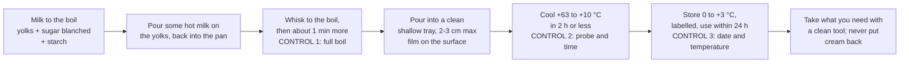

# 12.2 · Pain aux Raisins and Crème Pâtissière

The pain aux raisins is the third product of the croissant dough: a sheet spread with crème pâtissière, scattered with raisins, rolled into a log and cut into spirals. It adds one new skill to lamination, and a serious one: cooking, cooling and keeping a crème pâtissière, a moist mixture of milk, eggs, sugar and starch that bacteria love. This lesson explains how the cream thickens and why it must boil, the cooling and storage rules it must meet, and how to roll and cut the spirals. You cook a small batch of cream, cool it against the clock and bake eight pains aux raisins.

## Why it matters

The référentiel lists pains aux raisins with croissants and pains au chocolat, and crème pâtissière as their filling (C2.3); how the production test treats the cream is in [The CAP Boulanger Exam](../../references/cap-exam.md). In a bakery, the cream is the most dangerous thing the viennoiserie bench handles. Eggs and egg-based foods, creams among them, are behind nearly half of the collective food-poisoning outbreaks caused by *Salmonella* in France (ANSES), and a cream handled after cooking, cooled slowly or kept too long can also grow bacteria brought by hands and tools. Lesson [02.10](../module-02/lesson-10.md) promised it: the cooling rule (+63 °C to +10 °C in 2 hours or less) applies here, every time. Hygiene in depth comes in Module 17.

## Key terms

| French | Say it | English meaning |
|---|---|---|
| crème pâtissière | *krem pah-tee-SYAIR* | pastry cream: milk thickened with egg yolks and starch, cooked to the boil |
| poudre à crème | *POO-druh ah KREM* | custard powder: flavoured starch for pastry cream; cornstarch (*amidon de maïs*) does the same job |
| blanchir | *blahn-SHEER* | to whisk yolks and sugar until pale and thick |
| cellule de refroidissement rapide | *say-LÜL duh ruh-frwah-dees-MAHN rah-PEED* | blast chiller: cools hot preparations fast |
| pain aux raisins | *pan oh ray-ZAN* | spiral of laminated dough, crème pâtissière and raisins; also called escargot |
| raisins secs réhydratés | *ray-ZAN SEK ray-ee-drah-TAY* | raisins soaked and drained so they do not burn or dry the cream |
| nappage | *nah-PAHZH* | clear glaze (often apricot) brushed on after baking for shine |
| filmer au contact | *feel-MAY oh kohn-TAKT* | to press film directly onto a cream's surface so no skin forms |

## How it works

### What happens in the pan

| Ingredient | CP-01 per 1,000 g milk | Role |
|---|---|---|
| Whole milk | 1,000 g | the liquid; its proteins and fat give body and flavour (lesson [02.8](../module-02/lesson-08.md)) |
| Egg yolks | 160 g (about 8 yolks, or pasteurised liquid yolk) | proteins set and add body; lecithin gives a smooth texture; colour |
| Sugar | 220 g | sweetness; raises the temperature at which the yolks set, so they do not scramble |
| Cornstarch or poudre à crème | 90 g | the main thickener: starch granules swell and gelatinise as the cream approaches the boil |
| Vanilla | to taste | flavour |
| **Total** | **1,470 g** | about 1,400 g after cooking (water evaporates) |

A cream for pains aux raisins is cooked firmer than one for a tart (90 g of starch per litre rather than less) because it bakes a second time inside the dough and must not run.

**Why it must boil.** Egg yolks contain **amylase**, an enzyme that cuts starch chains. If the cream only thickens and is taken off the heat before it boils, the amylase survives and slowly thins the cream, even in the fridge; heated to the boil, the enzyme is destroyed (America's Test Kitchen; Joe Pastry). The starch also protects the yolks: it gets between the egg proteins and stops them curdling, which is why a pastry cream can boil when a plain custard cannot. The professional rule: once it bubbles in the centre, keep whisking at the boil for about one more minute (King Arthur Baking), then stop.

**Why it is high-risk.** The cooked cream is moist, nearly neutral, rich in protein and sugar: ideal for bacteria. The boil destroys the vegetative bacteria from the raw yolks, but everything that touches the cream afterwards (spatula, tray, hands, the air of the bench while it is warm) can bring new ones, and between about +63 °C and +10 °C they multiply fast. Hence three controls:

1. **Cook to a full boil**, whisking constantly, with a clean whisk and pan.
2. **Cool fast**: core not between +63 °C and +10 °C for more than 2 hours, then 0 to +3 °C (arrêté of 21 December 2009, annex IV, as in lesson 02.10). A deep bowl of cream takes hours; a layer 2-3 cm deep in a cold tray, filmed on the surface, in a blast chiller (or on ice at home) takes well under an hour. Record the time at 63 °C and at 10 °C.
3. **Keep cold and short**: covered, labelled with product, date and time of cooking, at 0 to +3 °C. ANSES advises eating raw-egg preparations at once or keeping them cold and eating them within 24 hours; this cream is cooked, but because it is handled after cooking, the course uses the same **24-hour** limit. A bakery's own hazard analysis (its HACCP plan, Module 17) sets its limit; home recipes that keep pastry cream for several days are not a professional standard.

When you use it, beat it smooth with a clean whisk, take only what you need, and never pour unused cream back into the stock.

### Building a pain aux raisins

- **Sheet:** the croissant dough, about 3.5 mm thick, rested in the cold.
- **Spread:** cold cream, beaten smooth, in a thin, even layer about 2 mm thick, leaving a bare strip of 2 cm at the far edge; brush that strip with a little water so the seam sticks.
- **Raisins:** soaked in hot water 10-15 minutes, drained and dried on paper, then scattered evenly and pressed in lightly. Dry raisins take water from the cream and burn on the surface.
- **Roll:** from the near edge, firmly but without pulling, to a log of even thickness; seam underneath.
- **Chill:** 15-30 minutes in the fridge, so the cream firms and the slices cut clean instead of squashing.
- **Cut:** slices 2-2.5 cm thick with a sharp knife, wiped between cuts. Lay them flat, tuck the tail of the spiral underneath so it does not unroll, flatten very lightly.
- **Proof** like the croissants, below about 27 °C; the cold cream makes them slower, so expect a little longer.
- **Egg wash** the dough only, lightly; **bake** until golden on top **and underneath**, where the cream makes the base soft if it is taken out too early. A brush of hot nappage after baking gives shine.

Pains aux raisins are sold the day they are baked: they carry a cream.

> [!CAUTION]
> Milk for the cream comes to the boil, and boiling pastry cream spits: use a deep, heavy pan, a long whisk, an oven glove on the hand that holds the pan, and pour away from you. Never leave it: it scorches in seconds. Raw yolks can carry *Salmonella*: separate eggs over a separate bowl, wash your hands after handling shells, and use a different, clean whisk for the cooked cream.

## Worked example

Thursday, 11:00. Friday's shop order: **60 pains aux raisins** of about 85 g raw (50 g dough, 20 g cream, 15 g soaked raisins). Sheet CP-01; cooked yield about 1,400 g per 1,000 g of milk; 10 % extra cream for what stays in the pan, tray and spatula. This bakery measured that 100 g of dry raisins weighs 125 g after soaking and draining.

1. **Cream needed.** 60 × 20 = 1,200 g; with 10 %: **1,320 g**.
2. **Milk.** 1,320 ÷ 1.40 = 943 g → cook a **1,000 g milk** batch: yolks 160 g, sugar 220 g, starch 90 g (about 1,400 g of cream).
3. **Raisins.** 60 × 15 = 900 g soaked; 900 ÷ 1.25 = **720 g dry**. Label check: these raisins list sulphites (preservative E220-E228), an allergen above 10 mg/kg, so the shop label of the pains aux raisins must declare them as well as wheat, milk and egg.
4. **Cook and cool.** At 11:05 the cream boils; the baker whisks one more minute and pours it at 11:08 into two shallow stainless trays, 2 cm deep, films it on the surface and puts the trays in the blast chiller. Cooling log:

   | Time | Core | Note |
   |---|---|---|
   | 11:08 | 86 °C | into the trays |
   | 11:14 | 63 °C | the 2-hour clock starts |
   | 11:50 | 21 °C | |
   | 12:15 | 9 °C | **1 h 01 min** from 63 to 10 °C: conforms; into the cold room at 2 °C |

5. **Label:** "Crème pâtissière CP-01 — cuite jeudi 11:05 — à utiliser avant vendredi 11:05 — 0/+3 °C."
6. **Friday 4:30.** The tourier takes 1,320 g of cream with a clean spatula, beats it smooth, spreads it on the band, adds the raisins, rolls, chills 20 minutes and cuts 60 slices. What is left in the tray at 11:05 is thrown away, not kept for Saturday.

## Practice

You cook a small CP-01, cool it against the clock, and make **8 pains aux raisins** from about 380 g of laminated dough: a third of a 500 g-flour lamination of CR-01 ([Module 11](../module-11/lesson-02.md), about 1,135 g) whose other two thirds make your pains au chocolat and croissants from lesson 12.1, or a 250 g-flour half batch.

> [!WARNING]
> Boiling milk and boiling cream cause deep burns: deep pan, long whisk, glove on the pan hand, children and pets away from the stove. The oven is at about 190-200 °C. Cut with a sharp knife away from your fingers.

> [!CAUTION]
> Raw yolks: separate eggs over a separate bowl, wash your hands after the shells, keep the raw-egg whisk away from the cooked cream. The cream must be in the fridge within 2 hours of reaching 63 °C and used within 24 hours. Allergens: wheat (gluten), milk, egg, and sulphites if your raisins list them.

### You need

- Minimum: scale, probe thermometer, heavy saucepan, two whisks (one for raw yolks, one for the cooked cream), shallow metal or glass tray, cling film, a large bowl of ice and water, rolling pin with 3.5 mm guides, ruler, sharp knife, pastry brush, trays with baking paper, wire rack, [temperature log](../../templates/temperature-log.md), [bake log](../../templates/bake-log.md).
- Professional equivalent: induction or gas boiling ring with a heavy pan or a cooker-mixer, stainless trays, blast chiller (*cellule de refroidissement rapide*), cold room at 0-3 °C, laminoir.

### Ingredients

| Ingredient | CP-01 per 1,000 g milk | Home batch | Notes |
|---|---|---|---|
| Whole milk | 1,000 g | 200 g | |
| Egg yolks | 160 g | 32 g (2 yolks) | keep the whites, covered, in the fridge, or discard |
| Sugar | 220 g | 44 g | |
| Cornstarch | 90 g | 18 g | |
| Vanilla | to taste | a few drops | |
| **Cream** | **1,470 g** | **about 290 g** | you need about 150 g; discard the rest after 24 h |

| For 8 pains aux raisins | Weight |
|---|---|
| Laminated croissant dough CR-01 ([Module 11](../module-11/lesson-02.md)) | about 380 g (about 290 g in the sheet, the rest trimmings) |
| Crème pâtissière | about 150 g |
| Raisins (dry, before soaking) | 60 g |
| Egg wash | 1 egg + pinch of salt |
| Nappage (optional): apricot jam warmed with a spoon of water | 40 g |

### In Israel

Checked 2026-10-08.

- **Raisins** (*tzimukim*, צימוקים): dark raisins are sold loose and packed. Read the ingredients: many are coated with vegetable oil, and some, especially golden ones, contain sulphites (*sulfitim*, סולפיטים, or sulphur dioxide, *du-tachmotzet ha-gofrit*, דו-תחמוצת הגופרית), an allergen to declare if you share or sell them. Soak and drain them as above.
- **Milk and eggs:** fresh full-fat milk (*khalav*, חלב; take the highest fat on the shelf and read the label) and eggs in their carton, any size grade (two medium yolks weigh about 30-36 g; weigh them). Keep both in the fridge at 5 °C or below, the limit the Ministry of Health sets for chilled food in food businesses; not on the door.
- **Cornstarch** is *kornflor* (קורנפלור) or *amilan* (עמילן); vanilla pudding powder (*avkat pudding*, אבקת פודינג) is a sweetened, flavoured starch like poudre à crème: if you use it, cut the sugar.
- **Cooling in a 30 °C kitchen:** the bench and the air warm the tray, so cooling is slower than in a cold bakery. Always cool on ice water (the tray sitting in a larger tray of ice and water, film on the cream), and move it to the fridge as soon as the core reads 10 °C. Never leave it on the bench to "cool down first".
- **Proofing:** keep the shaped pieces below about 27 °C: the air-conditioned room, or overnight in the fridge and a morning finish (lesson [04.6](../module-04/lesson-06.md)). Flour: [Flour in Israel](../../references/flour-in-israel.md).
- **Kashrut:** a dairy (*khalavi*) pastry.

### Steps

1. **Raisins:** cover 60 g with hot water for 10-15 minutes; drain, dry on paper.
2. **Cream:** bring the milk (with vanilla) to the boil. Meanwhile, in a bowl, whisk the yolks and sugar until pale (blanchir), then whisk in the cornstarch.
3. **Temper:** pour about a third of the boiling milk onto the yolks, whisking; pour everything back into the pan.
4. **Cook:** on medium heat, whisking constantly and reaching into the corners, until it thickens and bubbles burst in the centre; keep whisking at the boil for **one more minute**. Probe: about 95-100 °C.
5. **Cool:** with the clean whisk, pour the cream into the clean shallow tray, no deeper than 2-3 cm; press film onto the surface; set the tray in the ice bath. Probe the centre every 10 minutes and write the time at 63 °C and at 10 °C. At 10 °C (or 2 hours after 63 °C, whichever comes first) into the fridge. Label it.
6. **Sheet:** roll the dough to about 20 × 36 cm and 3.5 mm thick. Rest 15 minutes in the fridge.
7. **Fill:** beat about 150 g of cold cream smooth; spread it about 2 mm thick, leaving a bare 2 cm strip along one short edge; brush that strip with water. Scatter the raisins and press them in lightly.
8. **Roll** from the other short edge towards the bare strip, without pulling, into a log about 20 cm long; seam underneath. Fridge 20 minutes.
9. **Cut** 8 slices of about 2.5 cm; tuck each tail under; place them flat on paper, 6 cm apart; flatten very lightly. Weigh two: about 60-65 g each.
10. **Proof** at 24-26 °C until puffy and the layers have opened on the sides (often 2-2 h 30 min). Preheat to 190-200 °C conventional (175-180 °C fan), no steam.
11. **Egg wash** the dough spirals lightly; **bake** about 16-20 minutes until golden on top and underneath (lift one with a spatula to check). Brush with hot nappage if you like. Cool on a rack.
12. **Clean up:** cream left after 24 hours goes in the bin; wash the tray, whisk and probe hot.

### Targets

- Cream boiled one minute; core 63 → 10 °C in 2 hours or less (on ice, usually under 45 minutes); fridge at 5 °C or below; label written.
- Sheet 3.5 mm; 8 slices of 2.5 cm, 60-65 g each, within 6 g of one another.
- Baked spirals round, golden on top and underneath, cream set, raisins not burnt.

### How you know it worked

The cream sets thick and glossy as it cools and stays thick the next day (a cream that turns runny in the fridge was not boiled long enough). Your log shows a fast cooling curve with both times written. The pains aux raisins are round, even spirals that have not unrolled, with layers opened on the sides, cream set in a thin even line between the turns, raisins plump, and a crisp, coloured base.

### Self-check

- [ ] I boiled the cream and kept whisking at the boil for one minute.
- [ ] I recorded the times at 63 °C and 10 °C, and they were less than 2 hours apart.
- [ ] I labelled the cream and will throw away what is left after 24 hours.
- [ ] My slices were even, the tails tucked under, and the bases baked golden.
- [ ] I can name the allergens of my pains aux raisins, including any sulphites from the raisins.

## What goes wrong

| Symptom | Likely cause | Fix now | Prevent next time |
|---|---|---|---|
| Cream thick when hot, runny next day | Taken off before the boil: yolk amylase still active | Do not use it in production; make a new batch | Full boil, then about 1 min more |
| Lumps in the cream | Not whisked into the corners; heat too high | Sieve it hot | Whisk constantly, medium heat |
| Scorched taste, brown flecks | Heavy heat, thin pan, stopped whisking | Discard | Heavy pan, constant whisking |
| Cream still above 10 °C after 2 h | Deep bowl; no ice; warm kitchen | Discard; report the non-conformity | Shallow tray 2-3 cm, film on the surface, ice bath or blast chiller |
| Slices squashed, cream oozing when cut | Log cut warm; cream too soft or too thick a layer | Chill the log 20 min more | Chill before cutting; about 2 mm of cream |
| Spirals unrolled in the oven | Tail not tucked under; seam not wetted | Tuck the remaining tails | Wet the bare strip; tail underneath |
| Soft, pale, wet bases | Taken out too early; cream layer too thick | Back in the oven a few minutes on a lower shelf | Bake until golden underneath; even 2 mm layer |
| Burnt raisins on top | Raisins not soaked; on the surface | — | Soak and drain; press them in |

## Review

- Crème pâtissière = milk, yolks, sugar and starch, cooked to a full boil for about a minute, so the starch sets and the yolks' amylase is destroyed.
- It is high-risk: cool from +63 °C to +10 °C in 2 hours or less in a shallow filmed tray, store at 0 to +3 °C, label it, use within 24 hours (course rule), never put cream back.
- Pains aux raisins: 3.5 mm sheet, about 2 mm of cold cream, soaked raisins, rolled without pulling, chilled, cut 2-2.5 cm, tail under, baked golden underneath, sold the same day.
- Declare wheat, milk, egg and any sulphites from the raisins.
- How the exam handles the cream and the pains aux raisins: [The CAP Boulanger Exam](../../references/cap-exam.md).
