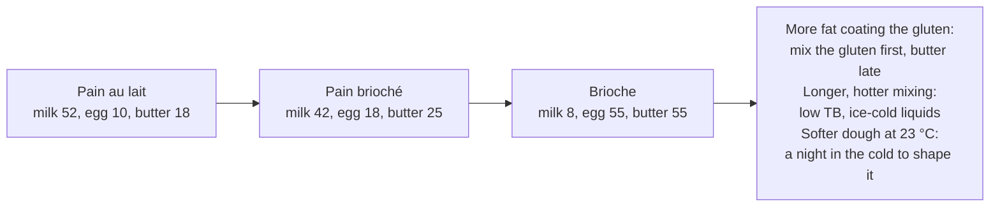

# 12.3 · Pâte Levée: Pain au Lait, Pain Brioché and Brioche

Pain au lait, pain brioché and brioche are one family of doughs, the pâtes levées: yeast doughs enriched with milk, eggs, sugar and butter, not laminated. Moving from pain au lait to brioche, eggs replace milk and the butter rises from under a fifth to more than half of the flour, and each step makes the dough harder to mix, slower to ferment and softer to handle. This lesson gives the three course formulas, explains what the enrichments do and why a brioche needs ice-cold liquids and a night in the cold, and you make a pain au lait dough by hand and bake round rolls.

## Why it matters

The référentiel asks you to name the raw materials of each pâte levée and to give their stages of manufacture (S3.4), and to make them (C2.3); which of them the production test asks for, and in which shapes, is in [The CAP Boulanger Exam](../../references/cap-exam.md). A real EP1 paper (2019) printed a pain brioché sheet with "TB 48 °C" and asked for the water, the method and the steps; lesson [05.2](../module-05/lesson-02.md) did the calculation and lesson [05.4](../module-05/lesson-04.md) promised the detail here. In the shop these doughs are the children's products (pains au lait, brioches, the braided loaf for the weekend): they sell on softness, colour and regular shapes, and they go wrong in predictable ways when the butter goes in too early or too warm.

## Key terms

| French | Say it | English meaning |
|---|---|---|
| pâte levée | *paht luh-VAY* | enriched yeast dough, not laminated: pain au lait, pain brioché, brioche |
| pain au lait | *pan oh LAY* | milk bun: milk dough with some egg, sugar and butter |
| pain brioché | *pan bree-oh-SHAY* | "brioche-style bread": between pain au lait and brioche, more egg and butter than pain au lait |
| brioche | *bree-OSH* | rich dough where eggs replace most of the liquid and butter is about half the flour |
| brioche à tête | *bree-OSH ah TET* | brioche with a "head": a small ball pressed into a larger one in a fluted mould |
| Nanterre | *nahn-TAIR* | brioche loaf of several balls side by side in a tin |
| pointage différé (retardé) | *pwan-TAHZH dee-fay-RAY* | bulk fermentation slowed in the cold, here overnight at about +4 °C |
| batteur | *bah-TUHR* | planetary mixer (whisk, paddle, hook), used for brioche and creams |

## How it works

### Three formulas, one direction

The course sheets stay inside the viennoiserie columns of the [base formulas](../../references/formulas.md). **PL-01** is the pain au lait of lesson [02.8](../module-02/lesson-08.md)'s worked example.

| Ingredient (% of flour) | PL-01 pain au lait | PB-01 pain brioché | BR-01 brioche |
|---|---|---|---|
| T45 flour | 100 | 100 | 100 |
| Whole milk | 52 | 42 | 8 |
| Whole egg | 10 | 18 | 55 |
| Sugar | 10 | 13 | 13 |
| Salt | 2.0 | 2.0 | 2.0 |
| Fresh yeast | 3.5 | 3.5 | 3.5 |
| Butter | 18 | 25 | 55 |
| **Total** | **195.5** | **203.5** | **236.5** |
| Water actually brought (milk × 0.88 + egg × 0.75 + butter × 0.16) | about 56 | about 55 | about 57 |
| Target dough temperature (TPV) | 24 °C | 23 °C | 23 °C |

The last line explains why all three are workable doughs although none contains "water": milk is about 88 % water, whole egg about 75 % and butter about 16 % (lesson [02.8](../module-02/lesson-08.md)). What changes from left to right is not the water but **what comes with it**.

### What eggs and butter do

- **Butter coats the gluten** and slows its formation (Bake Info). At 18 % it can go in once a smooth dough has formed; at 55 % it must go in only after the gluten is fully developed, in pieces, each absorbed before the next (King Arthur Baking's professional brioche). Added too early, it stops the network forming and the dough stays greasy and short.
- **Eggs** bring water, proteins that set in the oven (structure for a dough weakened by fat) and lecithin (a fine, soft crumb); the yolk colours the crumb yellow.
- **Sugar** at 10-13 % slows the yeast by osmosis (lesson [02.6](../module-02/lesson-06.md)), hence 3.5 % of fresh yeast instead of 1.5 % for bread. With the milk sugars it browns the crust through the Maillard reaction and caramelisation (American Society of Baking): these doughs bake at about 180-200 °C, not 240 °C.
- **Strong flour.** The more fat and sugar, the stronger the flour must be (T45 gruau, lesson [02.3](../module-02/lesson-03.md)).

### Temperature: why a brioche's liquid is near freezing

A brioche is mixed long (the gluten first, then the butter in stages) in a fast mixer, and the dough heats a lot. In the course's convention (lesson [05.2](../module-05/lesson-02.md)), a printed **TB already has the friction taken out**: water = TB − fournil − flour. The EP1 2019 sheet: TB 48 °C, fournil 22 °C, flour 22 °C, so **water 4 °C**, for a dough of 23-25 °C. Read backwards, the sheet tells you how much this mixing heats: 3 × 24 − 48 = 24, a friction factor of 24, about 8 °C of heating. In a brioche the "water" is mostly eggs and milk: straight from the cold room at about 4 °C, they are exactly what the sheet asks. The butter goes in cool and pliable (about 15-18 °C, lesson [02.8](../module-02/lesson-08.md)): soft enough to blend, cold enough not to melt.

### Fermentation: the night in the cold

The same EP1 sheet works in **pointage différé**: 30 minutes at room temperature with a fold, then 12-15 hours at +4 °C. The cold does three things (lesson [04.6](../module-04/lesson-06.md)): it slows the yeast so the dough is ready the next morning, it builds flavour, and above all it **firms the butter**, so a dough that is sticky at 23 °C becomes firm enough to divide, roll strands and shape cleanly. It is then divided cold and rested cold (EP1: 30 minutes at 4 °C), shaped, and proofed at about 25 °C (EP1: 1 h-1 h 45). Keep the apprêt of butter-rich doughs at 25-27 °C: warmer, the butter softens and the pieces slump and grease.

### Baking and shapes

Egg wash twice (after shaping and before baking), bake at about 180 °C for braids and large pieces (EP1 sheet) and up to about 190-200 °C conventional for small rolls, until evenly golden; cool on a rack so the bases do not sweat. Brioche shapes from the référentiel: **brioche à tête** (a ball with a smaller ball pressed into it, in a fluted mould), **Nanterre** (balls in a tin), **couronne** (balls or a ring); pain au lait and pain brioché go to braids, navettes and animals (lesson [12.4](lesson-04.md)).

### Salt

The base formulas give 2.0 % for these doughs, and the EP1 sheet 18-20 g per kg of flour (1.8-2.0 %). The French salt agreement (lesson [02.5](../module-02/lesson-05.md)) sets limits for pains courants, wholemeal and cereal breads and pain de mie; **viennoiserie is not named** (Ministry of Agriculture). The course still checks the salt per 100 g, as module 10 did for pain viennois (lesson [10.6](../module-10/lesson-06.md)), where it chose 1.8 % as part of the general reduction effort (2.0 % would have given 1.30 g per 100 g in a baguette viennoise). Here the enrichments dilute the salt: PL-01 at 2.0 % is 2.0 ÷ 195.5 = 1.02 % of the dough, and a 50 g roll that loses about 12 % in baking carries 0.51 g in 44 g, about **1.16 g per 100 g**; BR-01 is about 0.85 % of the dough, about 0.96 g per 100 g. Both stay under even the 1.4 g pain courant figure, so the course keeps 2.0 %; 1.8 % is equally correct if your shop prefers it.

## Worked example

Monday afternoon, for Tuesday 7:00: **72 petits pains au lait of 50 g**, sheet PL-01, process losses 2 %, flour rounded up to the next 100 g. The bakery's sheet gives **TB 48 °C** for this dough on its spiral mixer (measured, like the EP1 sheet's). Readings: fournil 22 °C, flour 22 °C. Liquid egg and milk are in the cold room at 4 °C.

1. **Dough.** 72 × 50 = 3,600 g; with 2 %: 3,672 g.
2. **Flour.** 3,672 ÷ 1.955 = 1,878 g → **1,900 g**. Milk 988 g; whole egg 190 g; sugar 190 g; salt 38 g; fresh yeast 66.5 g; butter 342 g. Total 3,714.5 g ≥ 3,672 g.
3. **Liquid temperature.** 48 − 22 − 22 = **4 °C**: milk and egg straight from the cold room, no ice needed.
4. **Mixing.** Flour, milk, egg, sugar, salt and yeast (yeast and salt apart): 5 min first speed, 6 min second speed, to a smooth, elastic dough. Butter at 16 °C in pieces: 2 min first speed, 4 min second speed, until it has disappeared and the dough is satiny. **24.4 °C.**
5. **Pointage différé.** 30 minutes at the fournil with one fold, then flattened in an oiled, filmed tray (a thin slab cools fast) into the cold room at 4 °C.
6. **Tuesday 4:30.** Divide cold into 72 × 50 g, round, rest 30 minutes in the cold room, then shape tight rolls, egg-wash and proof at 25 °C, 80 % humidity: ready at 5:50 (about 1 h 20).
7. **Bake** after a second egg wash: rack oven 170 °C, 12 minutes, evenly golden. At 6:40 a roll weighs 44 g: loss 12 %. **Salt:** 50 × 1.02 % = 0.51 g in 44 g = 1.16 g per 100 g.
8. **Labels:** wheat (gluten), milk, egg.

## Practice

You make **PL-01 by hand on 500 g of flour**, bake **8 round pains au lait of 60 g** today, and keep the other half of the dough in the fridge overnight for the braids, navettes and animals of lesson [12.4](lesson-04.md) (or freeze it for lesson [12.5](lesson-05.md)).

> [!WARNING]
> The oven is at about 190 °C: dry oven gloves, stand back when you open the door. If you use a mixer, never put a hand or scraper in the bowl while the hook turns.

> [!CAUTION]
> Raw egg: crack eggs into a separate bowl, wash your hands after handling shells, do not taste the raw dough, keep the egg wash in the fridge and discard what is left. Pain au lait contains wheat (gluten), milk and egg.

### You need

- Minimum: scale (1 g) and a 0.1 g pocket scale, probe thermometer, large bowl, scraper, lidded container or tray with film, baking tray with paper, pastry brush, wire rack, [temperature log](../../templates/temperature-log.md), [bake log](../../templates/bake-log.md).
- Professional equivalent: spiral mixer (pain au lait) or planetary mixer, the batteur, with hook (brioche), cold room at 4 °C, proofing cabinet at 25 °C, rack oven.

### Ingredients

| Ingredient | Baker's % | Home batch | Professional (worked example) |
|---|---|---|---|
| T45 flour | 100 | 500 g | 1,900 g |
| Whole milk at the calculated temperature | 52 | 260 g | 988 g |
| Whole egg, beaten (about 1 egg) | 10 | 50 g | 190 g |
| Sugar | 10 | 50 g | 190 g |
| Salt | 2.0 | 10 g | 38 g |
| Fresh yeast (or 6 g instant dry, mixed into the flour) | 3.5 | 17.5 g | 66.5 g |
| Butter, cool and pliable (15-18 °C) | 18 | 90 g | 342 g |
| **Total** | **195.5** | **977.5 g** | **3,714.5 g** |
| Egg wash: 1 egg + pinch of salt | — | 1 egg | pasteurised liquid egg |

Brioche (BR-01) is not a hand dough: with 55 % butter it needs a mixer (King Arthur Baking says the same of its home brioche). If you have a stand mixer, make it on 250 g of flour as an extra, adding the butter in pieces only after the window test passes.

### In Israel

Checked 2026-10-08.

- **Milk, eggs, butter:** full-fat milk (*khalav*, חלב; read the fat on the label and take the highest), eggs of any size grade (weigh 50 g), block butter (*khem'a*, חמאה), not a spread (*mimrach*, ממרח); look for about 80-82 g of fat per 100 g on the label. All in the fridge at 5 °C or below, the Ministry of Health's limit for chilled food in food businesses.
- **Flour:** white flour (*kemakh lavan*, קמח לבן) for T45 ([Flour in Israel](../../references/flour-in-israel.md)). If the dough fights back when you shape, give it 10 more minutes of rest.
- **Liquid temperature in summer:** three factors, TPV 24 °C, hand friction factor 6 (a rich dough kneaded long by hand heats a little more; measure yours). Kitchen 30 °C, flour 29 °C: 72 − 29 − 30 − 6 = **7 °C**: milk and egg straight from the fridge. In winter (flour 20 °C, kitchen 21 °C): 72 − 20 − 21 − 6 = 25 °C.
- **Butter in a hot kitchen:** take it out only 10-15 minutes before use; at 30 °C it goes from pliable to oily fast. If the dough turns greasy while you work the butter in, rest it 15 minutes in the fridge and continue.
- **Proofing:** keep it at 25-27 °C, not the 30 °C of a summer kitchen: the air-conditioned room, or the oven with only the light on, checked with the probe.
- **Challah:** the braided Shabbat challah (חלה) you know is usually made with oil and water, and often pareve; pain brioché and pain au lait are its butter-and-milk cousins, and your braiding hands already know lesson 12.4. A pain au lait is dairy (*khalavi*, חלבי).

### Steps

1. **Liquid temperature:** 72 − flour − room − 6. Beat the egg into the milk and bring the mixture to that temperature (fridge or a short warm-up); measure it.
2. **Mix:** milk-egg mixture, sugar and crumbled yeast in the bowl; add the flour; mix until no dry flour is left; add the salt. Knead 10-12 minutes on the bench (push, fold, turn) until smooth and elastic: a thin window tears only slowly.
3. **Butter:** flatten the dough, spread a third of the butter on it, fold and knead until absorbed; repeat twice. Knead 8-10 minutes more until satiny and stretchy again. **Measure:** 24 °C ± 1 °C.
4. **Pointage:** 45 minutes covered at room temperature (25-27 °C), with one fold at 20 minutes.
5. **Divide the dough in two.** Flatten one half (about 490 g) in a filmed container and put it in the fridge for lesson [12.4](lesson-04.md) (use within 24 hours) or freeze it for lesson 12.5.
6. **Rolls:** divide the other half into 8 × 60 g ± 2 g. Rest 15 minutes covered. Round each into a tight ball, seam underneath, 6 cm apart on paper. First thin egg wash.
7. **Apprêt** at 25-27 °C, covered without touching, until about doubled and soft to the touch (about 1 h-1 h 30). Preheat to 190 °C conventional (175 °C fan).
8. **Second egg wash.** Bake 12-15 minutes until evenly golden; the base is coloured and the core reads about 90 °C.
9. **Cool** on a rack. Weigh one roll after 30 minutes and calculate the loss and the salt per 100 g (60 × 1.02 % ÷ cooled weight × 100).

### Targets

- Dough 24 °C ± 1 °C, smooth, satiny, stretches to a thin window.
- 8 rolls of 60 g ± 2 g; all the same height and colour.
- Apprêt at 25-27 °C; bake 12-15 min; loss about 10-14 %; salt about 1.1-1.2 g per 100 g.

### How you know it worked

The rolls are round, smooth, glossy and evenly golden, with no greasy patches and no cracks at the base. Torn open, the crumb is fine, soft, slightly yellow and tears in feathery strands; they taste milky and lightly sweet, and stay soft the next day in a closed bag. Next to your baguette rolls from [Module 10](../module-10/lesson-01.md), the crust is thin and soft and the colour came at a much lower oven temperature.

### Self-check

- [ ] I calculated the liquid temperature and reached 24 °C ± 1 °C.
- [ ] I added the butter only after the gluten had formed, in three parts.
- [ ] I can explain why a brioche's liquids are near 4 °C and why it spends a night at 4 °C.
- [ ] I proofed at 25-27 °C, not warmer.
- [ ] I checked the salt per 100 g and can say why viennoiserie is outside the salt agreement but still checked.

## What goes wrong

| Symptom | Likely cause | Fix now | Prevent next time |
|---|---|---|---|
| Greasy dough that will not come together | Butter added too early or too warm, dough too warm | Fridge 15-20 min, then knead again | Gluten first; butter at 15-18 °C in parts; cold liquids |
| Dough far above target (27 °C or more) | Liquids not cold enough for a long mix; hot kitchen | Cool the dough in the fridge before pointage; shorten pointage | Calculate from the TB; liquids from the cold room |
| Sticky dough, impossible to shape | Butter-rich dough worked warm | Chill until firm (overnight is best) | Pointage différé at +4 °C; divide and shape cold |
| Pieces slumped, grease on the tray | Apprêt too warm; butter softened | — | Proof at 25-27 °C |
| Dark crust, pale or raw centre | Oven too hot for a sugar-rich dough | Lower to 170-180 °C, bake on | 180-200 °C by size; judge by colour and core |
| Small, dense rolls | Short proof (sugar slows the yeast); under-developed gluten | Longer apprêt | 3.5 % yeast; full development before the butter; judge the proof by touch |
| Sweaty, soft bases | Left to cool on the tray | — | Cool on a rack at once |

## Review

- Pâtes levées go from pain au lait (milk 52, egg 10, butter 18) to brioche (egg 55, butter 55); all bring about 55-57 % of water through milk, egg and butter.
- The more butter, the later it goes in: gluten first, then cool butter in parts.
- A printed TB already excludes friction: EP1 2019, 48 − 22 − 22 = 4 °C, so cold-room eggs and milk; a night at +4 °C firms the butter for shaping.
- Proof at 25-27 °C, bake at about 180-200 °C, egg wash twice, cool on a rack.
- Viennoiserie is outside the salt agreement, but the course checks it: at 2.0 % a pain au lait has about 1.16 g of salt per 100 g. Exam products: [The CAP Boulanger Exam](../../references/cap-exam.md).
