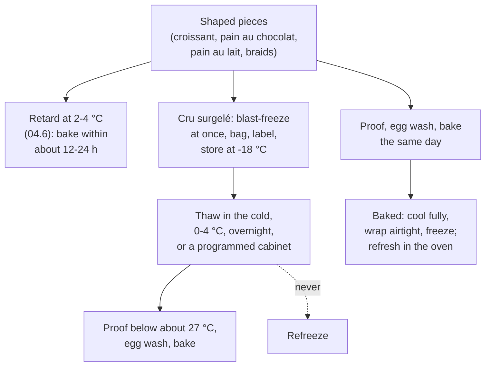

# 12.5 · Freezing, Storing and Packaging Viennoiserie

A croissant is at its best for a few hours, a pain au lait for a couple of days, a pain aux raisins for the day it is baked. Bakeries therefore plan viennoiserie with cold: they retard it, and unlike bread they may freeze it, raw or baked, so that the morning bake is ready at 6:00 without a tourier working through the night. This lesson explains what freezing does to a yeast dough, how to freeze, store, thaw and label viennoiserie safely, why the bread freezing ban of lesson [09.1](../module-09/lesson-01.md) does not cover it, and how each product is stored and packed for the customer. You run a freeze-and-bake test against a fresh control.

## Why it matters

The référentiel lists the blast freezer and the freezer (surgélateur et conservateur) among the equipment of viennoiserie (S3.4), and a real EP1 paper (2019) asked candidates the role of the freezer in making viennoiseries; packaging the finished products is a competency of its own (C2.4). Done well, freezing lets a small bakery offer fresh-baked croissants every morning, Sunday included. Done badly, it gives flat croissants with dry, flaky crusts, or a food-safety problem: a thawed tray refrozen, an unlabelled bag of unknown age, a cream product kept too long. And a baker who confuses the rules for bread and for viennoiserie either breaks the law on bread or throws away a useful tool.

## Key terms

| French | Say it | English meaning |
|---|---|---|
| surgélateur (cellule de surgélation) | *sür-zhay-lah-TUHR* | blast freezer: very cold, fast-moving air that freezes products quickly |
| conservateur (congélateur) | *kohn-sair-vah-TUHR* | storage freezer that keeps frozen products at about −18 °C |
| cru surgelé | *KRÜ sür-zhuh-LAY* | frozen raw: shaped, not proofed, frozen; proofed and baked after thawing |
| prêt à cuire (pré-poussé) | *pret ah KWEER* | frozen after proofing: baked straight from the freezer |
| décongélation | *day-kohn-zhay-lah-SYOHN* | thawing |
| brûlure de congélation | *brü-LÜR duh kohn-zhay-lah-SYOHN* | freezer burn: dry, pale patches where the surface lost water |
| conditionnement | *kohn-dee-syon-MAHN* | packaging finished products for sale or delivery |
| sachet | *sah-SHAY* | bag: paper for crisp products, plastic for soft ones |

## How it works

### What freezing does to a yeast dough

Freezing turns the dough's free water into ice. Three things follow (American Society of Baking):

- **Some yeast cells die.** Ice crystals and the concentrated salt and sugar around them damage cells, and dead yeast releases glutathione, which weakens the gluten. The longer the storage, the weaker and slacker the dough. Doughs made for freezing are therefore made with more yeast (ASBE gives about 1.5-2 times for frozen bread dough), cooler, and frozen **straight after shaping**, before fermentation has started.
- **Ice crystals cut gluten films**, and the dough holds gas less well. Fast freezing makes small crystals; slow freezing in a domestic freezer makes larger ones. Hence the **blast freezer** (surgélateur) to freeze quickly, then the **storage freezer** (conservateur) at about −18 °C.
- **The surface dries** in moving cold air: wrap the frozen pieces airtight as soon as they are hard, or they get freezer burn.

Fat and sugar protect the dough, which is one reason viennoiserie freezes better than lean bread dough. Butter layers are already cold and solid, so a laminated piece frozen raw keeps its structure, as long as it was never warm.

### The routes for viennoiserie

| Route | Best for | How | Limits |
|---|---|---|---|
| Retarding (cold, not frozen) | the next morning's croissants, pain au lait | shaped pieces held at about 2-4 °C, then proofed (lesson [04.6](../module-04/lesson-06.md)) | a night, not a week |
| Cru surgelé | croissants, pains au chocolat, pain au lait shapes | blast-freeze right after shaping; when hard, into bags or lidded boxes, labelled; −18 °C | home: up to about 2 weeks for croissants (King Arthur Baking); a bakery sets its own limit by testing |
| Prêt à cuire (frozen proofed) | industrial products made for it | proofed, then frozen; baked from frozen | needs special formulas: a home or craft proofed piece often collapses |
| Baked and frozen | pain au lait, brioche, braids | cooled completely, wrapped airtight, frozen; thawed wrapped, refreshed in the oven (King Arthur Baking) | croissants lose their crisp layers; good for soft products |

**Thawing.** Frozen raw pieces go on trays, covered, into the cold (0-4 °C) overnight; a programmable proofing cabinet does the same (lesson [04.6](../module-04/lesson-06.md)). ASBE gives about 12-18 hours at 1-4 °C. Then they proof as usual, below about 27 °C, a little longer than fresh. Never on a warm bench: the outside proofs and the butter softens while the inside is still frozen.

**Never refreeze** a thawed product unless a validated hazard analysis allows it (arrêté of 21 December 2009, annex VI, lesson [02.10](../module-02/lesson-10.md)): thaw only what you will bake.

**Products with crème pâtissière.** The cream must be used within 24 hours (lesson [12.2](lesson-02.md)), and a home or craft cream weeps after freezing. In this course, pains aux raisins are made and baked the same day; bakeries that freeze them use creams and procedures validated for it.

**Temperatures.** The French retail rule allows frozen foods up to −12 °C at the point of sale (arrêté of 21 December 2009, annex I); the course, like bakeries, stores at −18 °C (lesson [02.10](../module-02/lesson-10.md)), and records the freezer temperature daily ([temperature log](../../templates/temperature-log.md)).

### The law: bread no, viennoiserie yes

Code de la consommation **L122-17** reserves the words *boulanger* and *boulangerie* for professionals who knead, ferment, shape and bake **the bread** at the place of sale, and adds that **the dough and the breads** may not be frozen at any stage of production or sale (lesson [09.1](../module-09/lesson-01.md)). The article is about making bread; viennoiserie is not mentioned. The référentiel itself lists the blast freezer and freezer as viennoiserie equipment, and the EP1 2019 paper asked what the freezer is for in making viennoiseries. So:

- **bread dough and bread** (baguettes, tradition, pain courant, campagne…): never frozen in a boulangerie;
- **viennoiserie** made on site (croissants, pains au chocolat, pain au lait, brioche): may be frozen raw or baked.

A bakery that freezes its own croissants, made on site from its own raw materials, still makes **viennoiserie maison** in the trade's sense (lesson [09.1](../module-09/lesson-01.md)); one that buys frozen croissants from a factory does not, and must not say "maison" (L121-2). If a shop ever needs a formal answer for its own sign, the competent authority is the DGCCRF.

### Storing and packaging the finished products

| Product | Keeps | Store / sell | Package |
|---|---|---|---|
| Croissant, pain au chocolat | best within a few hours; sold the day they are baked | dry, ambient, out of the sun; never in the fridge (staling, lesson [07.5](../module-07/lesson-05.md)) | paper bag (sachet papier): lets steam out, crust stays crisp |
| Pain aux raisins | the day it is baked (it carries a cream) | as above; unsold ones are not kept for the next day | paper bag or pastry box |
| Pain au lait, pain brioché, brioche, braids | 2-3 days in a closed bag (fat and sugar slow staling) | ambient, closed | closed bag once completely cool (in France a thin plastic bag must be home-compostable and partly plant-based: [lesson 18.3](../module-18/lesson-03.md)), or a box; braids on a board for orders |
| Frozen raw pieces | as set by the bakery (home about 2 weeks) | −18 °C, in closed, labelled bags or boxes | food-grade freezer bags or lidded boxes |

**Packing hygiene (C2.4, C2.6):** finished products are handled with tongs or a clean sheet of paper, not bare hands, and only once they are cool enough not to sweat in their bag.

**Labels.** A frozen bag in the bakery's own freezer carries: product, number of pieces, date made and frozen, use-by date set by the bakery, lot or batch. A product **prepacked** for sale (a bag of six pains au lait sealed in advance) carries the full EU label: name, ingredients with allergens emphasised, net quantity, date, the bakery's name and address (lesson [02.11](../module-02/lesson-11.md)). A product sold **loose** has no label, but its allergens must be available to the customer in writing (lesson [02.10](../module-02/lesson-10.md)). For this module's products: wheat (gluten), milk, egg in almost all; soy (lecithin) in most chocolate; sulphites if the raisins contain them; nuts if you add almond cream or flaked almonds (EU Annex II).

## Worked example

A small bakery wants fresh croissants and pains au chocolat on Sunday and Monday, when the tourier is off. On Friday he laminates an extra batch and freezes it raw.

1. **Plan.** Sunday: 40 croissants, 30 pains au chocolat. Monday: 30 croissants, 24 pains au chocolat. Frozen raw on Friday at 11:00.
2. **Freezing.** Shaped pieces straight onto trays into the blast freezer; at 12:30 they are hard. Packed by 10 in freezer bags, air pressed out, into the storage freezer at −18 °C (log: −19 °C). Each bag labelled: "Croissants crus ×10 — fab./congelé 14/03 — à utiliser avant 28/03 — lot 1403-V". The bakery's own tests have set 14 days for its croissants.
3. **Saturday 16:00.** The Sunday trays (4 bags of croissants, 3 of pains au chocolat) go onto paper-lined trays, covered, into the programmable cabinet: thawing at 4 °C, then proofing from 3:30 at 25 °C, 80 % humidity. Sunday 6:00: proofed, egg-washed, baked.
4. **Sunday evening.** The Monday trays go into the cabinet the same way. One bag of croissants was taken out by mistake on Saturday and left in the cold room: it is baked on Sunday as well, **not refrozen**.
5. **Bread?** The owner asks whether he could also freeze the Sunday baguettes the same way. **No**: in a boulangerie, bread dough and bread may never be frozen (L122-17, lesson [09.1](../module-09/lesson-01.md)). For Sunday bread he uses pointage retardé or controlled proofing (lesson [04.6](../module-04/lesson-06.md)).
6. **Sales note (C4.2).** "Our croissants are made here from our own dough; on Sundays we bake pieces we shaped and froze ourselves on Friday." It is honest and it remains viennoiserie maison.

## Practice

A **freeze-and-bake test**: the same dough, baked fresh and after freezing, compared side by side. Use the laminated dough of lesson [12.1](lesson-01.md) (keep back 4 shaped pains au chocolat or croissants) and, if you froze it, the pain au lait half from lesson 12.3.

> [!WARNING]
> The oven is at about 190-200 °C: dry oven gloves, stand back from the hot air. Frozen trays and bags stick to wet fingers: handle them with dry hands or gloves.

> [!CAUTION]
> Thaw in the fridge, never on the bench, and never refreeze what has thawed. Egg wash is raw egg: fresh, cold, discarded after use. Allergens: wheat (gluten), milk, egg; soy and milk in most chocolate.

### You need

- Minimum: freezer at −18 °C (check with a thermometer), tray that fits in it, freezer bags or a lidded box, marker for labels, fridge at 5 °C or below, ruler, scale, [bake log](../../templates/bake-log.md), [quality rubric](../../templates/quality-rubric.md).
- Professional equivalent: blast freezer (surgélateur), storage freezer (conservateur) at −18 °C with a daily temperature record, programmable proofing cabinet, labelled bags or crates.

### Ingredients

| Item | Fresh control | Frozen test |
|---|---|---|
| Shaped pains au chocolat or croissants (lesson [12.1](lesson-01.md)) | 2, baked the same day | 2, frozen raw straight after shaping |
| Pain au lait rolls of 60 g (lesson [12.3](lesson-03.md)), optional | 2, baked the same day | 2 frozen raw after shaping; or 2 baked and frozen |
| Egg wash | fresh | fresh on the day of baking |

### In Israel

Checked 2026-10-08.

- **Your freezer:** home freezers are not blast freezers. Freeze the pieces in a single layer on a tray, uncovered, at the coldest setting, for 1-2 hours until hard, then bag them and press the air out. Check that the freezer reads −18 °C (the same target the Ministry of Health sets for frozen food in food businesses, lesson [05.4](../module-05/lesson-04.md)). Keep the bags away from the door and from fish or onions: butter takes up smells.
- **Summer:** the time between shaping and the freezer is the dangerous part in a 30 °C kitchen; shape in the air-conditioned room and get the tray into the freezer within minutes. Thaw in the fridge (5 °C or below), never on the counter.
- **Bags and labels:** freezer bags (*sakiot hakpa'a*, שקיות הקפאה) and a marker; write product, number of pieces and the date on every bag.
- **Bought frozen croissants** (*kruasonim kfu'im*, קרואסונים קפואים) in Israeli supermarkets are useful for comparison: read the ingredients and the fat type on the label (butter, *khem'a*, חמאה, or margarine, *margarina*, מרגרינה) and compare them with yours. Flour: [Flour in Israel](../../references/flour-in-israel.md).

### Steps

1. **Shaping day.** Shape 4 identical pieces from the same sheet. Weigh and number them. Bake 2 as the control (lesson [12.1](lesson-01.md) method); write the proof time, bake time and weight after cooling, and measure height and length.
2. **Freeze** the other 2 straight after shaping on a paper-lined tray, uncovered, until hard (1-2 hours); then bag them, press out the air, label (product, number, date) and store at −18 °C.
3. **Optional pain au lait:** freeze 2 shaped rolls raw the same way, or bake 2, cool them completely, wrap them airtight and freeze them.
4. **After 3-7 days**, the evening before baking: put the frozen pieces on a paper-lined tray, covered without touching, in the fridge overnight.
5. **Next morning:** proof at 24-26 °C until about doubled and wobbly (expect 30-60 minutes longer than fresh); egg-wash and bake exactly like the control. Thaw baked rolls wrapped at room temperature (about an hour) and refresh 5 minutes in a hot oven.
6. **Compare** after cooling: weight, height, length, colour, the cut section, the taste. Score fresh and frozen with the quality rubric and write the difference in your bake log.

### Targets

- Pieces into the freezer within 15 minutes of shaping; freezer at −18 °C; every bag labelled.
- Thawed in the fridge overnight, never refrozen.
- Frozen pieces within about 10 % of the fresh pieces' height, with open, separate layers.

### How you know it worked

The frozen-then-baked pieces look almost like the control: a little smaller and slower to proof, but with open layers, no greasy band and no pale, dry patches. If they are much flatter, the freezing was slow or the storage long, or they thawed warm; if the surface has dry, pale spots, the bag let air in. Your notes give you the rule you will use in a bakery: what freezes well, for how long, and how much longer it needs to proof.

### Self-check

- [ ] I froze the pieces straight after shaping, hard on a tray before bagging.
- [ ] Every bag carried product, number and date, and my freezer read −18 °C.
- [ ] I thawed in the fridge and did not refreeze.
- [ ] I can explain why baguette dough may not be frozen in a boulangerie but croissants may.
- [ ] I can choose the bag for a croissant and for a pain au lait, and list the allergens of each.

## What goes wrong

| Symptom | Likely cause | Fix now | Prevent next time |
|---|---|---|---|
| Frozen croissants flat, slack, little volume | Slow freezing; long storage; fermentation started before freezing | Give a longer proof; bake as a lower-grade product | Freeze straight after shaping, fast; respect the storage limit; more yeast if you freeze routinely |
| Pale, dry patches on the frozen pieces | Freezer burn: bag not airtight, frozen uncovered too long | Bake and judge; discard if very dry | Bag as soon as hard, air pressed out |
| Butter leaking, greasy bases after thawing | Thawed on a warm bench or proofed too warm | — | Thaw at 0-4 °C overnight; proof below about 27 °C |
| Outside over-proofed, inside still cold and dense | Proofed straight from the freezer | — | Thaw completely in the cold first |
| Bag with no date found in the freezer | No labelling routine | Discard: its age is unknown | Label every bag at once: product, number, dates, lot |
| Croissants soft and leathery in their bag | Packed warm or in plastic | — | Cool fully; paper bag for crisp products |
| Baguettes frozen "like the croissants" | Confusing the viennoiserie and bread rules | Not sold under the boulangerie sign; report | Bread: retarding or controlled proofing only (L122-17) |

## Review

- Freezing kills some yeast, cuts gluten with ice and dries the surface: freeze straight after shaping, fast, airtight, at −18 °C, for a limited time.
- Thaw raw pieces in the cold overnight, then proof below about 27 °C; never refreeze.
- In a boulangerie, bread dough and bread are never frozen (L122-17); viennoiserie made on site may be, and stays maison.
- Croissants and pains au chocolat: paper bag, same day; pains aux raisins: same day; pain au lait and brioche: closed bag, 2-3 days; never the fridge for baked products.
- Labels: frozen stock with product, number, dates and lot; prepacked products with the full EU label; allergens for loose products in writing. Exam reference: [The CAP Boulanger Exam](../../references/cap-exam.md).
