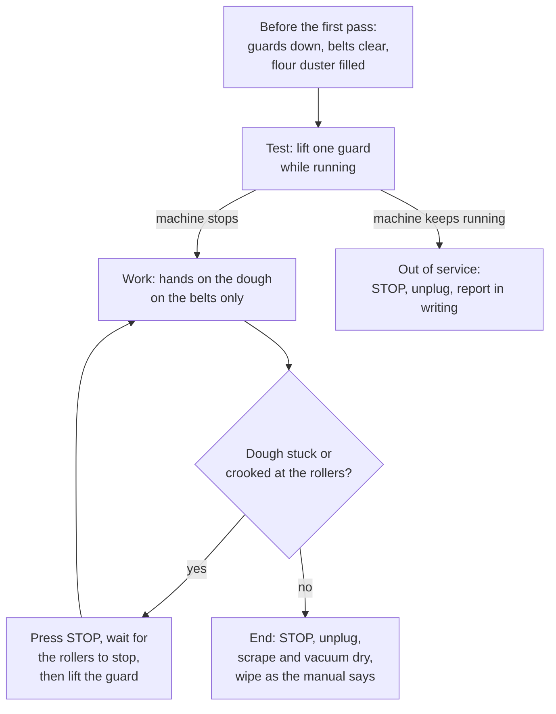

# 13.2 · Dividers, Moulders and the Sheeter

Between the mixer and the oven, machines can divide a tub of dough into equal pieces, roll baguettes to length and thin a block of laminated dough to millimetres. This lesson explains how the divider, the balancelle, the moulder and the sheeter (laminoir) work, what they do well and badly, and the rules that keep fingers out of their rollers. You write a workstation safety sheet for a sheeter and practise step-by-step sheeting by hand.

## Why it matters

The référentiel asks you to explain the role and use of the divider, volumetric divider, balancelle, repose-pâtons and moulder and to weigh the advantages and drawbacks of mechanisation (S3.1), and to explain the role of the sheeter for viennoiserie (S3.4; a real EP1 paper asked it, see [The CAP Boulanger Exam](../../references/cap-exam.md)). These machines decide whether 40 baguettes weigh the same and whether a croissant block keeps 27 butter layers. They are also the machines with rollers and blades, where a moment of impatience costs a finger: Module 13 is where the sheeter caution of lesson [11.4](../module-11/lesson-04.md) gets its source and its full rules.

## Key terms

| French | Say it | English meaning |
|---|---|---|
| diviseuse hydraulique | *dee-vee-ZUHZ ee-droh-LEEK* | hydraulic divider: presses one load into 10 or 20 equal pieces |
| diviseuse-bouleuse | *dee-vee-ZUHZ boo-LUHZ* | divider-rounder: divides and rounds small pieces such as rolls |
| peseuse volumétrique | *puh-ZUHZ vo-lü-may-TREEK* | volumetric divider: cuts pieces continuously by volume |
| balancelle | *bah-lahn-SELL* | intermediate prover: pockets carry the pieces through their détente |
| façonneuse | *fah-so-NUHZ* | moulder: rollers flatten, a belt and plate roll the piece to length |
| laminoir | *lah-mee-NWAR* | sheeter: two rollers with an adjustable gap and a belt on each side |
| écartement des rouleaux | *ay-kart-MAHN day roo-LOH* | roller gap: the thickness setting of a sheeter or moulder |
| protecteur (grille) | *pro-tek-TUHR (GREE-yuh)* | safety guard: lifting it stops the machine |
| fiche de poste | *FEESH duh POST* | workstation sheet: how to use one machine safely, displayed beside it |

## How it works

### Dividers: equal pieces by volume

A divider cannot weigh: it cuts **equal volumes**. A **hydraulic divider** takes one weighed load of dough in its round tank; the lid closes, a plate presses the dough flat and even, and knives rise to cut it into 10 or 20 pieces. Piece weight = load ÷ number of pieces: 20 baguettes of 340 g need a load of exactly 6,800 g. A **divider-rounder** does the same for rolls and then rounds each piece by an oscillating plate. A **volumetric divider** (peseuse volumétrique) pushes or sucks dough into a chamber of set volume, piece after piece, for larger production.

Because they cut volume, any change in density changes the weight: a load that has fermented longer, a dough that gassed unevenly, or a tank loaded unevenly gives light and heavy pieces. So the baker **weighs the load**, spreads it evenly, and **checks pieces on the scale** (lesson [06.3](../module-06/lesson-03.md)): several pieces at the start of each load, then adjusts the next load. Divide quickly so the last pieces have not gassed more than the first.

### Balancelle and moulder

The **balancelle** (or a repose-pâtons cabinet) carries the pieces through their détente, timed and covered. The **façonneuse** then sheets each piece between rollers into an oval, rolls it up on a belt, and lengthens it under a pressure plate. Its settings (roller gap, plate pressure and length) must match the dough: a gap too tight or a dough with too much strength tears; a plate too heavy degasses. The advantages and drawbacks of each machine are in the table of lesson [07.3](../module-07/lesson-03.md): speed, regularity and less strain on the wrists, against more degassing, less tolerance and a less artisanal look.

### The sheeter: thickness by steps

The block travels on one belt, passes between two rollers, and arrives thinner on the other belt; the direction is reversed and the gap set smaller, pass after pass, until the sheet has the thickness wanted (about 3.5 mm for the final CR-01 sheet, lesson [11.5](../module-11/lesson-05.md)). Each pass **stretches** the dough in length by the ratio of the thicknesses: from 10 mm to 7 mm the sheet becomes about 1.4 times longer. A big jump (20 to 7 mm at once) forces the butter to flow faster than the dough can follow: the layers crush and tear. Small steps, light dusting from the flour duster, and the same rests between turns as by hand (lesson [11.4](../module-11/lesson-04.md)) keep them whole. The gain is speed: a few seconds per pass, so the dough warms less than under a rolling pin.

### Safety at the rollers

The sheeter's rollers, like the moulder's, **draw in and crush** fingers. A modern sheeter has hinged **safety guards** over the rollers: lifting a guard stops the machine. One maker's operating manual (RONDO, 2022, built to the European sheeter standard EN 1674) sets rules that apply to every machine of this kind:

- only **instructed** people use it (that manual says at least 16 years old); close-fitting clothes, no rings, necklaces or loose sleeves, hair under a net;
- **never reach under a closed guard**; to free or straighten the dough, stop the machine first;
- the guards are not an on/off switch: stop with the **STOP** button; in danger, the **emergency stop**;
- safety elements are **never adjusted, bridged or removed**; a machine with a faulty guard is not used, and the fault is repaired with original parts;
- the **mains plug is pulled** before any repair, maintenance or opening;
- no knives or tools left on the belts; an automatic flour duster limits flour dust; never compressed air, a hose or a high-pressure cleaner for cleaning.

INRS adds the employer's side: machines from which dangerous moving parts cannot be reached, safety devices checked periodically, equipment made safe before cleaning and maintenance, and a **workstation sheet** written from the maker's instructions and displayed beside each machine, with training in fleurage and laminage.

> [!CAUTION]
> Use a sheeter, moulder or divider only after you have been trained on that machine. Hands stay on the dough on the belts, never near the rollers or under a guard while the belts run; stop with the STOP button before reaching in; clean only with the machine stopped and unplugged, as its manual says.

## Worked example

Saturday morning, Boulangerie du Marché. Twenty baguettes of 340 g go through the hydraulic divider, the moulder and, later, a croissant block goes through the sheeter.

1. **Divider load.** 20 × 340 g = **6,800 g** weighed on the scale, spread evenly in the tank, lid closed, divided. Check five pieces: 336, 342, 330, 345, 341 g, average 338.8 g, range 15 g. The 330 g piece came from the edge where the dough was thinnest: next load spread flatter. Average within 2 g of target: accepted, and the light piece set aside for the rolls.
2. **Moulder.** After 20 minutes of détente the first baguette comes out of the façonneuse torn on top. The dough is strong (long pointage, lesson [07.3](../module-07/lesson-03.md)). Decision: 10 more minutes of détente and the roller gap opened one notch; the next pieces come out smooth at 55 cm.
3. **Sheeter, CR-01 block, final sheeting.** Block about 20 mm. Gap steps 20 → 14 → 10 → 7 → 5 → 3.5 mm, turning the sheet a quarter turn once to keep it square. At 7 mm the sheet drifts and catches the side of the guard. The tourier presses **STOP**, waits for the rollers to stop, lifts the guard, straightens the sheet, lowers the guard and restarts. She does not reach under the guard "to save a second".
4. **End of the session.** STOP, unplug, scrapers and belts cleaned dry, flour vacuumed (lesson [13.6](lesson-06.md)). The guard test of the morning is ticked on the machine's workstation sheet.

## Practice

Two parts: a workstation safety sheet for a sheeter (paper), then a sheeting drill by hand that copies what the machine does.

> [!WARNING]
> In part B use a stable board that does not slide (a damp cloth underneath). If you use a hand-cranked pasta machine as a mini sheeter, keep the fingers of the feeding hand flat on the dough well away from the rollers and turn the crank only with the other hand; never feed with your fingertips. The dough contains wheat and milk: keep it away from anyone allergic.

### You need

- Part A: the operating manual of any bakery sheeter (makers publish them online), paper, the [non-conformity report](../../templates/non-conformity-report.md) for the fault section.
- Part B: rolling pin, thickness guides (two wooden strips or two stacks of identical coins, 4 mm and 7 mm), ruler with millimetres, cling film, baking paper and tray. Optional: a hand-cranked pasta machine.
- Professional equivalent: hydraulic divider, divider-rounder, balancelle, moulder and a sheeter with flour duster.

### Ingredients

A firm yeast-free practice dough, close to a détrempe in feel (baked afterwards as crackers):

| Ingredient | Baker's % | Home (300 g flour) | Professional comparison (CR-01 détrempe, 5 kg flour) |
|---|---|---|---|
| Flour (T45 or T55 type) | 100 | 300 g | 5,000 g |
| Water (cold) | 50 | 150 g | 2,600 g water + milk (52 %) |
| Salt | 2 | 6 g | 100 g |
| Butter (soft) | 8 | 24 g | 400 g |
| Total | 160 | 480 g | (with sugar 11 % and yeast 4 % in CR-01) |

### In Israel

Checked 2026-10-09.

- **Tools.** A rolling pin (*ma'aroch*, מערוך) and two strips of wood from a hardware shop make good thickness guides; adjustable spacer rings for rolling pins are sold in baking-supply shops. A hand-cranked pasta machine (*mechonat pasta*, מכונת פסטה) shows the sheeter's principle on small strips.
- **Warm kitchen.** In summer the dough softens fast: rest it in the fridge, roll in the air-conditioned room, and put it back in the fridge between passes if it starts to stick.
- **Professional sheeters** are sold in Israel only through professional bakery-equipment suppliers; you will meet one at a training bakery or on placement, not at home. Flour: [Flour in Israel](../../references/flour-in-israel.md).

### Steps

**Part A: workstation safety sheet (about 45 minutes).**

1. Find and open the operating manual of one bakery sheeter. Read its safety chapter.
2. Write a one-page **fiche de poste** for it with these headings: machine and maker; who may use it; clothing and PPE; checks before starting (guards, emergency stop, belts clear, flour duster); how to start and stop; what to do if the dough sticks or drifts; what is forbidden; cleaning (state of the machine, method, what is never used); what to do if a guard does not stop the machine (who, how, the [non-conformity report](../../templates/non-conformity-report.md)).
3. Mark each line of your sheet with the page of the manual it comes from. A line with no page is your opinion: check it or delete it.

**Part B: sheeting drill (about 75 minutes with rests).**

4. Mix the practice dough by hand to a smooth, firm dough; flatten to a 2 cm square; film; fridge 45 minutes.
5. Cut it in two. **Piece 1, steps:** roll to 14 mm, then 10, 7 (on the 7 mm guides), rest 10 minutes in the fridge, then 5 and 4 mm (4 mm guides). Rotate a quarter turn once. Note the time.
6. **Piece 2, one big step:** roll from 2 cm straight down to 4 mm in one go, pressing hard.
7. **Measure** both sheets at five points with the ruler (edge and centre) and note any tears and the shrink-back after 5 minutes.
8. Prick both sheets, cut into crackers, bake at 200 °C about 12-15 minutes until golden.

### Targets

- A fiche de poste with every line traced to a page of the manual, including the guard test and the faulty-guard procedure.
- Piece 1: 4 mm ±0.5 mm at all five points, no tears.
- Piece 2: the differences in thickness and the tears or shrink-back recorded.

### How you know it worked

Your fiche de poste could be pinned beside a real machine: someone who has never used it knows what to check, what never to do and what to do when the guard fails. Piece 1 is even and stays the size you rolled; piece 2 is thicker in the middle, shrinks back and may tear: the same thing happens to butter layers when a sheeter's gap jumps too far.

### Self-check

- [ ] I can say how a hydraulic divider, a moulder and a sheeter work and give one advantage and one drawback of each.
- [ ] I calculate a divider load from the piece weight and check pieces on the scale.
- [ ] I can explain why the sheeter's gap is reduced in small steps.
- [ ] I can list the sheeter safety rules from a maker's manual: guards, STOP, never under a guard, never bypass, unplug to service.

## What goes wrong

| Symptom | Likely cause | Fix now | Prevent next time |
|---|---|---|---|
| Divided pieces vary by 10-20 g | Load spread unevenly; dough gassed; slow dividing | Re-scale the outliers; spread the next load flat | Weigh the load; divide promptly; check pieces every load |
| All pieces light | Load weighed for the wrong piece number or weight | Adjust the next load; use light pieces for another product | Load = piece weight × number, written on the sheet |
| Baguettes torn by the moulder | Dough too strong; détente too short; gap too tight | Longer détente; open the gap one notch | Match settings to the dough; check the first piece |
| Croissant sheet with crushed, smeared layers | Gap reduced in big jumps; butter too cold or too warm | Rest the block in the cold; continue in small steps | Small gap steps; butter at about 13 °C (lesson 11.3) |
| Guard lifted and the rollers keep turning | Interlock faulty or bypassed | STOP, unplug, machine out of service | Guard test before each session; report in writing; never bypass |

## Review

- Dividers cut volume, not weight: load = piece weight × number; weigh the load, spread it evenly, check pieces on the scale.
- The moulder and divider trade speed and regularity for more degassing and less tolerance; settings follow the dough.
- The sheeter thins by steps: each pass lengthens the sheet; small steps keep laminated layers whole.
- Sheeter safety (maker's manual, INRS): trained users, guards down and tested, STOP before reaching in, never under a guard, never bypass, unplug to clean or service, no compressed air or hose.
- Exam-relevant (S3.1 mechanisation, S3.4 laminoir): see [the CAP exam reference](../../references/cap-exam.md).
