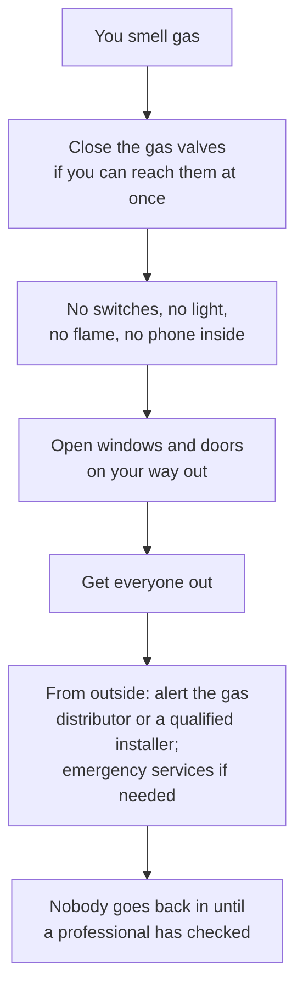

# 13.5 · Energy, Gas and Electrical Safety

Every machine in the fournil runs on electricity or gas, and both can kill: a shock through a wet hand, a spark in a gas-filled room, carbon monoxide from a badly burning flame. This lesson teaches the few numbers a baker needs to read an appliance's rating plate, the protections built into the installation and what each one does, how combustion goes wrong, and what to do when you smell gas or see a damaged cable. You read the rating plates of your own appliances. You never open, repair or modify an electrical or gas appliance: reading the plate and the outside of the cable is the limit.

## Why it matters

The référentiel asks a CAP candidate to read and interpret an appliance's rating plate, give the role of the circuit breaker, residual-current device, earth, emergency stop and insulation, cite the gas safety elements of a bakery (shut-off valve, detector, fire door, ventilation, the thermocouple on equipment), define combustion and explain the risks of gas: asphyxia, explosion, fire (S4.3; see [The CAP Boulanger Exam](../../references/cap-exam.md)). In the bakery these are not exam abstractions: wet floors, flour dust in the air, 230 and 400 V machines and gas burners share one room, often at 4 in the morning with one person present.

## Key terms

| French | Say it | English meaning |
|---|---|---|
| plaque signalétique | *PLAHK see-nyah-lay-TEEK* | rating plate: maker, model, voltage, frequency, power, class |
| tension / intensité / puissance | *tahn-SYOHN / an-tahn-see-TAY / pwee-SAHNSS* | voltage (V) / current (A) / power (W) |
| disjoncteur | *dees-zhonk-TUHR* | circuit breaker: cuts the circuit on overload or short circuit |
| dispositif différentiel (DDR) 30 mA | *dee-po-zee-TEEF dee-fay-rahn-SYEL* | residual-current device: cuts when current leaks to earth |
| prise de terre | *PREEZ duh TAIR* | earth connection: carries a fault current safely away |
| arrêt d'urgence | *ah-RAY dür-ZHAHNSS* | emergency stop or emergency cut-off |
| vanne d'arrêt (de gaz) | *VAHN dah-RAY* | gas shut-off valve |
| combustion (incomplète) | *kohn-büs-TYOHN (an-kohm-PLET)* | burning; incomplete when air is short, producing carbon monoxide |
| monoxyde de carbone (CO) | *mo-nok-SEED duh kar-BONN* | carbon monoxide: colourless, odourless, toxic gas |
| thermocouple | *tair-mo-KOO-pluh* | flame-failure sensor that shuts the gas if the flame goes out |

## How it works

### Four numbers on the rating plate

| On the plate | Meaning | Example (a bakery proofing cabinet) |
|---|---|---|
| 230 V | voltage it must be connected to (400 V and "3~" for three-phase machines such as large mixers and ovens) | 230 V |
| 50 Hz | mains frequency (Europe and Israel 50 Hz; USA 60 Hz) | 50 Hz |
| 2,300 W or 2.3 kW | power it draws at full load | 2.3 kW |
| 10 A (sometimes) | current it draws | 10 A |
| CE, class symbol, IP code | conformity mark; class I (earthed, three-pin plug) or class II (double insulation, square-in-square symbol, no earth); IP: first digit protection against contact and dust (0-6), second against water (0-8) | CE, class I, IPX4 |

Two formulas do almost everything (INRS ED 6345; for a single-phase heating appliance):

$$P = U \times I \qquad\qquad E = P \times t$$

with P in watts, U in volts, I in amperes, E in kilowatt-hours when P is in kW and t in hours. The cabinet above draws I = 2,300 ÷ 230 = **10 A**; running at full power for 2 hours it uses 2.3 × 2 = **4.6 kWh** at most (a thermostat cuts in and out, so the real figure is lower).

Electricity becomes **heat** by the Joule effect (ovens, proofer heaters, steam generators, kettles) and **movement** in motors (mixers, sheeters, compressors, fans). A deck oven of tens of kilowatts, a spiral mixer and the refrigeration unit together set the bakery's subscribed power and its bill.

### What electricity does to a body

The current through the body is what injures (INRS):

| Alternating current through the body | Effect |
|---|---|
| 0.5 mA | felt |
| 5 mA | shock (danger starts here) |
| 10 mA | muscles contract: the hand cannot let go |
| 25 mA | breathing muscles contract: asphyxia beyond about 3 minutes |
| 40 mA for 5 s, 50 mA for 1 s | ventricular fibrillation: the heart stops pumping |

Wet skin and a wet floor let much more current through. INRS: every voltage above 50 V is potentially lethal; sockets are at 230 V. Burns from the current or from an arc come on top.

### The protections and what each one does

| Device | What it protects against | How |
|---|---|---|
| Fuse / disjoncteur (circuit breaker) | overload and short circuit: overheated cables, fire | cuts the circuit when the current exceeds its rating |
| Prise de terre + green/yellow conductor | a live metal casing (class I appliance with an insulation fault) | carries the fault current to earth so a protective device trips |
| DDR 30 mA (high sensitivity) | current leaking through a person to earth | cuts when the currents in and out differ; required for sockets up to 32 A, wet rooms and homes; a **complement** to the other measures, not a protection on its own (INRS) |
| Arrêt d'urgence | any danger at a machine or installation | cuts the power at once; must stay reachable |
| Isolants, class II | contact with live parts | insulation, double insulation |

### Ten rules for everyone who is not an electrician

From INRS's elementary rules: never repair or modify an electrical appliance, plug or cable yourself; check the casing, cable and plug before each use and set aside anything damaged; unplug by the plug, not the cable; do not run trolleys over cables; no wet hands on switches, sockets or appliances, and clean electrical equipment only if it is designed for water; do not open an electrical cabinet or reset a protection unless your employer has authorised you; know where the emergency cut-off is and keep it clear; report every anomaly (burnt smell, smoke, crackling, sparks, a breaker that keeps tripping).

> [!WARNING]
> Do not open, repair or modify any electrical or gas appliance, plug, socket, panel or pipe, at home or at work. A damaged cable, a socket that is hot or blackened, or a breaker that trips again and again means: unplug if it is safe to do so, stop using it and call a qualified electrician (or the gas professional). Reading the rating plate is all this lesson asks you to do.

### Gas: combustion and its dangers

Bakeries burn natural gas, propane or butane, fuel oil or wood. **Combustion** is the reaction of the fuel with the oxygen of the air: complete, it gives carbon dioxide, water and heat. With too little air (blocked ventilation, a dirty burner, a blocked flue) it is **incomplete** and also produces **carbon monoxide**: colourless, odourless and toxic. Signs are headache, unusual fatigue, nausea, dizziness, often in several people at once and better away from the building (Ministry of Ecological Transition, 2026).

The gas itself brings three risks named by the référentiel: **asphyxia**, **explosion** and **fire**. Flour dust in the air adds its own explosion risk, so INRS asks bakeries to treat the areas around gas pipes and where flour accumulates as explosive atmospheres (ATEX).

Safety elements in a bakery:

- **vanne d'arrêt**: the gas shut-off valve, at the entrance of the premises and before each appliance; everyone knows where it is;
- **détecteur avec alarme**: a gas detector that warns before the concentration becomes dangerous;
- **porte coupe-feu** and **ventilation**: fire doors that hold a fire back, permanent air inlets and outlets for combustion and dilution, never blocked;
- **thermocouple** on the burner: the flame heats a small sensor that holds the gas valve open; if the flame goes out, the sensor cools and the valve closes, so unburnt gas does not fill the oven;
- installation and changes only by a qualified professional, with a certificate of conformity; cooker hoses replaced by their expiry date; CE-marked appliances (Ministry of Ecological Transition).

That sequence follows the Ministry's guidance: close the valves, do not switch on the light, do not phone from inside (landline or mobile), go out, alert a qualified installer or the gas distributor. For suspected carbon monoxide: ventilate at once, stop the combustion appliances, leave, call the emergency services (France: 15, 18 or 112).

## Worked example

4:10, Boulangerie du Marché: a small fournil with an electric deck oven, two spiral mixers and an old gas-fired proofing cabinet in the back room. Three problems arrive before the first load.

1. **The breaker trips.** It is a cold morning; an apprentice has plugged a 2,000 W portable heater and the 2,300 W proofing cabinet into one extension lead on the same socket circuit. Current: (2,000 + 2,300) ÷ 230 = **18.7 A**, more than a 16 A circuit carries. The breaker does its job. Correct: heater unplugged and removed; proofing cabinet back on its own socket; no extension leads chained. Recorded.
2. **The mixer cable.** The spiral mixer's cable has a cut in its outer sheath where a trolley ran over it. Correct: do not use, do not tape it, unplug it by the plug (dry hands), label "out of service", report to the owner, who calls an electrician. Mix by the second mixer today.
3. **The gas smell.** The baker smells gas near the old gas-fired proofer in the back room. She closes the gas valve beside it, does not touch the light switch, opens the back door, leaves with the apprentice and phones the gas distributor's emergency line from the street. The technician finds a cracked hose past its expiry date. Nobody re-enters the back room until he has finished. Non-conformity report written; the owner orders the hose replaced and the detector tested.
4. **What the rating plates told them.** The plate on the gas proofer shows its gas type and that it has a flame-failure device; the electric deck's plate shows 400 V 3~ and its power, which the owner compares with the bakery's subscribed power before adding equipment.

## Practice

You read the rating plates of three appliances in your kitchen, calculate their current and energy, find the protections of your home, and write a one-page safety card.

> [!WARNING]
> Look, do not touch inside. Unplug an appliance (by the plug, with dry hands) only if you must move it to read its plate. Do not open the electrical panel, any appliance casing or any gas fitting; if you find damage, stop using that appliance and call a qualified professional.

### You need

- Your oven, a mixer or kettle, and one more appliance (fridge, microwave or toaster); a torch; paper or the template below; your last electricity bill (for the price per kWh).
- Professional equivalent: the rating plates of a deck oven, spiral mixer, proofing cabinet and refrigeration unit; the bakery's electrical panel and gas shut-off, which only authorised people open.

### Ingredients

None: this is an inspection and calculation exercise.

### In Israel

Checked 2026-10-09.

- **Mains:** 230 V, 50 Hz, as in France. Israeli sockets are Type H: the plug has three round pins in a triangle and is earthed, rated 16 A; sockets made since 1989 also accept two-pin European Type C plugs, which have no earth. Class I appliances (oven, stand mixer, kettle with a metal body) need their earthed three-pin plug: no two-pin adapters for them.
- **Imported appliances:** a mixer made for the USA is rated 120 V, 60 Hz. Plugged into 230 V through a simple plug adapter it receives about twice its voltage and can burn out or catch fire. Buy appliances rated 230 V, 50 Hz.
- **Your panel** (*luach chashmal*, לוח חשמל) has the main switch (*mafsek rashi*, מפסק ראשי), the circuit breakers and normally a residual-current device (*mimsar pachat*, ממסר פחת). Find them and note which breaker feeds the kitchen; do not open the panel. Earthing is *ha'araka* (הארקה). Any work: a licensed electrician (*chashmala'i musmach*, חשמלאי מוסמך).
- **Gas:** if you cook on gas, find the cooker's shut-off tap and your gas supplier's emergency number (on the bill or the supplier's sticker) and write both on your card. Only the supplier's certified technician connects, disconnects or moves a gas cooker. Fire and rescue in Israel: 102.

### Steps

1. **Find each rating plate** (oven: often on the door frame or behind the drawer; mixer and kettle: underneath). Copy for each: maker and model, V, Hz, W (or kW), A if shown, class symbol or plug type, IP code if any, CE mark.
2. **Calculate** for each: I = P ÷ U. Then the maximum energy of one use: oven preheat 45 minutes + bake 30 minutes at full power; mixer 10 minutes; kettle 3 minutes. Multiply by your price per kWh from the bill.
3. **Check one circuit:** if the oven and kettle were on one 16 A circuit at the same time, would it trip? Show the sum.
4. **Look at the cables and plugs** (outside only): sheath intact, plug not cracked or warm, no taped joins. Note anything to report.
5. **Locate** the panel, main switch, kitchen breaker and residual-current device; the gas tap and supplier number if you have gas. Do not open anything.
6. **Write your safety card** (one page, on the fridge): appliance list with power and current; where to cut electricity and gas; the gas-smell sequence; who to call.

### Targets

- Three rating plates copied completely and three currents calculated (I = P ÷ U) to one decimal.
- The cost of one home bake calculated from your own tariff.
- A safety card with the locations of the main switch, residual-current device, kitchen breaker and (if any) gas tap, and the gas-smell sequence.

### How you know it worked

You can look at any appliance and say what it draws and whether it may share a socket with another, and you know which device protects you from what. In an emergency you would not have to think: the main switch, the gas tap and the numbers are on your card. For example, an oven plate reading 3,450 W at 230 V draws 15 A, close to a 16 A circuit on its own.

### Self-check

- [ ] I can read V, Hz, W, A, the class symbol and the IP code on a rating plate and calculate I = P ÷ U and E = P × t.
- [ ] I can say what the circuit breaker, the 30 mA residual-current device, the earth and the emergency stop each protect against.
- [ ] I can explain incomplete combustion and recognise the signs of carbon monoxide.
- [ ] I know the gas-smell sequence and never open or repair an electrical or gas appliance.

## What goes wrong

| Symptom | Likely cause | Fix now | Prevent next time |
|---|---|---|---|
| Breaker trips when a second appliance starts | Total current above the circuit's rating (I = P ÷ U summed) | Unplug one appliance; do not reset again and again | Spread heavy appliances over circuits; no chained extension leads |
| Residual-current device trips, especially after cleaning | Current leaking to earth: water in an appliance or a damaged cable | Leave it off; unplug the suspect appliance; call an electrician | Clean electrical equipment only as designed; dry floors; check cables |
| Casing gives a tingle | Insulation fault, earth missing (two-pin adapter on a class I appliance) | Stop using it; unplug by the plug; report | Earthed plugs for class I appliances; no adapters |
| Headaches and nausea in several staff near a gas appliance | Incomplete combustion: carbon monoxide | Ventilate, stop the appliance, get everyone out, call for help | Annual servicing, clean burners and flues, ventilation never blocked |
| Smell of gas | Leak at a hose, joint or burner | Valves closed, no switches or phone inside, out, alert from outside | Hoses within their date; installation by a qualified professional; detector tested |

## Review

- Rating plate: V, Hz, W, A, class (I earthed, II double insulation), IP; P = U × I and E = P × t give current and energy.
- Breaker and fuse protect cables from overload; earth plus a 30 mA residual-current device protect people from leaks; the emergency stop cuts everything; never repair or open anything yourself.
- From 10 mA a hand cannot let go; around 40-50 mA the heart can fibrillate; water makes everything worse.
- Gas: complete combustion gives CO₂ and water; incomplete gives odourless, toxic CO. Shut-off valve, detector, ventilation, thermocouple; on a gas smell: close, no switches or phone, out, alert from outside.
- Exam-relevant (S4.3 energy and safety): see [the CAP exam reference](../../references/cap-exam.md).
