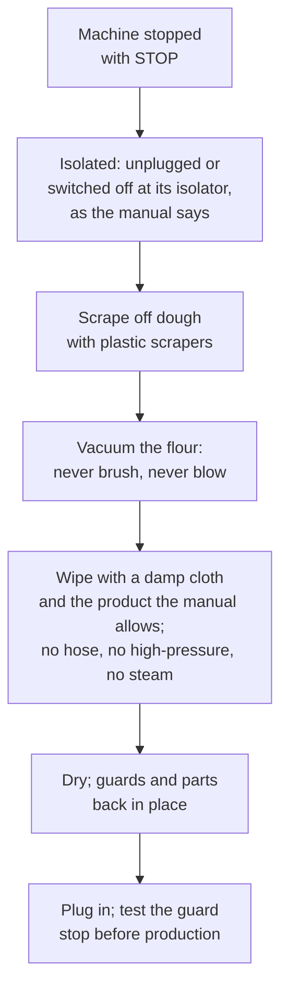

# 13.6 · Small Equipment, Cleaning and Care

The last of the 18 stages is a clean bench, and the first condition of the next production is equipment that weighs, measures and cuts correctly. This lesson covers the small tools of the fournil, the materials they are made of and how each is cared for, how machines are cleaned without injury or flour clouds, and how a maintenance log keeps scales and thermometers honest. You write and run a clean-down protocol for your own kit.

## Why it matters

A scale that reads 6 g heavy per kilogram shifts every formula; a thermometer 2 °C out shifts every water temperature (lesson [01.4](../module-01/lesson-04.md)); a banneton put away damp grows mould; a sheeter wiped with a hose fails electrically. Cleaning is also when machine accidents happen: the INRS bakery prevention sheet insists that equipment be made safe before cleaning and maintenance. The référentiel asks you to apply health-and-safety and food-hygiene measures at your workstation (C2.5, C2.6) and to know the properties and care of the materials of bakery equipment (S4.3; see [The CAP Boulanger Exam](../../references/cap-exam.md)). The full hygiene method (cleaning versus disinfection, products, the cleaning plan, HACCP) is [Module 17](../module-17/lesson-04.md)'s subject; this lesson covers the equipment side. Choosing and dosing the cleaning products with less waste is in lesson [18.3](../module-18/lesson-03.md).

## Key terms

| French | Say it | English meaning |
|---|---|---|
| petit matériel | *puh-TEE mah-tay-RYEL* | small equipment: scraper, knife, lame, brushes, bannetons, trays |
| corne / coupe-pâte | *KORN / koop-PAHT* | flexible bowl scraper / bench scraper |
| pinceau | *pan-SOH* | pastry brush for egg wash |
| inox (acier inoxydable) | *ee-NOX* | stainless steel: the standard material of benches and machines |
| nettoyage du poste | *net-wah-YAHZH dü POST* | cleaning down the workstation (stage 18) |
| plan de nettoyage | *PLAHN duh net-wah-YAHZH* | cleaning plan: what, when, how, with what, by whom |
| aspirateur à farine | *as-pee-rah-TUHR ah fah-REEN* | vacuum suited to flour dust |
| cahier d'entretien | *kah-YAY dahn-truh-TYAN* | maintenance log: checks, faults, repairs |

## How it works

### The small equipment and its care

| Tool | Job | Care and checks |
|---|---|---|
| Balance (scale) | every weighing | wiped dry; checked with a known weight (lesson [01.4](../module-01/lesson-04.md)); never hosed |
| Thermomètre à sonde | dough, water, core temperatures | probe washed and wiped between foods; checked in iced water at 0 °C ±1 °C |
| Thermomètre de four | real oven temperature | wiped cold; checked against a second thermometer |
| Lame, couteau, roulette, coupe-croissants | scoring and cutting | blades changed when they drag; covered when not in hand; washed and dried at once |
| Corne, coupe-pâte, pinceau | scraping, dividing, egg wash | scraped then washed; brushes washed, rinsed and dried after egg wash (raw egg) |
| Bannetons (cane, wood pulp) | proofing boules | flour shaken out after use; dried dough brushed off when dry; if needed warm water and a stiff brush, no soap, dried completely (King Arthur) |
| Couche, banneton liners (linen) | holding baguettes and boules | shaken out, dried fully, folded only when dry; liners shaken, not washed |
| Plaques, filets, moules, grilles | baking, proofing, cooling | scraped, washed, dried; bent or blistered trays and tins replaced |
| Bacs à pâte, chariots | dough tubs and racks | washed, dried, wheels cleaned of dough and flour |

The common thread is **dry**. Dough residue, flour and water together make a paste that sets hard and feeds moulds; cane and linen that stay damp go musty or mouldy.

### Materials and why they are cared for differently

| Material | Properties | Care |
|---|---|---|
| Stainless steel (inox) | smooth, resists corrosion and heat, easy to clean | scrape dough off before washing; dry to avoid water marks |
| Aluminium, blackened steel trays | conduct heat well; can be marked by harsh detergents | follow the maker's cleaning advice; replace when blistered |
| Wood (peels, planchettes, benches) | firm, insulating, good grip for dough; porous | scrape and brush dry; little water; dry fully; replace when split |
| Plastics (scrapers, tubs) | light, cheap; scratches hold dirt; limited heat | wash and dry; replace when deeply scratched or cracked |
| Cane, wood pulp (bannetons) | absorbs moisture from the dough surface | flour shaken out; dried completely |
| Linen (couche) | stiff, absorbs surface moisture, holds shape | shaken out, dried; washed rarely |

### Cleaning machines without injury

- **Stopped and isolated first.** A machine that is only "off" at the button can be restarted by someone else. Isolate it as its manual says (pull the plug; for fixed machines the isolating switch) before a hand goes near the hook, the rollers or the knives.
- **Dry before wet.** Dough and flour come off with scrapers and the vacuum. Water first turns flour into paste.
- **Flour is vacuumed**, never brushed and never blown with compressed air: brushing and blowing put the dust back in the air you breathe (INRS).
- **No hose, no high-pressure, no steam cleaner on machines**: water in motors and controls causes shocks and failures (a sheeter maker forbids all three).
- **Floors** clean and dry at the end: wet flour is the classic slip.

> [!CAUTION]
> Clean a mixer, divider, moulder or sheeter only when it is stopped and isolated (unplugged or switched off at its isolator as its manual says); never reach past a guard into a machine that could restart. Blades of lames, knives and the divider's knives cut even when still: handle them by the back, clean them away from your body, and never leave a blade in the washing-up water where someone could grab it.

### The maintenance log

A small notebook or sheet by the scale, filled in at a fixed rhythm ([maintenance log](../../templates/maintenance-log.md) template):

| Check | Typical rhythm | Pass |
|---|---|---|
| Scale with a known weight (or a sealed 1 L bottle of water, about 1,000 g) | weekly and after a knock | within the scale's division |
| Probe thermometer in iced water | weekly and after a fall | 0 °C ±1 °C, or offset written down |
| Oven thermometer vs display | monthly | difference written on the oven card |
| Lame blades | when they drag | changed, date written |
| Steam tray (home) or steam generator (bakery) scale | monthly / as the maker says | descaled |
| Machine guards and emergency stops | before each session (bakery) | machine stops |

A failed check goes on a [non-conformity report](../../templates/non-conformity-report.md) and the equipment is not used until fixed or its offset is written where everyone sees it.

## Worked example

Saturday 13:00, end of production at Boulangerie Au Pain de la Halle. The apprentice has 45 minutes to clean down.

1. **Order.** Machines first (they take longest to dry), then small equipment, then benches, then the floor last. Dry before wet everywhere.
2. **Spiral mixer.** STOP, plug pulled, bowl scraped with the corne, the hook and the lid scraped, dried dough flakes vacuumed; then wiped with a damp cloth and the product on the cleaning plan; dried; plug back.
3. **Sheeter.** STOP, plug pulled; belts scraped dry with plastic scrapers, flour duster emptied as the manual says, flour vacuumed from under the belts. The apprentice reaches for the compressed-air gun to "blow the flour out of the rollers": stopped by the head baker. Vacuum only; no air, no water.
4. **Bannetons.** One banneton shows a grey-green spot inside: it was stacked damp yesterday. It is taken out of use and shown to the head baker (whether it can be saved is a hygiene decision, [Module 17](../module-17/lesson-04.md)). The others are shaken out and set on a rack to dry, not stacked.
5. **Maintenance log.** Weekly scale check: the 1 kg test weight reads 1,006 g. The scale is not used for salt and yeast until it is recalibrated or replaced; a non-conformity report is written. Probe in iced water: 0.3 °C, pass.
6. **Floor.** Vacuumed, then washed and left to dry with the wet-floor sign out.

## Practice

You write a cleaning and care sheet for your own home kit and run it after your next bake, with a maintenance check of your scale and thermometer.

> [!WARNING]
> Unplug the stand mixer before you take off the hook or clean the head. Handle lames and knives by the back, wash them separately and never leave them in the sink water. Do not put the scale, the mixer head or the probe's handle under the tap.

### You need

- Your home kit: scale, probe thermometer, oven thermometer, lame, scraper, bowls, trays, couche or towel, banneton if you have one, stand mixer if you have one.
- A vacuum cleaner (or a damp cloth for small amounts of flour; no broom), plastic scraper, dishcloths, washing-up liquid, a glass of iced water, a sealed 1 L bottle of water or a known weight, a notebook for the maintenance log.
- Professional equivalent: the bakery's cleaning plan, flour vacuum, plonge, maintenance log beside the scale.

### Ingredients

| Supply | Quantity | Use |
|---|---|---|
| Ice cubes and cold water | one tall glass | thermometer check |
| Sealed 1 L bottle of water (or a known weight) | 1 | scale check |
| Washing-up liquid, hot water | as needed | small equipment, bowls, trays |

### In Israel

Checked 2026-10-09.

- **Hard water.** If your kettle shows white deposits, your tap water is hard and the steam tray will scale up too. Descale it when deposits build up (water hardness: lesson [02.4](../module-02/lesson-04.md)).
- **Summer humidity:** couches, banneton liners and cane bannetons dry slowly on the coast in summer; dry them in the air-conditioned room or in the sun, and never put them away until fully dry.
- **Words:** brush *mivreshet* (מברשת), vacuum cleaner *sho'ev avak* (שואב אבק), scraper *megaredet* (מגרדת), proofing basket *salsilat hatpacha* (סלסלת התפחה), often called a banneton.
- **Kosher kitchens:** butter-based doughs make the tools they touch dairy (*chalavi*, חלבי); if you keep separate sets, label the scraper, brush and bowls you use for viennoiserie.

### Steps

1. **List your kit** in a table: item, material, after-use care, check and rhythm, where it is stored.
2. **Write the order** of your clean-down: machines, small tools, bench, floor; dry before wet.
3. **After your next bake, run it** with a timer. Mixer unplugged first; dough scraped off; flour vacuumed or picked up with a damp cloth; then wash, rinse, dry.
4. **Dry everything** fully before storing: couche and banneton on a rack, trays upright, blades covered.
5. **Maintenance check:** thermometer in iced water (stir, 3 minutes, read); scale with the sealed bottle or known weight at the centre and at two edges. Write the results and the date in the log.
6. **Note the time** the whole clean-down took and one thing to change next time.

### Targets

- A written care sheet covering every item of your kit, with a check rhythm for the scale and thermometer.
- Clean-down done in the written order, mixer unplugged, no broom or blowing on flour.
- Thermometer 0 °C ±1 °C (or offset written); scale within 2 g on 1,000 g (or the fault written down).

### How you know it worked

Your bench, tools and floor are clean and dry, nothing was put away damp, and your log has its first dated entries. Next time you bake, you start from a scale and thermometer you know are right, a lame that cuts and a banneton that smells of flour, not of must.

### Self-check

- [ ] I clean machines only when stopped and isolated, and test the guard before restarting.
- [ ] I scrape and vacuum dry before washing, and never brush or blow flour.
- [ ] I know how to care for stainless steel, wood, plastic, cane and linen.
- [ ] I keep a maintenance log for my scale and thermometer and act on a failed check.

## What goes wrong

| Symptom | Likely cause | Fix now | Prevent next time |
|---|---|---|---|
| Hard paste of dough and flour in the mixer bowl | Water used before scraping; left to dry for hours | Soak briefly, scrape with plastic | Scrape and vacuum dry first, right after use |
| Mould or musty smell in a banneton or couche | Stored damp or stacked | Take out of use; show the head baker | Shake out, dry fully on a rack, store dry |
| Cloud of flour during cleaning | Broom, brush or compressed air | Stop; let it settle; vacuum | Vacuum suited to flour; damp cloth for small amounts |
| Formulas off by a few grams | Scale out of calibration | Use another scale; report | Weekly check with a known weight in the log |
| Machine trips or fails after cleaning | Water in the motor or controls | Do not restart; report to the electrician | Damp cloth only; no hose, high-pressure or steam |

## Review

- Every tool has a job, a care and a check: dry is the rule for cane, linen and wood; blades covered and changed; scale and thermometer checked on a rhythm.
- Machines are cleaned only stopped and isolated; dry before wet; flour vacuumed, never brushed or blown; no hose on machines; guards back and tested.
- A maintenance log turns checks into evidence; a failed check is reported and the equipment held back.
- Cleaning versus disinfection, products and the cleaning plan are [Module 17](../module-17/lesson-04.md)'s subject.
- Exam-relevant (C2.5, C2.6, S4.3 materials): see [the CAP exam reference](../../references/cap-exam.md).
