# 14.1 · The Work Organigramme

An organigramme is the bakery's timetable: every stage of every product on one timeline, so that you know at 1:00 what you will be doing at 6:35. Lesson 01.6 showed you how to read one; this lesson teaches you to build one from an order and a technical sheet, working backwards from the deadline, and you draw the organigramme for a home tradition bake.

## Why it matters

Organising your own work is one of the competencies the référentiel lists for production (C1.2), and it gives as conditions an order, the recipes and an organigramme de travail; for C1.3 it expects "a coherent sequence of tasks" (enchaînement cohérent des tâches). Completing the organigramme for an order is part of the production test: what exactly is asked, and when, is in [The CAP Boulanger Exam](../../references/cap-exam.md). In a bakery, the organigramme is what stops the classic disasters: baguettes in the shop at 7:20 because nobody counted the cooling, a second batch over-proofed because the oven was still full, a baker shaping two doughs with one pair of hands.

## Key terms

| French | Say it | English meaning |
|---|---|---|
| organigramme (de travail) | *or-gah-nee-GRAHM* | work schedule: every stage of every product on one timeline, with the equipment each one needs |
| rétroplanning | *ray-troh-plah-NEENG* | backward plan: built from the deadline back to the start time |
| heure limite | *uhr lee-MEET* | deadline: when the product must be in the shop or delivered |
| créneau | *kray-NOH* | time slot (here 15 minutes) on the organigramme |
| enchaînement des tâches | *ahn-shen-MAHN day TAHSH* | sequence of tasks: what follows what, and what can run at the same time |
| temps mort | *tahn MOR* | waiting time for the baker while the dough or the oven works |
| mise en route du four | *meez ahn ROOT dü FOOR* | switching the oven on so it is at temperature for the first load (preheat) |
| fournée | *foor-NAY* | one oven load (batch baked together) |

## How it works

### Two kinds of time

Every stage on a technical sheet belongs to one of two kinds of time, and the organigramme is built on the difference.

| Hands time (you are busy) | Dough time (the dough or the oven works; you are free) |
|---|---|
| weighing, mixing, folding, dividing, pre-shaping, shaping, scoring, loading and unloading, cleaning | autolyse rest, pointage, détente, apprêt, chilling, baking, cooling |
| grows with the quantity: 40 baguettes take twice as long to shape as 20 | set by temperature and the dough, not by the quantity: 2 h of pointage for 2 kg or 20 kg |
| can be moved a little, but only one at a time: you have one pair of hands | cannot be shortened by working faster; only by changing the temperature (7 % rule) |

Two consequences follow. First, **the dough decides the length of the day**: you plan around its fermentation, never the other way round. Second, **dough time is your free time**: the organigramme shows where it is, so you can clean, weigh the next product or, in lesson [14.2](lesson-02.md), work on a second dough.

### Plan backwards from the deadline

You do not start an organigramme at the beginning; you start at the end (rétroplanning). From the deadline, subtract each stage in reverse order:

1. **Deadline** (heure limite): the shop, the delivery van.
2. **Cooling**: at least 30 minutes on racks before bread goes out (lesson [07.5](../module-07/lesson-05.md)).
3. **Baking** of the last load, then each earlier load, with a few minutes between loads to unload, score and steam.
4. **Apprêt**, then **shaping**, **détente**, **dividing**, **pointage**, **mixing**, **weighing**: you arrive at the start time.
5. **Forward check**: oven switched on early enough (a deck oven takes about an hour to reach 250 °C in this course's examples, lesson [01.6](../module-01/lesson-06.md)); pâte fermentée taken out; cleaning placed in the free time and at the end; 15 minutes spare.

### When the oven cannot take everything at once

If the order needs two oven loads, the pieces of load 2 wait about 30 minutes longer for the oven than those of load 1. You cannot shape them 30 minutes later without making them wait in détente, and you cannot leave them in the same apprêt without over-proofing them. The baker's answer is to **slow the second group**: shape it right after the first, then proof it cooler. With the rule from lesson [04.2](../module-04/lesson-02.md) (fermentation roughly 7 % faster or slower per °C), a group that must wait 65 minutes instead of 50 needs to be about $\ln(65/50) \div \ln(1.07) \approx 3.9$ °C cooler: about 21 °C instead of 25 °C. The same rule tells you how much the whole plan moves when the dough comes off the mixer warmer or cooler than its target.

### What an organigramme looks like on paper

The course's [organigramme template](../../templates/organigramme.md) uses 15-minute slots, one column per product (or group) plus the oven, and short codes: W weigh, M mix, P pointage, D divide, R détente, S shape, A apprêt, B bake, C clean. A Gantt chart (bars on a timeline) shows the same thing and makes overlaps easier to see; this module uses both. Whatever the form, an organigramme is right when somebody else could follow it without asking you anything.

## Worked example

Friday afternoon at Boulangerie Au Pain de la Halle. Order for Saturday: **40 baguettes de tradition, 300 g, sheet TR-01, in the shop at 7:30**. One baker, one spiral mixer, a two-deck oven taking 12 baguettes per deck, a proofing cabinet at 25 °C, a fournil at about 22 °C. Times from sheet TR-01 (lessons [09.2](../module-09/lesson-02.md) to [09.4](../module-09/lesson-04.md)) and the bakery's own records:

| Stage | Time | Kind |
|---|---|---|
| Weighing, water temperature, pâte fermentée out | 15 min | hands |
| Autolyse: mix 3 min, rest 30 min | 5 + 30 min | hands, then dough |
| Final mixing (yeast, salt, pâte fermentée, bassinage), temperature check | 15 min | hands |
| Pointage at 23 °C, folds at about 40 and 80 min | 2 h | dough (folds: hands) |
| Dividing and pre-shaping 40 pieces | 20 min | hands |
| Détente | 30 min | dough |
| Shaping: 24 baguettes / 16 baguettes | 20 / 15 min | hands |
| Apprêt at 25 °C | 45-60 min, plan 50 | dough |
| Baking at 250 °C with steam, 300 g | 25 min, 5 min between loads | oven |
| Cooling | 30 min | dough |

**1. Loads.** 40 baguettes ÷ 24 per load (2 decks × 12) = 2 loads: 24, then 16.

**2. Backwards from 7:30.** Load 2 must be cooled by 7:30, so out at 7:00, in at 6:35. Load 1 out at 6:30, in at 6:05 (5 minutes to unload, reload and steam).

**3. Apprêt and shaping.** Group 1 (24): 50 minutes of apprêt before 6:05, so shaped by 5:15; shaping takes 20 minutes: **4:55-5:15**. Group 2 (16) is shaped straight after, **5:15-5:30**, and waits until 6:35: 65 minutes. In the cabinet at 25 °C it would over-proof. Slowed by about 4 °C (7 % rule), it proofs on a rack in the fournil, covered, at about 21-22 °C.

**4. Back to the start.** Détente 30 min: 4:25-4:55. Dividing 20 min: **4:05-4:25**. Pointage 2 h: **2:05-4:05**, folds at about 2:45 and 3:25. Final mixing: 1:50-2:05. Autolyse: mix 1:15-1:20, rest until 1:50. Weighing: **1:00-1:15**. Start time: **1:00**.

**5. Forward check.** Oven on at **5:05** (60 minutes before load 1). Mixer and tools cleaned 2:05-2:20, during pointage. Tomorrow's tradition pâte fermentée cut at the end of pointage (4:05), labelled, cold room. Bench cleaned 5:30-5:45. Decks brushed, final cleaning 7:00-7:30. Hands time adds up to about 1 h 50 of production plus about 1 h of cleaning in a 6 h 30 shift: the rest is dough time.

**6. The organigramme** (template codes, 15-minute slots; the slot shows what starts or runs in it):

| Time | Dough (all 40) | Group 1 (24) | Group 2 (16) | Oven | You |
|---|---|---|---|---|---|
| 1:00 | W | | | | weigh; water temperature; pâte fermentée out |
| 1:15 | M autolyse 1:15-1:20, rest | | | | autolyse mix |
| 1:30 | autolyse rest | | | | free: set out couches, boards |
| 1:45 | M 1:50 | | | | final mix, bassinage |
| 2:00 | P from 2:05 | | | | C mixer 2:05-2:20 |
| 2:15-2:30 | P | | | | free |
| 2:45 | P, fold | | | | fold 2:45 |
| 3:00-3:15 | P, fold 3:25 | | | | fold 3:25 |
| 3:30-3:45 | P | | | | free: trays, lame, loader |
| 4:00 | D 4:05 | | | | divide; cut tomorrow's pâte fermentée |
| 4:15 | R 4:25 | | | | |
| 4:30-4:45 | R | | | | free |
| 4:45 | | S 4:55 | | | shape group 1 |
| 5:00 | | S | | on at 5:05 | |
| 5:15 | | A cabinet 25 °C | S 5:15-5:30 | heating | shape group 2 |
| 5:30-5:45 | | A | A fournil 21-22 °C | heating | C bench 5:30-5:45 |
| 6:00 | | B 6:05 | A | load 1 | score, steam, load |
| 6:15 | | B | A | load 1 | |
| 6:30 | | out, cool | B 6:35 | load 2 | unload, score, load |
| 6:45 | | cool | B | load 2 | |
| 7:00 | | to shop | out, cool | off | C final 7:00-7:30 |
| 7:15 | | | cool | | |
| 7:30 | | | to shop | | |

**7. What if the dough comes off the mixer at 24.5 °C instead of 23 °C?** Pointage: 120 ÷ 1.07^1.5 ≈ 108 minutes, so the dough is ready at about 3:53, not 4:05. Divide when it is ready (the dough has the final say), and move everything after it about 12 minutes earlier, including the oven: on at 4:53. The bread reaches the shop earlier, not later; the risk is only an oven that is not hot yet. The real fix is upstream: measure the inputs and calculate the water (lesson [05.2](../module-05/lesson-02.md)).

```mermaid
gantt
  title 40 tradition baguettes for 7:30 (TR-01, one baker)
  dateFormat HH:mm
  axisFormat %H:%M
  section Dough
  Weighing                 :w, 01:00, 15m
  Autolyse                 :au, after w, 35m
  Final mixing             :m, 01:50, 15m
  Pointage with two folds  :p, after m, 120m
  Dividing                 :d, after p, 20m
  Détente                  :r, after d, 30m
  section Group 1 (24)
  Shaping                  :s1, after r, 20m
  Apprêt 25 °C             :a1, after s1, 50m
  Bake load 1              :b1, after a1, 25m
  Cooling                  :c1, after b1, 30m
  section Group 2 (16)
  Shaping                  :s2, after s1, 15m
  Apprêt about 21 °C       :a2, after s2, 65m
  Bake load 2              :b2, after a2, 25m
  Cooling                  :c2, after b2, 30m
  section Oven
  Preheat to 250 °C        :o, 05:05, 60m
```

## Practice

You build the organigramme for a home tradition bake on paper, then (if you bake it) check your plan against the clock. This is the plan for the bake of lessons 09.2 to 09.4, so you can follow it with real dough.

### You need

- The [organigramme template](../../templates/organigramme.md) (printed or copied), a pencil, a calculator, the TR-01 home method of lessons [09.2](../module-09/lesson-02.md) and [09.4](../module-09/lesson-04.md).
- If you bake: the equipment of those lessons and a timer.
- Professional equivalent: the bakery's organigramme board or sheet, filled in the afternoon before for the night shift.

### The order and the times

> **Home order:** 3 tradition baguettes of 270 g (TR-01 on 500 g of flour, 75 g of pâte fermentée kept back for next time), on the table for dinner at **19:30**. One baking tray, one load. Tradition is best cut after about an hour of cooling (lesson 09.4).

| Stage (home, by hand) | Time |
|---|---|
| Weighing | 10 min |
| Autolyse: mix 3 min, rest 30 min | 35 min |
| Final mixing and bassinage | 15 min |
| Pointage at 23 °C, folds at 30, 60, 90 min | 2 h |
| Dividing and pre-shaping | 10 min |
| Détente | 30 min |
| Shaping | 10 min |
| Apprêt at about 25 °C | 45 min |
| Baking at 240-250 °C with steam | 25 min |
| Cooling | 60 min |
| Oven preheat with tray and steam tray | 45 min |

### In Israel

Checked 2026-10-09. A Tel Aviv summer has average highs of about 29-30 °C and lows of about 23-24 °C, with 67-70 % humidity (Israel Meteorological Service data); an unconditioned kitchen sits in that range for months. That changes the plan in three ways:

- **Dough temperature:** with flour and kitchen at 29-30 °C, tap water alone gives a dough well above 23 °C. Calculate the water (lesson [05.2](../module-05/lesson-02.md)) and blend in fridge water so the plan's times stay true. If you cannot, recalculate the times with the 7 % rule (exercise 2 below) rather than following the clock.
- **Apprêt in a warm room:** at 28-30 °C, apprêt shortens by roughly a third; poke-test early (lesson [09.3](../module-09/lesson-03.md)).
- **Cool hours:** the coolest part of the day is early morning. A bake planned to start at 6:00 meets a kitchen several degrees cooler than one planned for 14:00, and the oven's 45-minute preheat heats the kitchen further: plan mixing and pointage before you switch it on.

Flour: [Flour in Israel](../../references/flour-in-israel.md) (additive-free white flour for tradition).

### Steps

1. **Exercise 1.** Work backwards from 19:30 and write the start time of every stage, the time to switch on the oven and the three fold times. Then fill in the organigramme template from the start to 19:30 in 15-minute slots, with a "You" column showing hands time.
2. Mark every slot where you are free. Write one useful task in two of them (cleaning, setting out the steam tray and the lame).
3. **Exercise 2.** Summer kitchen: you could not cool the water enough and the dough came off at **26 °C**; the apprêt will run at **30 °C**. Using the 7 % rule (TR-01 targets: dough 23 °C, apprêt 25 °C), recalculate the pointage and the apprêt, then find the **latest** weighing time that still puts the bread in the oven at 18:05.
4. If you bake: follow your organigramme, write the real clock time at the end of every stage next to the planned one, and the dough temperature after mixing.

Answers

1. Dinner 19:30 → cooling 60 min → out of the oven **18:30** → bake 25 min → in at **18:05** → apprêt 45 min from **17:20** → shaping **17:10-17:20** → détente **16:40-17:10** → dividing **16:30-16:40** → pointage **14:30-16:30**, folds at **15:00, 15:30, 16:00** → final mixing **14:15-14:30** → autolyse **13:40-14:15** → weighing **13:30-13:40**. Oven on at **17:20** (45 minutes before 18:05). Take the pâte fermentée out of the fridge at 13:30.
2. Free: 13:45-14:15 (autolyse rest: wash up, set out the container), most of 14:30-16:30 (pointage, apart from the folds), 16:40-17:10 (détente: prepare the tray, couche, lame, steam tray), 17:20-18:05 (apprêt: wipe down, put the kettle on 5 minutes before loading).
3. Pointage: 120 ÷ 1.07³ = 120 ÷ 1.225 ≈ **98 min** (about 1 h 38). Apprêt: 45 ÷ 1.07⁵ = 45 ÷ 1.403 ≈ **32 min**. Backwards from 18:05: apprêt from 17:33 → shaping 17:23-17:33 → détente 16:53-17:23 → dividing 16:43-16:53 → pointage 15:05-16:43 → final mixing 14:50-15:05 → autolyse 14:15-14:50 → weighing **14:05**: you can start 35 minutes later. Oven on at 17:20 as before. The 7 % rule is a planning estimate: poke-test from about 25 minutes of apprêt.

### Targets

- Start time in exercise 1 within 5 minutes of the answer; oven switched on 45 minutes before loading; three folds placed.
- Every slot of the template filled from start to deadline, with cooling and cleaning in it.
- If you bake: every stage within 15 minutes of the plan, or the difference explained by the dough temperature.

### How you know it worked

Your organigramme could be handed to someone else and they would know, at any moment between 13:30 and 19:30, what to do next. If you baked, the bread came out within a few minutes of 18:30 and you never stood waiting for the oven, or found the oven ready with the dough still in détente.

### Self-check

- [ ] I planned from the deadline backwards, starting with cooling.
- [ ] I can say which stages are hands time and which are dough time, and why only the dough time depends on temperature.
- [ ] I placed the preheat, the folds and the cleaning on the organigramme.
- [ ] I can recalculate a pointage and an apprêt for a different temperature with the 7 % rule.
- [ ] I know how to slow down a second oven load instead of shaping it late.

## What goes wrong

| Symptom | Likely cause | Fix now | Prevent next time |
|---|---|---|---|
| Bread reaches the shop late although every stage "took the right time" | Plan built forwards from the start time; cooling or the second load forgotten | Warn the shop; bake the earliest-deadline products first | Always plan backwards from the deadline, cooling first |
| Dough ready but oven still cold | Preheat not on the organigramme | Hold the pieces cooler (rack, cold room) while the oven heats | Write "oven on" as a line with its own time, 45-60 minutes before the first load |
| Second load over-proofed | Both groups proofed in the same place although load 2 waits about 30 minutes more | Bake it at once; note the defect | Proof group 2 about 3-4 °C cooler (7 % rule) or shape it later from a cooler détente |
| The whole plan runs 15-20 minutes early or late | Dough temperature off target by 2-3 °C | Follow the dough, shift the rest of the plan and the oven with it | Measure inputs and calculate the water; write the dough temperature on the plan |
| Baker idle for long stretches, then rushed | Free time not identified | Use the next wait for cleaning and set-up | Mark hands time and dough time in separate columns |

## Review

- An organigramme places every stage of every product on one timeline, with the oven and the baker's hands; it is right when someone else can follow it.
- Build it backwards from the deadline: cooling, baking (load by load), apprêt, shaping, détente, dividing, pointage, mixing, weighing; then check the preheat, the cleaning and 15 minutes spare forwards.
- Dough time is set by temperature (about 7 % per °C) and cannot be rushed; hands time grows with quantity and is where conflicts start.
- When a second load must wait, slow its dough (cooler apprêt) rather than leaving it to over-proof.
- Completing an organigramme for an order is part of the production test; see [The CAP Boulanger Exam](../../references/cap-exam.md).
