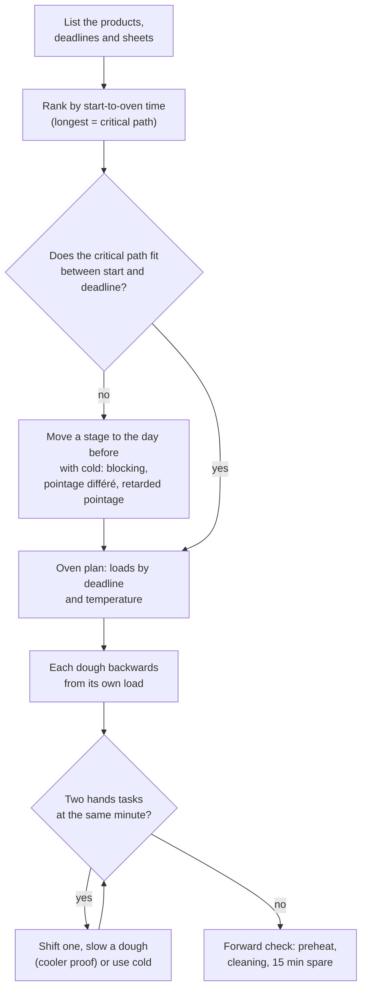
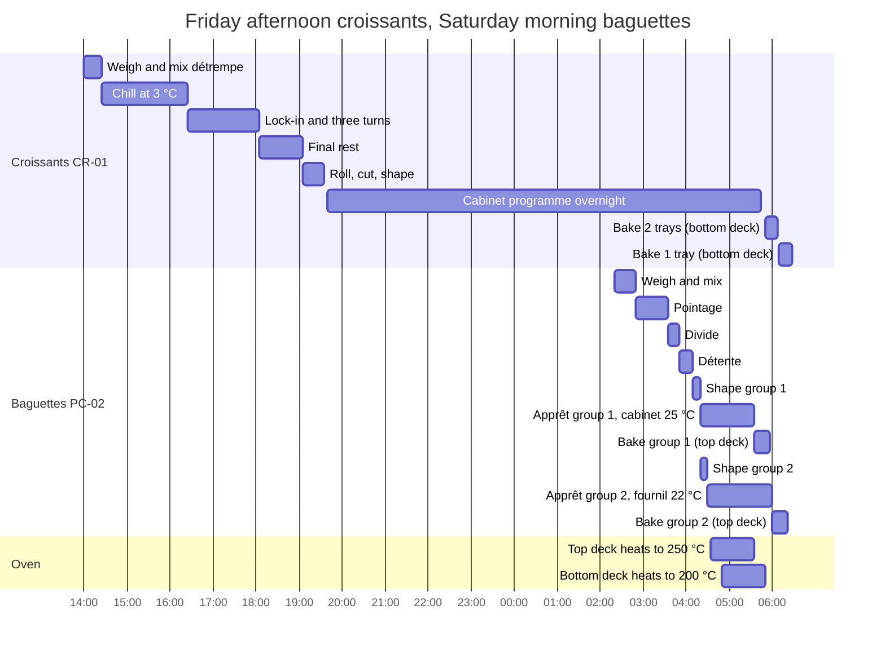

# 14.2 · Planning Several Products at Once

One product on an organigramme leaves you waiting most of the night; two products fill those waits, and three or four make every minute count. This lesson gives five rules for combining products, applies them to a real Saturday of baguettes and croissants that starts on Friday afternoon, and you plan a two-product home bake with one oven tray.

## Why it matters

No bakery makes one product. The production test asks you to organise a whole order of several products (see [The CAP Boulanger Exam](../../references/cap-exam.md)), and the référentiel judges the organisation by a coherent sequence of tasks (C1.3) and expects you to know how deferred fermentation changes the organisation of production (S3.3). The difference between a calm morning and a chaotic one is almost never speed of hands: it is whether the long processes were started early enough and whether two jobs were planned for the same pair of hands at the same minute.

## Key terms

| French | Say it | English meaning |
|---|---|---|
| ordonnancement | *or-doh-nahns-MAHN* | scheduling: deciding the order and timing of all the jobs of a production |
| chemin critique | *shuh-MAN kree-TEEK* | critical path: the longest chain of stages, which sets the earliest finish |
| plan de cuisson | *plahn duh kwee-SOHN* | oven plan: which product goes in which deck or oven, at what time and temperature |
| la veille | *lah VAY* | the day before: work done in the afternoon for the next morning |
| blocage | *blo-KAHZH* | holding shaped pieces at about 2-4 °C so fermentation almost stops (lesson [04.6](../module-04/lesson-06.md)) |
| pointage différé | *pwan-TAHZH dee-fay-RAY* | bulk fermentation slowed in the cold, for example overnight at +4 °C |
| temps de pousse | *tahn duh POOSS* | proof time, set by the temperature and the dough |

## How it works

### How long each course product takes, start to oven

From the course sheets (same-day methods; your own records will refine them):

| Sheet | From first mix to oven | Longest stages | Oven |
|---|---|---|---|
| CR-01 croissant (lessons [11.2](../module-11/lesson-02.md)-[11.6](../module-11/lesson-06.md)) | about 7-8 h | détrempe chill ≥ 2 h; 3 turns with 20-45 min rests; final rest ≥ 1 h; proof 1 h 30-2 h 30 | 190-200 °C (175-180 °C fan), no steam, 15-20 min |
| TR-01 tradition (lessons [09.2](../module-09/lesson-02.md)-[09.4](../module-09/lesson-04.md)) | about 4 h 50 | autolyse 30 min; pointage about 2 h; détente 30 min; apprêt 45-60 min | 250 °C with steam, 24-26 min |
| PC-02 pain courant (lesson [01.6](../module-01/lesson-06.md)) | about 3 h 10 | pointage 45 min; apprêt 1 h 15 | 250 °C with steam, 22 min (rolls 15) |
| PL-01 pain au lait (lesson [12.3](../module-12/lesson-03.md)) | about 3 h (or a night in the cold) | pointage 45 min; apprêt 1 h-1 h 30 | 170-190 °C, no steam, 12-15 min (braids about 22) |
| CP-01 crème pâtissière (lesson [12.2](../module-12/lesson-02.md)) | cooked and cooled before the laminated dough is cut | cooling from 63 °C to 10 °C in 2 h or less | (cooked on the hob) |

### Five rules for several products

1. **Longest process first.** Rank the products by their start-to-oven time. The longest one is the critical path: it decides the start of the day, and every other product fits around it.
2. **Plan the oven before the doughs.** Write the oven plan first, by deadline and by temperature: which load, which deck, what time, what temperature. A deck takes a long time to change temperature, so either give each temperature its own deck or oven, or group loads by temperature, hottest first. Then work each dough backwards from its own load, as in lesson [14.1](lesson-01.md).
3. **One pair of hands.** Put the hands time of one product inside the dough time of another. Two hands tasks may never overlap; small tasks (a fold, an egg wash, unloading) can slip a few minutes, a shaping block cannot.
4. **Use the cold to move work in time.** If the longest process does not fit before the deadline, or the busy hour is overloaded, move a whole stage to the day before: the croissant lamination and shaping with overnight blocking, a pâte levée in pointage différé, a tradition in pointage retardé (lesson [04.6](../module-04/lesson-06.md)).
5. **Shared equipment shares one setting.** One proofing cabinet has one temperature; one mixer takes one dough at a time. Check that products sharing equipment agree (lesson [14.3](lesson-03.md) goes into detail).

## Worked example

Boulangerie Au Pain de la Halle, order for **Saturday 21 November, shop at 7:00**: **24 baguettes PC-02 (350 g)** and **32 croissants CR-01 (60 g)**. One baker. Equipment: one spiral mixer; a two-deck oven, each deck with its own thermostat, taking 12 baguettes or two 40 × 60 cm trays; a programmable proofer-retarder cabinet; a cold room at 3 °C; a fournil at about 22 °C.

**1. Batches.** Croissants: 32 × 60 = 1,920 g; ÷ 0.90 (trimmings) × 1.02 (losses) = 2,176 g of laminated dough; ÷ 2.27 = 959 g → **1,000 g of flour** (2,270 g of laminated dough, lesson [11.5](../module-11/lesson-05.md)). Baguettes: 24 × 350 = 8,400 g; × 1.02 = 8,568 g; ÷ 1.823 = 4,700 g → **4,700 g of flour** (batch 8,568 g).

**2. Rank.** CR-01 needs 7-8 hours from détrempe to oven; PC-02 about 3 h 10. For croissants at 6:00 the détrempe would have to be mixed before 23:00 on Friday. Rule 4: the croissants are made **on Friday afternoon** and held overnight in the cabinet (blocking), as in the [Module 11 project](../../projects/m11-croissant-batch.md).

**3. Oven plan (rule 2).** Top deck at 250 °C for the bread, bottom deck at 200 °C for the croissants, so neither deck changes temperature in the morning. The top deck takes 12 baguettes, so the bread goes in **two loads**:

| Deck | Load | In | Out | Cooled by |
|---|---|---|---|---|
| Top, 250 °C, steam | baguettes 1-12 | 5:35 | 5:57 | 6:27 (30 min) |
| Top, 250 °C, steam | baguettes 13-24 | 6:00 | 6:22 | 6:52 |
| Bottom, 200 °C, no steam | croissants, 2 trays (22) | 5:50 | 6:08 | 6:28 (20 min) |
| Bottom, 200 °C, no steam | croissants, 1 tray (10) | 6:10 | 6:28 | 6:48 |

Top deck switched on at 4:35, bottom deck at 4:50 (60 minutes before their first loads).

**4. Friday afternoon: croissants backwards from the cabinet.** Weighing 14:00; mixing 14:10-14:25 (4 min first speed, 3 min second, 20 °C, flattened and wrapped); cold room 14:25-16:25 (2 h); lock-in and turn 1 16:25-16:45; turn 2 17:15-17:25; turn 3 17:55-18:05 (30-minute rests); final rest until 19:05; rolling, cutting and shaping 19:05-19:35; first egg wash; into the cabinet at 19:40. Programme: blocking at about 3 °C, gradual warming in the early morning, proof at 25 °C and 75-80 % humidity, **ready at 5:45** (lessons [04.6](../module-04/lesson-06.md) and [11.6](../module-11/lesson-06.md)).

**5. Saturday: baguettes backwards from the oven.** Group 1 in at 5:35 after 75 minutes of apprêt: shaped **4:10-4:20**, then into the cabinet, which is already at 25 °C for the croissants (same temperature, room for one more board). Group 2 is shaped **4:20-4:30** but goes in at 6:00: 90 minutes instead of 75 is 1.2 times longer, so it must ferment about $\ln 1.2 \div \ln 1.07 \approx 2.7$ °C cooler: on a rack in the fournil at about 22 °C, covered. Détente 3:50-4:10; dividing 3:35-3:50; pointage 2:50-3:35; mixing 2:35-2:50; weighing **2:20-2:35**.

**6. Hands check, 5:30-6:30 (rule 3).** 5:30-5:35 score and load baguettes 1-12; 5:40-5:45 second egg wash on two croissant trays; 5:50 load them; 5:57 unload baguettes; 6:00-6:03 score and load baguettes 13-24; 6:05 egg wash the third tray (moved out of the cabinet at 5:45 to the fournil so it does not over-proof while it waits); 6:08 unload; 6:10 load; 6:22 and 6:28 unload. Busy, but never two things at once.

**7. Cost of the second product.** The baker starts at 2:20 instead of 2:30 (lesson [01.6](../module-01/lesson-06.md) baked the same 24 baguettes on both decks in one load), because one deck now belongs to the croissants. The afternoon gains a 5 h 40 session for the lamination. Everything is on the racks by 6:28 and cooled by 6:52: eight minutes spare before 7:00, a little short of the 15 the template asks, so the baker notes it.

(The chart runs from Friday afternoon through the night to Saturday morning.)

## Practice

You plan a two-product home bake on paper: tradition baguettes and pains au lait for the same dinner, one person, one oven that takes one tray. If you have the time, bake it and record the real clock times.

### You need

- The [organigramme template](../../templates/organigramme.md), a pencil, a calculator; lessons [09.2](../module-09/lesson-02.md)-[09.4](../module-09/lesson-04.md) (TR-01) and [12.3](../module-12/lesson-03.md) (PL-01) for the methods.
- If you bake: the equipment of those lessons, an oven thermometer, a timer.
- Professional equivalent: a two-deck oven and a proofing cabinet, which remove most of the conflicts you are about to solve.

### Ingredients

| Ingredient | TR-01 (500 g flour) | PL-01 (250 g flour) |
|---|---|---|
| Flour | 500 g additive-free white | 250 g T45 / white |
| Water / whole milk | 340 g in the autolyse + 10 g reserve | 130 g milk |
| Whole egg | — | 25 g |
| Sugar | — | 25 g |
| Salt | 9 g | 5 g |
| Fresh yeast (instant dry: one third) | 3 g | 9 g |
| Tradition pâte fermentée | 75 g (made the evening before) | — |
| Butter | — | 45 g |
| Yield | 3 baguettes of 270 g + 75 g kept | 8 rolls of 60 g (489 g of dough) |

### In Israel

Checked 2026-10-09.

- **Cold is your second worker.** In a 28-32 °C summer kitchen the easiest fix for an overloaded afternoon is the one from rule 4: mix the PL-01 the evening before, give it 30 minutes with one fold, then flatten it in a covered container in the fridge (pointage différé, lesson [12.3](../module-12/lesson-03.md)). Next afternoon you only divide and shape it, and the cold butter makes it easier to handle.
- **Fridge space is equipment.** Check before you plan that the fridge (5 °C or below) takes the tradition pâte fermentée, the PL-01 container and, later, a tray of shaped rolls if you have to hold them back.
- **Warm kitchen times.** In a 30 °C kitchen both doughs ferment faster: calculate the water and milk (lesson [05.2](../module-05/lesson-02.md)) or shorten the times with the 7 % rule, and poke-test early. Proof the rolls in the coolest room (24-26 °C, or an air-conditioned room) so the butter does not soften.
- **Products:** white flour (*kemakh lavan*, קמח לבן) as in [Flour in Israel](../../references/flour-in-israel.md); for PL-01 full-fat milk (*khalav*, חלב) and unsalted butter (*khem'a*, חמאה), read the labels as in lesson 12.3.

### Steps

1. **Order:** both products on the table at **19:00**. Tradition cools 1 hour; rolls cool 30 minutes. One tray in the oven at a time.
2. **Stage times.** TR-01 as in lesson [14.1](lesson-01.md)'s practice (weighing 10, autolyse 35, final mixing 15, pointage 2 h with folds at 30/60/90 min, dividing 10, détente 30, shaping 10, apprêt 45, bake 25 min at 240-250 °C with steam). PL-01 by hand: weighing 10; mixing with the butter about 28 min; pointage 45 min with a fold at 20 min; dividing 10 min; rest 15-25 min; shaping and first egg wash 10 min; apprêt about 1 h 15 at 25-27 °C; bake 15 min at 190 °C conventional.
3. **Rank** the two products and decide which bakes first, and why.
4. **Oven plan:** write both loads with in and out times, the preheat, and the change of temperature between them (with an oven thermometer, find how many minutes your oven takes to fall from 250 °C to 190 °C with the door open; if you do not know, allow 15 minutes).
5. **Work backwards** from each load to each start time.
6. **Hands check:** list every hands task with its clock time and find the places where two overlap. Fix each one.
7. Fill in the organigramme template with one column per product, an Oven column and a You column.

Answers

3. Tradition is longer (about 4 h 50 against about 3 h) and starts first. It also bakes first: it needs the hotter oven (250 °C with steam) and the longer cooling (1 hour). Opening the door drops a home oven quickly; heating it back up from 190 to 250 °C takes much longer, so the hot bake goes first.
4. Baguettes in **17:35**, out **18:00** (steam tray out at about 17:45), cooled 19:00. Door open at 18:00, oven set to 190 °C, checked with the thermometer; rolls in **18:15**, out **18:30**, cooled 19:00. Oven on at **16:50** (45 minutes before 17:35).
5. TR-01: apprêt from 16:50; shaping 16:40-16:50; détente 16:10-16:40; dividing 16:00-16:10; pointage 14:00-16:00 (folds 14:30, 15:00, 15:30); final mixing 13:45-14:00; autolyse 13:10-13:45; weighing **13:00**. PL-01: apprêt 17:00-18:15; shaping 16:50-17:00 (after the baguettes); dividing 16:15-16:25 (during the tradition's détente), rest until 16:50; pointage 15:30-16:15 (fold 15:50); mixing 15:00-15:30; weighing 14:40-14:50.
6. Conflicts: the tradition fold at 15:00 falls at the start of the PL-01 mixing (butter on your hands): fold at **14:55**, then start the mixing. The fold at 15:30 falls at the end of the mixing: do it straight after, at about 15:30. Shaping: the tradition first (16:40-16:50, its apprêt is the critical one), the rolls straight after (16:50-17:00). Everything else fits in the other dough's waiting time.

### Targets

- Both products cooled by 19:00 on paper, with each oven load, the preheat and the temperature change written.
- No two hands tasks at the same minute; every shaping block whole, not split.
- If you bake: oven loads within 10 minutes of the plan; the oven checked with a thermometer before the rolls go in.

### How you know it worked

On paper, every minute from 13:00 to 19:00 has one owner, and each product's dough time hides the other's hands time. If you baked, you never had dough waiting for the oven and never had to choose between two jobs: the baguettes came out as the rolls finished proofing, and both reached the table cooled.

### Self-check

- [ ] I ranked the products by start-to-oven time and started the longest one first.
- [ ] I planned the oven before the doughs, hottest load first.
- [ ] I found and fixed every place where two hands tasks overlapped.
- [ ] I can name two ways to use the cold to take a stage out of a busy afternoon or night.
- [ ] I can explain why the second bread group proofs cooler instead of being shaped later.

## What goes wrong

| Symptom | Likely cause | Fix now | Prevent next time |
|---|---|---|---|
| Croissants (or any long product) not ready by the deadline | Longest process started with the others instead of first | Bake the ready products; tell the manager what will be late and when | Rank by start-to-oven time; move lamination and shaping to the day before with blocking |
| Two doughs ready to shape at the same minute | Each product planned backwards on its own, never checked together | Shape the one with the shorter tolerance first; slow the other in the cold or a cooler place | Hands check: list every hands task by clock time before you start |
| Bread waits while the deck cools down to viennoiserie temperature (or the reverse) | Oven plan mixed temperatures on one deck | Hold the waiting pieces cooler; change the deck's temperature at once | Give each temperature its own deck or oven, or group loads hottest first |
| Croissants leak butter while waiting for the oven | Proofed in the warm with the bread for too long | Bake at once; set the rest aside in the cool | Plan their oven slot before their proof; keep laminated dough below about 27 °C |
| Afternoon free, night overloaded | Cold not used | — | Pointage différé, retarded pointage and blocking turn night work into afternoon work (lesson [04.6](../module-04/lesson-06.md)) |

## Review

- With several products, the longest process (the critical path) starts first and decides the start of the day.
- Plan the oven before the doughs: loads by deadline and temperature, then each dough backwards from its own load.
- One pair of hands: put one product's hands time into another's dough time, and check every overlap by clock time.
- The cold moves work in time: lamination and shaping the afternoon before with blocking, pâte levée in pointage différé, tradition in retarded pointage.
- Organising a whole multi-product order is part of the production test; see [The CAP Boulanger Exam](../../references/cap-exam.md).
