# 14.3 · Oven, Mixer and Space Constraints

A schedule can be right for every dough and still be impossible, because two doughs need the one mixer at 2:30, or the bottom deck is asked to be at 180 °C three minutes after a 250 °C load. This lesson shows how to check a plan against each resource in turn (your hands, the mixer, the oven, the proofing cabinet and the cold space), how to fix what you find, and you hunt the conflicts in a home plan.

## Why it matters

The référentiel gives C1.2 and C1.3 with the premises and equipment as conditions: a plan is judged on the real fournil, not on an empty timeline. A conflict found on paper costs a pencil line; the same conflict found at 6:10 costs a load of over-proofed bread, a late shop and, often, an accident. INRS names burns from ovens and falls while moving between work areas among the main bakery risks, and a baker running between an oven that is not ready and a dough that is is exactly how they happen. When a conflict cannot be solved before the deadline, the professional answer is to say so early (C4.4), not to hope.

## Key terms

| French | Say it | English meaning |
|---|---|---|
| goulot d'étranglement | *goo-LOH day-trahn-gluh-MAHN* | bottleneck: the resource that limits the whole production (often the oven) |
| capacité (du four, de l'armoire) | *ka-pa-see-TAY* | how much one load or one cabinet holds: baguettes per deck, trays per level |
| sole | *SOL* | deck: one baking floor of a deck oven, often with its own thermostat |
| montée / descente en température | *mohn-TAY / day-SAHNT ahn tahn-pay-rah-TÜR* | heating up / cooling down of an oven between two settings |
| armoire de pousse | *ar-MWAHR duh POOSS* | proofing cabinet: one temperature and humidity for everything inside |
| conflit | *kohn-FLEE* | two jobs needing the same resource at the same time |
| décaler | *day-ka-LAY* | to shift a stage earlier or later |
| rendre compte | *rahndr KOHNT* | to report to the manager (C4.4) |

## How it works

### Five resources, five questions

| Resource | The question to ask | Typical conflict | Numbers you need |
|---|---|---|---|
| **You** (your hands) | Am I asked to do two things at the same minute? | two shapings, or dividing during shaping | minutes per stage for this quantity (shaping 24 baguettes takes about 20-25 min in this course's examples) |
| **Mixer** | Is the bowl free and clean? Does the batch fit? | two doughs at the same time; egg or milk dough before a lean dough | mixing time + emptying and scraping; maximum dough per batch (lesson [06.1](../module-06/lesson-01.md)) |
| **Oven** | Is there room, at the right temperature, with or without steam, already hot? | loads overlapping; a deck asked to change temperature in minutes; no preheat | pieces per load, bake time, 5 min between loads, preheat time, heating and cooling times of your oven |
| **Proofing cabinet** | Can everything inside share one temperature and humidity? Is there a free level? | croissants above 27 °C because bread wants it warmer; a blocking programme at 3 °C while another product needs 25 °C | levels; each product's proof temperature |
| **Cold space and bench** | Is there room in the cold room for every tub, slab and tray? Is the bench free and clean? | laminated dough and floured bread on the same bench at the same time; no room for the trays to be held back | shelves and trays; bench length |

Your hands are the resource beginners forget, because they are invisible on an equipment list.

### Draw one lane per resource

To find conflicts, redraw the plan with one horizontal lane per resource instead of one per product. Every bar of every product goes into the lane of the resource it uses. Two bars at the same time in a lane that holds one thing is a conflict; a bar at a temperature the lane is not at is a conflict; a lane that is still heating when a bar starts is a conflict.

The simulation opens on the draft of the worked example below with the same lanes. Find its five conflicts, then fix them by moving stages, moving a proof to a cooler place, swapping the oven order and switching the decks on earlier.

[Simulation: Find and fix the conflicts of a draft organigramme](../../simulations/production-schedule/index.html?preset=m14-conflicts)

### Oven arithmetic

The oven is usually the bottleneck, so count it first:

- **Loads** = pieces ÷ pieces per load, rounded up. 24 baguettes in a two-deck oven taking 12 per deck: 1 load; 40 baguettes: 2 loads.
- **Oven time** = loads × (bake time + about 5 minutes to unload, score, load and steam). Two loads of 25-minute baguettes occupy the decks for about 55 minutes.
- **Latest last load** = deadline − cooling − bake time. Count the loads back from there.
- **Preheat**: about 60 minutes for a deck oven from cold in this course's examples; your home oven needs at least 45 minutes with a tray or stone inside (lesson [08.4](../module-08/lesson-04.md)).
- **Changing temperature** takes time, and cooling a heavy deck down takes longer than heating it up. Measure it for your oven, write it on the oven plan, and avoid it: one temperature per deck, or loads grouped hottest first.

### Moves that fix a conflict

| Move | Example | Watch out |
|---|---|---|
| Shift (décaler) | start the tradition 30 minutes earlier so its mixing ends before the pain courant's | shifting one stage shifts everything after it |
| Slow down | proof the waiting group about 3-4 °C cooler (7 % rule), or hold it in the cold | dough must still reach the oven ready, not cold |
| Speed up | proof a little warmer | never above about 27 °C for laminated dough; flavour suffers when bread is rushed |
| Split | two oven loads, two mixings | each split adds hands time and oven time |
| Swap the order | bake the 180 °C product first on a deck preheated only to 180 °C, then heat up | heating up still takes time; write it down |
| Move to the day before | shape pains au lait on Friday and block them in the cabinet | the cabinet is then busy overnight; check its programme |
| Another resource | bake viennoiserie in the fan oven while the deck does bread | that oven needs its own preheat and loads |
| Report | "Tradition will be 20 minutes late unless I start at 1:00" | say it when you plan, not at 6:50 |

## Worked example

Saturday at Au Pain de la Halle, shop at **7:00**. The commis has drafted the organigramme and asks you to check it.

> **Brouillon d'organigramme — samedi**
>
> | Produit | Pesée | Pétrissage | Pointage | Division | Détente | Façonnage | Apprêt | Cuisson |
> |---|---|---|---|---|---|---|---|---|
> | Tradition TR-01, 24 × 300 g | 1:45-2:00 | autolyse 2:00-2:05 (repos → 2:30); pâte 2:30-2:45 | 2:45-4:45 | 4:45-5:00 | 5:00-5:30 | 5:30-5:50 | 5:50-6:40 armoire 25 °C | 6:40-7:05, 2 soles, 250 °C |
> | Pain courant PC-02, 24 × 350 g | 2:15-2:30 | 2:30-2:45 | 2:45-3:30 | 3:30-3:50 | 3:50-4:10 | 4:10-4:35 | 4:35-5:50 armoire 25 °C | 5:50-6:12, 2 soles, 250 °C |
> | Pains au lait PL-01, 40 × 50 g (pâte de vendredi, pointage différé à +4 °C) | — | — | nuit | 4:10-4:25 | 4:25-5:00 au froid | 5:00-5:25 | 5:25-6:15 armoire 25 °C | 6:15-6:27, sole du bas, 180 °C |
>
> Four: allumer à 5:30.

The equipment, from the bakery's own records: one spiral mixer; a two-deck oven, independent thermostats, 12 baguettes or two 40 × 60 trays per deck, **60 min** from cold to 250 °C, **about 40 min** to fall from 250 to 180 °C with the doors ajar, **about 25 min** to rise from 180 to 250 °C; a proofing cabinet with 16 levels (a board of 12 baguettes or a tray per level); a fournil at about 22 °C; a cold room at 3 °C. Apprêt of the pains au lait: about 1 h 20 at 25 °C (lesson [12.3](../module-12/lesson-03.md)); bake 12 minutes.

**1. Lanes.** Redrawn by resource (diagram above), the draft shows five conflicts:

| # | Lane | When | What | Size |
|---|---|---|---|---|
| C1 | Mixer and you | 2:30-2:45 | tradition final mixing and pain courant mixing at the same time | 15 min overlap |
| C2 | You | 4:10-4:25 | shaping 24 baguettes while dividing 40 pains au lait | 15 min overlap |
| C3 | Oven | 5:30-5:50 | oven on at 5:30 for a 5:50 load | 20 of 60 min of preheat |
| C4 | Bottom deck | 6:15 | pains au lait at 180 °C three minutes after a 250 °C load, after 50 of their 80 minutes of apprêt | needs 40 min to cool; 30 min of proof missing |
| C5 | Oven / deadline | 6:40-7:05 | tradition out at 7:05, cooled at 7:35 | 35 min late |

The cabinet passes: everything inside wants 25 °C, and at most six levels of sixteen are used at once.

**2. Fix the oven first.** Total oven work at 250 °C: two loads of 24 on both decks (22 and 25 min). The tradition has the longer process and the longer bake; the pain courant is quicker to bring forward. Plan: pain courant **5:35-5:57**, tradition **6:00-6:25** (cooled 6:55). The pains au lait are the only 180 °C product: bake them **first**, on the bottom deck preheated only to 180 °C (on at 3:45), **4:45-4:57**, then raise the deck to 250 °C (25 min, ready 5:22). Top deck on at 4:35.

**3. Take the pains au lait out of the busy hour.** Their dividing and shaping (40 minutes of hands time) collide with both bread doughs. Move them to **Friday afternoon**: mixed at 15:00, 30 minutes of pointage, divided, rested cold, shaped, first egg wash, into the cabinet on a blocking programme set to be ready at 4:40. On Saturday they need only a second egg wash and loading.

**4. Back-plan the breads from their loads.**

- **Tradition** (in at 6:00, apprêt 50 min in the cabinet): shaping 4:50-5:10; détente 4:20-4:50; dividing 4:05-4:20; pointage 2:05-4:05 (folds 2:45, 3:25); final mixing 1:50-2:05; autolyse 1:15-1:50; weighing **1:00**.
- **Pain courant** (in at 5:35): with a 75-minute apprêt it would be shaped at 4:00-4:20, during the tradition's dividing. Shape it earlier, **3:40-4:00**, and slow it: 95 instead of 75 minutes is $\ln(95/75) \div \ln 1.07 \approx 3.5$ °C cooler, so it proofs covered on a rack in the fournil at about 22 °C. Détente 3:20-3:40; dividing 3:05-3:20; pointage 2:20-3:05; mixing **2:05-2:20**, right after the tradition (C1 solved); weighing 1:25-1:40, during the autolyse rest.

**5. Check every lane again.** Mixer: tradition 1:50-2:05, pain courant 2:05-2:20, cleaned 2:20-2:35. You: one task at a time (weighing 1:00 and 1:25, mixings, folds, dividing 3:05 and 4:05, shaping 3:40 and 4:50, loading 4:45, 5:35 and 6:00; unloading the pains au lait at 4:57 is a one-minute interruption of the tradition shaping). Cabinet: pains au lait until 4:45, tradition from 5:10, both 25 °C. Oven: as planned in step 2.

**6. Report.** The fixed plan starts **45 minutes earlier** (1:00 instead of 1:45), adds about 35 minutes on Friday afternoon, and leaves only 5 minutes spare on the tradition. You write to the chef: "Draft not feasible: tradition cooled at 7:35. Proposal: start 1:00, pains au lait shaped Friday and blocked, pains au lait baked first at 180 °C. Spare only 5 minutes on tradition; if the start cannot move, tradition at 7:20." Lesson [14.4](lesson-04.md) builds a full day the same way.

```mermaid
gantt
  title Corrected plan, Saturday (pains au lait shaped on Friday)
  dateFormat HH:mm
  axisFormat %H:%M
  section Tradition TR-01
  Weigh                     :t1, 01:00, 15m
  Autolyse                  :t2, after t1, 35m
  Final mixing              :t3, after t2, 15m
  Pointage                  :t4, after t3, 120m
  Divide                    :t5, after t4, 15m
  Détente                   :t6, after t5, 30m
  Shape                     :t7, after t6, 20m
  Apprêt cabinet 25 °C      :t8, after t7, 50m
  Bake both decks           :t9, 06:00, 25m
  section Pain courant PC-02
  Weigh                     :p1, 01:25, 15m
  Mixing                    :p2, 02:05, 15m
  Pointage                  :p3, after p2, 45m
  Divide                    :p4, after p3, 15m
  Détente                   :p5, after p4, 20m
  Shape                     :p6, after p5, 20m
  Apprêt fournil 22 °C      :p7, after p6, 95m
  Bake both decks           :p8, 05:35, 22m
  section Pains au lait PL-01
  Programme ends, proofed   :l1, 03:20, 80m
  Bake bottom deck 180 °C   :l2, 04:45, 12m
  section Oven
  Bottom deck to 180 °C     :o1, 03:45, 60m
  Bottom deck up to 250 °C  :o2, 04:57, 25m
  Top deck to 250 °C        :o3, 04:35, 60m
```

## Practice

You check a home plan drafted by a friend for a weekend brunch, find every conflict, and write a corrected plan. Then, if you bake it, you run the corrected plan.

### You need

- Pencil, calculator, the [organigramme template](../../templates/organigramme.md), a ruler to draw lanes.
- An oven thermometer: before you plan anything at home, measure **your** oven: minutes from cold to 250 °C, from 250 to 200 °C with the door open, from 200 back to 250 °C. Write the three figures on the template.
- Professional equivalent: the bakery's equipment list with capacities and the oven's measured heating times.

### The draft

> **Brunch, Saturday 10:00, 8 people.** Products: 8 croissants and 8 pains au chocolat (CR-01 on 500 g of flour), laminated and shaped on Friday evening, kept on **two trays** in the fridge overnight; 3 tradition baguettes (TR-01, retarded option of lesson [09.2](../module-09/lesson-02.md): mixed Friday 17:00, in the fridge from 18:00).
>
> Saturday: 6:30 both croissant trays out on the counter to proof. 7:00 tradition out of the fridge and divided; détente 7:10-7:25; 7:20-7:30 egg wash the croissants; 7:25 shape the baguettes; apprêt 7:35-8:20. 8:00 oven on at 250 °C. 8:20-8:45 bake the baguettes. 8:45 both croissant trays in at 200 °C. 9:05 out. Brunch 10:00.
>
> Your kitchen: 30 °C in the morning in summer, one air-conditioned room at 25 °C. Oven: one tray at a time; measured 45 min from cold to 250 °C, 6 min from 250 to 200 °C with the door open. Fridge: one free shelf, room for one tray **or** the 3 L tradition container plus a wrapped block.

### In Israel

Checked 2026-10-09.

- **Heat is a resource conflict.** In a 28-32 °C summer kitchen the counter is not a proofing place for laminated dough (keep it below about 27 °C, lesson [11.6](../module-11/lesson-06.md)): your "proofing cabinet" is the air-conditioned room at 24-26 °C, or a covered box in it. Write which room each tray proofs in on the plan.
- **The oven heats the kitchen.** Forty-five minutes of preheat at 250 °C warms a small kitchen; plan rolling and shaping of laminated dough before you switch it on, or in another room.
- **Fridge space:** Israeli home fridges are often full on a Friday; clear the shelf before you laminate and check 5 °C or below with a thermometer (lesson [05.4](../module-05/lesson-04.md)). A wrapped laminated block takes far less space than two trays of shaped pieces.
- **Early start:** the coolest hours are early morning; a 6:00 start meets the kitchen at its coolest.

### Steps

1. Draw five lanes from Friday 17:00 to Saturday 10:00 (you, oven, fridge, proofing place, bench) and put every task of the draft in its lane.
2. List every conflict with its time, its lane and its size in minutes or degrees. There are at least six.
3. For each, choose a move from the table in "How it works".
4. Write the corrected Saturday plan with the oven loads first, then each product backwards. Keep 15 minutes spare before 10:00 if you can.
5. If you bake: run the corrected plan and write the real times next to the planned ones.

Answers

**Conflicts:**

1. **Fridge space (Friday night):** two trays plus the 3 L container do not fit on one shelf. Fix: do not shape on Friday; keep the laminated dough as a **wrapped block** after the last turn (the final rest may run overnight, lesson [11.4](../module-11/lesson-04.md)) next to the container, and shape on Saturday morning.
2. **Proof temperature:** croissants on a 30 °C counter from 6:30: above about 27 °C the butter melts out. Fix: proof in the air-conditioned room at 24-26 °C.
3. **Proof time:** 6:30 to 8:45 is 2 h 15 at 30 °C, which is far more fermentation than 2 h 15 at 25 °C: over-proofed and leaking. Fixed together with 1 and 2.
4. **Détente too short for cold dough:** 15 minutes for a dough straight from the fridge; retarded dough needs about 45-60 minutes (lesson [09.2](../module-09/lesson-02.md)). Fix: divide at 6:05, détente until about 7:05.
5. **Hands:** egg wash 7:20-7:30 overlaps shaping from 7:25. Fix: egg wash only just before each tray goes in.
6. **Preheat:** oven on 8:00 for 8:20, 20 of 45 minutes. Fix: on at 7:15 for an 8:00 load.
7. **Oven capacity:** two trays at 8:45 in a one-tray oven. Fix: two loads.
8. **Temperature change:** the oven is at 250 °C at 8:45; 6 minutes to fall to 200 °C. Write it as a line: door open at 8:25, check the thermometer.

**A corrected plan** (one of several that work):

- Friday 17:00 tradition mixed (retarded option), fridge 18:00. Croissant dough laminated in the evening, kept as a block overnight.
- 6:00 tradition out (12 h in the fridge), 6:05-6:15 divide and pre-shape; détente until 7:05.
- 6:15-6:50 roll, cut and shape 8 croissants and 8 pains au chocolat; trays to the air-conditioned room at 24-26 °C, covered.
- 7:05-7:15 shape the baguettes; apprêt 45 min in the air-conditioned room. 7:15 oven on at 250 °C with tray and steam tray.
- 8:00-8:25 baguettes (steam tray out at 8:10). 8:25 door open, oven to 200 °C, check with the thermometer.
- 8:35 egg wash croissants; 8:40-8:58 croissants (proof about 1 h 55). 8:55 egg wash pains au chocolat; 9:00-9:20 pains au chocolat (proof about 2 h 10).
- Cooled: baguettes 9:25, croissants 9:20, pains au chocolat 9:40. Brunch 10:00 with 20 minutes spare.

### Targets

- At least six conflicts found, each with lane, time and size.
- A corrected plan with the oven loads written first, the preheat and the temperature change as timed lines, and every proof in a named place below 27 °C for laminated dough.
- If you bake: every load within 10 minutes of the corrected plan.

### How you know it worked

Your lanes show each resource doing one thing at a time, at the temperature it needs, with room to spare. If you baked, nothing waited in the warm for the oven, and the laminated pieces came out with clear layers and no butter pool on the tray.

### Self-check

- [ ] I can name the five resources and the question to ask of each.
- [ ] I drew the plan by resource lanes, not by product.
- [ ] I counted oven loads, preheat and temperature changes with my oven's measured times.
- [ ] I fixed each conflict with a named move and checked that the fix did not create a new one.
- [ ] I can write a two-line report for a conflict that cannot be fixed in time.

## What goes wrong

| Symptom | Likely cause | Fix now | Prevent next time |
|---|---|---|---|
| Two doughs ready for the mixer at once; one waits and warms | Mixings not checked in a mixer lane | Mix the one with the shorter tolerance first; keep the other's ingredients cold | Mixer lane on the plan; back-to-back mixings with scraping time |
| Product loaded into a deck that is still too hot or too cold | Temperature change not written on the oven plan | Wait and hold the pieces cooler; or use another deck | One temperature per deck; measured heating and cooling times on the plan |
| Croissants leak butter after proofing with the bread | Cabinet set warmer for bread, or proof on a warm counter | Bake at once; set the others in a cooler place | One setting for everything in the cabinet (24-26 °C); laminated dough below about 27 °C |
| Shaped trays have nowhere to wait | Cold room or fridge space not counted | Hold them on a rack in the coolest place; bake in order of readiness | Space lane: count shelves and trays before you plan |
| Baker rushing between oven and bench, near-misses with hot trays | Two hands tasks at the same time | Stop, finish one task; ask for help | Hands lane on every plan; INRS lists burns and falls among the main bakery risks |
| The plan cannot meet the deadline | Order too large for the equipment or the start time | Report at once with the new time and the options | Check oven arithmetic first; report when you plan (C4.4) |

## Review

- Check a plan by resource, not by product: your hands, the mixer, the oven, the proofing cabinet, the cold space and bench.
- The oven is usually the bottleneck: count loads, oven time, preheat and temperature changes from your oven's measured figures.
- Fix conflicts with named moves (shift, slow, speed within limits, split, swap, move to the day before, another resource) and check each fix again.
- A conflict you cannot fix is reported early, with the new time and the options.
- Organising the order on the real equipment is part of the production test; see [The CAP Boulanger Exam](../../references/cap-exam.md).
