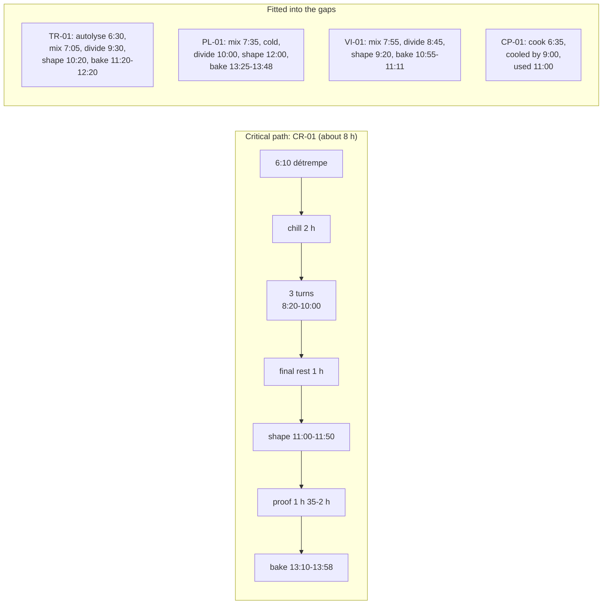

# 14.4 · An EP2-Style Schedule

This lesson puts the whole module together on one practice day: four doughs from the course sheets, a tradition bread, a pain viennois, a croissant lamination cut into three products with a crème pâtissière, and a pain au lait in shapes, made by one baker from a 6:00 start. You see how the laminated dough sets the length of the day, how the other doughs fit around it, and you plan the home version of the same day.

## Why it matters

The production test starts from an order covering several products and asks for the technical sheet and the organigramme of the whole order before the practical work (référentiel, definition of EP2). What the real test supplies, how long it lasts and which products it names are in [The CAP Boulanger Exam](../../references/cap-exam.md): read them there, because this lesson's order is a practice order of the course's own, not an exam subject. What transfers is the method. A candidate who plans a full order well works calmly and has time to present; one who does not spends the afternoon catching up with doughs that were never waiting for the oven at the same time.

## Key terms

| French | Say it | English meaning |
|---|---|---|
| commande | *koh-MAHND* | the order: products, numbers, weights and deadline |
| chemin critique | *shuh-MAN kree-TEEK* | the longest chain of stages: here the laminated dough |
| mise en place | *meez ahn PLAHSS* | setting out ingredients, tools and the workstation before (and between) the stages |
| fiche technique | *feesh tek-NEEK* | technical sheet: the formula, process and targets of each dough |
| plan de cuisson | *plahn duh kwee-SOHN* | oven plan: loads, decks or ovens, temperatures and times |
| présentation | *pray-zahn-tah-SYOHN* | setting out the finished products on display (C2.8) |
| contrôle | *kohn-TROHL* | checking weights, numbers and look of finished products (C3.2) |

## How it works

### Order of work for a full day

1. **Read the order and calculate every batch** (lesson [06.2](../module-06/lesson-02.md); course sheets TR-01, VI-01, CR-01 with CP-01, PL-01).
2. **Find the critical path.** With everything made the same day, the croissant lamination is the longest chain by far: détrempe chilled at least 2 h, three turns with rests, a final rest of at least 1 h, shaping, then a proof of 1 h 30-2 h 30 (lessons [11.2](../module-11/lesson-02.md)-[11.6](../module-11/lesson-06.md)). From mixing the détrempe to cooled croissants is about **8 hours**. Its détrempe is mixed in the first minutes, and every other dough fits around it.
3. **Write the oven plan** for each oven by temperature: deck at 250 °C with steam for the bread; fan oven at about 175 °C for the viennois and the laminated products; the deck brought down to 180 °C after the bread for the pain au lait.
4. **Put the doughs in the gaps of the lamination**: weighing and mixing while the détrempe chills, dividing and shaping during the rests between turns and the final rest.
5. **Hands check**, minute by minute, with small tasks (folds, egg wash, unloading) slotted in and big blocks (mixing, dividing, shaping, turns) never overlapping.
6. **Food safety and cleaning on the plan**: the crème pâtissière is cooked early and cooled from 63 °C to 10 °C in 2 hours or less (lesson [12.2](../module-12/lesson-02.md)); cleaning slots between doughs and at the end; time to present and check.

### The four doughs side by side

## Worked example

**Practice order, Saturday at Au Pain de la Halle** (one baker; start 6:00; everything presented by 14:30; workstation clean by 14:45). Sheets and times are the course's; the quantities are chosen for practice.

| Dough | Products | Batch |
|---|---|---|
| TR-01 tradition, tradition pâte fermentée from the cold room | 16 baguettes 300 g, 4 boules 400 g, 15 petits pains 60 g | 7,300 g × 1.02 = 7,446 g → flour 7,446 ÷ 1.874 = 3,973 → **4,000 g**; water 2,800 g (2,720 g autolyse + 80 g reserve), salt 72 g, fresh yeast 24 g, pâte fermentée 600 g |
| VI-01 pain viennois | 8 baguettes viennoises 280 g | 2,240 × 1.02 = 2,285 g → ÷ 1.793 = 1,274 → **1,300 g**; milk 754 g, salt 23.4 g, yeast 45.5 g, sugar 78 g, butter 130 g |
| CR-01 laminated | 15 croissants 60 g, 15 pains au chocolat 58 g, 10 pains aux raisins 50 g | 2,270 g ÷ 0.90 × 1.02 = 2,573 g → ÷ 2.27 = 1,133 → **1,200 g**; détrempe 2,124 g, beurrage 600 g; 30 batons |
| CP-01 crème pâtissière | 10 × 20 g for the pains aux raisins | 200 g + 10 % = 220 g → milk 220 ÷ 1.40 = 157 → **200 g milk**; yolks 32 g, sugar 44 g, starch 18 g; raisins 150 g soaked = **120 g dry** |
| PL-01 pain au lait | 1 three-strand braid 300 g, 10 navettes 50 g, 6 hedgehogs 60 g | 1,160 × 1.02 = 1,183 g → ÷ 1.955 = 605 → **700 g**; milk 364 g, egg 70 g, sugar 70 g, salt 14 g, yeast 24.5 g, butter 126 g |

**Equipment:** one spiral mixer; a two-deck oven, independent thermostats, each deck taking 12 baguettes, 6 boules, 20 rolls or two 40 × 60 trays, about 60 minutes from cold to 250 °C and about 40 minutes from 250 down to 180 °C with the doors ajar; a 5-tray fan oven (20 minutes to 175 °C); a proofing cabinet with 16 levels set at 25 °C and 75-80 % humidity all day; a blast chiller; a cold room at 3 °C; a fournil at about 22 °C.

**1. Critical path.** CR-01: détrempe 6:10 → cooled croissants about 14:18, **8 h 08**. Nothing in the order can make the day shorter than that; the tradition (about 4 h 50) and the two enriched doughs (about 3 h each) fit inside it.

**2. Oven plan.**

| Oven | Time | Load | Setting |
|---|---|---|---|
| Fan | 10:55-11:11 | 8 baguettes viennoises (2 trays) | 175 °C, no steam |
| Deck top / bottom | 11:20-11:45 / 11:20-11:50 | 12 baguettes / 4 boules | 250 °C, steam |
| Deck top / bottom | 11:55-12:20 / 11:55-12:10 | 4 baguettes / 15 petits pains | 250 °C, steam |
| Deck | 12:20-13:00 | doors ajar, down to 180 °C | — |
| Fan | 13:10-13:30 | 10 pains aux raisins, 15 pains au chocolat (4 trays) | 175-180 °C |
| Deck top / bottom | 13:25-13:47 / 13:35-13:48 | braid / navettes and hedgehogs | 180 °C, no steam |
| Fan | 13:40-13:58 | 15 croissants (2 trays) | 175-180 °C |

Deck on at 10:20; fan oven on at 10:35 (and kept on, or switched on again at 12:50).

**3. The organigramme (your hands).** Small tasks in brackets.

| Time | You | Doughs working meanwhile |
|---|---|---|
| 6:00-6:10 | weigh CR-01 and CP-01, cold liquids | — |
| 6:10-6:20 | mix the détrempe (4 + 3 min), 20 °C, flatten, wrap, cold room | détrempe chills until 8:20 |
| 6:20-6:30 | weigh TR-01; pâte fermentée out | |
| 6:30-6:35 | autolyse mix | autolyse until 7:05 |
| 6:35-6:55 | cook CP-01, boil 1 min; 2 cm tray, film; blast chiller; log the time at 63 °C | cream must be at 10 °C by about 9:00 |
| 6:55-7:05 | weigh PL-01 and VI-01 | |
| 7:05-7:20 | TR-01 final mix with bassinage, **22 °C** (one degree under target so the pointage lasts about 120 × 1.07 ≈ 128 min, to 9:30) | TR pointage 7:20-9:30 |
| 7:20-7:35 | butter plaque 600 g, cold room; soak the raisins | |
| 7:35-7:55 | PL-01 mix (17 min), 24 °C | PL pointage 7:55-8:40 |
| 7:55-8:10 | VI-01 mix (13 min), 25 °C; (TR fold at about 8:00 while the mixer runs) | VI pointage 8:10-8:45 |
| 8:10-8:20 | scrape and clean the mixer; (cream log: below 10 °C?) | |
| 8:20-8:40 | lock-in and turn 1 | rest 30 min |
| 8:40-8:45 | (TR fold 2); PL flattened in a filmed tray, cold room | |
| 8:45-8:55 | VI divide 8 × 280 g, pre-shape | VI détente |
| 8:55-9:10 | clean bench; couches, boards, trays, 30 batons, egg wash | |
| 9:10-9:20 | turn 2 | rest 30 min |
| 9:20-9:30 | VI shape, first egg wash, cabinet | VI apprêt until 10:55 |
| 9:30-9:50 | TR divide: 16 × 300 g, 4 × 400 g, 15 × 60 g; pre-shape | TR détente |
| 9:50-10:00 | turn 3 | final rest until 11:00 |
| 10:00-10:10 | PL divide: 3 × 100 g, 10 × 50 g, 6 × 60 g; cold room | |
| 10:10-10:20 | clean bench; deck oven on | |
| 10:20-10:40 | TR shape group A (4 boules, 12 baguettes), cabinet | apprêt A until 11:20 |
| 10:40-10:55 | TR shape group B (4 baguettes, 15 rolls), rack in the fournil at 22 °C; (fan oven on 10:35) | apprêt B until 11:55 |
| 10:55-11:00 | VI second egg wash, oblique cuts, load fan oven | |
| 11:00-11:15 | roll the laminated sheet; pains aux raisins (cream, raisins, roll, slice), cabinet | |
| 11:15-11:25 | sheet back in the cold room; (unload VI 11:11); score and load deck: group A at 11:20 | |
| 11:25-11:50 | pains au chocolat, then croissants, first egg wash, cabinet; (unload top deck 11:45) | |
| 11:50-11:55 | unload boules; score and load group B | |
| 12:00-12:30 | PL shape: braid 12:00-12:10, navettes and hedgehogs 12:10-12:30; first egg wash; cabinet; (unload rolls 12:10, baguettes 12:20; deck down to 180 °C at 12:20) | |
| 12:30-13:00 | clean mixer, rolling pin or sheeter, bench; weigh and check the breads; labels | |
| 13:00-13:10 | second egg wash, pains aux raisins and pains au chocolat; load fan oven 13:10 | |
| 13:15-13:25 | PL second egg wash, snip the hedgehogs; braid in at 13:25 | |
| 13:30-13:40 | unload fan oven 13:30; navettes and hedgehogs in at 13:35; croissants second egg wash; croissants in at 13:40 | |
| 13:45-14:00 | unload braid and small pieces (13:47-13:48); unload croissants 13:58 | croissants cool until about 14:18 |
| 14:00-14:45 | present products, check numbers, weights and look, record any non-conformity; final cleaning | |

**4. Checks with numbers.**

- **Laminated dough:** chill 6:20-8:20 (2 h); rests 30 and 30 min; final rest 10:00-11:00 (1 h, the rest of the sheet held cold until 11:50); proofs: pains aux raisins about 2 h, pains au chocolat about 1 h 35-1 h 45, croissants about 1 h 50-2 h, all at 25 °C (below 27 °C).
- **Tradition:** pointage about 2 h 10 at 22 °C; détente 30 min (group A) and about 50 min on the cooler bench (group B, pre-shaped last, shaped gently); apprêt about 45-60 min at 25 °C (A) and 60-75 min at 22 °C (B, about 50-60 min at 25 °C by the 7 % rule).
- **Viennois:** pointage 35 min; détente 25 min; apprêt about 1 h 25 at 25 °C (sheet: 1 h-1 h 30 at 26-28 °C).
- **Pain au lait:** pointage 45 min, then cold from 8:45 (firm for dividing and shaping, as the EP1 2019 sheet's cold rest); apprêt braid 1 h 15, small pieces 1 h 05 at 25 °C.
- **Cream:** cooked 6:55; 63 °C at about 7:00; 10 °C reached before 9:00 (checked 8:15); stored 0-3 °C; used 11:00; leftovers discarded within 24 hours.
- **Mixer:** détrempe 6:10, TR 7:05, PL 7:35, VI 7:55, back to back with scraping, cleaned 8:10. The pain au lait (egg) goes before the viennois, whose label lists egg anyway (egg wash).
- **Cabinet:** one setting, 25 °C, for VI, TR group A, CR and PL; at most 9 of 16 levels at once (about 12:30).
- **Deadline:** last product cooled about 14:18 for 14:30: 12 minutes spare, a little short of 15. The weak point is the croissant proof: if it runs slow, the croissants are the late product; tell whoever receives the order.

```mermaid
gantt
  title Practice day, four doughs, one baker
  dateFormat HH:mm
  axisFormat %H:%M
  section CR-01 and CP-01
  Weigh, mix détrempe          :c1, 06:00, 20m
  Chill 2 h                    :c2, after c1, 120m
  Cook CP-01                   :k1, 06:35, 20m
  Cool CP-01, 63 to 10 °C      :k2, after k1, 60m
  Turns with rests             :c3, 08:20, 100m
  Final rest                   :c4, after c3, 60m
  Shape PAR, PAC, croissants   :c5, 11:00, 50m
  Proof 25 °C                  :c6, after c5, 110m
  Bake PAR and PAC (fan)       :c7, 13:10, 20m
  Bake croissants (fan)        :c8, 13:40, 18m
  section TR-01
  Weigh, autolyse              :t1, 06:20, 45m
  Final mix                    :t2, 07:05, 15m
  Pointage                     :t3, after t2, 130m
  Divide                       :t4, 09:30, 20m
  Détente                      :t5, after t4, 30m
  Shape A and B                :t6, 10:20, 35m
  Apprêt                       :t7, 10:40, 75m
  Bake A (deck)                :t8, 11:20, 30m
  Bake B (deck)                :t9, 11:55, 25m
  section VI-01
  Mix                          :v1, 07:55, 15m
  Pointage                     :v2, after v1, 35m
  Divide, détente, shape       :v3, 08:45, 45m
  Apprêt 25 °C                 :v4, 09:30, 85m
  Bake (fan)                   :v5, 10:55, 16m
  section PL-01
  Mix                          :l1, 07:35, 20m
  Pointage, then cold          :l2, after l1, 145m
  Divide, cold                 :l3, 10:00, 120m
  Shape                        :l4, 12:00, 30m
  Apprêt 25 °C                 :l5, 12:10, 75m
  Bake (deck 180 °C)           :l6, 13:25, 23m
  section Ovens
  Deck heats to 250 °C         :o1, 10:20, 60m
  Deck down to 180 °C          :o2, 12:20, 40m
  Fan oven heats               :o3, 10:35, 20m
```

**5. If your window is shorter.** The plan cannot shrink below the laminated dough's chain without breaking a minimum of the course sheet (2 h chill, 1 h final rest, a full proof). When you rehearse with the real timing from the [exam reference](../../references/cap-exam.md) ([Module 22](../module-22/lesson-02.md) does this), start from that chain, see where the time must come from, and practise exactly that; never by proofing laminated dough above 27 °C.

## Practice

You plan the home version of the same day on paper: three doughs, one person, a one-tray oven. Lesson 14.4's plan is the model; the home kitchen changes the oven plan completely. Bake it only if you have a whole free day: it is close to the full production-day rehearsal of [Module 22](../module-22/lesson-05.md).

### You need

- The [organigramme template](../../templates/organigramme.md), the [production sheet template](../../templates/production-sheet.md) for each dough, a calculator.
- Your oven's measured times from lesson [14.3](lesson-03.md) (cold to 250 °C; 250 to 200 °C; 200 to 180 °C).
- If you bake: the equipment of lessons [09.2](../module-09/lesson-02.md), [11.2](../module-11/lesson-02.md)-[11.6](../module-11/lesson-06.md), [12.1](../module-12/lesson-01.md)-[12.4](../module-12/lesson-04.md), an ice bath for the cream, the [temperature log](../../templates/temperature-log.md) and the [bake log](../../templates/bake-log.md).
- Professional equivalent: the bakery's deck oven, fan oven and cabinet, which let the four doughs of the worked example share one morning.

### Ingredients

| Dough | Home batch | Products |
|---|---|---|
| TR-01 | 500 g flour, 340 g + 10 g water, 9 g salt, 3 g fresh yeast, 75 g tradition pâte fermentée (made the evening before) | 3 baguettes of 270 g |
| CR-01 | 500 g T45 / white flour: détrempe 885 g; 250 g butter (≥ 82 % fat) for the beurrage | 4 croissants, 4 pains au chocolat (8 batons), 4 pains aux raisins |
| CP-01 | 200 g whole milk, 32 g yolks, 44 g sugar, 18 g starch; 30 g raisins soaked | about 75 g of cream for the pains aux raisins |
| PL-01 | 250 g flour, 130 g milk, 25 g egg, 25 g sugar, 5 g salt, 9 g fresh yeast, 45 g butter | braid 3 × 80 g, 2 navettes 50 g, 2 hedgehogs 60 g |

### In Israel

Checked 2026-10-09.

- **Start in the cool hours.** In July and August the average night low near the coast is about 23-24 °C and the afternoon high about 29-30 °C (Israel Meteorological Service data). A 5:30 start gives you the lamination before the kitchen and the oven warm up.
- **Laminate in the coolest room** and keep the dough below about 27 °C at every step; in a warm kitchen use one double and one single turn instead of three singles (lesson [11.4](../module-11/lesson-04.md)).
- **Cold liquids:** fridge water and milk for TR-01 and PL-01 (lesson [05.2](../module-05/lesson-02.md)); the cream cooled on ice, then kept at 5 °C or below.
- **A one-tray oven** turns the four ovens of the worked example into four loads in a row, hottest first: tradition at 250 °C with steam, then croissants and pains au chocolat at about 200 °C, then pains aux raisins, then the pain au lait at 180-190 °C. Every tray that must wait is slowed in a cooler place or the fridge, never left on a warm counter.
- **Ingredients:** flour per [Flour in Israel](../../references/flour-in-israel.md); butter, milk and chocolate batons as in lessons [12.1](../module-12/lesson-01.md) and [12.3](../module-12/lesson-03.md).

### Steps

1. Calculate nothing new: the home batches are given. Write the start-to-oven time of each dough and find the critical path.
2. Write the oven plan: four loads, their temperatures, the preheat, each temperature change, and the cooling of each product (tradition 1 h, viennoiserie 20 min, pain au lait 30 min).
3. Work each dough backwards from its load. Put the cream early: it must be cold before you shape the pains aux raisins.
4. Do the hands check minute by minute; name each place where you slowed a dough (cooler room, fridge) and why.
5. Fill in the organigramme template from your start to the last product cooled, with the fridge and the "proofing place" as columns.
6. Compare with the reference plan below. Yours can differ; check it with the five resource questions of lesson 14.3.

A reference plan (kitchen 30 °C, air-conditioned room 25 °C, oven 45 min to 250 °C, about 6 min down to 200 °C)

- **Critical path:** CR-01, about 7 hours from détrempe to cooled croissants at home.
- 5:30-5:45 weigh CR-01, mix the détrempe by hand, flatten, fridge (lock-in at 7:45).
- 5:45-6:05 cook CP-01; ice bath; log 63 °C (about 6:10) and 10 °C (well before 8:10); fridge.
- 6:05-6:15 weigh TR-01 and PL-01. 6:15-6:20 autolyse (rest until 6:50). 6:20-6:48 PL-01 by hand → pointage until 7:35 (fold 7:10) → flattened, fridge.
- 6:50-7:05 TR-01 final mix → pointage 7:05-9:05, folds 7:35, 8:05, 8:30.
- 7:45-8:05 lock-in and a double turn; 8:35-8:45 single turn; final rest in the fridge until at least 9:45.
- 9:05-9:15 TR divide; 9:20-9:30 PL divide, back in the fridge; 9:45-9:55 TR shape → apprêt in the air-conditioned room. Oven on 9:55.
- 9:55-10:30 roll and cut; pains aux raisins first (proof about 2 h 15-2 h 25), then pains au chocolat and croissants (about 1 h 30-1 h 50); air-conditioned room.
- 10:40-11:05 tradition at 250 °C with steam (steam tray out at 10:50). Door open, oven to 200 °C.
- 11:10-11:30 shape the braid and small pieces (so they are not ready before the oven is free).
- 12:00-12:18 croissants and pains au chocolat; 12:20-12:40 pains aux raisins; oven to 180-190 °C; 12:45-13:07 braid and small pieces (small ones out at about 12:58).
- Cooled: tradition 12:05, croissants 12:38, pains aux raisins 13:00, pain au lait 13:37. Cream leftovers discarded within 24 hours.

### Targets

- Critical path named with its length; four oven loads in descending temperature with preheat and temperature changes written.
- Every proof below about 27 °C for laminated dough and in a named place; the cream's two log times planned within 2 hours.
- No two hands blocks at the same minute; every product cooled before your chosen end time.

### How you know it worked

Your plan can be followed by someone else with your production sheets and nothing more. If you bake it, each tray reaches the oven ready (poke test, wobble for viennoiserie) and the oven is never empty while a tray waits warm on the counter.

### Self-check

- [ ] I found the critical path and started it first.
- [ ] I wrote the oven plan before the doughs, hottest load first.
- [ ] The crème pâtissière is cooked early, cooled within 2 hours with two logged times, and kept cold.
- [ ] Every waiting tray has a named place that slows it.
- [ ] I know where the real exam's conditions are written, and that my plan is a practice plan.

## What goes wrong

| Symptom | Likely cause | Fix now | Prevent next time |
|---|---|---|---|
| Laminated products finished an hour late | Détrempe mixed after the bread, not first | Present the rest on time; tell the person receiving the order which products will be late | Critical path first: détrempe in the first minutes |
| Pains aux raisins delayed because the cream is still warm | Cream cooked late or cooled in a deep bowl | Do not use it warm; shape the other products first | Cook the cream right after the détrempe; shallow tray, blast chiller or ice; log 63 and 10 °C |
| Bread and viennoiserie compete for one oven | No oven plan, or one oven planned at two temperatures | Bake by readiness at the right temperature; hold the others cooler | Oven plan by temperature, one temperature per deck or oven |
| Hands overloaded at the end of the morning | Shaping blocks of several doughs left until after the oven starts | Finish one block at a time; ask for help | Shape during the lamination rests; check the hands column |
| No time to present and check | Cleaning and presentation not on the plan | Present the essentials; record what is missing | Time for presentation, checking and cleaning written into the organigramme |

## Review

- In a one-day multi-product order, the laminated dough is the critical path: mix the détrempe first and fit every other dough into its chills and rests.
- Write the oven plan by temperature before the dough plans: bread on the hot deck, viennoiserie in the fan oven, pain au lait on the deck once it has come down.
- Cook the crème pâtissière early and cool it from 63 °C to 10 °C in 2 hours or less, with both times logged.
- At home, a one-tray oven turns the ovens into a queue: hottest first, and every waiting tray slowed in the cool.
- The real test's order, timing and conditions are in [The CAP Boulanger Exam](../../references/cap-exam.md); practise the method here and rehearse the real conditions later.
