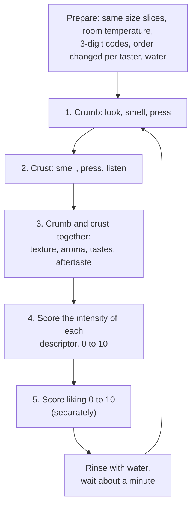

# 15.3 · Taste and Sensory Analysis

Saying "it tastes good" helps nobody improve a bread; saying "crumb cereal and slightly acid, crust toasted, salt just perceptible, a raw-dough note" does. This lesson turns tasting into sensory analysis: which senses are involved, what disturbs them, which test answers which question, and how to run a blind tasting with coded samples and a shared vocabulary. You run a blind tasting of your own bread against bought breads.

## Why it matters

The référentiel asks you to name the senses used in tasting, list the tastes, know what can disturb a perception, state the aims of sensory analysis (describing a bakery product, correcting a preparation) and define organoleptic quality (S4.1). The sensory sheet (fiche d'analyse sensorielle) is also one of the documents you use to give sales staff a product argument (C4.2), and taste is judged in the production test (see [The CAP Boulanger Exam](../../references/cap-exam.md)). In the bakery, sensory tests answer real questions: can we lower the salt without customers noticing? Is the new flour different? Does today's tradition taste like last week's?

## Key terms

| French | Say it | English meaning |
|---|---|---|
| analyse sensorielle | *ah-nah-LEEZ sahn-sor-YEL* | sensory analysis: measuring a product's characteristics with the human senses, by a method |
| qualité organoleptique | *kah-lee-TAY or-gah-noh-lep-TEEK* | the qualities perceived by the senses: look, odour, taste, aroma, texture |
| saveur | *sah-VUHR* | taste perceived on the tongue: sweet, salty, sour, bitter |
| arôme | *ah-ROHM* | aroma: odour perceived through the back of the nose while eating |
| descripteur | *deh-skreep-TUHR* | descriptor: an agreed word for one sensation (grillé, céréales, acide) |
| épreuve triangulaire | *ay-PRUHV tree-ahn-gü-LAIR* | triangle test: three coded samples, two identical; find the odd one |
| épreuve par paire | *ay-PRUHV par PAIR* | paired test: two samples; which is saltier, or which do you prefer |
| profil sensoriel | *proh-FEEL sahn-sor-YEL* | sensory profile: the intensity of each descriptor, on a scale |

## How it works

### The senses and the three dimensions

Tasting bread uses almost every sense: **sight** (shape, colour, crumb), **smell** (odour of the crumb and crust, sniffed), **touch** and the muscles of the jaw (firmness, crispness, softness, chewiness), **taste** on the tongue, **aroma** through the back of the nose while chewing, the sensation of **temperature**, and even **hearing** (the crackle of a crust). For each sensation, sensory analysis records three things separately: its **nature** (salty, toasted, crisp), its **intensity** (a little or very salty) and its **liking** (do I like it or not). Mixing them up is the commonest mistake: "too salty" is an intensity plus a judgement; the analysis keeps them apart.

The tastes are **sweet, salty, sour (acid) and bitter**, with **umami** (savoury) usually added today. Most of what we call the "taste" of bread is in fact **aroma**: hold your nose and a baguette tastes of little more than salt.

### What disturbs a tasting

Factors linked to the person: illness or a cold, tiredness, hunger or a full stomach, smoking, strong coffee, toothpaste or chewing gum just before, perfume, mood and expectations. Factors linked to the test: knowing which bread is which (brand, "my bread"), the order of the samples (the first one often scores differently), samples at different temperatures or sizes, other tasters' comments and faces, a noisy or smelly room. That is why sensory tests are **blind**: each sample has a **3-digit code**, all samples are the same size and temperature, the order changes from one taster to the next, tasters do not talk, and water is drunk between samples.

### Which test for which question

| Question in the bakery | Test | How it works |
|---|---|---|
| Is there any perceptible difference? (new flour, salt 1.8 → 1.6 %) | **Triangle test** | three coded samples, two identical; "which one is different?" By chance alone about one taster in three picks the right one, so a difference is clear only when clearly more than a third find it, and small panels prove little |
| Which is saltier (more acid, crisper)? | **Paired test** (directional) | two samples; "which is the more salty?" |
| What exactly does this bread taste like, and how strongly? | **Descriptive profile** | trained tasters score the intensity of each agreed descriptor from 0 to 10 |
| Do customers like it? Which do they prefer? | **Liking (hedonic) test** | many untrained consumers score "how much do you like it" from 0 to 10, or choose between two |

Professionals separate the two kinds of people: a small **trained panel** describes and measures (it is the instrument), a large group of **consumers** says what they like (often a hundred or more). In INRAE's baguette study, 15 trained tasters used 34 descriptors over 20 training sessions, and 138 consumers gave their liking.

### A vocabulary for bread

INRAE's panel judged the crumb first (appearance, odour, texture in the mouth), then the odour of the crust, then the aroma, taste and texture of crumb and crust together. Descriptors of that kind, which you can use:

| Family | Descriptors |
|---|---|
| Crumb appearance | colour (white, cream, grey), number and size of holes, particles (bran, seeds) |
| Odour and aroma | grillé (toasted), café, céréales, malt, seigle (rye), brioche, lacté (milky), farine (flour), pâte crue (raw dough), fraîche, levure (yeasty), acide |
| Taste | salé, acide, sucré, amer |
| Texture | ferme / mou (firm / soft), sec / humide, élastique, collant, fondant (melting), croustillant (crisp crust), épaisseur de croûte |

In that study, consumers generally preferred baguettes with a firm crumb with many holes, a crisp crust and toasted notes; milky, viennoiserie-like notes, found mostly in breads baked on trays or nets, were less liked. Notes link to the process: toasted and malty notes come from a well-coloured crust (lesson [15.1](lesson-01.md)); cereal and slight acidity from long fermentation and pre-ferments ([04.5](../module-04/lesson-05.md)); "raw dough" from under-baking; "yeasty" from too much yeast or too short a fermentation; strong acidity from levain or an over-ripe pre-ferment.

### Tasting order

### Salt: what you taste and what you measure

Salt is the taste customers notice first when it changes, and it is regulated as an amount: since October 2023 a pain courant should contain at most 1.4 g of salt per 100 g of bread (lesson [02.5](../module-02/lesson-05.md)). Tasting cannot check that limit; the calculation from your weights does (lesson [15.4](lesson-04.md)). Where a label gives **sodium** instead of salt, multiply by 2.5 to get salt (the EU labelling formula): 480 mg of sodium per 100 g is 1.2 g of salt. Use the sensory test for the other question: can people notice a change?

## Worked example

The manager of Boulangerie Au Pain de la Halle wants to lower the salt of the PC-02 baguette from 1.8 % to 1.6 % of the flour and asks you to test it on the staff before deciding.

**1. The numbers first.** PC-02 at 1.8 %: 1.076 % salt in the dough (lesson 08.5); a 350 g pâton holds 3.77 g; at 280 g cooled, **1.34 g per 100 g**. At 1.6 % (with the pâte fermentée at the same ratio): 1.6 ÷ 167.1 = 0.958 % of the dough, 3.35 g per pâton, **1.20 g per 100 g**. Both are under the 1.4 g limit; the question is only sensory.

**2. The question and the test.** "Can people tell them apart?" is a difference question: a **triangle test**. Both doughs are made the same day, same process, same oven load; one baguette of each is cooled 1 hour.

**3. Set-up.** Nine staff, each given three 2 cm slices with crust, coded 3 digits (for example 418, 263, 795), two from one baguette and one from the other. The combinations are rotated so the odd sample is sometimes the 1.6 %, sometimes the 1.8 %, and in a different position. Silence, water between samples.

**4. Result.** 4 of 9 pick the odd sample. By chance alone about 3 of 9 would. **No clear difference** with this panel; a larger panel or a repeat would be needed to be sure.

**5. A short profile.** Three experienced bakers then score both breads, coded, on salty, acid, toasted, cereal and yeasty (0-10). Salty: 5.0 vs 4.3; the others within half a point.

**6. Report to the manager.** "Triangle test on 9 tasters: 4 found the odd sample (chance about 3): no clear difference. Profile: salt slightly lower at 1.6 %, other notes unchanged. Salt per 100 g: 1.34 g now, 1.20 g at 1.6 %. Note: less salt also makes fermentation faster and the dough a little weaker (lesson 02.5); check the pointage and the dough feel on the first days."

## Practice

You run a blind tasting of at least three breads: one of your own and two bought, with one to three helpers if you can (family or friends), or alone with coded samples prepared by someone else. Part A is a descriptive profile and a liking score; Part B, optional, is a triangle test.

> [!CAUTION]
> Ask your tasters about allergies before they taste, and list what each bread contains: all contain wheat (gluten); many breads in Israel carry sesame; challah and many soft breads contain egg, and some milk. Cut on a board with a serrated knife, fingers away from the blade.

### You need

- Minimum: three breads of the same day (yours and two bought), a serrated knife, a board, plates or paper squares labelled with 3-digit codes, glasses of plain water, pens and the tasting sheet below.
- Professional equivalent: a quiet tasting room, coded samples prepared by someone who does not taste, a trained staff panel, the bakery's fiche d'analyse sensorielle.

### Ingredients

None to weigh: the breads are the samples. Optional for Part B: two home baguettes of the same formula, one at 1.8 % salt and one at 1.5 % (on 250 g of flour: 4.5 g and 3.8 g of salt), baked in the same load.

### In Israel

Checked 2026-10-09.

- **What to buy.** A good set: a bakery baguette (באגט, *baget*), a supermarket sliced white or light bread (לחם לבן פרוס, *lekhem lavan parus*) and, if you like, a whole-wheat bread (לחם מקמח מלא, *lekhem mi-kemakh male*). Challah (חלה) is an enriched bread with egg, sugar and oil: taste it last or separately, because its sweetness affects what comes after.
- **Labels.** Many Israeli bread labels state sodium (נתרן, *natran*) in mg per 100 g: multiply by 2.5 to compare with salt in grams (1,000 mg = 1 g). Note the salt of each bought bread before the tasting and compare it with what the tasters felt, after the tasting.
- **Heat.** Taste at room temperature in the coolest part of the day; in a hot kitchen the slices dry within minutes, so cut them just before serving and keep them covered.

### Steps

1. **Prepare blind:** ask a helper to cut each bread into equal slices (about 2 cm, with crust), put them on squares labelled with 3-digit codes, and write the key on a hidden paper. If you are alone, ask someone else to code them, so you do not know which is yours.
2. **Brief the tasters:** no coffee, smoking or toothpaste for 30 minutes before; no talking during the test; water between samples.
3. **Change the order** for each taster (A-B-C, B-C-A, C-A-B).
4. **Taste in the order** of the diagram: crumb (look, smell, press), crust (smell, press, listen), then both together.
5. **Score intensities** 0-10 on the sheet below, then **liking** 0-10 separately. A printable version is the [tasting sheet](../../templates/tasting-sheet.md).
6. **Reveal the key,** average the scores of each bread and compare them with the labels' salt figures and with what you know of each process.
7. **Write** three sentences: the profile of your bread compared with the others, one note you can link to your process, and one change you would try.
8. **Part B (optional):** a triangle test of your two baguettes at 1.8 % and 1.5 % salt, with as many tasters as you can, the odd sample rotated. Count the correct answers against one third by chance.

| Descriptor (0 = none, 10 = very strong) | Code ___ | Code ___ | Code ___ |
|---|---|---|---|
| Crumb: colour (0 white, 10 grey-brown) | | | |
| Crumb: firmness | | | |
| Crumb: moistness | | | |
| Crust: crispness | | | |
| Aroma: toasted (grillé) | | | |
| Aroma: cereal, malt | | | |
| Aroma: yeasty, raw dough | | | |
| Taste: salty | | | |
| Taste: acid | | | |
| Taste: sweet | | | |
| Liking (0 dislike, 10 like very much) | | | |

### Targets

- At least three breads tasted blind, coded, in a changing order, at the same temperature.
- Intensities and liking scored separately for every bread, by at least one taster (ideally three).
- Your bread's profile compared with the others in three sentences, with one note linked to the process.
- Optional: a triangle test counted against chance.

### How you know it worked

Your sheet would let a baker who was not there say which bread was the crispest and the most acid, without knowing the brands. You can explain at least one difference by the process (a toasted note from a darker crust, a yeasty note from a short fermentation). Your tasters' liking scores are kept apart from their descriptions.

### Self-check

- [ ] I tasted blind, with 3-digit codes, equal slices and a changing order.
- [ ] I scored intensities before liking, and kept them separate.
- [ ] I used precise descriptors, not "good" or "bad".
- [ ] I compared what was tasted with what was measured (salt on the labels or from my weights).
- [ ] I linked one sensory note to a stage of my process.

## What goes wrong

| Symptom | Likely cause | Fix now | Prevent next time |
|---|---|---|---|
| Your own bread always scores best | Not blind: you knew which it was | Repeat with codes prepared by someone else | Always code; never taste your own unblinded |
| Tasters copy each other | Talking during the test | Repeat in silence, separated | Brief: no talking, separate places |
| Every sample tastes the same after the third | Taste fatigue; no rinsing | Pause, drink water, eat a plain cracker | Few samples; water and a minute between |
| The first sample scores very differently | Order effect | Rotate the order and repeat | Change the order for each taster |
| "Too salty" written for a bread under the limit | Liking mixed with intensity | Score salty intensity and liking separately | Use the sheet: intensity first, liking last |
| Triangle test "shows a difference" with 2 of 3 tasters | Panel too small; chance | Repeat with more tasters | Treat small panels as indications only |

## Review

- Sensory analysis measures with the senses by a method: nature, intensity and liking are recorded separately.
- Tastes are sweet, salty, sour and bitter (plus umami); most of a bread's "taste" is aroma, smelled through the back of the nose.
- Tests are blind: 3-digit codes, same size and temperature, changing order, silence, water between samples.
- Triangle test for "is there a difference?", paired test for "which is saltier?", profile for "what does it taste like and how strongly?", liking test for consumers.
- Taste cannot check the salt limit; the calculation does. Taste in the production test: [The CAP Boulanger Exam](../../references/cap-exam.md).
