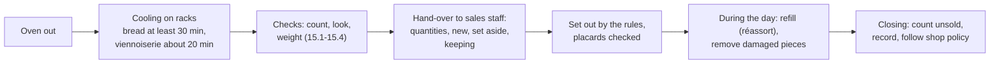

# 15.5 · Presenting Products in the Shop

A batch that passed every check can still be spoiled in the last ten metres: crushed in a basket, sweating in a bag, softening in a sunny window, or sitting without a price where nobody sees it. This lesson covers the hand-over from the fournil to the shop: when products go out, how they are set out with the sales staff, how each one is held so it keeps its quality, and what the baker tells the sales team. You plan a display for your own products.

## Why it matters

Setting out products in the shop together with the sales staff is a competency of its own (C2.8), and the référentiel expects you to respect the elementary rules of presentation and to be able to state them (S3.2.1). The customer judges with their eyes first: in INRAE's baguette study, the look of a bread was the first sensory information consumers had, and it shaped how much they expected to like it before they tasted. A good display sells what the fournil made; a careless one wastes it. What happens to unsold products is the subject of lesson [18.2](../module-18/lesson-02.md). How presentation of the finished products counts in the production test is in [The CAP Boulanger Exam](../../references/cap-exam.md).

## Key terms

| French | Say it | English meaning |
|---|---|---|
| magasin / boutique | *mah-gah-ZAN / boo-TEEK* | the shop, where products are sold |
| vitrine | *vee-TREEN* | shop window; also the glass display counter |
| panière / corbeille à pain | *pahn-YAIR / kor-BAY ah PAN* | bread basket or rack behind the counter |
| présentoir | *pray-zahn-TWAHR* | display stand or tray for viennoiserie |
| écriteau / étiquette prix | *ay-kree-TOH / ay-tee-KET PREE* | price placard: product name and price on the shelf |
| réassort | *ray-ah-SOR* | refilling the shelves during the day |
| personnel de vente | *pair-soh-NEL duh VAHNT* | sales staff |
| invendus | *an-vahn-DÜ* | unsold products at closing |

## How it works

### From the rack to the shelf

Products go out **cooled and checked**, never straight from the oven: a warm baguette packed into a basket sweats against its neighbours and its crust goes soft; a warm croissant crushed in a tray loses its shape. The cooling allowances used in this course's plans are about 30 minutes for bread before the shop and about 20 minutes for viennoiserie (lessons [07.5](../module-07/lesson-05.md) and [14.1](../module-14/lesson-01.md)): they belong on the organigramme.

### The elementary rules of presentation

| Rule | In practice |
|---|---|
| **Clean** | baskets, shelves, trays, tongs and glass cleaned before opening; no flour dust or crumbs on the viennoiserie trays |
| **By family** | breads together (baguettes, traditions, shaped pieces, special breads), viennoiserie together, sweet apart from savoury; the same product always in the same place, so customers and staff find it |
| **Labelled** | a placard for each category of bread on display with its name and price, and a window poster of the main breads and prices; legal names used only when true (tradition, maison, au levain: lesson [09.1](../module-09/lesson-01.md)); written allergen information available for unwrapped products (lesson [02.11](../module-02/lesson-11.md); detail in [Module 17](../module-17/lesson-06.md)) |
| **Visible and tidy** | large pieces at the back, small at the front; baguettes upright in baskets, scores facing the customer; viennoiserie in straight rows, all turned the same way; full shelves that are not crammed |
| **Protected** | products out of customers' reach, behind the counter or under glass, served with tongs or paper, never by hand |
| **In the right conditions** | away from the oven door, radiators and direct sun; each product held the way it keeps best (table below) |
| **Rotated** | the earlier batch sold first; damaged, dark or crushed pieces removed at once; a refill is a new full row, not new pieces hidden under old ones |

### Holding each product on display

| Product | On display | Why (lesson) |
|---|---|---|
| Baguette, tradition, crusty bread | upright in open baskets or racks, never in plastic | a bag traps moisture and softens the crust within hours ([07.5](../module-07/lesson-05.md)) |
| Large loaves (campagne, complet) | on the shelf, whole; cut to order or as halves on request | a large loaf keeps longer whole; a cut face dries |
| Pain de mie | in its bag once fully cool, or whole and sliced to order | it is meant to stay soft ([10.5](../module-10/lesson-05.md)) |
| Croissant, pain au chocolat | single layer on clean trays, not stacked | weight crushes the layers; sold the same day ([12.5](../module-12/lesson-05.md)) |
| Pain aux raisins | single layer, sold the same day | its cream is part of the product's food-safety rules ([12.2](../module-12/lesson-02.md); [Module 17](../module-17/lesson-08.md)) |
| Brioche, pain au lait | trays or bags; 2-3 days in a closed bag | enriched doughs stay soft longer ([12.5](../module-12/lesson-05.md)) |

### Timing and refills

The oven plan decides when each product can reach the shelf: plan the first loads to be cooled and checked for opening, and the next loads for the moments the shop usually gets busy (the morning rush, lunch, the evening), so the shelf is never empty and never full of tired bread. Agree the refill times with the sales staff, who know the shop's own rhythm, and adjust from the counts of unsold products: if 15 baguettes are left every evening, the last load is too big.

### The hand-over brief

At each hand-over the baker tells the sales staff, in two minutes: what is coming out and how many; what is short and when it will be ready; anything set aside and why (it must not be sold by mistake); anything new, with its name, what is in it, how it keeps and what it goes with. The product argument itself (C4.2) is taught in [Module 19](../module-19/lesson-02.md); the honest words for legal names are in [lesson 09.1](../module-09/lesson-01.md).

## Worked example

Saturday, Boulangerie Au Pain de la Halle. The shop opens at 7:00. From the oven plan: baguettes (PC-02) out at 6:15 (48) and 7:30 (48); traditions out at 6:25 (40); croissants and pains au chocolat out at 6:35 (60 + 40); campagne out at 6:45 (12); pains aux raisins at 9:30 (30). Morning check (lesson [15.4](lesson-04.md)): 47 baguettes for the first shelf, one dropped; two dark pains au chocolat set aside.

**1. When each product reaches the shelf.**

| Product | Out of oven | Earliest on shelf | Note |
|---|---|---|---|
| Baguettes, load 1 | 6:15 | 6:45 | 47 pieces; 1 short until 8:00 |
| Traditions | 6:25 | 6:55 | 40 pieces |
| Croissants, pains au chocolat | 6:35 | 6:55 | 60 + 38 (2 set aside) |
| Campagne | 6:45 | 7:15 | a large loaf: out 30 min later than opening is acceptable; placard says "à 7:15" |
| Baguettes, load 2 | 7:30 | 8:00 | refill before the 8:00-9:00 rush |
| Pains aux raisins | 9:30 | 9:50 | single layer, same day |

**2. Where.** Back wall, left to right: baguettes, traditions, then shaped and special breads; campagne on the bottom shelf, whole. Glass counter: croissants and pains au chocolat in two straight rows, same direction, tips under; pains aux raisins added at 9:50. Nothing on the window ledge in the morning sun.

**3. Placards checked.** Every category has its placard with name and price; the window poster matches the prices; the "Tradition" placard is only on the tradition basket; the allergen binder is at the till.

**4. Hand-over brief to the sales staff at 6:50.** "47 baguettes, one more at 8:00 with the second load. 40 traditions. 60 croissants, 38 pains au chocolat: two dark ones are in the back, not for sale. Campagne at 7:15. Pains aux raisins at 9:50, today only, they contain raisins with sulphites, milk, egg and wheat."

**5. At closing.** Unsold: 9 baguettes, 2 traditions, 4 croissants. Recorded on the sales sheet; the manager reduces next Saturday's second baguette load by 6 and keeps the rest.

## Practice

You plan and set up a display for your own products as if for a small shop, write its placards and a hand-over brief, and check it against the rules. A family brunch or a table set out for friends is a good occasion.

> [!CAUTION]
> If you serve or share the products, list their allergens on each placard (wheat/gluten in all; milk, egg, sesame, nuts, sulphites where used) and serve with tongs or a paper sheet, not bare hands.

### You need

- Minimum: at least three different products (your own bakes from modules 8-12, or bought ones), a clean table, baskets or boards, trays, clean cloths, paper for placards and a pen, tongs, a timer, the oven plan or bake log of the day.
- Professional equivalent: shop shelving, baskets and racks behind the counter, a glass counter for viennoiserie, printed placards and a window poster, the allergen information binder, the sales sheet for unsold products.

### Ingredients

None new: you present what you baked (or bought for the exercise).

### In Israel

Checked 2026-10-09.

- **Heat and sun.** Summer days in the coastal plain average about 29-30 °C at the warmest with about 67-70 % humidity (IMS data for Tel Aviv). Keep the display out of direct sun and away from the oven: a sunny window can be much hotter than the room. Chocolate in pains au chocolat and butter in croissants soften quickly in the heat; set them out in smaller quantities and refill more often.
- **Humidity and crust.** In humid air crusty bread softens within hours even in an open basket: put out fewer pieces at a time and refill from the cooling rack.
- **Insects.** In warm months cover open displays (a clean cloth or a glass or mesh cover) between servings.
- **Look at a real shop.** Visit a bakery near you and note three presentation rules it applies well and one you would change (placards, order of families, protection, how bread is held). You are observing, not judging the business.
- **Language on placards.** If your guests read Hebrew, write the placard name in Hebrew and French (for example "Baguette tradition / באגט מסורתי") with the allergens in the language they read.

### Steps

1. **List** your products with their quantities and the time each comes out of the oven (or is ready).
2. **Set the shelf times:** add the cooling time (bread about 30 minutes, viennoiserie about 20, large loaves longer) and write "earliest on display" for each product.
3. **Draw a plan** of the table: families together, large pieces at the back, small at the front, viennoiserie on trays in rows, nothing in direct sun.
4. **Choose the holding** for each product (open basket, tray, bag) with the reason from the table.
5. **Write the placards:** name (a legal name only if it is true), an invented price, and the allergens.
6. **Write a hand-over brief** of four or five lines for a helper who will "sell": quantities, what is short, what was set aside, what is new and how it keeps. Template: [hand-over brief](../../templates/hand-over-brief.md).
7. **Set it up** at the planned time and check it against the rules table; fix what fails.
8. **After 2 hours,** look again: what has softened, dried or been handled? Write one change.
9. **At the end,** count what is left, and write what you would bake less (or more) next time.

### Targets

- Every product has a shelf time that includes its cooling, a place on the plan and a holding method with a reason.
- Every product has a placard with name, price and allergens.
- The display passes the seven rules (clean, by family, labelled, visible, protected, right conditions, rotated) or each failure is fixed and noted.
- A written brief, a 2-hour check and an end count with one change.

### How you know it worked

A helper could run your table from your plan and brief without asking anything: they know what is there, how much, what not to sell and what each product contains. After 2 hours your crusty bread is still crisp, nothing is crushed, and nothing has been handled by bare hands.

### Self-check

- [ ] Nothing went out warm: shelf times include the cooling.
- [ ] Products are grouped by family, large at the back, in straight rows, out of the sun.
- [ ] Every product has a placard with name, price and allergens; legal names only when true.
- [ ] Each product is held the way it keeps best (no crusty bread in plastic, no stacked croissants).
- [ ] I briefed the "sales staff" and recorded what was left at the end.

## What goes wrong

| Symptom | Likely cause | Fix now | Prevent next time |
|---|---|---|---|
| Baguettes with soft, wrinkled crusts by 10:00 | Put out warm, packed tight, or bagged | Move to open baskets; refill from the rack | Cool 30 min; fewer pieces per basket; no plastic |
| Croissants flattened or broken | Stacked or crowded on the tray | Re-lay in a single layer; remove broken ones | One layer, rows, refill instead of piling |
| Customers ask the price of every bread | Placards missing or hidden | Write placards now | Check every placard and the window poster before opening |
| A set-aside dark piece is sold | Not told at hand-over | Apologise; replace if the customer returns | Set-aside pieces kept in the fournil; mention them in the brief |
| Chocolate products soft and smeared | Display in sun or near the oven | Move to the coolest place; fewer at a time | Plan the display away from heat; refill more often |
| Many unsold baguettes every evening | Last load too large | Record the count | Adjust load sizes from the unsold counts |

## Review

- Products go to the shop cooled and checked, with the cooling time on the plan.
- The elementary rules: clean, by family, labelled (placard per bread category, window poster, allergen information), visible and tidy, protected from hands, in the right conditions, rotated.
- Hold each product the way it keeps best: crusty bread open, viennoiserie in one layer, pain de mie bagged when cool; nothing in sun or next to the oven.
- Brief the sales staff at each hand-over: quantities, shortfalls, set-aside pieces, new products and how they keep.
- Presentation in the production test: [The CAP Boulanger Exam](../../references/cap-exam.md).
