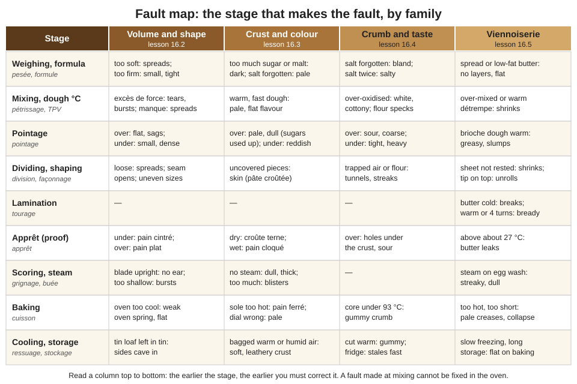

# 16.1 · A Method for Diagnosis

Every module so far ended with a "What goes wrong" table; this module turns those tables into one skill: looking at a faulty bread or croissant, finding the stage that made it and proving it from the records. This lesson gives the five-step method the next four lessons apply to volume and shape, crust and colour, crumb, and viennoiserie. You use it on one of your own past bakes and write the diagnosis and the non-conformity report.

## Why it matters

A fault is information. A baker who only remakes the batch will make the same fault next week; a baker who finds the cause fixes it once. The référentiel asks for exactly that: to characterise a quality dough and bread, identify the classic defects with their causes and corrective actions (S3.1), and report non-conformities and malfunctions during production in professional language (C4.4). In a production test, the jury watches whether you notice a dough running fast, whether you react, and whether you can explain what happened; how it is assessed is in [The CAP Boulanger Exam](../../references/cap-exam.md).

Most diagnosis mistakes come from the same shortcut: naming a cause from the look alone. A pale crust looks the same whether the dough was over-fermented or the oven was 20 °C below its dial. Only the records tell them apart. The method below forces you to collect that evidence before you name a cause.

> [!IMPORTANT]
> Watching someone diagnose bread is not the same as diagnosing your own. The Academy cannot see or grade your bread: compare your results honestly with the rubric and the reference answers. Self-assessment helps you learn, but it does not replace the official practical exam.

## Key terms

| French | Say it | English meaning |
|---|---|---|
| défaut | *day-FOH* | fault, defect in a dough or a finished product |
| constat | *kohn-STAH* | the facts observed: what, where, how many, when |
| cause probable | *KOHZ proh-BAH-bluh* | probable cause, the one the evidence supports |
| action corrective | *ak-SYOHN kor-ek-TEEV* | correction: what you do now to save or limit the batch |
| action préventive | *ak-SYOHN pray-vahn-TEEV* | prevention: what changes so the fault does not return |
| dysfonctionnement | *dees-fohnk-syon-MAHN* | malfunction (of equipment or of the organisation) |
| relevé | *ruh-luh-VAY* | a recorded reading: temperature, time, weight |
| traçabilité | *tra-sa-bee-lee-TAY* | traceability: being able to find which lot, which batch, which day |

The French names of the classic defects (pain plat, pain cintré, croûte terne and the others) are taught where they belong, in lessons 16.2-16.5.

## How it works

### Five steps, always in the same order

**1. Describe (le constat).** Write what you see before you think about why. Four questions:

- **What exactly?** Not "bad bread" but "flat, pale, scores barely open". Use measurable words: height and width in cm, weight in g, colour against the rubric.
- **Where on the piece?** Base, side, top, centre of the crumb, just under the crust. A burnt base and a burnt top have different causes.
- **How many pieces?** All of them, one tray, the last ones shaped, the second load. This is the most powerful single question (see below).
- **When first seen?** At the end of pointage, at shaping, at loading, in the oven, after cooling, the next day. A fault seen in the dough was made before that moment.

**2. Locate the stage.** Put the fault in its family (volume and shape, crust and colour, crumb and taste, viennoiserie) and walk the production chain backwards from the moment you saw it: oven → scoring and steam → apprêt → shaping → dividing → pointage → mixing → weighing (the 18 stages of lesson [07.1](../module-07/lesson-01.md)). Each stage can cause only certain faults; the fault map below shows which.

**3. Collect the evidence (les relevés).** Put the production sheet and your records side by side: dough temperature against the TPV, room and cabinet temperatures, pointage and apprêt times, poke-test result, oven reading by thermometer (not the dial), steam, bake time, weights, ingredient ticks, and anything new (a new flour bag, a different batch size, another baker). A difference between sheet and record is a suspect; no record means no evidence, and that is a finding in itself.

**4. Name the probable cause.** List two to four candidate causes, then keep the one that explains **every** symptom and that the records support. If two causes are proved, correct the earlier stage first: a dough that was 4 °C too warm at mixing will not be rescued by a better apprêt.

**5. Act, report, prevent.** Correct what can still be corrected (bake at once, wait, set aside), report the facts with the [non-conformity report](../../templates/non-conformity-report.md) (facts and quantity, action taken, probable cause, prevention), and change **one** thing for the next batch, written on the sheet and in your [bake log](../../templates/bake-log.md). Then check the next batch with the same five steps: that is how you learn whether the change worked.

### The "how many pieces" shortcut

| Fault seen on… | Points to a cause that is… | Typical examples |
|---|---|---|
| every piece of the batch | shared by the whole dough | formula or weighing error, new flour, dough temperature, pointage, cold room overnight, oven setting for the whole load |
| one tray, one shelf, one deck | linked to a place | cabinet hot spot, oven hot zone, tray on the lowest shelf (lesson [13.4](../module-13/lesson-04.md)) |
| the last pieces divided or shaped | linked to order and time | slow dividing, shaping out of order, pieces waiting (lesson [04.3](../module-04/lesson-03.md)) |
| the second oven load only | linked to waiting | load 2 proofed at the same temperature as load 1 but 30 minutes longer (lesson [14.1](../module-14/lesson-01.md)) |
| random pieces | linked to the hands | uneven weights or shaping, one baker's technique |

### Where faults come from

Read the map from the top: the earlier a stage, the more faults it can cause and the less you can fix later. Two consequences:

- **One symptom, several causes.** A flat loaf can come from pointage (over-fermented), mixing (manque de force), shaping (too little tension), apprêt (over-proofed) or the oven (too cool, no steam). The evidence decides, not the look.
- **One cause, several symptoms.** Over-fermentation gives a flat loaf, a pale and dull crust, flat cuts, large holes under the crust and a sour taste at once. When several symptoms point to one cause, that cause is very likely.

### Evidence that separates causes

| Symptom | Candidate causes | Evidence that decides |
|---|---|---|
| Pale crust | over-fermented; oven too cool; bake too short | sour smell and flat cuts (fermentation) or oven thermometer below the dial (oven) or time on the log |
| Flat loaf | over-proofed; dough too soft; loose shaping; weak flour | poke test at loading; hydration and flour; was the crumb coarse (fermentation) or tight (soft dough, loose shaping)? |
| Dense, small loaf | under-fermented; cold dough; too little or dead yeast; too firm | dough temperature after mixing; yeast weight and date; did the tub rise? |
| Gummy crumb | under-baked; cut warm; too much water | core temperature at the end of the bake; time between oven and knife |

The numbers behind these checks come from the earlier modules: fermentation runs about 7 % faster or slower per °C of dough temperature (lesson [04.2](../module-04/lesson-02.md)); the water temperature follows the base-temperature method of lesson [05.2](../module-05/lesson-02.md); a loaf is baked at a core of at least 93 °C, a baguette usually 96-98 °C (lesson [08.4](../module-08/lesson-04.md)); home ovens are often 10-20 °C off their dial, so read an oven thermometer.

### Writing the report

A useful report is short, measured and free of blame. Compare:

- Not useful: "Les baguettes étaient ratées, il faudra faire attention."
- Useful: "Baguettes PC-02, fournée de 6:10, 24 pièces: plates, croûte pâle, grignes fermées. Pâte à 27 °C (TPV 24 °C), temps de la fiche non adaptés, pas de test du doigt noté. Action: cuites aussitôt, vente décidée par le chef. Cause probable: pâte trop chaude, pointage et apprêt trop longs pour cette température. Prévention: eau calculée chaque jour, temps adaptés à la température relevée."

## Worked example

Saturday, Boulangerie du Marché. The shop sends back 6 of the 30 bâtards of pain courant (PC-02, lesson [01.6](../module-01/lesson-06.md)) baked this morning: "flat, pale on top, and the cuts did not open". The other 24 are fine. You apply the method.

1. **Describe.** 6 of 30 bâtards: about 2 cm lower and 1.5 cm wider than the others, crust pale and dull on top, cuts flat with no ear, crumb with some large holes just under the top crust, slightly sour smell. Seen by the shop after cooling; the baker noted nothing at loading.
2. **Locate.** Only some pieces → look for a difference in order, place or waiting. The six all came from the second load (18 bâtards in load 1 at 6:15, 12 in load 2 at 6:40, of which these 6 were on the top shelf of the trolley).
3. **Evidence.**

| Record | Load 1 | Load 2 |
|---|---|---|
| Dough temperature after mixing | 24 °C (TPV 24 °C) | same dough |
| Shaped | 5:00-5:20 | 5:00-5:20 |
| Apprêt place | cabinet 25 °C | cabinet 25 °C, top shelf |
| Apprêt time | 55 min | 1 h 20 |
| Poke test | "fills slowly" | not written |
| Oven | 250 °C by thermometer | 250 °C by thermometer |

4. **Cause.** Candidates: oven too cool (rejected: same thermometer reading); dough too soft or weak (rejected: load 1 from the same dough was fine); over-proofed (supported: 25 minutes longer apprêt at the same temperature; flat, pale, flat cuts, holes under the crust and sour smell all point the same way). The top shelf explains why 6 of the 12 were worse: the cabinet's top is its warmest place (lesson [04.4](../module-04/lesson-04.md)). Probable cause: **second load over-proofed**, worst at the top of the cabinet.
5. **Act, report, prevent.** The six are sold as day-old or used for croutons, as the manager decides. Report: facts above, quantity 6/30, action, cause. Prevention (one change): the second group goes into the cabinet at about 21-22 °C, 3-4 °C cooler than the first, which by the 7 % rule slows it by about a quarter (1.07^3.5 ≈ 1.27, so 55 min becomes about 70 min, close to the 25-minute wait); the poke test is written for every load. This is the rule of lesson 14.1, and it is the only change for next Saturday.

## Practice

You diagnose one of your own past bakes with the five steps, then three short cases on paper.

### You need

- Your [bake logs](../../templates/bake-log.md), temperature logs and photos from Modules 4, 7, 8, 9, 10, 11 or 12, the [quality rubric](../../templates/quality-rubric.md) and a blank [non-conformity report](../../templates/non-conformity-report.md).
- If you kept a loaf or croissants in the freezer, thaw one at room temperature and cut it: a cut section is better evidence than memory.
- Professional equivalent: the batch records (fiches de production, temperature records, cabinet and oven logs) and a sample kept back from each batch.

### Ingredients

None: you diagnose a bake you already made. If you have no log at all, bake the PD-01 bâtards of lesson [04.7](../module-04/lesson-07.md) first and come back.

### In Israel

Checked 2026-10-09.

- **Suspect the heat first in summer.** In a Tel Aviv summer the mean daily high is about 29-30 °C and the low about 23-24 °C, with 67-70 % humidity (Israel Meteorological Service data). An unconditioned kitchen sits there for months, so "dough warmer than target, times not adapted" is the first cause to check for any flat, pale, sour bake made from June to September. If your log has no room or dough temperature, write that as a finding: from now on record both.
- **A new flour bag is a new variable.** Israeli flours change between brands and between enriched and plain versions (some white flours contain ascorbic acid, which tightens the dough). Write the brand, the type (white, 80 %, 100 %) and the protein figure on the label in every bake log; [Flour in Israel](../../references/flour-in-israel.md) lists the faults a different flour causes ("If your dough feels different").
- **Hamsin days** (hot, dry wind) dry the surface of uncovered dough in minutes; a dull, cracked crust on such a day points first to croûtage (lesson [16.3](lesson-03.md)).

### Steps

1. **Choose** the bake you were least happy with. Lay out its log, temperatures, the sheet you followed and any photos.
2. **Describe** it in four lines: what, where on the piece, how many pieces, when first seen. Use measurements wherever the log has them.
3. **Locate** it: name the family and walk the chain backwards from the oven; tick the stages on the fault map that could have made it.
4. **Evidence**: make a two-column table "sheet / my record" for dough temperature, room, times, poke test, oven (thermometer), steam, bake time, weights. Circle every difference and every missing record.
5. **Cause**: list two to four candidates; for each, write the evidence for and against. Keep the one that explains every symptom.
6. **Report**: fill in the non-conformity report as if the bake had been a production batch of 30 pieces.
7. **One change**: write the single change for your next bake of that product, with the number (e.g. "water 14 °C instead of tap 26 °C to hit 24 °C").
8. **Cases**: diagnose the three cases below in three lines each (cause, evidence, prevention), then open the answers.

**Case A.** Pain courant, January. Dough 20 °C (TPV 24 °C). Times as on the sheet. Baguettes small, dark reddish crust, torn along the side, tight crumb. All pieces.

**Case B.** Croissants, two trays from the same block. Tray 1 fine. Tray 2: pool of butter on the paper, flat croissants. Tray 2 waited 20 minutes on top of the oven while tray 1 baked.

**Case C.** Pain de campagne. Crust well coloured, crumb sticky and dense near the base; loaf cut 15 minutes after leaving the oven. Core temperature not recorded.

Answers

- **A. Under-fermented by a cold dough.** 4 °C under target is about 1.07⁴ ≈ 1.3 times slower; the sheet's times left it young: small, reddish (sugars left), burst side, tight crumb, on every piece. Prevention: calculate the water (lesson 05.2), and adapt times by the signs and the poke test.
- **B. Butter melted out on tray 2.** Only one tray → a place or waiting cause. The top of the oven is far above 27 °C. Prevention: keep the second tray in a cool place (24-26 °C or the fridge) while the first bakes (lessons 11.6, 14.3).
- **C. Cut warm and probably under-baked.** A rye-containing crumb sets slowly; cut after 15 minutes it is sticky whatever the bake. The missing core reading means under-baking cannot be ruled out. Prevention: probe the core (at least 93 °C) and cool 1-2 hours before cutting (lesson 10.3).

More cases with full production records, including these three, are in the simulation: choose the cause, then read the evidence that decides and why the other causes are ruled out.

[Simulation: Diagnose production records, case by case](../../simulations/troubleshooting/index.html?preset=drill)

### Targets

- One past bake described in four measured lines, with a "sheet / record" table.
- At least two candidate causes, each with evidence for and against; one probable cause kept.
- One complete non-conformity report and one numbered change.
- Three cases diagnosed before opening the answers; at least two right.

### How you know it worked

Your probable cause is supported by a line in your own records, not only by the look of the bread. Someone else reading your report could find the batch, see what happened and apply the prevention without asking you. If your log had no temperatures or times, your report says so and your change is "record them": that is a correct and useful diagnosis.

### Self-check

- [ ] I described the fault before naming any cause: what, where, how many, when.
- [ ] I used the "how many pieces" question to separate batch causes from place or order causes.
- [ ] My cause explains every symptom and is supported by a record.
- [ ] My report has facts and quantity, action, probable cause and prevention, without blame.
- [ ] I chose only one change for the next bake and wrote it with a number.

## What goes wrong

| Symptom | Likely cause | Fix now | Prevent next time |
|---|---|---|---|
| Cause named in seconds, then the fault comes back | Diagnosis from the look only; records not checked | Go back to step 3 and compare sheet and record | Always fill the "sheet / record" table before naming a cause |
| Two plausible causes, no way to choose | No records (temperatures, times, poke test) | Report the missing records as a finding | Log each stage as you go (lesson [05.4](../module-05/lesson-04.md)) |
| Several things changed at once, next batch better but nobody knows why | No one-change rule | Keep the new sheet, but test one variable at a time next | One change per batch, written on the sheet |
| Correction made at the oven for a fault made at mixing | Later stage corrected first | Note the real stage in the report | Correct the earliest stage first |
| Report blames a person | Written from irritation, not facts | Rewrite: what, how many, measured how, action, cause | Use the [non-conformity report](../../templates/non-conformity-report.md) every time |
| Fault on some pieces treated as a dough fault | "How many pieces" not asked | Compare the faulty pieces' tray, shelf, order and load | Ask "how many pieces?" first |

## Review

- Diagnose in five steps: describe, locate, collect evidence, name the probable cause, then act, report and prevent.
- "How many pieces?" separates causes shared by the whole dough from causes of place, order or waiting.
- One symptom has several possible causes; the records decide. Several symptoms with one cause make that cause likely.
- Correct the earliest stage first, change one thing at a time, and check the next batch with the same method.
- Reporting non-conformities during production is a competency (C4.4); for how the exam assesses it, see [The CAP Boulanger Exam](../../references/cap-exam.md).
