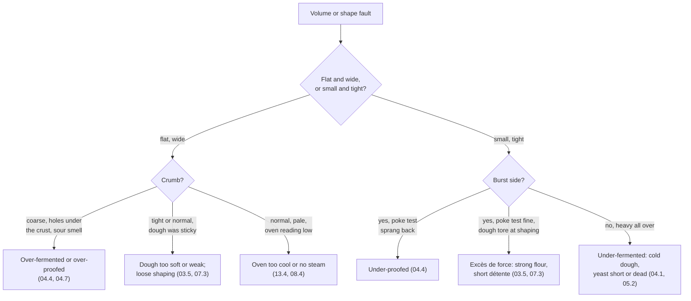

# 16.2 · Volume and Shape Faults

A loaf that is flat, small, burst along the side or misshapen tells you how much gas the dough made, how well it held it and whether it could expand in the oven. This lesson sorts volume and shape faults by those three questions, gives the référentiel's dough and bread defects with their causes and corrections, and links each fault to the lesson that teaches its cause. You run a fault-matching drill and bake four small bâtards, three of them with a deliberate fault.

## Why it matters

Volume and shape are the first things a customer, a manager and a jury see. The référentiel names the dough defects every candidate must recognise, with their characteristics, causes and corrective actions: excès de force, manque de force, pâte trop ferme, pâte trop douce and pâte croûtée (S3.1.4); among bread defects it names the pain plat and the pain cintré (S3.1.6). A flat loaf can come from five different stages; if you blame the wrong one, your correction makes the next batch worse. For how products are judged in the exam, see [The CAP Boulanger Exam](../../references/cap-exam.md).

## Key terms

| French | Say it | English meaning |
|---|---|---|
| pain plat | *pan PLAH* | flat bread: spread wide, low, often with flat cuts |
| pain cintré / éclaté | *pan san-TRAY / ay-kla-TAY* | bread burst along the side, under the cuts |
| excès de force | *ek-SEH duh FORSS* | too much strength: dough springs back, shrinks, tears |
| manque de force | *MAHNK duh FORSS* | lack of strength: dough slackens, spreads, holds no shape |
| pâte trop ferme | *paht troh FAIRM* | dough too firm (too little water for the flour) |
| pâte trop douce | *paht troh DOOSS* | dough too soft (too much water for the flour) |
| relâcher | *ruh-lah-SHAY* | to slacken: a shaped piece losing its tension and spreading |
| manque de volume | *MAHNK duh vo-LÜM* | lack of volume: small, heavy bread |
| grigne | *GREEN-yuh* | the opened cut on a baked loaf, with its ear |

## How it works

### Three questions behind every volume fault

Final volume is the product of three things. Ask them in order:

1. **Was there enough gas?** Fermentation made CO₂ from the sugars (lessons [04.1](../module-04/lesson-01.md), [04.2](../module-04/lesson-02.md)). Too little: cold dough, too little or dead yeast, short times. Too much for too long: the dough is exhausted and the gluten weakened by acidity and enzymes.
2. **Could the dough hold it?** The gluten network traps the gas ([lesson 03.1](../module-03/lesson-01.md)). Too weak (manque de force): the gas escapes or the piece spreads sideways. Too strong (excès de force): the piece resists expansion and bursts where the crust is weakest.
3. **Could it expand in the oven?** Oven spring happens in the first 5-8 minutes, while the core rises from about 35 to 70 °C; after that the yeast is dead and the starch sets from about 76 °C (American Society of Baking). Steam keeps the skin soft long enough; correct cuts give the gas a controlled exit; enough remaining fermentation power drives it. A young piece pushes too hard; an old one has nothing left.

Walk the same questions with your own records in the simulation. It opens on a flat loaf; switch to "Small, heavy loaf" or "Torn or burst along the side" for the other branch.

[Simulation: Diagnose a bread volume fault](../../simulations/troubleshooting/index.html?preset=bread)

### The référentiel's dough defects

These are faults you can feel in the dough before the oven. Catch them there, and the bread is saved.

| Defect | What you see and feel | Main causes | Correction now | Prevention |
|---|---|---|---|---|
| Excès de force | dough springs back, shrinks after rolling, tears at shaping and scoring | strong flour or ascorbic acid; firm dough; long pointage with many folds; cold dough; intensive mixing | longer détente (10-15 min more); looser pre-shape; shape in two passes | autolyse; 1-2 points more water; fewer folds or shorter pointage ([03.5](../module-03/lesson-05.md), [04.2](../module-04/lesson-02.md)) |
| Manque de force | dough stretches with no resistance, slackens, spreads after shaping | weak flour; too much water; over-mixed (letdown); salt forgotten; over-ripe pre-ferment; warm dough | fold (rabat) during pointage; tighter shaping; shorter apprêt; bannetons or couche for support | stronger flour; less water; stop mixing at the optimum; tick the salt ([03.4](../module-03/lesson-04.md), [04.5](../module-04/lesson-05.md)) |
| Pâte trop ferme | hard under the hand, tears when stretched, mixer labours | water short for this flour; water weighed wrong; new, thirstier flour | bassinage in small additions at the end of mixing | hold back 2-3 % water as reserve and finish by feel ([03.5](../module-03/lesson-05.md), [07.2](../module-07/lesson-02.md)) |
| Pâte trop douce | sticks, flows, will not hold a ball | too much water; water taken as % of dough; ice weighed on top of the water | contre-frasage early (before full development); folds | weigh water from the flour; ice counted inside the water weight ([03.5](../module-03/lesson-05.md), [05.3](../module-05/lesson-03.md), [06.1](../module-06/lesson-01.md)) |

The fifth dough defect, pâte croûtée (a dried skin), shows mostly in the crust: lesson [16.3](lesson-03.md).

### Fault table: volume and shape

| Fault | Probable causes | Evidence that decides | Learn the cause in |
|---|---|---|---|
| **Pain plat**: flat, wide, cuts barely open | over-proofed; over-fermented in pointage; dough too soft or weak; loose shaping; oven too cool | poke test (dent stays = over); crumb coarse and sour = fermentation, tight = dough or shaping; oven thermometer | [04.4](../module-04/lesson-04.md), [07.3](../module-07/lesson-03.md), [07.5](../module-07/lesson-05.md) |
| **Manque de volume**: small, heavy, tight | under-fermented (cold dough, yeast short, old or killed by hot water); dough too firm; under-developed | dough temperature vs TPV; yeast weight, type and date; tub rise; water temperature | [04.1](../module-04/lesson-01.md), [05.2](../module-05/lesson-02.md), [06.1](../module-06/lesson-01.md) |
| **Pain cintré / éclaté**: burst along the side | under-proofed; too little steam; cuts too shallow or too short; excès de force; top heat too strong | poke test at loading; steam record; cut depth; did the dough tear at shaping? | [07.4](../module-07/lesson-04.md), [08.4](../module-08/lesson-04.md) |
| Cuts flat and fused, no ear | over-proofed; blade held upright; cuts too deep or not overlapping; too much steam; skinned dough | poke test; angle (about 30°) and depth (about 5 mm); cuts overlapping by a third | [07.4](../module-07/lesson-04.md), [08.4](../module-08/lesson-04.md) |
| Cuts like a barber's pole | cuts made across the loaf instead of along the midline | look at the cut direction | [08.4](../module-08/lesson-04.md) |
| Piece deflates when scored or moved | over-proofed; rough transfer | poke test: dent stays, piece fragile | [04.4](../module-04/lesson-04.md), [09.3](../module-09/lesson-03.md) |
| Seam opens in apprêt or the oven | seam not sealed; flour in the seam | seam position; flour on the bench | [08.3](../module-08/lesson-03.md) |
| Uneven lengths, thick middle and thin ends | uneven pre-shape; hands kept in one place | measure each piece | [08.3](../module-08/lesson-03.md) |
| Uneven sizes in one batch | divided by eye; uneven dough thickness; divider load uneven or gassy | check weights of 5 pieces | [04.3](../module-04/lesson-03.md), [13.2](../module-13/lesson-02.md) |
| Baguettes torn by the façonneuse | excès de force; détente too short; rollers too tight | first piece out of the moulder | [07.3](../module-07/lesson-03.md), [13.2](../module-13/lesson-02.md) |
| Second oven load over-proofed | both groups proofed at the same temperature, load 2 waiting about 30 min more | apprêt times of each load | [14.1](../module-14/lesson-01.md) |
| Blocked or retarded pieces over-proofed at the set time | cabinet or cold room too warm (dirty condenser, next to the oven); dough mixed too warm; too much yeast | cabinet record; TPV of the batch | [04.6](../module-04/lesson-06.md), [13.3](../module-13/lesson-03.md) |
| Whole batch runs ahead of the plan: dough warmer than calculated | friction factor of another product, method or batch size; 3-factor friction factor used in a 4-factor calculation; pre-ferment temperature not counted | dough temperature against the calculation on the sheet | [05.3](../module-05/lesson-03.md), [13.1](../module-13/lesson-01.md) |
| Bread rises fast, slack, bland | salt forgotten | salt ticked on the sheet? taste the dough | [04.7](../module-04/lesson-07.md) |
| Loaves under the ordered baked weight | pâton calculated by adding the loss % instead of dividing by (1 − loss); longer bake | calculation on the sheet; bake time | [06.3](../module-06/lesson-03.md) |

### Shaped pieces and tin loaves

| Fault | Probable cause | Learn the cause in |
|---|---|---|
| Fendu closed, no split | groove too shallow, not floured, or proofed groove up | [10.1](../module-10/lesson-01.md) |
| Tabatière lid did not lift | flap too thick (over 5 mm) or stuck back to the ball | [10.1](../module-10/lesson-01.md) |
| Couronne hole closed | hole too small, no support in apprêt | [10.1](../module-10/lesson-01.md) |
| Épi leaves fell off / closed up | cut right through / only half through, scissors upright | [10.2](../module-10/lesson-02.md) |
| Pain de mie: rounded corners, or lid forced up | too little / too much dough for the tin (pâton = tin volume × 0.35); lid on at the wrong proof | [10.5](../module-10/lesson-05.md) |
| Pain de mie: sides caved in | left in the tin after baking; under-baked | [10.5](../module-10/lesson-05.md) |
| Pain complet tin loaf cracked between top and sides | under-proofed; oven too hot at first | [10.4](../module-10/lesson-04.md) |
| Pain complet loaf collapsed, flat top | over-proofed: wholemeal dough has little tolerance | [10.4](../module-10/lesson-04.md) |

## Worked example

Tuesday, Boulangerie du Marché. Since Monday every baguette of PC-02 is burst along one side, the section is round instead of oval, and the cuts are short and stiff. Last week's baguettes were fine. You apply the method of lesson [16.1](lesson-01.md).

1. **Describe.** All 72 baguettes of both days, both loads: wild tear along the base on one side, height 6.5 cm against the usual 5.5 cm, width 5 cm against 6 cm, cuts opened only 3-4 mm. Shaping notes: "pâte nerveuse, se rétracte" (springy, shrinks back).
2. **Locate.** Every piece, two days → a cause shared by the whole dough. Burst side and round section point to too much strength or under-proofing.
3. **Evidence.**

| Record | Last week | Monday-Tuesday |
|---|---|---|
| Flour | T55 mill A | T55 mill B (new contract), ingredients list: wheat flour, ascorbic acid, enzymes |
| Hydration | 64 % | 64 % |
| Dough temperature | 24 °C | 24 °C |
| Détente | 20 min | 20 min |
| Poke test at loading | fills slowly | fills slowly |
| Steam, oven | normal, 250 °C | normal, 250 °C |

4. **Cause.** Under-proofing is ruled out by the poke test; steam and oven are unchanged. The only difference is the flour: an improved flour with ascorbic acid, stronger and thirstier than the old one. The dough is in **excès de force**: it resists the oven spring and bursts at its weakest point.
5. **Act, report, prevent.** Today: longer détente (30 min) and a looser pre-shape for the batch still in the tub. Report to the head baker: facts, flour change, action. Prevention, one change at a time: first +2 points of water (66 %) added by bassinage; if the baguettes still burst, a 20-minute autolyse next (lessons [03.2](../module-03/lesson-02.md), [03.5](../module-03/lesson-05.md)). Ask the miller for the flour's technical sheet (W and P/L values, lesson [02.3](../module-02/lesson-03.md)).

## Practice

You do the fault-matching drill first (about 15 minutes), then bake four small bâtards from one dough: a control and three deliberate faults.

> [!WARNING]
> You bake two loads at 240-250 °C with steam. Use dry oven gloves; make steam only in a metal tray preheated on the lowest shelf, never in a glass dish; pour 100-150 mL of hot water quickly, close the door and step back. Score with the blade moving away from your fingers and cover the lame after use.

### You need

- Minimum: scale (0.1 g for yeast and salt), probe thermometer, bowl, scraper, lidded container, baking paper, a baking tray, a metal steam tray, oven gloves, lame, ruler, bread knife, oven thermometer, [bake log](../../templates/bake-log.md).
- Professional equivalent: a few pieces of a production batch shaped and scored differently during training, baked on the same deck and cut at the bench.

### Ingredients

PD-01 (lesson [01.7](../module-01/lesson-07.md)):

| Ingredient | Grams | Baker's % |
|---|---|---|
| White flour (T55) | 500 | 100 |
| Water | 325 | 65 |
| Salt | 9 | 1.8 |
| Fresh yeast (or instant 2.5 g) | 7.5 | 1.5 |
| Total | 841.5 | 168.3 |

Four pieces of 205 g; the rest is lost in the bowl or kept as a small roll.

### In Israel

Checked 2026-10-09. Volume faults are where Israeli conditions show most; use [Flour in Israel](../../references/flour-in-israel.md) (section "If your dough feels different") for the flour corrections instead of guessing.

- **Summer heat → pain plat.** In a 28-32 °C kitchen the dough warms during pointage and the pieces over-proof while you wait for the oven. With the 7 % rule, a dough at 28 °C instead of 24 °C ferments about 1.3 times faster. Calculate the water with fridge water (lesson [05.2](../module-05/lesson-02.md)), start checking pointage at 30-35 minutes and the poke test at 25 minutes, and run this practice in the coolest hours or an air-conditioned room.
- **Strong white flour → excès de force.** Many Israeli white flours are stronger than T55, and some bread flours list ascorbic acid (ויטמין C / חומצה אסקורבית, E300) in the ingredients (Stybel's bread flour does). Expect a dough that shrinks back and baguettes that burst like the worked example: read the ingredients (רכיבים) before you blame the proof.
- **80 % and 100 % whole wheat → small, heavy loaves.** Bran absorbs more water and cuts the gluten films; the reference page's last rows give the water and rest corrections. Do not judge your manque de volume against a white-flour loaf.

### Steps

**Part 1 — fault-matching drill (paper).** Match each record to its cause, then open the answers.

| Card | Record |
|---|---|
| 1 | Baguettes flat, pale, cuts closed, large holes under the crust, sour. Dough 27.5 °C (TPV 24 °C), sheet times. |
| 2 | Bâtards flat with a tight crumb, no sourness. Dough "sticky, hard to shape", hydration 70 % instead of 64 %. |
| 3 | Pain de mie with rounded corners and a gap under the lid; tin 2,000 cm³; pâton 600 g. |
| 4 | Boules burst at the base; poke test not done; loaded 40 min after shaping (sheet: 75 min). |
| 5 | Baguettes with symmetrical, shallow grooves and no ear; poke test "fills slowly"; blade held vertical. |
| 6 | Second oven load flat; first load fine; both proofed in the same cabinet at 25 °C. |

Causes to choose from: A over-proofed second group; B under-proofed; C dough too soft (pâte trop douce); D too little dough for the tin; E dough too warm, times not adapted; F scoring angle.

Answers

1 → E (over-fermented by a warm dough: lesson 04.7). 2 → C (flat but tight crumb, not sour: too much water, lesson 03.5). 3 → D (2,000 × 0.35 = 700 g needed, lesson 10.5). 4 → B (loaded early, burst side: lesson 04.4). 5 → F (blade upright gives no ear: lesson 07.4). 6 → A (load 2 waited longer at the same temperature: lesson 14.1).

**Part 2 — the four-bâtard series.**

1. Mix and knead PD-01 to a dough at 23-25 °C (water from lesson 05.2). Pointage about 1 h 15 covered, with a fold at 40 minutes, judged by the signs.
2. Divide into four pieces of 205 g ± 3 g, pre-shape loosely, détente 20 minutes covered. Preheat the oven to 240-250 °C for 45-60 minutes with the tray on the middle shelf and the steam tray on the lowest shelf; check it with the oven thermometer.
3. **Shape** on baking-paper squares labelled A-D, each about 18 cm long:
   - **A control:** a tight bâtard, seam sealed with the heel of the hand (lesson 07.3).
   - **B loose:** fold once, roll to length without tightening, seam not sealed.
   - **C under-proofed:** as A.
   - **D wrong scoring:** as A.
4. Apprêt covered at 24-26 °C. At about 20 minutes, poke-test **C**: the dent springs back at once. Score it with a shallow cut (about 2 mm), steam, bake about 18-20 minutes. Write the time and the poke result.
5. Poke-test A, B and D from about 35 minutes. When the dent fills slowly and not completely, score **A** and **B** with one cut along the length, blade at about 30°, about 5 mm deep; score **D** with the blade held upright, about 1 cm deep. Steam again (refill the hot tray only if it is empty; stand back), bake 18-22 minutes until deep golden; core at least 93 °C.
6. Cool at least 1 hour on a rack. Measure height and width of each; measure how far each cut opened; note any tear.
7. Cut each lengthwise; describe the crumb (tight, even, coarse) in one line.
8. For each faulty piece, write the three-line diagnosis: **symptom → stage → evidence** (B: shaping; C: poke test and time; D: blade angle), and the correction.

### Targets

- Dough 23-25 °C after mixing; four pieces 205 g ± 3 g; apprêt place 24-26 °C recorded.
- Poke-test result and time written for every piece before loading.
- Height, width and cut opening measured for all four after cooling.
- Six drill cards matched before opening the answers; at least five right.

### How you know it worked

The four pieces are visibly different in the directions this lesson predicts: B lower and wider than A, with a flat profile; C smaller, taller, often burst at the side with a cut that barely opened; D with a symmetrical groove but no lifted ear and usually a flatter top than A. If B looks like A, your "loose" shaping still had tension: next time skip the fold. If C did not burst, it was proofed longer than you thought: record the poke result more carefully. Your diagnoses point to the stage and the evidence, not only to the look.

### Self-check

- [ ] I can name the four dough defects of the référentiel and feel at least two of them in a dough.
- [ ] I separated over-proofing from a soft dough by the crumb and the poke test, not by the shape alone.
- [ ] I measured height, width and cut opening rather than describing "flat" or "small".
- [ ] Each of my three diagnoses names a stage and the evidence.
- [ ] I can link each volume fault to the lesson that teaches its cause.

## What goes wrong

| Symptom | Likely cause | Fix now | Prevent next time |
|---|---|---|---|
| All four bâtards look the same | Faults not applied clearly (B still tight, C proofed too long) | Note it and repeat only the unclear piece | Exaggerate the fault; write the poke result |
| Control A also flat | Kitchen warm, whole series over-proofed while waiting for load 2 | Bake at once | Bake C as soon as it is ready; keep A, B, D cooler (lesson [14.1](../module-14/lesson-01.md)) |
| A bursts as well as C | Excès de force (strong flour) or too little steam | Longer détente next time | Check the flour; steam tray preheated, water at loading |
| Pieces stuck to the paper and tore when moved | Paper not floured; dough soft | Bake on the paper | Light dusting; move on the paper, not by hand |
| "Flat" diagnosis with no measurement | Measured by eye | Measure now with a ruler | Height and width on every evaluation |

## Review

- Volume depends on three things: enough gas (fermentation), a dough that holds it (strength), and an expansion the oven allows (steam, scoring, proof stage).
- Pain plat: over-proofed or over-fermented (coarse, sour), or dough too soft, weak or loosely shaped (tight crumb), or oven too cool. Pain cintré: under-proofed, too little steam, shallow cuts or excès de force.
- The référentiel's dough defects (excès and manque de force, trop ferme, trop douce, croûtée) are caught at the bench, where they can still be corrected.
- Faults on every piece point to the dough; faults on one load, tray or the last shaped pieces point to waiting and place.
- Defects and their corrections are exam knowledge: see [The CAP Boulanger Exam](../../references/cap-exam.md).
