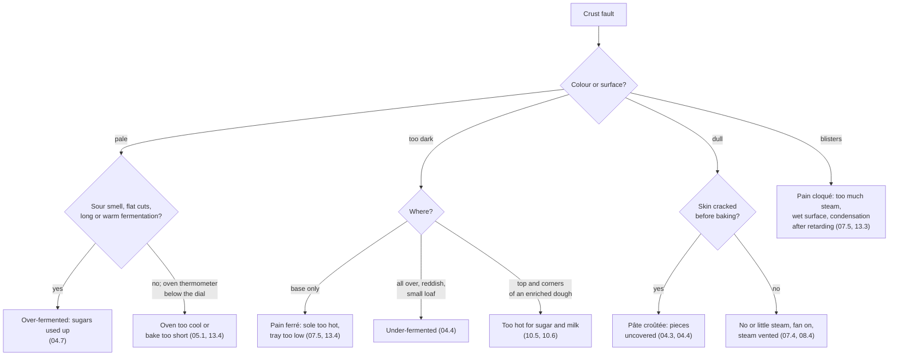

# 16.3 · Crust and Colour Faults

The crust records the last hour of the bread's life: how much sugar fermentation left, whether the surface was dry or wet when it went in, how much steam it met and how hot the sole and the vault were. This lesson explains what makes a crust golden, shiny and thin, then sorts the crust defects of the référentiel and the other colour faults by cause and links each to the lesson that teaches it. You do a fault-matching drill and bake three bâtards that show three different crusts from one dough.

## Why it matters

Colour is the first quality signal in the shop and a criterion in every product evaluation. The référentiel lists three bread defects that are crust defects: the **pain cloqué** (blistered), the **pain ferré** (burnt, hard base) and the **croûte terne** (dull crust), plus the dough defect **pâte croûtée** (skinned dough) that causes the last one (S3.1.4, S3.1.6). Crust faults are also the faults most often blamed on the wrong cause: "pale" is called "under-baked" when the dough was over-fermented, and "dull" is called "no steam" when the pieces had dried in the proof. How colour and crust are judged is in lesson [15.1](../module-15/lesson-01.md). For how products are judged in the exam, see [The CAP Boulanger Exam](../../references/cap-exam.md).

## Key terms

| French | Say it | English meaning |
|---|---|---|
| croûte terne | *KROOT TAIRN* | dull, matte, greyish crust without shine |
| pain cloqué | *pan klo-KAY* | bread with blisters (small bubbles) on the crust |
| pain ferré | *pan feh-RAY* | bread with a burnt, hard, dark base |
| pâte croûtée | *paht kroo-TAY* | dough with a dried skin from being left uncovered |
| buée | *bü-AY* | steam injected into the oven at loading |
| sole / voûte | *SOL / VOOT* | the oven floor / the oven roof (bottom heat / top heat) |
| coloration | *ko-lo-ra-SYOHN* | crust colour |
| croûte épaisse | *KROOT ay-PESS* | thick crust, hard to bite |

## How it works

### What makes a good crust

A golden, shiny, thin, crackling crust needs four things at the same time:

1. **Sugars left at the end of fermentation.** Colour comes from Maillard reactions between sugars and amino acids, which start above about 105 °C at the surface, and from caramelisation from about 160 °C (American Society of Baking). A dough that fermented too long has used up its sugars: it stays pale whatever the bake. A young dough still has plenty: it colours dark and reddish.
2. **A moist surface at loading.** Steam condenses on the cold dough, keeps the skin supple for the oven spring, and gelatinises the surface starch, which dries into a thin, glossy film. Without steam (or with a skin that had already dried in the proof), the surface sets early: thick, dull and often torn.
3. **Steam removed at the right time.** After about 10 minutes at home (lesson [08.4](../module-08/lesson-04.md)), or when the ouras are opened in a deck oven, the surface must dry so it can colour and crisp. Too much steam, or steam left too long, gives blisters and a leathery crust.
4. **Balanced heat.** Sole and vault must match the product. A sole too hot burns the base before the top colours (pain ferré); a vault too hot colours the top before the inside is baked. The dial is not the oven: preheat signals often come long before the real temperature, and the edges of an oven are its hottest zone (King Arthur Baking; lesson [13.4](../module-13/lesson-04.md)).

### The référentiel's crust defects

| Defect | What you see | Main causes | Prevention | Learn the cause in |
|---|---|---|---|---|
| **Croûte terne** | matte, greyish, no shine; often thick | no or too little steam; fan on from the start; steam vented (gas oven); skinned dough (pâte croûtée); over-fermented (sugars used up); oven too cool | steam at loading (home: preheated metal tray, 100-150 mL hot water, fan off the first 10 min); cover pieces; judge fermentation by the dough | [07.4](../module-07/lesson-04.md), [07.5](../module-07/lesson-05.md), [08.4](../module-08/lesson-04.md) |
| **Pain cloqué** | small blisters, sometimes large ones, on the crust | too much steam or steam left too long; very wet surface; humid proof or condensation on cold pieces after retarding or blocking; very long cold fermentation | less steam, vented at about 10 min; cabinet humidity 75-85 %; let retarded pieces lose their condensation before loading | [04.6](../module-04/lesson-06.md), [07.5](../module-07/lesson-05.md), [13.3](../module-13/lesson-03.md) |
| **Pain ferré** | burnt, hard, black base; top normal or pale | sole too hot for the vault; bread too long on the sole; tray on the lowest shelf; gas oven bottom burner; hot back of the deck | lower the sole; net or double tray; middle shelf at home; know your deck's hot zones | [07.5](../module-07/lesson-05.md), [08.4](../module-08/lesson-04.md), [13.4](../module-13/lesson-04.md) |
| **Pâte croûtée** | dry skin before baking; cracks and pale marks on the crust; hard specks in the crumb | pieces or tub uncovered; low humidity in the proof; dry, hot air | cover at every rest; cabinet 75-85 % RH; at home a box or damp towel | [03.5](../module-03/lesson-05.md), [04.3](../module-04/lesson-03.md), [04.4](../module-04/lesson-04.md) |

### Other crust and colour faults

| Fault | Probable causes | Evidence that decides | Learn the cause in |
|---|---|---|---|
| Pale crust although the time is up | over-fermented; oven below its dial or loaded at the "ready" signal; door opened often; salt forgotten | oven thermometer; sour smell and flat cuts; salt tick | [04.7](../module-04/lesson-07.md), [05.1](../module-05/lesson-01.md), [13.4](../module-13/lesson-04.md) |
| Pale first load only | oven "ready" by its signal, not by the thermometer | later loads normal | [13.4](../module-13/lesson-04.md) |
| Dark reddish crust, small dense loaf | under-fermented: much sugar left | dough temperature, poke test | [04.1](../module-04/lesson-01.md), [04.4](../module-04/lesson-04.md) |
| Dark crust, gummy centre | oven too hot for the size; core not checked | core temperature below 93 °C | [05.4](../module-05/lesson-04.md), [10.4](../module-10/lesson-04.md) |
| Dark top and corners, pale sides (pain de mie) | too hot for a sugar-and-milk dough; strong top heat | product type; oven setting | [10.5](../module-10/lesson-05.md) |
| Thick, hard crust | long bake at too low a temperature; no steam; forced convection drying bread | oven setting, steam record, oven type | [09.4](../module-09/lesson-04.md), [13.4](../module-13/lesson-04.md) |
| Uneven colour across a load | hot spots; pieces too close; tray not turned | position of the dark pieces | [07.4](../module-07/lesson-04.md), [13.4](../module-13/lesson-04.md) |
| Viennois streaky, dull crust | steam used on an egg-washed dough; egg wash thick | steam record | [10.6](../module-10/lesson-06.md) |
| Seeds on the crust burnt or bitter | oven too hot; toasted seeds used outside | seed type, oven | [10.7](../module-10/lesson-07.md) |
| Épi tips burnt, stalk pale | leaves too thin and long; strong top heat | cut spacing | [10.2](../module-10/lesson-02.md) |
| Crust soft or leathery a few hours later | bagged warm; humid air; stored in plastic | time and place of bagging | [07.5](../module-07/lesson-05.md) |

Viennoiserie colour faults (pale creases, burnt bottoms, streaky egg wash) are in lesson [16.5](lesson-05.md).

## Worked example

Monday, Boulangerie du Marché. The baguettes de tradition were shaped on Sunday afternoon and held in the controlled proofing cabinet on a blocking programme (lesson [04.6](../module-04/lesson-06.md)): 4 °C overnight, warming from 3:00, ready at 5:30. The shop reports a blistered, dull crust on the whole first load; the second load, 25 minutes later, was clean and shiny.

1. **Describe.** First load, 24 baguettes: many small blisters (2-4 mm) along the top and sides, crust matte rather than shiny; volume and cuts normal. Second load, 24 baguettes: normal.
2. **Locate.** One load only, same dough, same programme → a cause linked to the moment of loading, not to the dough.
3. **Evidence.**

| Record | Load 1 | Load 2 |
|---|---|---|
| Out of the cabinet | 5:30 | 5:30 |
| Loaded | 5:32 | 5:57 |
| Surface at loading | "humide, gouttelettes" (wet, droplets) | "sèche au toucher" (dry to the touch) |
| Cabinet at 5:30 | 25 °C, 92 % RH | same |
| Steam | normal | normal |

4. **Cause.** Candidates: too much steam (rejected: same steam for both loads), over-fermentation (rejected: volume and cuts normal, load 2 waited longer and is fine), wet surface at loading (supported: droplets noted on load 1 only; 92 % RH is above the usual 75-85 %). Warm, very humid air condensed on the still-cold pieces; the water on the skin blistered in the oven and spoiled the shine. Load 2 lost its moisture during the 25-minute wait. Probable cause: **condensation from a too-humid warming phase, loaded wet**.
5. **Act, report, prevent.** Load 1 sold as decided by the manager. Report: facts, cabinet reading, action. Prevention (one change): humidity in the warming phase set to 75-80 %, and pieces taken out 10-15 minutes before loading so the surface is dry to the touch (lesson [13.3](../module-13/lesson-03.md)).

## Practice

You do the fault-matching drill first (about 15 minutes), then bake three bâtards from one dough in two loads: a control, a skinned piece and a piece baked without steam.

> [!WARNING]
> You bake two loads at 240-250 °C. Use dry oven gloves; make steam only in a metal tray preheated on the lowest shelf, never in a glass dish; pour 100-150 mL of hot water quickly, close the door and step back. Score with the blade moving away from your fingers and cover the lame after use.

### You need

- Minimum: scale, probe thermometer, oven thermometer, bowl, scraper, lidded container, baking paper, a baking tray, a metal steam tray, oven gloves, lame, a large upturned box or bowl to cover pieces, [bake log](../../templates/bake-log.md) and [quality rubric](../../templates/quality-rubric.md).
- Professional equivalent: the same pieces proofed in the cabinet with and without cover, baked on the deck with and without steam injection.

### Ingredients

PD-01 (lesson [01.7](../module-01/lesson-07.md)): white flour (T55) 500 g (100 %), water 325 g (65 %), salt 9 g (1.8 %), fresh yeast 7.5 g (1.5 %) or instant 2.5 g. Total 841.5 g → three bâtards of 280 g.

### In Israel

Checked 2026-10-09.

- **Hamsin and dry heat.** On a hot, dry day an uncovered piece can skin within minutes: piece B of this practice will show it fast. For every other bake, keep pieces under a box or a damp, wrung-out towel from dividing to loading.
- **Fan ovens.** Many Israeli home ovens default to a fan ("turbo") setting. The fan dries the surface and blows the steam away: use top-and-bottom heat without the fan for the first 10 minutes (lesson [08.4](../module-08/lesson-04.md)). A crust that is dull only when you used the fan is a setting fault, not a dough fault.
- **Humid coastal summer.** At 67-70 % humidity a crusty loaf softens within hours. That is not a baking fault: cool fully on a rack, keep crusty bread in paper, eat it the same day and freeze the rest (lesson [07.5](../module-07/lesson-05.md)).
- **Summer proofing.** In a 28-32 °C kitchen the pieces reach full proof early; a pale crust on summer bakes points first to over-proofing. Poke-test early.

### Steps

**Part 1 — fault-matching drill (paper).** Match each card to its cause, then open the answers.

| Card | Record |
|---|---|
| 1 | Burnt, hard bases; tops golden. Home oven, tray on the lowest shelf, stone heated below. |
| 2 | Pale, dull baguettes, flat cuts, sour smell. Dough 27 °C, times not adapted. Oven checked at 250 °C. |
| 3 | Pale first load, normal second load. Loaded when the oven light went off, 15 minutes after switching on. |
| 4 | Dull, cracked crust with pale marks. Pieces proofed uncovered on the bench on a dry day. |
| 5 | Blistered crust on bread retarded overnight, loaded straight from the fridge. |
| 6 | Viennois baguettes with streaky, dull egg wash; oven steam used as for baguettes. |

Causes: A condensation on cold pieces; B over-fermented; C sole too hot or tray too low; D pâte croûtée; E oven not truly preheated; F steam on egg wash.

Answers

1 → C, pain ferré (lessons [07.5](../module-07/lesson-05.md), [13.4](../module-13/lesson-04.md)). 2 → B: the oven was right, so the pale colour is sugars used up (lesson [04.7](../module-04/lesson-07.md)). 3 → E: the "ready" signal is not the thermometer (lessons [05.1](../module-05/lesson-01.md), [13.4](../module-13/lesson-04.md)). 4 → D, croûte terne from a skin (lesson [04.4](../module-04/lesson-04.md)). 5 → A, pain cloqué (lessons [04.6](../module-04/lesson-06.md), [07.5](../module-07/lesson-05.md)). 6 → F (lesson [10.6](../module-10/lesson-06.md)).

**Part 2 — three crusts from one dough.**

1. Mix PD-01 to 23-25 °C. Pointage about 1 h 15 covered, fold at 40 minutes. Preheat the oven to 240-250 °C for 45-60 minutes with the tray on the middle shelf and the steam tray on the lowest shelf; check it with the oven thermometer and write both the dial and the real reading.
2. Divide 3 × 280 g, pre-shape, détente 20 minutes covered. Shape **A** and **B** as bâtards of about 20 cm. Keep the third piece covered and shape **C** 25 minutes later (it bakes in the second load).
3. Apprêt at 24-26 °C: **A** under a box; **B** uncovered on the bench, near a window or fan if you can; **C** under a box.
4. When A is ready (dent fills slowly), touch B: write whether its surface is dry or leathery. Score A and B (one cut, about 30°, about 5 mm), load, pour the water into the hot steam tray, close, fan off. Remove the steam tray (gloves) at about 10 minutes. Bake 22-25 minutes until deep golden; core at least 93 °C.
5. Take the steam tray out of the oven and let the oven recover 10 minutes. When C is ready, score it the same way and bake it **without any steam**, fan off, 22-25 minutes.
6. Cool all three at least 1 hour. Compare in daylight: colour (rubric), shine, thickness of the crust (press and cut), any cracks or pale marks, cut opening.
7. Cut each and look under the crust for hard specks (B).
8. Write for B and C the diagnosis: **symptom → stage → evidence → prevention**, and one sentence on how you would tell B from C if you had not made them.

### Targets

- Dough 23-25 °C; three pieces 280 g ± 3 g; dial and real oven temperature both recorded.
- Surface of B described before loading.
- Three crusts compared on colour, shine, thickness and cut opening, each scored with the rubric.
- Six drill cards matched before opening the answers; at least five right.

### How you know it worked

A has a thin, shiny, golden crust and an open cut. B is duller, with cracks or pale patches where the skin tore, a tighter cut and possibly hard specks under the crust. C is dull and thicker all over, with a smaller cut opening, but without B's cracks. You can say which evidence separates B from C: a skin felt before loading (B) against the steam record (C). If your dial and oven thermometer differed by more than 10 °C, you have found a cause of pale bakes you may have blamed on the dough.

### Self-check

- [ ] I can explain why an over-fermented loaf stays pale and an under-fermented one colours reddish.
- [ ] I can name the four crust defects of the référentiel and one cause and prevention for each.
- [ ] I separated a skinned crust from a no-steam crust with evidence, not just the look.
- [ ] I know the real temperature of my oven against its dial.
- [ ] I can link each crust fault to the lesson that teaches its cause.

## What goes wrong

| Symptom | Likely cause | Fix now | Prevent next time |
|---|---|---|---|
| A and C look the same | Steam escaped (fan on, door opened, tray not preheated) | Note it; repeat with the fan off | Preheat the steam tray; keep the door shut for 10 minutes |
| B shows no skin | Kitchen humid; apprêt short | Note the room humidity | Leave B uncovered from shaping, in moving air |
| C over-proofed and flat | Shaped too early for the second load | Bake at once | Shape C later or keep it cooler |
| All three pale | Oven below its dial, or over-proofed while waiting | Bake a few minutes longer | Preheat by the thermometer; poke-test early |
| Burnt bases on all three | Tray too low, or stone or tray too hot for the time | Slide a second tray under | Middle shelf; check the oven's hot zones (lesson [13.4](../module-13/lesson-04.md)) |

## Review

- A good crust needs sugars left by fermentation, a moist surface at loading, steam removed at the right time and balanced sole and vault heat.
- Pale: over-fermented (sugars used up) or oven too cool; the oven thermometer and the fermentation record decide.
- Croûte terne: no steam or a skinned dough; pain cloqué: too much steam or a wet surface after retarding; pain ferré: sole too hot or tray too low.
- Dark and reddish with a small loaf means under-fermented; dark top with pale sides on an enriched dough means too hot for sugar and milk.
- Bread defects and their causes are exam knowledge: see [The CAP Boulanger Exam](../../references/cap-exam.md).
