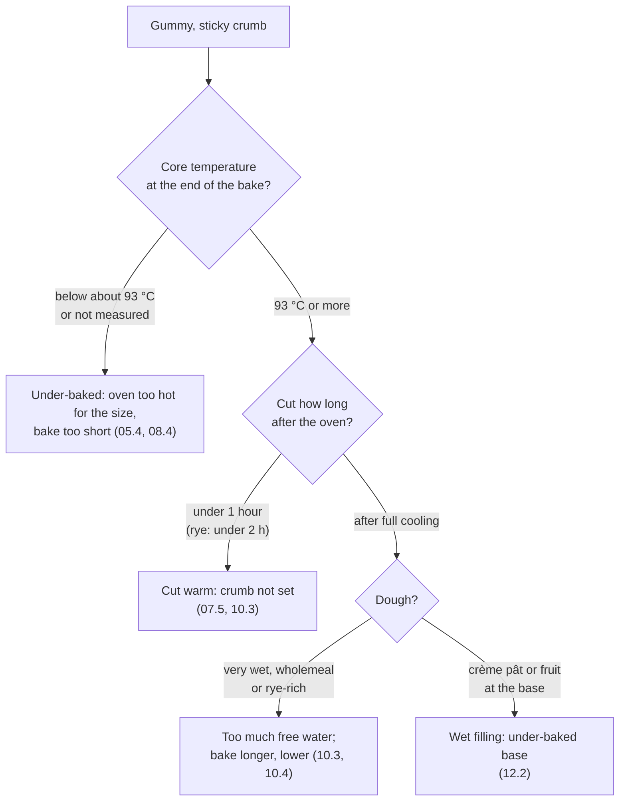

# 16.4 · Crumb Faults

The crumb is the inside story of the bread: the bubbles made at mixing, grown in fermentation, rearranged at shaping and fixed in the oven. When it is dense, gummy, dry, full of tunnels or white and tasteless, the cause is somewhere along that chain, and the cut loaf usually shows where. This lesson explains how the crumb is set, sorts crumb, taste and keeping faults by cause and links each to the lesson that teaches it. You do a fault-matching drill and bake two loaves that show what under-baking and cutting warm do to a crumb.

## Why it matters

A customer forgives a slightly pale crust more easily than a gummy or dry slice. The référentiel asks candidates to explain what happens to the bread in and after the oven (ressuage, conservation, staling) and to recognise bread defects with their causes and corrections (S3.1.6), and it links them to the science of starch and proteins under heat (S4.1). Crumb faults are also where a jury sees the work you did hours earlier: mixing, fermentation and shaping are all visible in one slice. For how products are judged in the exam, see [The CAP Boulanger Exam](../../references/cap-exam.md).

## Key terms

| French | Say it | English meaning |
|---|---|---|
| mie serrée | *mee seh-RAY* | tight, dense crumb with small holes |
| mie collante / pâteuse | *mee ko-LAHNT / pah-TUHZ* | sticky, gummy, doughy crumb |
| mie sèche / friable | *mee SESH / free-AH-bluh* | dry, crumbly crumb |
| mie blanche, sans goût | *mee BLAHNSH sahn GOO* | white, cottony, tasteless crumb (over-oxidised) |
| trou / tunnel | *TROO / tü-NEL* | large hole or tunnel in the crumb |
| croûte décollée | *KROOT day-ko-LAY* | crust separated from the crumb by a large hole just under it |
| empois d'amidon | *ahn-PWAH da-mee-DOHN* | starch paste: gelatinised starch that sets the crumb |
| rassissement | *ra-sees-MAHN* | staling: the crumb firms and dries as starch recrystallises |

## How it works

### How the crumb is made and set

1. **Bubbles are created at mixing.** Mixing traps tiny air cells in the gluten; no new cells form later, they only grow. Folds and gentle handling keep large cells; heavy degassing and tight shaping make the crumb finer and tighter ([lessons 03.1](../module-03/lesson-01.md), [09.3](../module-09/lesson-03.md)).
2. **Fermentation fills them with CO₂.** Too little fermentation: small cells, dense crumb. Too much: walls stretch too thin, cells merge, and the largest rise under the top crust.
3. **Shaping redistributes them.** Air trapped in a fold or flour caught between layers becomes a tunnel or a streak ([lesson 08.3](../module-08/lesson-03.md)).
4. **The oven fixes the structure.** The yeast dies at about 60-70 °C; starch gelatinises from about 76 °C, swelling with the water around it into a starch paste (empois), and the proteins set (American Society of Baking). A crumb that never reached about 93 °C at the core keeps unset, wet starch: it is gummy (King Arthur Baking; baguettes usually 96-98 °C, lesson [08.4](../module-08/lesson-04.md)).
5. **Cooling finishes the job.** During ressuage, steam leaves the loaf and the starch paste firms. Cut warm, the crumb tears and looks gummy even if the bake was right; a rye-containing crumb sets especially slowly ([lesson 10.3](../module-10/lesson-03.md)).
6. **Staling follows.** The gelatinised starch slowly recrystallises (retrogradation) and the crumb firms and dries; it is fastest at fridge temperatures, which is why bread kept in the fridge stales sooner than bread kept at room temperature or frozen ([lesson 07.5](../module-07/lesson-05.md)).

### Fault table: crumb

| Fault | Probable causes | Evidence that decides | Learn the cause in |
|---|---|---|---|
| **Dense, tight crumb** (mie serrée) | under-fermented; dough too firm; under-developed; cold dough; too little water in wholemeal; soaker added at the start of mixing | dough temperature, poke test, hydration, windowpane at the end of mixing | [03.1](../module-03/lesson-01.md), [04.4](../module-04/lesson-04.md), [10.4](../module-10/lesson-04.md), [10.7](../module-10/lesson-07.md) |
| **Gummy, sticky crumb** (mie collante) | under-baked (core below about 93 °C); cut warm; too much water | core reading; time between oven and knife | [05.4](../module-05/lesson-04.md), [07.5](../module-07/lesson-05.md), [08.5](../module-08/lesson-05.md) |
| Dark crust, gummy centre | oven too hot for the piece size, taken out on colour | core reading | [05.4](../module-05/lesson-04.md), [10.3](../module-10/lesson-03.md) |
| **Dry, crumbly crumb** | too little water; over-baked; seeds added dry; old flour; stale | hydration; bake time; soaker record | [02.4](../module-02/lesson-04.md), [10.7](../module-10/lesson-07.md) |
| **Large holes under the crust**, coarse crumb, sour | over-fermented or over-proofed | poke test (dent stays); sour smell; flat loaf | [04.7](../module-04/lesson-07.md) |
| **Tunnel or big hole** in an otherwise normal crumb | air pocket left at flattening; seam not sealed; balls not sealed (pain de mie) | position of the hole along the seam or the fold | [07.3](../module-07/lesson-03.md), [08.3](../module-08/lesson-03.md), [10.5](../module-10/lesson-05.md) |
| **White, cottony, bland crumb** | over-oxidation: long second speed, salt added late, bean or soy flour; intensive mixing with a short fermentation | mixing times and speeds; flour sheet | [03.4](../module-03/lesson-04.md), [09.2](../module-09/lesson-02.md) |
| Tight, regular crumb in a tradition | dough punched or flattened hard; tight pre-shape | crumb cream-coloured but small holes; handling notes | [09.3](../module-09/lesson-03.md) |
| Coarse, uneven crumb in pain de mie | under-developed gluten; butter added too early; loose shaping | mixing record | [10.5](../module-10/lesson-05.md) |
| Dry flour streaks or specks | contre-frasage too late; too much bench flour caught in the folds | where the streaks are: everywhere (mixing) or along the folds (shaping) | [03.5](../module-03/lesson-05.md), [04.3](../module-04/lesson-03.md) |
| Lumps of old dough or yeast | pâte fermentée added late or in one cold block; fresh yeast not crumbled into an autolysed dough | lump colour and texture | [03.2](../module-03/lesson-02.md), [08.1](../module-08/lesson-01.md) |
| Hard specks just under the crust | pâte croûtée (skin kneaded in or shaped in) | skin noted at détente or apprêt | [04.3](../module-04/lesson-03.md), [16.3](lesson-03.md) |
| Crumb stales in a day | stored in the fridge; seeds added dry; low hydration | storage place; soaker record | [07.5](../module-07/lesson-05.md), [10.7](../module-10/lesson-07.md) |
| Mould after a day or two | bagged warm; plastic in a warm, humid room | time and place of bagging | [07.5](../module-07/lesson-05.md) |

### Fault table: taste and smell

Taste faults are crumb faults you notice with your mouth instead of your eyes; the full sensory method belongs to product-quality evaluation.

| Fault | Probable causes | Learn the cause in |
|---|---|---|
| Bland, flat taste, slack dough that rushed | salt forgotten | [02.5](../module-02/lesson-05.md), [04.7](../module-04/lesson-07.md) |
| Bland, "yeasty" taste although volume is good | fast, warm fermentation with a lot of yeast: gas without flavour | [04.1](../module-04/lesson-01.md), [04.2](../module-04/lesson-02.md) |
| Too salty | salt weighed twice or by eye; small pieces with a high baking loss over the 1.4 g (pain courant), 1.3 g (wholemeal, cereal) or 1.1 g (pain de mie) per 100 g limits | [06.1](../module-06/lesson-01.md), [08.5](../module-08/lesson-05.md), [10.2](../module-10/lesson-02.md) |
| Sharp, very sour taste | over-ripe levain or pre-ferment; long warm fermentation | [04.5](../module-04/lesson-05.md), [10.3](../module-10/lesson-03.md) |
| Bitter, "paint" taste in wholemeal bread | rancid flour (germ oil oxidised) | [10.4](../module-10/lesson-04.md) |
| Taste of baking powder, odd rise | self-raising flour used by mistake | [Flour in Israel](../../references/flour-in-israel.md) |

## Worked example

Thursday, Boulangerie du Marché. A regular customer complains that today's baguettes de tradition (sheet TR-01, lesson [09.2](../module-09/lesson-02.md)) "taste of nothing and look like supermarket bread". You cut one beside yesterday's.

1. **Describe.** All 40 traditions of the batch: crumb **white** instead of cream-coloured, fine and regular holes instead of irregular and shiny, soft cottony texture, little aroma. Volume normal, crust a little paler. Yesterday's: cream crumb, irregular holes.
2. **Locate.** Every piece → a cause shared by the whole dough. A tight, regular crumb can come from mixing (over-oxidation) or from shaping (degassing); the colour separates them: degassing gives a tight but still **cream** crumb; only oxidation **bleaches** it.
3. **Evidence.**

| Record | Wednesday | Thursday |
|---|---|---|
| Mixed by | head baker | new apprentice |
| Autolyse | 30 min | none ("forgot, added everything at once") |
| Mixing | 1st speed only, 8 min | 1st speed 4 min + 2nd speed 6 min |
| Salt | at the start of mixing | at the end |
| Shaping | head baker | head baker |
| Dough temperature | 23 °C | 25.5 °C |

4. **Cause.** Shaping is unchanged (same baker), so degassing is unlikely. Mixing is very different: second speed for 6 minutes with the salt added late is exactly the recipe for over-oxidation, which bleaches the carotenoid pigments of the flour and destroys aroma (lesson [03.4](../module-03/lesson-04.md)); the warmer dough (friction) agrees. Probable cause: **over-oxidised dough from intensive mixing, no autolyse, late salt**.
5. **Act, report, prevent.** The batch is legal as tradition (no additive was used), but below standard; the manager decides how to sell it. Report: facts, mixing record. Prevention (one change): the TR-01 mixing method written on the mixer as a card, "autolyse 30 min, salt at the start, 1st speed only, stop before full windowpane", and the apprentice shown it.

## Practice

You do the fault-matching drill first (about 15 minutes), then bake two loaves from one dough, one fully baked and one under-baked, and cut each at two times.

> [!WARNING]
> You bake at 240-250 °C with steam. Use dry oven gloves; make steam only in a metal tray preheated on the lowest shelf, never in a glass dish; pour 100-150 mL of hot water quickly, close the door and step back. Insert the probe thermometer with an oven glove on; cut warm bread on a board with a serrated knife, fingers on top and away from the blade.

### You need

- Minimum: scale, probe thermometer, oven thermometer, bowl, scraper, lidded container, baking paper, a baking tray, a metal steam tray, oven gloves, lame, serrated bread knife, board, ruler, [bake log](../../templates/bake-log.md) and [quality rubric](../../templates/quality-rubric.md).
- Professional equivalent: test loaves probed at the end of the bake and cut after full ressuage at the bench.

### Ingredients

PD-01 (lesson [01.7](../module-01/lesson-07.md)):

| Ingredient | Grams | Baker's % |
|---|---|---|
| White flour (T55) | 500 | 100 |
| Water | 325 | 65 |
| Salt | 9 | 1.8 |
| Fresh yeast (or instant 2.5 g) | 7.5 | 1.5 |
| Total | 841.5 | 168.3 |

Two bâtards of 410 g.

### In Israel

Checked 2026-10-09.

- **80 % and 100 % whole wheat crumb.** A heavy, dense or gummy whole wheat loaf usually means too little water for the bran, not too long in the oven; [Flour in Israel](../../references/flour-in-israel.md) ("If your dough feels different") gives the correction. Judge it against a whole wheat standard, and bake 100 % whole wheat loaves by core temperature (at least 93 °C, lesson [10.4](../module-10/lesson-04.md)): bran sugars colour the crust before the centre is baked.
- **Self-raising flour by mistake.** קמח תופח (*kemakh tofe'akh*) contains raising agents: a crumb that rose oddly and tastes of baking powder is this, not a fermentation fault. Read the bag before weighing.
- **Humid summer keeping.** In a warm, humid kitchen bread bagged in plastic can mould within a day or two. Cool fully, keep crusty bread in paper for the same day, and freeze the rest in slices; do not keep bread in the fridge, where it stales fastest.
- **Summer sourness.** A sharper taste than usual on hot days points to over-fermentation (warm dough, times not adapted) before it points to the flour.

### Steps

**Part 1 — fault-matching drill (paper).** Match each card to its cause, then open the answers.

| Card | Record |
|---|---|
| 1 | Pain de campagne, crumb sticky near the base; core 89 °C; cut after 20 minutes. |
| 2 | Pain courant, white cottony crumb, bland; 2nd speed 8 min, salt added at the end. |
| 3 | Baguettes, one long tunnel along the seam; rest of the crumb normal. |
| 4 | Pain complet, heavy brick, tight crumb; hydration 68 %, no rest, dough "firm". |
| 5 | Seeded loaf, dry crumb, stale the next day; seeds added straight from the bag. |
| 6 | Baguettes flat, coarse crumb with large holes under the top crust, sour. |

Causes: A over-oxidation; B seeds not soaked; C under-baked and cut warm; D air trapped at shaping; E over-fermented; F too little water for a wholemeal flour.

Answers

1 → C (core below 93 °C and cut warm: lessons 07.5, 10.3). 2 → A (lesson 03.4). 3 → D, seam not sealed or air left at flattening (lessons 07.3, 08.3). 4 → F (pain complet needs 74 % or more and a rest: lesson 10.4). 5 → B (soak at least 4 hours: lesson 10.7). 6 → E (lesson 04.7).

**Part 2 — two loaves, two cutting times.**

1. Mix PD-01 to 23-25 °C. Pointage about 1 h 15 covered, fold at 40 minutes. Preheat the oven to 240-250 °C for 45-60 minutes with the steam tray on the lowest shelf; check it with the oven thermometer.
2. Divide 2 × 410 g, pre-shape, détente 20 minutes, shape two bâtards of about 25 cm. Label the papers A and B. Apprêt covered at 24-26 °C until the dent fills slowly.
3. Score both, load together, steam, vent at about 10 minutes.
4. **B (under-baked):** take it out as soon as the crust is light golden, at about 15-17 minutes. Probe the thickest part with the oven glove on and write the core temperature (expect well under 93 °C).
5. **A (fully baked):** bake on until deep golden-brown, about 25-28 minutes in total; probe and write the core (at least 93 °C, aim for 96-98 °C).
6. Cool both on a rack. At **15 minutes** after A comes out, cut the end third of each loaf. Press the crumb with a finger; look at the knife; describe each crumb in one line.
7. At **90 minutes**, cut the middle of each loaf. Describe both again.
8. Weigh each remaining piece after 90 minutes if you want to compare moisture loss (B should be heavier for its size).
9. Write, for B and for the warm cut of A, the diagnosis: **symptom → cause → evidence (core reading, cutting time) → prevention**.

### Targets

- Dough 23-25 °C; two pieces 410 g ± 3 g.
- Core temperature written for both loaves; A at least 93 °C.
- Four crumb descriptions (two loaves × two times) in measured words: sticky or not, springs back or not, knife clean or smeared.
- Six drill cards matched before opening the answers; at least five right.

### How you know it worked

At 15 minutes both cuts look damp and the knife drags, A less than B: cutting warm makes even a well-baked crumb look gummy. At 90 minutes A's crumb is set, springs back when pressed and leaves the knife clean, while B is still sticky, dense near the base and smears the blade. You now have one gummy crumb with two different causes (B: under-baked; A at 15 minutes: cut warm) and the two pieces of evidence that separate them: the core reading and the cutting time.

### Self-check

- [ ] I can explain why a crumb below about 93 °C at the core stays gummy, and why a crumb cut warm looks gummy.
- [ ] I can tell over-oxidation from degassing by the crumb colour.
- [ ] I can tell a tunnel from shaping from holes under the crust from over-fermentation.
- [ ] I recorded core temperatures and cutting times, not only impressions.
- [ ] I can link each crumb and taste fault to the lesson that teaches its cause.

## What goes wrong

| Symptom | Likely cause | Fix now | Prevent next time |
|---|---|---|---|
| B reads 93 °C after 15 minutes | Small or thin loaf; very hot oven | Note it; the comparison still works with cutting times | Take B out earlier, at first colour |
| A and B look the same at 90 minutes | B's crust coloured late, so it was not taken out early enough | Note the core readings | Take B out on the first light colour |
| Probe reads differently in two places | Probe not in the thickest part, or touching the base | Re-measure at the centre | Insert from the end, along the length, to the middle |
| Crumb crushed by the knife | Smooth knife pressed down | Saw with a serrated knife | Serrated knife, light pressure |
| Burnt fingers on the hot loaf | Loaf held bare-handed for probing or cutting | Cool water on the burn | Oven glove for probing; board and towel for cutting warm |

## Review

- The crumb's bubbles come from mixing, grow in fermentation, are rearranged at shaping and are fixed in the oven by starch gelatinisation from about 76 °C; cooling finishes the set.
- Gummy: core below about 93 °C, or cut warm, or too much water; the core reading and the cutting time decide.
- Dense and tight: under-fermented, too firm or under-developed. Large holes under the crust: over-fermented. A single tunnel: shaping.
- White and bland means over-oxidised mixing; a tight but cream crumb means degassing at shaping.
- Bread defects, ressuage and staling are exam knowledge: see [The CAP Boulanger Exam](../../references/cap-exam.md).
