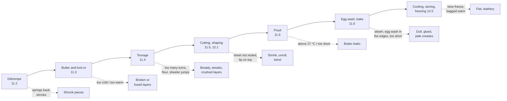

# 16.5 · Viennoiserie Faults

Viennoiserie faults are made early and seen late: the butter that broke at the second turn shows up as thick, greasy layers the next morning, and a proof two degrees too warm shows up as a pool of butter on the tray. This lesson follows a croissant from détrempe to cooling and names, at each stage, the faults it can cause, how to recognise them in the baked piece and in the records, and which lesson teaches the cause; it then does the same for pains au chocolat, pains aux raisins, pâte levée and frozen products. You cut and diagnose three croissants of different origins.

## Why it matters

Croissants, pains au chocolat, pains aux raisins and brioche doughs are products of the référentiel's viennoiserie savoir (S3.4), and they are the products a beginner most often gets wrong without knowing why: the raw dough looks fine, and the fault appears only in the oven. Reporting it so it can be corrected is the same production competency as for bread (C4.4). A bakery that loses one tray of croissants a day to leaking butter loses a large share of its viennoiserie margin; a baker who can read the cut section and the logs fixes it in one batch. The general quality criteria are in lesson [15.1](../module-15/lesson-01.md). For how viennoiserie is judged in the exam, see [The CAP Boulanger Exam](../../references/cap-exam.md).

## Key terms

| French | Say it | English meaning |
|---|---|---|
| beurre cassant | *BUHR ka-SAHN* | brittle butter, too cold: breaks into plates when rolled |
| beurre qui graisse | *BUHR kee GRESS* | butter too warm, smearing into the dough |
| feuilletage irrégulier | *fuh-yuh-TAHZH ee-ray-gü-LYAY* | uneven layering: thick and thin layers, gaps |
| aspect brioché | *as-PEH bree-o-SHAY* | bready, brioche-like interior: layers fused |
| se rétracter | *suh ray-trak-TAY* | to shrink back (triangles, rectangles after cutting) |
| se dérouler | *suh day-roo-LAY* | to unroll in the oven |
| sous-apprêté / sur-apprêté | *soo-za-preh-TAY / sür-a-preh-TAY* | under-proofed / over-proofed |
| dorure | *do-RÜR* | egg wash |
| pied brûlé | *pyay brü-LAY* | burnt base (of a viennoiserie piece) |

## How it works

### Read the stage in the cut section

A croissant is cut lengthwise through the middle, after 30-60 minutes of cooling, with a serrated knife (lesson [11.7](../module-11/lesson-07.md)). The cut section, the paper under the croissant and the records point to the stage:

The numbers behind every check come from [Modules 11](../module-11/lesson-01.md) and [12](../module-12/lesson-01.md) and sheet CR-01: détrempe 18-22 °C; butter at about 13 °C at the lock-in (plastic between about 12 and 15 °C, brittle below about 10 °C); butter with about 80-83 g of fat per 100 g; three single turns (in a warm kitchen one double and one single); final sheet about 3.5 mm for croissants, about 4 mm for pains au chocolat; proof at 24-26 °C and 75-80 % humidity, never above about 27 °C, about 1 h 30-2 h 30 until almost doubled; bake about 190-200 °C (fan 175-180 °C), no steam.

The simulation opens on butter on the tray, the fault with two opposite fixes; read the proof temperature and time before you name the cause.

[Simulation: Diagnose butter on the croissant tray](../../simulations/troubleshooting/index.html?preset=viennoiserie)

### Fault table: lamination (détrempe, butter, tourage)

| Fault | Probable causes | Evidence that decides | Learn the cause in |
|---|---|---|---|
| **Butter breaks**: thick, uneven layers, greasy patches, pale streaks of butter in the sheet | butter much colder and harder than the détrempe (rest too long, fridge too cold, freezer) | butter or block temperature at the turn; "beurre cassant, bords fendus" on the log | [11.3](../module-11/lesson-03.md), [11.4](../module-11/lesson-04.md) |
| **Butter melts into the dough**: greasy dough, bready crumb, no distinct layers | butter or room too warm (butter above about 15 °C, room above 24 °C); long sessions; warm hands | butter and room temperature on the log | [11.3](../module-11/lesson-03.md), [11.4](../module-11/lesson-04.md) |
| **Bready crumb throughout** (aspect brioché), small volume | too many turns (4 simples = 81 butter layers, too thin to stay separate); butter smeared in | turn marks on the sheet and the dough | [11.1](../module-11/lesson-01.md), [11.4](../module-11/lesson-04.md) |
| Few thick, uneven layers | too few turns, or butter broke | turn record | [11.1](../module-11/lesson-01.md) |
| Uneven layers, butter thick in the centre, none in the corners | plaque uneven; lock-in off-centre; rolled in all directions; folds misaligned | plaque size and squareness | [11.3](../module-11/lesson-03.md), [11.4](../module-11/lesson-04.md) |
| White, dry streaks between layers | flour folded in, not brushed off | streaks follow the folds | [11.4](../module-11/lesson-04.md) |
| Layers crushed or smeared on the sheeter | gap reduced in big jumps; butter too cold or too warm | sheeter steps used | [13.2](../module-13/lesson-02.md) |
| Détrempe springs back, shrinks; ballooned with gas in the fridge | over-mixed, too warm, strong flour with ascorbic acid; slab too thick to cool | détrempe temperature after mixing (target 18-22 °C) | [11.2](../module-11/lesson-02.md) |
| Layers tear, croissants watery and flat | spread or reduced-fat butter | label: fat per 100 g | [11.3](../module-11/lesson-03.md) |

### Fault table: cutting, shaping and fillings

| Fault | Probable causes | Learn the cause in |
|---|---|---|
| Triangles or rectangles shrink and thicken after cutting | sheet cut while still elastic, not rested | [11.5](../module-11/lesson-05.md), [12.1](../module-12/lesson-01.md) |
| Croissants unroll in the oven | tip on top or at the side, not underneath | [11.5](../module-11/lesson-05.md) |
| Croissants bend or twist; uneven weights | notch off-centre; triangles crooked; sheet uneven | [11.5](../module-11/lesson-05.md) |
| Dense centre, few visible turns | rolled tight and pressed; triangle not stretched; sheet too thick | [11.5](../module-11/lesson-05.md), [12.1](../module-12/lesson-01.md) |
| Pain au chocolat unrolled, seam on the side | seam not underneath; rectangle stretched while rolling | [12.1](../module-12/lesson-01.md) |
| Chocolate shows at the ends | rectangle narrower than the batons | [12.1](../module-12/lesson-01.md) |
| Chocolate ran into the layers | eating chocolate instead of bake-stable batons; batons kept warm | [12.1](../module-12/lesson-01.md) |
| Pains aux raisins unrolled; burnt raisins | tail not tucked under; raisins not soaked or left on the surface | [12.2](../module-12/lesson-02.md) |
| Pains aux raisins with pale, wet bases | taken out too early; cream layer too thick | [12.2](../module-12/lesson-02.md) |
| Crème pâtissière runny the next day | not brought to a full boil: yolk amylase still active | [12.2](../module-12/lesson-02.md) |

### Fault table: proof, egg wash and bake

| Fault | Probable causes | Evidence that decides | Learn the cause in |
|---|---|---|---|
| **Pool of butter, flat greasy croissants** | proof above about 27 °C (butter melted); proofed with bread in a warmer cabinet; tray left on a warm oven | proof temperature measured with a probe | [11.6](../module-11/lesson-06.md), [13.3](../module-13/lesson-03.md), [14.3](../module-14/lesson-03.md) |
| **Some butter, small tight croissants, split along a turn** | under-proofed: loaded before almost doubling | proof time against the sheet; wobble and visible layers? | [11.6](../module-11/lesson-06.md) |
| Croissants spread, lose their ridges, collapse | over-proofed | proof time; pieces fragile | [11.6](../module-11/lesson-06.md) |
| Dry, cracked skin, pale patches | not covered; humidity too low | proof setting | [11.6](../module-11/lesson-06.md) |
| Streaky, dull crust | steam used; egg wash thick or uneven | steam record | [11.6](../module-11/lesson-06.md) |
| Layers glued at the edges, uneven rise | egg wash brushed into the cut edges | brush marks on the edges | [11.6](../module-11/lesson-06.md), [12.1](../module-12/lesson-01.md) |
| Dark top, pale creases, collapse on cooling | oven too hot, bake too short | crease colour; oven thermometer | [11.6](../module-11/lesson-06.md) |
| Burnt bottoms (pied brûlé) | tray too low; butter leaked and fried | tray position; butter on the paper | [11.6](../module-11/lesson-06.md) |
| Second tray leaked while the first baked | second tray proofed or kept warm too long | where it waited | [11.7](../module-11/lesson-07.md), [14.2](../module-14/lesson-02.md) |

### Pâte levée, braids and frozen products

| Fault | Probable causes | Learn the cause in |
|---|---|---|
| Brioche or pain au lait dough greasy, will not come together | butter added too early or too warm; dough too warm | [12.3](../module-12/lesson-03.md) |
| Pieces slumped, grease on the tray | apprêt too warm (above the 25-27 °C of the sheet) | [12.3](../module-12/lesson-03.md) |
| Small, dense rolls | short proof (sugar slows the yeast); gluten under-developed before the butter | [12.3](../module-12/lesson-03.md) |
| Dark crust, raw centre | oven too hot for a sugar-rich dough | [12.3](../module-12/lesson-03.md) |
| Braid split along the strands | braided tight; under-proofed | [12.4](../module-12/lesson-04.md) |
| Braid thick at one end, thin at the other | braided from one end; strands of different lengths | [12.4](../module-12/lesson-04.md) |
| Frozen croissants flat, slack, little volume | slow freezing; long storage; fermentation started before freezing | [12.5](../module-12/lesson-05.md) |
| Pale, dry patches on frozen pieces | freezer burn: bag not airtight | [12.5](../module-12/lesson-05.md) |
| Outside over-proofed, inside cold and dense | proofed straight from the freezer instead of thawing in the cold | [12.5](../module-12/lesson-05.md) |
| Croissants soft and leathery | packed warm or in plastic; humid air | [11.7](../module-11/lesson-07.md), [12.5](../module-12/lesson-05.md) |

Freezing weakens the dough because ice crystals damage the gluten and kill part of the yeast, more with every week of storage (American Society of Baking); that is why frozen pieces are frozen fast, right after shaping, and thawed slowly in the cold.

## Worked example

Saturday, Boulangerie du Marché. The first two trays of croissants (CR-01, lesson [11.6](../module-11/lesson-06.md)) have butter on the paper. The tourier says at once: "the cabinet is too hot again". You check before you agree.

1. **Describe.** Trays 1 and 2, 30 croissants: a thin ring of butter around each piece (not a pool), croissants small and tight (about 20 % shorter than usual), several split along a turn, colour normal, layers visible but the cut section dense in the centre. Trays 3-4, baked 40 minutes later: normal.
2. **Locate.** Only the first trays → a cause linked to time or order, not to the block. Butter on the paper has two possible causes with opposite fixes: proof too warm, or under-proofed.
3. **Evidence.**

| Record | Trays 1-2 | Trays 3-4 |
|---|---|---|
| Cabinet (probe in a glass of water) | 25 °C | 25 °C |
| Into the cabinet | 4:30 | 4:30 |
| Out to the oven | 5:30 (1 h) | 6:10 (1 h 40) |
| Proof note | "pas encore doublés" (not yet doubled) | "presque doublés, tremblent" (almost doubled, wobble) |
| Oven | ready at 5:30 | same |

4. **Cause.** "Too warm" is ruled out: the probe read 25 °C, inside the 24-26 °C range, and trays 3-4 in the same cabinet are fine. Everything fits **under-proofing**: one hour against the sheet's 1 h 30-2 h 30, "not yet doubled", small, tight croissants that split along a turn while the butter, with too little dough expansion around it, ran out. The oven was ready at 5:30 and the trays went in because the oven was free, not because they were ready.
5. **Act, report, prevent.** Trays 1-2 sold as decided by the manager. Report: facts, quantities, proof times and probe reading, cause. Prevention (one change): on the organigramme, the first croissant load is set by the proof (in at 4:30 → out not before 6:00), and the oven plan starts with bread instead (lesson [14.2](../module-14/lesson-02.md)). The tourier's first idea would have lowered the cabinet temperature and made the next batch even more under-proofed.

## Practice

You cut and diagnose three croissants of different origins (bakery, supermarket, and your own or a second bakery) and do a fault-matching drill. No lamination needed: this practice trains your eyes.

> [!WARNING]
> Cut with a serrated knife on a board, the croissant held flat with your fingers on top and away from the blade's path; saw gently instead of pressing. Croissants contain wheat, milk and egg (and sometimes nuts or soy): read the label or ask before tasting or sharing.

### You need

- Three croissants from different places, bought the same morning; if you made the CR-01 batch of [Module 11](../module-11/lesson-01.md), use one of yours as the third.
- Serrated knife, board, scale, ruler, a sheet of white paper, the [quality rubric](../../templates/quality-rubric.md) (viennoiserie table) and the fault tables above.
- Professional equivalent: the daily batch sample cut at the bench and compared with the shop's standard, faults reported on a [non-conformity report](../../templates/non-conformity-report.md).

### Ingredients

None to bake. Note what each label or seller says: butter or margarine, and the weight if given.

### In Israel

Checked 2026-10-09.

- **Butter or margarine.** A croissant labelled parve (פרווה, *parve*: no milk) cannot contain butter: it is laminated with margarine, which behaves differently from butter in the turns and the proof and tastes different. Compare it fairly: judge its layers and shape, not its butter flavour. For your own croissants, buy butter (חמאה, *khem'a*) with about 80-83 g of fat per 100 g on the label (lesson [11.3](../module-11/lesson-03.md)).
- **Summer kitchen faults.** In a 28-32 °C kitchen the two classic home faults are butter melting in during tourage and butter leaking in the proof. Before you blame the recipe, read your log: room temperature during turns, butter temperature at the lock-in, proof temperature measured with the probe. Laminate early in the morning or in the air-conditioned room and proof at 24-26 °C (lessons [11.4](../module-11/lesson-04.md), [11.6](../module-11/lesson-06.md)).
- **Strong white flour.** Israeli white flour is often stronger than T45; a détrempe that springs back and triangles that shrink are the first sign. Rest the sheet longer in the fridge rather than forcing it; see [Flour in Israel](../../references/flour-in-israel.md) ("If your dough feels different").
- **Humid air.** Bought croissants lose their crispness within hours in coastal summer air: evaluate them within two or three hours of purchase, or refresh all three the same way (a few minutes at about 170-180 °C) so the comparison is fair.

### Steps

**Part 1 — fault-matching drill (paper).** Match each card to its cause, then open the answers.

| Card | Record |
|---|---|
| 1 | Pool of butter, flat greasy croissants. Proof on top of the oven "to speed it up". |
| 2 | Bready, fine crumb with hardly any layers; sheet says "4 tours simples". |
| 3 | Thick uneven layers and greasy patches; log: "tour 2, beurre cassant, chambre froide à 1 °C". |
| 4 | Triangles shrank by 2 cm after cutting; sheet cut straight after the last rolling. |
| 5 | Streaky, dull crust; deck oven used with steam as for bread. |
| 6 | Pains au chocolat unrolled, seam on the side. |
| 7 | Frozen raw croissants flat and slack after six weeks in a domestic freezer. |
| 8 | Brioche dough greasy, will not come together; butter added at the start with the flour. |

Causes: A butter too cold; B too many turns; C proof too warm; D sheet not rested; E steam on egg wash; F seam not underneath; G slow freezing, long storage; H butter added too early.

Answers

1 → C (above about 27 °C: lesson [11.6](../module-11/lesson-06.md)). 2 → B (81 butter layers: lesson [11.1](../module-11/lesson-01.md)). 3 → A (lesson [11.4](../module-11/lesson-04.md)). 4 → D (lesson [11.5](../module-11/lesson-05.md)). 5 → E (lesson [11.6](../module-11/lesson-06.md)). 6 → F (lesson [12.1](../module-12/lesson-01.md)). 7 → G (lesson [12.5](../module-12/lesson-05.md)). 8 → H (gluten first, then the butter: lesson [12.3](../module-12/lesson-03.md)).

**Part 2 — three croissants.**

1. **Label** them 1, 2, 3 with their origin and price; note "butter" or "margarine/parve" from the label or the seller.
2. **Weigh and measure** each: weight, length, height.
3. **Look** at each from above and below: colour, gloss, creases, base (pale, golden, burnt), symmetry, tip position.
4. **Press** lightly: does the crust shatter into flakes or bend like bread?
5. **Cut** each lengthwise through the middle with the serrated knife, after they are at room temperature. Lay the halves on the white paper.
6. **Read** each cut section with the table of lesson [11.7](../module-11/lesson-07.md): honeycomb or bready, layer evenness, dense centre, streaks, hollows. Note any grease mark on the paper after 10 minutes.
7. **Taste** a piece of each: butter, sweetness, salt, any yeasty or stale taste.
8. **Score** each with the viennoiserie rubric (out of 18, no filling).
9. **Diagnose** the main fault of each croissant, if any: **symptom → probable stage → what you would check in the records** (you have no records for bought croissants, so name the evidence you would ask for). For your own croissant, use your logs.
10. **Rank** the three and write two lines on what makes the best one best.

### Targets

- Three croissants weighed, measured, cut and scored out of 18.
- One diagnosis per croissant naming the stage and the record that would prove it.
- Eight drill cards matched before opening the answers; at least seven right.

### How you know it worked

You can point at each cut section and name the stage it reveals: a regular open honeycomb (good lamination, full proof, full bake), a bready crumb (fused layers: warm butter or too many turns), a dense centre (under-proofed or rolled tight), thick greasy layers (butter broke). For a croissant you did not make, your diagnosis ends with the record you would ask for (butter temperature, turns, proof temperature and time), because without it a cause is only a guess: that is the method of lesson [16.1](lesson-01.md) working.

### Self-check

- [ ] I can tell the two causes of butter leakage apart (warm proof, under-proof) and name the evidence for each.
- [ ] I can link a bready, a thick-layered and a dense-centred cut section to their stages.
- [ ] I know the CR-01 temperatures by heart: détrempe 18-22 °C, butter about 13 °C, proof 24-26 °C, never above about 27 °C.
- [ ] I can name two pain au chocolat faults and one frozen-product fault with their causes.
- [ ] For a croissant I did not make, I named the record I would need instead of guessing.

## What goes wrong

| Symptom | Likely cause | Fix now | Prevent next time |
|---|---|---|---|
| Cut section squashed, layers flattened | Cut warm, or a smooth knife pressed down | Cut another half with a serrated knife | Cool 30-60 min; saw gently |
| All three look the same | Same type (e.g. all supermarket margarine croissants) | Buy one from a bakery that sells croissants pur beurre | Choose three different origins |
| Bought croissants soft, layers hard to read | Bagged in plastic or a humid day | Refresh at 170-180 °C for a few minutes | Buy in a paper bag the same morning |
| Diagnosis "too warm" for every leak | Under-proofing not considered | Check the proof time and volume | Read both causes in the fault table |
| Cause named for a bought croissant as a fact | No records | Rewrite as "probable; would check…" | Name the evidence needed |

## Review

- Viennoiserie faults are made early and seen late: read the cut section, the paper under the piece and the logs together.
- Butter breaks when too cold (thick, uneven, greasy layers) and melts in when too warm or over-turned (bready crumb).
- Butter on the tray has two causes with opposite fixes: proof above about 27 °C, or under-proofing; the proof temperature and time decide.
- Shrinking, unrolling and bending come from cutting and shaping; dull, glued or pale-creased pieces from egg wash, steam and bake.
- Viennoiserie products and their quality are exam knowledge: see [The CAP Boulanger Exam](../../references/cap-exam.md).
