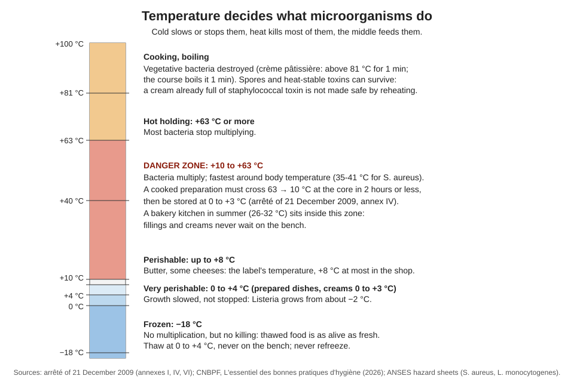
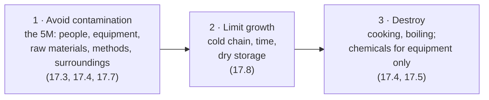

# 17.1 · Microorganisms in the Bakery

A bakery lives on microorganisms: yeast raises the dough and lactic bacteria flavour the levain. Others spoil bread in three days or make customers ill. This lesson explains what microorganisms are, what makes them multiply or die, and why temperature is the baker's main weapon, then you run a simple test with bread slices that shows what your hands leave behind.

## Why it matters

Module 17 opens Part 5 of the course: hygiene, safety and the rules that keep customers and bakers safe. Everything in it rests on one idea: you cannot see the hazard, so you control the conditions. Flour, water, warmth and time make bread rise, and the same conditions feed the microbes you do not want. The référentiel asks you to name the families of microorganisms, the conditions they need, the useful and the harmful ones and the preservation techniques (S4.2.1); the written test has asked for these definitions (see [The CAP Boulanger Exam](../../references/cap-exam.md)).

As in every module with practice: watching or reading is not doing; the Academy cannot see or grade your results, so compare them honestly with the targets and the answers; and this self-assessment does not replace the official exam.

## Key terms

| French | Say it | English meaning |
|---|---|---|
| micro-organisme | *mee-kroh-or-gah-NEESM* | living thing too small to see without a microscope: bacterium, yeast, mould, virus |
| bactérie | *bak-tay-REE* | single-celled microorganism that multiplies by dividing in two |
| levure | *luh-VÜR* | single-celled fungus; baker's yeast is one (lesson [02.6](../module-02/lesson-06.md)) |
| moisissure | *mwah-zee-SÜR* | mould: a fungus that grows as threads and visible spots on bread |
| flore d'altération | *flor dal-tay-rah-SYOHN* | spoilage flora: microbes that make food go off (mould, sourness, slime) without always making people ill |
| flore pathogène | *flor pah-toh-ZHEN* | pathogenic flora: microbes that cause illness (lesson [17.2](lesson-02.md)) |
| multiplication | *mül-tee-plee-kah-SYOHN* | growth in number of microbes: the danger is the number, not one cell |
| zone de danger | *zohn duh dahn-ZHAY* | +10 to +63 °C: the temperature band where bacteria multiply |
| spore | *SPOR* | resistant resting form of some bacteria and moulds; survives cooking and drying |
| conservation | *kohn-sair-vah-SYOHN* | preservation: slowing or stopping microbes so food stays safe longer |

## How it works

### Four families, useful and harmful

| Family | Size and life | Useful in a bakery | Harmful in a bakery |
|---|---|---|---|
| Bacteria | about 0.5-5 µm; one cell divides into two | lactic bacteria in levain: acidity and flavour (lesson [02.7](../module-02/lesson-07.md)) | *Staphylococcus aureus*, *Salmonella*, *Listeria* (lesson [17.2](lesson-02.md)); slime and sourness in creams |
| Yeasts | single-celled fungi, larger than bacteria | *Saccharomyces cerevisiae*, baker's yeast: alcoholic (panary) fermentation (lesson [04.1](../module-04/lesson-01.md)) | wild yeasts that ferment fruit fillings and syrups |
| Moulds | fungi growing as threads; visible spots, spores in the air | none in bread (some cheeses use them) | green, grey or black spots on bread, damp bannetons (lesson [13.6](../module-13/lesson-06.md)) |
| Viruses | far smaller; cannot multiply in food, only in a living host | none | carried by sick or unwashed hands to ready-to-eat food |

The two fermentations the référentiel asks you to know: **alcoholic (panary) fermentation**, where yeast turns sugars into carbon dioxide and ethanol, and **lactic fermentation**, where lactic bacteria turn sugars into lactic acid (and some acetic acid in levain). They are the useful side of the same biology that spoils food.

### What makes microorganisms multiply

The CNBPF hygiene guide lists the growth factors: **nutrients, water, pH, oxygen and temperature**, and the référentiel adds the time they are given.

| Factor | What it means | Bakery example |
|---|---|---|
| Nutrients | proteins, sugars, starch | crème pâtissière (milk, egg, sugar) is a perfect medium; flour is not, because it is dry |
| Water (available water, aw) | microbes need free water; aw 1.0 = pure water | moist crumb and creams are high; dry flour, sugar, dry biscuits are too low; *S. aureus* stops below about aw 0.83 (ANSES) |
| pH (acidity) | most pathogens prefer near neutral (6-7) | levain bread (pH ≤ 4.3, lesson [09.1](../module-09/lesson-01.md)) moulds later than a neutral sandwich loaf |
| Oxygen | some need air, some do not, many manage both | vacuum packs stop moulds, not all bacteria: vacuum never replaces cold |
| Temperature | each microbe has a minimum, an optimum and a maximum | *S. aureus* grows from about 6 to 48 °C, fastest at 35-41 °C; *Listeria* grows from about −2 °C, so in the fridge too (ANSES) |
| Time | multiplication takes time | the same cream is safe after 20 minutes on the bench and not after 3 hours |

### Why time and temperature matter so much

Bacteria multiply by dividing. As an **illustration** (real rates depend on the microbe, the food and the temperature), take a bacterium that divides every 20 minutes in a warm cream: that is 3 doublings an hour.

$$N = N_0 \times 2^{\,t \div 20\ \text{min}}$$

| Time at about 30 °C | Doublings | 100 bacteria per gram become |
|---|---|---|
| 1 h | 3 | 800 |
| 2 h | 6 | 6,400 |
| 4 h | 12 | about 410,000 |
| 6 h | 18 | about 26 million |

ANSES notes that *S. aureus* usually starts producing its toxin at around 100,000 bacteria per gram: in this model a lightly contaminated cream left 4 hours in a warm room is already there. Cold does not reset the count; it only stops the clock.

### The three principles of hygiene

The CNBPF guide sums up all hygiene in three verbs, and each lesson of this module serves one of them:

### Preservation techniques

| Technique | What it does | Kills microbes? | Bakery use |
|---|---|---|---|
| Sterilisation (appertisation) | heat above 100 °C in a sealed container | yes, including spores | canned fillings, UHT cream; stable until opened |
| Pasteurisation | heat below 100 °C | most vegetative bacteria, not spores | pasteurised milk, liquid egg products: still kept cold |
| Refrigeration | 0 to +4 °C (or +8 °C) | no: slows growth | creams, fillings, dairy, retarded dough |
| Freezing (congélation) | slow cooling to −18 °C; large ice crystals | no: stops growth | bread and dough in a home freezer (texture suffers) |
| Quick-freezing (surgélation) | very fast to −18 °C or below; small crystals keep texture | no: stops growth | blast-frozen viennoiserie (lesson [12.5](../module-12/lesson-05.md)) |
| Drying (déshydratation) | removes available water | no: stops growth | flour, sugar, dried fruit, milk powder |

Only heat (and chemicals, for equipment) destroys. Cold and drying only pause microbes, which is why thawed or rehydrated food must be treated like fresh food.

## Worked example

Saturday, 10:30. The tourier finds a tray of crème pâtissière left on the bench beside the oven since 7:30; the room is 28 °C. He says: "It was boiled this morning and it smells fine. I'll put it in the cold room now and use it this afternoon."

1. **What happened to the cream?** It was boiled at about 7:00: most bacteria were destroyed. From then on hands, the spatula and the air could bring new ones. It has spent 3 hours in the danger zone, far longer than the 2 hours allowed to go from +63 °C to +10 °C (arrêté of 21 December 2009, annex IV).
2. **How many bacteria?** With the illustrative 20-minute division: 9 doublings, 2⁹ = 512 times the starting number. If the cream picked up 200 bacteria per gram, it now holds about 100,000 per gram: the level where *S. aureus* can start producing its toxin.
3. **Does smell help?** No. Pathogens rarely change smell or taste; spoilage flora does.
4. **Would cooling or re-boiling fix it?** Cooling stops the clock but leaves the bacteria and any toxin. Re-boiling kills *S. aureus* but its toxin resists heat (ANSES).
5. **Decision.** The cream is discarded. The head baker records it on a [non-conformity report](../../templates/non-conformity-report.md) (cause: cooling step forgotten) and the prevention: cream poured into a shallow tray on ice the minute it is cooked, times at 63 °C and 10 °C written down (lesson [12.2](../module-12/lesson-02.md)).

## Practice

You see contamination with your own eyes: four bread slices touched in four different ways, sealed and watched for a week.

> [!CAUTION]
> Never open a bag once mould has grown: mould spores irritate the airways and some moulds produce toxins. Do not smell the slices. Anyone with asthma or a mould allergy should watch the bags only. At the end, throw the bags away **sealed**, then wash your hands.

### You need

- Minimum: 4 slices of the same fresh bread **without preservative** (your own bread is best), 4 zip bags or lidded boxes, a marker, kitchen tongs, a few drops of water, a phone or coins, soap, paper towels, a dark cupboard, a notebook.
- Professional equivalent: surface swabs or contact plates sent to a laboratory to check the cleaning plan (CNBPF guide; lesson [17.4](lesson-04.md)).

### Ingredients

| Item | Quantity | Why |
|---|---|---|
| Fresh bread without preservative | 4 slices, about 1.5 cm | the medium the microbes grow on |
| Water | 3-4 drops per slice | raises the surface moisture so growth shows within a week |

### In Israel

Checked 2026-10-09.

- **Bread:** many packaged sliced breads contain a preservative (*chomer meshamer*, חומר משמר, often calcium propionate) that slows mould for days. Use your own bread, or a fresh loaf from a bakery whose ingredient list shows no preservative.
- **Climate:** in a 26-32 °C summer kitchen the spots appear in 3-5 days instead of 5-7; in an air-conditioned winter flat it can take 8-10 days. Write the room temperature in your log.
- **Words:** mould *ash* (עובש); bacterium *chaydak* (חיידק); yeast *shmarim* (שמרים).

### Steps

1. Label the bags A, B, C, D and write the date and room temperature on each.
2. **A — control:** with clean tongs, put a slice straight into bag A. Do not touch it.
3. **B — dirty hands:** handle your phone, coins, a door handle and the bin lid for 2 minutes, then press your fingertips and palm on slice B for 5 seconds. Bag it.
4. **C — washed hands:** wash your hands as in lesson [01.3](../module-01/lesson-03.md) (at least 15 seconds of rubbing, single-use towel), then touch slice C the same way. Bag it.
5. **D — gloves:** put on a disposable glove, handle the phone again for 1 minute, then touch slice D with the gloved hand. Bag it.
6. Add 3-4 drops of water to each slice before closing (the same for all four). Close, and keep the four bags together in a dark cupboard.
7. Every day at the same time, look through the bag (do not open it) and record the number and colour of spots and the area covered (none, under 10 %, 10-50 %, over 50 %).
8. After 7 days (or when B is over 50 % covered), write your conclusion in three sentences, then throw the bags away sealed and wash your hands.

### Targets

- Four slices from the same loaf, treated identically except for the contact.
- A daily record for 7 days, with room temperature.
- A conclusion that names which contact carried the most microbes and what that means for shaped dough and finished bread.

### How you know it worked

Slice B usually grows first and most, often in the shape of the fingertips; A and C grow later and less; D often looks like B, because a glove that has touched a phone is a dirty glove. If all four mould on the same day, the bread was already heavily contaminated or the slices were too wet: repeat with fresher bread and fewer drops. This is a demonstration, not a laboratory test: it shows that hands carry microbes and that washing works, not how many microbes there were.

### Self-check

- [ ] I can name the four families of microorganisms with a useful and a harmful example.
- [ ] I can list the growth factors and say which one a baker controls most easily.
- [ ] I can explain why a cream left 3 hours at 28 °C is discarded even if it smells fine.
- [ ] I can say which preservation techniques kill microbes and which only stop them.
- [ ] I kept a 7-day record of my four slices and wrote a conclusion.

## What goes wrong

| Symptom | Likely cause | Fix now | Prevent next time |
|---|---|---|---|
| Bread moulds in 2-3 days in summer | warm, humid storage; bread bagged while still warm (condensation) | discard mouldy bread whole, not just the spot | cool fully before bagging; freeze what will not be eaten in 1-2 days (lesson [07.5](../module-07/lesson-05.md)) |
| Cream or filling "smells fine" but was left out for hours | time in the danger zone ignored | discard; record a non-conformity | shallow tray on ice at once; write the times |
| Frozen product thawed on the bench overnight | belief that freezing killed the microbes | discard if it was a sensitive product | thaw at 0 to +4 °C; freezing only pauses microbes |
| Test slices all mould at once | bread already contaminated, or too much water | repeat | fresh bread without preservative, 3-4 drops only |
| Gloved slice as dirty as the unwashed one | glove touched the phone | none (it is the lesson) | gloves never replace washing; change them after any dirty contact |

## Review

- Four families: bacteria, yeasts, moulds, viruses; yeast and lactic bacteria work for the baker, spoilage and pathogenic flora against.
- Growth needs nutrients, water, a suitable pH, the right oxygen, temperature and time; temperature and time are what a baker controls.
- The danger zone is +10 to +63 °C: cooked preparations cross 63 → 10 °C in 2 hours or less, then 0 to +3 °C.
- Only heat destroys microbes in food; cold, freezing and drying only stop them, and some toxins and spores survive heat.
- Exam-relevant (S4.2 definitions, growth factors, preservation): see [The CAP Boulanger Exam](../../references/cap-exam.md).
