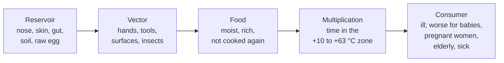

# 17.2 · Food Poisoning and the Pathogens to Know

Bread out of the oven is one of the safest foods there is; the cream, the ham sandwich and the hands that touch them are not. This lesson explains how food makes people ill, the five pathogens the CAP names and the bakery products each one targets, and what breaks the chain. You finish by writing the hazard list for three products from the shop.

## Why it matters

A collective food poisoning traced to a bakery means sick customers, an official investigation and often a closed shop. Most outbreaks follow the same few mistakes: a cream cooled too slowly, a filling kept too long, a sick or careless pair of hands after the oven. The référentiel asks you to name the main pathogens, link each to its illness and its foods, and propose preventive measures (S4.2.1.3-4); this lesson gives you the reasoning for the hazard analysis of lesson 17.5. Exam format: [The CAP Boulanger Exam](../../references/cap-exam.md).

## Key terms

| French | Say it | English meaning |
|---|---|---|
| intoxication alimentaire | *an-tok-see-kah-SYOHN ah-lee-mahn-TAIR* | food poisoning: illness after eating food containing microbes or their toxins |
| toxi-infection alimentaire collective (TIAC) | *tok-see an-fek-SYOHN … ko-lek-TEEV* | collective food-borne outbreak: at least two people with similar, usually digestive, symptoms traced to the same food |
| pouvoir pathogène | *poo-VWAHR pah-toh-ZHEN* | pathogenicity: a microbe's ability to cause disease |
| virulence | *vee-rü-LAHNS* | how strongly a pathogen multiplies and spreads in the body |
| toxinogénèse | *tok-see-noh-zhay-NEZ* | toxin production by a microbe, often in the food before it is eaten |
| entérotoxine | *ahn-tay-roh-tok-SEEN* | toxin acting on the gut; the staphylococcal ones resist cooking |
| réservoir | *ray-zair-VWAHR* | where a microbe lives naturally: human nose and skin, animal gut, soil |
| vecteur | *vek-TUHR* | what carries it to the food: hands, tools, water, insects, raw products |
| produit sensible | *pro-DWEE sahn-SEE-bluh* | sensitive product: moist, rich, eaten without further cooking (creams, sandwiches) |

## How it works

### Infection and intoxination

There are two ways a microbe makes you ill:

- **Infection:** live bacteria are eaten and multiply in the body (*Salmonella*, *Listeria*). Cooking that kills them protects.
- **Intoxination:** a toxin made in the food before it is eaten causes the illness (*S. aureus*, *C. botulinum*). If the toxin is heat-stable, as staphylococcal enterotoxins are, cooking afterwards does **not** protect.

Typical symptoms of food poisoning: diarrhoea, abdominal pain, vomiting, fever (référentiel). They appear after an **incubation** that depends on the microbe: minutes to hours for a toxin, days to weeks for some infections.

### The chain of contamination

Break **any** link and there is no illness: protect the reservoir (cover wounds, stay away when ill), clean the vector (hands, tools), protect the food (covered, separated), stop multiplication (cold, time), or destroy (cooking). Good practice breaks several links at once.

### The five pathogens the CAP names

| Pathogen | Reservoir | How it makes you ill | Bakery products at risk | What prevents it |
|---|---|---|---|---|
| *Staphylococcus aureus* (staphylocoque doré) | human nose, skin, throat: 20-55 % of people carry it in the nose (ANSES); infected wounds | **toxin made in the food**, heat-stable; violent vomiting 30 min-8 h after eating (about 3 h on average) | creams and cream cakes handled after cooking, sandwiches, anything shaped or assembled by hand and not cooked again | hand washing, wounds covered (dressing and glove), hair covered; food below 6 °C or out of the danger zone quickly; cooling 63 → 10 °C in 2 h or less |
| *Salmonella* (salmonelles) | gut of farm animals and poultry; shells and contents of eggs | **infection**; gastroenteritis, severe for babies and the frail; 39 % of confirmed TIAC in France in 2019 (ANSES) | raw-egg preparations (mousses, some creams), egg wash handled carelessly, poultry fillings | pasteurised egg products for uncooked recipes; cream boiled; raw-egg preparations eaten within 24 h; separate raw egg from finished products; wash hands after eggs |
| *Listeria monocytogenes* | soil, environment, damp corners of workshops and drains | **infection**; often mild in adults but serious in pregnant women (risk to the baby), the elderly and the immunosuppressed; incubation can be weeks | sandwich fillings eaten cold: cooked ham, soft cheeses, smoked salmon, prepared salads | it grows from about −2 °C, so the fridge only slows it: fridge at +4 °C or below, DLC respected, opened products dated, cold rooms and drains cleaned |
| *Escherichia coli* (pathogenic strains) | gut of animals and people | **infection**; diarrhoea, sometimes severe (kidney damage in children) | undercooked minced meat, raw-milk products, poorly washed raw vegetables in sandwiches | cook meat fillings through; wash and decontaminate vegetables per procedure; hand washing after toilets |
| *Clostridium botulinum* | soil; forms heat-resistant spores; grows without air | **toxin**, very rare but paralysing and life-threatening | home-made preserves, vacuum-packed products kept warm, swollen cans | buy industrial preserves; refuse swollen, leaking or dented cans; keep vacuum packs cold as labelled |

Two lessons for the baker from this table:

1. **The danger is after the oven.** Baking destroys the vegetative bacteria in the crumb (lesson [01.2](../module-01/lesson-02.md)); everything that touches the product afterwards can recontaminate it, and creams and fillings are not baked again.
2. **Some microbes ignore the fridge.** *Listeria* grows slowly at fridge temperature: a cold room that is cold but dirty, or a filling kept past its date, is still a risk. Cold, time and cleaning work together.

### When an outbreak is suspected

If customers report being ill after eating your products, or a supplier or the authorities announce an alert on an ingredient you used, the manager acts at once (CNBPF guide): check the delivery records to see whether the lot was received, withdraw and destroy the products that may be concerned, inform customers clearly if they were sold, and cooperate with the authorities (DDPP, regional health agency). Doctors declare TIAC to the health authorities; a bakery's records (deliveries, temperatures, cooling logs) are what show what happened. Lesson [17.7](lesson-07.md) covers traceability and recalls.

## Worked example

Monday 18:00, Boulangerie du Parc. Four people from one office phone the shop: all vomited violently 2 to 4 hours after sharing six éclairs and two jambon-beurre sandwiches bought at 12:15. Nobody has a fever.

1. **Incubation and symptoms point to a toxin.** Violent vomiting after 2-4 hours, no fever: typical of *S. aureus* enterotoxin (30 min-8 h, about 3 h on average). *Salmonella* or *Listeria* would take longer.
2. **Which product?** Both are handled after cooking. The four people all ate éclair; only two ate the sandwiches: the éclairs are the first suspect.
3. **The records.** The crème pâtissière cooling log for that morning shows: 63 °C at 6:10, 10 °C at 9:20. **3 h 10 min**, over the 2-hour limit. The note says "blast chiller full, cooled on the bench". The pastry worker had a cut thumb, covered with a plaster but no glove.
4. **Probable chain.** Reservoir: the worker's skin or wound. Vector: the hand filling the éclairs and touching the cream. Multiplication: 3 hours in the danger zone during cooling, then the éclairs on display. Toxin made before sale; nothing afterwards could remove it.
5. **Immediate actions.** Remaining éclairs and cream withdrawn and kept aside, labelled, for the authorities; manager informed; customers advised to see a doctor; the DDPP contacted as the manager decides; non-conformity report written.
6. **Prevention.** Cream cooled only in a shallow tray in the blast chiller or on ice, never on the bench; when the chiller is full, cream production is moved; any wound covered with a dressing **and** a glove, and the worker kept away from fillings if the wound is infected.

## Practice

You write the hazard list for three products. No baking is needed; you use the technical sheets and lessons you already have.

### You need

- Minimum: the technical sheets or your notes for a baguette (lesson [08.1](../module-08/lesson-01.md)), a jambon-beurre or croque sandwich (lesson [02.10](../module-02/lesson-10.md)) and a pain aux raisins with crème pâtissière (lesson [12.2](../module-12/lesson-02.md)); paper or a spreadsheet.
- Professional equivalent: the hazard analysis section of the bakery's plan de maîtrise sanitaire (lesson [17.5](lesson-05.md)).

### Ingredients

No ingredients: this is a paper exercise.

### In Israel

Checked 2026-10-09.

- **Summer heat:** a 30 °C kitchen is in the middle of the danger zone. The Ministry of Health's specification for food businesses allows ready-to-eat food on sale for **2 hours**; after that it must be eaten, chilled to 5 °C or below, or kept hot above 65 °C. Use the same rule at home for sandwiches and creams: out of the fridge only while you work on them.
- **Picnics and the beach:** sandwiches with cheese, eggs or tuna travel in a cool bag with ice packs, never in a hot car.
- **Words:** food poisoning *harala'at mazon* (הרעלת מזון); salmonella *salmonela* (סלמונלה).

### Steps

1. For each product, draw its main stages from reception to sale in one line (for example: reception → storage → weighing → mixing → … → baking → cooling → sale).
2. Mark the stage after which the product is **not cooked again**.
3. For each of the five pathogens, decide whether it is a realistic hazard for that product (yes / unlikely) and why.
4. For each realistic hazard write: reservoir, vector, the stage where it could multiply, and two preventive measures.
5. Rank the three products from most to least sensitive and justify the ranking in two sentences.
6. Compare your list with the reference answers.

Reference answers (open after you have written yours)

**Baguette.** Baking destroys vegetative bacteria in the crumb; flour is dry. Realistic hazards are low: recontamination of cooled bread by hands (*S. aureus*) is minor because bread is dry and not a medium for growth; moulds are a spoilage problem. Measures: clean hands and tongs after the oven, cooled bread kept away from raw products and cartons. Least sensitive.

**Jambon-beurre or croque.** Not cooked again (jambon-beurre) or only reheated (croque). Realistic: *Listeria* (cooked ham, cheese; grows in the fridge) and *S. aureus* (hands at assembly). Multiplication: if kept out of the cold or past the date. Measures: ham at +4 °C or below (+3 °C for prepared preparations), opened packs dated, assembly with washed hands or clean gloves on a disinfected board, sandwiches chilled and sold the same day. *E. coli* only if raw vegetables are added and poorly washed. Most sensitive for Listeria.

**Pain aux raisins.** The pastry is baked, but the cream is cooked before shaping; the main risks are in making and cooling the cream. Realistic: *S. aureus* (hands, slow cooling), *Salmonella* (raw yolks before cooking; destroyed by boiling, so the risk is cross-contamination of finished products by raw egg). Measures: boil 1 minute, cool 63 → 10 °C in 2 h or less, 0 to +3 °C, 24 h; separate raw-egg tools. Very sensitive at the cream stage; the baked pastry is then less sensitive.

Ranking: sandwich ≥ pain aux raisins (cream stage) > baguette.

### Targets

- Three stage lines, each with the "not cooked again" point marked.
- For each product, every realistic hazard with reservoir, vector, multiplication stage and two measures.
- A ranking justified by "cooked again or not" and "moist and rich or dry".

### How you know it worked

Your answers name the same main hazards as the reference (Listeria and S. aureus for the sandwich, S. aureus and cross-contamination by raw egg for the cream) and every measure is something a person can actually do at a given stage, not "be careful".

### Self-check

- [ ] I can tell an infection from an intoxination and give an example of each.
- [ ] I can match the five pathogens to their reservoirs and to bakery products.
- [ ] I know why Listeria is a risk even in the fridge and why reheating does not save a contaminated cream.
- [ ] I can list what a manager does when an outbreak is suspected.

## What goes wrong

| Symptom | Likely cause | Fix now | Prevent next time |
|---|---|---|---|
| Several customers vomiting a few hours after cream pastries | *S. aureus* toxin: slow cooling, hands, wound | withdraw and keep the products; inform the manager; cooperate with the authorities | cooling log with times; wounds covered with dressing and glove; blast chiller or ice bath |
| Sandwich ham used 6 days after opening | opening date not written | discard | write the opening date and new use-by on every opened pack |
| Raw-egg whisk used in the finished cream | tools not separated | discard the cream if raw egg reached it after cooking | separate tools, or wash and disinfect between raw and cooked |
| Cold room clean on the shelves, dirty under the racks and at the drain | Listeria can persist in damp spots | clean and disinfect the whole room | include drains, seals and under racks in the cleaning plan (lesson [17.4](lesson-04.md)) |
| Swollen tin of tomato sauce opened for pizzas | can defect ignored at reception | discard without tasting; report to the supplier | refuse swollen, dented or leaking cans at reception (lesson [17.7](lesson-07.md)) |

## Review

- Infection (live bacteria) versus intoxination (toxin made in the food); staphylococcal toxin survives cooking.
- *S. aureus* comes from people and loves handled creams; *Salmonella* from eggs; *Listeria* from the environment and grows in the fridge; pathogenic *E. coli* from guts; *C. botulinum* from soil, without air.
- The danger is after the oven: creams, fillings and sandwiches are not cooked again.
- Break the chain: healthy, clean hands; clean tools; covered, separated food; cold and short times; thorough cooking.
- Exam-relevant (S4.2 pathogens and TIAC): see [The CAP Boulanger Exam](../../references/cap-exam.md).
