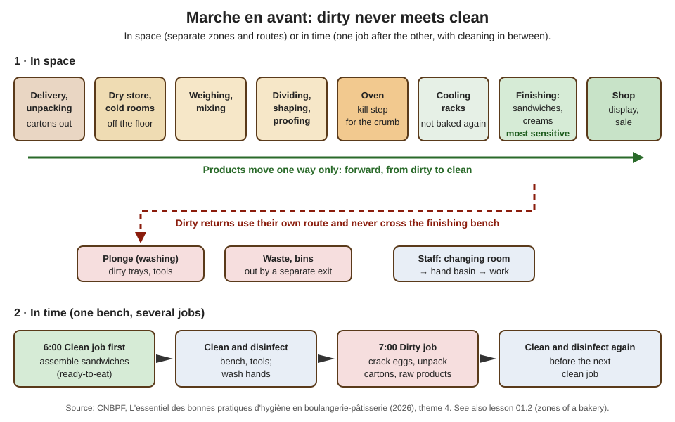

# 17.3 · Personal Hygiene and Cross-Contamination

The person is the first source of contamination in a bakery: the CNBPF hygiene guide calls hands the first vector of contamination in the business. This lesson goes beyond the day-one rules of lesson 01.3: health and wounds, clothing, gloves, behaviour, training, and how microbes and allergens jump from one product to another. You finish with a scenario drill and a self-audit of one of your own bakes.

## Why it matters

Cross-contamination is how a clean product becomes a dangerous one without anyone noticing: raw egg on the finishing bench, a phone on the shaping table, a seeded-dough scraper in the plain dough. The référentiel asks you to justify hand washing, the work clothing, professional behaviour and the medical visits (S4.2.2.1), and to illustrate the marche en avant (S1.3.3). A real EP1 paper (2019) asked candidates to put the hand-washing steps in order and justify them; hygiene is also watched throughout the production test (see [The CAP Boulanger Exam](../../references/cap-exam.md)).

## Key terms

| French | Say it | English meaning |
|---|---|---|
| hygiène corporelle | *ee-ZHYEN kor-por-EL* | personal (body) hygiene |
| lavage hygiénique des mains | *lah-VAHZH ee-zhyay-NEEK day MAN* | hygienic hand washing: wet, soap, rub, rinse, dry with single-use paper |
| tenue de travail | *tuh-NÜ duh trah-VAH-yuh* | complete work clothing, worn only at work |
| coiffe / charlotte | *KWAF / shar-LOT* | head covering that encloses the hair |
| doigtier | *dwah-TYAY* | finger cot worn over a dressed cut |
| visite médicale | *vee-ZEET may-dee-KAL* | occupational health visit (hiring, periodic, return to work) |
| contamination croisée | *kohn-tah-mee-nah-SYOHN krwah-ZAY* | cross-contamination: microbes or allergens carried from one product, surface or person to another |
| règle des 5M | *REG-luh day SANK EM* | the five sources of contamination: main-d'œuvre, matériel, matières, méthodes, milieu |
| kit visiteur | *KEET vee-zee-TUHR* | overcoat, hair cover and overshoes for visitors in production |

## How it works

### Health: who may handle food

The employer must keep staff fit to handle food (CNBPF guide):

- **Medical visits** through the occupational health service: an information and prevention visit at hiring, periodic visits depending on the job, visits on request, and a return-to-work visit after maternity leave, an occupational illness, at least 30 days off after a work accident, or at least 60 days off after a non-work illness or accident.
- **Tell the manager before the shift** about diarrhoea, vomiting, fever, a respiratory infection or an infected wound. Staff with gastroenteritis, flu or an open wound do not handle food (Service-Public); with a mild respiratory infection the CNBPF guide asks for a mask.
- **Wounds and burns** are covered with a waterproof dressing **and** a glove or finger cot. Staphylococci live in infected wounds; ANSES advises keeping workers with skin lesions away from unwrapped food until the lesions are properly covered.
- **Healthy carriers** (porteurs sains) spread microbes without symptoms: up to half of people carry *S. aureus* in the nose (lesson 17.2). That is why the rules apply to everyone, every time.

### Clothing and the body

| Rule | Why |
|---|---|
| Complete, clean work clothing put on at work and worn only at work (jacket, trousers, apron, safety shoes; a clean apron changed when soiled) | street clothes bring dust, hair, pet hair and microbes from outside |
| Hair fully enclosed in a coiffe; beard covered if long | hair and dandruff fall into dough; the scalp carries staphylococci |
| No jewellery, no watch; short, clean, unvarnished nails | rings and watches trap dough and microbes and can end up in a product (physical hazard) |
| Separate clean and dirty clothes in the locker | dirty clothes recontaminate clean ones |
| Visitors (a technician, an inspector, a delivery driver entering production) wear a visitor kit | they bring the outside in |

Lesson [01.3](../module-01/lesson-03.md) lists the protective clothing (safety shoes, oven gloves) for your own safety; lesson 17.9 covers the employee-safety side.

### Hands: when and how

The moments and the method are in lesson 01.3 (CNBPF): at the start of work and after breaks, after the toilet, after blowing your nose, after any **dirty operation** (receiving goods, unpacking cartons, breaking eggs, raw foods, bins, cleaning) and **before any sensitive operation** (sandwiches, crème pâtissière after cooking). The 2019 EP1 paper asked for the justification of each step; here it is:

| Step | Why |
|---|---|
| Remove jewellery and watch | lets soap reach all the skin; nothing traps microbes |
| Wet hands, wrists and forearms with lukewarm water | removes part of the visible dirt and microbes; helps the soap work |
| Liquid soap (antiseptic where the procedure asks), rub at least 15 seconds: palms, backs, between fingers, thumbs, nails, wrists | the rubbing and the soap lift fat, dirt and microbes; this is where most of the work is done |
| Rinse well | carries away soap, dirt and microbes |
| Dry with a single-use paper towel; close the tap with it if the tap is hand-operated | wet hands transfer microbes more easily; a cloth towel would recontaminate |
| Throw the paper in the bin without touching it | do not recontaminate clean hands |

**Gloves** do not replace washing. Wash before putting them on, change them when they tear, when you change task or type of food, and after any dirty contact (phone, money, bin). Hand gel can complete washing but never replaces it on dirty hands.

### Behaviour at the bench

The CNBPF guide's rules, and the reason behind each: do not cough or sneeze over food (use your elbow, then wash); do not touch your face, hair or mouth; do not taste with your fingers (use a clean spoon, once); do not lick a finger to separate bags or paper cases; do not blow into bags; no phone, no eating, no smoking in production. Each of these moves microbes from a reservoir (mouth, nose, skin) straight to food.

### Training: what the law asks

Every food handler must be supervised and receive **instructions and/or training in food hygiene suited to their work** (Regulation (EC) 852/2004, as summarised in the CNBPF guide). The **14-hour hygiene training** with a certificate is compulsory only in **commercial catering** (restaurants, cafés, fast food); bakers, pâtissiers and other food trades are not concerned, even when they sell sandwiches (Service-Public, checked 2026-10-09). In practice a bakery trains its staff in-house with written instructions (fiches de poste) and a training plan.

### Cross-contamination and the marche en avant

Contamination comes from five sources, the **5M**: **main-d'œuvre** (people), **matériel** (equipment), **matières** (raw materials), **méthodes** (ways of working), **milieu** (surroundings: waste, pests, air). Cross-contamination is the transfer from a "dirty" source to a "clean" product:

| Route | Bakery example | Barrier |
|---|---|---|
| Person → product | phone, then shaped dough or a sandwich | wash hands; no phone in production |
| Raw → cooked | egg shells or the raw-egg whisk near cooled crème pâtissière | separate tools and zones; wash hands after eggs |
| Dirty → clean surface | delivery carton on the finishing bench | cartons opened in the reception area, never on a work surface |
| Tool → product | knife used for raw vegetables then for cooked ham | clean and disinfect between jobs, or colour-coded tools |
| Allergen → product | sesame on the scraper, then plain dough | plain doughs first; clean between (lesson 17.6) |

The organising principle is the **marche en avant** (forward flow): dirty and clean products and operations never cross (lesson [01.2](../module-01/lesson-02.md)). In **space**, the rooms and routes go one way from delivery to shop, with separate returns for dirty trays and waste. In **time**, one bench serves several jobs one after the other, from the cleanest to the dirtiest, with cleaning and disinfection in between.

## Worked example

Tuesday 6:40 at a bakery with one bench for everything after the oven. The jobs waiting: assemble 30 sandwiches (ham, butter, cheese), fill 24 éclairs with crème pâtissière, crack 20 eggs for tomorrow's quiche mix, and unpack a delivery of cheese and ham cartons. Only one person, Léa, works the bench.

1. **Classify each job.** Cleanest (ready-to-eat, not cooked again): éclairs and sandwiches. Dirty: cracking eggs (raw egg, shells) and unpacking cartons (outside dirt).
2. **Cartons first, but not on the bench.** The delivery is checked and unpacked in the reception area; ham and cheese go into the cold room in their inner packs; cartons go out. Léa washes her hands.
3. **Order on the bench (marche en avant in time):** éclairs first (cream from the cold room, piping bag, disposable gloves after washing), then sandwiches (clean gloves; board and knife disinfected), then **clean and disinfect** the bench and tools, then crack the eggs into a bowl that goes straight to the cold room, then clean and disinfect again and wash hands.
4. **The phone.** At 7:15 Léa's phone rings while she is assembling sandwiches. She does not answer at the bench; if she must, she takes off her gloves, answers away from the food, washes her hands and puts on new gloves before touching a sandwich again.
5. **Result.** No raw egg or carton has been on the bench while ready-to-eat products were there, and every change from dirty to clean was separated by cleaning and hand washing.

## Practice

Two parts: a scenario drill on paper, then a self-audit of your next bake.

### You need

- Minimum: paper and pen; for part 2, your next bake (any lesson's bread), a phone timer and a helper or a phone propped to film your hands (for yourself only).
- Professional equivalent: an internal hygiene audit (CNBPF "fiche audit interne") done by the quality referent every quarter.

### Ingredients

None for the drill. Part 2 uses the ingredients of whatever bread you bake next.

### In Israel

Checked 2026-10-09.

- **Gloves:** the Ministry of Health's specification for food businesses requires gloves for unwrapped ready-to-eat food (salads, sandwiches) unless a strict double-washing procedure is followed, changed between foods and **at least every 2 hours** of continuous work; it repeats that gloves do not replace hand washing.
- **Ritual and hygienic washing:** *netilat yadayim* (נטילת ידיים, ritual hand washing with a cup) is not hygienic hand washing; for food work you still wash with soap and rub (*rechitsat yadayim*, רחיצת ידיים).
- **Words:** hair cover *kisui rosh* (כיסוי ראש); gloves *kfafot* (כפפות); apron *sinar* (סינר).

### Steps

1. **Scenario drill.** For each scenario write: the hazard, the contamination route, and the correct action. Then check the answers.
   1. An employee answers his phone, then goes back to shaping baguettes.
   2. The apprentice has a small cut on her index finger, covered with a plaster, and is about to pipe crème pâtissière.
   3. The tourier blows into a plastic bag to open it before bagging croissants.
   4. A delivery driver walks through the fournil to the cold room in his outdoor jacket.
   5. The baker uses the same cloth to wipe the egg-wash spill and then the cooling rack.
   6. A sales assistant takes money and then picks up a croissant with her fingers.
   7. A pastry worker tells you at 5:30 that she vomited twice during the night but feels fine now.
   8. The cream for the pains aux raisins is stirred with the whisk that beat the raw yolks.
2. **Self-audit (part 2).** During your next bake, keep a tally of every time your hands touch your face, hair, phone, a door or fridge handle, or the bin, and every time you wash your hands. Note the moment and what you touched next.
3. After the bake, compare: how many contacts were followed by a wash before touching dough or bread? Write two changes to your set-up (for example: phone in another room, bin with a pedal, soap and paper at the sink).

Answers to the scenario drill

1. Hazard: microbes from the phone (and his face) on dough. Route: person → product. Action: no phone in production; if touched, wash hands before touching dough again. Shaped dough is baked, so the risk is lower than for finished products, but the habit is the same everywhere.
2. Hazard: *S. aureus* from the wound into a cream that is not cooked again. Action: waterproof dressing **and** a glove or finger cot; if the wound is infected, she does not handle the cream.
3. Hazard: microbes from the mouth into the bag. Action: never blow into bags; use a bag opener or rub the bag edge.
4. Hazard: outdoor dirt into production. Action: deliveries stop at the reception area, or the driver wears a visitor kit; the marche en avant routes deliveries away from production.
5. Hazard: raw egg (*Salmonella*) carried to the rack where baked products cool. Route: dirty → clean surface. Action: single-use paper or a cloth reserved for dirty jobs; rack cleaned and disinfected.
6. Hazard: microbes from money onto a product eaten as it is. Action: tongs or a sheet of paper, and ideally separate people or hand washing between cash and products.
7. Hazard: a gastroenteritis can be passed on even after the symptoms stop. Action: she reports to the manager, who keeps her away from food handling as the procedure says and as her doctor advises.
8. Hazard: raw egg on a cooked cream. Route: raw → cooked. Action: separate whisk, or washed and disinfected between raw and cooked use; if raw egg reached the cream after cooking, it is discarded.

### Targets

- All 8 scenarios answered with hazard, route and action, at least 7 matching the reference.
- A tally from one real bake with every contact and wash counted.
- Two concrete changes to your set-up.

### How you know it worked

Your answers name a route (person, raw-to-cooked, surface, tool, allergen) and an action someone can actually do. In the self-audit most people find 10-20 unconscious face or phone contacts in a bake; the second time, with the phone out of the room, the number drops by half or more.

### Self-check

- [ ] I can justify every step of hygienic hand washing.
- [ ] I know when an ill or wounded worker must stay away from food and how a wound is covered.
- [ ] I know that gloves and gel do not replace washing, and when gloves are changed.
- [ ] I can explain the 5M and the marche en avant in space and in time.
- [ ] I audited one of my own bakes and made two changes.

## What goes wrong

| Symptom | Likely cause | Fix now | Prevent next time |
|---|---|---|---|
| Hair found in a product | hair not fully enclosed | withdraw the product; check the batch | coiffe enclosing all hair; checked before entering production |
| Plaster lost in a dough | dressing without a glove or finger cot | stop; find it or discard the dough | coloured detectable dressing **and** a glove |
| Sandwich staff using one pair of gloves all morning | belief that gloves stay clean | change gloves; wash hands | change on every task change, after any dirty contact, and at least every 2 hours |
| Cartons opened on the finishing bench | no reception area used | clean and disinfect the bench | unpack in reception; cartons out before production |
| Worker with gastroenteritis working the sandwich bench | illness not reported | remove from food handling; inform the manager | written rule: report before the shift; manager decides |

## Review

- Fit to handle food: report illness and wounds before the shift; wounds covered with a dressing and a glove; medical visits at hiring, periodically and on return.
- Complete clean work clothing, hair enclosed, no jewellery or watch, short clean nails; visitors in a visitor kit.
- Wash hands after every dirty operation and before every sensitive one; gloves and gel never replace washing.
- Cross-contamination follows the 5M; the marche en avant keeps dirty and clean apart in space or in time.
- The 14-hour certificate is for commercial catering; bakery staff need hygiene instructions or training suited to their work. Exam: see [The CAP Boulanger Exam](../../references/cap-exam.md).
