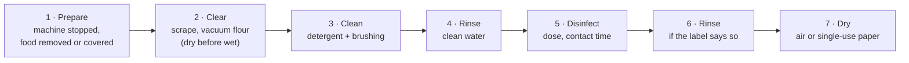

# 17.4 · Cleaning, Disinfection and Pests

A surface can look clean and still carry millions of microbes; it can also be "disinfected" with a product that never worked because it was poured on flour and dough. This lesson explains the difference between cleaning and disinfecting, how cleaning products work and how to use them without hurting yourself, how a cleaning plan is written, and how a bakery keeps out pests and handles its waste. You write a cleaning plan for your own fournil and run it.

## Why it matters

Lesson [13.6](../module-13/lesson-06.md) covered the equipment side: machines stopped and isolated, flour vacuumed, materials cared for. This lesson adds the hygiene method that lesson promised. The référentiel asks you to classify soils, explain how each type of product acts, the parameters of their efficiency, the precautions and what to do after an accident, the steps of a cleaning plan, and pest control (S4.2.2.3). A real EP1 paper (2019) gave a degreasing disinfectant's label and asked for the four factors of Sinner's circle and the verbs that describe its action. Hygiene of the workstation is also watched in the production test ([The CAP Boulanger Exam](../../references/cap-exam.md)).

## Key terms

| French | Say it | English meaning |
|---|---|---|
| nettoyage | *net-wah-YAHZH* | cleaning: removing visible soil (flour, dough, fat, sugar, egg) so the surface is clean |
| désinfection | *day-zan-fek-SYOHN* | disinfection: killing or removing microbes so the surface is sanitary, for a limited time |
| salissure | *sah-lee-SÜR* | soil: organic (flour, fat, protein, sugar), mineral (scale) or microbial |
| détergent | *day-tair-ZHAHN* | detergent: lifts soil off the surface into the water |
| désinfectant | *day-zan-fek-TAHN* | disinfectant: kills microbes (bactericide, fungicide…) when used at the right dose and contact time |
| détergent-désinfectant | *day-tair-ZHAHN day-zan-fek-TAHN* | combined product that cleans and disinfects in one pass on lightly soiled surfaces |
| détartrant / décapant | *day-tar-TRAHN / day-kah-PAHN* | descaler (acid, removes scale) / stripper (strong alkaline, removes burnt-on fat, e.g. oven glass) |
| cercle de Sinner | *SAIR-kluh duh SEE-nair* | Sinner's circle: temperature, mechanical action, concentration and contact time together decide efficiency |
| plan de nettoyage et de désinfection | *PLAHN duh net-wah-YAHZH ay duh day-zan-fek-SYOHN* | written plan: what, with what, how, how often, who does it, who checks |
| nuisibles | *nwee-ZEE-bluh* | pests: rodents, cockroaches, flies, flour moths, beetles, birds |

## How it works

### Cleaning and disinfecting are two different jobs

- **Cleaning** removes the soil you can see. A **detergent** surrounds fat and protein particles and lifts them into the water. The result is a **clean** surface.
- **Disinfection** kills or removes the microbes left on a clean surface. A **disinfectant** works only on a surface already cleaned: flour, dough and fat shield microbes and use up the product. The result is a **sanitary** surface, for a time only: the CNBPF guide insists the result is temporary.
- A **detergent-disinfectant** does both at once on lightly soiled surfaces; heavy soil still needs scraping and cleaning first.

| Soil | Example | Product family |
|---|---|---|
| Organic: fat, protein, starch, sugar | butter on the sheeter, egg wash, cream, dough | alkaline detergent; hot water helps |
| Burnt-on organic | oven glass, trays | stripper (strong alkaline), with gloves and goggles |
| Mineral | scale in the steam generator, the kettle, around taps | descaler (acid) |
| Microbial | invisible film on boards, handles, seals, drains | disinfectant after cleaning |

### Sinner's circle: four factors that add up

Efficiency depends on four factors working together (CNBPF; EP1 2019):

| Factor | What it does | Mistake |
|---|---|---|
| **Temperature** of the water | warm water dissolves fat and speeds most products | hot water decomposes bleach and makes it useless |
| **Mechanical action** | brushing beats wiping; scraping first | "spray and wipe" on dough residue |
| **Concentration** of the product | the label's dose | too weak: partial result; too strong: waste and residues even after rinsing |
| **Contact time** | the disinfectant needs its stated time (for example 5 minutes at 20 °C) | wiping off after 10 seconds: microbes survive |

If one factor drops, another must rise: less brushing needs more time or a stronger (correctly dosed) product. Products must be suitable for food-contact surfaces and for the material (aluminium and some plastics do not tolerate strong alkalis or acids). The CNBPF guide advises keeping few product references in the bakery to avoid mistakes.

### The protocol, in order

With a detergent-disinfectant, steps 3 to 5 are one pass. Lesson 13.6 covers stopping and isolating machines and why flour is vacuumed, never blown.

### Using chemicals safely

> [!CAUTION]
> **Never mix cleaning products.** Bleach (eau de Javel) releases a toxic gas in contact with acids, such as a descaler or an acid cleaner (INRS FT 157); other mixtures can also react dangerously, which is why the CNBPF guide forbids mixing any products. Never pour one product into a container that held another. Wear the gloves and goggles the label asks for: concentrated bleach and oven strippers cause severe skin burns and eye damage. If a product splashes into an eye or on the skin, rinse with plenty of running water at once, follow the product's safety data sheet and get medical help; if you breathed fumes from a mixture, leave the room, ventilate and call for help.

The CNBPF guide's rules for products: store them away from food, in a closed (ideally locked) cupboard; keep them in their original, labelled container and **never** in a food container (bottle, bucket of cream); follow the dose; wear the protective equipment on the label; wash your hands after use.

### The cleaning and disinfection plan

A bakery writes its plan and posts it. There is no compulsory format; a table works best (CNBPF):

| Zone | Surface or item | Product, dose, water temperature, contact time, rinse | Frequency | Method and equipment | Done by | Checked by |
|---|---|---|---|---|---|---|
| Fournil | work benches | detergent-disinfectant 2 %, warm water, 5 min, rinse | after each use and end of day | scrape, wash, leave 5 min, rinse, dry | baker on the bench | head baker, daily visual |
| Fournil | spiral mixer bowl and hook | as above | end of day | stopped and unplugged; scrape; wash; disinfect; dry | apprentice | head baker |
| Cold room | shelves, seals, door handle, floor, drain | detergent-disinfectant | weekly; handle daily | empty a shelf at a time; products kept cold | baker | manager |
| Shop | display case, tongs, slicer | food-contact disinfectant | daily | as label | sales staff | manager |
| Everywhere | hand-contact points: handles, switches, taps | disinfectant wipe | daily | wipe | closing person | manager |
| Waste | bins | detergent-disinfectant | daily; outdoor bins and waste room weekly | emptied, washed, dried | apprentice | manager |

The plan is checked by **visual checks** before use and by **surface swabs** sent to a laboratory or done in-house, at least when the plan is set up and then regularly (CNBPF). A bad result means reviewing products, doses and methods for that surface.

### Pests

Rodents, cockroaches, flies, flour moths and beetles carry microbes and soil food with droppings, hair and bodies; a bakery's warmth, flour and crumbs attract them. The CNBPF guide's three levels:

- **Keep them out:** doors and windows closed or screened (fly screens cleaned regularly), gaps sealed, drains with traps (siphons) and non-return valves.
- **Starve them:** no food left out, packs closed tightly, flour and seeds in closed containers or sacks on pallets off the floor, crumbs and flour cleaned daily including under equipment.
- **Detect and destroy:** baits and traps for rodents, UV lamps (electric grid or glue board) or pheromone traps for flying insects, placed away from open food, gel baits for crawling insects; products never in contact with food.

The **pest-control plan** lists the baits and devices, a map of where they are, the technical and safety sheets of the products, how often they are checked, and the reports of each visit. A bakery may run it itself or use a contractor; since **1 January 2026** pest-control companies must hold the **Certibiocide** approval, which does not apply to a baker treating their own premises (CNBPF guide, checked 2026-10-09).

### Bins and waste

Bins in production have a **non-manual (pedal) lid**, a strong bag, and are emptied at least once a day after production and before cleaning; street bins never enter production or storage; the waste room and outdoor bins are cleaned and disinfected at least weekly; cartons are removed before raw materials go into storage. Sorting and reducing waste (biowaste, packaging, unsold bread) is the subject of [Module 18](../module-18/lesson-02.md) (Environmental Responsibility).

## Worked example

The bench detergent-disinfectant in the fournil reads: "Dosage 2 % (20 mL per litre). Bactericidal (NF EN 1276) and fungicidal in 5 minutes at 20 °C. Rinse with drinking water on food-contact surfaces." The apprentice must prepare a 5 L bucket for the end-of-day clean and wants to "save time" with hot water and a quick wipe.

1. **Dose.** 2 % of 5 L = 5,000 mL × 0.02 = **100 mL** of product, topped up to 5 L with water (20 mL per litre × 5 = 100 mL). He was about to pour "a good glug", about 300 mL: 6 %, three times the dose, leaving residues.
2. **Temperature.** Warm water (about 40 °C) helps on fat for this product; the label's efficacy is given at 20 °C, so warm is fine. Had the product been bleach, hot water would have destroyed it.
3. **Order.** Scrape dough and vacuum flour first (dry before wet), then apply.
4. **Time.** Leave it **5 minutes** wet on the surface: that is the contact time behind "bactericidal". A wipe after 20 seconds cleans but does not disinfect.
5. **Rinse and dry.** Rinse with drinking water (the label requires it for food-contact surfaces), then dry with single-use paper or let it air-dry.
6. **Record.** Tick the line of the plan: bench, product, done by, time.

## Practice

You write a cleaning and disinfection plan for your home fournil and run it once, timed.

> [!WARNING]
> Read every product label before you start. Wear rubber gloves for bleach and any oven cleaner, and goggles if the label asks. Never mix products, never use bleach with hot water or with a descaler, and open a window. Keep products in their own containers, out of reach of children. Unplug the mixer before cleaning it.

### You need

- Minimum: your usual dishwashing liquid (detergent), a food-contact surface disinfectant or household bleach diluted exactly as its label says for food surfaces, a plastic scraper, a brush, a vacuum cleaner or damp cloth for flour, single-use paper towels, rubber gloves, a measuring jug, a timer, a notebook.
- Professional equivalent: a detergent-disinfectant approved for food-contact surfaces with a dosing pump, colour-coded cloths, a posted plan with tick boxes, periodic surface swabs.

### Ingredients

| Supply | Quantity | Use |
|---|---|---|
| Dishwashing liquid | a few mL in warm water | cleaning tools, bowls, bench |
| Surface disinfectant or bleach | exactly the label's dose for food surfaces | disinfecting the bench and handles after cleaning |
| Drinking water | as needed | rinsing |

### In Israel

Checked 2026-10-09.

- **Products:** household bleach is sold as *economica* (אקונומיקה); dishwashing liquid is *nozel kelim* (נוזל כלים); descalers (*mesir avanit*, מסיר אבנית) are acids. Never use economica together with a descaler or an acid toilet cleaner. Read the dilution on the Hebrew label for food surfaces and use cold water.
- **Pests in a warm climate:** cockroaches and ants are active most of the year. Keep flour, sugar and seeds in closed containers, wipe up crumbs and flour the same day, and do not leave dough scraps or the bin open overnight.
- **Hard water:** limescale builds on taps and in the steam tray (lesson [02.4](../module-02/lesson-04.md)); descale on its own day, rinse well, and never on the same cloth as bleach.

### Steps

1. **List your zones:** fridge and freezer, dry store (cupboard), bench, sink and hand-washing point, tools and bowls, mixer, oven, floor, bin, hand-contact points (fridge handle, taps, switches).
2. **Write the plan** as a table with the seven columns above. For each line choose the product (detergent only, or detergent then disinfectant), the dose, the method, the frequency (after each bake, weekly, monthly) and who does it.
3. **Calculate your doses** from the labels: millilitres of product for the volume of water you will use. Write them on the plan.
4. **Run the after-bake part** with a timer: scrape and vacuum, clean with detergent, rinse, disinfect the bench and handles with the correct dose and contact time, rinse if required, dry.
5. **Check:** wipe the bench with a clean white paper towel: no flour or grease marks. Smell: no strong chemical smell (too much product or not rinsed).
6. **Write a pest-prevention list** of five points for your kitchen (containers, crumbs, bin, gaps, checks).
7. Note the time taken and one improvement.

### Targets

- A plan covering at least 10 items, every line with product, dose in mL, method, frequency and a person.
- Disinfectant left on the bench for its full contact time (timed).
- Doses calculated correctly from the label (check: dose % × water volume).

### How you know it worked

Your bench passes the white-paper test, the plan fits on one page you could post on your fridge, and you can say for every product what it does (clean, disinfect, descale) and what it must never be mixed with. If your plan has "spray and wipe" anywhere for disinfection, the contact time is missing.

### Self-check

- [ ] I can explain the difference between cleaning and disinfecting and why cleaning comes first.
- [ ] I can name the four factors of Sinner's circle and give a mistake for each.
- [ ] I can calculate a dilution from a label.
- [ ] I know never to mix products (bleach + acid gives a toxic gas) and what to do after a splash.
- [ ] I wrote and ran a cleaning plan and a pest-prevention list.

## What goes wrong

| Symptom | Likely cause | Fix now | Prevent next time |
|---|---|---|---|
| Surface swab results bad on a "disinfected" bench | disinfectant used on soiled surface or wiped off too soon | clean, then disinfect with the full contact time | protocol posted: clear, clean, rinse, disinfect, wait, rinse, dry |
| Sharp chlorine smell, coughing while cleaning | bleach mixed with an acid descaler or cleaner | leave, ventilate, get help; do not go back in until clear | one product at a time; products stored apart and labelled |
| Bleach solution "not working" | made with hot water or kept for days | make a fresh solution in cold water | follow the label; date prepared solutions |
| White streaks or sticky film on benches | overdosed product, not rinsed | rinse with clean water | measure the dose; rinse when the label says |
| Droppings or gnawed sacks in the dry store | pests getting in; food accessible | remove damaged goods; clean; call the pest-control provider; report | sacks on pallets, closed containers, gaps sealed, bait stations checked |
| Grey-green mould spots inside a cane banneton (lesson 13.6) | stacked or stored damp; cane is porous | take it out of use; the head baker decides: cane cannot be disinfected like steel, so a banneton whose mould has gone into the cane is replaced | shake out, dry fully on a rack, store dry; check bannetons on the cleaning plan |
| Cleaning product in a cream bucket on the shelf | decanted into a food container | remove and label correctly; check no food was contaminated | never decant into food containers |

## Review

- Cleaning removes soil; disinfection kills microbes on a cleaned surface, for a time only; a detergent-disinfectant does both on light soil.
- Efficiency = temperature + mechanical action + concentration + contact time (Sinner's circle); follow the label's dose and time.
- Never mix products (bleach + acid gives a toxic gas); original labelled containers, stored away from food; gloves and goggles as the label says.
- The cleaning plan says what, with what, how, how often, who does it and who checks; swabs and visual checks verify it.
- Pests: keep out, starve, detect and destroy, with a written plan; bins with pedal lids, emptied daily. Exam: [The CAP Boulanger Exam](../../references/cap-exam.md).
