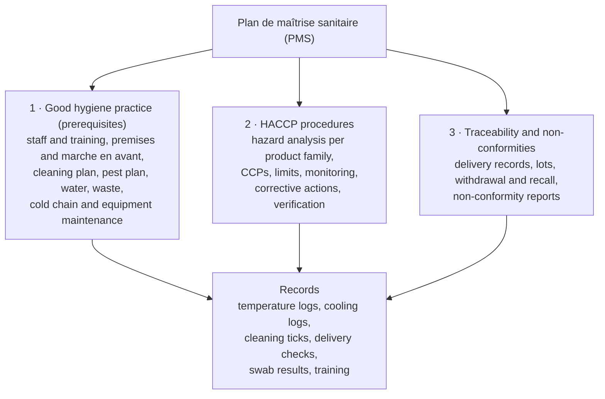

# 17.5 · HACCP, the PMS and the Guide of Good Practice

Every food business in France must be able to show, on paper, how it keeps its food safe. That file is the plan de maîtrise sanitaire (PMS), and its core is the HACCP method: find the hazards, find the few steps where control is essential, watch them and keep records. This lesson explains the rules behind it, the seven HACCP principles applied to bakery products, the honest status of the bakery's guide of good hygiene practice in 2026, and ends with your own hazard analysis of croissant production.

## Why it matters

The référentiel asks you to know the hygiene package, the GBPH and HACCP, and the PMS, the role of each document and the main obligations (S4.2.2.4), and C2.6 is assessed with the PMS and the guide of good practice as given documents. In a bakery you will not write the PMS alone, but you fill in its records every day (temperatures, cooling, cleaning, deliveries) and an inspector may ask you why. Knowing which steps are critical tells you where you cannot cut corners. Exam format: [The CAP Boulanger Exam](../../references/cap-exam.md).

## Key terms

| French | Say it | English meaning |
|---|---|---|
| paquet hygiène | *pah-KEH ee-ZHYEN* | the EU hygiene package: Regulations 178/2002, 852/2004, 853/2004 and the official-control rules |
| PMS (plan de maîtrise sanitaire) | *pay-em-ESS* | food-safety management plan: the bakery's written file of good practices, HACCP procedures, traceability and non-conformity handling |
| HACCP | *ash-ah-say-say-PAY* | Hazard Analysis Critical Control Point: a method to identify, evaluate and control significant hazards |
| danger | *dahn-ZHAY* | hazard: biological, chemical, physical or allergenic agent that can make food unsafe |
| CCP (point critique pour la maîtrise) | *say-say-PAY* | critical control point: a step where control is essential to prevent or reduce a hazard |
| limite critique | *lee-MEET kree-TEEK* | critical limit: the measurable value separating acceptable from unacceptable (e.g. 63 → 10 °C in 2 h) |
| action corrective | *ak-SYOHN kor-ek-TEEV* | what is done when a limit is missed (already in the glossary) |
| BPH / prérequis | *bay-pay-ASH / pray-ray-KEE* | good hygiene practice / prerequisites: the base rules (people, cleaning, pests, cold chain) |
| GBPH | *zhay-bay-pay-ASH* | guide de bonnes pratiques d'hygiène: a sector's voluntary reference guide, validated by the administration |
| DDPP | *day-day-pay-PAY* | Direction départementale de la protection des populations: the local office that inspects food businesses |

## How it works

### The rules: who is responsible, who checks

- **The operator is responsible.** EU law (the hygiene package, applied since 1 January 2006) puts food safety first on the food business operator: the baker who runs the business must identify hazards and put control measures in place (Ministry of Agriculture).
- **Regulation (EC) 852/2004** requires every food business to apply procedures based on the **HACCP principles** (article 5), with records "commensurate with the nature and size" of the business: a small bakery's paperwork can be simple, but it must exist.
- **The PMS** is the bakery's file that shows it. The Ministry of Agriculture describes it as compulsory for every establishment that holds, prepares or distributes food, covering hygiene, cleaning, pest control, temperature control and traceability.
- **Who checks:** the **DDPP** (under the Ministry of Agriculture's DGAL) inspects hygiene and can order corrections or closure; the **DGCCRF** checks labels and product names (Ministry of Agriculture). Before opening, a bakery that makes its own pastries or snacking with eggs and dairy declares its activity to the DDPP; one making essentially bread and viennoiserie may not be concerned, case by case (CNBPF; lesson [17.7](lesson-07.md)).

### What is in a bakery PMS

The CNBPF guide lists the documents an inspector expects and how often they are filled: daily cold-unit temperature readings; the cleaning and disinfection plan; the pest-control plan; the cooling-protocol validation; the equipment and thermometer maintenance plans; delivery checks; date-limit management; the allergen table; staff hygiene instructions and training plan; and an internal audit every three months. Temperature records are kept at least 12 months, microbiological results and non-conformity follow-ups 3 years (CNBPF).

### The seven HACCP principles

Regulation 852/2004, article 5, in bakery language. Before principle 1, the team describes the product and its use and draws the **flow diagram** (diagramme de fabrication) from reception to sale, then checks it on the floor.

| Principle | What it means | Crème pâtissière example |
|---|---|---|
| 1 · Hazard analysis | list the biological, chemical, physical and allergen hazards at each step; keep the significant ones | *Salmonella* in raw yolk; *S. aureus* from hands; growth during cooling; egg and milk allergens |
| 2 · Identify the CCPs | steps where control is essential to prevent, eliminate or reduce a hazard | cooking; cooling |
| 3 · Critical limits | measurable values | cooking above 81 °C for 1 min (CNBPF; the course boils 1 min); core 63 → 10 °C in 2 h or less |
| 4 · Monitoring | how, when and by whom the limit is checked | probe and timer at each batch, written on the cooling log |
| 5 · Corrective actions | what is done when monitoring shows the limit missed | cooling over 2 h → cream discarded, non-conformity report |
| 6 · Verification | checks that the system works | quarterly re-check of the cooling method; lab analysis of a cream product (CNBPF) |
| 7 · Records | documents proportionate to the business | cooling log, non-conformity reports, analysis results |

### CCP or good practice?

Most hazards in a bakery are controlled by good hygiene practice, not by CCPs. A step is a CCP only where control is **essential** and can be **measured and corrected in time**. A key question: will a later step eliminate the hazard? Bacteria on a shaped baguette are destroyed by baking, so shaping is covered by prerequisites (clean hands and benches); a cream after cooling, or a sandwich after assembly, has no later kill step.

The CNBPF guide sets the cooling CCP's validation: the method (blast chiller, freezer, ice bath) is validated on 3 batches to show it is reproducible, re-checked every quarter or whenever the recipe or equipment changes, then written as a protocol. Its example: crème pâtissière 2 cm thick cools in about 40 minutes in a freezer and 20 minutes in a blast freezer; 4 cm thick takes about 1 h 50 and 1 h. Thickness decides.

### The guide of good hygiene practice: the honest 2026 status

A **GBPH** is a reference document, voluntary to apply, written by a professional sector for its own businesses and **validated by the administration** (DGAL, DGCCRF and DGS, sometimes after a scientific opinion from ANSES), then published (Ministry of Agriculture). Following a validated guide is a recognised way to show that the hygiene rules are met, and a guide can provide ready-made hazard analyses for the sector.

For bakery, the situation in October 2026 is unusual, and you should know it:

- The bakery-pâtisserie GBPH **validated in 1997** became obsolete and was **withdrawn from the official list (déréférencé) in 2025** (CNBPF).
- The confederation wrote a new draft; the **administration has not validated it** (CNBPF newsletter, January 2026).
- The Ministry of Agriculture's list of validated French guides (page dated 6 February 2026, checked 2026-10-09) contains **no bakery-pâtisserie guide**. Neighbouring trades do have one (artisanal charcuterie 2016, butchery 1999, ice-cream maker 2000, fast food 2024).
- The CNBPF published **"L'essentiel des bonnes pratiques d'hygiène en boulangerie-pâtisserie"** (2026), a 88-page summary with 20 tool sheets (posters, logs, plans). It is professional guidance, **not** a validated GBPH.

What this means in practice: a bakery's obligations do not change. It still applies the hygiene package and its HACCP-based procedures, and builds its PMS on its own hazard analysis, the regulatory temperatures (arrêté of 21 December 2009) and good practice; the CNBPF's Essentiel is a useful, practical basis for that. Some figures you will meet in it (for example storage times for cream products) come from the withdrawn 1997 guide and are given only as orders of magnitude: each business must set and justify its own. The référentiel, written in 2014, still names the GBPH: in the exam, explain what a GBPH is and what it is for. **Check the status again** on the Ministry of Agriculture's GBPH page if you read this after 2026: a validated bakery guide may appear.

## Worked example

A bakery adds a new product: **pain aux raisins** with crème pâtissière (sheet CP-01, lesson [12.2](../module-12/lesson-02.md)). The head baker asks you to prepare the HACCP lines for the cream part.

1. **Flow diagram:** reception of milk, eggs (or pasteurised yolks), sugar, cream powder → storage (dairy and eggs 0 to +4 °C) → weighing → cooking (boil 1 min) → cooling in a 2-3 cm tray on ice or in the blast chiller → storage 0 to +3 °C, labelled → spreading on the dough → shaping → proof → bake → cool → sale.
2. **Hazards (principle 1):** biological (*Salmonella* in raw yolk; *S. aureus* and others from hands and tools after cooking; multiplication during slow cooling or long storage), allergens (milk, egg, wheat; sulphites from the raisins), physical (eggshell).
3. **CCPs (principle 2):** cooking (destroys *Salmonella*) and cooling (prevents multiplication and toxin). Storage time is controlled by a limit and a label. The bake of the pastry also heats the cream, but the cream is handled between cooling and shaping, so the earlier controls remain essential.
4. **Limits and monitoring (3-4):** cooking: boiling for 1 minute, probe above 81 °C; cooling: core from 63 °C to 10 °C in 2 hours or less, times written; storage: 0 to +3 °C, used within 24 hours (the course rule), label with date and time.
5. **Corrective actions (5):** cooling over 2 h → cream discarded; cold room above +3 °C → products checked, the cream assessed and the fault reported; label missing → cream discarded.
6. **Verification and records (6-7):** cooling method validated on 3 batches and re-checked each quarter; the cooling log signed each day; a quarterly lab analysis of one cream product.

## Practice

You carry out the hazard analysis of the croissant (sheet CR-01, lessons [11.2](../module-11/lesson-02.md)-[11.6](../module-11/lesson-06.md)) on a table, decide the CCPs and compare with the reference.

### You need

- Minimum: the CR-01 sheet and your notes from [Module 11](../module-11/lesson-01.md), paper or a spreadsheet, the decision path above.
- Professional equivalent: the HACCP section of the bakery's PMS, written by the head of the business with the team.

### Ingredients

No ingredients: this is a paper exercise based on CR-01 (T45 flour, water, milk, sugar, salt, fresh yeast, butter, beurrage butter; egg wash).

### In Israel

Checked 2026-10-09.

- **The same method is used in Israel:** the Ministry of Health's food-business specification is written around the same ideas (receiving safe food, preventing contamination, preventing growth, destroying pathogens, with temperatures and records), so your table would make sense to an Israeli inspector too. French rules stay the subject for the CAP.
- **Warm kitchen:** in a 26-32 °C summer kitchen, the proof and any wait at room temperature are longer in the danger zone. For croissants this matters for the egg wash (raw egg kept on the bench) more than for the dough, which is baked.

### Steps

1. Draw the flow diagram of CR-01 from reception to sale: reception → storage → weighing → mixing the détrempe → cold rest → lock-in and tourage → shaping → proof → egg wash → bake → cool → display and sale.
2. For each step, list the hazards: biological (B), chemical (C), physical (P), allergen (A). Mark which are significant.
3. For each significant hazard, write the control measure.
4. Use the decision path to decide CCP or prerequisite. Justify each CCP with a measurable limit.
5. For each CCP, write monitoring, corrective action and the record.
6. Compare with the reference table.

Reference hazard analysis (open after you have written yours)

| Step | Significant hazards | Control measures | CCP? |
|---|---|---|---|
| Reception | B: milk, butter, eggs warm or out of date; P: torn sacks, pests; A: wrong product delivered | delivery check: temperature, date, packaging (lesson [17.7](lesson-07.md)) | no: prerequisite (with records) |
| Storage | B: growth in dairy if cold chain breaks; P/B: pests in flour | butter, milk, eggs 0 to +4 °C; flour on pallets, closed; daily temperature log | no: prerequisite |
| Weighing, mixing | P: foreign bodies (sack string, jewellery); A: seeds or nuts from another batch | sieve or check flour; no jewellery; clean bowl; order of production | no: prerequisite |
| Cold rest, tourage | B: multiplication if dough left warm (low risk: baked later) | dough covered, labelled, in the cold | no: prerequisite |
| Shaping, proof | B: hands, bench (destroyed by baking) | hand washing, clean benches; proof below about 27 °C | no: later step (baking) eliminates |
| Egg wash | B: *Salmonella* in raw egg, cross-contamination of finished products; A: egg | fresh or pasteurised egg, kept cold, discarded after use; brush washed hot; hands washed after shells | no for the croissant itself (baked after); the cross-contamination risk is managed by prerequisites |
| Bake | B: survival only if grossly under-baked | baked to colour and time on the sheet | no: a croissant baked to its normal colour is well above lethal temperatures; the step is monitored as quality |
| Cool, display, sale | B: recontamination by hands, tongs; A: allergen information missing | tongs; display covered; written allergen information (wheat, milk, egg; soy if chocolate is added) | no: prerequisite and labelling |

**Conclusion:** plain croissant production has **no CCP**; it is controlled by good hygiene practice and the bake. That is a normal, correct answer: CCPs belong to products with a sensitive step and no later kill step, such as crème pâtissière (cooking and cooling) or sandwiches (cold chain and time). If you marked "bake" as a CCP, your reasoning is defensible only if you set a measurable limit and monitor it every batch.

### Targets

- A flow diagram with at least 10 steps.
- For every step, hazards classed B, C, P or A, and a control measure.
- CCPs, if any, each with a measurable limit, monitoring, corrective action and record.

### How you know it worked

Your table separates the many prerequisites from the few (or no) CCPs, and you can explain in one sentence why shaping is not a CCP (baking comes after) and why cooling crème pâtissière is (nothing kills the bacteria after it, and the limit can be measured).

### Self-check

- [ ] I can state what the hygiene package, the PMS and a GBPH are and who inspects a bakery.
- [ ] I can list the seven HACCP principles and apply them to one product.
- [ ] I can tell a CCP from a prerequisite with the decision path.
- [ ] I can explain the 2026 status of the bakery GBPH and what bakeries use meanwhile.
- [ ] I completed the croissant hazard analysis and compared it with the reference.

## What goes wrong

| Symptom | Likely cause | Fix now | Prevent next time |
|---|---|---|---|
| PMS binder on the shelf, logs empty for weeks | the plan written once, never used | restart the logs today; note the gap honestly | logs at the workstation, filled at the moment of the check; manager signs weekly |
| Every step marked as a CCP | CCP confused with "important" | redo with the decision path | CCP only where control is essential, measurable and correctable |
| Cooling "validated" once, then a new tray size used | verification forgotten | re-validate on 3 batches | re-check each quarter and after any change of recipe, equipment or container |
| Staff cite the 1997 guide's storage times as law | old figures copied from the withdrawn guide | explain the status; use the bakery's own validated limits | the PMS states its own limits and why |
| Inspector asks for the cooling records and there are none | monitoring not written | record from today; non-conformity noted | one log per CCP, at the bench |

## Review

- The operator is responsible; Regulation 852/2004 requires HACCP-based procedures with records proportionate to the business; the PMS is the bakery's file; the DDPP inspects hygiene and the DGCCRF labels.
- HACCP: hazards, CCPs, critical limits, monitoring, corrective actions, verification, records.
- Most bakery hazards are controlled by good hygiene practice; typical CCPs are cooking and cooling of creams and the cold chain of products eaten without further cooking.
- The 1997 bakery GBPH was withdrawn in 2025 and no new bakery GBPH was validated as of 2026-10-09; the CNBPF's Essentiel (2026) is practical guidance, not a validated guide.
- Exam-relevant (S4.2.2.4 documents and their roles): [The CAP Boulanger Exam](../../references/cap-exam.md).
