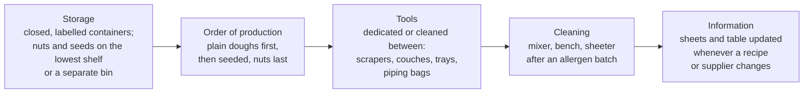

# 17.6 · Allergens and Labelling

For an allergic customer, a few sesame seeds or a smear of hazelnut paste can mean a trip to hospital, and "I think there's no milk in it" is not an answer. This lesson covers the 14 allergens EU law regulates, where they hide in a bakery, how a bakery keeps them out of products that should not contain them, what a label and an unwrapped product must show, and ends with you building the allergen table for six products.

## Why it matters

Allergens are a food-safety hazard of their own (lesson 17.5): cooking does not remove them and no fridge controls them. They are also a legal duty with no exemption for small businesses: even unwrapped bread over the counter must have its allergen information available in writing. Lessons [02.10](../module-02/lesson-10.md), [02.11](../module-02/lesson-11.md) and [10.7](../module-10/lesson-07.md) introduced the list and the seeded-bread case; this lesson develops the method and the cleaning plan those lessons promised. The référentiel asks you to read the mandatory particulars on a label (S4.3.1) and to pass correct product information to sales staff (C4.2); see [The CAP Boulanger Exam](../../references/cap-exam.md).

## Key terms

| French | Say it | English meaning |
|---|---|---|
| allergène | *ah-lair-ZHEN* | substance that triggers an allergic reaction; the EU list has 14 |
| allergie / intolérance | *ah-lair-ZHEE / an-to-lay-RAHNS* | allergy (immune reaction, can be life-threatening) / intolerance (digestive, e.g. lactose) |
| contact croisé | *kohn-TAKT krwah-ZAY* | allergen cross-contact: an allergen reaching a product that should not contain it |
| tableau des allergènes | *tah-BLOH dayz ah-lair-ZHEN* | allergen table: products × 14 allergens, kept for customers |
| denrée préemballée / non préemballée | *dahn-RAY pray-ahm-bah-LAY* | prepacked / unwrapped (sold loose) food |
| liste des ingrédients | *LEEST dayz an-gray-DYAHN* | ingredients in descending order of weight, allergens emphasised |
| « peut contenir des traces de… » | *puh kohn-tuh-NEER day TRASS* | "may contain traces of…": a voluntary precautionary statement |
| fiche technique fournisseur | *FEESH tek-NEEK foor-nee-SUHR* | supplier's technical sheet: composition and allergens of a bought ingredient |
| mention « décongelé » | *mahn-SYOHN day-kohn-zhuh-LAY* | "thawed" statement required when a frozen product is sold thawed |

## How it works

### The 14 allergens and where they hide in a bakery

Regulation (EU) No 1169/2011, Annex II:

| # | Allergen | Where a baker meets it |
|---|---|---|
| 1 | Cereals containing gluten: wheat (including spelt and khorasan/kamut), rye, barley, oats, and their hybrids | every flour, bread, viennoiserie; malt flour (lesson [02.9](../module-02/lesson-09.md)); oat flakes on crusts |
| 2 | Crustaceans | sandwich fillings (prawns) |
| 3 | Eggs | brioche, egg wash, crème pâtissière, quiche |
| 4 | Fish | tuna, salmon fillings |
| 5 | Peanuts | some praline-style fillings and toppings |
| 6 | Soybeans | soy flour in improvers (lesson 02.9), soy lecithin in most chocolate (lesson [12.1](../module-12/lesson-01.md)) |
| 7 | Milk (including lactose) | butter, milk, milk powder, cream, cheese; croissant, pain au lait, pain de mie |
| 8 | Nuts: almond, hazelnut, walnut, cashew, pecan, Brazil, pistachio, macadamia | almond cream, flaked almonds, walnut bread, hazelnut spreads |
| 9 | Celery | sandwich fillings, some sauces and soups |
| 10 | Mustard | sandwiches, sauces |
| 11 | Sesame seeds | seeded breads, buns, crusts (SE-01) |
| 12 | Sulphur dioxide and sulphites above 10 mg/kg (or 10 mg/L) | some dried fruit, raisins (lesson 12.2), wine |
| 13 | Lupin | some special flours and mixes: read the sheet |
| 14 | Molluscs | rarely in a bakery; some fillings |

A few derived products are exempt (for example glucose syrups made from wheat, fully refined soybean oil): always check the supplier's technical sheet rather than guessing.

### Allergens on labels

**Prepacked products** (a sealed bag of six pains au lait, a packed sandwich) carry the EU mandatory particulars (article 9): name, list of ingredients, allergens, quantity of certain ingredients, net quantity, DLC or DDM, storage conditions, operator's name and address, origin where required, instructions where needed, and the nutrition declaration (lesson 02.11 explains the exemptions for small craft producers). **Allergens are emphasised in the list of ingredients**, for example in bold: "farine de **blé**, **beurre**, **œufs**, sucre…". If there is no list, the label says "**contient** : …" followed by the allergen (article 21).

**Unwrapped products** (bread and viennoiserie sold over the counter): allergen information is **mandatory** (article 44), and France requires it **in writing**, available to the customer in the shop (décret n° 2015-447). The usual tool is a written **allergen table**, a grid of products × 14 allergens, posted or kept at the till with a sign telling customers it can be consulted (CNBPF tool sheets 24-25). Staff do not answer from memory: they show the table.

**Other shop statements** you will meet: the legal names (tradition, maison, au levain: lesson [09.1](../module-09/lesson-01.md)); the name and price of each product on display (lesson [15.5](../module-15/lesson-05.md)); and, when a product that was frozen is sold thawed, the mention **"décongelé"** on or right next to it (CNBPF). Use-by and best-before dates (DLC, DDM) are explained in lesson 02.10; storage after opening in lesson 17.8.

### Cross-contact: keeping allergens where they belong

The allergen rules cover the ingredients a product **contains**. Accidental traces from shared equipment are a hygiene matter to control first; a "may contain traces of…" statement is voluntary and should come from a real assessment, not be printed on everything to save effort.

The weak points are always the same: a supplier changes a chocolate or an improver and the new one contains soy or nuts; a recipe gets an extra ingredient and nobody updates the table; a sales assistant guesses.

## Worked example

A customer asks: "My son is allergic to sesame and to nuts. Can he have a pain au chocolat and a pain aux céréales?" The bakery's products and sheets:

1. **Check the table, not memory.** Pain au chocolat: wheat, milk, egg (egg wash), soy (the chocolate sticks' sheet lists soy lecithin). No sesame, no nuts listed. Pain aux céréales: made from a multigrain premix whose sheet lists wheat, rye, **sesame**, sunflower, flax, and "may contain nuts".
2. **Answer the product question.** Pain aux céréales: no, it contains sesame. Pain au chocolat: sesame and nuts are not ingredients.
3. **Answer the cross-contact question honestly.** The chocolate sheet says "may contain traces of hazelnut" (the supplier processes nuts on the same line), and the seeded doughs are shaped on the same bench after the plain doughs. The honest answer: "Sesame and nuts are not ingredients of the pain au chocolat, but its chocolate supplier warns of possible hazelnut traces, and we use sesame in the bakery. For a severe allergy we cannot guarantee it is free of traces."
4. **What the bakery fixes.** The allergen table gets a column note for "possible traces" from supplier sheets; seeded doughs are kept to the end of production with a cleaning step after; the sales staff are briefed: always show the table, never guess ([Module 19](../module-19/lesson-03.md) covers the customer conversation).

## Practice

You build the written allergen table for six products and check a prepacked label.

### You need

- Minimum: your technical sheets for six products you have made in this course, the labels (or photos) of every bought ingredient you used (flour, chocolate, raisins, butter, any premix or improver), paper or a spreadsheet, a pen of a second colour.
- Professional equivalent: the CNBPF allergen-presence table (tool sheet 25) and the supplier technical sheets filed by product.

### Ingredients

No baking needed. Use six of these course products, or your own versions: TR-01 tradition baguette (lesson [09.2](../module-09/lesson-02.md)), SE-01 seeded loaf (10.7), CR-01 croissant (lesson [11.2](../module-11/lesson-02.md)), pain au chocolat (12.1), pain aux raisins (12.2), brioche (lesson [12.3](../module-12/lesson-03.md)), and a jambon-beurre sandwich (02.10).

### In Israel

Checked 2026-10-09.

- **Reading Israeli labels:** look for the allergen line (*alergenim*, אלרגנים), the word *mekhil* (מכיל, "contains") and *alul lehakhil* (עלול להכיל, "may contain"). Common words: wheat *khita* (חיטה), gluten *gluten* (גלוטן), milk *khalav* (חלב), eggs *beitsim* (ביצים), sesame *shumshum* (שומשום), nuts *egozim* (אגוזים), peanuts *botnim* (בוטנים), soy *soya* (סויה).
- **Changing rules:** the Ministry of Health announced that from **January 2028** allergens must be emphasised inside the ingredient list, EU-style, for the same 14 groups; during the transition you may see old and new labels side by side, and "may contain" stays as before (Maariv, October 2025). Israel also requires a warning for fava beans (*pul*, פול) because of G6PD deficiency, which is not an EU allergen.
- **Tahini and halva** are sesame; many Israeli breads and pastries carry sesame on top, so sesame cross-contact is common in shared kitchens.

### Steps

1. Draw the table: six products down the side, the 14 allergens across the top, plus a column "possible traces (supplier warnings)". You can start from the [allergen table](../../templates/allergen-table.md) template.
2. For each product, go through every ingredient of the sheet and tick the allergens it contains. Do not forget the egg wash, the chocolate, the raisins, any improver, malt or premix, and the butter.
3. For each bought ingredient, read its label: copy any allergen in bold and any "may contain" statement into the traces column.
4. With the second colour, mark the cross-contact risks in **your** kitchen (for example: sesame on the bench before the croissants).
5. Write the order of production you would use for these six products on one morning, and the cleaning step after the allergen batch.
6. Take one prepacked bakery product from a shop (sliced bread, brioche) and check its label against article 9: list which mandatory particulars you find and how the allergens are emphasised.
7. Compare your table with the reference.

Reference allergen table (course formulas; your bought ingredients may differ)

| Product | Gluten cereals | Eggs | Milk | Soy | Sesame | Sulphites | Mustard | Notes |
|---|---|---|---|---|---|---|---|---|
| TR-01 tradition | wheat | | | | | | | additive-free by law; check the flour sheet for traces |
| SE-01 seeded loaf | wheat | | | | ✓ | | | sunflower and flax are not in the 14; sesame is |
| CR-01 croissant | wheat | ✓ (egg wash) | ✓ (milk, butter) | | | | | |
| Pain au chocolat | wheat | ✓ | ✓ | usually ✓ (lecithin) | | | | check the chocolate sheet for nut traces |
| Pain aux raisins | wheat | ✓ (cream, egg wash) | ✓ | | | if the raisins list them | | crème pâtissière: milk, egg |
| Brioche | wheat | ✓ | ✓ | | | | | |
| Jambon-beurre | wheat | | ✓ (butter) | | | | if added | check the ham for celery or mustard in its recipe |

A good order of production for one bench: tradition and plain doughs first, then the croissant family, then the brioche, then the seeded loaf last, followed by cleaning of the mixer, bench, scrapers and couches.

### Targets

- A table with every product × 14 allergens filled, no blank cells (tick or empty, never "?").
- Every bought ingredient checked against its own label, traces copied.
- A production order with the allergen batch last and a written cleaning step.

### How you know it worked

Your table matches the reference for the course formulas and adds what your own labels show (often soy in chocolate, sulphites in raisins, sesame or nut traces in premixes). If you can answer "does this contain milk?" for each product by pointing at the table in five seconds, it works.

### Self-check

- [ ] I can list the 14 allergens and name a bakery source of each.
- [ ] I know what a prepacked label must show and how allergens are emphasised.
- [ ] I know that unwrapped bakery products need written allergen information in France.
- [ ] I can plan production and cleaning to limit cross-contact.
- [ ] I built a six-product allergen table from real sheets and labels.

## What goes wrong

| Symptom | Likely cause | Fix now | Prevent next time |
|---|---|---|---|
| Customer told "no nuts" and reacts to hazelnut traces | staff answered from memory; supplier warning ignored | first aid / emergency services; inform the manager; record | always show the table; traces column filled from supplier sheets |
| New chocolate contains soy, table not updated | supplier change not checked | update the table today; inform staff | every new or changed product's sheet checked before use |
| Sesame found in plain rolls | seeded dough shaped before the rolls; scraper shared | withdraw or relabel; inform the manager | seeded batches last; dedicated or cleaned tools; couches for seeded products only |
| Sulphites not declared on pains aux raisins | raisin label not read | add to the table | read every ingredient label, including dried fruit |
| No written allergen information in the shop | belief that loose bread is exempt | make the table today | décret 2015-447: written information for unwrapped products |
| Thawed viennoiserie sold without "décongelé" | rule unknown | add the mention next to the products | shop checklist (CNBPF tool sheet) |

## Review

- 14 allergens (Annex II); in a bakery mainly gluten cereals, milk, eggs, soy, sesame, nuts, sulphites, plus mustard, fish and others in sandwiches.
- Prepacked: allergens emphasised in the ingredient list, "contient" if there is none. Unwrapped: written allergen information available in the shop (décret 2015-447).
- Cross-contact is controlled by storage, order of production, tools and cleaning; "may contain" is voluntary and must be justified.
- Tables are updated whenever a recipe or a supplier changes; staff show the table and never guess.
- Exam-relevant (S4.3.1 label mentions, C4.2 product information): [The CAP Boulanger Exam](../../references/cap-exam.md).
