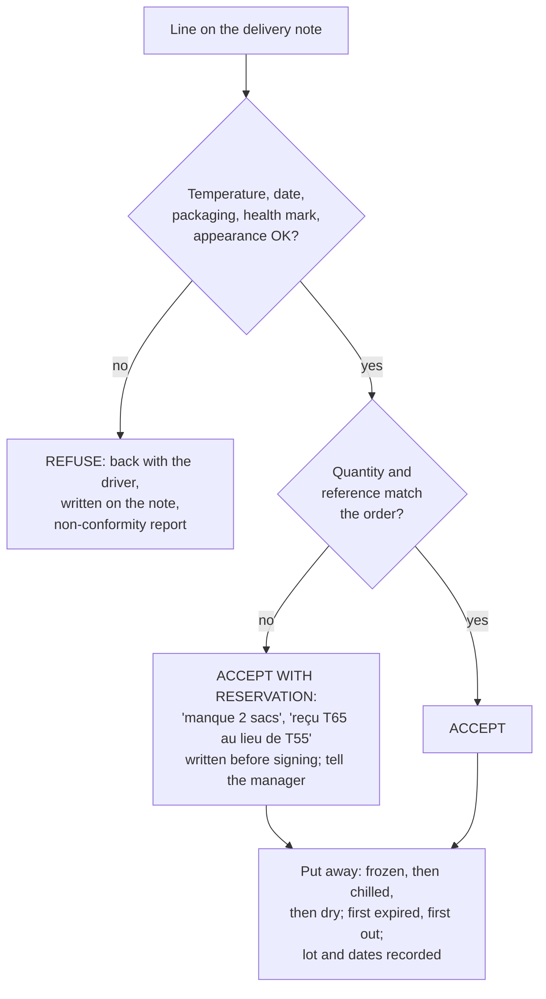

# 17.7 · Receiving a Delivery

The cold chain, the dates and the traceability of everything a bakery sells start at the back door, in the five minutes when a driver waits for a signature. This lesson explains what to check on a delivery and with what tolerance, how to decide between accepting, accepting with a reservation and refusing, how to put goods away, and how records let a bakery react to a recall. You finish by deciding on four realistic delivery notes.

## Why it matters

Once you sign the delivery note without remark, the goods are yours: a warm tub of cream or a torn sack accepted is a problem you bought. Receiving and storing a delivery (C2.1), checking its quantity and quality (C3.1) and reporting its non-conformities (C4.1) are three competencies of block 1, assessed in the written test with real documents (delivery notes, traceability sheets); see [The CAP Boulanger Exam](../../references/cap-exam.md). The [delivery check](../../templates/delivery-check.md) and [non-conformity report](../../templates/non-conformity-report.md) templates are the two documents you use here.

## Key terms

| French | Say it | English meaning |
|---|---|---|
| réception des marchandises | *ray-sep-SYOHN day mar-shahn-DEEZ* | receiving goods: checking, accepting and putting away a delivery |
| bon de commande | *BOHN duh ko-MAHND* | purchase order: what the bakery asked for |
| bon de livraison (BL) | *BOHN duh lee-vray-ZOHN* | delivery note: what the supplier says it delivered; signed on receipt |
| facture | *fak-TÜR* | invoice: what the bakery must pay |
| réserves | *ray-ZAIRV* | written reservations on the delivery note (e.g. "1 carton écrasé") before signing |
| refus | *ruh-FÜ* | refusal: the line goes back with the driver |
| estampille sanitaire | *es-tahm-PEE-yuh sah-nee-TAIR* | health mark: the oval mark with the approval number on products of animal origin |
| numéro de lot | *nü-may-ROH duh LOH* | batch number (already in the glossary); recorded for traceability |
| retrait / rappel | *ruh-TREH / rah-PEL* | withdrawal (product taken off sale) / recall (customers asked to return it) |
| cahier des charges | *kah-YAY day SHARZH* | specification agreed with a supplier (e.g. minimum shelf life left at delivery) |

## How it works

### The documents

The **order** (bon de commande) says what you asked for; the **delivery note** (bon de livraison) says what the supplier says it brought; the **invoice** (facture) says what you will pay. At reception you compare the goods with both the order and the delivery note, line by line: **reference, quantity, and later the price** (S5.4.2). Anything wrong is written **on the delivery note before you sign**, so the supplier cannot dispute it later.

### What to check, in this order

Perishables first, so the cold chain is not broken while you count sacks (CNBPF):

| Check | How | Accept | Act |
|---|---|---|---|
| **Temperature** of chilled and frozen goods | probe between two packs without piercing them, or infrared thermometer on the surface; probe the core only if the surface is out | at or below the target, within the tolerance below | above the limit: refuse |
| **Dates** | read DLC or DDM; compare with your minimum shelf life | date not passed; enough life left for your use | passed: refuse; too short: refuse or reservation as agreed |
| **Packaging** | look and feel | intact, dry, sealed | dented, swollen or rusty cans; torn or damp sacks; punctured or swollen vacuum packs; soft or wet frozen packs; pest droppings: refuse |
| **Health mark** | on products of animal origin (cream, butter, eggs, ham) | oval mark with approval number present | missing: refuse and report |
| **Appearance** | colour, smell, texture | normal | abnormal: refuse |
| **Quantity and reference** | count, weigh, compare with order and note | matches | missing or wrong: reservation on the note |
| **Vehicle and driver** | clean vehicle, refrigerated where needed | clean, cold | note it and report |

### Temperature targets and tolerances

The CNBPF guide accepts a tolerance of **+3 °C** on the surface temperature at reception, provided suppliers and carriers have a HACCP-based system:

| Goods | Target | Critical limit at reception | Examples |
|---|---|---|---|
| Very perishable | 0 to +4 °C | **+7 °C** | cream, milk, egg products, ham, soft cheese |
| Perishable | up to +8 °C | **+11 °C** | butter and some cheeses, as labelled |
| Ambient-stable | room temperature | no limit | flour, sugar, UHT milk, cans |
| Frozen | −18 °C | **−15 °C** | frozen raw viennoiserie, fruit purées |

The manufacturer's label always applies when it is stricter. Above the critical limit the line is refused.

### Decide, record, put away

- **Refuse** what is unsafe (temperature, date, packaging, health mark, appearance). The driver takes it back; you write the reason and the measurement on the note.
- **Accept with a reservation** what is safe but wrong in quantity or reference, or slightly damaged outer packaging with intact contents; write it precisely before signing.
- **Report** every refusal or reservation to the manager the same day with a [non-conformity report](../../templates/non-conformity-report.md): facts and measurements, action taken, suggestion (C4.1).
- **Put away fast:** frozen goods first, then chilled, then dry goods; cartons removed before goods enter storage where possible; new stock behind older stock (lesson 17.8).

### Traceability and recalls

EU law requires every food business to know **one step back** (who supplied each food) and **one step forward** (which businesses it supplied), and to give this information to the authorities on request (Regulation 178/2002, article 18). For sales to the final consumer in the shop, no customer record is needed; for sales to other professionals (a restaurant, a school), the bakery records the customer, the product and the date, and preferably the lot (CNBPF).

In practice a bakery keeps:

- the **delivery notes**, with the reception checks written on them or on the delivery-check sheet;
- for products of animal origin, the **health-mark number and the DLC or lot**: many bakeries keep the labels in a dated bag per week, or photograph them at reception;
- for its own semi-finished and finished products, the **date of production** (labels on creams and doughs, lesson [11.3](../module-11/lesson-03.md) for the butter lot on the production sheet).

How long to keep them (CNBPF): perishables with a DLC under 3 months: **6 months**; products with a DDM: the DDM **plus 6 months**; products with no date: **5 years**.

**When an alert arrives** from a supplier, the authorities or the official recall site RappelConso (rappel.conso.gouv.fr): check the records to see whether the lot was received; set aside and destroy the products made from it; and if they were sold, inform customers clearly with a recall notice in the shop (product, lot, dates of sale, hazard, what to do) (CNBPF).

### Before opening: declaration to the DDPP

A business selling foods of animal origin to consumers declares each establishment and activity to the DDPP **before starting**, and again when the operator, the address or the activity changes (Service-Public). Selling such products to other professionals needs a health **approval** (agrément) instead, or a derogation for small quantities. The CNBPF notes that a bakery making essentially bread and viennoiserie and reselling its pastries may not be concerned by the declaration, while one making its own pastries and snacking is; it is decided case by case with the DDPP.

## Worked example

Wednesday 6:15. A dairy supplier delivers to Boulangerie des Halles. The order: 10 L UHT cream, 20 kg butter for tourage (84 % fat), 6 L pasteurised liquid egg, 4 kg frozen raspberry purée.

| Line on the note | Checks | Decision |
|---|---|---|
| Crème UHT 35 %, 10 × 1 L | ambient-stable until opened; date 14/01; cartons intact | **accept** |
| Beurre de tourage 84 %, 10 × 2 kg | surface 6 °C (perishable, label "à conserver entre +2 et +8 °C"); date fine; health mark present; one carton crushed, plates inside intact | **accept with reservation**: "1 carton écrasé, contenu intact" |
| Œuf entier liquide pasteurisé, 6 × 1 L | surface 9 °C, core between two packs 8.5 °C; label "+4 °C max" | very perishable: limit +7 °C exceeded → **refuse**: "Ovoproduit à 8,5 °C (limite +7 °C), refusé" |
| Purée framboise surgelée, 4 × 1 kg | 1 kg delivered instead of 4; −19 °C | **accept with reservation**: "3 × 1 kg manquants" |

1. **Order of checks:** egg and butter probed first, frozen purée checked at once and put away first.
2. **Write before signing:** the three remarks go on the delivery note; the driver countersigns; the eggs go back.
3. **Put away:** purée to the freezer (log: −19 °C), butter to the cold room behind the older butter, cream to the dry store.
4. **Records:** butter lot and health-mark number photographed; delivery-check sheet filled in.
5. **Report:** non-conformity report to the manager: "Ovoproduit livré à 8,5 °C à cœur entre deux briques, refusé; 3 kg de purée manquants; 1 carton beurre écrasé. Fournisseur informé à 6:30. Proposition: recommander les œufs pour demain, vérifier le camion frigorifique."
6. **Consequence:** without eggs, the brioche planned for tomorrow is moved; the manager decides (C4.1 is reporting, not deciding alone).

## Practice

You decide on four delivery notes, fill the delivery-check template for one, and write one non-conformity report.

### You need

- Minimum: the four notes below, the [delivery check](../../templates/delivery-check.md) and [non-conformity report](../../templates/non-conformity-report.md) templates, a pen. Optional: your next real grocery shopping as a live exercise (probe your chilled items when you get home and read every date).
- Professional equivalent: the bakery's reception sheet, a calibrated probe or infrared thermometer, the cahier des charges with each supplier.

### Ingredients

No ingredients: a document exercise.

### In Israel

Checked 2026-10-09.

- **Israeli reception temperatures:** the Ministry of Health's specification for food businesses asks for meat, poultry, fish and dairy at **0-5 °C**, frozen products at **−18 °C or colder** and ready-to-eat cold food at 0-5 °C. Eggs are received at **7-20 °C**, which is why Israeli shops often sell eggs unrefrigerated; at home keep them in the fridge on a middle shelf. Documents showing the source of the food are kept at least 3 months.
- **Your shopping as a delivery:** buy chilled and frozen goods last, carry them home in a cool bag in summer, and put them away first. Probe a yoghurt or cream between two packs when you get home: in a 32 °C car it can pass 10 °C in under an hour.
- **Words:** delivery note *te'udat mishloach* (תעודת משלוח); invoice *cheshbonit* (חשבונית); expiry date or validity *tokef* (תוקף); keep refrigerated: look for *bekirur* (בקירור) on the label.

### Steps

1. Read each delivery note and decide for **each line**: accept, accept with reservation (write the exact words), or refuse (write the reason with the measurement).
2. For each refusal or reservation, say who you inform and when.
3. Fill the [delivery check](../../templates/delivery-check.md) for note C.
4. Write a [non-conformity report](../../templates/non-conformity-report.md) for the worst problem you found.
5. Compare with the answers.

**Note A — Moulins de la Vallée, 7:00.** Ordered 20 sacks T65 tradition 25 kg, 10 sacks T55 25 kg. Delivered: 20 sacks T65; 10 sacks **T45**. Two T65 sacks damp at the bottom, one with small holes and dust trails along the seam. DDM all 6 months ahead.

**Note B — Laiterie du Centre, 6:40.** Crème fraîche 35 %, 6 × 1 L: surface 5 °C, DLC in 9 days. Lait entier pasteurisé 12 × 1 L: surface 6 °C, DLC tomorrow (your cahier des charges asks for at least 5 days). Beurre doux 82 %, 20 × 250 g: 7 °C, health mark present.

**Note C — Surgelés Pro, 13:30.** Croissants crus surgelés 2 cartons × 150: −17 °C. Pains au chocolat crus surgelés 1 carton × 120: −13 °C at the surface, −12 °C at the core between two bags, ice crystals inside the bag, carton soft at one corner.

**Note D — Épicerie fine, 9:10.** Raisins secs 5 kg: label lists "anhydride sulfureux"; Pépites de chocolat 2 × 1 kg: one bag with a small tear, chips loose in the carton; Huile d'olive 6 × 1 L; Thon au naturel 12 cans: one can swollen at the lid.

Answers (open after deciding)

**A.** T65: accept the intact sacks; the **damp** sacks and the sack with **holes and dust trails** (possible pests) are **refused** (packaging not intact, risk of mould and infestation); write "2 sacs humides et 1 sac percé (traces de nuisibles possibles) refusés". T45 instead of T55: safe but wrong reference: **accept with reservation** "10 sacs T45 livrés au lieu de T55" or refuse if the manager prefers; tell the manager at once because the formulas use T55. Check the dry store for pests near where earlier sacks stood.

**B.** Cream: accept (very perishable, target 0/+4, limit +7 °C; 5 °C within tolerance). Milk: safe temperature but DLC tomorrow against 5 days in your specification: **refuse** or accept with reservation only if the manager agrees and you can use it today; write it. Butter at 7 °C: perishable (up to +8 °C), accept.

**C.** Croissants at −17 °C: within the −15 °C limit, **accept**. Pains au chocolat at −12 °C core with ice crystals and a soft carton: above the −15 °C critical limit and signs of partial thawing: **refuse** ("PAC surgelés à −12 °C à cœur, cristaux, carton ramolli: refusés"); report. Put the croissants in the freezer at once.

**D.** Raisins: accept; add sulphites to the allergen table (lesson 17.6). Chocolate chips: the torn bag is refused or set aside (contamination, possible foreign bodies); the intact bag accepted; reservation written. Olive oil: accept. Tuna: the **swollen can is refused** (possible *Clostridium botulinum*, never opened or tasted); the others accepted after checking for dents and rust.

The worst problem: note C (frozen chain broken) or note A (possible pests). A good non-conformity report gives the measurement, the action (refused, supplier informed at a given time) and a suggestion (check the supplier's truck; inspect the dry store).

### Targets

- A decision for every line of the four notes, with the exact wording of each reservation or refusal.
- One delivery check and one non-conformity report filled in completely.
- No unsafe line accepted (temperature over the limit, damaged packaging, swollen can, possible pests).

### How you know it worked

Your decisions match the answers on every safety point; on the quantity and reference points (T45 for T55, milk with a short date) a different decision is acceptable if you wrote it on the note and told the manager. Your non-conformity report could be read by someone who was not there and still be understood.

### Self-check

- [ ] I check perishables first and know the targets and critical limits (+7 °C, +11 °C, −15 °C).
- [ ] I know what packaging faults mean an automatic refusal.
- [ ] I write reservations on the delivery note before signing.
- [ ] I know what records traceability needs and how long they are kept.
- [ ] I know the steps when a recall concerns a lot I received.

## What goes wrong

| Symptom | Likely cause | Fix now | Prevent next time |
|---|---|---|---|
| Missing sacks discovered after the driver left | note signed without counting | tell the manager; contact the supplier; no proof without a reservation | count and check before signing; write reservations |
| Cream found warm in the cold room an hour after delivery | dry goods put away first | probe; if over the limit, discard and report | frozen and chilled first, within minutes |
| Recall on a butter lot; nobody knows if it was received | labels and lots not kept | check invoices and supplier; ask the supplier | photograph or keep labels of animal-origin products; file weekly |
| Moth larvae in the flour store | infested sack accepted; no inspection | isolate and remove affected sacks; clean; call pest control | refuse damaged sacks; check sacks at reception; pallets off the floor |
| Driver insists "sign now, sort it later" | pressure | do not sign without remarks | reception procedure known by every staff member; manager supports refusals |

## Review

- Compare the goods with the order and the delivery note; check temperature, dates, packaging, health mark, appearance and quantity, perishables first.
- Critical limits at reception (CNBPF): very perishable +7 °C, perishable +11 °C, frozen −15 °C; above them, refuse.
- Unsafe → refuse; safe but wrong → reservation written before signing; report every non-conformity to the manager with facts.
- Traceability: one step back, one step forward; keep notes, lots and health marks (6 months, DDM + 6 months, or 5 years); act at once on a recall.
- Exam-relevant (C2.1, C3.1, C4.1 with delivery documents): [The CAP Boulanger Exam](../../references/cap-exam.md).
