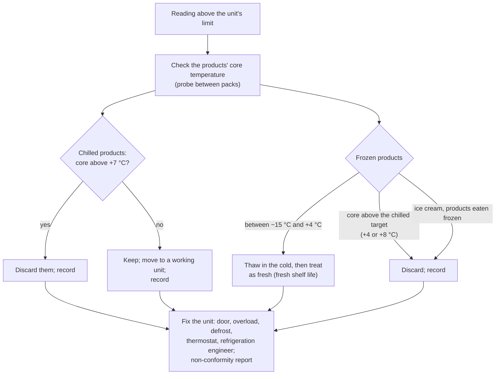

# 17.8 · Storage, Stock Rotation and the Cold Chain

A delivery accepted at the right temperature can still become dangerous in a badly organised cold room: warm because it is overloaded, cooked products under raw ones, an opened ham with no date at the back of a shelf. This lesson covers where each product is stored and at what temperature, how stock rotates, how the cold chain is monitored and what to do when a log shows a break. You reorganise your own fridge and dry store and keep a week of temperature records.

## Why it matters

Organising the storage of received goods (C1.1) and receiving and storing a delivery (C2.1) are block 1 competencies; the référentiel asks you to justify the cold chain, **spot a break on temperature records**, find its cause and propose corrective and preventive actions (S4.2.2.4), and to fill stock documents and explain first in, first out (S5.4.3). Storage mistakes also cost money: products out of date, flour with weevils, a freezer that failed overnight. Exam format: [The CAP Boulanger Exam](../../references/cap-exam.md).

## Key terms

| French | Say it | English meaning |
|---|---|---|
| réserve sèche | *ray-ZAIRV SESH* | dry store: flour, sugar, seeds, cans, packaging |
| chambre froide positive / négative | *SHAHM-bruh FRWAHD po-zee-TEEV / nay-gah-TEEV* | cold room above 0 °C / freezer room below 0 °C |
| conservateur | *kohn-sair-vah-TUHR* | storage freezer at about −18 °C |
| PEPS (premier entré, premier sorti) | *PEPS* | FIFO: first in, first out |
| premier périmé, premier sorti | *pruh-MYAY pay-ree-MAY pruh-MYAY sor-TEE* | first expired, first out (FEFO): the CNBPF says "premier périssable, premier utilisé" |
| fiche de stock | *FEESH duh STOK* | stock sheet: entries, exits, balance of one product |
| bon d'entrée / bon de sortie | *BOHN dahn-TRAY / BOHN duh sor-TEE* | goods-in note / goods-out (requisition) note |
| rupture de la chaîne du froid | *rüp-TÜR duh lah SHEN dü FRWAH* | break in the cold chain: a product warmer than its limit for a time |
| DLC secondaire | *day-el-SAY suh-gohn-DAIR* | the new, shorter use-by written on a product once opened or prepared |
| relevé de température | *ruh-luh-VAY duh tahm-pay-rah-TÜR* | temperature reading, written in the log (already in the glossary) |

## How it works

### Three storage zones

| Zone | Temperature | What goes there | Rules |
|---|---|---|---|
| **Dry store** | cool, dry, ventilated room temperature | flour sacks, sugar, salt, seeds, chocolate, cans, UHT products, packaging | sacks on pallets or plastic duckboards, never on the floor, away from walls; packs closed; seeds and nuts in closed, labelled containers; cleaning products in a separate closed cupboard |
| **Chilled (positive cold)** | very perishable 0 to +4 °C; perishable up to +8 °C; creams and prepared preparations 0 to +3 °C | dairy, eggs, egg products, creams, fillings, retarded dough, opened products | covered or filmed; labelled with product and date; finished and cooked products above raw ones; nothing on the floor; not overloaded, so air circulates |
| **Frozen (negative cold)** | −18 °C | frozen raw viennoiserie, purées, butter reserves | wrapped, labelled with product, freezing date and use-by; original DLC/DDM crossed out and the freezing date written (CNBPF) |

The regulatory maximum temperatures for retail (arrêté of 21 December 2009, annex I), already met in lesson [02.10](../module-02/lesson-10.md):

| Product | Maximum |
|---|---|
| Minced meat | +2 °C |
| Prepared dishes made in advance (préparations culinaires élaborées à l'avance) | +3 °C |
| Meat preparations, poultry, egg products (except UHT) | +4 °C |
| Other very perishable foods | manufacturer's temperature, +4 °C at retail |
| Other perishable foods | manufacturer's temperature, +8 °C at retail |
| Ice cream | −18 °C |
| Other frozen foods | −12 °C at retail (bakeries and this course store at −18 °C) |
| Hot holding | at least +63 °C |

The manufacturer's label applies when it is stricter. The course's working values, used since Module 2: **fillings and creams 0 to +3 °C, fridge at +4 °C or below, freezer at −18 °C**; crème pâtissière used within **24 hours** (lesson [12.2](../module-12/lesson-02.md)).

### Rotation: first expired, first out

New stock goes **behind or under** older stock, so the oldest is used first (PEPS / FIFO). For perishables the rule is sharper: the product that **expires first** is used first, whatever its arrival date (the CNBPF's "premier périssable, premier utilisé"). Dates are checked regularly and expired products removed. On the paper side, a **stock sheet** per product records entries (from the delivery notes), exits (from the bon de sortie or production sheets) and the balance, and valuing stock "first in, first out" means the oldest purchase price is used first (S5.4.3).

### Opened products and things the bakery makes

- **Opened product with a DLC:** its life is shortened. The CNBPF guide sets **3 days** after opening unless the supplier states otherwise; write the opening date and the new use-by (DLC secondaire) on the pack.
- **Semi-finished products** (leftover crème pâtissière, doughs, fillings): label with product and date of making, or use a colour code for the day (CNBPF).
- **Cooling** cooked preparations: core from +63 °C to +10 °C in 2 hours or less, then 0 to +3 °C (annex IV).
- **Thawing:** in a cold unit at 0 to +4 °C (or a microwave for immediate use), never on the bench; once thawed, use quickly; **never refreeze** a thawed product unless it has since been cooked (annex VI; CNBPF). A frozen product sold thawed carries the mention "décongelé" (lesson 17.6).
- **Display cabinets** keep products cold; they do not cool them. Only already-chilled products go in, and the coldest zone holds the most sensitive products (CNBPF).

### Monitoring the cold chain

The cold chain is "the constant keeping of chilled or frozen food at its regulatory or labelled temperature" from production to consumption (CNBPF). A bakery proves it with records:

- every cold unit read **daily**, ideally before work starts, and written on a log; or a **continuous recorder** with alarms, which is compulsory for freezer rooms over 10 m² (CNBPF);
- records kept **at least 12 months**;
- **thermometers checked**: in melting ice the reading should be within −0.5 to +0.5 °C, in boiling water 99 to 101 °C (CNBPF; a home probe within ±1 °C, lesson [13.6](../module-13/lesson-06.md), is fine for practice); a unit's display compared regularly with a thermometer placed beside its sensor.

### When a log shows a break

These actions are the CNBPF's for chilled products whose core passes **+7 °C** and for frozen products whose core rises above **−15 °C**. Typical causes: door left open or badly closed, seal damaged, unit overloaded or warm products put in, defrost cycle, power cut, condenser clogged with flour dust (lesson [13.3](../module-13/lesson-03.md)).

## Worked example

The cold-room log of a bakery for one week (cold room for creams, dairy and fillings, limit +3 °C for creams, +4 °C for the rest):

| Day | 5:00 reading | Initials | Comment |
|---|---|---|---|
| Mon | +2 °C | JL | |
| Tue | +2 °C | JL | |
| Wed | +3 °C | MB | big dairy delivery stored |
| Thu | +6 °C | MB | "door found ajar" |
| Fri | +3 °C | JL | |
| Sat | (blank) | | |
| Sun | +2 °C | JL | |

1. **Spot the break.** Thursday +6 °C: above +4 °C for dairy and above +3 °C for creams. Saturday: no reading, so no proof either way.
2. **Was the action right?** The comment names a cause but no action. The correct response on Thursday: probe products between packs; any chilled product with a core above +7 °C discarded; crème pâtissière and fillings above +3 °C assessed by the head baker (the course discards cream that has been above its limit, because it is used within 24 hours anyway); door closed and seal checked; a non-conformity report written.
3. **Look for the cause behind the cause.** Wednesday's "big dairy delivery" plus Thursday's ajar door: an overloaded room whose door does not close on a crate that sticks out. Prevention: do not overload; check the door closes after each delivery; check the seal.
4. **Saturday's blank.** A missing reading is a non-conformity too: the inspector will ask. Prevention: a named person per day, and a min/max thermometer or recorder that shows what happened between readings.

## Practice

You reorganise your fridge, freezer and dry store like a bakery and keep a 7-day temperature log.

### You need

- Minimum: probe thermometer (checked in iced water, lesson 13.6), a glass of water, masking tape and a marker for labels, closed containers for flour and seeds, a notebook for the log; optional: a fridge thermometer and a min/max thermometer.
- Professional equivalent: cold rooms with displays and continuous recorders, labelled shelving, pallets, stock software or stock sheets.

### Ingredients

| Item | Quantity | Use |
|---|---|---|
| Water in a glass | 1 glass | stands for a product: probe after 2 hours on the middle shelf, and another on the door |

### In Israel

Checked 2026-10-09.

- **Fridge and freezer:** the Ministry of Health requires chilled food in food businesses at **0-5 °C** and frozen food at **−18 °C or colder**; ANSES advises **+4 °C at most** at home. Aim for 3-4 °C on the middle shelf. In a 30 °C summer kitchen a fridge opened often, or packed full, runs warmer: check it more often in July and August.
- **Opened cans:** the same Israeli specification asks food businesses to use opened canned food within 24 hours, kept cold; at home transfer the contents to a closed container, label and use within the label's time.
- **Dry store in humidity:** coastal summer humidity and heat bring flour moths and beetles: keep flour, semolina and seeds in airtight containers, buy amounts you use within a few weeks, and keep them away from the oven and the window.
- **Power cuts:** if the electricity goes off, keep the doors closed; after it returns, probe the products and apply the decision chart above.

### Steps

1. **Measure:** a glass of water on the middle shelf and another in the door; probe each after 2 hours. Probe the freezer air or a frozen pack. Write the values.
2. **Empty and sort** the fridge into: raw (eggs, raw meat if any), dairy and butter, prepared and ready-to-eat (creams, leftovers, cheese, ham), doughs, drinks and sauces.
3. **Clean** the shelves and seals (lesson 17.4).
4. **Put back by risk:** ready-to-eat and prepared foods on the top and middle shelves, raw products in closed containers on the bottom shelf, dough covered and labelled on a middle shelf, nothing perishable in the door.
5. **Label** every opened or home-made item: product, date opened or made, use-by (3 days for opened DLC products unless the label says otherwise; 24 hours for crème pâtissière).
6. **Dry store:** flour and seeds into closed, labelled containers, off the floor; older packs in front; cleaning products moved to a separate cupboard.
7. **Freezer:** label every bag with product and freezing date; cross out the original date.
8. **Log** fridge and freezer temperatures every morning for 7 days with the time and your initials; note any action. Use the [cold-unit temperature log](../../templates/cold-unit-log.md).
9. Keep a **stock sheet** for one product you use a lot (flour or butter) for the week: entries, exits, balance.

### Targets

- Middle shelf at +4 °C or below, freezer at −18 °C (or the actions you took if not).
- Every opened or home-made item labelled with a date.
- A 7-day log without blanks and a one-week stock sheet whose balance matches what is on the shelf.

### How you know it worked

The door glass usually reads 2-4 °C warmer than the middle shelf: that is why sensitive products leave the door. After a week your log shows a steady fridge, or shows exactly when it drifted and why (a hot day, a full shopping run). Your stock sheet's final balance matches the real count.

### Self-check

- [ ] I can state the storage temperatures for very perishable, perishable and frozen products and for creams.
- [ ] I store ready-to-eat products above raw ones, nothing on the floor, cleaning products apart.
- [ ] I label opened and home-made products and use first what expires first.
- [ ] I can read a temperature log, spot a break and say what to do with the products.
- [ ] I kept a 7-day log and a stock sheet.

## What goes wrong

| Symptom | Likely cause | Fix now | Prevent next time |
|---|---|---|---|
| Cold room at +7 °C in the morning | door ajar, overloaded, seal damaged, defrost, fault | probe products; discard chilled products above +7 °C at the core; move the rest; report | do not overload; check door and seal; daily log; alarm |
| Freezer found at −8 °C | power cut, door open, fault | probe; thaw in the cold and treat as fresh what is between −15 and +4 °C; discard above the chilled target and ice cream | alarm or min/max thermometer; check after every power cut |
| Opened cream with no date | opening not labelled | discard | label at opening, every time |
| Weevils or moths in flour | old stock, open sacks, warm store | discard affected flour; clean; check other sacks | rotation, closed containers, cool dry store, pest checks |
| Display cabinet products warm at 11:00 | warm products loaded to "cool down" | probe; remove products above their limit | only chilled products in the cabinet; it keeps cold, it does not cool |
| Log full of identical "+3 °C" every day | readings copied, not taken | check the thermometer and the unit now | readings taken at a fixed time by a named person; thermometer checked |

## Review

- Dry store off the floor and closed; chilled 0 to +4 °C (creams 0 to +3 °C, perishables up to +8 °C); frozen −18 °C; raw below ready-to-eat; cleaning products apart.
- First expired, first out; opened DLC products get a new date (3 days by default, CNBPF); home-made products labelled with the date.
- Cool 63 → 10 °C in 2 h or less; thaw at 0 to +4 °C; never refreeze; cabinets keep cold, they do not cool.
- Log every unit daily, keep records 12 months, check thermometers; after a break, probe the products and act: chilled above +7 °C discarded, frozen above −15 °C thawed and used as fresh or discarded.
- Exam-relevant (C1.1, S4.2.2.4 cold chain on records, S5.4.3 stock): [The CAP Boulanger Exam](../../references/cap-exam.md).
