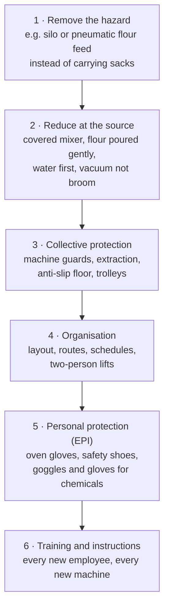

# 17.9 · Occupational Health and Safety

A bakery is a workplace with hot ovens, sharp blades, powerful machines, 25 kg sacks, wet floors, flour in the air and shifts that start in the middle of the night. This lesson brings together the risks to the baker's own health, explains how prevention is organised and what the law asks, and points back to the equipment lessons for the machines themselves. You finish with a written risk assessment of your home workstation.

## Why it matters

The INRS (France's occupational health and safety institute) names flour as the **first cause of occupational asthma** and reports that bakers make up a quarter of French employees with work-related respiratory conditions. Back injuries, burns, cuts and falls end or interrupt many bakery careers. The référentiel asks you to apply the employer's health and safety measures at your workstation, with the **document unique** as the reference document (C2.5); hygiene and safety are watched throughout the production test, and a candidate without the required protective equipment can be given 0 (see [The CAP Boulanger Exam](../../references/cap-exam.md)). Lesson [01.3](../module-01/lesson-03.md) gave you the day-one rules; this lesson gives the method.

## Key terms

| French | Say it | English meaning |
|---|---|---|
| santé et sécurité au travail (SST) | *sahn-TAY ay say-kü-ree-TAY oh trah-VAH-yuh* | occupational health and safety |
| document unique (DUERP) | *doh-kü-MAHN ü-NEEK* | the employer's written risk assessment and action plan (already in the glossary) |
| risque professionnel | *REESK pro-fess-yoh-NEL* | occupational risk: a hazard plus the situation where someone is exposed to it |
| asthme du boulanger | *ASM dü boo-lahn-ZHAY* | baker's asthma: occupational asthma caused by flour dust (and additives such as enzymes) |
| manutention manuelle | *mah-nü-tahn-SYOHN mah-nü-EL* | manual handling: lifting, carrying, pushing, pulling loads |
| TMS (troubles musculosquelettiques) | *tay-em-ESS* | musculoskeletal disorders: back, shoulder, wrist pain from load and posture |
| chute de plain-pied | *SHÜT duh plan-PYAY* | slip or trip on the same level |
| travail de nuit | *trah-VAH-yuh duh NWEE* | night work |
| EPI | *uh-pay-EE* | personal protective equipment: oven gloves, safety shoes, goggles (already in the glossary) |
| médecine du travail | *mayd-SEEN dü trah-VAH-yuh* | occupational health service (medical visits, advice on fitness for a job) |

## How it works

### Who does what

The **employer** must assess the risks, write them in the **document unique**, plan and apply prevention, train and equip the staff. The **employee** applies the safety instructions, uses the equipment and protections provided, and reports dangers and incidents (the same reflex as the non-conformity report, C4.4). The occupational health service advises both and follows the employee's health (lesson [17.3](lesson-03.md)).

### The order of prevention

French law sets general principles of prevention (Code du travail article L. 4121-2, summarised by INRS): first **avoid** the risk, **assess** the risks that cannot be avoided, **fight the risk at its source**, **adapt the work to the person**, **replace what is dangerous** with what is less dangerous, prefer **collective protection** to individual protection, and **train and inform**. In a bakery that gives:

PPE comes last because it protects only the person wearing it, only when worn correctly.

### The main risks and their prevention

| Risk | Where it comes from | Prevention (INRS unless stated) |
|---|---|---|
| **Flour dust**: rhinitis, asthma, eye irritation | weighing, pouring flour into the mixer, fleurage, dusting, sweeping, emptying sacks | mixer with a full cover; water in the bowl before the flour; a long sleeve that reaches the bottom of the bowl; do not shake sacks; dust sparingly; vacuum floors and benches daily with a suitable vacuum, no broom, no blower; local extraction. Report a runny nose or wheezing that improves on days off to the occupational doctor |
| **Burns** | ovens, trays and racks, steam, boiling milk and cream, sugar | heat-resistant gloves; insulated handles; a cooking area away from walkways; induction rather than gas where possible; steam released standing aside (lesson [07.4](../module-07/lesson-04.md)) |
| **Cuts** | lame, knives, bread slicer, dough cutter, broken glass | blades covered and stored; cut away from the hand; blades never left in washing-up water (lessons [01.3](../module-01/lesson-03.md), [13.6](../module-13/lesson-06.md)) |
| **Machines**: crushing, entanglement | mixers, dividers, moulders, sheeters | guards and stops working; never reach into a running machine; clean only when stopped and isolated; trained users only (lessons [13.1](../module-13/lesson-01.md), [13.2](../module-13/lesson-02.md)) |
| **Electricity and gas** | wet floors, damaged cables, gas ovens | lesson [13.5](../module-13/lesson-05.md): read the rating plate, report damage, know the gas shut-off valve |
| **Manual handling**: back pain, TMS | 25 kg flour sacks, dough tubs, racks, deliveries | handling aids (pallet trucks, trolleys, sack lifters); flour stored at waist height; height-adjustable tables; two people for heavy loads; INRS suggests aids for loads over 15 kg |
| **Falls** | flour plus water on the floor, stairs to the cellar or store, cables, clutter | anti-slip floor kept clean, dry and clear; spills cleaned at once; handrails and anti-slip nosings; lighting; anti-slip safety shoes |
| **Chemicals** | detergents, disinfectants, oven strippers, descalers | never mix (bleach + acid gives a toxic gas); gloves and goggles as labelled; original containers (lesson [17.4](lesson-04.md)) |
| **Night and early work** | shifts starting at 2-4 a.m. | sleep loss of 1-2 hours a day on average, drowsiness and accidents, especially on the drive to and from work; metabolic and cardiovascular effects; night work is classed as probably carcinogenic (IARC group 2A) (INRS). Protect a regular sleep period, avoid driving drowsy, and use the occupational health follow-up, and see lesson [20.4](../module-20/lesson-04.md) for night-work limits and premiums |
| **Heat** | ovens, summer, proofing cabinets | ventilation, water to drink, breaks in a cooler place |

### Manual handling: the legal limits

The Code du travail (articles R. 4541-1 to R. 4541-10, INRS TJ 18) asks the employer to **avoid manual handling** where possible, with mechanical aids, and to train staff. A man may carry loads above **55 kg** only if the occupational doctor has found him fit, and **never above 105 kg**; women may not carry loads above **25 kg**. These are maximums, not targets: a 25 kg flour sack lifted from the floor many times a day is already a back risk, which is why sacks are stored on pallets at a good height and moved with trolleys.

## Worked example

The owner of a small bakery fills in part of the document unique for the fournil. He rates each risk for **severity** (1 minor to 4 very serious) and **likelihood** (1 rare to 4 daily), multiplies them to rank priorities, and writes an action with a person and a date.

| Work situation | Hazard and harm | Severity | Likelihood | Score | Action | Who, when |
|---|---|---|---|---|---|---|
| Emptying 25 kg sacks into the spiral mixer by hand, sacks taken from the floor | flour dust (asthma); back strain | 4 | 4 | **16** | sacks on a pallet at waist height; long sleeve; water first; covered mixer lid; dust mask for cleaning the flour store | owner, this month |
| Sweeping flour at the end of the shift | dust back in the air | 3 | 4 | **12** | buy a vacuum suited to flour dust; broom removed | owner, 2 weeks |
| Taking trays out of the deck oven at 250 °C | burns | 3 | 3 | **9** | new heat-resistant gloves; tray rack placed next to the oven, not across the walkway | head baker, now |
| Steam generator descaling with acid | chemical burns; toxic gas if mixed with bleach | 3 | 1 | **3** | procedure posted; gloves and goggles; bleach stored apart | head baker |
| Apprentice driving home at 13:00 after a 3:00 start | drowsiness, road accident | 4 | 2 | **8** | rest before driving; schedule review; occupational health follow-up | owner |

1. **Priorities:** the score puts flour handling first (16), then sweeping (12), then the oven (9). The highest scores get actions first.
2. **Order of prevention:** the flour actions start at the source (pallet height, covered mixer, pouring method) before PPE (mask only for cleaning the flour store).
3. **Record:** each action has a person and a date; the document is reviewed at least once a year and whenever something changes (a new machine, an accident).

## Practice

You assess the risks of your home workstation the same way, then fix the top three.

> [!WARNING]
> Do the inspection with the oven off and cold and the mixer unplugged. Do not test guards or blades with your fingers. If you find a damaged cable or plug, unplug the appliance and do not use it until it is repaired.

### You need

- Minimum: notebook or spreadsheet, a torch, a tape measure, your usual baking equipment, a bathroom scale (to weigh a bag of flour or a full dough tub), oven gloves.
- Professional equivalent: the bakery's document unique, the occupational doctor's workplace visit, the INRS bakery prevention tools.

### Ingredients

No ingredients: an inspection exercise. Your next bake is the live test of your changes.

### In Israel

Checked 2026-10-09.

- **Heat:** a home kitchen in July-August at 30 °C or more, with the oven at 250 °C, is hot work: bake in the cooler early morning, ventilate, drink water, and keep children and pets out of the kitchen while the oven is open.
- **Flour dust at home:** pour flour gently close to the bowl, put the water in first, wipe or vacuum flour rather than brushing it into the air, especially if anyone at home has asthma.
- **Words:** safety *betichut* (בטיחות); burn *kviya* (כוויה); oven gloves *kfafot tanur* (כפפות תנור); first-aid kit *tik ezra rishona* (תיק עזרה ראשונה).

### Steps

1. **Walk through a bake** in your head, from fetching the flour to cleaning the floor. List every situation (at least 10): carrying flour, weighing, mixing, using the mixer, scoring, loading the oven, steam, unloading, cooling, cleaning, storing.
2. For each, name the **hazard** (dust, heat, blade, machine, load, floor, chemical, electricity, fatigue) and the possible **harm**.
3. Rate **severity** (1-4) and **likelihood** (1-4) and multiply.
4. For the **top three scores**, write an action that follows the order of prevention (source first, PPE last), with a date.
5. Weigh the heaviest thing you lift during a bake (flour bag, dough tub, cast-iron pot) and note where you lift it from.
6. Do the three actions before your next bake; during the bake, note whether they worked.

### Targets

- At least 10 situations rated, a score for each.
- Three actions done before the next bake, each starting as close to the source as possible.
- Heaviest load weighed and lifted from waist height, not the floor.

### How you know it worked

Your top risks are usually the oven and steam (burns), flour dust and a floor that gets slippery with flour and water: your actions should make them visibly smaller (gloves within reach, a tray landing spot next to the oven, flour poured low, floor cleaned dry first). If one of your three actions is only "be careful", replace it with something you can see or touch.

### Self-check

- [ ] I can list the main bakery risks and one prevention measure for each.
- [ ] I can explain the order of prevention and why PPE comes last.
- [ ] I know the legal load limits and why a 25 kg sack is still a risk.
- [ ] I know the effects of night work and how to protect myself.
- [ ] I completed a scored risk assessment of my workstation and acted on the top three.

## What goes wrong

| Symptom | Likely cause | Fix now | Prevent next time |
|---|---|---|---|
| Runny nose, sneezing, wheezing at work that improve on days off | flour dust exposure | report to the manager and occupational doctor | covered mixer, gentle pouring, vacuum not broom; medical follow-up |
| Back pain after deliveries | sacks lifted from the floor, carried alone | stop lifting; report | pallets at waist height, trolleys, two-person lifts, training |
| Slip near the plonge | flour and water on the floor | clean and dry the area; sign it | clean as you go; anti-slip shoes and floor |
| Burn on the forearm from a tray | reaching over a hot tray; damp or worn glove | cool the burn under running water and get first aid; report | dry, heat-resistant gloves covering the forearm; tray landing spot by the oven |
| Near-miss on the drive home after a night shift | sleep deficit | do not drive drowsy; report to the manager | regular sleep; schedule review; occupational health follow-up |

## Review

- The employer assesses risks in the document unique and organises prevention; the employee applies it and reports dangers.
- Prevention order: remove, reduce at the source, collective protection, organisation, PPE, training.
- Flour dust (first cause of occupational asthma), burns, cuts, machines, manual handling, falls, chemicals, night work and heat are the bakery's main risks; machines and energy are in lessons [13.1](../module-13/lesson-01.md), [13.2](../module-13/lesson-02.md) and 13.5.
- Manual handling: avoid it with aids; men above 55 kg only with medical fitness and never above 105 kg; women not above 25 kg.
- Exam-relevant (C2.5, protective equipment in the practical test): [The CAP Boulanger Exam](../../references/cap-exam.md).
