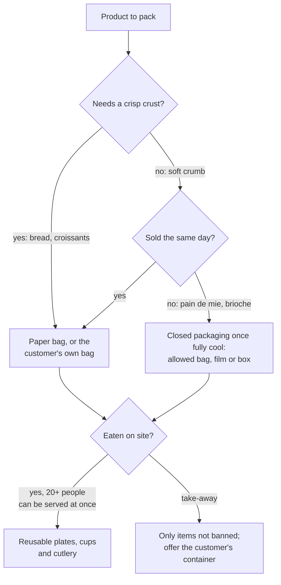

# 18.3 · Packaging and Cleaning Products

The bag a baguette leaves in and the bucket the floor is washed with are both environmental choices made dozens of times a day. This lesson covers the current French rules on single-use plastics that reach a bakery counter, how to choose packaging that keeps the product right with the least waste, and how to use cleaning products at the right dose with an eco-label where possible. You choose packaging for a bakery's range and dose your own cleaning product from its label.

## Why it matters

The référentiel asks you to package finished products (C2.4), to use cleaning products in a reasoned way that conforms to the house instructions and to respect the rules for recycling packaging (C2.7), and to know the properties and drawbacks of materials such as plastics, paper and cardboard (S4.3); see [The CAP Boulanger Exam](../../references/cap-exam.md). The rules are not optional: a counter that still hands out thin plastic bags or plastic cutlery risks fines of up to €15,000 for a company (bags), and an overdosed detergent is money poured away, residues on surfaces and more chemical exposure for the person cleaning.

## Key terms

| French | Say it | English meaning |
|---|---|---|
| emballage / conditionnement | *ahn-bah-LAHZH / kohn-dee-syon-MAHN* | packaging / packing finished products for sale |
| sachet papier | *sah-SHAY pah-PYAY* | paper bag (bread, viennoiserie) |
| usage unique | *ü-ZAHZH ü-NEEK* | single-use |
| biosourcé / compostable en compostage domestique | *bee-oh-soor-SAY / kohm-pos-TAHBL* | made partly from plant material / breaks down in a home compost |
| vaisselle réemployable | *veh-SELL ray-ahn-plwah-YAHBL* | reusable tableware |
| contenant du client | *kohnt-NAHN dü klee-YAHN* | the customer's own container |
| produit d'entretien / dosage | *pro-DWEE dahn-truh-TYAN / doh-ZAHZH* | cleaning product / dose (amount per litre) |
| Écolabel européen / NF Environnement | *ay-ko-lah-BEL* | the official EU and French environmental labels |
| fiche de données de sécurité (FDS) | *FEESH duh doh-NAY duh say-kü-ree-TAY* | safety data sheet of a chemical product |

## How it works

### Packaging: the product first, then the waste

Packaging must first protect the product's quality (lessons [07.5](../module-07/lesson-05.md) and [12.5](../module-12/lesson-05.md)), then use as little material as possible, in a material that is easy to sort.

| Material | Properties | Drawbacks | Bakery use |
|---|---|---|---|
| Paper (sachet, tissue) | breathes, lets steam out: crust stays crisp; recyclable in the paper stream; compostable when plain | tears when wet or greasy; a plastic window makes it mixed material | baguette, tradition, croissants |
| Cardboard (box, tray) | rigid, protects shape, stackable | volume; greasy cardboard is harder to recycle | cakes, orders, fragile viennoiserie |
| Plastic film or bag | keeps moisture in: soft crumb stays soft; light | crust goes soft; single-use plastic rules; sorting depends on the commune | sliced pain de mie, cooled brioche (only if the bag is allowed, below) |
| Reusable bag (cloth, waxed cotton) | no waste per sale | the customer must bring it back clean | regular customers' bread |

### The single-use plastic rules at a bakery counter

From the official consumer pages (justice.fr, from Entreprendre Service Public, updated 31 December 2025) and the Ministry's five-year review of the AGEC law (February 2025):

- **Plastic bags.** Single-use plastic bags thinner than 50 µm may not be sold or given, at the till or elsewhere in the shop. The only exception is a bag that is **home-compostable** (standard NF T51-800 or equivalent), contains **at least 60 % biosourced material** and is under 15 µm. So a brioche put into a thin plastic bag at the counter needs that kind of bag, or a paper bag or box instead.
- **Single-use items banned from sale and free giving** include plastic cutlery, plates, straws, stirrers and steak picks, expanded-polystyrene containers, lids, and cups containing more than 8 % plastic. For the snack counter: wooden or reusable cutlery, paper or reusable cups.
- **Eating in.** Where 20 or more people can be served at the same time, meals eaten on site are served in **reusable tableware** (since 2023 for fast food).
- **The customer's own container** (since 2021): a seller must accept a clean container brought by the customer if it suits the product. A cloth bread bag or a box for the pastries counts.
- **Receipts** (since 2023): printed only if the customer asks.
- **Information:** packaging placed on the market carries the Triman logo and sorting information (since 2022), and the law aims at **no single-use plastic packaging by 2040**.

Fines: up to €3,000 for an individual and €15,000 for a company for banned bags; €1,500 and €7,500 for banned single-use items (justice.fr). These lists change; check them when you set up a counter.

### Cleaning products: the right one, the right dose

Cleaning versus disinfection, the cleaning plan and how each product acts on dirt and micro-organisms are the subject of [Module 17](../module-17/lesson-04.md). The environmental part is simpler and applies to every product:

1. **Read the label and the safety data sheet** before use: danger pictograms, hazard statements, the dose, the contact time, the protective equipment (INRS ED 152).
2. **Dose exactly.** The label gives a dose per litre or a percentage. More product does not clean better: it costs more, leaves residues that need more rinsing water, and raises the exposure of the person cleaning. INRS advises ready-diluted products or a **dilution station** that doses automatically, and any decanted product labelled.
3. **Never mix products.** Bleach with an acid descaler gives off **chlorine**, a toxic gas; bleach with ammonia gives irritant chloramines (INRS).
4. **Choose a labelled product where it does the job.** The two official environmental labels for cleaning products are the **EU Ecolabel** (the EU's official voluntary label, about 121,000 labelled products) and **NF Environnement**; the CNBPF recommends both. Other "green" logos may be self-declared.
5. **Empty containers** go where the label and the house rules say (lesson [18.2](lesson-02.md)).

The dosing arithmetic is the same as for a formula:

$$\text{product (mL)} = \text{dose (mL per L)} \times \text{volume of water (L)} \qquad \text{or} \qquad \text{volume (mL)} \times \frac{\%}{100}$$

> [!CAUTION]
> Cleaning products can burn skin and eyes. Wear the gloves the safety data sheet names (nitrile rather than latex), never mix products, never decant into a food or drink container, and if a product splashes into the eyes or onto the skin, rinse with plenty of water for at least 15 minutes and follow the house first-aid procedure.

## Worked example

Boulangerie du Marché opens a snack corner with 24 seats and a take-away counter. The owner asks the apprentice to check the packaging list and the cleaning bucket.

1. **Bags.** The supplier offers thin plastic bags at €9 per 1,000 for brioches. They are under 50 µm and not marked home-compostable: **refused**. Choice: paper bags for bread and croissants (crust stays crisp), and for pain au lait and brioche either a paper bag (same-day sale) or a home-compostable biosourced bag marked NF T51-800 (keeps them soft for 2-3 days, lesson [12.5](../module-12/lesson-05.md)).
2. **Snack corner.** 24 seats, so 20 or more people can be served at once: sandwiches eaten in are served on reusable plates with metal cutlery and glasses; a dishwasher run full on the eco cycle (lesson [18.1](lesson-01.md)). Take-away: plastic cutlery is banned, so wooden cutlery is given only on request; a customer's own box is accepted when it is clean and suits the product.
3. **Till.** The till is set to print receipts only on request.
4. **The bucket.** The floor detergent label says **20 mL per litre** of water. The bucket holds 8 L, so the dose is 20 × 8 = **160 mL**. The commis has been pouring "a good glug" measured at about 400 mL: 2.5 times the dose, with about 240 mL wasted per bucket. Two buckets a day over 300 days: 240 × 2 × 300 = 144,000 mL, **144 L of product a year** poured away, plus the rinsing to remove the residue. Fix: a dosing cup marked at 160 mL hung on the bucket, or a wall dilution station.
5. **Labels.** The detergent carries no environmental label. At the next order the owner compares an EU Ecolabel detergent suited to the job; the disinfection products of the hygiene plan are chosen under the house hygiene plan ([Module 17](../module-17/lesson-04.md)).
6. **Sorting.** Cardboard from the paper-bag deliveries is flattened for the paper stream; empty detergent cans are handled as their labels say.

## Practice

You choose the packaging for a bakery's range, check your own kitchen's packaging and cleaning products, and dose one product exactly from its label.

> [!WARNING]
> Read the label before you open any product. Wear gloves, work with the window open, never mix two products and never pour a product into a food or drink bottle. Keep products and their measuring cup away from food and out of children's reach.

### You need

- Your kitchen's cleaning products (washing-up liquid, a floor or surface cleaner), a measuring cup or a 10-20 mL syringe, a bucket or basin and a 1 L jug, gloves.
- The packaging that comes into your kitchen in one week (flour bags, yeast wrapping, bread bags, boxes), paper and pen.
- Professional equivalent: the bakery's packaging list and supplier sheets, the safety data sheets folder, the dilution station, the cleaning plan ([Module 17](../module-17/lesson-04.md)).

### Ingredients

None: this is a choice and dosing exercise. Supplies:

| Supply | Quantity | Use |
|---|---|---|
| Your detergent with a dose on its label | enough for one basin or bucket | dosing exercise |
| Water | the volume you measure | dosing exercise |

### In Israel

Checked 2026-10-09.

- **Labels in Hebrew:** the dose is usually given per litre or as a number of caps per bucket; look for the warning box (*azhara*, אזהרה). Household bleach is *economika* (אקונומיקה); descalers are acids (for example citric acid, *chumtzat limon*, חומצת לימון). Never mix bleach with a descaler or with any other product.
- **Eco-labels:** imported products may carry the EU Ecolabel flower; look for it on the back label rather than trusting the word "eco" on the front.
- **Sorting your packaging:** follow your municipality's guide. In Tel Aviv-Yafo, for example, orange bins take clean, empty packaging such as plastic bags and tubs (no glass, no cardboard, no food scraps), blue bins take paper and thin cardboard, and large cartons are flattened beside the bins. Shake out flour bags before recycling them.
- **Bread bags:** when you buy bread for comparisons, bring your own cloth bag and see how the crust keeps compared with a plastic bag.

### Steps

1. **Packaging choice.** For each product below, choose the packaging and write one line of reason (quality, waste, rule): baguette; tradition; croissant; pain au lait sold the same day; sliced pain de mie kept 3 days; brioche for an order collected tomorrow; a sandwich eaten in at a 30-seat snack; a sandwich taken away.
2. **Your kitchen's week of packaging.** List every package bakery ingredients came in: material, weight if possible, bin it goes in. Mark one you could avoid (bigger pack, bulk, your own bag).
3. **Read one cleaning-product label:** pictograms, hazard statements, dose, contact time, gloves, eco-label (yes or no, which one).
4. **Measure your basin or bucket:** fill it to your usual level with the 1 L jug and count the litres.
5. **Calculate the dose** for that volume from the label (mL per L × L). Pour your usual amount into the measuring cup first and note it; then measure the correct dose.
6. **Clean with the correct dose** and judge the result; note whether the surface needed a rinse.
7. **Write a one-page sheet:** your packaging choices table, your kitchen's avoidable package, and your product's dose card (product, dose per litre, your bucket's litres, mL to pour, gloves, never mix).

### Targets

- Eight products packed with a reason each, and no banned item (thin plastic bag, plastic cutlery) in your choices.
- Your usual dose and the label dose both measured in mL, with the difference as a percentage.
- A dose card that a colleague could follow without asking you.

### How you know it worked

Your choices keep crusty products crisp and soft products soft without a banned item, and you can say for each one why. The dosing step usually surprises people: for example, a label of 5 mL per litre for a 6 L basin means 30 mL, about two tablespoons, where many people pour 80-100 mL. If your surface came out clean with the label dose, the rest was waste.

### Self-check

- [ ] I can choose paper, cardboard, plastic or a reusable bag for a product and give the reason.
- [ ] I know the AGEC rules at the counter: thin plastic bags and single-use plastic items banned, reusable tableware for 20 or more seated, customers' containers accepted, receipts on request.
- [ ] I calculate a cleaning-product dose from the label and never mix products.
- [ ] I recognise the EU Ecolabel and NF Environnement and know that disinfection products follow the hygiene plan.

## What goes wrong

| Symptom | Likely cause | Fix now | Prevent next time |
|---|---|---|---|
| Croissants soft and leathery in their bag | Plastic bag, or packed warm | Sell them the same day in paper | Paper bag for crisp products; cool fully first |
| Brioches dry by the next day | Paper bag used for a product kept 2-3 days | Advise the customer to close the bag | Allowed closed bag or box for products kept longer |
| Thin plastic bags still at the counter | Old stock or supplier not checked | Withdraw them | Check every new bag: thickness, home-compostable and biosourced marks |
| Sticky floor, smell of product, slippery after washing | Overdosed detergent, not rinsed | Rinse with clean water; dry | Dosing cup or dilution station; dose card on the wall |
| Choking smell when two products are used in the same sink | Bleach mixed with an acid descaler: chlorine | Leave the room, ventilate, follow first aid; report | One product at a time; never mix; rinse between products |

## Review

- Packaging protects quality first (paper for crisp, closed for soft), then uses the least material in a sortable form; reusable bags and customers' containers cut waste.
- AGEC at the counter: thin single-use plastic bags banned (except home-compostable, 60 % biosourced), single-use plastic cutlery, plates, straws and stirrers banned, reusable tableware where 20 or more can eat in, customers' own clean containers accepted, receipts on request.
- Cleaning products: read the label and SDS, dose exactly (mL per L × L), never mix, prefer EU Ecolabel or NF Environnement where it does the job; disinfection and the cleaning plan are [Module 17](../module-17/lesson-04.md)'s subject.
- Small equipment care and the order of a clean-down are in lesson [13.6](../module-13/lesson-06.md).
- Exam-relevant (C2.4 packaging, C2.7 reasoned use of cleaning products and packaging recycling, S4.3 materials): see [the CAP exam reference](../../references/cap-exam.md).
