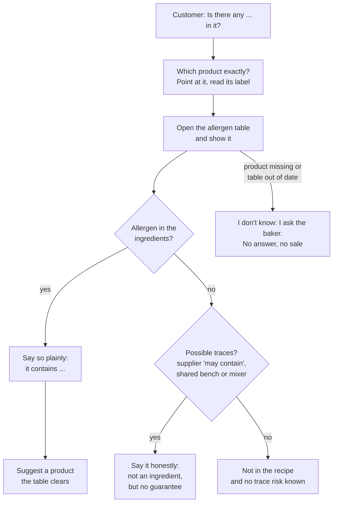

# 19.3 · Allergens, Storage and Pairing Questions

Three questions come to the counter every day: "is there any … in it?", "how do I keep it?" and "what do I eat it with?". The first can put a customer in hospital, the second decides whether she comes back, the third sells a second product. This lesson gives you a method and the French sentences for all three, built on the documents the bakery already holds. You answer six real customer questions in writing and aloud.

## Why it matters

For unwrapped products, allergen information is a legal duty with no exemption for small shops: it must be given **in writing**, visibly, near the products (Regulation 1169/2011 art. 44; Code de la consommation R412-12 to R412-16, from décret 2015-447). The bakery's allergen table (built in [lesson 17.6](../module-17/lesson-06.md) of Module 17) is that writing; this lesson is the conversation that goes with it, which [17.6](../module-17/lesson-06.md) left for here: **show the table, never guess**. Storage and pairing advice are the "conservation" and "association mets et pain" of the product argument (C4.2), and hygiene and food safety at the counter are C2.6; see [The CAP Boulanger Exam](../../references/cap-exam.md).

## Key terms

| French | Say it | English meaning |
|---|---|---|
| tableau des allergènes | *tah-BLOH dayz ah-lair-ZHEN* | allergen table: products × 14 allergens, kept at the till |
| allergique à / intolérant à | *ah-lair-ZHEEK ah / an-to-lay-RAHN ah* | allergic to / intolerant of |
| cœliaque | *say-LYAK* | coeliac: must avoid gluten completely |
| traces / « peut contenir » | *TRASS / puh kohn-tuh-NEER* | traces / "may contain": possible cross-contact |
| fruits à coque | *frwee ah KOK* | tree nuts (almond, hazelnut, walnut…) |
| sans gluten | *sahn glü-TEN* | gluten-free: a legal claim (≤ 20 mg/kg), never for a wheat bakery's products |
| se garder / se conserver | *suh gar-DAY / suh kohn-sair-VAY* | to keep (how long a product stays good) |
| réchauffer / rafraîchir au four | *ray-shoh-FAY / rah-freh-SHEER oh FOOR* | to warm / refresh in the oven |
| décongeler | *day-kohn-zhuh-LAY* | to thaw |

## How it works

### The allergen conversation

Four rules hold the method together:

1. **The table, not memory.** Recipes and suppliers change; a chocolate with soy lecithin or a premix with sesame arrives without anyone telling the shop. The table is checked and updated each time a recipe or supplier changes ([lesson 17.6](../module-17/lesson-06.md)).
2. **Every allergen by name.** The 14 of Annex II (cereals containing gluten, crustaceans, eggs, fish, peanuts, soybeans, milk, nuts, celery, mustard, sesame, sulphites above 10 mg/kg, lupin, molluscs). Say "il contient du lait et des œufs", not "il y a des allergènes".
3. **Traces are said, not hidden.** If the ingredients are clear but the supplier sheet says "peut contenir des traces de fruits à coque", or seeded doughs share the bench, the customer decides with that information. For a severe allergy the honest answer is often: "we cannot guarantee it".
4. **No answer, no sale.** "Je ne sais pas, je vais demander au boulanger" is a professional sentence. "Je pense que non" is not.

### Traps in a bakery's range

| Product | Allergens a seller forgets |
|---|---|
| Baguette, tradition | gluten; a tradition may contain **soy flour** (up to 0.5 %) if the mill adds it: read the mill sheet (lesson [09.1](../module-09/lesson-01.md)) |
| Croissant, pain au lait, brioche | milk (butter, milk), eggs (dough or egg wash), gluten |
| Pain au chocolat | soy (lecithin in most chocolate sticks), milk, eggs, gluten; often "may contain nuts" |
| Pain aux raisins | eggs and milk (crème pâtissière), sulphites if the raisins carry them above 10 mg/kg |
| Seeded and special breads | sesame, sometimes lupin or soy in premixes, mustard in some (lesson [10.7](../module-10/lesson-07.md)) |
| Sandwiches, quiches | mustard, celery, fish, crustaceans, eggs, milk (lesson [02.10](../module-02/lesson-10.md)) |
| Épeautre (spelt), kamut, seigle (rye) breads | **gluten**: these are not gluten-free |

**Gluten-free requests.** "Sans gluten" means 20 mg/kg of gluten or less in the food as sold (Regulation 828/2014). Flour dust travels across a whole fournil, so a bakery working with wheat does not sell anything as gluten-free unless it has a separate, validated process. To a coeliac customer: « Tous nos produits contiennent du gluten ou peuvent en contenir ; je ne peux rien vous conseiller sans risque. »

**Allergy or intolerance, vegan or not.** You do not judge how serious a reaction is ("just a little lactose"): you give the composition and let the customer decide. A question about eggs for a vegan customer gets the same table answer (egg wash, brioche dough), plus butter and milk.

### Storage, freezing and refreshing

Advice the seller gives, product by product, from lessons [07.5](../module-07/lesson-05.md), [12.5](../module-12/lesson-05.md) and [18.3](../module-18/lesson-03.md):

| Product | Keeps | How | Customer sentence |
|---|---|---|---|
| Baguette, tradition | best the same day | paper bag; freeze what will not be eaten, cooled and wrapped airtight, up to about 3 months; refresh in a hot oven | « À manger dans la journée ; le reste, au congélateur, bien emballé. » |
| Campagne, levain breads | 2-3 days | paper bag or cloth, cut face down on the board | « Il se garde deux à trois jours dans son sac en papier. » |
| Pain de mie (sliced) | several days | closed bag | « Bien fermé dans son sachet. » |
| Croissant, pain au chocolat | the same day | paper bag; next day, 3-5 minutes in a hot oven | « Le lendemain, cinq minutes au four chaud. » |
| Pain au lait, brioche | 2-3 days | closed bag or box once cool (a thin plastic bag must be a home-compostable, biosourced one, lesson [18.3](../module-18/lesson-03.md)) | « Deux à trois jours dans un sac fermé. » |
| Pain aux raisins (crème pâtissière) | the same day | keep cool, eat the same day | « À manger aujourd'hui. » |

Two rules apply to every bread: **never the fridge** (bread stales fastest around 4 °C) and **freeze only once cooled and wrapped**; a wrapped loaf thaws in about 3 hours at room temperature, then a few minutes in a hot oven bring the crust back (King Arthur Baking).

### Pairing questions

Pairing answers come from the pitch cards of lesson [19.2](lesson-02.md): one or two suggestions, then stop. « Pour un plateau de fromages, je vous conseille notre campagne au levain ou le pain aux noix. » If the customer has given an allergy, the pairing must pass the table too: no pain aux noix for a nut allergy.

### Key phrases

| French | Say it | English meaning |
|---|---|---|
| Je vérifie dans notre tableau des allergènes. | *zhuh vay-ree-FEE dahn NOT-ruh tah-BLOH dayz ah-lair-ZHEN* | I'll check in our allergen table. |
| Voici le tableau : il contient du lait et des œufs. | *vwah-SEE luh tah-BLOH: eel kohn-TYAN dü LAY ay day ZUH* | Here is the table: it contains milk and eggs. |
| Ce n'est pas dans la recette, mais nous en utilisons dans l'atelier. | *suh neh pah dahn lah ruh-SET, meh noo zahn ü-tee-lee-ZOHN dahn lah-tuh-LYAY* | It's not in the recipe, but we use it in the bakery. |
| Je ne peux pas garantir l'absence de traces. | *zhuh nuh PUH pah gah-rahn-TEER lap-SAHNS duh TRASS* | I can't guarantee there are no traces. |
| Je ne sais pas ; je demande au boulanger. | *zhuh nuh SAY pah; zhuh duh-MAHND oh boo-lahn-ZHAY* | I don't know; I'll ask the baker. |
| Tous nos pains contiennent du gluten. | *too noh PAN kohn-TYEN dü glü-TEN* | All our breads contain gluten. |
| Pas au réfrigérateur : dans un sac en papier. | *pah zoh ray-free-zhay-rah-TUHR: dahn zuhn SAK ahn pah-PYAY* | Not in the fridge: in a paper bag. |
| Attendez qu'il refroidisse avant de le congeler. | *ah-tahn-DAY keel ruh-frwah-DEES ah-VAHN duh luh kohn-zhuh-LAY* | Wait until it has cooled before freezing it. |
| Il va très bien avec un plateau de fromages. | *eel vah treh BYAN ah-VEK uhn plah-TOH duh froh-MAHZH* | It goes very well with a cheese board. |

## Worked example

Saturday, 11:00, at the counter of Boulangerie Au Pain de la Halle. A customer: « Ma fille est allergique au lait. Je voudrais des viennoiseries pour demain matin et du pain pour un plateau de fromages ce soir. Et comment je garde tout ça ? »

1. **Identify the products asked about:** viennoiseries for tomorrow, a bread for cheese tonight.
2. **Show the table.** Croissant, pain au chocolat, pain au lait, brioche, pain aux raisins: every viennoiserie column has **milk** ticked (butter, milk, crème pâtissière). Answer: « Voici le tableau : toutes nos viennoiseries contiennent du lait. Je ne peux pas vous en conseiller pour votre fille. »
3. **Offer what the table clears.** Baguette, tradition and campagne au levain: gluten only; no milk in the ingredients. The house sheet notes that viennoiserie and bread doughs share the bench and sheeter area, so: « Le lait n'est pas dans la recette de nos pains, mais nous en utilisons dans l'atelier ; je ne peux pas garantir l'absence de traces. Pour une allergie forte, c'est vous qui décidez. » The customer says the allergy is mild and her doctor allows trace risk: she chooses a tradition for the morning.
4. **Pairing:** for tonight's cheese board, from the pitch card: « Notre campagne au levain va très bien avec les fromages. » The pain aux noix is also on the card; the table shows nuts and no milk, and the customer has no nut problem, so you mention it as a second choice.
5. **Storage advice:** tradition for tomorrow morning: « Gardez-la dans son sac en papier, pas au réfrigérateur ; demain, cinq minutes au four chaud et elle sera croustillante. » Campagne: « Il se garde deux à trois jours dans son sac en papier. »
6. **What you did not say:** "there's no milk at all", "a little butter won't hurt", or "the croissants are fine, they're mostly flour".

## Practice

You answer six customer questions from a small allergen table and storage notes, say each answer aloud in French, then do the same with three packaged products bought in Israel.

### You need

- Minimum: the table below (or your own six-product table from [lesson 17.6](../module-17/lesson-06.md) in Module 17), the storage table above, a phone to record, three packaged bakery products from an Israeli supermarket (or photos of their labels).
- Professional equivalent: the bakery's allergen table and its "dossier allergènes" at the till with the sign telling customers it is available, the supplier technical sheets, the pitch cards.

> [!CAUTION]
> Allergy answers can harm people when they are wrong. In practice and in real life, answer only from the written table and labels; when in doubt, say you do not know and that the customer should not take the risk.

### Ingredients

None to bake. The exercise uses this allergen table of a small bakery ("T" = may contain traces, from a supplier sheet or shared equipment):

| Product | Gluten | Eggs | Milk | Soy | Nuts | Sesame | Sulphites |
|---|---|---|---|---|---|---|---|
| Tradition | ✓ | | | | | T | |
| Pain aux céréales | ✓ | | | ✓ | T | ✓ | |
| Croissant | ✓ | ✓ | ✓ | | | | |
| Pain au chocolat | ✓ | ✓ | ✓ | ✓ | T | | |
| Pain aux raisins | ✓ | ✓ | ✓ | | | | ✓ |
| Pain aux noix | ✓ | | | | ✓ | T | |

### In Israel

Checked 2026-10-09.

- **Reading Israeli allergen labels.** Today most Israeli packs show allergens in a separate box after the ingredients (*rekhivim*, רכיבים): **מכיל** (*mekhil*, contains) and **עלול להכיל** (*alul lehakhil*, may contain). A Ministry of Health change announced in October 2025 moves allergens into the ingredient list, emphasised (bold or underlined), from January 2028, for the same 14 groups as the EU; "may contain" stays. Until then you may see both styles.
- **One extra Israeli warning:** products with fava (broad bean) flour carry a warning for people with G6PD deficiency. Fava is not one of the 14 EU allergens, but French tradition flour may legally contain up to 2 % of it (lesson [09.1](../module-09/lesson-01.md)): a useful reminder that "not an EU allergen" is not the same as "safe for everyone".
- **The subject stays French:** the written table at the till, the 14 Annex II allergens and the "show the table" rule are the French practice you are training.

### Steps

1. **Answer these six questions in writing**, each with the product, what the table says, traces, and your sentence in French:
   1. « Mon fils est allergique au sésame. Je peux prendre un pain aux céréales ? »
   2. « Je suis intolérant au lactose, le pain au chocolat, ça va ? »
   3. « Vous avez quelque chose sans gluten ? C'est pour une amie cœliaque. »
   4. « Allergie aux fruits à coque : la tradition et le pain au chocolat ? »
   5. « J'achète trois baguettes pour la semaine, je les mets au frigo ? »
   6. « Qu'est-ce que je prends pour un plateau de fromages, sans noix ? »
2. **Check your answers** below.
3. **Say each answer aloud** in French, under 20 seconds, starting with « Je vérifie dans notre tableau » for the allergen questions. Record.
4. **Israeli labels:** for each of your three packaged products, copy the *mekhil* and *alul lehakhil* lines, translate them, and answer for each: "my child is allergic to sesame (and to milk), can he eat this?"
5. **Write the French answer** you would give if that product were on your shop's table.

Answers

1. **No.** Pain aux céréales contains sesame. « Non, il contient du sésame. » The tradition has a sesame trace risk (shared bench): say it if offered as an alternative.
2. **It contains milk** (and gluten, eggs, soy). « Voici le tableau : il contient du lait. » Do not judge how much lactose the customer tolerates; give the composition.
3. **Nothing.** « Tous nos produits contiennent du gluten ou peuvent en contenir ; je ne peux rien vous conseiller sans risque. » Do not suggest spelt or rye.
4. **Tradition:** no nuts in the table, no trace mark: « Pas de fruits à coque dans la tradition. » **Pain au chocolat:** not an ingredient but "T": « Ce n'est pas dans la recette, mais je ne peux pas garantir l'absence de traces. »
5. **No fridge.** « Pas au réfrigérateur, le pain y rassit plus vite. Mangez-en une le jour même et congelez les autres, bien emballées, une fois refroidies ; cinq minutes au four chaud après décongélation. »
6. **Campagne or tradition** (no nut ingredient); not the pain aux noix. « Je vous conseille notre campagne au levain, qui va très bien avec les fromages. » If the customer is allergic, add the table check; if it is only taste, the table still shows tradition clear of nut traces.

### Targets

- Six written answers, each naming the product, the table result, any trace risk and one French sentence.
- No answer contains "je pense", "normalement" or a judgement of how serious the reaction is.
- Each spoken answer under 20 seconds.
- Three Israeli labels read, with *mekhil* and *alul lehakhil* translated correctly.

### How you know it worked

Your answers match the key on product, allergen and traces, and every allergen answer starts from the table. When you replay your recordings you hear the allergen named ("du lait", "du sésame") rather than "des allergènes". If one answer said "it should be fine", redo it.

### Self-check

- [ ] I open or show the table before answering any allergen question.
- [ ] I name each allergen and say "traces" when the table or the supplier sheet does.
- [ ] I never offer anything as gluten-free in a wheat bakery.
- [ ] I give storage advice that matches [07.5](../module-07/lesson-05.md) and [12.5](../module-12/lesson-05.md): paper bag, no fridge, freeze cooled and wrapped, refresh in a hot oven.
- [ ] My pairing suggestions pass the customer's allergy first.
- [ ] I can read מכיל and עלול להכיל on an Israeli label.

## What goes wrong

| Symptom | Likely cause | Fix now | Prevent next time |
|---|---|---|---|
| Seller says "no nuts" about a product with a "may contain nuts" chocolate | Answer from memory; traces not in the table | Correct it with the customer at once; tell the baker | Table has a traces mark from the supplier sheets; seller always shows it |
| Customer reacts to a product the table cleared | Recipe or supplier changed, table not updated | First aid and emergency services if needed; withdraw the product; report | Update the table at every recipe or supplier change; date it |
| Coeliac customer sold a spelt bread | Spelt thought to be gluten-free | Tell the customer immediately | Card and table say "contient du gluten" on every wheat, spelt or rye product |
| Customer says the bread went stale in a day | Advised the fridge, or a plastic bag for crusty bread | Advise freezing and refreshing | Storage sentence on each pitch card |
| Seller suggests the pain aux noix to a nut-allergic customer for her cheese board | Pairing given before the allergy check | Apologise, offer another bread | Allergy first, then pairing |

## Review

- Allergen questions: identify the product, show the written table, name each allergen, say the trace risk, and say "I don't know, I'll ask" when the documents do not answer. Never guess.
- Written allergen information near the products is a legal duty for unwrapped food in France (art. 44; Code de la consommation R412-12 to R412-16).
- Nothing from a wheat bakery is sold as gluten-free (≤ 20 mg/kg); spelt, kamut and rye contain gluten.
- Storage: bread never in the fridge; paper bag; freeze cooled and wrapped, up to about 3 months; refresh in a hot oven; viennoiserie the same day, enriched doughs 2-3 days closed.
- Allergen information, storage and pairing are part of C4.2 and C2.6: see [the CAP exam reference](../../references/cap-exam.md).
