# 19.4 · Professional Vocabulary in Use

Knowing that a pâton is a divided piece of dough is the glossary's job; saying « les pâtons relâchent, je donne un rabat » at the right moment, and « les baguettes sont un peu plus plates ce matin » to a customer, is this lesson's. You drill the French words of the fournil by situation, practise switching between fournil, sales and customer language, and narrate a whole bake in French.

## Why it matters

The référentiel asks you to use the professional terms for equipment, gestures and techniques **according to the situation** (S1.3.1) and to express yourself clearly with suitable professional vocabulary (C4.3). The written test checks it directly: the 2019 EP1 paper gave candidates a pain brioché technical sheet for a trainee with the stage names blanked out, to be filled in "en utilisant les termes professionnels", and asked the role of each machine; see [The CAP Boulanger Exam](../../references/cap-exam.md). On the job, the right word saves time and errors: "il manque de force" and "il est trop serré" call for opposite corrections. The [glossary](../../glossary.md) holds every term of the course; this lesson puts them into sentences.

## Key terms

| French | Say it | English meaning |
|---|---|---|
| vocabulaire professionnel | *voh-kah-bü-LAIR proh-feh-syoh-NEL* | trade vocabulary: the agreed words for tools, gestures and techniques |
| le terme juste / le mot juste | *luh TAIRM ZHÜST / luh MOH ZHÜST* | the exact term |
| consigne | *kohn-SEEN-yuh* | an instruction given to you (or a set value on a machine) |
| coup de feu | *koo duh FUH* | the rush: the busiest moment of the bake or the shop |
| fournée | *foor-NAY* | one oven load (a batch through the oven) |
| pâton | *pah-TOHN* | divided piece of dough before shaping |
| relâcher | *ruh-lah-SHAY* | (of dough) to slacken and spread |
| donner de la force | *doh-NAY duh lah FORS* | to strengthen a dough (fold, tighter shaping, longer bulk) |
| ça part au four | *sah PAR oh FOOR* | it's going into the oven (said at loading) |

## How it works

### Learn words in families, with their article

French nouns carry a gender, and the article is part of the word you learn: **le** pétrin, **la** diviseuse. Learn the verb and the noun together, because the chef gives orders with verbs (« pèse, pétris, divise ») and sheets use nouns (pesée, pétrissage, division).

```mermaid
flowchart LR
  A["peser<br>la pesée"] --> B["pétrir<br>le pétrissage<br>(frasage, 1re et 2e vitesse)"]
  B --> C["pointer<br>le pointage<br>(le rabat)"]
  C --> D["diviser<br>la division<br>(les pâtons)"]
  D --> E["bouler, préfaçonner<br>le boulage<br>la détente"]
  E --> F["façonner<br>le façonnage"]
  F --> G["l'apprêt<br>(sur couche,<br>en banneton)"]
  G --> H["grigner, lamer<br>le coup de lame<br>la grigne"]
  H --> I["enfourner<br>l'enfournement<br>(la buée)"]
  I --> J["cuire<br>la cuisson"]
  J --> K["défourner<br>le défournement"]
  K --> L["le ressuage"]
```

| Family | Words with article (say them aloud) |
|---|---|
| Equipment | le pétrin (à spirale, à axe oblique), la diviseuse, la façonneuse, le laminoir, l'armoire de pousse, la chambre froide, le four à sole, l'enfourneur, la balance, la couche, le banneton, la grille, la lame, le coupe-pâte |
| Gestures | peser, fraser, pétrir, rabattre, diviser, bouler, façonner, rouler en boudin, lamer, dorer, enfourner, défourner |
| Dough states | une pâte ferme / douce / collante, une pâte qui relâche, une pâte qui a de la force / qui manque de force, une pâte jeune / vieille, sous-apprêté / sur-apprêté |
| Bread qualities and faults | la grigne, la croûte (croustillante, terne, épaisse), la mie (crème, serrée, alvéolée), l'alvéolage, le volume, le pied brûlé |
| Production words | la fiche technique, le bon de commande, la fournée, le bac, la TB (température de base), la TPV (température de pâte visée) |
| Viennoiserie | la détrempe, le beurrage, le tourage, un tour simple / double, l'abaisse, détailler, la dorure |

### One fact, three audiences

The same fact changes words with the listener (lesson [19.1](lesson-01.md) for registers):

| Fact | In the fournil | To the sales staff | To a customer |
|---|---|---|---|
| Dough too slack, baguettes flatter | « La pâte relâche, je donne un rabat. » | « Les baguettes sont un peu plus plates ce matin, le goût est le même. » | « Elles sont un peu plus plates aujourd'hui, mais tout aussi bonnes. » |
| Second croissant batch late | « La deuxième fournée de croissants est en retard, apprêt pas fini. » | « Les croissants arrivent à 7 h 30, pas avant. » | « Les croissants sortent du four dans vingt minutes. » |
| Cuts did not open | « Grigne pas sortie, coups de lame trop plats. » | « Les traditions de 6 h ont moins de relief, elles sont conformes. » | (nothing to say unless asked) |
| Dark bottoms | « Pied brûlé sur la sole du bas. » | « Les campagnes de la sole du bas sont mises de côté. » | « Il n'y en a plus de cette fournée, la suivante sort à 10 h. » |

Fournil words are precise and fast; outside the fournil they sound like jargon or, worse, like a confession of a fault the customer does not need. Never tell a customer about a defect in a product you are still selling; a product with a real defect does not go on the shelf (lesson [15.5](../module-15/lesson-05.md)).

### Words that are easy to confuse

| Pair | Difference |
|---|---|
| pointage / apprêt | bulk fermentation (before dividing) / final proof (after shaping) |
| détente / repos | bench rest after pre-shaping / any rest, often in the cold for laminated dough |
| fournée / lot | one oven load / one batch of dough (a lot can make several fournées) |
| sous-apprêté / sur-apprêté | under-proofed (tight, bursts) / over-proofed (flat, collapses) |
| grigne / coup de lame | the raised ear after baking / the cut itself |
| enfourner / défourner | load the oven / unload it |

## Worked example

EP1-style task, inspired by the 2019 paper. "You give Laura, a trainee, the technical sheet of the baguettes PC-02. Complete the stage names with the professional terms." The sheet (lesson [01.6](../module-01/lesson-06.md)) has these lines with the first word blank:

| Blank | What the line says | Term |
|---|---|---|
| 1 | 4 min in first speed: flour and water come together | **Frasage** |
| 2 | 6 min in second speed; dough at 23-25 °C | **Pétrissage** |
| 3 | 45 min, covered tub, 24 °C | **Pointage** |
| 4 | 24 pieces of 350 g, ±5 g | **Division** |
| 5 | loose balls, light touch | **Boulage** (light pre-shaping) |
| 6 | 20 min rest, covered | **Détente** |
| 7 | baguettes 55 cm long | **Façonnage** |
| 8 | 1 h 15 at 25 °C, 75-80 % RH | **Apprêt** |
| 9 | 5 cuts with the lame | **Scarification** (grignage, coups de lame) |
| 10 | 250 °C with steam | **Enfournement** and **cuisson** (with **buée**) |
| 11 | unload at 22 min: golden crust, hollow sound | **Défournement** |
| 12 | on racks, 30 min | **Ressuage** |

Then the oral brief to Laura in French, using the terms in order: « On commence par le frasage, quatre minutes en première vitesse, puis le pétrissage en deuxième. Pointage quarante-cinq minutes. On divise à 350 grammes, boulage léger, détente vingt minutes, puis façonnage des baguettes de 55 centimètres. Apprêt une heure quinze, cinq coups de lame, enfournement avec buée. »

## Practice

You run four short vocabulary drills, then narrate your next bake in French and record it.

### You need

- Minimum: the [glossary](../../glossary.md), paper, sticky notes, a phone to record; for the narration, the dough of your next practice bake from any earlier lesson (PD-01, PC-02, TR-01 or CR-01) with its normal equipment.
- Professional equivalent: the house technical sheets and organigramme, the chef's orders during a real shift, and the written test's technical-sheet questions.

> [!WARNING]
> If you narrate while you bake, safety first: stop talking when you load or unload the oven, open the door and handle the steam tray with dry oven gloves and your face turned away, and keep the lame capped when you put it down.

### Ingredients

No separate ingredients: use your next practice bake's formula from its lesson.

### In Israel

Checked 2026-10-09.

- **Label your kitchen in French.** Sticky notes with article and noun on each tool: *le coupe-pâte*, *la balance*, *le thermomètre à sonde*, *la plaque*, *la grille*, *le four*. Say the word every time you pick the tool up for a week.
- **Map Hebrew home-baking words to French** so you stop translating through English: *lisha* (לישה) = le pétrissage; *batsek* (בצק) = la pâte; *tfikha* (תפיחה) = the rise, le pointage or l'apprêt depending on the stage; *itsuv* (עיצוב) = le façonnage; *afiya* (אפייה) = la cuisson; *tanur* (תנור) = le four; *machmetzet* (מחמצת) = le levain. Hebrew uses one word for both rises where French uses two: always say which one.
- **Listen to French bakers.** French-language baking videos and, if you live near one, a French-run bakery in Israel are good listening practice; repeat what you hear and check it against the glossary.

### Steps

1. **Drill 1, stages (5 min).** Without looking, write the 12 stages of bread-making from pesée to ressuage, each as verb and noun with article. Check with the flow diagram.
2. **Drill 2, fill the gaps (10 min).** Complete the sentences below, then check the answers.
   1. La pâte est trop molle et elle s'étale : elle ______.
   2. Après la division, on laisse les pâtons en ______ vingt minutes.
   3. Les baguettes façonnées reposent sur la ______ pendant l'apprêt.
   4. La partie de la croûte soulevée le long du coup de lame s'appelle la ______.
   5. Une fournée de pain sortie du four refroidit sur grille : c'est le ______.
   6. Les croissants ne sont pas assez gonflés : ils sont ______.
   7. On étale la pâte feuilletée avec le ______.
   8. Le pain a une mie aux trous petits et serrés : la mie est ______.
3. **Drill 3, three audiences (10 min).** For each fact, write the fournil sentence, the sales-staff sentence and the customer sentence: (a) the tradition dough is too young, the next batch will be 30 minutes late; (b) twelve pains au chocolat are too dark; (c) the oven's lower deck is heating badly this morning.
4. **Drill 4, confusable pairs (5 min).** Write one sentence using each word of the six pairs in the table above.
5. **Narrate your bake (30 min, spread over the bake).** At each stage, say one sentence in French into your phone: what you are doing, a number, and what you see (« Fin du pétrissage, la pâte est à vingt-quatre degrés, elle est lisse »).
6. **Listen back** and list every word you hesitated over or said in English or Hebrew. Make a card for each and drill them the next day.

Answers

1. relâche. 2. détente. 3. couche. 4. grigne. 5. ressuage. 6. sous-apprêtés (sous-poussés). 7. laminoir. 8. serrée.

Drill 3, possible answers:

- (a) Fournil: « La pâte de tradition est jeune, je prolonge le pointage de trente minutes. » Sales: « Les traditions arrivent avec trente minutes de retard, vers 7 h 30. » Customer: « Les traditions sortent du four vers 7 h 30. »
- (b) Fournil: « Douze pains au chocolat trop colorés, mis de côté. » Sales: « Douze pains au chocolat ne vont pas en vente ce matin. » Customer: nothing about the defect; « Il nous reste des croissants, les pains au chocolat ressortent à 9 h. »
- (c) Fournil: « La sole du bas chauffe mal, je ne l'utilise pas, je préviens le chef. » Sales: « Moins de campagnes ce matin, la suite à 10 h. » Customer: « Les campagnes reviennent à 10 h. »

### Targets

- Drill 1: 12 stages with verb, noun and article, at least 11 correct.
- Drill 2: 8 of 8 after one retry.
- Drill 3: three facts × three audiences; no fournil word in a customer sentence.
- Narration: one French sentence with a number at each stage of the bake; under five words said in another language.

### How you know it worked

You can follow a chef's spoken orders without translating in your head, and you can fill a technical sheet's blank stage names as the EP1 paper asks. In your narration recording the stage words come first and without hesitation, and you never say the same French word for pointage and apprêt.

### Self-check

- [ ] I know each stage as a verb and as a noun with its article.
- [ ] I say "pointage" before dividing and "apprêt" after shaping, every time.
- [ ] I can say one fact three ways for the fournil, the shop and the customer.
- [ ] I narrated a full bake in French and drilled the words I missed.
- [ ] I can fill the stage names of a technical sheet with the professional terms.

## What goes wrong

| Symptom | Likely cause | Fix now | Prevent next time |
|---|---|---|---|
| Chef's order misunderstood: dough folded instead of divided | Verb not recognised (rabattre / diviser) | Ask back: « Vous voulez dire diviser ? » | Learn the verbs with the nouns; repeat orders back |
| Customer worried by "la pâte a relâché ce matin" | Fournil word used at the counter | Reassure with the plain fact | Three-audience drill; plain words outside the fournil |
| Marks lost on a technical-sheet question | "Repos" or "pousse" written for détente and apprêt | Use the exact term | Drill the stage list until it is automatic |
| Wrong correction applied to a dough | Confusing "manque de force" and "trop de force" | Check the dough again before acting | Learn faults in opposite pairs with their corrections (lesson [16.1](../module-16/lesson-01.md)) |
| Article errors (« le diviseuse », « la pétrin ») | Nouns learned without gender | Correct and repeat the phrase | Always write the article on your cards and labels |

## Review

- Learn each word with its article and as a verb plus noun: the chef speaks in verbs, sheets are written in nouns.
- Pointage before dividing, détente after pre-shaping, apprêt after shaping; fournée is an oven load, lot is a dough batch.
- Say a fact three ways: fournil words to the team, plain professional words to the shop, everyday words to a customer, and no defects at the counter.
- Narrating your own bake in French is the fastest drill; the glossary holds every term of the course.
- The written test asks for professional terms in context, as on a technical sheet: see [the CAP exam reference](../../references/cap-exam.md).
