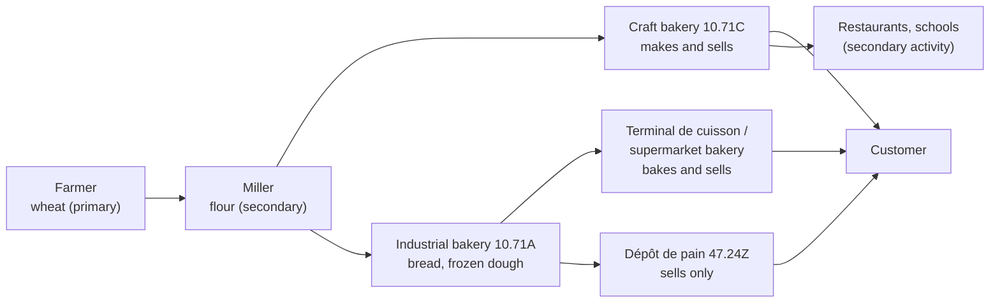

# 20.1 · The Bakery Sector and Its Businesses

A boulanger works inside a business, and the business sits in a sector, a chain of suppliers and customers, and a web of institutions. This lesson shows how a craft bakery is classified, which jobs it holds, which legal forms it can take and who it deals with outside its walls. You finish by profiling three bakeries near your home with the same grid an examiner would use.

## Why it matters

The applied-management part of the EP1 written paper starts from a company file: a bakery's identity card with its name, legal form, capital, register number and activity code, and questions about what they mean (S5.1). How that part is assessed is on [The CAP Boulanger Exam](../../references/cap-exam.md#ep1-written-test-on-technology-applied-science-and-management). On the job, knowing what kind of business you work for tells you who decides, who signs your contract, which collective agreement applies and how secure the business is. When you look for work (lesson [20.3](lesson-03.md)), a craft bakery, a supermarket bakery and a bake-off point are three very different employers, even if all three sell baguettes.

## Key terms

| French | Say it | English meaning |
|---|---|---|
| secteur d'activité | *sek-TUHR dak-tee-vee-TAY* | sector: the group of businesses with the same main activity |
| métier | *may-TYAY* | trade or job: a set of tasks needing a given skill |
| activité principale / secondaire | *ak-tee-vee-TAY pran-see-PAL / suh-gohn-DAIR* | main activity (the one that brings most turnover) / secondary activities |
| code NAF (APE) | *kod NAF (ah-pay-UH)* | INSEE activity code of the business, e.g. 10.71C |
| SIREN / SIRET | *see-REN / see-RET* | 9-digit business number / 14-digit number of one establishment |
| forme juridique | *form zhü-ree-DEEK* | legal form: EI, EURL, SARL, SASU, SAS… |
| capital social | *ka-pee-TAL so-SYAL* | capital the partners contributed to a company |
| chambre de métiers et de l'artisanat (CMA) | *SHAHM-bruh duh may-TYAY ay duh lar-tee-za-NAH* | chamber of trades: the consular body of craft businesses |
| organisation professionnelle | *or-ga-nee-za-SYOHN pro-fe-syo-NEL* | trade body: employers' organisation (CNBPF) or employees' union |
| artisan | *ar-tee-ZAHN* | craftsman running a small business that makes what it sells |

## How it works

### Sector, chain and activity code

Economists group businesses in three broad sectors: the primary sector takes products from nature (the farmer growing wheat), the secondary sector transforms them (the miller, the baker), the tertiary sector provides services (the retailer, the transporter, the accountant). A craft bakery is both: it **transforms** flour into bread and **sells** it over its own counter. Lesson [02.1](../module-02/lesson-01.md) followed the grain from field to mill; this lesson follows the businesses.

INSEE gives every business an activity code (code APE, from the NAF list) according to its **main activity**, and it appears on payslips, invoices and the company's identity card.

| Code (NAF rév. 2) | Title | What it covers | Example |
|---|---|---|---|
| **10.71C** | Boulangerie et boulangerie-pâtisserie | craft making of bread, viennoiserie and fresh pastries **associated with retail sale** | the bakery where you will do your PFMP |
| 10.71A | Fabrication industrielle de pain et de pâtisserie fraîche | industrial bread and viennoiserie, **including frozen dough** for baking elsewhere | the factory supplying frozen croissants |
| 47.24Z | Commerce de détail de pain, pâtisserie et confiserie en magasin spécialisé | retail of bread and pastries **not made by the shop** | a shop that sells bread bought in |

So the code follows what the business does most, not what it calls itself. A supermarket's in-store bakery belongs to a retail business (GMS); a terminal de cuisson only bakes products made elsewhere; a dépôt de pain only sells. The rules on names you met in lesson [09.1](../module-09/lesson-01.md) (pain maison: kneaded, shaped and baked where it is sold) are what separate them in the customer's eyes.

### Main and secondary activities

The **main activity** is the one that brings the most turnover: for a 10.71C bakery, making and selling bread, viennoiserie and pastries. **Secondary activities** add turnover with the same staff, premises or customers: sandwiches and snacking at lunch, a small traiteur range (quiches, pizzas), delivering rolls to a restaurant or a school canteen, a tea room, a market stall on Sunday. They matter to you because they change the work (a snacking range brings 10 % VAT and allergen labelling: lessons [06.5](../module-06/lesson-05.md) and [17.6](../module-17/lesson-06.md)) and the hours.

### The trade in figures

The CNBPF (the craft bakers' confederation) counts **over 35,000** craft bakery businesses in France, serving about **12 million customers a day** and selling about **6 billion baguettes a year**; in its 2024 survey it counted **29,029 vacancies** in bakery-pâtisseries, **9,745 of them for boulangers**. In 2025 the craft bakery branch trained **30,438 apprentices**, **6,018** of them preparing the CAP Boulanger (CNBPF, June 2026). These are a trade body's figures, rounded and not official statistics, but they tell you two things: most bakeries are small, and they struggle to find bakers.

### The jobs and their conditions

Lesson [01.2](../module-01/lesson-02.md) placed the roles in the building. As jobs:

| Job | Main tasks | Usual entry |
|---|---|---|
| Apprenti(e) boulanger | learns every task under a maître d'apprentissage; alternates CFA and bakery | apprenticeship contract (lesson 20.3) |
| Ouvrier boulanger | makes the products from orders and technical sheets; the CAP job | CAP Boulanger |
| Tourier | laminated doughs; in small bakeries the boulanger does it | CAP, CQP Tourier |
| Pâtissier | pastries, entremets, tarts | CAP Pâtissier |
| Vendeur / vendeuse | sells, advises, sets out the shop, handles the till | CAP or experience |
| Chef boulanger / responsable de fabrication | organises production, orders, trains | experience, BP, BM |
| Chef d'entreprise | buys, manages staff, money and the law | qualified person (below) |

The **environment** of the job is part of the CAP knowledge: work starting at night or very early, weekends and public holidays (the shop sells most when others rest), heat near the ovens, standing all day, 25 kg sacks, flour dust, a fast pace before opening. Their health effects and prevention are in lesson [17.9](../module-17/lesson-09.md); the pay rules that compensate night and Sunday work are in lesson [20.4](lesson-04.md).

### Legal forms of a bakery business

The legal form decides who owns the business, who is liable for its debts and how its profit is taxed (Entreprendre Service Public, updated 10 April 2026).

| Form | Owners | Liability | Run by | Profit taxed by default |
|---|---|---|---|---|
| **EI** (entreprise individuelle), incl. micro-entrepreneur | 1 person | professional assets, separate from personal assets (except fraud or serious breaches) | the entrepreneur | income tax (IR) of the owner |
| **EURL** | 1 partner | limited to contributions | gérant | income tax, option for IS |
| **SARL** | 2 to 100 partners | limited to contributions | gérant | corporate tax (IS) |
| **SASU** | 1 partner | limited to contributions | président | corporate tax (IS) |
| **SAS** | 2 or more | limited to contributions | président | corporate tax (IS) |

Minimum capital is free for EURL, SARL, SASU and SAS. A family bakery is often an SARL or an EURL; a new owner alone often chooses an EI or an SASU. Taxation is lesson [20.5](lesson-05.md).

To **open** a bakery the owner needs a qualification: bakery is a regulated craft, and the owner (or a qualified person who controls the work) must hold a CAP, BEP or bac pro in the trade or prove three years' experience; practising without it is punishable by a fine of €7,500 (Entreprendre Service Public, updated 21 February 2026). The business registers online through the guichet des formalités des entreprises; INSEE then gives it a SIREN number, a SIRET number per establishment and its APE code.

### Who the bakery deals with

| Partner | Examples | Link with the bakery |
|---|---|---|
| **The State** | tax office, URSSAF, DDPP (food safety inspections), inspection du travail | collects VAT and taxes, social contributions; checks hygiene, labelling and labour law |
| **Collectivités territoriales** | commune (mairie), département, région | local by-laws (arrêtés municipaux: parking, market days, terraces), waste collection, apprenticeship support |
| **Chambre de métiers et de l'artisanat** | the CMA of the département | consular body of craft businesses: qualification certificates, advice and training for owners |
| **Organisations professionnelles patronales** | CNBPF and its 94 departmental groupings | represent bakery owners, negotiate the collective agreement, run competitions and training |
| **Syndicats de salariés** | employees' unions | negotiate the collective agreement with the employers' side |

The employers' organisations and the unions sign the **convention collective nationale de la boulangerie-pâtisserie** (entreprises artisanales, IDCC 843) that sets your minimum pay and premiums; you meet it in lesson 20.4.

## Worked example

You start your PFMP at Boulangerie Au Pain de la Halle. On the office wall:

> **Au Pain de la Halle** — 12 place de la Halle, 37000 Tours
> SARL au capital de 30 000 € — gérante: Mme Lebrun — RCS Tours 812 345 678
> SIRET 812 345 678 00015 — Code APE 10.71C
> Convention collective: boulangerie-pâtisserie (entreprises artisanales)
> Effectif: 2 ouvriers boulangers, 1 tourier-pâtissier, 1 apprentie, 2 vendeuses
> Ventes: pains, viennoiseries, pâtisseries; sandwiches le midi; petits pains livrés au restaurant Le Relais (lesson 06.5)

**1. Main activity and sector.** APE 10.71C: craft bread and pastry making with retail sale. The business transforms (secondary sector) and sells (tertiary); its main activity is making and selling bakery products.

**2. Secondary activities.** Sandwiches at lunch (food for immediate consumption, VAT 10 %, not 5.5 %: lesson 06.5) and the delivery of rolls to a restaurant (a business customer, invoiced).

**3. Legal form.** SARL: at least two partners, liability limited to their contributions (€30,000 in total), run by a gérante, profit taxed at corporate tax by default. If the business fails, the partners lose their contribution, not their homes, apart from personal guarantees they may have signed.

**4. Numbers.** SIREN 812 345 678 identifies the company; the SIRET adds 00015 for this shop. A second shop would have the same SIREN and another SIRET.

**5. Who to go to.** A question about your pay grade: the collective agreement and the gérante (lesson 20.4). A hygiene inspection: the DDPP. The market-day parking ban outside: an arrêté of the mairie.

**6. Jobs.** Six employees: you will work beside two ouvriers boulangers (the CAP job you are preparing for), learn laminated doughs from the tourier-pâtissier, and pass product information to two vendeuses.

## Practice

You profile three bakeries near your home with the grid below, then classify each as if it were in France.

### You need

- A notebook or the table below copied into a document; 2 hours spread over a week (visits at different times of day).
- The bakeries' signs, websites, social-media pages or receipts (a receipt often shows the business name and number).
- Professional equivalent: a company's identity card (fiche d'identité de l'entreprise), the K-bis extract and the staff register a manager can show you.

### Steps

1. Choose three different places that sell bread: for example a craft bakery, a supermarket bakery counter and a chain outlet or café that bakes bought-in products.
2. Visit each at least once, ideally early morning or at lunch. Do not photograph staff or ask for private information; observe and ask only what a customer can ask ("Do you bake here?", "Do you make the dough here?").
3. Fill one profile per business:

| Item | Bakery 1 | Bakery 2 | Bakery 3 |
|---|---|---|---|
| Name and type (craft, supermarket, chain, bake-off) | | | |
| Made on site? (dough, shaping, baking) | | | |
| Main activity | | | |
| Secondary activities (snacking, tea room, delivery, events) | | | |
| Jobs you can see (bakers, sellers, manager) and approximate number | | | |
| Opening days and hours; when bakers start (ask) | | | |
| Working conditions you notice (heat, queue, standing, night) | | | |
| Legal form if visible, or the one you would expect | | | |
| French equivalent code: 10.71C, 10.71A, 47.24Z or retail (GMS) | | | |
| Who supplies it (flour, frozen products) if you can tell | | | |

4. Classify each place for France: which code, could it legally sell its bread as pain maison (lesson 09.1), which of the jobs in this lesson it employs.
5. Write five lines: which of the three would you rather work in, and why (hours, products, learning, team).

### Targets

- Three complete profiles, every line filled or marked "not visible".
- A justified French code for each, with the deciding fact (made on site or not).
- A five-line choice based on facts from your profiles.

### How you know it worked

From a shop front, a receipt and three questions you can say what kind of business it is, what it really makes, which jobs it offers and how it would be classified in France, and you can read a company identity card in an exam paper without hesitating over SARL, SIRET or APE.

### In Israel

The classification you practise is the French one; Israeli business registration is not part of the CAP and is not taught here. Israel has the same range of places: the neighbourhood bakery (מאפייה, *ma'afiya*), the small artisan "boutique" bakery (מאפיית בוטיק, *ma'afiyat boutique*) that kneads and bakes on site, the pastry shop (קונדיטוריה, *konditoria*), supermarket bakery counters, and chain cafés and kiosks that bake frozen dough. The key question works in Hebrew too: "do you make the dough here?" (*atem osim et habatzek kan?*, אתם עושים את הבצק כאן?). If a place sells its products as baked "on site" while only finishing frozen dough, note it: in France that is exactly the line between a craft bakery and a terminal de cuisson. Kosher supervision, Friday challah rushes and Saturday closing are local features worth noting in the "conditions" line, because they change the hours of the bakers.

### Self-check

- [ ] I can say which of 10.71C, 10.71A and 47.24Z fits a business from what it makes and sells.
- [ ] I can tell a main activity from a secondary one and give two bakery examples.
- [ ] I can name the bakery jobs and the working conditions of the trade.
- [ ] I can explain SARL, EURL, EI, SASU and SAS: owners, liability, who runs it.
- [ ] I know what the State, the commune, the CMA, the CNBPF and the unions do for or with a bakery.

## What goes wrong

| Symptom | Likely cause | Fix now | Prevent next time |
|---|---|---|---|
| Supermarket counter classified as a craft bakery | Name on the sign taken at face value | Ask whether dough is made on site; check what the business does most | Classify by main activity, not by the sign |
| "SARL = the gérant owns everything personally" | Company confused with an individual business | Re-read the table: partners own shares, liability limited to contributions | Separate the person from the company |
| SIREN and SIRET mixed up | Two numbers, one company | SIREN = company (9 digits), SIRET = establishment (14 digits) | Read the last five digits as "which shop" |
| Secondary activity priced like bread | Sandwiches treated as bread for VAT | 10 % for food prepared for immediate consumption | Note the VAT rate next to each activity |
| Exam answer "the CMA inspects hygiene" | Partners' roles mixed | Hygiene: DDPP (State); CMA: craft businesses' chamber | Learn one example per partner |

## Review

- A craft bakery (APE 10.71C) makes and sells; industrial bakeries (10.71A) make, including frozen dough; 47.24Z shops sell what they do not make.
- The main activity brings most of the turnover; snacking, traiteur and deliveries are secondary activities with their own rules.
- EI, EURL, SARL, SASU, SAS differ by number of owners, liability, who runs the business and how profit is taxed.
- The bakery deals with the State (taxes, URSSAF, DDPP, labour inspection), the commune, the CMA, the CNBPF and the unions that sign the collective agreement.
- Applied management is part of the EP1 written paper; see [The CAP Boulanger Exam](../../references/cap-exam.md).
