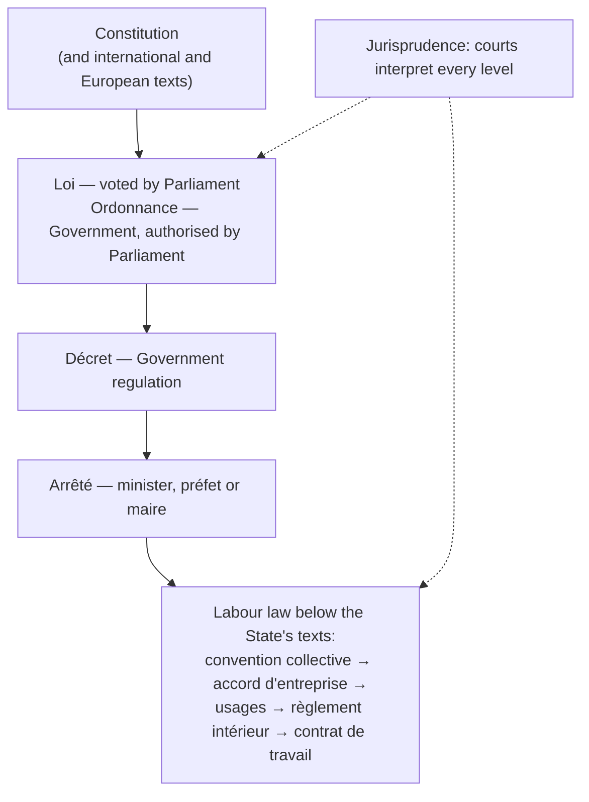

# 20.2 · Law, Contracts and Responsibility

Every rule you have met in this course, from the definition of pain de tradition to the temperature of the cold room, comes from a legal text with a rank and an author. This lesson shows how French law is built, what makes a contract valid, and who pays or is punished when something goes wrong. You finish by analysing a real-format employment contract and a supply contract.

## Why it matters

The applied-management questions of EP1 often give a short text and ask you to find the sources of law in it, check a contract or say who is responsible (S5.1.4; see [The CAP Boulanger Exam](../../references/cap-exam.md#ep1-written-test-on-technology-applied-science-and-management)). At work you sign an employment contract, you carry out the bakery's contracts with its customers (the restaurant's 20 rolls at 6:30 are a contractual obligation, not a favour), and you can be personally responsible for what you do. Knowing which text wins when two disagree is how you check your own pay and hours in lesson [20.4](lesson-04.md).

## Key terms

| French | Say it | English meaning |
|---|---|---|
| source du droit | *soors dü DRWAH* | source of law: a text or practice that creates rules |
| loi / décret / arrêté | *lwah / day-KRAY / a-ray-TAY* | act of Parliament / government regulation / order of a minister, préfet or maire |
| jurisprudence | *zhü-rees-prü-DAHNS* | case law: the courts' decisions that interpret the texts |
| coutume / usage | *koo-TÜM / ü-ZAHZH* | custom / established practice that becomes a rule |
| contrat | *kohn-TRAH* | contract: an agreement that creates obligations between parties |
| liberté contractuelle | *lee-bair-TAY kohn-trak-TÜEL* | freedom of contract: to contract or not, with whom, on what terms, within the law |
| obligation | *o-blee-ga-SYOHN* | duty a party owes under a contract or the law |
| responsabilité civile | *res-pon-sa-bee-lee-TAY see-VEEL* | civil liability: the duty to repair (pay for) damage caused |
| responsabilité pénale | *res-pon-sa-bee-lee-TAY pay-NAL* | criminal liability: punishment by the State (fine, prison) for an offence |
| principe de faveur | *pran-SEEP duh fa-VUHR* | in labour law, the text most favourable to the employee applies |

## How it works

### The sources of law and their rank

French law is a hierarchy: a lower text must respect the texts above it.

| Source | Author | Bakery example |
|---|---|---|
| Constitution | the people (referendum) or Parliament in Congress | the basic rights every other text must respect, such as the right to join a union |
| Loi | Parliament | the Code du travail's legal working week of 35 hours (lesson [20.4](lesson-04.md)) |
| Ordonnance | Government, on Parliament's authorisation | ordinance 2016-131 that rewrote contract law in the Code civil |
| Décret | Prime Minister or President | décret 93-1074 of 13 September 1993: pain maison, pain de tradition française (lesson [09.1](../module-09/lesson-01.md)) |
| Arrêté | minister, préfet or maire | the arrêté of 21 February 2014 that created the CAP Boulanger; an arrêté municipal banning parking on market day |
| Jurisprudence | the courts (Cour de cassation, Conseil d'État…) | a judgment deciding whether a dismissal had a real and serious cause |
| Coutume / usage | long, accepted practice | a practice applied to all staff for years, such as a December bonus, which the Ministry of Labour lists among the sources of labour law ("usages") |

### Labour law: more sources, and the favour principle

Between the State's texts and your contract sit the texts negotiated for the trade: the **convention collective** of the branch (for craft bakeries, IDCC 843), company agreements, **usages**, the **règlement intérieur** (internal rules) and the **contrat de travail**. The Ministry of Labour sums up the rule: when several texts cover the same subject, the one **most favourable to the employee** applies, with some exceptions. For thirteen matters the branch agreement prevails over a company agreement, among them **minimum wages** and **job classifications**. So your contract can give you more than the convention collective, never less; the convention can give more than the Code du travail, never less on the points the law guarantees.

### What a contract is and when it is valid

A contract is an agreement between two or more parties that creates obligations. Under **freedom of contract** you may choose to contract or not, with whom, and on what terms, as long as you respect the law. The Code civil (article 1128, from the 2016 ordinance) sets **three conditions of validity**:

1. **Consent** of the parties, freely given and informed: not obtained by error, fraud or pressure.
2. **Capacity** to contract: the person must be legally able to commit (a minor, for instance, is protected by special rules).
3. A **lawful and certain content**: what is promised must be allowed by law and defined or definable.

A contract missing one of them can be annulled by a court. Bakery contracts you will meet:

| Contract | Parties | Obligations of one | Obligations of the other |
|---|---|---|---|
| Contrat de travail | employer and employee | employer: provide work, pay the agreed wage, ensure safety | employee: do the work under the employer's authority, follow instructions, be loyal |
| Supply contract | bakery and restaurant | bakery: deliver the agreed products, quantity, quality and time | restaurant: pay the agreed price by the due date |
| Purchase contract | mill and bakery | mill: deliver conforming flour | bakery: pay the invoice |
| Sale at the counter | bakery and customer | bakery: hand over a product that conforms (weight, allergens, name) | customer: pay the displayed price |

Most contracts need no writing to exist (a sale at the counter is a contract), but some must be written, such as a fixed-term employment contract (lesson [20.3](lesson-03.md)). Writing is always the best proof.

### Three kinds of responsibility

| Kind | When | Consequence | Bakery example |
|---|---|---|---|
| **Civile contractuelle** | a party does not perform a contract, or performs it late (Code civil art. 1231-1) | damages (dommages et intérêts) to the other party, unless force majeure | the rolls arrive at 9:00 instead of 6:30, the restaurant buys bread elsewhere and charges the difference |
| **Civile délictuelle** | damage caused to someone outside any contract, by fault or negligence (art. 1240-1241), or by persons or things one is responsible for (art. 1242) | damages to the victim | a customer slips on a floor left wet without a sign; the bakery, responsible for its staff and premises, pays |
| **Pénale** | an offence defined by law | punishment by the State: fine, prison | running a bakery without the required qualification: fine of €7,500; usurping the title: up to 1 year in prison and €15,000 |

Civil liability **repairs** (it pays the victim); criminal liability **punishes** (the State prosecutes). One act can trigger both.

**Personal or professional?** As an employee you act for the employer: in principle the employer answers civilly for damage you cause while doing your job (the Code civil makes "commettants" responsible for their "préposés"). You can still face a **disciplinary sanction** from the employer for a professional fault, and you answer **personally** for a criminal offence you commit. Outside work (driving home after a night shift, lesson [17.9](../module-17/lesson-09.md)) your responsibility is purely personal.

## Worked example

Your manager hands you a note before your first PFMP week, in the style of an EP1 document:

> "Parking is forbidden in the rue de la Halle on Saturday because of the market (arrêté du maire du 2 mars). Remember that only bread entirely kneaded, shaped and baked where it is sold may be called pain maison (décret du 13 septembre 1993). Your hours follow the Code du travail and our collective agreement. Since last week's ruling of the conseil de prud'hommes in a neighbouring bakery, we record every overtime hour."

**1. Sources of law in the text.**

| Source | Author | Subject |
|---|---|---|
| Arrêté municipal | the maire | parking ban on market day |
| Décret 93-1074 | the Government | the name "pain maison" |
| Code du travail (lois, décrets) | Parliament and Government | working time |
| Convention collective | employers' organisations and unions | conditions in craft bakeries |
| Judgment (jurisprudence) | conseil de prud'hommes | overtime in one dispute |

**2. Rank.** Décret above arrêté; the Code du travail's laws above the décrets that apply them; the convention collective below the law but able to give employees more. A prud'hommes judgment only settles one dispute; the higher courts' decisions shape how the texts are read.

**3. The restaurant contract.** Au Pain de la Halle supplies Le Relais: 20 rolls of 60 g each morning at 6:30, €0.40 HT each, paid at the end of the month (lesson [06.5](../module-06/lesson-05.md)).
- Parties: the SARL Au Pain de la Halle (represented by its gérante) and the restaurant's company.
- Validity: both agreed freely (consent); both are companies represented by their managers (capacity); rolls at a fixed price is a lawful, certain content.
- Obligations: bakery — 20 conforming rolls at 6:30; restaurant — pay €8.00 HT a day by the due date.
- One Tuesday the oven breaks and nothing is delivered: a **non-performance**. If the breakdown was foreseeable and avoidable (no maintenance), the bakery may owe damages; a real force majeure (an event outside its control that it could not foresee or avoid) would free it. Either way the baker who sees the problem reports it at once (C4.4) so the manager can warn the customer.

**4. Responsibility.** The apprentice leaves a tray on the floor; a delivery driver trips and breaks a wrist. Civil délictuelle responsibility of the bakery (the apprentice acted in his job); the apprentice may receive a reminder or a warning from the employer, but does not pay the driver.

## Practice

You analyse two contracts with the grids of this lesson, then check your answers.

### You need

- This lesson, a pen, 1 hour.
- Professional equivalent: your own employment contract and the bakery's customer agreements, read with the manager or a union representative.

### Steps

1. Read document A and document B below.
2. For each, fill the grid: parties; object; obligations of each party; the three conditions of validity (met or not, why); one clause you would question.
3. Answer questions 1-6.
4. Compare with the answers.

**Document A — extract of an employment contract**

> Entre la SARL Au Pain de la Halle, représentée par Mme Lebrun, gérante, et M. Karim Benali, né le 4 mai 2004, il est convenu: M. Benali est engagé à compter du 2 novembre en qualité d'ouvrier boulanger, coefficient 160, par contrat à durée indéterminée. Période d'essai: 1 mois. Durée du travail: 35 heures par semaine, réparties du mardi au samedi, de 4 h 00 à 11 h 00. Rémunération: taux horaire brut de 12,53 €. Convention collective applicable: boulangerie-pâtisserie (entreprises artisanales). Le salarié s'engage à respecter le règlement intérieur et les consignes d'hygiène. Clause: "Le salarié renonce à toute majoration pour travail de nuit."

**Document B — supply agreement**

> La SARL Au Pain de la Halle livrera chaque jour d'école 120 petits pains de 40 g à la cantine de l'école Jules-Ferry avant 10 h 00, au prix de 0,22 € HT l'unité. Paiement à 30 jours fin de mois. Toute livraison incomplète sera signalée le jour même par l'école.

**1.** Who are the parties to A, and what are their main obligations?

**2.** Is the clause "le salarié renonce à toute majoration pour travail de nuit" valid? Which text wins?

**3.** M. Benali was born in 2004: does capacity raise a problem?

**4.** In B, the bakery delivers 100 rolls one day. What kind of responsibility, and what should happen that day?

**5.** A pupil chokes on a stone in a roll. Which kinds of responsibility can be involved?

**6.** Rank: the décret of 1993, the Code du travail's 35-hour rule, the arrêté of 21 February 2014, the collective agreement.

Answers

**1.** The SARL Au Pain de la Halle (employer, represented by its gérante) and M. Benali (employee). Employer: provide the work, pay €12.53 an hour gross and the premiums due, ensure safety. Employee: work 35 hours as ouvrier boulanger under the employer's authority, follow the internal rules and hygiene instructions.

**2.** No. The collective agreement gives a night-work premium (lesson [20.4](lesson-04.md)); a contract can give the employee more than the convention, never less, so the clause cannot remove a guaranteed premium. The more favourable text applies.

**3.** No. Born in 2004, he is an adult and can contract alone; consent and a lawful, certain content are also met.

**4.** Contractual civil responsibility: the bakery did not fully perform. The school reports it the same day as the contract says; the bakery delivers the missing 20 or reduces the invoice, and the baker reports why it happened.

**5.** Civil responsibility of the bakery towards the victim (damages), and possibly criminal responsibility if an offence is established (unsafe food). The baker who skipped a check may face a disciplinary sanction.

**6.** Code du travail (law) above the décret of 1993 (government) above the arrêté of 2014 (minister). The convention collective sits below the State's texts but can give employees more than they do.

### Targets

- Two complete grids with parties, object, obligations and the three conditions.
- Questions 1-6 answered with the text that decides each one.

### How you know it worked

Given any short text from a bakery, you can name each source of law, say which wins, check a contract's validity in three lines, and say whether a situation brings contractual, délictuelle or criminal responsibility, and for whom.

### Self-check

- [ ] I can rank Constitution, loi, ordonnance, décret, arrêté and say who writes each.
- [ ] I know where the convention collective, usages, règlement intérieur and contract sit, and the favour principle.
- [ ] I can check consent, capacity and lawful, certain content.
- [ ] I can list the parties' obligations in an employment and a supply contract.
- [ ] I can tell repair (civil) from punishment (criminal), and personal from professional responsibility.

## What goes wrong

| Symptom | Likely cause | Fix now | Prevent next time |
|---|---|---|---|
| "The arrêté is the highest text because it is the most recent" | Date confused with rank | Rank by author: Parliament, Government, minister/préfet/maire | Learn the pyramid with one bakery example per level |
| Employee signs away a premium and believes it is lost | Favour principle unknown | Show the convention collective to the employer or a union representative | Read the convention before signing; a contract cannot give less |
| Late delivery treated as "no big deal" | Contract seen as a favour | Warn the customer at once; report the cause | Every regular order is a contractual obligation |
| Employee thinks he must pay a customer's damages himself | Professional and personal responsibility confused | The employer answers civilly for acts done in the job | Separate civil repair, disciplinary sanction and criminal offence |
| Exam answer calls a prud'hommes judgment "a loi" | Jurisprudence confused with legislation | Courts interpret; Parliament legislates | Ask "who wrote it?" for each source |

## Review

- Constitution → loi and ordonnance → décret → arrêté; jurisprudence interprets; custom and usages complete.
- In labour law the convention collective, agreements, usages, internal rules and the contract add to the State's texts, and the text most favourable to the employee applies (minimum wages and classifications are set by the branch).
- A valid contract needs consent, capacity and a lawful, certain content; each party has obligations.
- Civil responsibility repairs (contractual or délictuelle); criminal responsibility punishes; the employer answers civilly for an employee acting in the job.
- These questions are part of EP1's applied management; see [The CAP Boulanger Exam](../../references/cap-exam.md).
