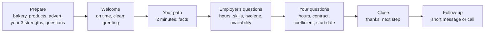

# 20.3 · Finding a Job and Getting Hired

Bakeries in France are short of bakers, but an employer still chooses between candidates, and a contract still has to be the right one. This lesson covers where bakery jobs are found, what France Travail expects from a jobseeker, how to write a French CV and cover letter, how an interview runs, and which employment contract fits which situation. You finish with your own CV, letter and interview notes for a real-format job advert.

## Why it matters

The référentiel asks you to select job offers, write a CV and a cover letter, prepare an interview and identify the contract that fits a situation (S5.2); EP1 questions use job adverts and contract extracts as documents (see [The CAP Boulanger Exam](../../references/cap-exam.md#ep1-written-test-on-technology-applied-science-and-management)). In real life, the first job after the CAP is often found through a placement, an apprenticeship or a direct visit to the fournil. Knowing the difference between a CDD that is legal and one that is not, or between a trial period of one month and one of four, protects you from day one.

## Key terms

| French | Say it | English meaning |
|---|---|---|
| marché du travail | *mar-SHAY dü trah-VAH-yuh* | labour market: job offers (employers) meet job seekers |
| population active | *po-pü-la-SYOHN ak-TEEV* | labour force: people in work plus unemployed people looking for work |
| offre d'emploi | *OF-ruh dahm-PLWAH* | job advert |
| candidature spontanée | *kahn-dee-da-TÜR spohn-ta-NAY* | unsolicited application |
| lettre de motivation | *LET-ruh duh mo-tee-va-SYOHN* | cover letter |
| entretien d'embauche | *ahn-truh-TYAN dahm-BOHSH* | hiring interview |
| CDI / CDD | *say-day-EE / say-day-DAY* | permanent contract / fixed-term contract |
| intérim | *an-tay-REEM* | temporary agency work |
| contrat d'apprentissage | *kohn-TRAH da-prahn-tee-SAHZH* | apprenticeship contract (work + CFA training) |
| période d'essai | *pay-RYOD day-SAY* | trial period: either side can end the contract simply |

## How it works

### The bakery labour market

The **labour force** is everyone in work plus the unemployed who are looking for work. On the **labour market**, employers offer jobs and jobseekers offer their work; when the two do not match (wrong place, wrong hours, wrong skills) there are unfilled jobs and unemployed people at the same time. Bakery is a clear case: in its 2024 survey the CNBPF counted **29,029 vacancies** in craft bakery-pâtisseries, **9,745 of them for boulangers**, partly because night and weekend hours put candidates off. For a CAP holder this means bargaining power, but employers still choose the candidate who is reliable, punctual and can show real skills.

**Actors and channels:**

| Channel | How it works for a baker |
|---|---|
| **France Travail** (public employment service) | job offers, registration as a jobseeker, advice; an employer can search your profile |
| **Apprenticeship and CFA** | the bakery employs you while the CFA trains you (below) |
| **Placement (PFMP) or work experience** | many first jobs come from a placement that went well |
| **Agences d'intérim** | temporary missions, often to cover holidays or peaks |
| **Trade bodies and network** | the CNBPF's departmental groupings, trade shows and competitions, former trainers |
| **Direct application** | a CV handed in at the shop or the fournil, best outside rush hours |

### Registering as a jobseeker: rights and duties

France Travail registers people of working age (from 16) who look for work, declare an address in France and can prove their identity; **foreign workers need a residence permit that allows them to work**. Registration is online, together with the request for unemployment benefit (ARE), which depends on conditions. Duties: **update your situation every month between the 28th and the 15th**, report any change, and sign and follow your **contrat d'engagement** (job-search steps, appointments, training).

> [!IMPORTANT]
> If you are not a national of the EU, the EEA or Switzerland, an employer in France must in principle obtain a **work authorisation** before hiring you, unless your visa or residence permit already allows work (Service-Public F2728, verified 18 June 2026). Check your own situation before applying; this course cannot advise on immigration.

### The CV and the cover letter

There is no legal model; employers expect a short, clear document.

| CV section | What a bakery employer looks for |
|---|---|
| Header | name, phone, e-mail, town; the job you want ("Ouvrier boulanger — CAP Boulanger en préparation") |
| Expérience professionnelle | most recent first: dates, bakery, town, tasks with numbers ("pétrissage de 25 kg de farine, façonnage de 300 baguettes par nuit") |
| Formation | CAP preparation, training, placements, hygiene training |
| Compétences | products you can make (pain courant, tradition, croissant), machines (spiral mixer, sheeter, deck oven), hygiene and allergen rules |
| Langues, informations | languages, driving licence (useful for night starts), availability (nights, weekends) |

One page is enough for a beginner. You do **not** have to give a photo, your age, your family situation, religion or health: the law says information asked of a candidate must only serve to assess the ability to do the job and have a direct, necessary link with it (L1221-6), and lists forbidden grounds of discrimination such as origin, sex, age, family situation, pregnancy, religion, physical appearance, surname, place of residence and health (L1132-1).

The **cover letter** (one page) answers three questions in three paragraphs: **you** (why this bakery: its products, its reputation, the advert), **me** (what I can bring: skills and facts from the CV, not a copy of it), **us** (what we can do together: availability, request for an interview or a trial morning). Formal French, no spelling mistakes, the employer's name spelt right.

### The interview

Attitudes that help: punctuality (in a bakery, lateness at 4:00 is a real problem), a firm greeting, honest answers about what you can and cannot yet do, concrete examples, questions about the work. To avoid: criticising former employers, vague answers, phone on the table, familiar language ("tu", slang) unless invited. You may decline to answer a question with no link to the job (family plans, religion): a polite "I would rather talk about the job" is enough.

### The contracts

| Contract | When it is used | Key rules (checked 2026-10-09) |
|---|---|---|
| **CDI** | the normal and general form of employment (L1221-2) | no end date; trial period only if written in the contract: at most **2 months** for ouvriers and employés, renewable once only if a branch agreement allows it; the bakery convention sets **30 days** |
| **CDD** | only for a temporary need: replacing an absent employee, temporary increase in activity, seasonal work… Never for a permanent job of the normal activity | **written** and given within **2 working days**; general maximum **18 months**; end-of-contract indemnity of at least **10 %** of total gross pay, except in listed cases (seasonal, student holiday job, CDI refused, hired on CDI…) |
| **Intérim** | an agency employs you and places you with a bakery for a mission | for temporary needs, like a CDD; your employer is the agency |
| **Contrat d'apprentissage** | to prepare a diploma (CAP) while working; age **16-29** in general | **6 months to 3 years**; minimum pay a percentage of the SMIC by age and year (lesson [20.4](lesson-04.md)); CFA hours count as working time; minors have stricter hours |
| **Contrat de professionnalisation** | work-and-train contract for a qualification, also used for adults | listed in the référentiel; ask the employer or France Travail for its current rules |

**Before day one**, the employer must declare the hiring to the social bodies (DPAE: no hiring before this nominative declaration, L1221-10), and the bakery convention requires a hiring slip with your name, the start date of the trial period and your **coefficient** (your grade, which sets your minimum pay).

## Worked example

Advert on France Travail, 9 October:

> **Boulangerie Le Fournil d'Amboise (37) recherche ouvrier boulanger (H/F).** CDD de 5 mois, remplacement d'un salarié en congé maladie. 35 h par semaine, du mardi au samedi, 4 h 00 – 11 h 00. Coefficient 160. CAP Boulanger exigé ou en cours. Pain courant, tradition, viennoiserie. Permis B souhaité. Candidature: CV + lettre à fournil.amboise@exemple.fr.

**1. Is the CDD legal?** Yes: replacing an absent employee is a permitted case. A CDD "to see if the job works out" for the normal production would not be.

**2. What must the contract contain?** A written contract given within 2 working days, with the reason (replacement of a named employee), the end date or the end of the absence, the trial period if any, the coefficient and pay.

**3. Pay and end.** Coefficient 160 is the bakery convention's grade for a CAP holder (lesson 20.4 gives its hourly minimum). At the end of the 5 months, unless the employer offers a CDI and the employee accepts (or refuses a similar one), the employee receives the **10 % end-of-contract indemnity** on the total gross pay.

**4. Fit with your profile.** Nights from 4:00 (are you available? transport at 3:30?), products you have practised (Modules 8-12), "CAP en cours" accepted.

**5. Plan.** CV with the three products and the machines you have used; letter mentioning the replacement and your availability from the start date; interview questions: who will train you on the house formulas, are hours ever before 4:00, is a CDI possible after?

**6. Which contract fits?** Three more cases:
- a 17-year-old who wants to prepare the CAP while working → contrat d'apprentissage;
- a bakery opening a second shop and hiring its permanent tourier → CDI;
- extra hands for the two weeks before Christmas → CDD for a temporary increase in activity, or intérim.

## Practice

You prepare a complete application for the advert of the worked example (or a real advert you find), then rehearse the interview.

### You need

- A computer or paper, 2-3 hours over two days; a friend or a phone recorder for the interview.
- An advert: the one above, or a real one from France Travail or a bakery's window.
- Professional equivalent: the advert, your CV and letter, the convention collective and a list of questions for the employer.

### Steps

1. **Read the advert** and underline: contract, reason, hours, products, requirements, how to apply.
2. **Write your CV** in French, one page, with the five sections of this lesson. Use numbers for what you have done (batches, products, kg), even at home: "pratique à domicile: 40 fournées documentées (pain courant, tradition, croissants)".
3. **Write the letter** in three paragraphs (vous / moi / nous), formal French, 200-250 words.
4. **Check both** against L1221-6 and L1132-1: remove anything with no link to the job that you do not want to give.
5. **Prepare the interview:** a 2-minute presentation; answers to six likely questions (Why bakery? Why us? Your hours? A problem you solved at the bench? Hygiene rules you follow? When can you start?); three questions of your own.
6. **Rehearse aloud** twice, once recorded. Listen: time, filler words, register.
7. **Choose the contract** for the four situations of the worked example's step 6 without looking, then check.

### Targets

- CV: one page, every experience with a date and a fact; no spelling mistakes (have someone read it).
- Letter: three paragraphs, 200-250 words, the bakery's name and the advert cited.
- Presentation: 1 min 45 to 2 min 15.
- Contract choices: 4 out of 4.

### How you know it worked

A bakery owner reading your CV in 30 seconds can say what you can make, on which machines, and when you are available; your letter could only have been written for this bakery; and you can say in one sentence why a CDD is legal or not for a given reason.

### In Israel

French employers read French CVs: write yours in French even if your experience is in Israel, and translate job titles into the French trade terms of this course (a *ofe* אופה, baker, in a *ma'afiya*, becomes "ouvrier boulanger" if you made the bread, "aide-boulanger" if you assisted). Give the town and "Israël", dates in French order (2025 – 2026), phone with the +972 prefix and e-mail. Translate diplomas and training certificates; for a French employer, a short line on what the training covered (hours, products) helps more than the Hebrew name. Military or national service can be listed briefly if it shows responsibility, or left out: it is your choice. Practise the interview by video call with a French speaker if you can, at the hour a French bakery owner would call (Israel is usually one hour ahead of France). Work authorisation for France (see the box above) is the first thing to check, before the first application.

### Self-check

- [ ] I can name four channels for finding a bakery job and the role of France Travail.
- [ ] I know the jobseeker's main duties (monthly update, contrat d'engagement).
- [ ] My CV is one page, in French, with facts and numbers, and no information I do not need to give.
- [ ] My letter follows vous / moi / nous and names the bakery.
- [ ] I can choose CDI, CDD, intérim or apprenticeship for a situation and state the CDD's key rules.

## What goes wrong

| Symptom | Likely cause | Fix now | Prevent next time |
|---|---|---|---|
| No reply to many applications | Same generic letter sent everywhere; CV without facts | Rewrite the "vous" paragraph for each bakery; add numbers | One letter per advert; hand in the CV in person outside rush hours |
| Offered a CDD "to replace nobody" for the normal production | Employer uses a CDD for a permanent job | Ask the reason written in the contract; get advice (union, labour inspectorate) | Check the CDD reason before signing |
| Trial period of 4 months in a first CDI | Maximum and renewal confused | Initial maximum for an ouvrier is 2 months; the bakery convention says 30 days | Read the convention's article on the trial period |
| Interview question about plans for children | Question with no link to the job | Decline politely and bring the talk back to the job | Know L1221-6 and L1132-1 |
| CDD ended with no 10 % indemnity | Indemnity forgotten, or an exception applies | Check the last payslip; ask the employer which exception they rely on | Know the exceptions (CDI offered and refused, seasonal, apprenticeship…) |

## Review

- Bakery jobs are found through France Travail, apprenticeships, placements, agencies, the trade network and direct applications; the trade is short of bakers.
- A jobseeker registered with France Travail updates the situation monthly and follows a contrat d'engagement; non-EU nationals need a work authorisation or a permit that allows work.
- CV: one page, facts and numbers; letter: vous / moi / nous; interview: prepare, be on time, give examples, ask about hours and contract.
- CDI is the normal contract; CDD only for temporary needs, written within 2 working days, 18 months max, 10 % indemnity at the end; apprenticeship combines work and CFA.
- Job-search and contract questions are part of EP1 applied management; see [The CAP Boulanger Exam](../../references/cap-exam.md).
