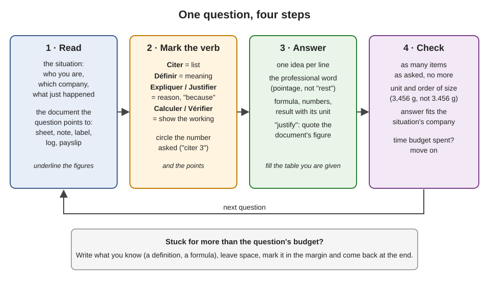
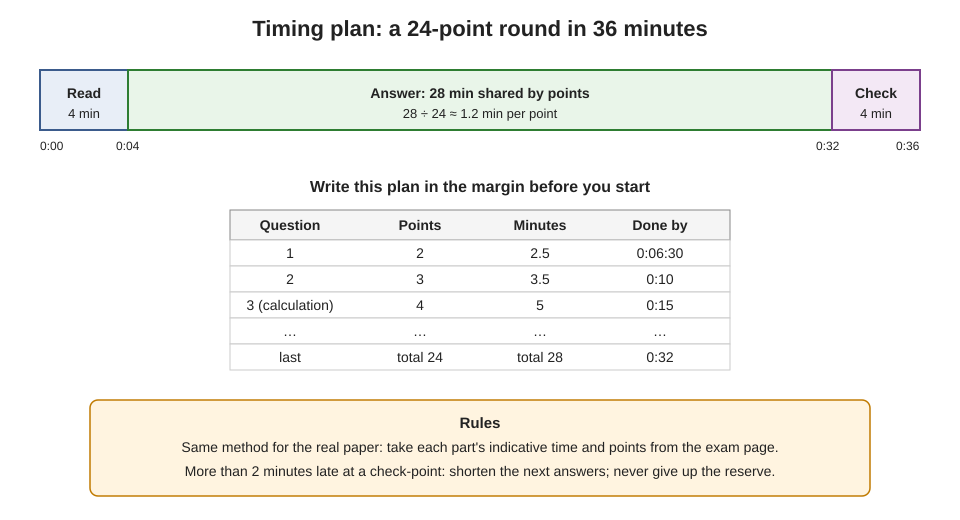

# 21.1 · How EP1 Works and How to Answer

Knowing the content is half of a written test; the other half is giving the marker what each question asks, in the time you have. This lesson teaches the answering technique for EP1-style questions: reading the situation and its documents, decoding the command verb, setting out calculations, and planning your time by points. You finish by writing your own timing plan and sitting a short diagnostic round.

## Why it matters

The EP1 written test asks you to use everything from Modules 1–20 on paper, from one company situation and its documents. Its structure, parts, durations and marks are on [The CAP Boulanger Exam](../../references/cap-exam.md#ep1-written-test-on-technology-applied-science-and-management); this lesson does not repeat them, so open that page now and keep it beside you. Candidates lose marks less often from not knowing than from answering a different question: giving two items when three are asked, explaining when asked to define, writing a result with no working or no unit, or running out of time with a whole part blank. Each of those slips is a habit, and habits are fixed by practice, which is what the five timed rounds of this module (21.2–21.6) and the mock paper of the project are for.

> [!NOTE]
> This module is practice, not reading. Reading model answers is not the same as writing your own under time: sit each round with a timer, on paper, before you open the marking guide. The Academy cannot read or grade your written answers; mark them yourself honestly with the guide, and remember that self-assessment does not replace the official exam.

## Key terms

The command verb at the start of each question tells you what kind of answer earns the marks.

| French | Say it | English meaning |
|---|---|---|
| citer | *see-TAY* | list: name the items asked, one per line, no explanation needed |
| définir | *day-fee-NEER* | define: give the precise meaning in one or two sentences |
| expliquer | *eks-plee-KAY* | explain: say how or why it happens, with "because" or "so" |
| justifier | *zhüs-tee-FYAY* | justify: support an answer with a reason, usually a fact or figure from the document |
| identifier / relever | *ee-dahn-tee-FYAY / ruh-luh-VAY* | identify / pick out: find and copy the item from the document |
| calculer / vérifier | *kal-kü-LAY / vay-ree-FYAY* | calculate / check: show the working, then state the result or whether it is correct |
| compléter / associer / relier | *kohn-play-TAY / a-so-SYAY / ruh-LYAY* | complete (a table) / match / link with arrows |
| préciser / indiquer | *pray-see-ZAY / an-dee-KAY* | state / indicate: a short, exact answer |
| barème | *ba-REM* | marking scale: the points given for each question |
| situation professionnelle | *see-tü-a-SYOHN pro-fe-syo-NEL* | the company scenario that opens the paper and runs through it |

## How it works

### What an EP1-style paper looks like

The paper opens with a **professional situation**: a named bakery, its identity card, its staff and you in it (in the 2019 paper, a bakery in Bayonne run by its gérant, with a pastry worker, two bakery workers and trainees). Every question then starts from a short scene in that bakery ("the manager asks you to brief the trainee…") and usually a **document**: a technical sheet with blanks, a supplier's data sheet, a cleaning-product label, an appliance rating plate, an extract of a law, a timesheet. You answer **on the paper**, in boxes, lines and tables. The question forms you will meet:

| Form | What you do | Trap |
|---|---|---|
| Open line ("Citer 3…", "Définir…") | write the items or the definition | wrong number of items; vague words |
| Table to complete | fill every cell asked | leaving one column empty |
| Matching ("Associer", "Relier") | arrows or letters between two lists | two arrows from one item when one is asked |
| Selection ("Sélectionner", "Entourer", tick boxes) | tick or circle the right statements | ticking all "to be safe": wrong ticks cost |
| Document to annotate ("Replacer…", fill the stage names on a sheet) | place given words where they belong | moving words that were already placed |
| Check ("Vérifier… Justifier") | say correct / not correct for each line and why | answering "no" with no figure |

The questions follow the order of the savoirs the paper covers, and every question in this module's rounds names the lesson that teaches it.

### Decode the verb, then answer exactly that

| The question says | A full-mark answer | A half-mark answer |
|---|---|---|
| *Citer deux rôles du sel.* | "Strengthens the gluten (tighter dough). Slows fermentation." | "Salt gives taste and is important for the dough." (one role, one vague phrase) |
| *Définir le pointage.* | "Pointage: the first fermentation, of the whole dough in bulk, between the end of mixing and dividing." | "When the dough rises." |
| *Expliquer pourquoi la croûte colore.* | "Once the surface is dry it passes 100 °C; sugars and proteins react (Maillard reactions), then sugars caramelise, so it browns." | "Because the oven is hot." |
| *Justifier votre décision* (cream delivered at 9 °C) | "Refused: 9 °C is above the +7 °C limit for very perishable products at reception." | "Refused because it is too warm." (no figure, no limit) |

Write in short lines, one idea per line. Use the **professional term** (pointage, apprêt, frasage, DLC) rather than everyday words: the référentiel asks for it (C4.3) and markers look for it. On the day the paper is in French; in this module's rounds, answer in French if you can, otherwise in English with the French terms.

### Show every calculation

A calculation question gives marks for the method as well as the result. Set it out in four lines, always in the same order:

1. **Formula** in words or symbols: water temperature = base − flour − room − pre-ferment − friction factor.
2. **Figures**, with units, put into the formula: 4 × 24 = 96; 96 − 21 − 23 − 6 − 26.
3. **Result** with its unit and sensible rounding: **20 °C**.
4. **Conclusion** in a sentence that answers the question: "Use water at 20 °C; the tap at 17 °C is too cold, so warm part of it."

Rounding: weights to the gram (or 5 g for large batches), temperatures to the degree, money to the cent, percentages to one decimal. Before you move on, check the order of size: 3,456 g of water for 5.4 kg of flour is right; 345.6 g is not.

### Read documents before questions

Before the first question, read the whole situation and skim every document once, asking four things of each: **what type** (order, delivery note, invoice, sheet, label, log), **who issued it**, **what date**, **which figures and units**. Underline the figures. Many questions compare two documents (order against delivery note, timesheet against the overtime rule, label against the law): go line by line and write the difference with both figures.

### Plan your time by points

Points tell you how much time a question deserves. The method, shown here for this module's 24-point practice round:

1. Take the time and points of the round (for the real paper, each part's indicative time and points are on the exam page).
2. Keep about a **tenth** of the time for reading at the start and a **tenth** as a reserve at the end.
3. Share the rest by points: minutes per point = answering time ÷ points.
4. Write in the margin the clock time at which each question should be finished. Check the clock at each one. More than two minutes late: shorten the next answers; do not eat the reserve.

The times printed on a paper are indicative (the 2019 cover says « à titre indicatif »): minutes saved on one part can be spent on another, and minutes lost are lost everywhere. Read the cover's instructions on the day; where nothing prevents it, decide in advance which part you take first, then keep strictly to the plan.

## Worked example

Practice round 21.3 (Techniques and Equipment) is worth 24 points in the course's suggested 36 minutes. Its question 3 reads: « *Calculer la température de l'eau de coulage. Données : TPV 24 °C ; farine 21 °C ; fournil 23 °C ; pâte fermentée 6 °C ; facteur de friction 26.* (4 points) »

**Timing.** 36 minutes: 4 to read, 4 in reserve, 28 to answer. 28 ÷ 24 ≈ 1.17 minutes per point; question 3 is worth 4 points: about **5 minutes**. Questions 1 and 2 (2 + 3 points, about 6 minutes) come first, so question 3 starts at about 0:10 and must be finished by **0:15**.

**Verb.** *Calculer*: working and result. Four points: probably formula, figures, result, and a correct number of factors.

**Answer, as written on the paper:**

- Pâte fermentée is used, so 4 factors (lesson [05.3](../module-05/lesson-03.md)).
- Base = TPV × 4 = 24 × 4 = 96.
- Water = base − flour − room − pâte fermentée − friction factor = 96 − 21 − 23 − 6 − 26 = **20 °C**.
- The water must be at 20 °C.

**Check.** One result, unit °C, order of size plausible (bakery water usually 5–25 °C). Time spent: 4 minutes. Move on.

**What a typical half-mark answer looks like:** "3 × 24 = 72; 72 − 21 − 23 − 26 = 2 °C." Three factors with a pre-ferment, and an implausible 2 °C that should have triggered a check.

## Practice

### You need

- A printed or open copy of [The CAP Boulanger Exam](../../references/cap-exam.md), paper, pen, a calculator without memory (or your phone in airplane mode used only as a calculator), a timer.
- About 60 minutes: 15 for the timing plan, 18 for the diagnostic round, 15 for marking, 10 for your error list.
- Professional equivalent: the real paper on the day, with the calculator rules printed on its cover.

### Steps

1. **Your timing plan for the real paper.** From the exam page, copy each part, its indicative time and its points into a table. For each part calculate the reading time (a tenth), the reserve (a tenth), the answering time and the minutes per point. Decide the order in which you will take the parts and write why.
2. **Diagnostic round (18 minutes, 12 points).** Set a timer and answer on paper, without notes:

> **Situation.** Vous êtes ouvrier boulanger chez Au Pain de la Halle, SARL, Tours (gérante : Mme Lebrun). Ce matin vous formez Inès, l'apprentie.
>
> **D1 — Bon de livraison Crèmerie Val de Loire, 6 h 10 :** crème UHT 35 % 6 × 1 L ; beurre de tourage 82 % 2 × 5 kg, relevé 6 °C ; lait entier pasteurisé 10 × 1 L, relevé 9 °C.
>
> **Q1** (1 pt) *Définir* « apprêt ». — Define "apprêt".
> **Q2** (2 pts) *Citer* deux rôles de l'eau dans la pâte. — List two roles of water in the dough.
> **Q3** (2 pts) À partir de D1, *indiquer* la décision pour le lait et *justifier*. — From D1, state the decision for the milk and justify it.
> **Q4** (3 pts) *Calculer* la masse de farine pour 30 baguettes de 350 g sur la fiche PC-02 (total 182,3 %), pertes de pâte 2 %. — Calculate the flour for 30 baguettes of 350 g on sheet PC-02 (total 182.3 %), with 2 % dough losses.
> **Q5** (2 pts) *Expliquer* à Inès pourquoi on ne garde pas le pain au réfrigérateur. — Explain to Inès why bread is not kept in the fridge.
> **Q6** (2 pts) *Citer* les quatre facteurs du cercle de Sinner. — List the four factors of Sinner's circle.

3. **Mark yourself** with the guide below. Give each point only if your answer contains what the guide names.
4. **Error list.** For every point lost, write one line: question, what was missing (item, unit, working, figure, verb misread, time), and the habit you will change. Keep this list: you add to it after every round of this module.

Marking guide: diagnostic round

| Q | Points | Model answer | Lesson |
|---|---|---|---|
| 1 | 1 | The final proof: fermentation of the shaped pieces, from shaping to loading in the oven. | [04.4](../module-04/lesson-04.md) |
| 2 | 2 (1 each) | Any two: hydrates the flour so gluten can form; dissolves salt and sugar and lets yeast work; sets dough consistency; adjusts dough temperature. | [02.4](../module-02/lesson-04.md) |
| 3 | 2 | Refuse the milk (1); 9 °C is above the +7 °C limit at reception for a very perishable product, written on the delivery note before signing (1). | [17.7](../module-17/lesson-07.md) |
| 4 | 3 | Dough = 30 × 350 = 10,500 g (1); with 2 % losses 10,500 × 1.02 = 10,710 g (1); flour = 10,710 × 100 ÷ 182.3 ≈ **5,875 g**, about 5.9 kg (1). | [06.2](../module-06/lesson-02.md) |
| 5 | 2 | Staling is starch retrogradation (1); it is fastest at fridge temperature, so the crumb firms quicker in the fridge than at room temperature (1). | [07.5](../module-07/lesson-05.md) |
| 6 | 2 (½ each) | Temperature, mechanical action, concentration (of the product), contact time. | [17.4](../module-17/lesson-04.md) |

Common slips: Q3 "accept, it's milk" (pasteurised milk is very perishable); Q4 flour = dough × 100 ÷ 100 (forgetting the formula total) or losses ignored; Q6 "water" instead of temperature.

### In Israel

Sitting the CAP Boulanger from Israel is a logistics project; the rules are the French exam services', and they are set by each académie (checked 2026-10-09):

- **Registration** is done online on Cyclades, the French exam services' candidate portal, during the académie's window (for the Île-de-France SIEC, 14 October to 18 November 2026 for the 2027 session, with the signed file posted by 23 November). Create the account early: the e-mail address is your login for the whole year.
- **Which académie:** the SIEC page states its candidates must live in the académies of Créteil, Paris or Versailles. If you live in Israel, write to the exam division (DEC) of the académie you intend to sit in **before** its window opens and ask whether it accepts your registration and where the tests are held. Cite your situation exactly: candidat individuel, CAP Boulanger, resident abroad.
- **Sitting:** all tests are taken in person in France, at the place and time on your convocation, which appears in your Cyclades space. Book travel only once the convocation is there: written and practical tests can fall on different days and in different places. Arrive the day before; Israel is usually one hour ahead of France.
- **Calculator:** the SIEC allows calculators when the paper permits it, either without memory or in exam mode. Practise all rounds of this module with the calculator you will take.
- Exemptions and documents: see the exam page; only the académie can confirm them for your file.

### Targets

- A timing plan for the real paper with minutes per point for each part and the finish times written out.
- Diagnostic round finished within 18 minutes; at least 9 of 12 points.
- Every calculation in four lines (formula, figures, result with unit, conclusion).

### How you know it worked

You can look at any question and say in five seconds what its verb asks, how many items, and how many minutes it deserves; your error list names the habits behind your lost points, not just the wrong answers.

### Self-check

- [ ] I have the exam page open beside me and copied the parts, times and points into my own plan.
- [ ] I can say what citer, définir, expliquer, justifier and vérifier each expect.
- [ ] My calculations show formula, figures, result with unit and a conclusion.
- [ ] I finished the diagnostic round on time and marked it honestly with the guide.
- [ ] I started my error list.

## What goes wrong

| Symptom | Likely cause | Fix now | Prevent next time |
|---|---|---|---|
| Two items given where three are asked | Number in the question not circled | Add the missing item in the margin with an arrow | Circle the number in every question before you write |
| Long paragraph for a *définir* question, still half marks | Explaining instead of defining | Rewrite the first line as "X: …" in one sentence | Start every definition with the term and a colon |
| Correct result, low marks | No formula or working shown | Add the formula line above the result | Always four lines: formula, figures, result, conclusion |
| Last part blank | No time plan; stuck on one question | Write short answers to the remaining questions in the reserve | Margin plan with finish times; leave and come back |
| "Justify" answered with an opinion | No figure taken from the document | Quote the document's figure and the rule | Underline figures when you first read the documents |
| Everyday words ("rest", "rise") where a term exists | Vocabulary not automatic | Replace with pointage, détente, apprêt | Drill the glossary terms of [19.4](../module-19/lesson-04.md) |

## Review

- One company situation runs through the paper; every question starts from a scene and usually a document. Read all the documents first and underline the figures.
- The command verb sets the answer: citer lists, définir defines, expliquer and justifier give reasons (justify with a figure), calculer and vérifier show working.
- Calculations in four lines, with units and an order-of-size check.
- Time by points: a tenth to read, a tenth in reserve, the rest shared by points, finish times in the margin.
- Times, points and structure of the real paper: [The CAP Boulanger Exam](../../references/cap-exam.md). Rounds 21.2–21.6 practise each domain; the [mock paper](../../projects/m21-ep1-mock-paper.md) puts them together.
