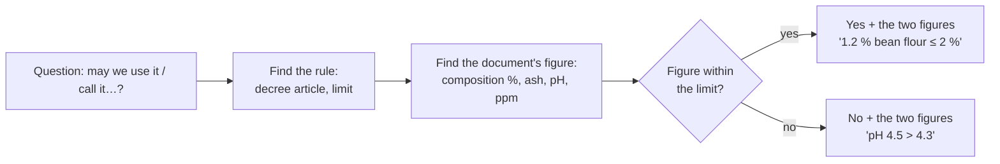

# 21.2 · EP1 Round: Professional Culture and Raw Materials

This is the first timed round of EP1-style questions, on professional culture (S1) and raw materials (S2): the chain from wheat to bread, legal names, flour data, improvers, yeast, levain and the enrichments of viennoiserie. You read a short method for questions built on supplier documents, then sit a 24-point round in 36 minutes from three documents of Au Pain de la Halle and mark it with the guide.

## Why it matters

The technology part of the paper must question S1, S2 and S3 (see [The CAP Boulanger Exam](../../references/cap-exam.md#ep1-written-test-on-technology-applied-science-and-management)), and S1 and S2 questions come with documents a bakery really receives: a mill's product sheet, an improver's label, a laboratory report. The 2019 paper asked candidates why local products serve sustainable development, to define two legal names, to complete the composition of a T55 flour and to give two roles of milk, salt and sugar in a viennoiserie dough. These questions reward exact figures (2 %, 0.3 %, pH 4.3, 900 ppm, ash per type) more than long sentences, and a candidate who has the figures can answer them in a minute each.

## Key terms

| French | Say it | English meaning |
|---|---|---|
| fiche produit (fiche technique fournisseur) | *feesh pro-DÜEE* | supplier's product data sheet: composition, analyses, storage |
| taux de cendres | *toh duh SAHN-druh* | ash content: minerals left after burning; gives the flour type |
| taux d'humidité | *toh dü-mee-dee-TAY* | moisture content of the flour |
| force boulangère (W) | *FORS boo-lahn-ZHAIR* | baking strength measured by the alveograph |
| améliorant | *a-may-lyo-RAHN* | bread improver: a blend of additives, adjuvants and processing aids |
| additif / adjuvant / auxiliaire technologique | *a-dee-TEEF / ad-zhü-VAHN / ok-see-LYAIR* | additive / adjuvant / processing aid: the three legal categories of correcting products |
| appellation | *a-pe-la-SYOHN* | legal or protected name of a product |
| analyse de laboratoire | *a-na-LEEZ duh la-bo-ra-TWAR* | laboratory report, e.g. pH and acetic acid of a crumb |
| filière blé-farine-pain | *fee-LYAIR blay-fa-REEN-PAN* | the wheat–flour–bread chain: farmer, collector, miller, baker |

## How it works

### What S1 and S2 questions ask, and where you learned it

| Savoir | Typical question | Figures or words the marker looks for | Lesson |
|---|---|---|---|
| S1.1 sustainable development | why a local mill, what to do with unsold bread | transport, local jobs, traceability; reduce, give, reuse in pain courant, sort biowaste | [18.2](../module-18/lesson-02.md) |
| S1.2 chain and businesses | place a mill, a craft bakery, a dépôt | farmer → collector → miller → baker; 10.71C, 10.71A, 47.24Z | [02.1](../module-02/lesson-01.md), [20.1](../module-20/lesson-01.md) |
| S1.4 legal names | may this bread be called tradition / maison / au levain? | art. 1–4 of décret 93-1074 with their limits | [09.1](../module-09/lesson-01.md) |
| S2.1 flour | type from ash, meaning of moisture, protein, W | T45 < 0.50 %, T55 0.50–0.60 %, T65 0.62–0.75 %… | [02.2](../module-02/lesson-02.md), [02.3](../module-02/lesson-03.md) |
| S2.1 water, salt, yeast, levain | roles; fresh to dry yeast; storage | two roles each; ×0.33 for instant; 0–4 °C | [02.4](../module-02/lesson-04.md)–[02.7](../module-02/lesson-07.md) |
| S2.2 enrichments | two roles of butter, eggs, sugar, milk | extensibility, softness, colour, emulsifier… | [02.8](../module-02/lesson-08.md) |
| S2.4 improvers | classify an améliorant's ingredients | E300 additive; gluten, bean, malt, deactivated yeast adjuvants; fungal amylase processing aid | [02.9](../module-02/lesson-09.md) |

### Reading a supplier document for a "may we…?" question

Every "may we" answer has three parts: the decision, the document's figure, the rule's limit. "Yes, it is a good flour" scores nothing; "Yes: bean flour 1.2 % and malt 0.2 % are within 2 % and 0.3 %, and there is no additive (décret 93-1074, art. 2)" scores everything.

### Roles of ingredients: role plus mechanism

When a question asks for roles, give the effect on the dough or bread and, if space allows, the reason in a few words: "Butter: makes the dough more extensible (coats the gluten); gives a soft crumb and slows staling." Two clear roles beat five vague ones ("gives taste, is good").

## Worked example

Question 9 of the round below, from document D4: « Le laboratoire a analysé la mie du pain de campagne : pH 4,5 ; acide acétique 700 ppm. Peut-on l'appeler "pain de campagne au levain" ? Justifier. (2 points) »

1. **Verb and points:** *justifier*, 2 points: a decision and a reason with figures; about 2.5 minutes.
2. **Rule:** décret 93-1074, art. 3: "au levain" needs a crumb **pH ≤ 4.3** and **at least 900 ppm** of acetic acid from the fermentation.
3. **Document:** pH 4.5 and 700 ppm.
4. **Answer:** "No. The pH of 4.5 is above the 4.3 maximum and the 700 ppm of acetic acid is below the 900 ppm minimum (décret 93-1074, art. 3). The name 'au levain' may not be used; 'pain de campagne' alone is allowed."
5. **Check:** decision, both figures, both limits, one useful extra line. Two points.

## Practice

### You need

- Paper, pen, calculator, timer; no notes. About 70 minutes: 36 for the round, 20 for marking, 15 for re-reading the lessons behind your lost points.
- Professional equivalent: a mill's real product sheet and the improver labels in a bakery's dry store.

### Steps

1. Read [21.1](lesson-01.md) again if needed and write your timing plan in the margin (36 minutes, 24 points).
2. Start the timer and answer every question on paper. Do not open the marking guide.
3. At 36 minutes stop, even if you have not finished. Draw a line under what you wrote.
4. Mark with the guide; write the total and add each lost point to your error list from 21.1.
5. Re-read the lesson linked next to each question you lost points on, then rewrite those answers.

### The round (36 minutes, 24 points)

> **Situation.** Au Pain de la Halle, SARL, Tours (gérante : Mme Lebrun) veut acheter sa farine de tradition au Moulin de la Choisille, à 20 km, et lancer un pain de seigle et des brioches. Vous préparez les produits et formez Inès, l'apprentie.
>
> **D1 — Fiche produit, Moulin de la Choisille : « Farine de blé pour pain de tradition française »**
> Composition : farine de blé, farine de fèves (1,2 %), farine de blé malté (0,2 %). Blé récolté en Indre-et-Loire.
> Analyses : taux de cendres 0,66 % de la matière sèche ; humidité 15,2 % ; protéines 11,3 % ; W 210 ; temps de chute de Hagberg 320 s.
> Sac de 25 kg ; DDM 6 mois ; stocker au sec, sur palette.
>
> **D2 — Étiquette « Améliorant PANIMAX » :** farine de blé, gluten de blé, farine de fèves, levure désactivée, acide ascorbique (E300), amylases fongiques. Dose : 0,5 % du poids de farine.
>
> **D3 — Fiche brioche :** farine de gruau T45 1 000 g ; œufs 500 g ; beurre 500 g ; sucre 120 g ; sel 20 g ; levure fraîche 40 g ; lait 100 g.
>
> **D4 — Analyse de laboratoire, pain de campagne de la maison :** pH de la mie 4,5 ; acide acétique 700 ppm.

In English: the bakery wants to buy its tradition flour from a mill 20 km away and launch a rye bread and brioches. D1 is the mill's product sheet (composition, ash, moisture, protein, W, falling number, storage); D2 an improver's label; D3 a brioche formula; D4 a laboratory analysis of the house campagne bread.

**1.** (2 pts) *Citer* deux actions de développement durable liées aux matières premières ou aux invendus. — List two sustainable-development actions linked to raw materials or unsold bread. → [18.2](../module-18/lesson-02.md)

**2.** (3 pts) À partir de D1, *identifier* le type de la farine et *justifier* ; *indiquer* si elle peut servir au pain de tradition française et *justifier*. — From D1, identify the flour type and justify; say whether it may be used for pain de tradition française and justify. → [02.2](../module-02/lesson-02.md), [09.1](../module-09/lesson-01.md)

**3.** (2 pts) *Expliquer* ce qu'indiquent à l'utilisateur l'humidité (15,2 %) et les protéines (11,3 %) de D1. — Explain what the moisture and the protein figures tell the user. → [02.2](../module-02/lesson-02.md), [02.3](../module-02/lesson-03.md)

**4.** (3 pts) *Classer* les constituants de D2 en additif, adjuvants et auxiliaire technologique, puis *indiquer* si PANIMAX peut entrer dans le pain de tradition. — Classify D2's ingredients and say whether PANIMAX may go into tradition bread. → [02.9](../module-02/lesson-09.md)

**5.** (2 pts) *Citer* les trois parties du grain de blé et *préciser* celle qui donne la farine blanche. — Name the three parts of the wheat grain and the one that gives white flour. → [02.1](../module-02/lesson-01.md)

**6.** (3 pts) *Compléter* : deux rôles du beurre, des œufs et du sucre dans la pâte à brioche (D3). — Give two roles each of butter, eggs and sugar in the brioche dough. → [02.8](../module-02/lesson-08.md)

**7.** (2 pts) *Expliquer* pourquoi une pâte de seigle demande une acidification (levain). — Explain why a rye dough needs acidification. → [02.2](../module-02/lesson-02.md), [02.7](../module-02/lesson-07.md)

**8.** (2 pts) La levure fraîche n'est pas livrée. *Calculer* la levure sèche instantanée qui remplace les 40 g de D3 et *indiquer* la température de stockage de la levure fraîche. — Calculate the instant dry yeast replacing 40 g of fresh yeast and state the storage temperature of fresh yeast. → [02.6](../module-02/lesson-06.md)

**9.** (2 pts) À partir de D4, *indiquer* si le pain peut être vendu « au levain » et *justifier*. — From D4, may the bread be sold as "au levain"? Justify. → [09.1](../module-09/lesson-01.md)

**10.** (3 pts) *Placer* dans l'ordre les entreprises de la filière blé-farine-pain et *indiquer* le code d'activité d'Au Pain de la Halle et celui d'une boutique qui vend du pain acheté cuit ailleurs. — Put the businesses of the chain in order and give the activity code of Au Pain de la Halle and of a shop selling bread baked elsewhere. → [02.1](../module-02/lesson-01.md), [20.1](../module-20/lesson-01.md)

Model answers and marking guide

| Q | Points | Model answer (key words the marker looks for in bold) |
|---|---|---|
| 1 | 2 (1 each) | Any two: **buy local flour** (shorter transport, less fuel and CO₂, local farmers and mill, known origin); **reduce unsold bread** by adjusting the late batches; **reuse old bread** in pain courant dough (never in tradition); **give** unsold bread to an association; **sort biowaste**. |
| 2 | 3 | **T65** (½): ash 0.66 % is within 0.62–0.75 % (½). **Yes** for tradition (1): bean flour 1.2 % ≤ 2 % and malt flour 0.2 % ≤ 0.3 % (½), **no additive** in the composition (½). |
| 3 | 2 | Moisture 15.2 %: below the 15–16 % at which flour keeps badly, so it **keeps well** and you pay for flour, not water (1). Protein 11.3 %: the **gluten-forming** proteins; a medium-strong bread flour, good gas retention for tradition (1). |
| 4 | 3 | Additive: **E300** (½). Adjuvants: **gluten**, **bean flour**, **deactivated yeast** (1 for all three). Processing aid: **fungal amylases** (½). **Not allowed in tradition** (½): it contains an additive (E300) and gluten and deactivated yeast, which article 2 does not permit (½). Wheat flour is the carrier. |
| 5 | 2 | **Bran** (enveloppes), **endosperm** (amande farineuse), **germ** (1, ⅓ each). White flour comes from the **endosperm** (1). |
| 6 | 3 (½ each) | Butter: extensible dough (coats gluten), soft crumb, flavour, slows staling. Eggs: structure (proteins set in the oven), emulsifier (lecithin of the yolk) for a fine crumb, yellow colour, part of the liquid. Sugar: sweetness, crust colour (Maillard, caramelisation), keeps the crumb moist, feeds the yeast at low doses. Any two per ingredient. |
| 7 | 2 | Rye proteins **do not form gluten**; the gas is held by sticky gums (pentosans) (1). Rye has strong **amylase** activity that would make a gummy crumb; **acidity** (levain) slows the enzymes and sets the crumb (1). |
| 8 | 2 | 40 × 0.33 ≈ **13 g** instant dry yeast (1; accept 13–14 g). Fresh yeast stored cold, **0 to +4 °C** (1). |
| 9 | 2 | **No** (1): pH 4.5 > 4.3 and 700 ppm < 900 ppm acetic acid (décret 93-1074, art. 3) (1). |
| 10 | 3 | Farmer (and collector or cooperative) → **miller** (moulin) → **baker** (1). Au Pain de la Halle: **10.71C** (craft bakery-pâtisserie that makes and sells) (1). Shop selling bread made elsewhere: **47.24Z** (1). |

Total 24. 20 or more: secure; 17–19: re-read the lessons of the questions you lost; under 17: work through those lessons' practice again before round 21.3.

Common slips: Q2 "T55 because it is white flour" (read the ash); Q4 calling gluten an additive; Q8 multiplying by 3 instead of dividing; Q9 "yes, it is made with levain" (the name depends on the analysis, not the recipe).

### Targets

- Finished in 36 minutes with every question attempted.
- At least 17 of 24 points; every "may we" answer has a decision, a figure and a limit.

### How you know it worked

You answered the legal-name and flour-sheet questions with the decree's and the type's exact figures without looking them up, and your marking found no question where you gave fewer items than asked.

### Self-check

- [ ] I sat the round on paper, timed, before opening the guide.
- [ ] I can give the flour types with their ash ranges and the tradition and au levain limits from memory.
- [ ] I can classify an améliorant's ingredients into the three categories.
- [ ] I added every lost point to my error list and rewrote those answers.

## What goes wrong

| Symptom | Likely cause | Fix now | Prevent next time |
|---|---|---|---|
| Flour type guessed from the colour or the name on the sack | Ash ranges not known | Read the ash figure and match it to the type table | Learn the six types with their ash ranges ([02.2](../module-02/lesson-02.md)) |
| "Tradition: yes, good flour" with no figures | Rule and document figure not paired | Add the decree's limit next to the sheet's figure | Use the decision–figure–limit pattern |
| Improver ingredients all called "additives" | Three legal categories mixed up | Separate E300 from adjuvants and processing aids | Memorise the classification table of [02.9](../module-02/lesson-09.md) |
| Fresh-to-dry conversion three times too high | Multiplied instead of divided | Instant ≈ fresh × 0.33 | Check the order of size: dry yeast is the smaller number |
| Out of time on the last question | Long answers to early 2-point questions | Answer the last question in key words | Margin plan; one idea per line |

## Review

- S1 and S2 questions are built on supplier documents: read the figure, find the rule, give both.
- Know the flour types by ash, the tradition limits (bean 2 %, soy 0.5 %, malt 0.3 %, no additive, no freezing) and the au levain criteria (pH ≤ 4.3, ≥ 900 ppm acetic acid).
- An améliorant mixes an additive (E300), adjuvants (gluten, bean flour, malt, deactivated yeast) and processing aids (fungal amylases): never in tradition.
- Roles of ingredients: effect plus reason, two per ingredient.
- Parts, times and marks of the real paper: [The CAP Boulanger Exam](../../references/cap-exam.md). Next round: [21.3](lesson-03.md).
