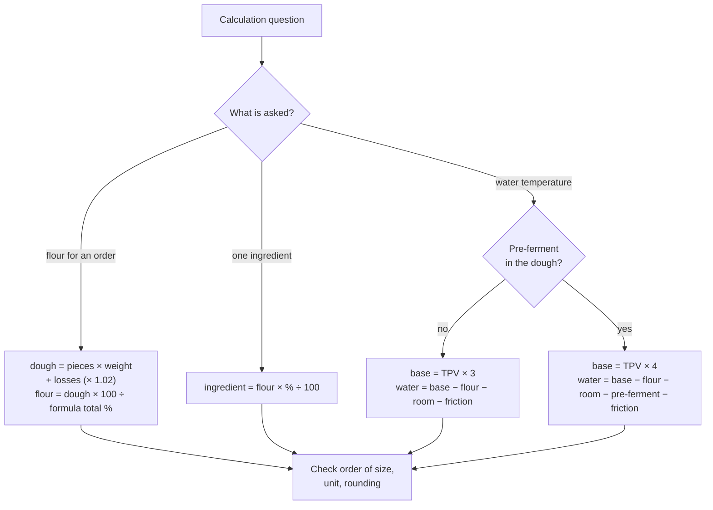

# 21.3 · EP1 Round: Techniques and Equipment

This round covers the techniques and equipment savoirs (S3): the stages of a technical sheet, batch and water-temperature calculations, mixing, fermentation methods, retarded proofing, machines and ovens. You read a short method for calculation and "role of the machine" questions, then sit a 24-point round in 36 minutes built on sheet PC-02 and a Monday order at Au Pain de la Halle, and mark it with the guide.

## Why it matters

S3 is the largest savoir of the technology part, and it is where the written test meets the work of EP2: the same sheet, the same calculations, the same words (see [The CAP Boulanger Exam](../../references/cap-exam.md#ep1-written-test-on-technology-applied-science-and-management)). The 2019 paper gave candidates a pain brioché sheet with the stage names blanked out, a water calculation from a base temperature, and asked the role of four machines and the advantages and drawbacks of three ovens. These are the questions where a candidate who has practised the calculations gains marks in minutes, and one who has not loses a whole block, because the first wrong figure carries into the next answer.

## Key terms

| French | Say it | English meaning |
|---|---|---|
| frasage | *frah-ZAHZH* | first-speed mixing that blends flour and water into a rough dough |
| pointage | *pwan-TAHZH* | bulk fermentation, between mixing and dividing |
| détente | *day-TAHNT* | rest of the divided pieces before shaping |
| apprêt | *a-PRAY* | final proof of the shaped pieces |
| ressuage | *ray-sü-AHZH* | cooling of the baked bread, when steam and alcohol leave it |
| température de base (TB) | *tahn-pay-ra-TÜR duh BAHZ* | sum of temperatures used to calculate the water temperature |
| facteur de friction | *fak-TUHR duh freek-SYOHN* | the mixing heat expressed in the base-temperature calculation |
| pousse avec blocage | *pooss a-VEK blo-KAHZH* | controlled proof: cool, hold, warm, proof by programme |
| laminoir | *la-mee-NWAR* | sheeter: rollers that thin laminated dough |
| four à sole / four ventilé | *foor a SOL / foor vahn-tee-LAY* | deck oven / convection oven |

## How it works

### Three kinds of S3 question and how to score them

| Kind | Example | What scores | Lessons |
|---|---|---|---|
| Vocabulary on a document | name the blanked stages of a sheet | the exact term, spelled correctly | [07.1](../module-07/lesson-01.md), [19.4](../module-19/lesson-04.md) |
| Calculation | flour for an order; water temperature; ingredient weights | formula, figures, result with unit, conclusion | [01.5](../module-01/lesson-05.md), [05.2](../module-05/lesson-02.md), [05.3](../module-05/lesson-03.md), [06.2](../module-06/lesson-02.md) |
| Role, comparison, diagnosis | role of a machine; deck versus convection oven; a dough that tears | role = what it does to the product; one advantage and one drawback each | [04.5](../module-04/lesson-05.md), [13.1](../module-13/lesson-01.md)–[13.4](../module-13/lesson-04.md), [16.1](../module-16/lesson-01.md) |

### Choosing the right calculation

The friction factor is the mixing heat multiplied by the number of factors; a base temperature printed on a sheet already excludes friction (lesson [05.3](../module-05/lesson-03.md)). Carry every intermediate result to the gram before rounding the final one.

### "Role of the machine" answers

A role is what the machine does **to the product**, not how it looks: "spiral mixer: mixes and kneads the dough, developing the gluten network with little heating" rather than "a big bowl with a hook". Add one safety rule when the question mentions safety or when a line is left: the sheeter's guard and emergency stop, the mixer's lid, gloves and distance at the oven.

## Worked example

Question 4 of the round below: « *Calculer la masse de farine et de sel pour la commande de lundi (D1), avec la fiche PC-02 (total 182,3 %) et 2 % de pertes. Arrondir au gramme.* (3 points) »

D1 orders 40 baguettes of 350 g and 30 petits pains of 60 g.

1. **Dough needed:** 40 × 350 = 14,000 g; 30 × 60 = 1,800 g; total **15,800 g**.
2. **With losses:** 15,800 × 1.02 = **16,116 g**.
3. **Flour:** 16,116 × 100 ÷ 182.3 = 8,840.4 → **8,840 g** of T55.
4. **Salt:** 8,840 × 1.8 ÷ 100 = 159.1 → **159 g**.
5. **Conclusion:** "Weigh 8,840 g of flour and 159 g of salt." Check: flour is a little over half the dough weight (182.3 % total), as expected.

The two slips this question is built to catch: dividing by 100 instead of the formula total (flour = 16,116 g, the whole dough), and calculating salt on the dough instead of on the flour (290 g).

## Practice

### You need

- Paper, pen, calculator, timer; no notes. About 70 minutes: 36 for the round, 20 for marking, 15 for re-reading.
- Professional equivalent: the fiche technique and the production order on the fournil wall at the start of a shift.

### Steps

1. Write your timing plan in the margin: 36 minutes, 24 points (the plan in [21.1](lesson-01.md) uses this round as its example).
2. Sit the round on paper, timed. Stop at 36 minutes.
3. Mark with the guide; add lost points to your error list.
4. Re-read the lessons linked to the questions you lost points on; redo the calculations without looking.

### The round (36 minutes, 24 points)

> **Situation.** Lundi, 3 h 30, au fournil d'Au Pain de la Halle (Tours). Karim, ouvrier boulanger, est absent ; vous faites le pain courant et vous montrez les étapes à Inès, l'apprentie.
>
> **D1 — Bon de commande du lundi :** 40 baguettes de 350 g ; 30 petits pains ronds de 60 g. Pâte PC-02.
>
> **D2 — Fiche technique PC-02 « Pain courant sur pâte fermentée » (extrait) :** farine T55 100 % ; eau 64 % ; sel 1,8 % ; levure fraîche 1,5 % ; pâte fermentée 15 % ; total 182,3 %. TPV 24 °C.
>
> | Étape | Réglage | Contrôle |
> |---|---|---|
> | (a) ……… | 4 min 1re vitesse ; pâte fermentée en fin d'étape | plus de farine sèche |
> | Pétrissage | 6 min 2e vitesse | pâte lisse, se décolle de la cuve ; 23–25 °C |
> | (b) ……… | 45 min en bac couvert, 24 °C | pâte gonflée, souple |
> | (c) ……… | pâtons pesés : 350 g et 60 g | ± 5 g / ± 2 g |
> | Boulage | mise en boule légère | régularité |
> | (d) ……… | 20 min, couvert | pâte détendue |
> | Façonnage | baguettes 55 cm ; petits pains en boule | régularité |
> | (e) ……… | 1 h 15, 25 °C, 75–80 % HR | l'empreinte du doigt revient lentement |
> | Grignage | baguettes 5 coups de lame | lame à 30–45° |
> | Cuisson | four à sole 250 °C, buée | croûte dorée, son creux |
> | (f) ……… | sur grilles, 30 min minimum | — |
>
> **D3 — Relevés du jour :** farine 21 °C ; fournil 23 °C ; pâte fermentée 6 °C ; facteur de friction du pétrin (4 facteurs) 26.
>
> **D4 — Matériel :** pétrin à spirale ; laminoir ; chambre de pousse contrôlée ; four à sole à 4 étages ; four ventilé.

In English: Monday 3:30; you make the pain courant and show the stages to Inès. D1 is the order (40 baguettes of 350 g, 30 rolls of 60 g); D2 the PC-02 sheet with six stage names blanked out; D3 today's temperature readings and the mixer's friction factor; D4 the equipment.

**1.** (2 pts) *Définir* le pointage et l'apprêt. — Define pointage and apprêt. → [04.2](../module-04/lesson-02.md), [04.4](../module-04/lesson-04.md)

**2.** (3 pts) *Compléter* les étapes (a) à (f) de D2 avec les termes professionnels. — Fill in stages (a) to (f) with the professional terms. → [07.1](../module-07/lesson-01.md), [01.6](../module-01/lesson-06.md)

**3.** (4 pts) *Calculer* la température de l'eau de coulage à partir de D2 et D3. — Calculate the water temperature from D2 and D3. → [05.3](../module-05/lesson-03.md)

**4.** (3 pts) *Calculer* la masse de farine et de sel pour D1 (pertes 2 %, arrondi au gramme). — Calculate the flour and salt for D1 (2 % losses, to the gram). → [06.2](../module-06/lesson-02.md)

**5.** (2 pts) *Citer* deux contrôles qui indiquent la fin du pétrissage. — List two checks that show mixing is finished. → [03.3](../module-03/lesson-03.md)

**6.** (2 pts) *Expliquer* la différence entre une pâte fermentée et une poolish. — Explain the difference between pâte fermentée and poolish. → [04.5](../module-04/lesson-05.md)

**7.** (2 pts) Mme Lebrun veut des baguettes cuites à 6 h sans que personne ne façonne à 3 h. *Citer* dans l'ordre les quatre phases d'un cycle de pousse avec blocage. — Name in order the four phases of a pousse avec blocage cycle. → [04.6](../module-04/lesson-06.md)

**8.** (3 pts) *Indiquer* le rôle du pétrin à spirale, du laminoir et de la chambre de pousse contrôlée (D4), et *citer* une règle de sécurité du laminoir. — State the role of three machines and one safety rule for the sheeter. → [13.1](../module-13/lesson-01.md), [13.2](../module-13/lesson-02.md), [13.3](../module-13/lesson-03.md)

**9.** (2 pts) *Citer* un avantage du four à sole pour les baguettes et un avantage du four ventilé pour les viennoiseries, puis *expliquer* pourquoi le four ventilé se règle plus bas. — One advantage of each oven, and why the convection oven is set lower. → [13.4](../module-13/lesson-04.md)

**10.** (1 pt) *Justifier* l'emploi de la buée à l'enfournement. — Justify steam at loading. → [07.4](../module-07/lesson-04.md)

Model answers and marking guide

| Q | Points | Model answer (key words in bold) |
|---|---|---|
| 1 | 2 | **Pointage:** first fermentation of the whole dough in bulk, from the end of mixing to dividing (1). **Apprêt:** final proof of the shaped pieces, from shaping to the oven (1). |
| 2 | 3 (½ each) | (a) **frasage**; (b) **pointage**; (c) **division** (pesage); (d) **détente**; (e) **apprêt**; (f) **ressuage**. Spelling must let the term be recognised. |
| 3 | 4 | Pâte fermentée: **4 factors** (1). Base = 24 × 4 = **96** (1). Water = 96 − 21 − 23 − 6 − 26 (1) = **20 °C** (1). |
| 4 | 3 | Dough 14,000 + 1,800 = 15,800 g; × 1.02 = **16,116 g** (1). Flour = 16,116 × 100 ÷ 182.3 = **8,840 g** (1). Salt = 8,840 × 1.8 % = **159 g** (1). |
| 5 | 2 (1 each) | Any two: dough **smooth** and comes away from the bowl; **windowpane** (thin translucent film without tearing); dough **temperature** 23–25 °C. |
| 6 | 2 | Pâte fermentée: a piece of **finished dough** (flour, water, salt, yeast) kept from an earlier batch, firm (1). Poolish: a **liquid** pre-ferment of **equal weights of flour and water** with a little yeast and **no salt**, made hours ahead (1). |
| 7 | 2 (½ each) | **Cooling** → **blocking** (about 2–4 °C) → gradual **warming** → **proofing** at apprêt conditions. Order required. |
| 8 | 3 | Spiral mixer: **mixes and kneads**, develops the gluten (½ + ½ for role stated on the dough). Sheeter: **rolls laminated dough** to an even thickness (½). Controlled proofer: **controls temperature and humidity** to block, hold and proof pieces by programme (½). Sheeter safety: never put a hand past the **guard**; use the **emergency stop**; stop it before cleaning (1). |
| 9 | 2 | Deck: **conduction from the hot sole** gives strong oven spring and a crust on the base (½). Convection: **even heat across several trays**, fast, suits viennoiserie (½). Set **15–20 °C lower** because the fan carries much more heat to the surface at the same setting and dries it (1). |
| 10 | 1 | Steam **condenses on the cool dough**: the surface heats fast but **stays wet and stretchy**, so oven spring lasts longer, cuts open and the crust is thin and shiny. |

Total 24. 20 or more: secure; 17–19: redo the calculations of the lessons you lost points on; under 17: rework [05.3](../module-05/lesson-03.md) and [06.2](../module-06/lesson-02.md) before round 21.4.

Common slips: Q3 three factors with a pre-ferment (gives 2 °C); Q4 dough divided by 100 instead of 182.3; Q7 phases out of order; Q8 describing the machine instead of its role.

### Targets

- Finished in 36 minutes; both calculations correct to the gram and the degree.
- At least 17 of 24 points.

### How you know it worked

You chose 4 factors for the dough with pâte fermentée without hesitating, your flour figure is a little over half the dough weight, and your machine answers say what each machine does to the dough.

### Self-check

- [ ] I can name the 18 stages' professional terms on a sheet, including frasage, détente and ressuage.
- [ ] I can calculate flour from an order with losses, and the water temperature with and without a pre-ferment.
- [ ] I can compare pâte fermentée, poolish and levain and name the four phases of blocking.
- [ ] I can give the role of the main machines and compare deck and convection ovens.

## What goes wrong

| Symptom | Likely cause | Fix now | Prevent next time |
|---|---|---|---|
| Flour equal to the dough weight | Divided by 100 instead of the formula total | Flour = dough × 100 ÷ total % | Check: flour ≈ dough ÷ 1.8 for bread |
| Water temperature near 0 °C or above 30 °C | Wrong number of factors or pre-ferment forgotten | Recount the factors; subtract the pre-ferment | Order-of-size check after every temperature calculation |
| "Apprêt" and "pointage" swapped | Stages learned by time, not by place in the process | Pointage = bulk, before dividing; apprêt = shaped pieces | Draw the 18-stage line from memory once a week |
| Machine described, no role | Answering "what is it" instead of "what does it do" | Start with a verb: "mixes", "rolls", "controls" | Use the role pattern of this lesson |
| Calculation correct, no unit or conclusion | Rushed last step | Add "g" or "°C" and one sentence | Four-line method of [21.1](lesson-01.md) |

## Review

- S3 questions: vocabulary on a sheet, calculations, and roles or comparisons of methods and machines.
- Flour = dough with losses × 100 ÷ formula total; every ingredient = flour × % ÷ 100.
- Water temperature: base = TPV × 3, or × 4 with a pre-ferment, minus every temperature and the friction factor.
- Machines by their role on the product; ovens by how the heat reaches the bread.
- Paper structure and marks: [The CAP Boulanger Exam](../../references/cap-exam.md). Next round: [21.4](lesson-04.md).
