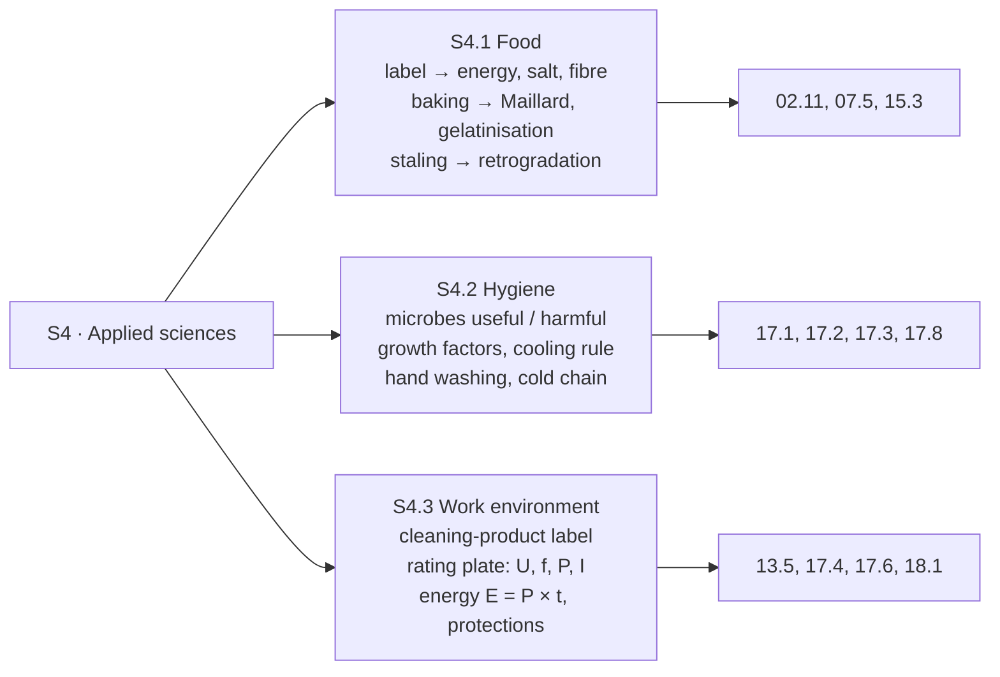

# 21.4 · EP1 Round: Applied Sciences

This round covers the applied sciences (S4): food science and nutrition, hygiene and microbiology, and the work environment (labels, cleaning products, electricity, energy, occupational health). You read how science questions are built on labels, logs and rating plates, then sit a 24-point round in 36 minutes from four documents of Au Pain de la Halle and mark it with the guide.

## Why it matters

The applied-sciences part must question each of food, hygiene and the work environment (S4.1, S4.2, S4.3; see [The CAP Boulanger Exam](../../references/cap-exam.md#ep1-written-test-on-technology-applied-science-and-management)). The 2019 paper used a breakfast and its food groups, the hand-washing steps to order and justify, a cleaning product's label with Sinner's circle to complete, and an oven's rating plate with its protection devices. None of it needs a laboratory: each answer is a figure read from a document plus one scientific reason. Candidates who lose marks here usually know the bakery practice but not the word for the science behind it (gelatinisation, Maillard, growth factors, Joule effect).

## Key terms

| French | Say it | English meaning |
|---|---|---|
| valeur énergétique | *va-LUHR ay-nair-zhay-TEEK* | energy value of a food, in kJ and kcal |
| réaction de Maillard | *ray-ak-SYOHN duh ma-YAR* | browning reaction between sugars and proteins in the crust |
| gélatinisation de l'amidon | *zhay-la-tee-nee-za-SYOHN* | starch granules swelling with water when heated: the crumb sets |
| facteurs de multiplication | *fak-TUHR duh mül-tee-plee-ka-SYOHN* | growth factors of microbes: nutrients, water, pH, oxygen, temperature, time |
| toxi-infection alimentaire | *tok-see an-fek-SYOHN* | food poisoning |
| cercle de Sinner | *SAIR-kluh duh see-NAIR* | Sinner's circle: temperature, mechanical action, concentration, time |
| plaque signalétique | *plak see-nya-lay-TEEK* | rating plate of an appliance |
| disjoncteur différentiel | *dees-zhonk-TUHR dee-fay-rahn-SYEL* | residual-current device (DDR 30 mA): cuts when current leaks to earth |

## How it works

### Where the S4 questions come from

### Four patterns that score

- **Label reading:** copy the figure, give its unit, say what it means. "Salt 1.1 g/100 g: equal to the 1.1 g maximum for pain de mie since October 2025: conforms."
- **Energy from a label:** carbohydrates and proteins about 4 kcal/g, fat about 9 kcal/g, fibre about 2 kcal/g (lesson [02.11](../module-02/lesson-11.md)). Show the sum.
- **A process explained with science:** name the transformation, its temperature, its effect. "From about 55–60 °C the starch gelatinises and the gluten sets: the foam becomes a sponge, the crumb."
- **A log or a measurement against a limit:** the reading, the limit, the action. "Core 8 °C > 7 °C: discard the creams, record, find the cause."

### Electrical quantities on a rating plate

| On the plate | Quantity | Unit | Use in a question |
|---|---|---|---|
| 230 V | voltage (tension) | volt | the supply it must be connected to |
| 50 Hz | frequency | hertz | mains frequency in Europe |
| 2.3 kW | power (puissance) | watt / kilowatt | E = P × t, energy and cost |
| 10 A | current (intensité) | ampere | I = P ÷ U; size of the protection |

## Worked example

Question 8 of the round below: « *À partir de la plaque signalétique D4, identifier les grandeurs 230 V, 50 Hz et 2,3 kW, puis calculer l'énergie consommée si la chambre de pousse fonctionne 6 h à pleine puissance et son coût à 0,20 € le kWh.* (3 points) »

1. **Quantities:** 230 V = voltage; 50 Hz = frequency; 2.3 kW = power.
2. **Energy:** E = P × t = 2.3 kW × 6 h = **13.8 kWh** (at full power; a thermostat makes the real figure lower).
3. **Cost:** 13.8 × 0.20 = **€2.76**.
4. **Check:** units kWh and euros; a proofer of a few kilowatts for a night costs a few euros, plausible. About 4 minutes.

## Practice

### You need

- Paper, pen, calculator, timer; no notes. About 70 minutes.
- Professional equivalent: the labels in the dry store, the cleaning plan, the cold-room log and the rating plates in a real bakery.

### Steps

1. Margin plan: 36 minutes, 24 points.
2. Sit the round on paper, timed; stop at 36 minutes.
3. Mark with the guide; add lost points to your error list.
4. Re-read the linked lessons; rewrite the answers you lost.

### The round (36 minutes, 24 points)

> **Situation.** Au Pain de la Halle (Tours) vend un pain de mie complet tranché, préemballé. Mardi matin, vous ouvrez le fournil avec Inès, l'apprentie.
>
> **D1 — Étiquette « Pain de mie complet » (pour 100 g) :** glucides 45 g dont sucres 4 g ; fibres 7 g ; protéines 10 g ; lipides 4 g ; sel 1,1 g. Ingrédients : farine de **blé** complète T150, eau, **beurre**, sucre, levure, sel.
>
> **D2 — Étiquette du produit d'entretien « DD 20 » :** détergent-désinfectant pour surfaces en contact avec les denrées alimentaires. Bactéricide selon NF EN 1276 en 5 min à 20 °C. Diluer à 2 % (20 mL par litre) dans de l'eau tiède. Appliquer, brosser, laisser agir 5 minutes, rincer à l'eau potable. Porter des gants. Ne jamais mélanger avec un autre produit.
>
> **D3 — Relevé de la chambre froide positive (consigne 0 à +3 °C) :** lundi 18 h : +3 °C ; mardi 5 h : +10 °C, porte trouvée mal fermée. Température à cœur de la crème pâtissière de la veille : +8 °C. Note d'Inès lundi : « crème refroidie sur le plan de travail de 14 h à 17 h, chambre froide pleine ».
>
> **D4 — Plaque signalétique de la chambre de pousse :** 230 V ~ 50 Hz ; 2,3 kW ; 10 A ; CE ; classe I.

In English: D1 is the nutrition label of the bakery's prepacked wholemeal sandwich loaf; D2 a detergent-disinfectant label; D3 the cold-room record (set 0 to +3 °C, found at +10 °C with the door ajar; yesterday's crème pâtissière at +8 °C at the core, cooled on the bench for three hours); D4 the proofer's rating plate.

**1.** (3 pts) À partir de D1, *calculer* la valeur énergétique pour 100 g, *indiquer* le rôle des fibres et *vérifier* la teneur en sel. — From D1, calculate the energy per 100 g, state the role of fibre and check the salt. → [02.11](../module-02/lesson-11.md), [02.5](../module-02/lesson-05.md)

**2.** (2 pts) *Expliquer* la coloration de la croûte et la formation de la mie pendant la cuisson. — Explain crust colour and crumb formation during baking. → [07.5](../module-07/lesson-05.md)

**3.** (2 pts) *Classer* en utiles ou nuisibles : levure de boulanger, bactéries lactiques, *Staphylococcus aureus*, moisissures. — Classify as useful or harmful. → [17.1](../module-17/lesson-01.md)

**4.** (3 pts) À partir de D3, *citer* deux facteurs qui ont favorisé la multiplication des microbes dans la crème, *nommer* le germe le plus probable s'il y a eu contact avec les mains et *indiquer* la règle de refroidissement. — From D3, two growth factors, the most likely germ if hands touched the cream, and the cooling rule. → [17.1](../module-17/lesson-01.md), [17.2](../module-17/lesson-02.md), [17.8](../module-17/lesson-08.md)

**5.** (2 pts) *Justifier* deux étapes du lavage des mains : retirer les bijoux ; sécher avec un essuie-mains à usage unique. — Justify two hand-washing steps. → [17.3](../module-17/lesson-03.md)

**6.** (3 pts) À partir de D2, *compléter* le cercle de Sinner avec les valeurs de l'étiquette et *indiquer* ce que signifie « détergent-désinfectant ». — From D2, complete Sinner's circle with the label's values and explain "detergent-disinfectant". → [17.4](../module-17/lesson-04.md)

**7.** (2 pts) À partir de D3, *indiquer* la conduite à tenir pour la crème pâtissière et pour la chambre froide. — From D3, what to do with the cream and with the cold room. → [17.8](../module-17/lesson-08.md)

**8.** (3 pts) À partir de D4, *identifier* les grandeurs 230 V, 50 Hz et 2,3 kW, *calculer* l'énergie pour 6 h à pleine puissance et son coût à 0,20 €/kWh. — From D4, name the quantities, calculate energy for 6 h and its cost. → [13.5](../module-13/lesson-05.md), [18.1](../module-18/lesson-01.md)

**9.** (2 pts) *Relier* chaque dispositif à son rôle : disjoncteur ; prise de terre ; disjoncteur différentiel 30 mA ; arrêt d'urgence. — Match each device to its role. → [13.5](../module-13/lesson-05.md)

**10.** (1 pt) *Citer* deux gestes qui économisent l'énergie au four. — Two energy-saving actions at the oven. → [18.1](../module-18/lesson-01.md)

**11.** (1 pt) *Nommer* la maladie professionnelle liée aux poussières de farine et *citer* un moyen de prévention. — Name the occupational disease from flour dust and one prevention. → [17.9](../module-17/lesson-09.md)

Model answers and marking guide

| Q | Points | Model answer (key words in bold) |
|---|---|---|
| 1 | 3 | Energy = 45 × 4 + 10 × 4 + 4 × 9 + 7 × 2 = 180 + 40 + 36 + 14 = **270 kcal** (1; sugars are already inside the 45 g). Fibre: **gut function and satiety**; most adults eat too little (1). Salt 1.1 g = the **1.1 g/100 g** maximum for pain de mie since October 2025: **conforms** (1). |
| 2 | 2 | Crust: once the surface is dry it passes 100 °C; **Maillard reactions** (sugars + proteins), then **caramelisation** from about 150 °C: colour and aroma (1). Crumb: from about **55–60 °C the starch gelatinises**, the **gluten sets** at 70–80 °C: the foam becomes a sponge (1). |
| 3 | 2 (½ each) | Useful: **baker's yeast**, **lactic bacteria**. Harmful: ***Staphylococcus aureus***, **moulds**. |
| 4 | 3 | Any two growth factors (1): **temperature** in the danger zone (room temperature for 3 h), **time** (3 h), **nutrients and water** of the cream (milk, eggs, sugar). Germ: ***Staphylococcus aureus*** (1). Rule: core from **+63 °C to +10 °C in 2 h or less**, then 0 to +3 °C (1). |
| 5 | 2 | Jewellery: lets soap reach all the skin; **rings trap microbes** and can fall into products (1). Single-use towel: **wet hands spread microbes**; a cloth towel would **recontaminate** (1). |
| 6 | 3 | Temperature: **lukewarm water** (activity tested at 20 °C) (½). Mechanical action: **brushing** (½). Concentration: **2 %**, 20 mL per litre (½). Time: **5 minutes** contact (½). Detergent-disinfectant: **cleans** (removes soil) **and disinfects** (kills microbes) in one pass on lightly soiled surfaces; rinse with drinking water afterwards (1). |
| 7 | 2 | Cream: core **+8 °C > +7 °C**: **discard** it (it was also cooled 3 h on the bench); record (1). Cold room: close the door, check the seal, **move products** to a working unit, check other products' core temperatures, **non-conformity report** to Mme Lebrun (1). |
| 8 | 3 | 230 V **voltage**, 50 Hz **frequency**, 2.3 kW **power** (1). E = 2.3 × 6 = **13.8 kWh** (1). Cost 13.8 × 0.20 = **€2.76** (1). |
| 9 | 2 (½ each) | Disjoncteur: cuts on **overload or short circuit**. Prise de terre: carries a **fault current to earth** from a live casing. DDR 30 mA: cuts when **current leaks through a person** to earth. Arrêt d'urgence: **cuts the power at once** in danger. |
| 10 | 1 (½ each) | Any two: preheat only the real time; group bakes **hottest first**; switch off unused decks; keep doors closed; switch off about 10 min before the end; bake at the lowest suitable temperature. |
| 11 | 1 | **Baker's asthma** (occupational asthma; rhinitis) (½). Any one: water in the bowl before the flour, mixer lid closed, do not shake sacks, dust sparingly, vacuum instead of sweeping or blowing (½). |

Total 24. 20 or more: secure; 17–19: re-read the lessons of lost questions; under 17: redo the practice of [17.8](../module-17/lesson-08.md) and [13.5](../module-13/lesson-05.md) before round 21.5.

Common slips: Q1 adding sugars a second time; Q4 "bacteria like warmth" with no factor named; Q6 "water, soap, rubbing, rinsing" (not the four factors); Q7 putting the cream back in the cold; Q8 kW × h confused with W, giving 13,800 kWh.

### Targets

- Finished in 36 minutes, with one question from each of S4.1, S4.2 and S4.3 fully right.
- At least 17 of 24 points.

### How you know it worked

Every answer to a document question contains the document's figure, the limit or formula, and a decision or result with its unit.

### Self-check

- [ ] I can calculate kcal from a label and check bread salt against the agreement.
- [ ] I can explain Maillard reactions, gelatinisation and retrogradation in one sentence each.
- [ ] I can list the growth factors and the 63 → 10 °C in 2 h rule, and decide after a cold-room break.
- [ ] I can read a rating plate, calculate kWh and cost, and match four electrical protections to their roles.

## What goes wrong

| Symptom | Likely cause | Fix now | Prevent next time |
|---|---|---|---|
| Energy far too high | "of which sugars" added again, or fibre at 4 kcal | Add only carbohydrates, protein, fat, fibre once each | Write the four lines with their factors before adding |
| "The crust browns because it is hot" | Science term missing | Name Maillard and caramelisation with the temperature | Learn the baking curve of [07.5](../module-07/lesson-05.md) as a list of temperatures |
| Sinner answered with cleaning steps | Factors confused with the protocol | Temperature, mechanical action, concentration, time | Read the label for one value of each factor |
| Warm cream kept "because it's back to 3 °C now" | Cold thought to reset the count | Cold only stops the clock; core over the limit: discard | Think "time × temperature", not just the last reading |
| 13,800 kWh for a proofer | kW and W mixed | kW × h = kWh; 2.3 kW, not 2,300 | Order-of-size check on every energy result |

## Review

- S4 questions pair a document (label, log, rating plate) with one scientific reason.
- Food: kcal from a label, salt limits, Maillard and caramelisation for the crust, gelatinisation for the crumb, retrogradation for staling.
- Hygiene: growth factors, 63 → 10 °C in 2 h, hand-washing reasons, discard above +7 °C at the core after a break.
- Work environment: Sinner's four factors from a label, U, f, P, I on a plate, E = P × t and cost, four protections.
- Paper structure and marks: [The CAP Boulanger Exam](../../references/cap-exam.md). Next round: [21.5](lesson-05.md).
