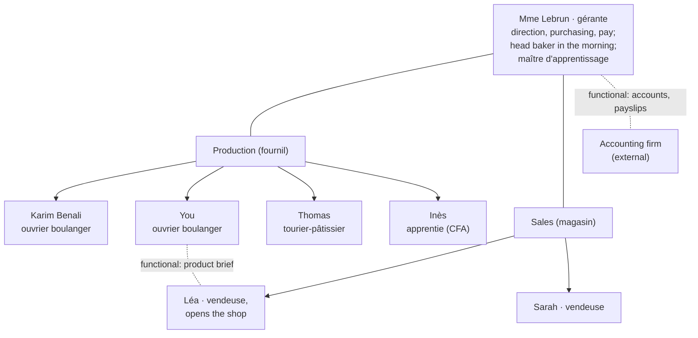

# 21.5 · EP1 Round: Applied Management

This round covers applied management (S5) and fills in four subjects Module 20 left for here: the organisation chart and internal communication, the règlement intérieur, training rights through working life, and the labour force and unemployment. You learn those first, with the official rules checked on 2026-10-09, then sit a 24-point round in 36 minutes that also reuses Module 20's timesheet, leave and pricing figures, and mark it with the guide.

## Why it matters

The applied-management part questions at least three of the five S5 domains (see [The CAP Boulanger Exam](../../references/cap-exam.md#ep1-written-test-on-technology-applied-science-and-management)). The 2019 paper asked candidates to name sources of law, to say which shops may sell "pain maison", to match end-of-contract documents to their definitions, to check an overtime count and to state paid-leave days. Those are taught in Module 20; this lesson adds what a paper can also ask about the company as an organisation (who reports to whom, how information circulates, what the internal rules may and may not say) and about your career (diplomas, training rights, the job market). In real life the same knowledge decides whether you can refuse a fine for being late, get your BP paid for, or understand why bakeries keep recruiting.

## Key terms

| French | Say it | English meaning |
|---|---|---|
| organigramme (de l'entreprise) | *or-ga-nee-GRAM* | organisation chart: who is in which department and who reports to whom (not the work organigramme of [14.1](../module-14/lesson-01.md)) |
| lien hiérarchique / fonctionnel | *lyan yay-rar-SHEEK / fohnk-syo-NEL* | line link (gives orders) / functional link (gives advice or a service without authority) |
| note de service | *not duh sair-VEES* | written instruction from management to the staff |
| règlement intérieur | *reg-luh-MAHN an-tay-RYUHR* | internal rules: health and safety, discipline, sanctions |
| sanction disciplinaire | *sahnk-SYOHN dee-see-plee-NAIR* | disciplinary penalty: warning, suspension, dismissal (never a fine) |
| CPF (compte personnel de formation) | *say-pay-EF* | personal training account credited in euros each year |
| projet de transition professionnelle (PTP) | *pro-ZHAY duh trahn-zee-SYOHN* | paid training leave to change job (replaced the CIF) |
| bilan de compétences | *bee-LAHN duh kohn-pay-TAHNS* | skills assessment to build a professional project |
| population active | *po-pü-la-SYOHN ak-TEEV* | labour force: people in work plus the unemployed |
| chômeur au sens du BIT | *sho-MUHR o sahns dü bay-ee-TAY* | unemployed person by the International Labour Office definition |

## How it works

### The organisation chart (S5.3.1)

An organisation chart shows the **structure**: the functions or departments of the business (direction, production, sales, administration) and the people in them, linked by **line (hierarchical) links**, which carry orders and accountability, and **functional links**, which carry advice, information or a service without authority. Au Pain de la Halle (SARL, 6 employees, gérante Mme Lebrun; lesson [20.1](../module-20/lesson-01.md)):

Solid lines are line links: everyone answers to Mme Lebrun. Dotted lines are functional: the accounting firm prepares payslips but gives no orders; you brief Léa on a new product (lesson [19.2](../module-19/lesson-02.md)) but you are not her boss. In a supermarket bakery department the chart is taller (store director → fresh-food manager → bakery department manager → bakers), and the rules on internal rules and staff representation change with the headcount.

### Communicating inside the business (S5.3.2)

| Channel | Use it for | Example |
|---|---|---|
| Spoken, face to face | urgent facts, safety, hand-overs | the 20-second report to the chef, the hand-over brief (lesson [19.1](../module-19/lesson-01.md)) |
| Note de service, display board | rules and changes for everyone, kept in writing | new opening hours, the cleaning plan, the holiday rota |
| Written forms | facts that must be traced | non-conformity report, temperature log, delivery note reservation |
| Team meeting, individual interview | discussion, decisions, your progress | weekly planning, the annual professional review |

Effective communication fits the **target** (chef, colleague, seller, customer), the **objective** (inform, alert, ask, decide) and the **register** (vous to the manager and customers, fournil words in the fournil). Non-verbal signals (tone, eye contact, posture) carry as much as the words.

### The règlement intérieur (S5.3.2)

- **Who must have one:** every business or establishment with **at least 50 employees**, within 12 months of reaching that number (Code du travail L1311-2, in force since 1 January 2020). A craft bakery of 6 employees, like Au Pain de la Halle, is not required to have one; its instructions take the form of notes de service and the employer's orders. A supermarket of 200 employees must have one.
- **What it contains, exclusively** (L1321-1): health and safety measures; how employees may be called on to help restore safe conditions; the **general disciplinary rules**, including the **nature and scale of sanctions**.
- **What it may not contain** (L1321-3): anything contrary to laws, regulations or the collective agreement; **restrictions of rights and freedoms that the task does not justify** or that are not proportionate; any **discrimination** (origin, sex, age, health, union activity…).
- **Fines are forbidden** (L1331-2): no "€20 deducted for each late arrival". Sanctions are measures such as a warning, a disciplinary suspension, or dismissal.
- **Consequences for the employee:** the clauses apply to every employee, including those hired before it was written. Breaking a lawful clause can lead to a sanction from the scale; a clause that breaks these rules has no effect.

Test for each clause: is it about safety, hygiene or discipline? Is it justified by the work and proportionate? Is it lawful? A ban on jewellery in production (food hygiene) passes; a ban on talking about unions does not.

### Training throughout working life (S5.3.3)

**Levels.** Since 2019 French qualifications sit on a national scale of 8 levels (décret 2019-14; INSEE):

| Level | Examples (INSEE) | In the bakery trade |
|---|---|---|
| 3 | CAP, BEP | CAP Boulanger (RNCP42115) |
| 4 | baccalauréat (general, technological, vocational) | BP Boulanger (RNCP41937, checked 2026-10-09); bac pro boulanger-pâtissier |
| 5 | two years of higher education: BTS, DUT | — |
| 6 to 8 | licence, master, doctorate | — |

**Routes.** The same diploma can be prepared as a pupil (statut scolaire, with workplace periods), as an **apprentice** (a salaried contract with a CFA; lesson [20.3](../module-20/lesson-03.md)), with a contrat de professionnalisation, in adult training, as an individual candidate, or through VAE (see the exam page for the CAP).

**Training rights of an employee**, checked on service-public on 2026-10-09:

| Right | What it gives | Key conditions |
|---|---|---|
| **CPF** (F10705) | an account credited **€500 a year**, ceiling **€5,000**; **€800 a year**, ceiling €8,000, for an employee without a level-3 qualification | working at least half-time (pro rata below); used on the Mon Compte Formation site, on your own initiative; a **€150 participation** (revised each 1 January) unless an employer or OPCO pays it. Outside working time: no agreement needed. During working time: ask the employer **60 days** before (120 for 6 months or more); reply within **30 days**, silence = acceptance |
| **Projet de transition professionnelle** (F14018), the former CIF | paid leave to follow a certifying training to **change job** | CDI: **2 years** of salaried work including **1 with the employer**; request 120 or 60 days ahead; financed through **Transitions Pro**; pay maintained (100 % up to €3,734.04 reference salary) |
| **Bilan de compétences** (justice.fr, DILA) | analysis of your skills and motivations to build a **professional project** | at most **24 hours**, three phases (preliminary, investigation, conclusion); results **belong to you**, shared only with your consent; CPF up to €1,600; employer's agreement only if part is in working time |

Why it matters to a baker: the collective agreement places a CAP holder who adds a mention complémentaire at a higher coefficient than with the CAP alone (lesson [20.4](../module-20/lesson-04.md)), and the BP is the next level of the trade's diplomas.

### The labour force and unemployment (S5.2.1)

- **Labour force** (population active): people in work plus the unemployed. **Unemployment rate** = unemployed ÷ labour force × 100.
- **Unemployed in the ILO (BIT) sense** (INSEE): aged 15 or over, **without work** in a given week, **available** to start within two weeks, and having **actively looked** for work in the previous four weeks (or found a job starting within three months).
- **Current figure:** **8.3 %** in the second quarter of 2026, up 0.2 point on the quarter and 0.7 point on a year; about **2.7 million** unemployed; **21.6 %** for 15–24-year-olds (INSEE, 7 August 2026). These change every quarter: check the latest release.
- **Causes, as economics textbooks group them** (course framing, not an official classification): **cyclical** unemployment when activity slows and businesses hire less; **structural** unemployment when jobs and jobseekers do not match (skills, place, working conditions, technological change); **frictional** unemployment, the time it takes to move from one job to the next.
- **The bakery paradox:** the CNBPF counted **29,029 jobs to fill** in bakery-pâtisseries in 2024, **9,745 for boulangers**, while unemployment was well above 2 million. The Ministry of Labour's regional services explain recruitment tensions with factors such as **constraining working conditions** (nights, weekends, heat), the **link between training and job** (a CAP is needed), **geographic mismatch** between where jobseekers live and where jobs are, and a **lack of available labour** (DREETS Bretagne, 2024). That is structural unemployment in a sector that hires.

### The rest of S5 in a round

Module 20 teaches the rest, and the round below reuses its figures: sector and legal forms (S5.1, [20.1](../module-20/lesson-01.md)), law and contracts ([20.2](../module-20/lesson-02.md)), hiring ([20.3](../module-20/lesson-03.md)), working time, pay and end of contract ([20.4](../module-20/lesson-04.md)), costs, prices and VAT ([20.5](../module-20/lesson-05.md)). Re-check the volatile figures (SMIC, wage grid, CPF amounts, unemployment) on the official pages before the exam.

## Worked example

Karim Benali, CAP holder in CDI at Au Pain de la Halle for three years, full time, wants to prepare the BP Boulanger. A training centre offers a course of **€1,400**, on Mondays (his day off), for 10 months. His CPF shows **€1,500**.

1. **Level:** the BP is a **level 4** diploma (RNCP41937); his CAP is level 3.
2. **Funding:** the CPF covers €1,400 (€1,500 available). He pays the **€150 participation**, unless Mme Lebrun or the OPCO pays it for him (F10705).
3. **Employer's agreement:** the course is entirely **outside working time** (his day off): **none needed**; he books it himself on Mon Compte Formation.
4. **If the course were on Wednesdays**, a working day: he must ask Mme Lebrun at least **120 days** before (training of 6 months or more); she has **30 days** to reply; no reply = **accepted**.
5. **If instead he wanted to become a pastry chef** through a year-long full-time course with pay maintained: a **projet de transition professionnelle** (2 years of salaried work, 1 with this employer: he qualifies), financed by **Transitions Pro**.

## Practice

### You need

- Paper, pen, calculator, timer; no notes. About 75 minutes.
- Professional equivalent: a real organisation chart, a supermarket's règlement intérieur (they are posted in the workplace) and your own CPF account.

### Steps

1. Margin plan: 36 minutes, 24 points.
2. Sit the round on paper, timed; stop at 36 minutes.
3. Mark with the guide; add lost points to your error list.
4. Re-read the linked lessons (and this lesson's How it works for questions 1–7).

### The round (36 minutes, 24 points)

> **Situation.** Au Pain de la Halle, SARL, Tours ; gérante Mme Lebrun ; 6 salariés (organigramme ci-dessus). Karim Benali, ouvrier boulanger en CDI depuis 3 ans, hésite entre préparer le BP et partir au rayon boulangerie d'Hyper Loire, hypermarché de 210 salariés.
>
> **D1 — Organigramme d'Au Pain de la Halle :** voir le schéma de la leçon.
>
> **D2 — Extrait du règlement intérieur d'Hyper Loire :**
> Art. 3 — En zone de production, tenue complète, cheveux couverts, aucun bijou.
> Art. 6 — Le téléphone portable est interdit en zone de production.
> Art. 7 — Tout retard non justifié entraîne une retenue de 20 € sur le salaire.
> Art. 9 — Les salariés s'abstiennent de toute discussion sur l'appartenance syndicale.
> Art. 11 — Sanctions : avertissement ; mise à pied disciplinaire de 3 jours au plus ; licenciement.
>
> **D3 — Relevé d'heures de Karim (octobre) et décompte de l'employeur :**
>
> | Semaine | Heures travaillées | H. sup. à 25 % (employeur) | H. sup. à 50 % (employeur) |
> |---|---|---|---|
> | 1 | 39 h | 4 | 0 |
> | 2 | 45 h | 10 | 0 |
> | 3 | 35 h | 0 | 0 |
> | 4 | 41 h | 6 | 0 |
>
> **D4 — INSEE, 2e trimestre 2026 :** taux de chômage 8,3 % ; 2 677 000 chômeurs au sens du BIT. **CNBPF (2024) :** 9 745 postes de boulangers à pourvoir.
>
> **D5 — Nouveau produit :** pain aux céréales, coût de revient 1,80 € ; marge visée 25 % du prix de vente HT ; TVA 5,5 %.

In English: Karim, a CAP holder in a CDI for three years, is choosing between preparing the BP and moving to a hypermarket bakery of 210 employees. D2 is an extract of the hypermarket's internal rules; D3 his October hours and the employer's overtime count; D4 the unemployment figures and the bakery vacancies; D5 a new product to price.

**1.** (2 pts) À partir de D1, *identifier* votre supérieur hiérarchique et *citer* un lien fonctionnel. — Identify your line manager and one functional link. → this lesson, [19.1](../module-19/lesson-01.md)

**2.** (1 pt) *Citer* deux moyens de communication interne et une situation pour chacun. — Two internal communication channels and a use for each. → this lesson, [19.1](../module-19/lesson-01.md)

**3.** (4 pts) *Indiquer* si le règlement intérieur est obligatoire chez Hyper Loire et chez Au Pain de la Halle, puis *justifier* si les articles 3, 7 et 9 de D2 sont licites. — Is it compulsory in each business? Are articles 3, 7 and 9 lawful? → this lesson

**4.** (3 pts) *Indiquer* le niveau du CAP et du BP, puis *expliquer* comment Karim peut financer le BP avec son CPF et quand l'accord de l'employeur est nécessaire. — Levels of CAP and BP; how Karim funds the BP with his CPF and when the employer must agree. → this lesson

**5.** (2 pts) *Définir* le bilan de compétences et *citer* deux de ses caractéristiques. — Define the bilan de compétences and give two features. → this lesson

**6.** (2 pts) *Citer* les trois conditions pour être chômeur au sens du BIT et *calculer* la population active à partir de D4. — The three ILO conditions, and the labour force from D4. → this lesson

**7.** (2 pts) *Expliquer* deux raisons pour lesquelles 9 745 postes de boulangers restent à pourvoir malgré 2,7 millions de chômeurs. — Two reasons why bakery jobs stay unfilled. → this lesson

**8.** (3 pts) *Vérifier* le décompte des heures supplémentaires de D3 et *justifier*. — Check the overtime count of D3. → [20.4](../module-20/lesson-04.md)

**9.** (2 pts) Karim a travaillé 8 mois complets depuis le 1er juin. *Calculer* ses jours de congés payés acquis. — Paid leave after 8 full months. → [20.4](../module-20/lesson-04.md)

**10.** (3 pts) À partir de D5, *calculer* le prix de vente HT et TTC. — From D5, the selling price before and including VAT. → [20.5](../module-20/lesson-05.md), [06.5](../module-06/lesson-05.md)

Model answers and marking guide

| Q | Points | Model answer (key words in bold) |
|---|---|---|
| 1 | 2 | Line manager: **Mme Lebrun**, gérante (1). Functional link, any one: the **accounting firm** (payslips, no authority); **you ↔ Léa** for the product brief (1). |
| 2 | 1 (½ each) | Any two with a fitting use: spoken report (alert, hand-over); **note de service** / display board (new rule, rota); written form (non-conformity report); team meeting (planning). |
| 3 | 4 | Compulsory at Hyper Loire (**210 ≥ 50** employees), **not compulsory** at Au Pain de la Halle (6) (L1311-2) (1). Art. 3 **lawful**: hygiene and safety, justified by food production (1). Art. 7 **unlawful**: a **fine** (pecuniary sanction) is forbidden (L1331-2) (1). Art. 9 **unlawful**: restricts a freedom without justification and discriminates on **union** activity (L1321-3) (1). |
| 4 | 3 | CAP **level 3**, BP **level 4** (1). CPF: credited **€500 a year** (ceiling €5,000), used on Mon Compte Formation; **€150 participation** unless paid by the employer or OPCO (1). Employer's agreement only if the training is **during working time**: request 60 or 120 days ahead, reply within 30 days, **silence = acceptance**; outside working time, none (1). |
| 5 | 2 | Analysis of one's skills, aptitudes and motivations to build a **professional project** (1). Any two features (½ each): at most **24 hours**; three phases; **results belong to the employee**; CPF-funded up to €1,600; employer's agreement only for working time. |
| 6 | 2 | Without work; **available** within 2 weeks; **actively seeking** in the last 4 weeks (1). Labour force = 2,677,000 ÷ 0.083 ≈ **32.3 million** (1). |
| 7 | 2 (1 each) | Any two: **working conditions** (night, weekends, heat); **training needed** (CAP: training–job link); **geographic mismatch** (jobs and jobseekers not in the same places); lack of available trained labour. Structural, not cyclical. |
| 8 | 3 | Week 1: 4 h at 25 % **correct** (½). Week 2: 45 h = 10 h overtime, but only the 36th–43rd hours are at 25 %: **8 h at 25 % and 2 h at 50 %**; **not correct** (1½). Week 3: none, correct (½). Week 4: 6 h at 25 %, correct (½). |
| 9 | 2 | 8 × 2.5 = **20 working days** (1 for method, 1 for result). (A non-whole number would be rounded up, F2258.) |
| 10 | 3 | HT = cost ÷ (1 − 0.25) = 1.80 ÷ 0.75 = **€2.40** (1½). TTC = 2.40 × 1.055 = 2.532 → **€2.53** (or €2.55 if the house rounds up to 0.05 €) (1½). |

Total 24. 20 or more: secure; 17–19: re-read this lesson's tables and the Module 20 lesson of each lost question; under 17: redo the practice of [20.4](../module-20/lesson-04.md) and [20.5](../module-20/lesson-05.md).

Common slips: Q3 "lawful because the employer decides"; Q4 "the employer must agree to any training"; Q6 labour force = unemployed × 8.3; Q8 accepting week 2 because the total of 10 h is right; Q10 HT = 1.80 × 1.25 = €2.25 (margin on cost, not on price).

### Targets

- Finished in 36 minutes; at least 17 of 24 points.
- Every legal answer cites the rule (50 employees, no fines, no unjustified restriction, 60/120 and 30 days).

### How you know it worked

You can take any clause of a règlement intérieur, any training wish and any unemployment figure and say, with the rule or the figure, what applies.

### Self-check

- [ ] I can tell a line link from a functional link on an organisation chart.
- [ ] I know when a règlement intérieur is compulsory, what it contains and the three things it may not contain, and that fines are forbidden.
- [ ] I can place CAP and BP on the levels and explain CPF, PTP and bilan de compétences.
- [ ] I can define the labour force and ILO unemployment, give the latest rate and name causes of recruitment difficulties.
- [ ] I re-checked the Module 20 figures I used (SMIC, grid, VAT).

## What goes wrong

| Symptom | Likely cause | Fix now | Prevent next time |
|---|---|---|---|
| "Every business must have a règlement intérieur" | Threshold unknown | 50 employees or more (L1311-2) | Learn the threshold with its article number |
| Fine for lateness judged lawful | Sanctions confused with pay deductions | Pecuniary sanctions are forbidden (L1331-2) | Check every sanction clause against the list: warning, suspension, dismissal |
| "Karim needs his boss's permission to use his CPF" | Working-time condition missed | Agreement only for training during working time | Ask "during or outside working time?" first |
| Unemployment rate used as the number of unemployed | Rate and number confused | Rate = unemployed ÷ labour force × 100 | Write the formula before any labour-market calculation |
| Selling price below cost plus margin | Margin applied to the cost | HT = cost ÷ (1 − margin rate) when the margin is a share of the price | Re-read the wording: "marge de 25 % du prix de vente" |
| Old figures (SMIC, CPF, unemployment) | Volatile numbers learned once | Check the official page date | Re-check volatile figures the month before the exam |

## Review

- Organisation chart: departments and people, line links (orders) and functional links (advice, service). Internal communication fits target, objective and register.
- Règlement intérieur: compulsory from 50 employees; health and safety and discipline only; no unjustified restriction, no discrimination, no fines.
- Training: CAP level 3, BP level 4; CPF €500 a year (€5,000 ceiling), employer's agreement only during working time; PTP to change job; bilan de compétences up to 24 h, results yours.
- Unemployment in the ILO sense: no job, available, actively seeking; 8.3 % in Q2 2026; bakery vacancies are a structural mismatch.
- Volatile figures dated 2026-10-09; paper structure and marks: [The CAP Boulanger Exam](../../references/cap-exam.md). Next round: [21.6](lesson-06.md).
