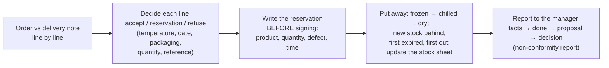

# 21.6 · EP1 Round: Supplies, Hygiene and Communication

The last round brings together the competencies EP1 assesses directly from the bakery's daily paperwork: receiving a delivery, deciding line by line, storing and rotating stock, reporting the problems, and briefing sales staff and customers. It reuses the Saturday morning of [Module 19](../module-19/lesson-01.md)'s project at Au Pain de la Halle as a written round of 24 points in 36 minutes, with the order, the delivery note, a stock sheet and the laboratory report of a new walnut bread.

## Why it matters

EP1 assesses receiving and storing (C1.1, C2.1), checking supplies (C3.1), reporting non-conformities (C4.1), briefing sales staff (C4.2) and using suitable language (C4.3); see [The CAP Boulanger Exam](../../references/cap-exam.md#ep1-written-test-on-technology-applied-science-and-management). On paper these become the questions a delivery note and a product sheet make easy to set: which line do you refuse, what do you write before signing, where does each product go, what do you tell the manager, what does the seller say to a customer with an allergy. They are also the decisions that cost a bakery money (a signed note with no reservation) or put a customer at risk (a guessed allergen answer), so markers expect a decision with the figure and the rule every time.

## Key terms

| French | Say it | English meaning |
|---|---|---|
| bon de commande | *bohn duh ko-MAHND* | purchase order: what the bakery asked for |
| bon de livraison | *bohn duh lee-vray-ZOHN* | delivery note: what the supplier says it delivered; signed at reception |
| réserve | *ray-ZAIRV* | reservation written on the delivery note before signing |
| refus | *ruh-FÜ* | refusal: the goods go back with the driver |
| fiche de stock | *feesh duh STOK* | stock sheet: entries, exits and balance of one product |
| premier périmé, premier sorti | *pruh-MYAY pay-ree-MAY* | first expired, first out (FEFO) |
| fiche de non-conformité | *feesh duh nohn-kohn-for-mee-TAY* | non-conformity report |
| argumentaire | *ar-gü-mahn-TAIR* | product pitch for sales staff |
| traces éventuelles | *TRAHS ay-vahn-tü-EL* | possible traces: precautionary allergen statement |

## How it works

### One delivery, five decisions

The limits you need, from lessons [17.7](../module-17/lesson-07.md) and [17.8](../module-17/lesson-08.md): very perishable (cream, milk, egg products) **+7 °C** at reception; perishable (butter as labelled) **+11 °C**; frozen **−15 °C**; date passed or too short, damaged or swollen packaging, missing health mark: refuse. Wrong quantity or reference on safe goods: accept with a reservation.

### The answer pattern for each kind of question

| Question | Pattern | Lesson |
|---|---|---|
| Decide a line | decision + measured figure + limit or rule | [17.7](../module-17/lesson-07.md) |
| Write the reservation | product, quantity, defect, time; precise, before signing | [19.1](../module-19/lesson-01.md) |
| Store | zone and temperature, order of putting away, FEFO | [17.8](../module-17/lesson-08.md) |
| Stock sheet | balance = previous balance + entries − exits | [17.8](../module-17/lesson-08.md) |
| Report | facts and figures → what I did → what I propose → you decide | [19.1](../module-19/lesson-01.md) |
| Product brief | legal name checked, composition, taste, pairing, keeping, allergens, one sentence | [19.2](../module-19/lesson-02.md) |
| Customer allergy | read the allergen table, state traces, never guess, never "gluten-free" by default | [19.3](../module-19/lesson-03.md), [17.6](../module-17/lesson-06.md) |

## Worked example

Line 4 of the delivery note in the round: « Crème fraîche épaisse 30 %, 1 L — commandé 4 — livré 3 — relevé +9 °C — DLC 24/10 ». (Question 1 gives 1 point per line.)

1. **Two problems:** quantity (3 instead of 4) and temperature (+9 °C).
2. **Which wins:** safety first. Crème fraîche is very perishable; +9 °C is above the **+7 °C** reception limit, so the **3 tubs are refused**, whatever the quantity.
3. **Answer:** "Refuse: +9 °C is above the +7 °C limit for a very perishable product. The missing 4th tub is noted too."
4. **What it changes next:** the reservation names it, the report proposes a replacement delivery before the crème pâtissière is needed, and the tourier is warned (lesson [19.1](../module-19/lesson-01.md)).

## Practice

### You need

- Paper, pen, calculator, timer; no notes. About 75 minutes.
- Templates if you want to fill the real forms: [delivery check](../../templates/delivery-check.md) and [non-conformity report](../../templates/non-conformity-report.md).
- Professional equivalent: the morning delivery at a real bakery, with the order book, the delivery note, the probe thermometer and the stock sheets.

### Steps

1. Margin plan: 36 minutes, 24 points.
2. Sit the round on paper, timed; stop at 36 minutes.
3. Mark with the guide; add lost points to your error list.
4. Compare your reservation and your report with the model sentences; rewrite them.

### The round (36 minutes, 24 points)

> **Situation.** Samedi 17 octobre, Au Pain de la Halle (Tours), gérante Mme Lebrun. Vous êtes ouvrier boulanger ; à 5 h 50 vous réceptionnez la livraison de la Crèmerie Val de Loire. À 6 h 50 vous présentez le nouveau pain aux noix à Léa, vendeuse.
>
> **D1 — Bon de livraison n° 8817, Crèmerie Val de Loire (bon de commande n° 1042), et vos relevés :**
>
> | Ligne | Produit | Commandé | Livré | T° relevée | Date | Observation |
> |---|---|---|---|---|---|---|
> | 1 | Beurre de tourage 82 %, plaque 5 kg | 2 | 2 | +6 °C | DLC 30/11 | — |
> | 2 | Crème UHT 35 %, 1 L | 6 | 6 | ambiante | DDM 03/2027 | — |
> | 3 | Œufs calibre M, plateau de 30 | 2 | 2 | ambiante | 05/11 | 4 œufs cassés sur un plateau |
> | 4 | Crème fraîche épaisse 30 %, 1 L | 4 | 3 | +9 °C | DLC 24/10 | — |
> | 5 | Lait entier pasteurisé, 1 L | 10 | 10 | +4 °C | DLC 15/10 | — |
>
> **D2 — Fiche de stock « Beurre de tourage 82 %, plaque 5 kg » :** 10/10 stock 4 ; 12/10 sortie 2 ; 14/10 sortie 1 ; 17/10 entrée : ligne 1 de D1.
>
> **D3 — Pain aux noix (fiche et analyse) :** farine T65, farine de seigle 10 %, cerneaux de noix 20 %, levain, sans levure ajoutée ; pétri, façonné et cuit sur place. Analyse de la mie : pH 4,2 ; acide acétique 1 000 ppm. Tableau des allergènes : gluten (blé, seigle), fruits à coque (noix) ; traces éventuelles de sésame (même plan de travail que le pain aux graines).
>
> **D4 — Alerte du fournisseur de noix, 17/10, 9 h :** « Lot N-2309 de cerneaux de noix : présence possible de fragments de coque. Retrait-rappel. »

In English: Saturday, 5:50, a dairy delivery (D1, five lines with the order, the quantity delivered, your temperature readings, dates and remarks; today is 17 October); the stock sheet of laminating butter (D2); the sheet, lab analysis and allergen table of a new walnut bread (D3); and at 9:00 a supplier's recall of a lot of walnut kernels (D4).

**1.** (5 pts) Pour chaque ligne de D1, *indiquer* votre décision (accepter, accepter avec réserve, refuser) et *justifier*. — For each line of D1, decide and justify. → [17.7](../module-17/lesson-07.md)

**2.** (2 pts) *Rédiger* la réserve à écrire sur le bon de livraison avant de signer. — Write the reservation on the delivery note. → [19.1](../module-19/lesson-01.md)

**3.** (2 pts) *Indiquer* l'ordre de rangement des produits acceptés et leur zone de stockage. — Order of putting away and storage zone. → [17.8](../module-17/lesson-08.md)

**4.** (2 pts) *Compléter* le solde de la fiche de stock D2 après la livraison et *indiquer* quelles plaques utiliser en premier. — Stock balance after the delivery, and which plaques to use first. → [17.8](../module-17/lesson-08.md)

**5.** (3 pts) *Rédiger* le compte rendu écrit à Mme Lebrun sur cette livraison. — Write the report to Mme Lebrun. → [19.1](../module-19/lesson-01.md)

**6.** (3 pts) À partir de D3, *indiquer* si le pain peut être vendu « pain aux noix au levain » et *justifier*, puis *rédiger* la phrase de Léa pour les clients avec la mention des allergènes. — May it be sold as "au levain"? Write Léa's sentence with the allergens. → [09.1](../module-09/lesson-01.md), [19.2](../module-19/lesson-02.md)

**7.** (3 pts) Une cliente : « Mon mari est allergique aux fruits à coque et moi je suis cœliaque. Qu'est-ce qu'on peut prendre ? » *Indiquer* la réponse correcte. — What is the correct answer to the customer? → [19.3](../module-19/lesson-03.md), [17.6](../module-17/lesson-06.md)

**8.** (2 pts) Léa dit à une cliente : « Tu prends le pain aux noix ? Il a bien poussé à l'apprêt, la grigne est top. » *Reformuler* dans un langage adapté. — Rephrase in suitable language. → [19.4](../module-19/lesson-04.md)

**9.** (2 pts) À partir de D4, *citer* les actions à mener. — From D4, list the actions. → [17.7](../module-17/lesson-07.md)

Model answers and marking guide

| Q | Points | Model answer (key words in bold) |
|---|---|---|
| 1 | 5 (1 per line) | L1 butter: **accept**; +6 °C within the perishable limit (+11 °C; label permitting), DLC fine. L2 UHT cream: **accept**; ambient-stable until opened, DDM fine. L3 eggs: **refuse the damaged tray** (broken eggs: damaged goods); **accept the other** after checking it egg by egg; reservation. L4 crème fraîche: **refuse** the 3 tubs, **+9 °C > +7 °C**; note the missing 4th. L5 milk: **refuse**, **DLC 15/10 passed** on 17/10 (the +4 °C reading does not save it). |
| 2 | 2 | Precise, with quantities, defects and time, e.g. « Œufs : 1 plateau de 30 refusé, 4 œufs cassés. Crème fraîche : 3 L refusés, +9 °C ; 1 L manquant. Lait : 10 L refusés, DLC du 15/10 dépassée. 5 h 55. » (1 for each two defects correctly stated; 0 for "livraison non conforme"). |
| 3 | 2 | Chilled first: **butter** and the accepted **eggs** in the positive cold room (chilled zone of [17.8](../module-17/lesson-08.md)), behind older stock, eggs away from ready-to-eat products (1). Then dry: **UHT cream** in the dry store until opened (1). (No frozen goods in this delivery.) |
| 4 | 2 | 4 − 2 − 1 + 2 = **3 plaques** (1). Use first the plaque with the **earliest DLC** (the older stock), new plaques behind (1). |
| 5 | 3 | Facts with figures: what was refused and why (eggs, cream at +9 °C, milk past DLC), the missing litre (1). What I did: reservation written, products refused, accepted goods stored (1). Proposal and question: ask the creamery for replacement cream and milk before production needs them / UHT cream for the crème pâtissière meanwhile; "Do you agree?" (1). |
| 6 | 3 | **Yes**: made on site (pain maison, art. 1), pH **4.2 ≤ 4.3** and **1,000 ≥ 900 ppm** acetic acid (art. 3) (1½). Sentence, e.g. « Notre nouveau pain aux noix au levain, avec un peu de seigle : croûte grillée, beaucoup de noix, parfait avec le fromage. Il contient du gluten (blé, seigle) et des noix, et peut contenir des traces de sésame. » (1½: name, one sensory fact, all allergens incl. traces). |
| 7 | 3 | For the customer (coeliac): **all our breads contain gluten**; nothing can be recommended to her (1). For the husband: **not the pain aux noix**; only breads whose allergen table shows **no nuts and no nut traces** (1). Show the **allergen table**, never guess; no "gluten-free" claim (1). |
| 8 | 2 | **Vous** instead of tu (1); plain words instead of fournil jargon (apprêt, grigne), e.g. « Vous prenez le pain aux noix ? Il est bien levé et sa croûte est bien dorée et croustillante. » (1). |
| 9 | 2 (½ each) | Check whether lot **N-2309** was received (delivery notes, labels); **set aside** and do not use the lot; **withdraw** the walnut breads made with it from sale; if sold, **inform customers** (recall notice in the shop); record and report to Mme Lebrun. Any four. |

Total 24. 20 or more: secure; 17–19: re-read [17.7](../module-17/lesson-07.md) and [19.1](../module-19/lesson-01.md); under 17: redo the [Module 19 project](../../projects/m19-role-play-scripts.md) scenes 1, 4 and 5 in writing.

Common slips: Q1 accepting the milk because it is cold; refusing the whole egg delivery; Q2 "livraison non conforme, voir avec le chef"; Q6 "au levain" judged from the recipe only; Q7 offering spelt or rye "for the coeliac customer".

### Targets

- Finished in 36 minutes; at least 17 of 24 points.
- Every line decision has a figure and a limit; the reservation could stand alone in front of the supplier.

### How you know it worked

Someone reading only your reservation and your report would know exactly what was refused, why, what is missing and what you propose, and your customer answer contains no guess.

### Self-check

- [ ] I decide each delivery line from temperature, date, packaging, quantity and reference, safety first.
- [ ] I write reservations with product, quantity, defect and time.
- [ ] I put goods away frozen, then chilled, then dry, first expired first out, and update the stock sheet.
- [ ] My reports go facts → done → proposal → decision.
- [ ] I check legal names and allergens on documents before briefing a seller or answering a customer.

## What goes wrong

| Symptom | Likely cause | Fix now | Prevent next time |
|---|---|---|---|
| Out-of-date milk accepted because it was cold | Temperature checked, date not | Read every date against today's date | Use the check order of [17.7](../module-17/lesson-07.md): temperature, date, packaging, quantity |
| Whole delivery refused for one broken tray | All-or-nothing reflex | Decide line by line | Write one decision per line before signing |
| Reservation "non conforme" | No figures | Product, quantity, defect, time | Learn the model reservation by heart |
| Report starts with blame or a story | Order of the report not used | Facts and figures first | Facts → done → proposal → decision |
| "Au levain" written because the recipe uses levain | Name judged on the recipe | Check pH and acetic acid on the analysis | Decision–figure–limit pattern of [21.2](lesson-02.md) |
| Customer told "this one should be fine" | Guessing on allergens | Show the table; state traces | Never answer allergen questions from memory |

## Review

- Each delivery line gets a decision from its own figures: temperature against the limit, date against today, packaging, then quantity and reference.
- Reservations are written before signing; the report to the manager goes facts → done → proposal → decision.
- Storage: frozen, chilled, then dry; new stock behind; first expired, first out; stock balance = previous + entries − exits.
- A product brief and a customer answer start from the documents: legal name checked, allergens and traces stated, right register.
- Paper structure and marks: [The CAP Boulanger Exam](../../references/cap-exam.md). Put all six lessons together in the [mock paper](../../projects/m21-ep1-mock-paper.md).
