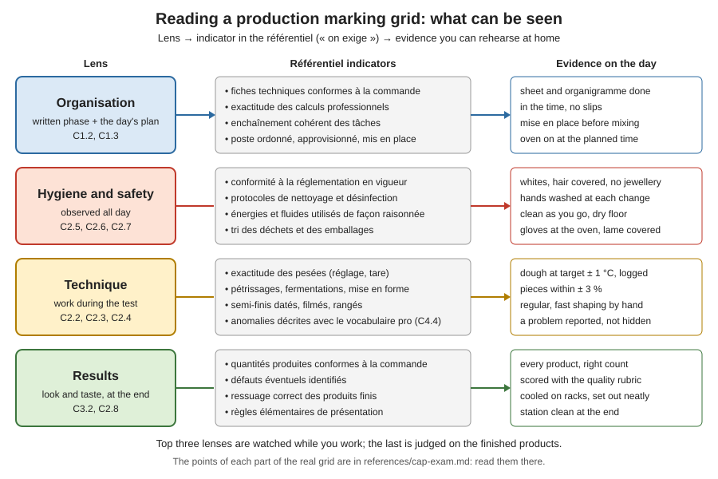

# 22.1 · How EP2 Works

This lesson opens the last module: rehearsing the production test. It does not repeat the exam's rules, which live in one place, the exam reference page; it teaches you to read a marking grid the way an examiner uses it, to see which of your actions leave visible evidence, and to turn that into a checklist you can rehearse. You finish with a timed home bake observed against that checklist.

## Why it matters

A production test is marked on more than the bread on the table at the end. The référentiel says what the test checks: that from an order you can calculate and organise your work, make bread and viennoiserie following the hygiene and safety rules, keep your station clean and tidy it at the end, and present the finished products. The marking grid splits the total between those parts. A candidate who bakes good croissants on a cluttered, unwashed bench, or who never finishes the written sheet, loses points that no croissant can win back. Knowing what can be seen, and practising it until it is automatic, is the cheapest progress you can make before the exam.

> [!IMPORTANT]
> This is the first lesson of a practical module, so the usual reminder: watching someone run a production day does not make you able to run one. Do the rehearsals of this module with your own hands. The Academy cannot grade photos, so you compare your results with the targets and the [quality rubric](../../templates/quality-rubric.md) yourself, and that self-assessment does not replace the official practical exam.

Every exam fact (what the test contains, how long it lasts, its coefficient, the products, the points of each part of the grid, what the centre supplies) is in [The CAP Boulanger Exam](../../references/cap-exam.md). Keep that page open while you read: this lesson refers to it rather than copying it, so that there is only one place to update when the rules change.

## Key terms

| French | Say it | English meaning |
|---|---|---|
| épreuve ponctuelle | *ay-PRUHV pohnk-TWEL* | one-off test on a set date, as opposed to continuous assessment (CCF) |
| sujet | *sü-ZHAY* | the exam paper: here an order to plan and produce |
| barème | *ba-REM* | the points allotted to each part of a test |
| grille d'évaluation | *GREE-yuh day-va-lü-a-SYOHN* | marking grid: the parts of the test, their points, and what is checked in each |
| critère / indicateur de performance | *kree-TAIR / an-dee-ka-TUHR duh pair-for-MAHNS* | what is judged / the observable sign that shows it (the référentiel's « on exige » column) |
| convocation | *kohn-voh-ka-SYOHN* | the official letter giving the date, place, and what you must bring |
| tenue professionnelle | *tuh-NÜ pro-feh-syoh-NEL* | professional clothing and protective equipment |
| dégustation | *day-güs-ta-SYOHN* | tasting of the finished products by the examiners |
| autoévaluation | *oh-toh-ay-va-lü-a-SYOHN* | self-assessment: judging your own work against a written standard |

## How it works

### What the référentiel says the test checks

The référentiel defines the production test in three parts: its purpose, its content (the competencies and the knowledge it can draw on) and its evaluation criteria. The purpose: from an order, calculate and organise your work in order to make and present bread and viennoiserie. The criteria are three plain sentences: calculate the ingredients and organise your work from an order; make bread and viennoiserie following hygiene and safety rules, keep your workstation clean and tidy it at the end of the test; present the finished products. The marking grid then gives points to each part. The parts and their points are listed in the [exam reference](../../references/cap-exam.md); this lesson only teaches how to read them.

### How to read any marking grid

1. **List the lines and their points**, then work out each line's share of the total. The share tells you where the marks are, not what is hardest.
2. **Separate process lines from result lines.** A process line (organisation, work during the test, hygiene and safety) is observed while you work: the examiner watches you for hours and notes what they see. A result line (look of the products, tasting) is judged at the end, on the table.
3. **Find the indicators.** The grid's lines are short; the référentiel's competency tables say what is demanded in each (the « critères et indicateurs de performance, on exige » column). Those indicators are what an examiner can actually see.
4. **Turn each indicator into evidence you leave behind**: a sheet, a log, a labelled tub, a clean bench, a weight, a product.
5. **Rehearse the evidence**, not only the product.

### What examiners can observe, lens by lens

The référentiel's indicators, grouped into four lenses (the grid's own lines are in the exam reference):

| Lens | Indicator in the référentiel (on exige) | What it looks like on your bench |
|---|---|---|
| **Organisation** (C1.2, C1.3) | technical sheets match the order; calculations exact; tasks follow each other coherently; workstation ordered, supplied and set up according to the order, safety and hygiene rules | written phase complete and correct; mise en place before the first mix; oven switched on at the planned time; no searching for tools |
| **Hygiene and safety** (C2.5, C2.6, C2.7) | compliance with current rules; cleaning and disinfection protocols followed; energy, water and products used sensibly; waste and packaging sorted | clean whites, hair covered, no jewellery; hands washed at every change of task; raw egg kept apart; bench cleared between doughs; floor dry; oven gloves; lame covered; oven not left on empty for an hour |
| **Technique** (C2.2, C2.3, C2.4, C4.4) | exact weighing with the scale set and tared; mixing, fermentation and shaping methods mastered; semi-finished products dated, filmed and stored in the right place; anomalies described in professional vocabulary | dough temperature on target and written down; pieces divided to weight; shaping regular and quick; tubs labelled; a problem reported ("my pâte fermentée was over-ripe, I shortened the pointage") instead of hidden |
| **Results** (C3.2, C2.8) | quantities produced match the order; possible defects identified; finished products stored to cool properly; basic presentation rules | every product present in the right number; cooled on racks; set out neatly; you can name the fault in your own product before anyone asks |

Two honest limits. First, the référentiel lists criteria and indicators but does not publish a detailed checklist of how many points each behaviour costs: exam centres and examiners use their own detailed sheets within the national grid, and they are not public. Second, the indicators above come from the competency tables, which apply to every assessment of the CAP; nothing here is an insider's list of "what examiners want". What it does tell you is that every indicator is observable, and that most of them are habits.

### Habits beat heroics

Process lines are watched for the whole day, so they reward habits repeated hundreds of times, not a single good moment. A candidate who washes their hands at every change of task, wipes the bench after each dough and labels every tub without thinking about it scores on those lines all day. One who remembers only when an examiner walks past does not. That is why the rehearsals in lessons [22.3](lesson-03.md)-[22.5](lesson-05.md) score your behaviour as well as your products.

> [!WARNING]
> Bring the protective equipment named on your convocation: the exam reference explains what happens to a candidate who does not. Practise in the same shoes and clothing you will wear on the day.

## Worked example

A training centre ran a mock production day with its own **invented** grid out of 100, to teach candidates how grids work. It is not the CAP grid (that one is in the [exam reference](../../references/cap-exam.md)), but the reading method is identical.

| Part (invented mock grid) | Points | Share of total | Léa's mark | Points lost |
|---|---|---|---|---|
| Organisation and documents | 15 | 15 % | 9 | 6 |
| Work methods | 30 | 30 % | 22 | 8 |
| Hygiene and safety | 20 | 20 % | 11 | 9 |
| Appearance of products | 25 | 25 % | 21 | 4 |
| Tasting | 10 | 10 % | 8 | 2 |
| **Total** | **100** | **100 %** | **71** | **29** |

**1. Where were the points lost?** Léa's products were good: she lost only 6 points on the two result lines. She lost 23 points on the three process lines, and 15 of them on organisation and hygiene alone.

**2. What did the examiner write?** Organisation: "organigramme has no cleaning slots; oven switched on 30 min late, first load waited". Hygiene: "no hand wash after cracking eggs; bench cluttered with three doughs; tubs not labelled; jewellery". Work methods: "dough temperature not measured; pains au chocolat uneven, sheet rolled without a ruler".

**3. Which fixes are cheapest?** Count what each fix costs in practice time:

| Fault | Fix | Practice needed |
|---|---|---|
| no cleaning slots, oven late | write them into the organigramme; oven time is planned backwards from the first load | one written drill (lesson [22.2](lesson-02.md)) |
| hands, jewellery, labels, clutter | a fixed routine at every change of task | two or three rehearsals with an observer |
| dough temperature not measured | probe in the apron, number on the log | one rehearsal |
| uneven pains au chocolat | ruler, marks on the sheet, weigh three pieces | several batches (lesson [12.1](../module-12/lesson-01.md)) |

The first three rows are habits that cost almost nothing to learn and were worth 15 of Léa's 29 lost points. The last is a skill that needs many batches. A candidate with little time left should fix the habits first, without stopping the skill practice.

**4. Apply it to the real grid.** Open the [exam reference](../../references/cap-exam.md), copy its grid lines and points, and work out each share. You will find, as in Léa's mock, that the process lines together are a large part of the total: everything you do between the first weighing and the last wipe of the bench is being marked.

## Practice

You first read the real grid and build your observation checklist, then run a timed 2-hour bake while someone (or a fixed phone camera you review afterwards) watches you with that checklist. The bake is a short one you already know: PC-02 on 500 g of flour, three baguettes. The product matters less than the evidence.

### You need

- The [exam reference](../../references/cap-exam.md), the [quality rubric](../../templates/quality-rubric.md), the [temperature log](../../templates/temperature-log.md), the [bake log](../../templates/bake-log.md), a printed or written observation checklist (step 2), a clock visible from the bench, a timer.
- The equipment of lesson [08.1](../module-08/lesson-01.md) to [08.4](../module-08/lesson-04.md): scales (1 g and 0.1 g), probe thermometer, bowl, scraper, lidded container, tray, metal steam tray, oven gloves, lame, rack; clean apron or whites, a hair cover, labels and a marker.
- An observer (a friend with the checklist) or a phone on a stand filming the bench; you watch the recording at double speed afterwards.
- Professional equivalent: an exam-centre fournil with a spiral mixer, deck oven and proofing cabinet, and an examiner who watches several candidates at once.

### Ingredients

PC-02 on 500 g of flour, with a pâte fermentée made the evening before (lesson [08.1](../module-08/lesson-01.md)):

| Ingredient | Baker's % | Home batch | Professional batch ([01.6](../module-01/lesson-06.md) order) |
|---|---|---|---|
| Flour T55 | 100 | 500 g | 5,400 g |
| Water at the calculated temperature | 64 | 320 g | 3,456 g |
| Fine salt | 1.8 | 9 g | 97 g |
| Fresh yeast (or 2.5 g instant dry) | 1.5 | 7.5 g | 81 g |
| Pâte fermentée | 15 | 75 g | 810 g |
| **Total** | **182.3** | **911.5 g** | **9,844 g** |

Three pieces of 270 g; keep about 75 g as your next pâte fermentée.

### In Israel

Checked 2026-10-09.

- **Flour:** white flour (קמח לבן, *kemakh lavan*) as the T55, read as in [Flour in Israel](../../references/flour-in-israel.md); bassinage up to 66 % if it is tight.
- **Summer kitchen:** with flour 29 °C, kitchen 30 °C, pâte fermentée 8 °C and a hand friction factor of 8, the water is 96 − 29 − 30 − 8 − 8 = **21 °C**: blend tap and fridge water (lesson [05.2](../module-05/lesson-02.md)). On the coast the average July-August night low is about 23-24 °C and the afternoon high about 29-30 °C, so a rehearsal that starts at 6:00 avoids the worst of the heat for the observer and for the dough.
- **One-tray oven:** the three baguettes go in together; preheat at least 45 minutes with the steam tray inside.
- **Clothing:** a white apron and a hair cover are sold in kitchen-supply and catering shops (ask for *bigdei avoda le-mitbach*, בגדי עבודה למטבח, kitchen work clothes); closed, non-slip shoes. Wear them for every rehearsal from now on.

### Steps

**Part 1: read the grid (30 minutes)**

1. Copy the production test's marking grid from the exam reference: each line and its points. Work out each line's share of the total to the nearest whole per cent. Check that your shares add up to 100 %.
2. For each line, write three behaviours an examiner could see, using the table in "How it works". Add your own weak points from your bake logs. This is your **observation checklist**: about 15-20 lines, each one a yes/no.
3. Mark each checklist line P (process, watched while you work) or R (result, judged at the end).

**Part 2: the observed bake (2 hours, plus the bake)**

> [!WARNING]
> The oven is at 240-250 °C with steam. Use dry oven gloves, steam only into a metal tray preheated in the oven (never pour water into a hot glass or ceramic dish: it can shatter), pour and step back. Score with the blade moving away from your fingers and cover the lame after use.

4. Dress as for the exam. Give your observer the checklist and ask them to tick each line and write the time of anything they see go wrong. Or start the camera.
5. Set a start time and write a short plan: mise en place, mix, pointage, divide, détente, shape, apprêt, bake, cool, clean. Put the oven-on time on it.
6. Run the bake of lessons [08.1](../module-08/lesson-01.md)-[08.4](../module-08/lesson-04.md) to your plan: water calculated and logged, dough temperature measured, pieces weighed, everything labelled, bench cleared between stages.
7. Finish with a clean station: tools washed, bench and scale wiped, floor checked, waste sorted. Note the time.
8. Score the cooled baguettes with the [quality rubric](../../templates/quality-rubric.md).
9. Go through the checklist with your observer, or watch the recording. Count the process lines missed and the result points missed.

### Targets

- Grid shares written for every line, adding up to 100 %.
- A checklist of at least 15 observable yes/no lines, each marked P or R.
- In the bake: dough at **24 °C ± 1 °C**, written down; three pieces of **270 g ± 3 %**; every container labelled; bench cleared between stages; station clean within **15 minutes** of the last product out of the oven.
- At least **80 %** of the process lines ticked "yes" by the observer.

### How you know it worked

Your observer could fill in the checklist without asking you what you were doing, because everything was visible: the log on the bench, the labels, the cleared space. The list of misses is short and concrete ("hands not washed after touching the bin at 7:42"), and you can say which three you will fix first.

### Self-check

- [ ] I read the real grid in the exam reference and worked out each line's share.
- [ ] I separated process lines from result lines and know which are watched all day.
- [ ] My checklist is made of things an observer can see, not intentions.
- [ ] I rehearsed in my exam clothing with someone (or a camera) watching.
- [ ] I scored my product with the rubric and know that this self-assessment does not replace the official exam.

## What goes wrong

| Symptom | Likely cause | Fix now | Prevent next time |
|---|---|---|---|
| Good products, low mock mark | Process lines (organisation, hygiene) ignored while you focused on the bread | Look at the observer's notes line by line; pick the three cheapest habits | Rehearse with the checklist every time, not only the product |
| Observer cannot tell what you did | Nothing written or labelled: temperatures in your head, tubs unlabelled | Write the log now from memory and note it was late | Probe and pen in the apron; log at the moment you measure |
| Bench cluttered by the second dough | No clearing slot in the plan | Stop for 3 minutes and clear before the next stage | Put a cleaning slot after each mix and each shaping block |
| Hand washing forgotten after eggs, bin or phone | No fixed trigger | Wash now; note it on the checklist | Same trigger every time: any change of task = wash |
| You "know" the exam rules but they differ from your convocation | Rules learned from memory or an old source | Follow the convocation and the académie | Re-read the exam reference and your académie's page before the session |

## Review

- The production test is marked on organisation, work, hygiene and safety as well as on the finished products; the lines and their points are in [The CAP Boulanger Exam](../../references/cap-exam.md), the only place the course states them.
- Read any grid by share of points, process versus result lines, and the référentiel's observable indicators.
- Most process indicators are habits (mise en place, hand washing, labelling, clearing the bench, logging temperatures) that cost little practice and are watched all day.
- At home, an observer or a camera with your checklist replaces the examiner; your rubric score is a self-assessment and does not replace the official exam.
