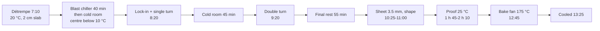

# 22.2 · The Written Phase: Technical Sheet and Organigramme

The production test opens with a short written phase: from an order, you complete a technical sheet and the organigramme of the whole order before you touch any dough. This lesson turns the methods of [Modules 6](../module-06/lesson-01.md) and [14](../module-14/lesson-01.md) into a fast, fixed routine, shows where the time comes from when a same-day croissant chain must fit a shorter window, and ends with a timed drill on a practice order with a model answer.

## Why it matters

The written phase is short and is marked on its own line of the grid (see [The CAP Boulanger Exam](../../references/cap-exam.md) for its time, its points and the documents you may bring). It also sets up the rest of the day: a sheet with a slip in the flour weight gives you a dough that is short or wasteful, and an organigramme without the oven plan or the critical path gives you an afternoon of doughs waiting for an oven. The référentiel's indicators for this work are plain: sheets that match the order, a coherent sequence of tasks, exact calculations. A routine you have drilled ten times is what lets you meet them calmly in a short window.

## Key terms

| French | Say it | English meaning |
|---|---|---|
| fiche technique | *feesh tek-NEEK* | technical sheet: formula, batch weights, temperatures, process and targets of one dough |
| organigramme de travail | *or-ga-nee-GRAM duh tra-VAH-yuh* | work schedule for the whole order: every stage of every dough on one timeline |
| commande | *koh-MAHND* | the order: products, numbers, weights, deadline and what is supplied |
| cahier de recettes | *ka-YAY duh ruh-SET* | your personal recipe notebook: one page per sheet, with your own notes |
| chemin critique | *shuh-MAN kree-TEEK* | the longest chain of stages, which sets the earliest finish |
| plan de cuisson | *plahn duh kwee-SOHN* | oven plan: which load goes in which oven or deck, at what temperature and time |
| cellule de refroidissement | *seh-LÜL duh ruh-frwa-dees-MAHN* | blast chiller: cools products or dough fast; also used to shorten the chill of a détrempe |
| tour double / tour simple | *toor DOO-bluh / toor SAN-pluh* | book fold (one sheet folded into four) / letter fold (folded into three) |

## How it works

### A fixed order of work

Speed in a written phase comes from never deciding what to do next. Use the same six steps every time:

1. **Read and underline (about 3 minutes).** Products, numbers, unit weights, deadline, what is supplied ready (for example a pâte fermentée or a cream), equipment, start time. Write the deadline at the top of the organigramme.
2. **Technical sheet (about 10 minutes).** Total dough = pieces × unit weight; + 2 % for losses; flour = total ÷ sum of baker's % × 100, rounded up as the order says; every ingredient = flour × its %; check the column adds up to at least the total needed (lesson [06.2](../module-06/lesson-02.md)). Then the water temperature, with four factors when a pre-ferment comes in from the cold (lesson [05.3](../module-05/lesson-03.md)). Then the process and its targets.
3. **Critical path (1 minute).** The longest chain sets the earliest finish. In a same-day order with a laminated dough, it is the laminated dough: start it in the first minutes (lesson [14.4](../module-14/lesson-04.md)).
4. **Oven plan before the dough plans (3 minutes).** Loads by temperature: bread on the hot deck with steam, viennoiserie in the fan oven, the enriched dough on a deck brought down. Preheat times and temperature changes written on it.
5. **Work backwards and fill the gaps (about 10 minutes).** Place each dough so it reaches its oven slot ready; fit mixing, dividing and shaping into the rests of the critical path; hands blocks never overlap; small tasks (folds, egg wash, loading) in between.
6. **Check (2 minutes).** The five checks of the [organigramme template](../../templates/organigramme.md): oven conflicts, longest process first, laminated dough resting while bread is in pointage, cleaning in the plan, finish before the deadline with spare time.

### Two croissant chains: standard and shortened

Learn both. The **standard chain** is the course sheet CR-01 as written: détrempe chilled at least 2 hours, three single turns with a rest between each, a final rest of at least 1 hour (lessons [11.2](../module-11/lesson-02.md), [11.4](../module-11/lesson-04.md)). From détrempe to cooled croissants it takes about 8 hours ([lesson 14.4](../module-14/lesson-04.md)). Use it whenever the window allows: it gives the most layers and the most relaxed dough.

```mermaid
flowchart LR
  A["Détrempe 7:10<br>20 °C, 2 cm slab"] --> B["Cold room 2 h<br>centre below 10 °C"]
  B --> C["Lock-in + single turn<br>9:10"]
  C --> D["Cold room 35 min"]
  D --> E["Single turn<br>9:55"]
  E --> F["Cold room 35 min"]
  F --> G["Single turn<br>10:40"]
  G --> H["Final rest 1 h"]
  H --> I["Sheet 3.5 mm, shape<br>11:50-12:25"]
  I --> J["Proof 25 °C<br>1 h 45-2 h 10"]
  J --> K["Bake fan 175 °C<br>14:20"]
  K --> L["Cooled 15:00"]
```

The **shortened chain** is for a window shorter than 8 hours. The time must come from somewhere, and it must never come from proofing above about 27 °C. Three moves, each with a reason:

| Move | Saves | Why it works | Limit |
|---|---|---|---|
| Chill the flattened détrempe in a blast chiller or freezer for about 40 minutes, then the cold room | about 1 hour | The purpose of the chill is a firm détrempe, centre below 10 °C, as firm as the butter (lesson [11.2](../module-11/lesson-02.md)): a 2 cm slab at −18 °C gets there far faster than at 3 °C. Elle & Vire's professional method starts with about 40 minutes in the freezer. | Less gluten relaxation: if the dough springs back at lock-in, give it 10 more minutes; never let the edges freeze |
| One single and one double turn instead of three singles | one rest (about 30-45 min) | Two turns and two rests instead of three; the course already uses this in warm kitchens (lesson [11.4](../module-11/lesson-04.md)), and Elle & Vire uses a simple then a double turn | Fewer layers (3 × 4 = 12 butter layers instead of 27): a slightly more bready honeycomb; practise it so you know the result |
| Final rest of 40-50 minutes in the cold room | 10-20 min | The block must be cold and relaxed enough to roll to 3.5 mm without shrinking; Elle & Vire rests 30-40 minutes in the fridge before shaping | If the cut triangles shrink, rest the sheet 10 minutes more |

With these, the chain in the practice order below runs from 7:10 to cooled croissants at about 13:25, about 6 h 15.

| | Standard chain (CR-01) | Shortened chain |
|---|---|---|
| Détrempe chill | at least 2 h in the cold room | about 40 min in a blast chiller or freezer, then the cold room |
| Turns | 3 single turns (27 butter layers) | 1 single + 1 double (12 butter layers) |
| Rests between turns | 2 rests of 30-45 min | 1 rest of about 45 min |
| Final rest | at least 1 h | 40-55 min |
| Détrempe to cooled croissants | about 8 h | about 6 h 15 |
| Result | finest honeycomb, most relaxed sheet | slightly more bready honeycomb; needs practice |
| Use it | whenever the window allows | when the window is shorter than 8 h |
 The moves are this course's planning choices, consistent with the CR-01 temperature targets; your training centre may teach other ones. Whatever the method, rehearse it before the exam, never for the first time on the day.

### Your recipe notebook

Check in the [exam reference](../../references/cap-exam.md) which documents you may bring to the written phase. If a personal recipe notebook is allowed, build it now: one page per course sheet (PC-02, TR-01, VI-01, CO-01, PM-01, CA-01, CR-01, PL-01, PB-01, CP-01), each with the baker's percentages and their sum, the target dough temperature, the friction factor you measured, the process times at the target temperature, the oven settings and your own notes from your bake logs. A sheet whose percentages already add up saves you a minute and a slip.

## Worked example

Karim, training for the written phase, gets a small practice order: PC-02 pain courant, 16 baguettes of 250 g, 4 boules of 400 g and 20 rolls of 50 g; pâte fermentée supplied from the cold room at 4 °C; flour 18 °C, fournil 20 °C; friction factor 26 (four factors, improved mixing). Losses 2 %, flour rounded up to the next 100 g.

**Step 1: total dough.** 16 × 250 + 4 × 400 + 20 × 50 = 4,000 + 1,600 + 1,000 = 6,600 g; with 2 %: 6,600 × 1.02 = 6,732 g.

**Step 2: flour.** PC-02 adds up to 100 + 64 + 1.8 + 1.5 + 15 = 182.3 %. Flour = 6,732 ÷ 1.823 = 3,693 g → **3,700 g**.

**Step 3: every line.** Water 3,700 × 0.64 = 2,368 g; salt 66.6 g; fresh yeast 55.5 g; pâte fermentée 555 g; total 6,745.1 g ≥ 6,732 g. Check passed.

**Step 4: water temperature.** Target 24 °C × 4 factors = 96. Water = 96 − 18 − 20 − 4 − 26 = **28 °C**.

**Step 5: where the slips hide.** Karim checks his answer against the four classic slips:

| Slip | What it gives | Why it is wrong |
|---|---|---|
| Pâte fermentée left out of the sum (167.3 %) | flour 4,024 → 4,100 g | the pâte fermentée is part of the dough weight, so it belongs in the sum |
| Losses forgotten | 3,620 → 3,700 g (same here, by luck of the rounding) | on another order it would be 100 g short; always add them |
| Salt as 1.8 % of the dough | 121 g | baker's % are of the flour: 66.6 g |
| Three factors with a cold pâte fermentée | 72 − 18 − 20 − 26 = 8 °C | ignoring the 4 °C pre-ferment gives water 20 °C too cold and a dough far below target |

**Step 6: time.** Karim took 9 minutes for the sheet, 2 minutes over his budget, because he re-added the percentages. He writes the sum (182.3 %) on his notebook page for PC-02. Next drill: 7 minutes.

## Practice

A timed drill: one practice order, a technical sheet for the pain courant, an organigramme for the whole order. Do it in 30 minutes with a clock in view, then mark it with the model answer. Repeat the drill a week later from memory of the method, not of the answer.

### You need

- A calculator, a pencil, a copy of the [production sheet template](../../templates/production-sheet.md) and of the [organigramme template](../../templates/organigramme.md) (extend the timeline to 15-minute slots from 7:00 to 14:15), a timer.
- Your recipe notebook if your exam allows one, with the course sheets PC-02 (lesson [08.1](../module-08/lesson-01.md)), VI-01 ([10.6](../module-10/lesson-06.md)), CR-01 ([11.2](../module-11/lesson-02.md)) and PL-01 ([12.3](../module-12/lesson-03.md)).
- Professional equivalent: the exam paper and its blank documents, at a table in the exam centre.

### The order

> **Boulangerie Au Pain de la Halle — Commande d'entraînement 22-A** (practice order, not an exam subject)
>
> | Produit | Quantité | Poids pâton | Fiche |
> |---|---|---|---|
> | Baguettes (dont 1 épi) | 12 | 300 g | PC-02 |
> | Boules | 4 | 350 g | PC-02 |
> | Fendus | 4 | 350 g | PC-02 |
> | Petits pains, 3 formes (8 de chaque) | 24 | 60 g | PC-02 |
> | Baguettes viennoises | 6 | 250 g | VI-01 |
> | Croissants / pains au chocolat / pains aux raisins | 10 / 10 / 10 | 60 g / 58 g / 50 g | CR-01 |
> | Pain au lait: 1 tresse à 3 branches; 10 navettes; 6 hérissons | 1 / 10 / 6 | 300 g / 50 g / 60 g | PL-01 |
>
> Fournis en chambre froide (3 °C): pâte fermentée PC-02; crème pâtissière prête. Pertes 2 %; farine arrondie à la centaine de grammes supérieure.
> Relevés: farine 20 °C, fournil 22 °C, pâte fermentée sortie à 7:30, environ 5 °C; facteur de friction PC-02 (4 facteurs, pétrissage amélioré): 26.
> Un candidat. Début 7:00. Produits présentés à 14:00; poste propre à 14:15.
> Équipement: un pétrin à spirale; four à soles, 2 soles à thermostats indépendants (par sole: 12 baguettes, ou 10 pièces façonnées, ou 24 petits pains, ou 2 plaques 40 × 60), 60 min pour monter à 250 °C, 40 min pour descendre à 180 °C; four ventilé 5 plaques (20 min pour 175 °C); armoire de pousse 25 °C, 75-80 % HR; cellule de refroidissement; chambre froide 3 °C; laminoir.

In English: a pain courant order in four shapes, six baguettes viennoises, a croissant lamination cut into three products, and a pain au lait in a braid and small pieces; pâte fermentée and crème pâtissière are ready; one baker from 7:00, products presented at 14:00.

### In Israel

Checked 2026-10-09.

- **The paper is in French.** The drill order is written in French on purpose: the exam's documents are French, whatever kitchen you practise in. Keep a list of every word you had to look up and learn it before the next drill; the course [glossary](../../glossary.md) has the trade terms.
- **Same method, your kitchen's numbers.** The sheet you write for the drill uses a bakery's readings. When you turn it into a home plan (lessons [22.3](lesson-03.md)-[22.5](lesson-05.md)), redo the water temperature with your kitchen's readings: in an August kitchen at 30 °C with flour at 29 °C, pâte fermentée at 8 °C and a hand friction factor of 8, PC-02 needs 96 − 29 − 30 − 8 − 8 = **21 °C** water, blended from tap and fridge water (lesson [05.2](../module-05/lesson-02.md)).
- **Flour weights stay the same** whatever Israeli flour you use; only the water may move by a few points ([Flour in Israel](../../references/flour-in-israel.md)). Write any change in your recipe notebook as a note, not in the sheet's percentages, so the exam sheet stays the French one.

### Steps

1. Start the timer: 30 minutes.
2. Read and underline the order (step 1 of the routine).
3. Complete the technical sheet for the PC-02 dough: total dough, flour, every ingredient, check, water temperature, process with times and targets, oven settings.
4. Write the batch flour for VI-01, CR-01 and PL-01 in one line each (no full sheet).
5. Name the critical path; write the oven plan; fill in the organigramme backwards from 14:00, with cleaning slots, the egg-wash and loading moments, and the presentation.
6. Stop at 30 minutes, even if unfinished. Note where you were.
7. Mark your work with the model answer below: one point for each correct figure on the sheet, and the six organigramme checks. Write your slips in your bake log.

### Targets

- Sheet complete with **no calculation slip**; the batch column adds up to at least the total dough needed.
- Organigramme complete within **30 minutes**: critical path named, every oven load with its temperature, no two hands blocks at the same time, cleaning and presentation planned, products ready before 14:00.
- On the second attempt, finished with at least **5 minutes** to check.

### How you know it worked

Someone else could run the day from your two documents without asking you a question, and your figures match the model answer to the gram (or differ only by a rounding you can justify).

Model answer: technical sheet PC-02

**Totals.** 12 × 300 + 8 × 350 + 24 × 60 = 3,600 + 2,800 + 1,440 = 7,840 g; × 1.02 = 7,997 g. Flour = 7,997 ÷ 1.823 = 4,387 → **4,400 g**.

| Ingredient | Baker's % | Batch |
|---|---|---|
| Flour T55 | 100 | 4,400 g |
| Water | 64 | 2,816 g |
| Salt | 1.8 | 79.2 g |
| Fresh yeast | 1.5 | 66 g |
| Pâte fermentée | 15 | 660 g |
| **Total** | **182.3** | **8,021.2 g** (≥ 7,997 g) |

**Water temperature.** 24 × 4 = 96; 96 − 20 − 22 − 5 − 26 = **23 °C**.

**Process.** Frasage 4 min speed 1 (salt after 1 min, pâte fermentée at the end); about 6 min speed 2; dough **24 °C**. Pointage 45-55 min with one fold, judged on the dough. Divide 12 × 300 g, 8 × 350 g, 24 × 60 g; pre-shape; détente about 25 min. Shape baguettes (one kept for the épi), 4 boules, 4 fendus, 24 rolls in three shapes. Apprêt about 1 h at 25 °C, 75-80 % RH (rolls on a rack in the fournil, slower). Score; bake at 250 °C with steam: baguettes about 22-25 min, boules and fendus about 28-30 min, rolls about 15-16 min. Cool on racks at least 30 min before checking.

**Other batches.** VI-01: 1,500 × 1.02 = 1,530 ÷ 1.793 = 853 → **900 g**. CR-01: 10 × 60 + 10 × 58 + 10 × 50 = 1,680 g ÷ 0.90 × 1.02 = 1,904 g ÷ 2.27 = 839 → **900 g** (détrempe 1,593 g, beurrage 450 g, 20 batons). PL-01: 300 + 500 + 360 = 1,160 × 1.02 = 1,183 ÷ 1.955 = 605 → **700 g**.

Model answer: oven plan and organigramme

**Critical path:** CR-01, 7:10 to cooled croissants about 13:25, with the three moves of "How it works".

**Oven plan.**

| Oven | Time | Load | Setting |
|---|---|---|---|
| Deck (on 10:00) | 11:00-11:25 / 11:00-11:30 | top: 12 baguettes; bottom: 4 boules + 4 fendus | 250 °C, steam |
| Deck top | 11:30-11:46 | 24 rolls | 250 °C, steam; then off |
| Deck bottom | 11:30-12:10 | doors ajar, down to 180 °C | — |
| Fan (on 11:05) | 11:27-11:43 | 6 baguettes viennoises | 175 °C, no steam; off until 12:25 |
| Fan | 12:45-13:05 | PAR, PAC, croissants (3 trays) | 175 °C |
| Deck bottom | 12:55-13:18 | braid; small pieces out about 13:08 | 180 °C, no steam |

**Organigramme (your hands; small tasks in brackets).**

| Time | You | Doughs meanwhile |
|---|---|---|
| 7:00-7:10 | weigh CR-01, cold liquids | — |
| 7:10-7:20 | détrempe 20 °C, flatten 2 cm, film, blast chiller | chiller 40 min, then cold room |
| 7:20-7:30 | butter plaque 450 g, cold room; soak raisins | |
| 7:30-7:45 | readings, water temperatures; weigh PC-02, PL-01; pâte fermentée out | |
| 7:45-8:00 | PC-02 mix, 24 °C | pointage 8:00-8:55 |
| 8:00-8:20 | PL-01 mix, 24 °C | pointage 8:20-9:05, then cold |
| 8:20-8:35 | lock-in and single turn (détrempe centre below 10 °C checked) | rest 45 min |
| 8:35-8:55 | (PC fold); weigh and mix VI-01, 25 °C; scrape mixer | VI pointage 8:55-9:30 |
| 8:55-9:20 | PC divide 44 pieces, pre-shape; (9:05 PL flattened, cold room) | détente 9:20-9:45 |
| 9:20-9:30 | double turn | final rest until 10:25 |
| 9:30-9:45 | VI divide 6 × 250 g, pre-shape; clear bench, couches and boards | VI détente |
| 9:45-10:15 | PC shape: baguettes, boules, fendus to the cabinet; rolls on a rack in the fournil; (deck on 10:00) | apprêt until 11:00 / 11:30 |
| 10:15-10:25 | VI shape, first egg wash, cabinet | apprêt until 11:25 |
| 10:25-11:00 | final sheet 3.5 mm on the sheeter; pains aux raisins, pains au chocolat, croissants; first egg wash; cabinet | proof until 12:45 |
| 11:00-11:05 | cut the épi, score, load the deck with steam; (fan oven on) | |
| 11:05-11:20 | clean sheeter, rolling pin, bench | |
| 11:20-11:35 | PL divide cold: 3 × 100 g, 10 × 50 g, 6 × 60 g; (11:25 VI second egg wash, cuts, load fan; unload baguettes; 11:30 unload boules and fendus, load rolls, bottom deck down to 180 °C) | |
| 11:35-12:05 | PL shape: braid, navettes, hedgehogs; first egg wash; cabinet; (11:43 unload VI, fan off; 11:46 unload rolls, top deck off) | apprêt until 12:55 |
| 12:05-12:35 | weigh and check the breads, labels; clean mixer and bench; record | |
| 12:35-12:45 | (fan on 12:25); second egg wash; load PAR, PAC, croissants at 12:45 | |
| 12:45-13:05 | PL second egg wash, snip hedgehogs; load PL at 12:55; unload viennoiserie 13:01-13:05 | |
| 13:05-13:20 | unload PL (13:08, 13:18); ovens off; tidy oven area | cooling |
| 13:20-14:00 | present all products; count, weigh, look; cut one croissant; record any non-conformity | braid cooled about 13:48 |
| 14:00-14:15 | final cleaning | |

**Checks.** Proofs: pains aux raisins about 2 h 10, pains au chocolat about 1 h 55, croissants about 1 h 45, all at 25 °C (below 27 °C). Cabinet at one setting, 25 °C, for PC, VI, CR and PL. The mixer runs détrempe, PC, PL, VI in that order, scraped between doughs; the pain au lait contains egg and is labelled. The crème pâtissière stays in the cold room until 10:25 and goes back between uses. Ovens are switched off when not needed. Last product cooled at about 13:48 for 14:00: 12 minutes spare. Weak point: the croissant proof; if it runs slow, the croissants are the late product and you say so.

```mermaid
gantt
  title Practice order 22-A, one baker
  dateFormat HH:mm
  axisFormat %H:%M
  section CR-01
  Weigh, détrempe          :c1, 07:00, 20m
  Chiller, cold room       :c2, after c1, 60m
  Lock-in, single turn     :c3, 08:20, 15m
  Rest                     :c4, after c3, 45m
  Double turn              :c5, 09:20, 10m
  Final rest               :c6, after c5, 55m
  Sheet and shape          :c7, 10:25, 35m
  Proof 25 °C              :c8, after c7, 105m
  Bake (fan)               :c9, 12:45, 20m
  section PC-02
  Weigh, mix               :p1, 07:30, 30m
  Pointage                 :p2, 08:00, 55m
  Divide, détente          :p3, 08:55, 50m
  Shape                    :p4, 09:45, 30m
  Apprêt                   :p5, 10:00, 75m
  Bake (deck)              :p6, 11:00, 46m
  section VI-01
  Mix, pointage            :v1, 08:35, 55m
  Divide, détente, shape   :v2, 09:30, 55m
  Apprêt, bake             :v3, 10:25, 78m
  section PL-01
  Mix, pointage, cold      :l1, 08:00, 200m
  Divide, shape            :l2, 11:20, 45m
  Apprêt                   :l3, 12:05, 50m
  Bake (deck 180 °C)       :l4, 12:55, 23m
  section Close
  Check, present, clean    :z1, 13:20, 55m
```

### Self-check

- [ ] I followed the six steps in order and kept to my time budget for each.
- [ ] My sheet had no slip, or I wrote down the slip and its cause.
- [ ] I named the critical path and wrote the oven plan before the dough plans.
- [ ] My organigramme has cleaning, presentation and the cold storage of semi-finished products.
- [ ] I know where the real written phase's rules are and checked my recipe notebook against them.

## What goes wrong

| Symptom | Likely cause | Fix now | Prevent next time |
|---|---|---|---|
| Flour about 15 % too high | Pre-ferment left out of the sum of percentages | Re-add the sum; recalculate every line | Write each sheet's sum in your notebook |
| Salt or yeast doubled | Baker's % applied to the dough instead of the flour | Recalculate from the flour | Circle "of flour" on the sheet's header |
| Dough far below target temperature | Three factors used with a cold pre-ferment | Recalculate with four factors | Four factors whenever a pre-ferment is in the dough |
| Organigramme unfinished at the end of the drill | No time budget; drawn forwards from the start | Fill the critical path and oven plan first, then the rest | Six steps, backwards from the deadline, timed |
| Croissants an hour late in the plan | Lamination started after the bread, or sheet minimums kept with no time to spare | Start the détrempe first; apply the chiller and double-turn moves | Critical path first, rehearsed compression |
| Two doughs need your hands at 9:30 | Small and big tasks not separated | Move one block 10-15 minutes into a rest of the critical path | Hands check line by line |

## Review

- Use a fixed routine: read, sheet, critical path, oven plan, backwards, check; budget the time of each step.
- The four classic slips are a missing pre-ferment in the sum, forgotten losses, percentages of the dough instead of the flour, and three factors with a cold pre-ferment.
- Know both croissant chains: the standard CR-01 chain (about 8 h, three single turns) when the window allows, and the shortened chain (about 6 h 15: blast chiller, one single + one double turn, shorter final rest) when it does not. Time never comes from a warm proof; rehearse whichever you will use.
- The written phase's time, points and allowed documents are in [The CAP Boulanger Exam](../../references/cap-exam.md); drill until you finish with time to check.
