# 22.3 · Rehearsal: Bread Products

This is the first full rehearsal: a half day of bread, run to a written plan, from the readings to the clean bench. You make PC-02 pain courant on 1 kg of flour as baguettes, an épi, two shaped pieces and rolls in three shapes, plus a pain viennois on 500 g of flour, and you bake them through a one-tray oven in a planned queue. The products are the ones of [Modules 8](../module-08/lesson-01.md) and [10](../module-10/lesson-01.md); what is new is doing them together, to the clock, and scoring both the products and your work.

## Why it matters

You have made each of these breads before, one at a time. The production test asks for several at once, with one pair of hands, under observation (lesson [22.1](lesson-01.md)), and the families of products in its order are listed in [The CAP Boulanger Exam](../../references/cap-exam.md). Two things only a rehearsal teaches: how long your hands really take for each block (dividing 13 pieces, shaping four families), and what the oven queue does to the doughs that wait. A plan that looked fine on paper meets your real speed here, and the gap is what you work on next.

## Key terms

| French | Say it | English meaning |
|---|---|---|
| répétition | *ray-pay-tee-SYOHN* | a rehearsal: the whole production run to the clock, as close as you can to the real conditions |
| feuille de route | *fuhy duh ROOT* | your one-page plan for the day: times, doughs, oven loads, checks |
| fournée | *foor-NAY* | one oven load and its bake |
| pièces façonnées | *pyess fa-soh-NAY* | shaped pieces such as boule, bâtard, fendu, tabatière, couronne |
| petits pains | *puh-TEE PAN* | rolls; here 60 g pieces in three shapes |
| épi | *ay-PEE* | baguette cut with scissors into alternating "ears" |
| ressuage | *reh-sü-AHZH* | cooling after baking, while steam and some weight leave the bread |
| contrôle des poids | *kohn-TROHL day PWAH* | weight check of finished products (lesson [15.4](../module-15/lesson-04.md)) |

## How it works

### One dough, four shape families

PC-02 on 1 kg of flour gives 1,823 g of dough: enough for three long pieces (two baguettes and an épi), two shaped pieces and six rolls, plus the next pâte fermentée. Shaping four families from one dough means four different apprêt speeds: rolls proof fastest (small), baguettes next, boules and fendus slowest (round, thick). With one oven tray, the order you **shape** is not the order you **bake**, so each family needs a place that sets its speed:

| Family | Shaped | Proofs in | Bakes | Why |
|---|---|---|---|---|
| 2 baguettes + épi | first | kitchen, about 24 °C | load 1, 250 °C, steam | ready first; the épi is cut just before loading (lesson [10.2](../module-10/lesson-02.md)) |
| Boule + fendu | second | banneton and floured cloth, coolest place in the room | load 2, 250 °C, steam | thick pieces, slow; they must wait about 30 minutes for the oven |
| 6 rolls | last | fridge until about 30 minutes before their load | load 3, 250 °C, steam | small and fast: without the cold they would be over-proofed by their turn |
| Pain viennois | later dough | warm spot, about 25 °C | load 4, 190 °C, no steam | lower temperature, so last, after the oven comes down |

### The oven queue

A home oven takes one tray at a time and recovers between loads. Every load's time = bake time + about 5 minutes to reload the steam tray and let the oven recover. Hottest loads first, the coolest last: bringing an oven down is a matter of minutes with the door open; bringing it up takes much longer. A tray that is ready but has no oven goes somewhere cooler, never onto a warm counter.

### The half-day plan

```mermaid
gantt
  title Bread rehearsal at home, kitchen about 24 °C
  dateFormat HH:mm
  axisFormat %H:%M
  section PC-02 (1 kg flour)
  Readings, weigh, set up       :a1, 06:00, 20m
  Mix by hand, 24 °C            :a2, after a1, 20m
  Pointage, fold at 30 min      :a3, after a2, 60m
  Divide, pre-shape             :a4, 07:40, 15m
  Détente                       :a5, after a4, 20m
  Shape 4 families              :a6, 08:15, 25m
  Apprêt baguettes and épi      :a7, 08:25, 50m
  Load 1, baguettes and épi     :a8, 09:15, 25m
  Apprêt boule and fendu (cool) :a9, 08:32, 73m
  Load 2, boule and fendu       :a10, 09:45, 28m
  Rolls in the fridge, then out :a11, 08:40, 95m
  Load 3, rolls                 :a12, 10:15, 16m
  section VI-01 (500 g flour)
  Mix, 25 °C                    :b1, 07:15, 20m
  Pointage, then fridge         :b2, after b1, 85m
  Divide, détente               :b3, 09:00, 30m
  Shape, egg wash, apprêt       :b4, 09:30, 70m
  Load 4, 190 °C, no steam      :b5, 10:40, 16m
  section Oven and close
  Preheat 250 °C with steam tray :o1, 08:30, 45m
  Door open, down to 190 °C      :o2, 10:31, 9m
  Cooling and evaluation         :o3, 10:56, 64m
```

## Worked example

Noa ran this rehearsal for the first time on a Friday, alone, with a phone timer and the plan above. Her log, and what she concluded:

| Planned | Real | Effect |
|---|---|---|
| PC-02 mixed 6:20-6:40, 24 °C | 6:20-6:46, 25.5 °C (water calculated with the wrong room reading) | pointage done at 7:30 instead of 7:40 (60 ÷ 1.07^1.5 ≈ 55 min), dough a little ahead |
| Divide 13 pieces in 15 min | 22 min, three pieces re-weighed twice | détente short, two baguettes tore at shaping |
| Shape 4 families in 25 min | 31 min | rolls went into the fridge at 8:46 |
| Load 1 at 9:15 | 9:15, as planned | baguettes 37, 38, 36 cm; grignes open on two of three |
| Load 2 at 9:45 | 9:45 | boule slightly over-proofed: it had sat in the warmest corner, not the coolest |
| Load 3 at 10:15 | 10:20 (rolls not out of the fridge in time) | rolls under-proofed, tight cuts |
| Load 4 at 10:40 | 10:47 | viennois a little over-proofed; cuts spread |

**Scores.** Pain courant 14/20 on the [quality rubric](../../templates/quality-rubric.md), viennois 15/20. Weights: 13 pieces of PC-02, eleven within ± 2 g at division, two within ± 4 g.

**Diagnosis (lesson [16.1](../module-16/lesson-01.md): symptom, evidence, cause, action).** The first slip (the room reading) made the dough 1.5 °C warm and moved everything about 10 minutes earlier; the slow dividing then ate the détente. One cause upstream, three symptoms downstream. Her two actions for the next rehearsal: read the room temperature at the bench, not at the door; and a dividing drill of 15 pieces with a timer before the next bake (target: 15 minutes). She also writes "boule: coolest place = by the window, not by the oven" on her plan. A late load (10:20) cost the rolls their proof; she adds an alarm at 9:45 for "rolls out".

## Practice

Run the half-day rehearsal of the plan above, alone, dressed as for the exam, with the observation checklist from lesson [22.1](lesson-01.md) if someone can watch. Then score the products and your work.

### You need

- Minimum: scales (1 g and 0.1 g), probe thermometer, two large bowls, scraper, bench knife, 3-4 L lidded container, small lidded tub for the pâte fermentée, couche or floured tea towels, one banneton or a bowl lined with a floured cloth, rolling pin or thin rod for the fendu, scissors, lame, one baking tray and baking paper, metal steam tray, oven gloves, oven thermometer, wire racks, pastry brush, timer and a clock, ruler, labels and marker.
- Documents: your plan, the [temperature log](../../templates/temperature-log.md), the [bake log](../../templates/bake-log.md), the [quality rubric](../../templates/quality-rubric.md), the observation checklist.
- Optional: a stand mixer with a dough hook (the exam mixes by machine; by hand is the course's default).
- Professional equivalent: spiral mixer, couches and transfer board, proofing cabinet, two-deck oven with steam, cooling racks; the batch would be 4-6 times larger.

### Ingredients

**The evening before: pâte fermentée** (a mini PC-02 dough; you need 150 g):

| Ingredient | Baker's % | Weight |
|---|---|---|
| Flour T55 | 100 | 100 g |
| Water at about 24 °C | 64 | 64 g |
| Fine salt | 1.8 | 1.8 g |
| Fresh yeast (or 0.5 g instant dry) | 1.5 | 1.5 g |
| **Total** | **167.3** | **about 167 g** |

**PC-02 on 1 kg of flour:**

| Ingredient | Baker's % | Home batch | Professional (practice order 22-A) |
|---|---|---|---|
| Flour T55 | 100 | 1,000 g | 4,400 g |
| Water at the calculated temperature | 64 | 640 g | 2,816 g |
| Fine salt | 1.8 | 18 g | 79.2 g |
| Fresh yeast (or 5 g instant dry) | 1.5 | 15 g | 66 g |
| Pâte fermentée | 15 | 150 g | 660 g |
| **Total** | **182.3** | **1,823 g** | **8,021.2 g** |

Divide: 2 baguettes + 1 épi of 270 g (810 g), 1 boule + 1 fendu of 280 g (560 g), 6 rolls of 60 g in three shapes (360 g) = 1,730 g; keep 75 g as your next pâte fermentée; about 15-20 g stays in the bowl.

**VI-01 on 500 g of flour** (lesson [10.6](../module-10/lesson-06.md)):

| Ingredient | Baker's % | Home batch |
|---|---|---|
| Flour T45 or T55 | 100 | 500 g |
| Whole milk at the calculated temperature | 58 | 290 g |
| Fine salt | 1.8 | 9 g |
| Fresh yeast (or 6 g instant dry) | 3.5 | 17.5 g |
| Sugar | 6 | 30 g |
| Butter, soft | 10 | 50 g |
| **Total** | **179.3** | **896.5 g** |
| Egg wash: 1 egg beaten with a pinch of salt | — | 1 egg |

Three baguettes viennoises of 280 g (840 g); the rest makes one small roll.

### In Israel

Checked 2026-10-09.

- **Flour:** white flour (קמח לבן, *kemakh lavan*) for both doughs, read as in [Flour in Israel](../../references/flour-in-israel.md). With 1 kg of a strong Israeli flour, keep 20 g of the water back and add it during kneading if the dough is tight (up to 66 %); give the boule and fendu 10 more minutes of détente rather than more force.
- **Start early in summer.** Coastal July-August nights average about 23-24 °C and afternoons about 29-30 °C. Start at 5:30 instead of 6:00, and finish the oven work before the kitchen heats up; the oven itself adds heat for three hours.
- **Water and milk:** PC-02 in a 30 °C kitchen with flour at 29 °C and pâte fermentée at 8 °C: 96 − 29 − 30 − 8 − 8 = **21 °C** water, blended from tap and fridge water (lesson [05.2](../module-05/lesson-02.md)). VI-01: 75 − 29 − 30 − 6 = **10 °C**, milk almost straight from the fridge.
- **Proofing places in a hot kitchen:** your "coolest place" for the boule and fendu may be the air-conditioned room; the rolls go in the fridge at once; the viennois proofs at room temperature (it wants about 25 °C, which a summer kitchen already is). At 28-30 °C every apprêt is about a third shorter than in the plan: start the poke tests early and move load times forward, never back.
- **Pâte fermentée:** 20 minutes at room temperature in summer, not an hour, before the fridge.
- **Oven:** most Israeli home ovens take a tray of about 40 × 35 cm; a 270 g baguette shaped to about 35 cm fits diagonally. Check your oven's real temperature with an oven thermometer: dials are often 10-20 °C out.

### Steps

> [!WARNING]
> The oven runs at 250 °C with steam for about an hour and a half. Use dry oven gloves; steam only into a metal tray preheated in the oven, never into a glass or ceramic dish (it can shatter); pour, close the door and step back from the steam. Score and cut the épi with the blade or scissors moving away from your fingers, and cover the lame after use.

1. **The evening before:** mix the pâte fermentée, 1 hour at room temperature (20 minutes in summer), then the fridge. Write your plan with your own times, starting from the gantt above. Lay out the equipment.
2. **6:00:** dress, wash your hands, take the readings (flour, room at the bench, pâte fermentée), calculate both water and milk temperatures, weigh both doughs, label everything. Set out the couche, banneton, trays and steam tray.
3. **6:20:** mix PC-02 (frasage 4 minutes, salt after 1 minute, pâte fermentée at the end; knead 10-12 minutes by hand, or 4 minutes slow and 5-6 minutes second speed in a stand mixer). Measure and log the dough temperature (target 24 °C). Pointage about 60 minutes, fold at 30 minutes, judged on the dough. Clear and wipe the bench.
4. **7:15:** mix VI-01 (target 25 °C), butter added once the gluten has formed. Pointage 35 minutes, then flatten it in a filmed container and put it in the fridge.
5. **7:40:** divide PC-02 to weight (± 2 g, at most one add-on piece), pre-shape, détente about 20 minutes. Put the 75 g of pâte fermentée in a labelled tub in the fridge.
6. **8:15:** shape the baguettes and the épi pâton first, then the boule (into the banneton) and the fendu, then the six rolls in three shapes. Rolls go straight into the fridge, boule and fendu to the coolest place. Write each apprêt start time.
7. **8:30:** oven on at 250 °C with the tray and the steam tray inside. Clean the bench and bowls.
8. **9:00:** divide the cold VI-01 into 3 × 280 g, pre-shape, détente 20-30 minutes; at 9:30 shape three baguettes viennoises, first egg wash, cover; apprêt in a warm spot.
9. **9:15, load 1:** poke test; cut the épi; score the baguettes; load; steam; vent at about 10 minutes; bake about 22-25 minutes to deep golden-brown and a core of at least 93 °C. Onto the rack.
10. **9:45, load 2:** rolls out of the fridge now. Reload the steam tray; score the boule; the fendu goes in groove up; bake about 28 minutes.
11. **10:15, load 3:** rolls, scored or snipped as their shape needs; steam; about 15-16 minutes.
12. **10:31:** open the oven door to bring it down to about 190 °C; take the steam tray out with gloves. At 10:40 give the viennois its second egg wash and the oblique cuts; **load 4** without steam, about 16 minutes.
13. **Close:** clean the station while the bread cools. From about 11:25, when everything has cooled at least 30 minutes, weigh and measure every piece, rate the crust colour on the 1-5 scale (lesson [15.1](../module-15/lesson-01.md)), cut one baguette and the boule, score each product with the rubric, and fill in the bake log.
14. **Review:** compare planned and real times line by line, as in the worked example. Write the one cause upstream that explains most of the gaps, and two actions for the next rehearsal.

### Targets

- PC-02 dough **24 °C ± 1 °C**, VI-01 **25 °C ± 1 °C**, both logged.
- All pieces within **± 2 g** at division; baked weights checked with the ± 3 % house tolerance of the rubric.
- Baguettes about 35 cm ± 2 cm, even; épi with about 5 alternating leaves; boule and fendu regular, fendu groove straight; rolls alike within each shape; viennois cuts regular, glossy crust, no steam.
- Every load into the oven within **10 minutes** of its planned time, no tray left waiting warm.
- Station clean within **15 minutes** of the last load out; whole rehearsal in about **6 hours**.
- Rubric: **14/20 or more** for each product on a first rehearsal; the gap to your target written down.

### How you know it worked

Each load went in on a poke test that said "ready", not "over" or "under", and your bake log shows planned and real times side by side. The products, cut and tasted, match the targets of lessons [08.5](../module-08/lesson-05.md), [10.1](../module-10/lesson-01.md), [10.2](../module-10/lesson-02.md) and [10.6](../module-10/lesson-06.md); where they do not, you can name the cause from your own log.

### Self-check

- [ ] I wrote my own plan, with load times, the evening before.
- [ ] I logged dough temperatures and adjusted the plan when a dough came out off target.
- [ ] I gave each shape family a place that set its proof speed.
- [ ] I loaded hottest first, and every waiting tray was somewhere cooler, not on the counter.
- [ ] I scored every product with the rubric after full cooling, and I know this self-assessment does not replace the official exam.

## What goes wrong

| Symptom | Likely cause | Fix now | Prevent next time |
|---|---|---|---|
| Everything runs early and the oven is not hot | Dough warmer than target (wrong reading or warm water) | Slow the shaped pieces in the cool or the fridge; switch the oven on at once | Readings at the bench; check the water temperature before pouring |
| Dividing far over its slot, pieces tear at shaping | Slow dividing, short détente | Give 10 more minutes of détente; shape gently | Timed dividing drills; one cut, then small corrections |
| Boule and fendu over-proofed by load 2 | Proofed in a warm spot while load 1 baked | Bake at once, score shallow | Coolest place, or the fridge for 20 minutes, written on the plan |
| Rolls tight and cracked at the cuts | Out of the fridge too late, under-proofed | Give them 10 more minutes; bake a little longer at the end | Alarm for "rolls out" 30 minutes before their load |
| Viennois dull and streaky | Steam left in the oven after the bread | Nothing now; note it | Steam tray out before the viennois; egg wash in two thin coats |
| Bread pale and soft on the second load | Oven not recovered, steam tray cold | Bake 3-5 minutes longer, vent at the end | 5 minutes of recovery between loads; steam tray left in the oven |

## Review

- One dough in four shape families means four proof speeds: give each family a place (room, cool corner, fridge) that brings it ready at its oven slot.
- A one-tray oven is a queue: hottest loads first, about 5 minutes of recovery between loads, and the lowest temperature (viennois, no steam) last.
- Log planned and real times; most gaps trace back to one cause upstream, usually a dough temperature or a slow hands block.
- The rehearsal's products follow the families in [The CAP Boulanger Exam](../../references/cap-exam.md); your rubric score is a self-assessment and does not replace the official exam.
