# 22.4 · Rehearsal: Viennoiserie and Pâte Levée

The second rehearsal is the butter half of the work: one croissant lamination cut into croissants, pains au chocolat and pains aux raisins with a crème pâtissière, and a pain au lait shaped as a braid, navettes and hedgehogs. The détrempe is mixed the evening before, as most bakeries do; everything else happens in one morning to a written plan, with an oven queue at two close temperatures. Lesson 22.5 then puts the bread and the butter halves into one day.

## Why it matters

Viennoiserie punishes a plan more than bread does. Butter that warms by 5 °C smears into the détrempe and the honeycomb is gone; a crème pâtissière that cools slowly is a food-safety fault; a pain au lait that proofs while the croissants occupy the bench comes out over-proofed and pale. The families in the production test's order and what the exam centre supplies are in [The CAP Boulanger Exam](../../references/cap-exam.md); in this rehearsal you make everything yourself, including the cream, so that you have practised every step at least once.

## Key terms

| French | Say it | English meaning |
|---|---|---|
| pâte levée feuilletée | *paht luh-VAY fuh-yuh-TAY* | laminated yeast dough: croissant, pain au chocolat, pain aux raisins |
| pâte levée | *paht luh-VAY* | enriched yeast dough without lamination: pain au lait, pain brioché, brioche |
| abaisse | *a-BESS* | the rolled-out sheet of dough before cutting |
| laminoir | *la-mee-NWAR* | sheeter: rolls the dough to an exact thickness between two rollers |
| tresse / navette / hérisson | *TRESS / na-VET / ay-ree-SOHN* | braid / small oval roll / hedgehog (an animal shape snipped with scissors) |
| dorure | *doh-RÜR* | egg wash, given twice: after shaping and just before baking |
| crème pâtissière | *krem pa-tee-SYAIR* | pastry cream; cooled from 63 °C to 10 °C in 2 hours or less in this course |
| coupe (en coupe) | *KOOP* | cut section of a croissant, used to judge the honeycomb (lesson [11.7](../module-11/lesson-07.md)) |

## How it works

### What sets the order of the morning

- **The laminated dough is the critical path** even with the détrempe made the evening before: lock-in, three turns with 30-minute rests, a final rest of at least an hour, shaping, then a proof of 1 h 30-2 h 30 (lessons [11.4](../module-11/lesson-04.md)-[11.6](../module-11/lesson-06.md)). Lock-in comes first in the morning, after only the cream and the butter plaque.
- **The cream is cooked first** so it is cold long before the pains aux raisins are shaped: 63 °C to 10 °C in 2 hours or less, on ice, with both times logged (lesson [12.2](../module-12/lesson-02.md)).
- **The pain au lait fills the rests**: mixed while the butter plaque firms, fermented, then held cold, divided and shaped while the laminated block takes its final rest.
- **The oven runs two close temperatures**: about 180-190 °C for the pain au lait and 190-200 °C for the laminated products (conventional; 175-180 °C with fan). With only 10-15 °C between them, readiness decides the order, not temperature: the pain au lait is ready first, so it goes first, and the oven is turned up for the croissants.

### Temperatures that matter all morning

| Item | Target | Why |
|---|---|---|
| Détrempe at lock-in | firm, centre below 10 °C | as firm as the butter, so both stretch together |
| Butter plaque | about 13 °C (12-15 °C) | plastic: bends without cracking or melting |
| Room while laminating | at or below about 24 °C | above it, the butter softens within minutes |
| Laminated pieces in proof | 24-26 °C, never above about 27 °C | above it, butter melts out of the layers |
| Pain au lait in proof | 25-27 °C | a rich dough that proofs well a little warmer |
| Crème pâtissière | 63 → 10 °C in ≤ 2 h, then 0-3 °C (5 °C or below at home) | slow cooling lets bacteria grow in a rich, moist cream |

### The morning plan

```mermaid
gantt
  title Viennoiserie rehearsal at home (détrempe made the evening before)
  dateFormat HH:mm
  axisFormat %H:%M
  section CP-01
  Cook, ice bath, log 63 °C   :p1, 06:00, 25m
  Cool to 10 °C, fridge       :p2, after p1, 45m
  section CR-01
  Butter plaque, to 13 °C     :c0, 06:20, 35m
  Lock-in, turn 1             :c1, 06:55, 20m
  Rest                        :c2, after c1, 30m
  Turn 2                      :c3, 07:45, 10m
  Rest                        :c4, after c3, 30m
  Turn 3                      :c5, 08:25, 10m
  Final rest                  :c6, after c5, 60m
  Roll, cut, shape            :c7, 09:35, 40m
  Proof PAC and croissants    :c8, 10:00, 105m
  Proof PAR                   :c9, 09:50, 135m
  Bake croissants and PAC     :c10, 11:45, 18m
  Bake PAR                    :c11, 12:08, 20m
  section PL-01
  Mix by hand, 24 °C          :l1, 06:30, 25m
  Pointage, then fridge       :l2, after l1, 105m
  Divide cold                 :l3, 08:40, 15m
  Shape, egg wash             :l4, 09:00, 25m
  Proof 25-27 °C              :l5, 09:25, 60m
  Bake 185 °C                 :l6, 10:25, 22m
  section Oven and close
  Preheat 185 °C              :o1, 09:55, 30m
  Up to 200 °C                :o2, 10:47, 10m
  Cool, count, cut, score     :o3, 12:28, 52m
```

## Worked example

Yonatan ran this rehearsal in late June in a kitchen at 27 °C, with an air-conditioned living room at 24 °C. Extracts from his log:

| Time | Reading | Decision |
|---|---|---|
| 6:23 | cream 63 °C on ice | logged; 10 °C must be reached by 8:23 |
| 6:50 | cream 9 °C | logged; filmed, fridge |
| 6:55 | butter plaque 15 °C, détrempe centre 6 °C | plaque 5 more minutes in the fridge (to 13 °C); lock-in at 7:00 |
| 7:05 | butter edges shining during turn 1 | stopped, back in the fridge 10 minutes, finished the turn in the living room |
| 7:50 | kitchen 28 °C | turns 2 and 3 replaced by **one double turn** at 7:50 in the living room (lesson 11.4), final rest from 8:00 |
| 9:35 | final sheet springs back | 10 more minutes in the fridge; shaping 9:45-10:25 |
| 10:25 | PL braid ready (poke test springs back slowly) | loaded at 10:25 as planned |
| 11:55 | croissants wobble, almost doubled | loaded with the pains au chocolat |
| 12:15 | pains aux raisins | loaded |

**Results.** 4 croissants: 57, 58, 60, 61 g raw (target 60 g ± 3 g) → all within tolerance. Cut section: honeycomb open but thicker walls than his three-turn batch; no butter pool on the tray. Pains au chocolat: one unrolled (seam on the side). Pains aux raisins: pale bases. Braid: even, glossy; one hedgehog's spikes burnt at the tips.

**Diagnosis.** The double turn gave 12 butter layers instead of 27: thicker walls are expected, and the croissants are still laminated, not bready; it was the right call in a 28 °C kitchen. The unrolled pain au chocolat had its seam on the side (lesson [12.1](../module-12/lesson-01.md)). Pale bases on pains aux raisins come from a thick cream layer and a short bake (lesson [12.2](../module-12/lesson-02.md)): next time spread the cream about 2 mm thick and bake 2 minutes longer on the lowest shelf. Burnt spikes: snipped too thin and on the top shelf; snip deeper, middle shelf.

Score with the [quality rubric](../../templates/quality-rubric.md): viennoiserie 15/20. His two actions: start lamination at 6:30 in the living room with the AC on from 6:00; pains au chocolat seam down, checked one by one before proof.

## Practice

Run the rehearsal: détrempe the evening before, then the morning plan above, alone, dressed as for the exam. Score the products and your work as in lesson [22.3](lesson-03.md).

### You need

- Minimum: scales (1 g and 0.1 g), probe thermometer, rolling pin, ruler (at least 40 cm), pizza wheel or large knife, pastry brush, scissors, bowls, a saucepan and whisk for the cream, a shallow tray sitting in a larger tray of ice and water, cling film, two baking trays and baking paper, wire racks, oven gloves, oven thermometer, labels and marker; a cool room or air conditioning.
- Documents: your plan, the [temperature log](../../templates/temperature-log.md) (cream control points), the [bake log](../../templates/bake-log.md), the [quality rubric](../../templates/quality-rubric.md), the observation checklist from lesson [22.1](lesson-01.md).
- Professional equivalent: a spiral mixer for the détrempe and the pain au lait, a sheeter for the final sheet, a proofing cabinet at 25 °C and 75-80 % humidity, a blast chiller for the cream, a fan oven. What the exam requires to be done by hand and on the sheeter is in [The CAP Boulanger Exam](../../references/cap-exam.md); a sheeter is one of the machines you must still practise on (lesson [22.5](lesson-05.md)).

### Ingredients

**CR-01 on 500 g of flour** (détrempe the evening before; butter for lamination in the morning):

| Ingredient | Baker's % | Home batch | Professional (practice order 22-A) |
|---|---|---|---|
| Flour T45 | 100 | 500 g | 900 g |
| Water, cold | 26 | 130 g | 234 g |
| Whole milk, cold | 26 | 130 g | 234 g |
| Sugar | 11 | 55 g | 99 g |
| Salt | 2.0 | 10 g | 18 g |
| Fresh yeast (or 6.5 g instant dry) | 4.0 | 20 g | 36 g |
| Butter in the détrempe | 8 | 40 g | 72 g |
| Butter for lamination (≥ 82 % fat) | 50 | 250 g | 450 g |
| **Total** | **227** | **1,135 g** | **2,043 g** |
| Chocolate batons | — | 8 (about 42 g) | 20 |
| Egg wash: 1 egg + pinch of salt | — | 1 egg | pasteurised liquid egg |

Use: 4 pains aux raisins (about 190 g of the sheet), 4 pains au chocolat of 58 g, 4 croissants of 60 g; trims about 15 %. The rest of the sheet makes about 4 more croissants: shape them and freeze them (lesson [12.5](../module-12/lesson-05.md)) or discard.

**CP-01 crème pâtissière and filling:**

| Ingredient | Home batch | Notes |
|---|---|---|
| Whole milk | 200 g | |
| Egg yolks | 32 g (2 yolks) | |
| Sugar | 44 g | |
| Cornstarch | 18 g | |
| **Cream** | **about 290 g** | you need about 75 g; discard the rest within 24 h |
| Raisins, dry, before soaking | 30 g | soaked and drained |

**PL-01 on 250 g of flour** (lesson [12.3](../module-12/lesson-03.md)):

| Ingredient | Baker's % | Home batch | Professional (practice order 22-A) |
|---|---|---|---|
| Flour T45 | 100 | 250 g | 700 g |
| Whole milk | 52 | 130 g | 364 g |
| Whole egg | 10 | 25 g | 70 g |
| Sugar | 10 | 25 g | 70 g |
| Salt | 2.0 | 5 g | 14 g |
| Fresh yeast (or 3 g instant dry) | 3.5 | 9 g | 24.5 g |
| Butter, soft | 18 | 45 g | 126 g |
| **Total** | **195.5** | **about 489 g** | **1,368.5 g** |

Pieces: braid of 3 × 80 g (240 g), 2 navettes of 50 g, 2 hedgehogs of 60 g = 460 g.

### In Israel

Checked 2026-10-09.

- **Heat is the main enemy.** Coastal July-August mornings start at about 23-24 °C and kitchens climb past 28 °C by mid-morning. Laminate before about 8:00 or in the air-conditioned room at 22-24 °C, roll for no more than 5-10 minutes at a time, and switch to one double and one single turn when the butter starts to shine (lesson 11.4). In winter (kitchen 18-20 °C) three single turns are easier than in the plan.
- **Butter:** block butter (חמאה, *khem'a*), unsalted; read the fat line and look for about 80-82 g per 100 g. Half-fat butter (חמאה חצי-שמנה) and spreads (ממרח, *mimrach*) will not laminate.
- **Chocolate batons:** baking chocolate sticks (מקלות שוקולד לאפייה, *maklot shokolad le'afiya*) from baking-supply shops, marked bake-stable (עמיד באפייה); or a 50-60 % dark bar cut into 8 × 1 cm sticks kept cold (lesson 12.1).
- **Cream on ice:** in a warm kitchen the bench warms the tray: always cool on ice water, film on the cream, and move it to the fridge (5 °C or below) the moment the core reads 10 °C. Cornstarch is *kornflor* (קורנפלור).
- **Raisins** (צימוקים, *tzimukim*): read the label for sulphites (סולפיטים), an allergen to declare if you share or sell the pastries.
- **Proofing:** the air-conditioned room at 24-26 °C for the laminated pieces; the pain au lait at 25-27 °C (the oven with the light on, checked with the probe). Never proof laminated pieces in a 30 °C kitchen.
- **Flour:** white flour (קמח לבן) in place of T45 ([Flour in Israel](../../references/flour-in-israel.md)); if the sheet springs back, rest it 10 minutes more rather than forcing it.
- **Dairy:** everything in this rehearsal is dairy (חלבי, *khalavi*).

### Steps

> [!CAUTION]
> Raw egg is in the cream and the egg wash: keep eggs and the cream cold, wash your hands after cracking eggs, keep a separate brush and bowl for egg wash, and discard leftover egg wash at the end of the day. The cream boils and spits: whisk with a long whisk and keep your face back. The products contain gluten, milk, egg and possibly soy (chocolate) and sulphites (raisins): label them if anyone else eats them.

1. **The evening before (25 minutes):** mix the CR-01 détrempe by hand with cold liquids (target 20 °C, 18-22 °C), knead only until cohesive, flatten to a 2 cm slab, wrap and refrigerate overnight (lesson [11.2](../module-11/lesson-02.md)). Write your plan; set out the equipment.
2. **6:00, cream:** heat the milk; whisk yolks, sugar and cornstarch; pour on the hot milk, back on the heat, boil 1 minute while whisking; spread 2 cm thick in the shallow tray, film on contact, onto ice. Log the time at 63 °C and at 10 °C (within 2 hours); then the fridge. Soak the raisins.
3. **6:20, butter plaque:** beat the cold butter between two sheets of paper into a square, then the fridge until about 13 °C.
4. **6:30, pain au lait:** mix PL-01 by hand to 24 °C, the soft butter worked in once the dough is elastic; pointage about 45 minutes, one fold; then flatten it in a filmed tray and refrigerate.
5. **6:55, lock-in and turn 1:** check the détrempe (centre below 10 °C) and the butter (about 13 °C); lock in, roll, give a single turn; 30 minutes in the fridge. Turns 2 (7:45) and 3 (8:25) the same way; then the final rest of at least 1 hour. Write each time. Switch to one double turn if the butter shines.
6. **Between turns:** clean the bench, line the trays, count the batons, prepare the egg wash in a labelled bowl in the fridge, drain the raisins, write labels.
7. **8:40, pain au lait divide:** weigh the cold dough into 3 × 80 g, 2 × 50 g, 2 × 60 g; back to the fridge 10-15 minutes. **9:00, shape:** the three-strand braid from the middle, two navettes, two hedgehogs (lesson [12.4](../module-12/lesson-04.md)); first egg wash; proof at 25-27 °C.
8. **9:35, laminated sheet:** roll one half to about 3.5 mm with the ruler. Pains aux raisins first: spread the cream about 2 mm thick, scatter the raisins, roll, chill 10 minutes, slice 4 pieces; proof at 24-26 °C. Second half: 4 pains au chocolat (2 batons, seam underneath) and 4 croissants of 60 g; first egg wash; proof. Write each proof start time. Shape and freeze the extra croissants, labelled and dated, or discard the trims.
9. **9:55:** oven on at about 185 °C (conventional; 170 °C fan). Clean the bench and rolling pin.
10. **10:25, pain au lait:** second egg wash; snip the hedgehogs' spikes with scissors (points away from you); bake about 22 minutes for the braid, 12-14 minutes for the small pieces; core about 90 °C or more, glossy golden-brown. Then oven up to 195-200 °C (fan 175-180 °C).
11. **11:45, croissants and pains au chocolat:** when they wobble and have almost doubled, second thin egg wash; bake 16-18 minutes, deep golden. **12:08, pains aux raisins:** second egg wash on the dough only; bake about 20 minutes, lowest shelf if the bases were pale before.
12. **Close:** cool on racks about 20 minutes (pain au lait 30 minutes); clean the station; count and weigh every piece; cut one croissant in section; score the viennoiserie and the pain au lait with the rubric; fill in the bake log with planned and real times; discard leftover egg wash; label and refrigerate the remaining cream with the date and time, or discard it.

### Targets

- Détrempe centre below 10 °C and butter **about 13 °C** at lock-in, both logged; room at or below about 24 °C while laminating, or the double-turn option used.
- Cream: 63 °C and 10 °C logged **within 2 hours** of each other; stored at 5 °C or below.
- Croissants **60 g ± 3 g**, pains au chocolat **58 g ± 3 g** raw; pain au lait pieces **± 2 g** at division.
- Proofs: laminated pieces at **24-26 °C**, never above 27 °C, about 1 h 30-2 h 15; pain au lait about 1 h at 25-27 °C.
- Cut section: open honeycomb, no bready core, no butter pool on the tray.
- Whole rehearsal in about **7 hours** (6:00 to about 13:20), station clean within 15 minutes of the last load; rubric **14/20 or more** for each product family on a first rehearsal.

### How you know it worked

The cream log shows two times inside 2 hours; the turns went in without butter breaking through or smearing; every tray went into the oven on a ready proof test (wobble for laminated pieces, slow spring-back for the pain au lait). Cut in section, your croissant shows layers you can count, and you can say from your log why any fault happened.

### Self-check

- [ ] I made the détrempe the evening before and checked both temperatures before lock-in.
- [ ] I cooked the cream first, cooled it on ice and logged 63 °C and 10 °C within 2 hours.
- [ ] I kept laminating below about 24 °C, or switched to the double turn and wrote why.
- [ ] I baked by readiness at two close temperatures, pain au lait first.
- [ ] I handled raw egg and allergens as the caution says, and labelled what I kept.
- [ ] I scored every product with the rubric and know this self-assessment does not replace the official exam.

## What goes wrong

| Symptom | Likely cause | Fix now | Prevent next time |
|---|---|---|---|
| Butter breaks through or smears during the turns | Butter too cold (cracks) or too warm (smears); room above 24 °C | Fridge 10-15 minutes; continue in a cooler room | Butter at about 13 °C at lock-in; laminate early or with AC; double turn in heat |
| Sheet springs back, triangles shrink | Final rest too short or dough too warm | Rest the sheet 10 minutes more in the fridge | At least 1 hour of final rest, or 40-50 minutes when you use the chiller method of lesson 22.2 |
| Butter pool on the tray, bready croissants | Proof above about 27 °C | Bake at once; note it | Proof at 24-26 °C in a named place, checked with the probe |
| Cream not at 10 °C after 2 hours | Cooled in a deep bowl or on the bench | Discard it; make a new batch | Shallow tray, film on contact, ice water, two logged times |
| Pain au lait over-proofed while you shape croissants | Shaped too early or proofed too warm | Bake as soon as the oven allows | Shape it after the turns, proof in a place you control, oven on in time |
| Pains aux raisins pale and wet underneath | Cream too thick, short bake, top shelf | Back in for 2-3 minutes, lower shelf | Cream about 2 mm; lowest shelf; bake until the base is coloured |

## Review

- The laminated dough sets the morning even with an overnight détrempe: cream and butter plaque first, lock-in next, the pain au lait in the rests.
- Temperatures decide the result: détrempe below 10 °C, butter about 13 °C, room at or below 24 °C, proof below 27 °C; in a hot kitchen, one double turn is the honest fix.
- The crème pâtissière is a food-safety step with two logged control points, and raw egg and allergens are handled and labelled all day.
- At two close oven temperatures, bake by readiness; the exam's products and what it supplies are in [The CAP Boulanger Exam](../../references/cap-exam.md), and your rubric score does not replace the official exam.
