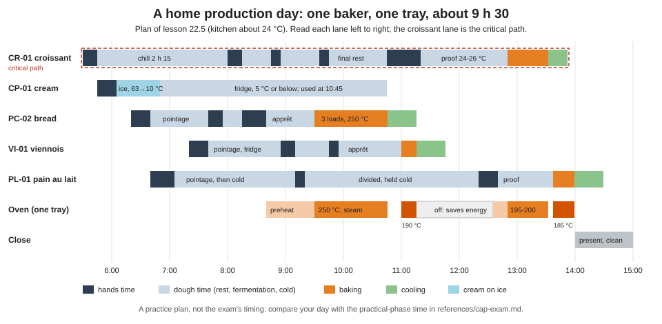

# 22.5 · Production Day and What You Still Need

This is the course's last lesson and its biggest practice: a full production day at home, bread and butter together, four doughs and a crème pâtissière from your own organigramme, from the first weighing to the products set out and the kitchen clean. Afterwards you fill in the readiness checklist honestly and turn every unticked line into a plan, because a home kitchen can take you a long way towards the CAP Boulanger, but not all the way.

## Why it matters

The two half-day rehearsals taught you each half; the production test asks for both at once, with the oven, the bench and your hands shared all day. Only a full day shows whether your plan holds when the croissant turns fall in the middle of your bread shaping, and how tired you are at 13:00 when the pains aux raisins still need their egg wash. It also shows, clearly, what this course cannot give you: a spiral mixer, a sheeter, a deck oven, exam-size batches and hours in a real fournil. Seeing that gap precisely is the starting point of the last stretch of your preparation.

## Key terms

| French | Say it | English meaning |
|---|---|---|
| journée de production | *zhoor-NAY duh pro-dük-SYOHN* | production day: the whole order, made, presented and cleaned up in one day |
| présentation des produits | *pray-zahn-ta-SYOHN day pro-DWEE* | setting out the finished products neatly, by family, counted and labelled |
| non-conformité | *nohn-kohn-for-mee-TAY* | a product or step that does not meet its standard (weight, look, temperature) |
| dysfonctionnement | *dees-fohnk-syohn-MAHN* | a malfunction: an equipment failure or a plan that broke |
| PFMP | *pay-ef-em-PAY* | période de formation en milieu professionnel: workplace training period of the school pathway |
| candidat individuel (candidat libre) | *kahn-dee-DA an-dee-vee-dü-EL* | candidate who registers alone and sits one-off tests |
| inscription | *an-skreep-SYOHN* | registration for the exam with your académie, within its dates |
| fournil | *foor-NEEL* | the bakery's production room |

## How it works

### The full day at home

The day joins lessons 22.3 and 22.4 with one change: the détrempe is mixed in the first minutes of the day, not the evening before, so the laminated dough is the critical path again, as in lessons [14.4](../module-14/lesson-04.md) and [22.2](lesson-02.md). Everything else fits into its rests. The oven is a queue of seven loads: three bread loads at 250 °C with steam, the viennois at 190 °C, then a pause, then the laminated products at 195-200 °C and the pain au lait at about 185 °C.

The simulation holds the reference plan below, with the seven loads in the one-tray oven's lane. Change the kitchen temperature, move a stage or the oven's switch-on time, and see which lane turns red before you write your own organigramme.

[Simulation: The home production day with a one-tray oven](../../simulations/production-schedule/index.html?preset=home-day)

Three principles carry the day:

1. **Critical path first, everything else in its gaps.** The détrempe is mixed at 5:30 and the cream at 5:45; the bread is mixed while the détrempe chills, shaped between the turns, and baked during the final rest.
2. **The oven is switched off when it has nothing to do.** Between the viennois (11:16) and the croissants (12:50), an empty oven at 200 °C would run for 90 minutes for nothing; switching it off and back on at 12:35 is the energy rule of lesson [18.1](../module-18/lesson-01.md), and an examiner can see it (lesson [22.1](lesson-01.md)).
3. **Slow places are planned, not improvised.** Each waiting dough has a named place: the fridge (rolls, pain au lait, viennois between pointage and dividing), the coolest corner (boule and fendu), the air-conditioned room at 24-26 °C (laminated pieces).

### What a home rehearsal cannot give you

Be clear about this before you fill in the checklist. The table separates what you can still improve at home from what needs a real bakery and what is administrative. The rules themselves (registration dates, workplace-training requirements, general subjects, exemptions) are in [The CAP Boulanger Exam](../../references/cap-exam.md) and on your académie's site; this table only points to them.

| What you still need | Why home practice is not enough | Where it comes from | Rules |
|---|---|---|---|
| Hours on a spiral mixer, a sheeter and a deck oven | Mixing by machine, the final sheet on a sheeter and loading a deck change times and results; their safety habits need real machines (lessons [13.2](../module-13/lesson-02.md), [13.4](../module-13/lesson-04.md)) | Work or training in a bakery; a training centre's practical sessions | What the test asks for by machine and by hand: exam reference |
| Exam-size batches at speed | Dividing and shaping several kilos of dough in the time is a different skill from 1 kg at home | Daily production in a bakery | Product families and quantities: exam reference |
| A real fournil's rhythm, team and deliveries | Receiving goods, working beside sales staff and reporting to a chef are only scenarios at home | A job, an internship or the school pathway's PFMP | PFMP on the school pathway; certificates some académies ask individual candidates for |
| Registration as a candidate | Nothing in this course registers you | Your académie's exam division, within its dates | Exam reference, section on individual candidates |
| The general subjects (unless exempt) | This course covers the bakery tests only | Separate preparation, or an exemption from earlier diplomas | Exam reference, blocks and exemptions |
| Your own clothing and protective equipment | Rehearsing in them is possible at home; having them on the day is a condition | Catering-clothing suppliers | Your convocation |

> [!IMPORTANT]
> This course is a CAP Boulanger preparation. It does not award the CAP, and its completion certificate is not a diploma. The CAP is a French national diploma awarded by the Ministry of Education after the official examination ([exam reference](../../references/cap-exam.md)).

## Worked example

Maya, who prepares from Haifa as an individual candidate, ran her first full production day on a Friday in March (kitchen 21 °C) and her second in May (kitchen 26 °C, AC room 24 °C).

**Planned against real, first day.**

| Block | Planned | Real | Note |
|---|---|---|---|
| Whole day | 5:30-15:00 | 5:30-16:10 | 70 minutes over |
| PC-02 dividing and shaping | 40 min | 62 min | slowest block of the day |
| Laminated sheet, cut and shape | 35 min | 55 min | sheet rolled by hand, rested twice |
| Oven queue | 7 loads, 2 gaps | 7 loads, one tray waited 25 min on the counter | rolls out of the fridge late again |
| Cleaning slots | 3 | 1 | bench cluttered from 10:00 |

**Her non-conformity notes** (lesson [19.1](../module-19/lesson-01.md) order: facts and figures, what I did, what I propose):

- "Pains aux raisins 4 of 4 under-baked at the base, colour 2 on the scale at the bottom. Baked on the middle shelf, 18 minutes. Re-baked 3 minutes on the lowest shelf. Propose: lowest shelf, 20-22 minutes, cream 2 mm."
- "Oven dial 250 °C, oven thermometer 232 °C after 45 minutes. Baked the bread 3 minutes longer. Propose: preheat 60 minutes; set dial to the maximum and check with the thermometer."

**Scores** with the [quality rubric](../../templates/quality-rubric.md): pain courant 15, viennois 16, croissants 14, pains au chocolat 15, pains aux raisins 11, pain au lait 16. Observer's checklist: 78 % of process lines.

**Second day.** She drilled dividing (15 pieces in 15 minutes, three evenings), used the compressed laminated chain of lesson 22.2 with her freezer, and a stand mixer for the bread. Day: 5:30-14:35. Pains aux raisins 15, process lines 90 %.

**Her readiness checklist after day 2.** Ticked: the EP2 written phase lines, dough temperature, dividing to weight, shaping the bread families, the other bread, the pain au lait shapes. Not ticked: "I have worked on a spiral mixer, a deck oven and a sheeter"; "a full production day in the exam's time" (her home day is longer, see the exam reference for the real time); and the administrative block. Her plan:

| Unticked line | Action | By when |
|---|---|---|
| Spiral mixer, deck oven, sheeter | Ask local bakeries for early-morning work or a trial period; a short practical course on professional equipment | before the exam session |
| Full day in the exam's time | Third rehearsal after the bakery hours, timed against the exam reference | after the bakery hours |
| Registration | Read her académie's dates for individual candidates and register within them | the registration window |
| General subjects and exemptions | Ask the académie for the exemption rules for her foreign diploma | before registering |
| Workplace-training certificates | Check whether her académie asks individual candidates in the CAP Boulanger for them | before registering |

She also notes what she will **not** claim: her home rubric scores are not an exam mark, and her course certificate is not a CAP.

## Practice

The capstone of the course: a full home production day from your own plan, then the readiness checklist and your plan for what you still need. The project [Production Day](../../projects/m22-production-day.md) gives the order, the deliverables and the rubric for the same day; do this practice as that project.

### You need

- Everything from lessons [22.3](lesson-03.md) and [22.4](lesson-04.md): scales, probe and oven thermometers, bowls, scraper, bench knife, containers, couche or cloths, banneton, rolling pin, ruler, pizza wheel, scissors, lame, brush, saucepan and whisk, ice and a shallow tray, film, two trays, baking paper, metal steam tray, oven gloves, racks, labels.
- Documents: your organigramme on the [template](../../templates/organigramme.md), [production sheets](../../templates/production-sheet.md), the [temperature log](../../templates/temperature-log.md), the [bake log](../../templates/bake-log.md), the [quality rubric](../../templates/quality-rubric.md), the observation checklist (lesson 22.1), the [non-conformity report](../../templates/non-conformity-report.md) and the [readiness checklist](../../templates/readiness-checklist.md).
- A whole free day, an observer for at least part of it, and someone to taste.
- Professional equivalent: an exam-centre or bakery fournil with a spiral mixer, sheeter, deck and fan ovens, proofing cabinet and blast chiller.

### Ingredients

The batches of lessons 22.3 and 22.4, all on the same day:

| Dough | Home batch | Products |
|---|---|---|
| Pâte fermentée (evening before) | 100 g flour, 64 g water, 1.8 g salt, 1.5 g fresh yeast | 150 g for PC-02 |
| PC-02 pain courant | 1,000 g T55, 640 g water, 18 g salt, 15 g fresh yeast, 150 g pâte fermentée = 1,823 g | 2 baguettes + 1 épi of 270 g; boule + fendu of 280 g; 6 rolls of 60 g in 3 shapes |
| VI-01 pain viennois | 500 g flour, 290 g whole milk, 9 g salt, 17.5 g fresh yeast, 30 g sugar, 50 g butter = 896.5 g | 3 baguettes viennoises of 280 g |
| CR-01 laminated | 500 g T45: détrempe 885 g; 250 g butter (≥ 82 % fat) = 1,135 g; 8 chocolate batons | 4 croissants 60 g, 4 pains au chocolat 58 g, 4 pains aux raisins |
| CP-01 crème pâtissière | 200 g milk, 32 g yolks, 44 g sugar, 18 g cornstarch; 30 g raisins | about 75 g used |
| PL-01 pain au lait | 250 g flour, 130 g milk, 25 g egg, 25 g sugar, 5 g salt, 9 g fresh yeast, 45 g butter ≈ 489 g | braid 3 × 80 g, 2 navettes 50 g, 2 hedgehogs 60 g |
| Egg wash | 2 eggs + salt | all egg-washed products |

### In Israel

Checked 2026-10-09.

- **Pick the season.** A full day with 9 hours of oven and dough work is far easier from October to April. In summer (coastal nights about 23-24 °C, afternoons about 29-30 °C) start at 5:00, laminate and proof the viennoiserie in the air-conditioned room, use fridge water and milk for every dough (water temperatures as in lessons 22.3 and 22.4), and expect every bread proof to be about a third shorter than the plan.
- **Ingredients:** white flour (קמח לבן) for every dough ([Flour in Israel](../../references/flour-in-israel.md)); block butter with about 80-82 g fat per 100 g; bake-stable chocolate sticks or a cut dark bar; raisins checked for sulphites; full-fat milk; eggs kept in the fridge.
- **One oven, one tray:** the plan is built for it. If you have a second oven or a large oven with two shelves that bakes evenly (check with the hot-spot test of lesson [13.4](../module-13/lesson-04.md)), bake the boule and fendu with the rolls and gain 20 minutes.
- **Getting fournil hours.** Israeli bakeries with deck ovens and spiral mixers exist in every city; many work at night and in the early morning. Asking for early-morning work or a trial shift is the most direct way to get hours on professional machines. It is not French training and it does not count as a PFMP; it does build the speed and machine habits the home kitchen cannot.
- **The exam is in France.** Registration, the convocation, the protective equipment and any workplace-training certificates follow your French académie's rules, whatever you do in Israel (see the exam reference).

### Steps

> [!WARNING]
> A full day means the oven runs for hours and you will be tired by early afternoon, when burns and cuts happen. Keep oven gloves dry and at hand; steam only into a metal tray preheated in the oven, never into glass or ceramic; pour and step back; score and snip with the blade moving away from your fingers; keep the floor dry (flour and water make it slippery); take a 10-minute break with water at about 11:50. If a stand mixer is used, never reach into the bowl while it runs.

> [!CAUTION]
> Raw egg (cream, egg wash, pain au lait) and allergens (gluten, milk, egg, soy in chocolate, sulphites in raisins) run through the whole day: separate bowl and brush for egg wash, hands washed after eggs, cream cooled within 2 hours and kept cold, every product labelled if others eat it.

1. **Two weeks before:** write your organigramme for the day on the template, from your kitchen's measured oven times (lesson [14.3](../module-14/lesson-03.md)) and the reference plan below. Check it with the six steps of lesson 22.2. Arrange the observer and the taster.
2. **The evening before:** pâte fermentée; equipment out; labels written; plan printed and on the wall; in summer, the CR-01 flour in the fridge.
3. **The day:** follow your plan. At every stage write the real time beside the planned one, and every temperature on the log. When a dough is off target, decide, write the decision and its reason (lesson 22.3), and carry on.
4. **Report** each non-conformity or malfunction as it happens, in the order facts and figures → what I did → what I propose, on the non-conformity report.
5. **Present** all products together after cooling: by family, counted, on a clean board or tray, labelled with name and allergens; one baguette, the boule and one croissant cut.
6. **Score** every product with the rubric; collect the observer's checklist and the taster's comments.
7. **Review** the day as in the worked example: planned against real for each block, the three biggest gaps and their causes.
8. **Readiness checklist:** tick only what you can do now, without notes, at the standard described; next to each tick write the date and the evidence (bake log, rubric score, observer). For each unticked line write one action and a date.
9. **Repeat** the day after your actions: a second day is where most of the progress shows.

Reference plan for the day (kitchen about 24 °C, AC room available, oven 45 minutes to 250 °C)

| Time | You | Doughs and oven meanwhile |
|---|---|---|
| 5:30-5:45 | weigh CR-01; détrempe by hand, 20 °C; flatten, film, fridge | chill until 8:00 |
| 5:45-6:05 | cook CP-01; shallow tray on ice; log 63 °C | cream to 10 °C by about 6:50, then fridge |
| 6:05-6:20 | readings; water and milk temperatures; weigh PC-02, PL-01, VI-01 | |
| 6:20-6:40 | PC-02 by hand, 24 °C | pointage until 7:40, fold 7:10 |
| 6:40-7:05 | PL-01 by hand, 24 °C | pointage until 7:50, then flattened in the fridge |
| 7:05-7:20 | butter plaque to the fridge; soak raisins; (PC fold 7:10; cream log) | |
| 7:20-7:40 | VI-01 by hand, 25 °C | pointage until 8:15, then flattened in the fridge |
| 7:40-7:55 | PC divide and pre-shape; 75 g pâte fermentée to the fridge; (PL to the fridge) | détente until 8:15 |
| 8:00-8:15 | lock-in and turn 1 | rest until 8:45 |
| 8:15-8:40 | PC shape: baguettes and épi pâton, boule and fendu (coolest place), rolls (fridge); (VI to the fridge) | apprêt |
| 8:40 | oven on, 250 °C, steam tray in | |
| 8:45-8:55 | turn 2 | rest until 9:35 |
| 8:55-9:10 | VI divide 3 × 280 g, pre-shape | détente |
| 9:10-9:25 | PL divide, back to the fridge; trays and paper | |
| 9:25-9:30 | cut the épi, score, **load 1**: baguettes and épi, steam | bake until 9:55 |
| 9:35-9:45 | turn 3 | final rest until at least 10:45 |
| 9:45-9:55 | VI shape, first egg wash; (rolls out of the fridge) | apprêt until 11:00 |
| 10:00 | **load 2**: boule and fendu, steam | bake until 10:28 |
| 10:00-10:30 | clean bench and bowls; batons, egg wash, raisins, cream ready | |
| 10:30 | **load 3**: rolls, steam | bake until 10:46; then door open to 190 °C, steam tray out |
| 10:45-11:20 | roll and cut: pains aux raisins, then (11:00 **load 4**: VI, second egg wash, cuts, no steam) pains au chocolat and croissants; first egg wash; AC room 24-26 °C | VI out 11:16; oven off |
| 11:20-11:50 | clean rolling pin and bench; weigh and check the bread; bake log | |
| 11:50-12:20 | break with water; tidy; labels | |
| 12:20-12:40 | PL shape: braid, navettes, hedgehogs; first egg wash; 25-27 °C | proof until about 13:37; oven on at 12:35 to 200 °C |
| 12:40-12:50 | second egg wash; **load 5**: croissants and pains au chocolat | bake until 13:08 |
| 13:08-13:12 | **load 6**: pains aux raisins | bake until 13:32; then door open to 185 °C |
| 13:15-13:30 | PL second egg wash; snip the hedgehogs | |
| 13:37 | **load 7**: pain au lait | small pieces out about 13:50, braid 13:59; oven off |
| 13:40-14:30 | clean down; cut a croissant; weigh the viennoiserie | pain au lait cooled about 14:29 |
| 14:30-15:00 | present all products; score; final clean | |

Critical path: CR-01, 5:30 to cooled croissants about 13:30, about 8 hours with the course sheet's minimum rests. On a second day, the compressed chain of lesson 22.2 (freezer, one double turn, shorter final rest) brings the whole day forward by about an hour.

### Targets

- Every dough within **± 1 °C** of its target, logged; cream **63 → 10 °C within 2 hours**, logged.
- Every product present in the planned count; pieces within **± 2 g** at division; croissants **60 g ± 3 g**.
- Every load into the oven within **10 minutes** of its plan; no tray left warm on the counter; oven off when idle.
- At least **80 %** of the observer's process lines ticked; station clean within **15 minutes** of the last load.
- Rubric **14/20 or more** for every product family; any family below it has a cause and an action written.
- Readiness checklist completed, with evidence for every tick and an action and date for every unticked line.

### How you know it worked

You finish with a table of products you would put in a shop window, a log that explains every gap between plan and reality, and a short, dated list of what you still need that names real places and actions: bakery hours, machines, registration, general subjects. You can say precisely how far your home day is from the exam's conditions, and you do not mistake your rubric scores for an exam mark.

### Self-check

- [ ] I wrote my own organigramme for the full day and followed it, logging real times beside planned ones.
- [ ] I kept hygiene, safety, energy and cleaning habits all day, not only at the start.
- [ ] I reported non-conformities and malfunctions in professional terms as they happened.
- [ ] I presented, counted, weighed and scored every product after cooling.
- [ ] I filled in the readiness checklist with evidence and turned every unticked line into a dated action.
- [ ] I know this course is a preparation: it does not award the CAP, and self-assessment does not replace the official exam.

## What goes wrong

| Symptom | Likely cause | Fix now | Prevent next time |
|---|---|---|---|
| Day runs an hour or more over plan | Hands blocks (dividing, shaping, rolling) slower than planned | Keep the critical path on time; let a bread load slip, not the croissants | Time each block in drills; plan with your measured times |
| Two trays ready, one oven | Proofing places not set, or a load late | Slow one tray in the fridge at once | Named slow places on the plan; alarms for "out of the fridge" |
| Bench cluttered by mid-morning; hygiene slips late in the day | No cleaning slots; fatigue | Stop for 5 minutes, clear and wash hands | Three cleaning slots and a break on the plan |
| Oven at 200 °C for 90 minutes with nothing in it | Oven plan not written for the gap | Switch it off now | Write "off" and "on" times on the oven plan |
| Readiness checklist all ticked after one day | Ticked by hope, not evidence | Untick every line without a date and evidence | Tick only with evidence: log, score, observer |
| Planning stops at the kitchen door | Administrative and physical needs not turned into actions | Write one action and a date per unticked line | Read the exam reference and your académie's page each month until registration |

## Review

- A full production day joins both rehearsals around one critical path, the laminated dough, with a planned oven queue, named slow places and the oven off when idle.
- Hygiene, safety, cleaning and reporting are part of the day all day long, and they are what an observer sees.
- A home kitchen cannot give you professional machines, exam-size batches, a real fournil's rhythm, registration or the general subjects: the [readiness checklist](../../templates/readiness-checklist.md) turns each of these into a dated action, and the rules are in [The CAP Boulanger Exam](../../references/cap-exam.md).
- This course is a CAP Boulanger preparation: it does not award the diploma, and your self-assessment does not replace the official exam.
